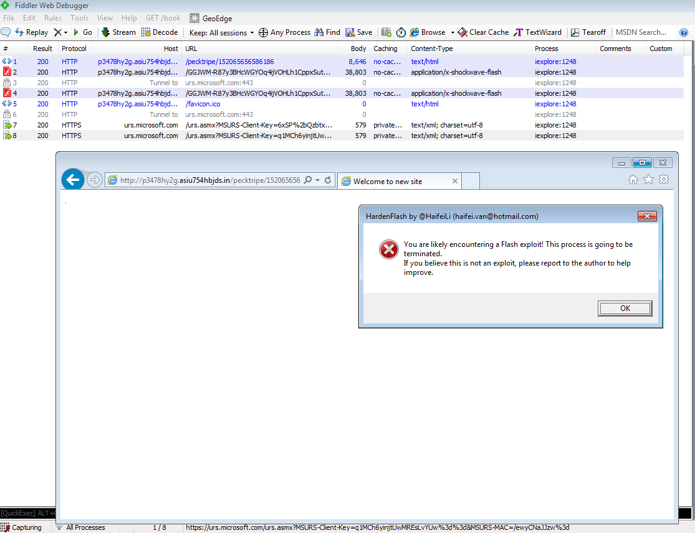

# HaifeiLi
**https://twitter.com/HaifeiLi/status/603644838702092289 _at 2015-05-27, 19:31:59_**
<blockquote>
New #Flash #exploit coming? No worries. #HardenFlash (https://t.co/JY0DQhcoMf) stops it with no mercy! #CVE-2015-3090 http://t.co/XDwXOfd0K8
</blockquote>

* https://github.com/HaifeiLi/HardenFlash

<table><tr>
<td></td>
</table></tr>
<table><tr>
<td>Quotes: <code>0</code></td>
<td>Replies: <code>1</code></td>
<td>Retweets: <code>35</code></td>
<td>Favorites: <code>35</code></td>
</tr></table>

---

# HaifeiLi
**https://twitter.com/HaifeiLi/status/603644838702092289 _at 2015-05-27, 19:31:59_**
<blockquote>
New #Flash #exploit coming? No worries. #HardenFlash (https://t.co/JY0DQhcoMf) stops it with no mercy! #CVE-2015-3090 http://t.co/XDwXOfd0K8
</blockquote>

* https://github.com/HaifeiLi/HardenFlash

<table><tr>
<td></td>
</table></tr>
<table><tr>
<td>Quotes: <code>0</code></td>
<td>Replies: <code>1</code></td>
<td>Retweets: <code>35</code></td>
<td>Favorites: <code>35</code></td>
</tr></table>

---

# HaifeiLi
**https://twitter.com/HaifeiLi/status/603644838702092289 _at 2015-05-27, 19:31:59_**
<blockquote>
New #Flash #exploit coming? No worries. #HardenFlash (https://t.co/JY0DQhcoMf) stops it with no mercy! #CVE-2015-3090 http://t.co/XDwXOfd0K8
</blockquote>

* https://github.com/HaifeiLi/HardenFlash

<table><tr>
<td></td>
</table></tr>
<table><tr>
<td>Quotes: <code>0</code></td>
<td>Replies: <code>1</code></td>
<td>Retweets: <code>35</code></td>
<td>Favorites: <code>35</code></td>
</tr></table>

---

# HaifeiLi
**https://twitter.com/HaifeiLi/status/603644838702092289 _at 2015-05-27, 19:31:59_**
<blockquote>
New #Flash #exploit coming? No worries. #HardenFlash (https://t.co/JY0DQhcoMf) stops it with no mercy! #CVE-2015-3090 http://t.co/XDwXOfd0K8
</blockquote>

* https://github.com/HaifeiLi/HardenFlash

<table><tr>
<td></td>
</table></tr>
<table><tr>
<td>Quotes: <code>0</code></td>
<td>Replies: <code>1</code></td>
<td>Retweets: <code>35</code></td>
<td>Favorites: <code>35</code></td>
</tr></table>

---

