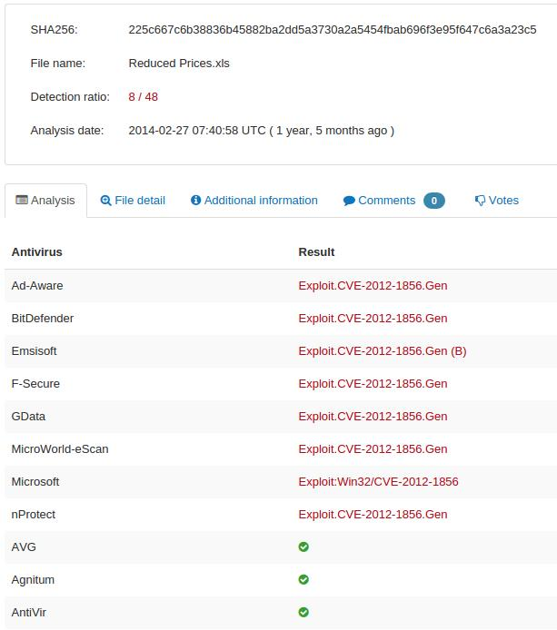

# ropchain
**https://twitter.com/ropchain/status/625680759714639872 _at 2015-07-27, 14:54:52_**
<blockquote>
Analysis of VUPEN's CVE-2012-1856 TabStrip UAF being exploited ITW --&gt; http://t.co/gXX1suPe5D  cc @PhysicalDrive0 http://t.co/P20CYt7dwN
</blockquote>

* http://blog.ropchain.com/2015/07/27/analyzing-vupens-cve-2012-1856/

<table><tr>
<td></td>
</table></tr>
<table><tr>
<td>Quotes: <code>0</code></td>
<td>Replies: <code>1</code></td>
<td>Retweets: <code>31</code></td>
<td>Favorites: <code>23</code></td>
</tr></table>

---

# mj0011sec
**https://twitter.com/mj0011sec/status/619767979304091648 _at 2015-07-11, 07:19:35_**
<blockquote>
Hacking Team new flash 0day CVE-2015-5122 detailed analysis by 360Vulcan Team https://t.co/RhfbN8pyFx
</blockquote>

* https://translate.googleusercontent.com/translate_c?depth=1&nv=1&rurl=translate.google.com&sl=auto&tl=en&u=http://blogs.360.cn/360safe/2015/07/11/hacking-team-part4-flash-2/&usg=ALkJrhgv03muORmwqpxnG-QbKEkImhMnCQ

<table><tr>
<td>Quotes: <code>0</code></td>
<td>Replies: <code>0</code></td>
<td>Retweets: <code>78</code></td>
<td>Favorites: <code>54</code></td>
</tr></table>

---

# ropchain
**https://twitter.com/ropchain/status/625680759714639872 _at 2015-07-27, 14:54:52_**
<blockquote>
Analysis of VUPEN's CVE-2012-1856 TabStrip UAF being exploited ITW --&gt; http://t.co/gXX1suPe5D  cc @PhysicalDrive0 http://t.co/P20CYt7dwN
</blockquote>

* http://blog.ropchain.com/2015/07/27/analyzing-vupens-cve-2012-1856/

<table><tr>
<td></td>
</table></tr>
<table><tr>
<td>Quotes: <code>0</code></td>
<td>Replies: <code>1</code></td>
<td>Retweets: <code>31</code></td>
<td>Favorites: <code>23</code></td>
</tr></table>

---

# mj0011sec
**https://twitter.com/mj0011sec/status/619767979304091648 _at 2015-07-11, 07:19:35_**
<blockquote>
Hacking Team new flash 0day CVE-2015-5122 detailed analysis by 360Vulcan Team https://t.co/RhfbN8pyFx
</blockquote>

* https://translate.googleusercontent.com/translate_c?depth=1&nv=1&rurl=translate.google.com&sl=auto&tl=en&u=http://blogs.360.cn/360safe/2015/07/11/hacking-team-part4-flash-2/&usg=ALkJrhgv03muORmwqpxnG-QbKEkImhMnCQ

<table><tr>
<td>Quotes: <code>0</code></td>
<td>Replies: <code>0</code></td>
<td>Retweets: <code>78</code></td>
<td>Favorites: <code>54</code></td>
</tr></table>

---

# ropchain
**https://twitter.com/ropchain/status/625680759714639872 _at 2015-07-27, 14:54:52_**
<blockquote>
Analysis of VUPEN's CVE-2012-1856 TabStrip UAF being exploited ITW --&gt; http://t.co/gXX1suPe5D  cc @PhysicalDrive0 http://t.co/P20CYt7dwN
</blockquote>

* http://blog.ropchain.com/2015/07/27/analyzing-vupens-cve-2012-1856/

<table><tr>
<td></td>
</table></tr>
<table><tr>
<td>Quotes: <code>0</code></td>
<td>Replies: <code>1</code></td>
<td>Retweets: <code>31</code></td>
<td>Favorites: <code>23</code></td>
</tr></table>

---

# mj0011sec
**https://twitter.com/mj0011sec/status/619767979304091648 _at 2015-07-11, 07:19:35_**
<blockquote>
Hacking Team new flash 0day CVE-2015-5122 detailed analysis by 360Vulcan Team https://t.co/RhfbN8pyFx
</blockquote>

* https://translate.googleusercontent.com/translate_c?depth=1&nv=1&rurl=translate.google.com&sl=auto&tl=en&u=http://blogs.360.cn/360safe/2015/07/11/hacking-team-part4-flash-2/&usg=ALkJrhgv03muORmwqpxnG-QbKEkImhMnCQ

<table><tr>
<td>Quotes: <code>0</code></td>
<td>Replies: <code>0</code></td>
<td>Retweets: <code>78</code></td>
<td>Favorites: <code>54</code></td>
</tr></table>

---

# ropchain
**https://twitter.com/ropchain/status/625680759714639872 _at 2015-07-27, 14:54:52_**
<blockquote>
Analysis of VUPEN's CVE-2012-1856 TabStrip UAF being exploited ITW --&gt; http://t.co/gXX1suPe5D  cc @PhysicalDrive0 http://t.co/P20CYt7dwN
</blockquote>

* http://blog.ropchain.com/2015/07/27/analyzing-vupens-cve-2012-1856/

<table><tr>
<td></td>
</table></tr>
<table><tr>
<td>Quotes: <code>0</code></td>
<td>Replies: <code>1</code></td>
<td>Retweets: <code>31</code></td>
<td>Favorites: <code>23</code></td>
</tr></table>

---

# mj0011sec
**https://twitter.com/mj0011sec/status/619767979304091648 _at 2015-07-11, 07:19:35_**
<blockquote>
Hacking Team new flash 0day CVE-2015-5122 detailed analysis by 360Vulcan Team https://t.co/RhfbN8pyFx
</blockquote>

* https://translate.googleusercontent.com/translate_c?depth=1&nv=1&rurl=translate.google.com&sl=auto&tl=en&u=http://blogs.360.cn/360safe/2015/07/11/hacking-team-part4-flash-2/&usg=ALkJrhgv03muORmwqpxnG-QbKEkImhMnCQ

<table><tr>
<td>Quotes: <code>0</code></td>
<td>Replies: <code>0</code></td>
<td>Retweets: <code>78</code></td>
<td>Favorites: <code>54</code></td>
</tr></table>

---

