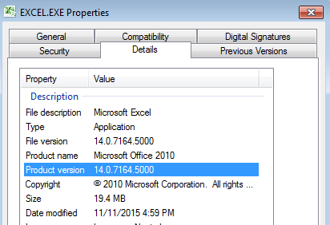

# nVisium
**https://twitter.com/nVisium/status/692007308621135872 _at 2016-01-26, 15:32:53_**
<blockquote>
PoC Exploit (and Analysis) of yesterday’s CVE-2016-0752 - Rails Remote Code Execution by @forced_request: https://t.co/s62EEbr8NB
</blockquote>

* https://nvisium.com/blog/2016/01/26/rails-dynamic-render-to-rce-cve-2016-0752/

<table><tr>
<td>Quotes: <code>0</code></td>
<td>Replies: <code>3</code></td>
<td>Retweets: <code>89</code></td>
<td>Favorites: <code>71</code></td>
</tr></table>

---

# zebasquared
**https://twitter.com/zebasquared/status/689862330704879619 _at 2016-01-20, 17:29:31_**
<blockquote>
This ASLR bypass exploit is for CVE-2015-6068 awesome learning/teaching material! https://t.co/W0eRnqlwdo
</blockquote>

* https://github.com/payatu/CVE-2015-6086/blob/master/OOB_Read_IE10_IE11_ASLR_Bypass.html

<table><tr>
<td>Quotes: <code>0</code></td>
<td>Replies: <code>0</code></td>
<td>Retweets: <code>37</code></td>
<td>Favorites: <code>68</code></td>
</tr></table>

---

# EternalToDo
**https://twitter.com/EternalToDo/status/689731003364032512 _at 2016-01-20, 08:47:40_**
<blockquote>
Analyzing/exploiting a new Linux kernel vulnerability (CVE-2016-0728): memory leak + UaF https://t.co/tkvmGrtVId PoC https://t.co/5pTJvVSzXq
</blockquote>

* http://perception-point.io/2016/01/14/analysis-and-exploitation-of-a-linux-kernel-vulnerability-cve-2016-0728/
* https://gist.github.com/PerceptionPointTeam/18b1e86d1c0f8531ff8f

<table><tr>
<td>Quotes: <code>0</code></td>
<td>Replies: <code>0</code></td>
<td>Retweets: <code>47</code></td>
<td>Favorites: <code>37</code></td>
</tr></table>

---

# HackSysTeam
**https://twitter.com/HackSysTeam/status/689091608680239104 _at 2016-01-18, 14:26:56_**
<blockquote>
From Crash to Exploit: CVE-2015-6086 - Out of Bound Read/ASLR Bypass write-up and exploit.
https://t.co/oBDocGyI7F
https://t.co/dkqNYwOfp8
</blockquote>

* http://www.payatu.com/from-crash-to-exploit/
* https://github.com/payatu/CVE-2015-6086

<table><tr>
<td>Quotes: <code>0</code></td>
<td>Replies: <code>3</code></td>
<td>Retweets: <code>86</code></td>
<td>Favorites: <code>91</code></td>
</tr></table>

---

# eromang
**https://twitter.com/eromang/status/688670070214643712 _at 2016-01-17, 10:31:54_**
<blockquote>
#Microsoft #Excel RCE MS16-004 CVE-2016-0035 analysis https://t.co/FcXwXrOTbY https://t.co/OEZEuu7fgw
</blockquote>

* http://bit.ly/1ZEwOQs

<table><tr>
<td></td>
</table></tr>
<table><tr>
<td>Quotes: <code>0</code></td>
<td>Replies: <code>1</code></td>
<td>Retweets: <code>67</code></td>
<td>Favorites: <code>59</code></td>
</tr></table>

---

