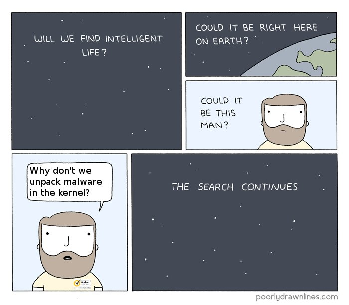

# binitamshah
**https://twitter.com/binitamshah/status/736360613140520961 _at 2016-05-28, 00:57:05_**
<blockquote>
Exploiting GLIBC - Hacking Everything (Leveraging CVE-2015-7547 for ASLR
Bypass &amp; RCE) : https://t.co/MYZhO5Cbw8 (Slides) #HITB2016AMS
</blockquote>

* http://conference.hitb.org/hitbsecconf2016ams/materials/D1%20COMMSEC%20-%20Nadav%20Markus%20and%20Gal%20De%20Leon%20-%20Exploiting%20GLIBC%20-%20Hacking%20Everything.pdf

<table><tr>
<td>Quotes: <code>0</code></td>
<td>Replies: <code>0</code></td>
<td>Retweets: <code>33</code></td>
<td>Favorites: <code>48</code></td>
</tr></table>

---

# 0x009AD6_810
**https://twitter.com/0x009AD6_810/status/730166126605262848 _at 2016-05-10, 22:42:25_**
<blockquote>
0day Attack in the wild.
CVE-2016-0167 Windows LPE
CVE-2016-0189 IE RCE
CVE-2016-4117 Flash RCE
</blockquote>

<table><tr>
<td>Quotes: <code>0</code></td>
<td>Replies: <code>0</code></td>
<td>Retweets: <code>76</code></td>
<td>Favorites: <code>57</code></td>
</tr></table>

---

# binitamshah
**https://twitter.com/binitamshah/status/736360613140520961 _at 2016-05-28, 00:57:05_**
<blockquote>
Exploiting GLIBC - Hacking Everything (Leveraging CVE-2015-7547 for ASLR
Bypass &amp; RCE) : https://t.co/MYZhO5Cbw8 (Slides) #HITB2016AMS
</blockquote>

* http://conference.hitb.org/hitbsecconf2016ams/materials/D1%20COMMSEC%20-%20Nadav%20Markus%20and%20Gal%20De%20Leon%20-%20Exploiting%20GLIBC%20-%20Hacking%20Everything.pdf

<table><tr>
<td>Quotes: <code>0</code></td>
<td>Replies: <code>0</code></td>
<td>Retweets: <code>33</code></td>
<td>Favorites: <code>48</code></td>
</tr></table>

---

# taviso
**https://twitter.com/taviso/status/732365178872856577 _at 2016-05-17, 00:20:39_**
<blockquote>
Kernel memory corruption in Symantec/Norton antivirus, CVE-2016-2208 (more patches soon). https://t.co/Sqhm0a48Fp https://t.co/F22xDIelSU
</blockquote>

* https://bugs.chromium.org/p/project-zero/issues/detail?id=820

<table><tr>
<td></td>
</table></tr>
<table><tr>
<td>Quotes: <code>12</code></td>
<td>Replies: <code>21</code></td>
<td>Retweets: <code>1804</code></td>
<td>Favorites: <code>1822</code></td>
</tr></table>

---

# 0x009AD6_810
**https://twitter.com/0x009AD6_810/status/730166126605262848 _at 2016-05-10, 22:42:25_**
<blockquote>
0day Attack in the wild.
CVE-2016-0167 Windows LPE
CVE-2016-0189 IE RCE
CVE-2016-4117 Flash RCE
</blockquote>

<table><tr>
<td>Quotes: <code>0</code></td>
<td>Replies: <code>0</code></td>
<td>Retweets: <code>76</code></td>
<td>Favorites: <code>57</code></td>
</tr></table>

---

# binitamshah
**https://twitter.com/binitamshah/status/736360613140520961 _at 2016-05-28, 00:57:05_**
<blockquote>
Exploiting GLIBC - Hacking Everything (Leveraging CVE-2015-7547 for ASLR
Bypass &amp; RCE) : https://t.co/MYZhO5Cbw8 (Slides) #HITB2016AMS
</blockquote>

* http://conference.hitb.org/hitbsecconf2016ams/materials/D1%20COMMSEC%20-%20Nadav%20Markus%20and%20Gal%20De%20Leon%20-%20Exploiting%20GLIBC%20-%20Hacking%20Everything.pdf

<table><tr>
<td>Quotes: <code>0</code></td>
<td>Replies: <code>0</code></td>
<td>Retweets: <code>33</code></td>
<td>Favorites: <code>48</code></td>
</tr></table>

---

# taviso
**https://twitter.com/taviso/status/732365178872856577 _at 2016-05-17, 00:20:39_**
<blockquote>
Kernel memory corruption in Symantec/Norton antivirus, CVE-2016-2208 (more patches soon). https://t.co/Sqhm0a48Fp https://t.co/F22xDIelSU
</blockquote>

* https://bugs.chromium.org/p/project-zero/issues/detail?id=820

<table><tr>
<td></td>
</table></tr>
<table><tr>
<td>Quotes: <code>12</code></td>
<td>Replies: <code>21</code></td>
<td>Retweets: <code>1804</code></td>
<td>Favorites: <code>1822</code></td>
</tr></table>

---

# 0x009AD6_810
**https://twitter.com/0x009AD6_810/status/730166126605262848 _at 2016-05-10, 22:42:25_**
<blockquote>
0day Attack in the wild.
CVE-2016-0167 Windows LPE
CVE-2016-0189 IE RCE
CVE-2016-4117 Flash RCE
</blockquote>

<table><tr>
<td>Quotes: <code>0</code></td>
<td>Replies: <code>0</code></td>
<td>Retweets: <code>76</code></td>
<td>Favorites: <code>57</code></td>
</tr></table>

---

# binitamshah
**https://twitter.com/binitamshah/status/736360613140520961 _at 2016-05-28, 00:57:05_**
<blockquote>
Exploiting GLIBC - Hacking Everything (Leveraging CVE-2015-7547 for ASLR
Bypass &amp; RCE) : https://t.co/MYZhO5Cbw8 (Slides) #HITB2016AMS
</blockquote>

* http://conference.hitb.org/hitbsecconf2016ams/materials/D1%20COMMSEC%20-%20Nadav%20Markus%20and%20Gal%20De%20Leon%20-%20Exploiting%20GLIBC%20-%20Hacking%20Everything.pdf

<table><tr>
<td>Quotes: <code>0</code></td>
<td>Replies: <code>0</code></td>
<td>Retweets: <code>33</code></td>
<td>Favorites: <code>48</code></td>
</tr></table>

---

# taviso
**https://twitter.com/taviso/status/732365178872856577 _at 2016-05-17, 00:20:39_**
<blockquote>
Kernel memory corruption in Symantec/Norton antivirus, CVE-2016-2208 (more patches soon). https://t.co/Sqhm0a48Fp https://t.co/F22xDIelSU
</blockquote>

* https://bugs.chromium.org/p/project-zero/issues/detail?id=820

<table><tr>
<td></td>
</table></tr>
<table><tr>
<td>Quotes: <code>12</code></td>
<td>Replies: <code>21</code></td>
<td>Retweets: <code>1804</code></td>
<td>Favorites: <code>1822</code></td>
</tr></table>

---

# 0x009AD6_810
**https://twitter.com/0x009AD6_810/status/730166126605262848 _at 2016-05-10, 22:42:25_**
<blockquote>
0day Attack in the wild.
CVE-2016-0167 Windows LPE
CVE-2016-0189 IE RCE
CVE-2016-4117 Flash RCE
</blockquote>

<table><tr>
<td>Quotes: <code>0</code></td>
<td>Replies: <code>0</code></td>
<td>Retweets: <code>76</code></td>
<td>Favorites: <code>57</code></td>
</tr></table>

---

