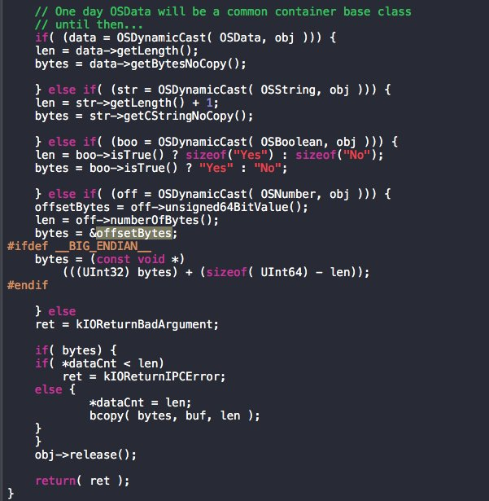

# SparkZheng
**https://twitter.com/SparkZheng/status/777422804014596097 _at 2016-09-18, 08:23:34_**
<blockquote>
CVE-2016-4655 OSNumber Kernel Information Leak (by Pangu) https://t.co/eMCVqNXuD7 https://t.co/6GETPFq9P6
</blockquote>

* http://blog.pangu.io/cve-2016-4655/

<table><tr>
<td></td>
</table></tr>
<table><tr>
<td>Quotes: <code>0</code></td>
<td>Replies: <code>4</code></td>
<td>Retweets: <code>62</code></td>
<td>Favorites: <code>110</code></td>
</tr></table>

---

# SparkZheng
**https://twitter.com/SparkZheng/status/777422804014596097 _at 2016-09-18, 08:23:34_**
<blockquote>
CVE-2016-4655 OSNumber Kernel Information Leak (by Pangu) https://t.co/eMCVqNXuD7 https://t.co/6GETPFq9P6
</blockquote>

* http://blog.pangu.io/cve-2016-4655/

<table><tr>
<td></td>
</table></tr>
<table><tr>
<td>Quotes: <code>0</code></td>
<td>Replies: <code>4</code></td>
<td>Retweets: <code>62</code></td>
<td>Favorites: <code>110</code></td>
</tr></table>

---

