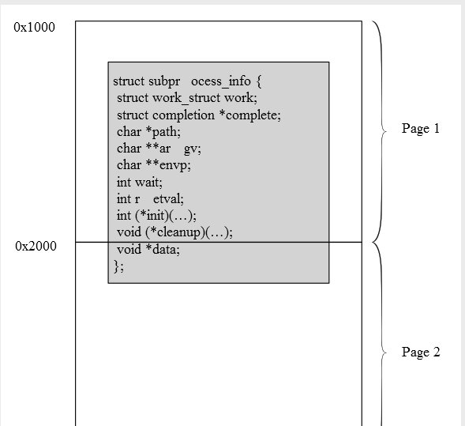
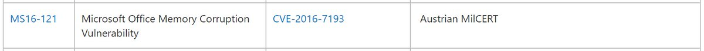

# _odisseus
**https://twitter.com/_odisseus/status/787979764443348992 _at 2016-10-17, 11:33:10_**
<blockquote>
Exploiting #Linux kernel heap using a real #UAF method against CVE-2016-6187 vulnerability. cc: @binitamshah https://t.co/yvmII8B6sz https://t.co/TvXm5IHw2s
</blockquote>

* https://cyseclabs.com/blog/cve-2016-6187-heap-off-by-one-exploit

<table><tr>
<td></td>
</table></tr>
<table><tr>
<td>Quotes: <code>1</code></td>
<td>Replies: <code>1</code></td>
<td>Retweets: <code>88</code></td>
<td>Favorites: <code>96</code></td>
</tr></table>

---

# HaifeiLi
**https://twitter.com/HaifeiLi/status/786013674179731456 _at 2016-10-12, 01:20:38_**
<blockquote>
CVE-2016-7193, an Office vuln in handling RTF, exploited as #0day attack, &amp; was reported by "Austrian MilCERT". Looks really a big deal! https://t.co/6cCcSjxMMK
</blockquote>

<table><tr>
<td></td>
</table></tr>
<table><tr>
<td>Quotes: <code>5</code></td>
<td>Replies: <code>3</code></td>
<td>Retweets: <code>47</code></td>
<td>Favorites: <code>43</code></td>
</tr></table>

---

