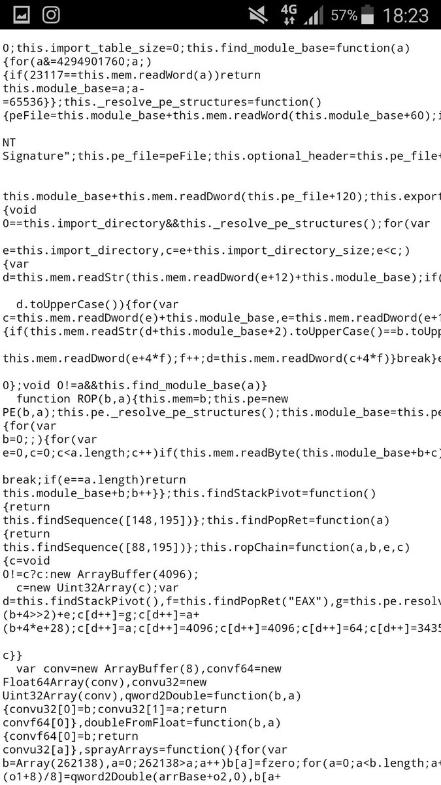
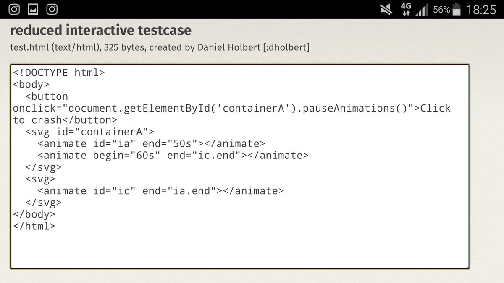

# binitamshah
**https://twitter.com/binitamshah/status/815174027593424897 _at 2016-12-31, 12:33:28_**
<blockquote>
Digging Into a Windows Kernel Privilege Escalation Vulnerability : https://t.co/oDSnlVxcgF  //*CVE-2016-7255 https://t.co/8gaAKVc63d
</blockquote>

* https://securingtomorrow.mcafee.com/mcafee-labs/digging-windows-kernel-privilege-escalation-vulnerability-cve-2016-7255/

<table><tr>
<td></td>
</table></tr>
<table><tr>
<td>Quotes: <code>3</code></td>
<td>Replies: <code>0</code></td>
<td>Retweets: <code>89</code></td>
<td>Favorites: <code>128</code></td>
</tr></table>

---

# hosselot
**https://twitter.com/hosselot/status/814758000774803456 _at 2016-12-30, 09:00:19_**
<blockquote>
Source code level analysis and exploitation of recent Firefox/tor zero-day (CVE-2016-9079):
https://t.co/UH7d5zThLE
</blockquote>

* https://community.rapid7.com/community/metasploit/blog/2016/12/29/a-friendly-fireside-foray-into-a-firefox-fracas

<table><tr>
<td>Quotes: <code>3</code></td>
<td>Replies: <code>1</code></td>
<td>Retweets: <code>85</code></td>
<td>Favorites: <code>125</code></td>
</tr></table>

---

# hosselot
**https://twitter.com/hosselot/status/814753363531329536 _at 2016-12-30, 08:41:53_**
<blockquote>
Digging Into a Windows Kernel Privilege Escalation Vulnerability: CVE-2016-7255:
https://t.co/B6rP7DcVzC
</blockquote>

* https://securingtomorrow.mcafee.com/mcafee-labs/digging-windows-kernel-privilege-escalation-vulnerability-cve-2016-7255/

<table><tr>
<td>Quotes: <code>0</code></td>
<td>Replies: <code>0</code></td>
<td>Retweets: <code>85</code></td>
<td>Favorites: <code>139</code></td>
</tr></table>

---

# TheHackersNews
**https://twitter.com/TheHackersNews/status/813704369023647744 _at 2016-12-27, 11:13:34_**
<blockquote>
Update: PHPMailer RCE (CVE-2016-10033) Exploit Code Released https://t.co/3RBzWzfpLM https://t.co/MjcAUzxoEt
</blockquote>

* http://thehackernews.com/2016/12/phpmailer-security.html

<table><tr>
<td></td>
</table></tr>
<table><tr>
<td>Quotes: <code>11</code></td>
<td>Replies: <code>0</code></td>
<td>Retweets: <code>221</code></td>
<td>Favorites: <code>150</code></td>
</tr></table>

---

# alisaesage
**https://twitter.com/alisaesage/status/805703873629331457 _at 2016-12-05, 09:22:27_**
<blockquote>
"Bug" vs. "Exploit"

1: Tor 0day (cve-2016-9079) minimized test case
2: approximately 1/10th of the original exploit code https://t.co/UAh4ZuRzac
</blockquote>

<table><tr>
<td></td>
<td></td>
</table></tr>
<table><tr>
<td>Quotes: <code>2</code></td>
<td>Replies: <code>2</code></td>
<td>Retweets: <code>116</code></td>
<td>Favorites: <code>180</code></td>
</tr></table>

---

