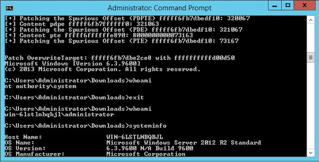

# benhawkes
**https://twitter.com/benhawkes/status/824672607404449795 _at 2017-01-26, 17:37:25_**
<blockquote>
Ian Beer's exploit for CVE-2017-2370 (kernel memory r/w on iOS 10.2):
https://t.co/Bw6dmviTzz
</blockquote>

* https://bugs.chromium.org/p/project-zero/issues/detail?id=1004

<table><tr>
<td>Quotes: <code>5</code></td>
<td>Replies: <code>5</code></td>
<td>Retweets: <code>157</code></td>
<td>Favorites: <code>190</code></td>
</tr></table>

---

# binitamshah
**https://twitter.com/binitamshah/status/819016038834642945 _at 2017-01-11, 03:00:14_**
<blockquote>
Walkthrough of CVE-2016-7255 (PrivEsc) with working POC for Windows 7, 8.1, 10, and 2012 R2 : https://t.co/DLMkFLV0WP https://t.co/GPJr8u43Pt
</blockquote>

* http://ricklarabee.blogspot.in/2017/01/virtual-memory-page-tables-and-one-bit.html

<table><tr>
<td></td>
</table></tr>
<table><tr>
<td>Quotes: <code>2</code></td>
<td>Replies: <code>0</code></td>
<td>Retweets: <code>128</code></td>
<td>Favorites: <code>164</code></td>
</tr></table>

---

