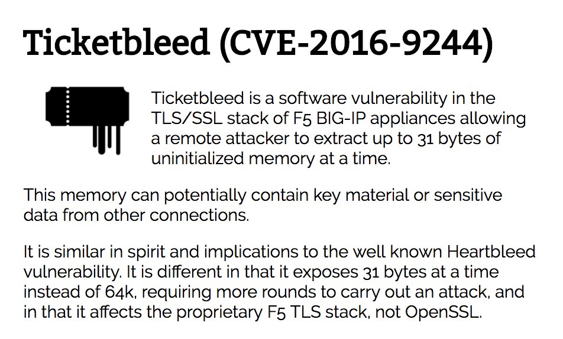

# FiloSottile
**https://twitter.com/FiloSottile/status/829507961819107330 _at 2017-02-09, 01:51:24_**
<blockquote>
Ticketbleed (CVE-2016-9244): leak of up to 31 bytes of memory via TLS Session IDs, affecting most F5 BIG-IP versions https://t.co/hoyZZzgM7i https://t.co/Gf920FcvVg
</blockquote>

* https://ticketbleed.com

<table><tr>
<td></td>
</table></tr>
<table><tr>
<td>Quotes: <code>39</code></td>
<td>Replies: <code>9</code></td>
<td>Retweets: <code>536</code></td>
<td>Favorites: <code>423</code></td>
</tr></table>

---

