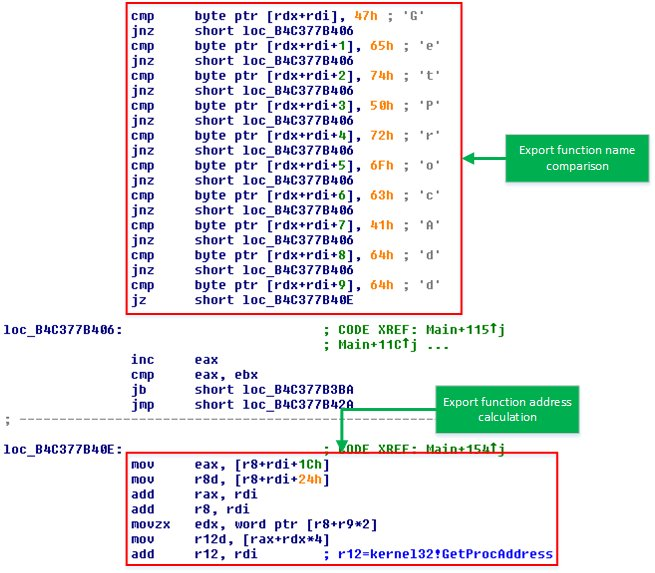
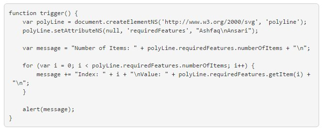

# HeikeRitter
**https://twitter.com/HeikeRitter/status/846378299433484289 _at 2017-03-27, 15:08:06_**
<blockquote>
In-depth analysis of zero-day exploit for CVE-2017-0005 reveals #Windows10 resilience
https://t.co/AXXAS0si9m v @msftmmpc https://t.co/t2N7Zaccdk
</blockquote>

* https://blogs.technet.microsoft.com/mmpc/2017/03/27/detecting-and-mitigating-elevation-of-privilege-exploit-for-cve-2017-0005/

<table><tr>
<td></td>
</table></tr>
<table><tr>
<td>Quotes: <code>1</code></td>
<td>Replies: <code>0</code></td>
<td>Retweets: <code>34</code></td>
<td>Favorites: <code>28</code></td>
</tr></table>

---

# MsftSecIntel
**https://twitter.com/MsftSecIntel/status/846377562397904899 _at 2017-03-27, 15:05:10_**
<blockquote>
In-depth analysis of zero-day exploit for CVE-2017-0005 reveals #Windows10 resilience https://t.co/vwyJgjGZ6d
</blockquote>

* http://ow.ly/w6qj30ahLeP

<table><tr>
<td>Quotes: <code>1</code></td>
<td>Replies: <code>1</code></td>
<td>Retweets: <code>42</code></td>
<td>Favorites: <code>48</code></td>
</tr></table>

---

# ptracesecurity
**https://twitter.com/ptracesecurity/status/836975623423807488 _at 2017-03-01, 16:25:13_**
<blockquote>
From Crash to Exploit: CVE-2015-6086 – Out of Bound Read/ASLR Bypass https://t.co/K6VayYCrX8 #ExploitDev #Vuln #CyberSecurity #InfoSec https://t.co/1MS0BbPYxa
</blockquote>

* http://payatu.com/from-crash-to-exploit/

<table><tr>
<td></td>
</table></tr>
<table><tr>
<td>Quotes: <code>0</code></td>
<td>Replies: <code>0</code></td>
<td>Retweets: <code>33</code></td>
<td>Favorites: <code>37</code></td>
</tr></table>

---

