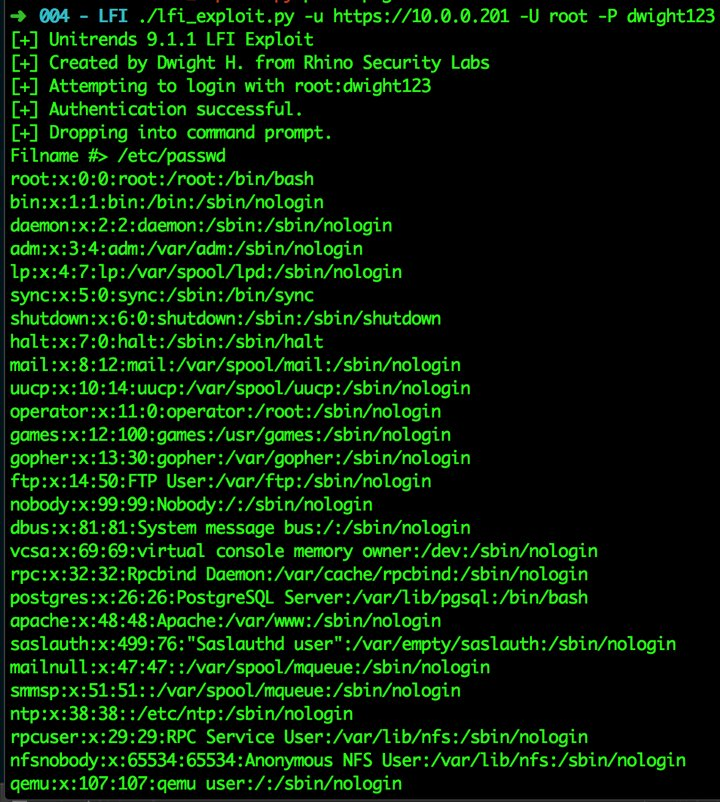
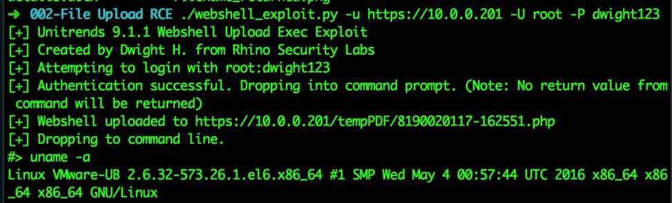
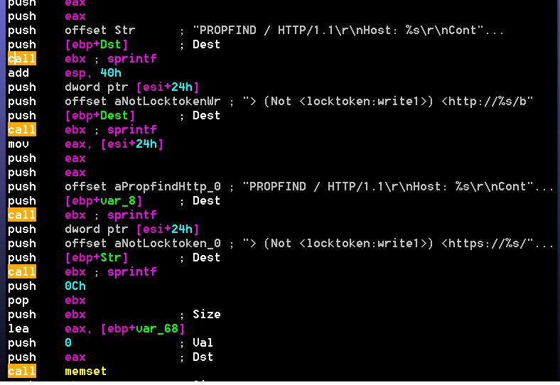

# hackerfantastic
**https://twitter.com/hackerfantastic/status/853992713645174785 _at 2017-04-17, 15:25:04_**
<blockquote>
Red teams are all sending CVE-2017-0199 to targets and then using MS17-010 to pivot across internal domains. It's raining shells.
</blockquote>

<table><tr>
<td>Quotes: <code>13</code></td>
<td>Replies: <code>10</code></td>
<td>Retweets: <code>364</code></td>
<td>Favorites: <code>512</code></td>
</tr></table>

---

# buffaloverflow
**https://twitter.com/buffaloverflow/status/852937040480149505 _at 2017-04-14, 17:30:11_**
<blockquote>
Just realised the exploit for CVE-2017-0197 (Office 2010) fits exactly in one tweet 😁 /cc @yorickkoster https://t.co/0CvYaq4DLS
</blockquote>

* https://twitter.com/buffaloverflow/status/852936732106424320

<table><tr>
<td>Quotes: <code>2</code></td>
<td>Replies: <code>0</code></td>
<td>Retweets: <code>69</code></td>
<td>Favorites: <code>145</code></td>
</tr></table>

---

# cyb3rops
**https://twitter.com/cyb3rops/status/852621468475305985 _at 2017-04-13, 20:36:13_**
<blockquote>
VMware vCenter Unauthenticated RCE using CVE-2017-5638 (Apache Struts 2 RCE) https://t.co/VagBwkiwGh
</blockquote>

* http://blog.gdssecurity.com/labs/2017/4/13/vmware-vcenter-unauthenticated-rce-using-cve-2017-5638-apach.html

<table><tr>
<td>Quotes: <code>2</code></td>
<td>Replies: <code>2</code></td>
<td>Retweets: <code>145</code></td>
<td>Favorites: <code>135</code></td>
</tr></table>

---

# maldevel
**https://twitter.com/maldevel/status/852102880685326337 _at 2017-04-12, 10:15:32_**
<blockquote>
CVE-2017-3881 Cisco Catalyst RCE Proof-Of-Concept - 
https://t.co/a7XjzOINpl https://t.co/G3GxMWwePQ
</blockquote>

* https://artkond.com/2017/04/10/cisco-catalyst-remote-code-execution/
* https://github.com/artkond/cisco-rce/

<table><tr>
<td>Quotes: <code>0</code></td>
<td>Replies: <code>0</code></td>
<td>Retweets: <code>38</code></td>
<td>Favorites: <code>37</code></td>
</tr></table>

---

# Dinosn
**https://twitter.com/Dinosn/status/851866599472717824 _at 2017-04-11, 18:36:38_**
<blockquote>
[PDF] CVE-2017-0199 (Office RTF RCE) sample analysis, IOCs and mitigation advice  https://t.co/Okf7WHtaop
</blockquote>

* https://github.com/nccgroup/Cyber-Defence/blob/master/Technical%20Notes/Office%20zero-day%20(April%202017)/2017-04%20Office%20OLE2Link%20zero-day%20v0.4.pdf

<table><tr>
<td>Quotes: <code>0</code></td>
<td>Replies: <code>0</code></td>
<td>Retweets: <code>32</code></td>
<td>Favorites: <code>40</code></td>
</tr></table>

---

# binitamshah
**https://twitter.com/binitamshah/status/854515366885720064 _at 2017-04-19, 02:01:54_**
<blockquote>
Remote Code Execution (CVE-2017-7820) - Part 2 :  https://t.co/Mqwz9WMR7v ,Part 1 : https://t.co/k2l7S1RNyd https://t.co/d3S1OwRJC8
</blockquote>

* https://rhinosecuritylabs.com/research/remote-code-execution-bug-hunting-chapter-2/
* https://rhinosecuritylabs.com/research/remote-code-execution-bug-hunting-chapter-1/

<table><tr>
<td></td>
<td></td>
</table></tr>
<table><tr>
<td>Quotes: <code>4</code></td>
<td>Replies: <code>1</code></td>
<td>Retweets: <code>115</code></td>
<td>Favorites: <code>150</code></td>
</tr></table>

---

# hackerfantastic
**https://twitter.com/hackerfantastic/status/853992713645174785 _at 2017-04-17, 15:25:04_**
<blockquote>
Red teams are all sending CVE-2017-0199 to targets and then using MS17-010 to pivot across internal domains. It's raining shells.
</blockquote>

<table><tr>
<td>Quotes: <code>13</code></td>
<td>Replies: <code>10</code></td>
<td>Retweets: <code>364</code></td>
<td>Favorites: <code>512</code></td>
</tr></table>

---

# buffaloverflow
**https://twitter.com/buffaloverflow/status/852937040480149505 _at 2017-04-14, 17:30:11_**
<blockquote>
Just realised the exploit for CVE-2017-0197 (Office 2010) fits exactly in one tweet 😁 /cc @yorickkoster https://t.co/0CvYaq4DLS
</blockquote>

* https://twitter.com/buffaloverflow/status/852936732106424320

<table><tr>
<td>Quotes: <code>2</code></td>
<td>Replies: <code>0</code></td>
<td>Retweets: <code>69</code></td>
<td>Favorites: <code>145</code></td>
</tr></table>

---

# Ivanlef0u
**https://twitter.com/Ivanlef0u/status/852875953764278273 _at 2017-04-14, 13:27:27_**
<blockquote>
Explodingcan https://t.co/W0i9LYbdNp is Win2k3 IIS remote Webdav CVE-2017-7269 from https://t.co/BbjcpDvxOf https://t.co/N0IjxxiAON
</blockquote>

* https://github.com/misterch0c/shadowbroker/tree/bc8ff5f44a1a4a0431745467ba99f7aa6d723171/windows/exploits
* https://github.com/edwardz246003/IIS_exploit

<table><tr>
<td></td>
</table></tr>
<table><tr>
<td>Quotes: <code>1</code></td>
<td>Replies: <code>0</code></td>
<td>Retweets: <code>57</code></td>
<td>Favorites: <code>85</code></td>
</tr></table>

---

# cyb3rops
**https://twitter.com/cyb3rops/status/852621468475305985 _at 2017-04-13, 20:36:13_**
<blockquote>
VMware vCenter Unauthenticated RCE using CVE-2017-5638 (Apache Struts 2 RCE) https://t.co/VagBwkiwGh
</blockquote>

* http://blog.gdssecurity.com/labs/2017/4/13/vmware-vcenter-unauthenticated-rce-using-cve-2017-5638-apach.html

<table><tr>
<td>Quotes: <code>2</code></td>
<td>Replies: <code>2</code></td>
<td>Retweets: <code>145</code></td>
<td>Favorites: <code>135</code></td>
</tr></table>

---

# maldevel
**https://twitter.com/maldevel/status/852102880685326337 _at 2017-04-12, 10:15:32_**
<blockquote>
CVE-2017-3881 Cisco Catalyst RCE Proof-Of-Concept - 
https://t.co/a7XjzOINpl https://t.co/G3GxMWwePQ
</blockquote>

* https://artkond.com/2017/04/10/cisco-catalyst-remote-code-execution/
* https://github.com/artkond/cisco-rce/

<table><tr>
<td>Quotes: <code>0</code></td>
<td>Replies: <code>0</code></td>
<td>Retweets: <code>38</code></td>
<td>Favorites: <code>37</code></td>
</tr></table>

---

# Dinosn
**https://twitter.com/Dinosn/status/851866599472717824 _at 2017-04-11, 18:36:38_**
<blockquote>
[PDF] CVE-2017-0199 (Office RTF RCE) sample analysis, IOCs and mitigation advice  https://t.co/Okf7WHtaop
</blockquote>

* https://github.com/nccgroup/Cyber-Defence/blob/master/Technical%20Notes/Office%20zero-day%20(April%202017)/2017-04%20Office%20OLE2Link%20zero-day%20v0.4.pdf

<table><tr>
<td>Quotes: <code>0</code></td>
<td>Replies: <code>0</code></td>
<td>Retweets: <code>32</code></td>
<td>Favorites: <code>40</code></td>
</tr></table>

---

# binitamshah
**https://twitter.com/binitamshah/status/854515366885720064 _at 2017-04-19, 02:01:54_**
<blockquote>
Remote Code Execution (CVE-2017-7820) - Part 2 :  https://t.co/Mqwz9WMR7v ,Part 1 : https://t.co/k2l7S1RNyd https://t.co/d3S1OwRJC8
</blockquote>

* https://rhinosecuritylabs.com/research/remote-code-execution-bug-hunting-chapter-2/
* https://rhinosecuritylabs.com/research/remote-code-execution-bug-hunting-chapter-1/

<table><tr>
<td></td>
<td></td>
</table></tr>
<table><tr>
<td>Quotes: <code>4</code></td>
<td>Replies: <code>1</code></td>
<td>Retweets: <code>115</code></td>
<td>Favorites: <code>150</code></td>
</tr></table>

---

# hackerfantastic
**https://twitter.com/hackerfantastic/status/853992713645174785 _at 2017-04-17, 15:25:04_**
<blockquote>
Red teams are all sending CVE-2017-0199 to targets and then using MS17-010 to pivot across internal domains. It's raining shells.
</blockquote>

<table><tr>
<td>Quotes: <code>13</code></td>
<td>Replies: <code>10</code></td>
<td>Retweets: <code>364</code></td>
<td>Favorites: <code>512</code></td>
</tr></table>

---

# buffaloverflow
**https://twitter.com/buffaloverflow/status/852937040480149505 _at 2017-04-14, 17:30:11_**
<blockquote>
Just realised the exploit for CVE-2017-0197 (Office 2010) fits exactly in one tweet 😁 /cc @yorickkoster https://t.co/0CvYaq4DLS
</blockquote>

* https://twitter.com/buffaloverflow/status/852936732106424320

<table><tr>
<td>Quotes: <code>2</code></td>
<td>Replies: <code>0</code></td>
<td>Retweets: <code>69</code></td>
<td>Favorites: <code>145</code></td>
</tr></table>

---

# Ivanlef0u
**https://twitter.com/Ivanlef0u/status/852875953764278273 _at 2017-04-14, 13:27:27_**
<blockquote>
Explodingcan https://t.co/W0i9LYbdNp is Win2k3 IIS remote Webdav CVE-2017-7269 from https://t.co/BbjcpDvxOf https://t.co/N0IjxxiAON
</blockquote>

* https://github.com/misterch0c/shadowbroker/tree/bc8ff5f44a1a4a0431745467ba99f7aa6d723171/windows/exploits
* https://github.com/edwardz246003/IIS_exploit

<table><tr>
<td></td>
</table></tr>
<table><tr>
<td>Quotes: <code>1</code></td>
<td>Replies: <code>0</code></td>
<td>Retweets: <code>57</code></td>
<td>Favorites: <code>85</code></td>
</tr></table>

---

# cyb3rops
**https://twitter.com/cyb3rops/status/852621468475305985 _at 2017-04-13, 20:36:13_**
<blockquote>
VMware vCenter Unauthenticated RCE using CVE-2017-5638 (Apache Struts 2 RCE) https://t.co/VagBwkiwGh
</blockquote>

* http://blog.gdssecurity.com/labs/2017/4/13/vmware-vcenter-unauthenticated-rce-using-cve-2017-5638-apach.html

<table><tr>
<td>Quotes: <code>2</code></td>
<td>Replies: <code>2</code></td>
<td>Retweets: <code>145</code></td>
<td>Favorites: <code>135</code></td>
</tr></table>

---

# maldevel
**https://twitter.com/maldevel/status/852102880685326337 _at 2017-04-12, 10:15:32_**
<blockquote>
CVE-2017-3881 Cisco Catalyst RCE Proof-Of-Concept - 
https://t.co/a7XjzOINpl https://t.co/G3GxMWwePQ
</blockquote>

* https://artkond.com/2017/04/10/cisco-catalyst-remote-code-execution/
* https://github.com/artkond/cisco-rce/

<table><tr>
<td>Quotes: <code>0</code></td>
<td>Replies: <code>0</code></td>
<td>Retweets: <code>38</code></td>
<td>Favorites: <code>37</code></td>
</tr></table>

---

# Dinosn
**https://twitter.com/Dinosn/status/851866599472717824 _at 2017-04-11, 18:36:38_**
<blockquote>
[PDF] CVE-2017-0199 (Office RTF RCE) sample analysis, IOCs and mitigation advice  https://t.co/Okf7WHtaop
</blockquote>

* https://github.com/nccgroup/Cyber-Defence/blob/master/Technical%20Notes/Office%20zero-day%20(April%202017)/2017-04%20Office%20OLE2Link%20zero-day%20v0.4.pdf

<table><tr>
<td>Quotes: <code>0</code></td>
<td>Replies: <code>0</code></td>
<td>Retweets: <code>32</code></td>
<td>Favorites: <code>40</code></td>
</tr></table>

---

# binitamshah
**https://twitter.com/binitamshah/status/854515366885720064 _at 2017-04-19, 02:01:54_**
<blockquote>
Remote Code Execution (CVE-2017-7820) - Part 2 :  https://t.co/Mqwz9WMR7v ,Part 1 : https://t.co/k2l7S1RNyd https://t.co/d3S1OwRJC8
</blockquote>

* https://rhinosecuritylabs.com/research/remote-code-execution-bug-hunting-chapter-2/
* https://rhinosecuritylabs.com/research/remote-code-execution-bug-hunting-chapter-1/

<table><tr>
<td></td>
<td></td>
</table></tr>
<table><tr>
<td>Quotes: <code>4</code></td>
<td>Replies: <code>1</code></td>
<td>Retweets: <code>115</code></td>
<td>Favorites: <code>150</code></td>
</tr></table>

---

# hackerfantastic
**https://twitter.com/hackerfantastic/status/853992713645174785 _at 2017-04-17, 15:25:04_**
<blockquote>
Red teams are all sending CVE-2017-0199 to targets and then using MS17-010 to pivot across internal domains. It's raining shells.
</blockquote>

<table><tr>
<td>Quotes: <code>13</code></td>
<td>Replies: <code>10</code></td>
<td>Retweets: <code>364</code></td>
<td>Favorites: <code>512</code></td>
</tr></table>

---

# buffaloverflow
**https://twitter.com/buffaloverflow/status/852937040480149505 _at 2017-04-14, 17:30:11_**
<blockquote>
Just realised the exploit for CVE-2017-0197 (Office 2010) fits exactly in one tweet 😁 /cc @yorickkoster https://t.co/0CvYaq4DLS
</blockquote>

* https://twitter.com/buffaloverflow/status/852936732106424320

<table><tr>
<td>Quotes: <code>2</code></td>
<td>Replies: <code>0</code></td>
<td>Retweets: <code>69</code></td>
<td>Favorites: <code>145</code></td>
</tr></table>

---

# Ivanlef0u
**https://twitter.com/Ivanlef0u/status/852875953764278273 _at 2017-04-14, 13:27:27_**
<blockquote>
Explodingcan https://t.co/W0i9LYbdNp is Win2k3 IIS remote Webdav CVE-2017-7269 from https://t.co/BbjcpDvxOf https://t.co/N0IjxxiAON
</blockquote>

* https://github.com/misterch0c/shadowbroker/tree/bc8ff5f44a1a4a0431745467ba99f7aa6d723171/windows/exploits
* https://github.com/edwardz246003/IIS_exploit

<table><tr>
<td></td>
</table></tr>
<table><tr>
<td>Quotes: <code>1</code></td>
<td>Replies: <code>0</code></td>
<td>Retweets: <code>57</code></td>
<td>Favorites: <code>85</code></td>
</tr></table>

---

# cyb3rops
**https://twitter.com/cyb3rops/status/852621468475305985 _at 2017-04-13, 20:36:13_**
<blockquote>
VMware vCenter Unauthenticated RCE using CVE-2017-5638 (Apache Struts 2 RCE) https://t.co/VagBwkiwGh
</blockquote>

* http://blog.gdssecurity.com/labs/2017/4/13/vmware-vcenter-unauthenticated-rce-using-cve-2017-5638-apach.html

<table><tr>
<td>Quotes: <code>2</code></td>
<td>Replies: <code>2</code></td>
<td>Retweets: <code>145</code></td>
<td>Favorites: <code>135</code></td>
</tr></table>

---

# maldevel
**https://twitter.com/maldevel/status/852102880685326337 _at 2017-04-12, 10:15:32_**
<blockquote>
CVE-2017-3881 Cisco Catalyst RCE Proof-Of-Concept - 
https://t.co/a7XjzOINpl https://t.co/G3GxMWwePQ
</blockquote>

* https://artkond.com/2017/04/10/cisco-catalyst-remote-code-execution/
* https://github.com/artkond/cisco-rce/

<table><tr>
<td>Quotes: <code>0</code></td>
<td>Replies: <code>0</code></td>
<td>Retweets: <code>38</code></td>
<td>Favorites: <code>37</code></td>
</tr></table>

---

# Dinosn
**https://twitter.com/Dinosn/status/851866599472717824 _at 2017-04-11, 18:36:38_**
<blockquote>
[PDF] CVE-2017-0199 (Office RTF RCE) sample analysis, IOCs and mitigation advice  https://t.co/Okf7WHtaop
</blockquote>

* https://github.com/nccgroup/Cyber-Defence/blob/master/Technical%20Notes/Office%20zero-day%20(April%202017)/2017-04%20Office%20OLE2Link%20zero-day%20v0.4.pdf

<table><tr>
<td>Quotes: <code>0</code></td>
<td>Replies: <code>0</code></td>
<td>Retweets: <code>32</code></td>
<td>Favorites: <code>40</code></td>
</tr></table>

---

