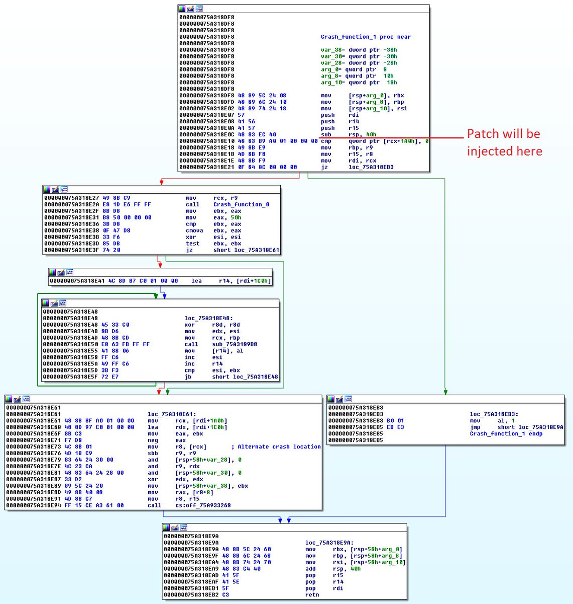

# x0rz
**https://twitter.com/x0rz/status/869461341584715776 _at 2017-05-30, 07:51:52_**
<blockquote>
Windows MsMpEng remotely exploitable UaF due to design issue in GC engine (CVE-2017-8540) https://t.co/EWM739NZZA #vulnerability #windows
</blockquote>

* https://bugs.chromium.org/p/project-zero/issues/detail?id=1258

<table><tr>
<td>Quotes: <code>1</code></td>
<td>Replies: <code>3</code></td>
<td>Retweets: <code>20</code></td>
<td>Favorites: <code>42</code></td>
</tr></table>

---

# x0rz
**https://twitter.com/x0rz/status/864129198625091584 _at 2017-05-15, 14:43:50_**
<blockquote>
Micropatching CVE-2017-0290 (Windows Malware Protection Engine RCE) https://t.co/0IgEw106KY #vulnerability #patching https://t.co/dbEsndhJfT
</blockquote>

* https://0patch.blogspot.fr/2017/05/0patching-worst-windows-remote-code.html

<table><tr>
<td></td>
</table></tr>
<table><tr>
<td>Quotes: <code>3</code></td>
<td>Replies: <code>0</code></td>
<td>Retweets: <code>104</code></td>
<td>Favorites: <code>131</code></td>
</tr></table>

---

# TheHackersNews
**https://twitter.com/TheHackersNews/status/861862540040482818 _at 2017-05-09, 08:36:56_**
<blockquote>
Great Job. The POC for RCE Flaw (CVE-2017-0290) in #Microsoft Malware Protection Engine fits in a Tweet (Story: https://t.co/FWw7wtpi6X) https://t.co/D7HdA66tJT
</blockquote>

* https://goo.gl/I8eStO
* https://twitter.com/natashenka/status/861748397409058816

<table><tr>
<td>Quotes: <code>4</code></td>
<td>Replies: <code>0</code></td>
<td>Retweets: <code>45</code></td>
<td>Favorites: <code>29</code></td>
</tr></table>

---

# x0rz
**https://twitter.com/x0rz/status/861822959731838976 _at 2017-05-09, 05:59:40_**
<blockquote>
CVE-2017-0290: RCE as SYSTEM in Microsoft Malware Protection Engine https://t.co/pn9y8z64uF #windows #vulnerability
</blockquote>

* https://bugs.chromium.org/p/project-zero/issues/detail?id=1252&desc=5

<table><tr>
<td>Quotes: <code>3</code></td>
<td>Replies: <code>1</code></td>
<td>Retweets: <code>79</code></td>
<td>Favorites: <code>77</code></td>
</tr></table>

---

# natashenka
**https://twitter.com/natashenka/status/861748397409058816 _at 2017-05-09, 01:03:23_**
<blockquote>
CVE-2017-0290 is tweetable :)

var e = new Error();
https://t.co/0RDygaVW6B({message : 7 });

https://t.co/xkH9SQpNJE
</blockquote>

* http://e.toString.call
* https://bugs.chromium.org/p/project-zero/issues/detail?id=1252&desc=5

<table><tr>
<td>Quotes: <code>70</code></td>
<td>Replies: <code>25</code></td>
<td>Retweets: <code>888</code></td>
<td>Favorites: <code>1042</code></td>
</tr></table>

---

# fdfalcon
**https://twitter.com/fdfalcon/status/859390114916696064 _at 2017-05-02, 12:52:24_**
<blockquote>
I wrote "Exploiting MS16-145: MS Edge TypedArray.sort UAF (CVE-2016-7288)", involving Quicksort, COOP and more https://t.co/onczuZGTPr
</blockquote>

* http://blog.quarkslab.com/exploiting-ms16-145-ms-edge-typedarraysort-use-after-free-cve-2016-7288.html

<table><tr>
<td>Quotes: <code>13</code></td>
<td>Replies: <code>11</code></td>
<td>Retweets: <code>198</code></td>
<td>Favorites: <code>274</code></td>
</tr></table>

---

# MalwareJake
**https://twitter.com/MalwareJake/status/859382630923382784 _at 2017-05-02, 12:22:40_**
<blockquote>
Complete walkthrough of exploiting CVE-2017-2636 and a novel SMEP bypass technique. Well documented! https://t.co/PxLv5Y5Wc7
</blockquote>

* https://a13xp0p0v.github.io/2017/03/24/CVE-2017-2636.html

<table><tr>
<td>Quotes: <code>0</code></td>
<td>Replies: <code>0</code></td>
<td>Retweets: <code>59</code></td>
<td>Favorites: <code>81</code></td>
</tr></table>

---

