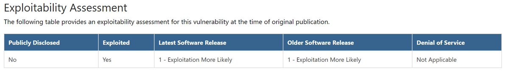
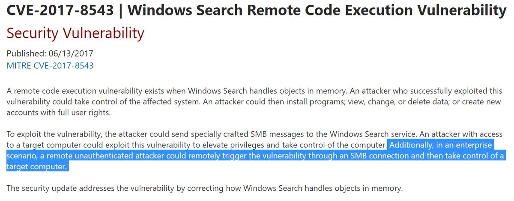

# mkolsek
**https://twitter.com/mkolsek/status/877499744704237568 _at 2017-06-21, 12:13:36_**
<blockquote>
A quick analysis of Microsoft's patch for LNK Remote Code Execution Vulnerability (CVE-2017-8464) https://t.co/NvNSlDwYds
</blockquote>

* https://portal.msrc.microsoft.com/en-US/security-guidance/advisory/CVE-2017-8464

<table><tr>
<td>Quotes: <code>2</code></td>
<td>Replies: <code>1</code></td>
<td>Retweets: <code>24</code></td>
<td>Favorites: <code>49</code></td>
</tr></table>

---

# PyroTek3
**https://twitter.com/PyroTek3/status/874804935547904002 _at 2017-06-14, 01:45:24_**
<blockquote>
Patch your critical Windows servers ASAP against this SMB vulnerability: 
CVE-2017-8543 Windows Search RCE Vuln 
https://t.co/OFyKWgtl75 https://t.co/pl4nJtjh4E
</blockquote>

* https://portal.msrc.microsoft.com/en-US/security-guidance/advisory/CVE-2017-8543

<table><tr>
<td></td>
<td></td>
</table></tr>
<table><tr>
<td>Quotes: <code>11</code></td>
<td>Replies: <code>2</code></td>
<td>Retweets: <code>105</code></td>
<td>Favorites: <code>95</code></td>
</tr></table>

---

# JGamblin
**https://twitter.com/JGamblin/status/872177569348694017 _at 2017-06-06, 19:45:11_**
<blockquote>
CVE-2017-3881 Cisco Catalyst RCE Proof-Of-Concept.  https://t.co/XrgK8ym4ta
</blockquote>

* https://artkond.com/2017/04/10/cisco-catalyst-remote-code-execution/

<table><tr>
<td>Quotes: <code>0</code></td>
<td>Replies: <code>0</code></td>
<td>Retweets: <code>41</code></td>
<td>Favorites: <code>40</code></td>
</tr></table>

---

