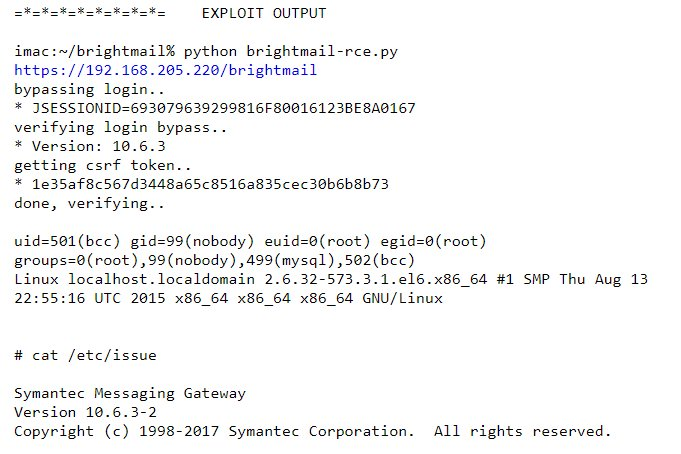
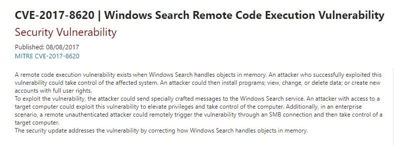

# x0rz
**https://twitter.com/x0rz/status/899298774513836033 _at 2017-08-20, 15:55:10_**
<blockquote>
CVE-2017-6327: Symantec Messaging Gateway &lt;= 10.6.3-2 unauthenticated root RCE (web auth bypass + cmd injection) https://t.co/Ege34pRGYU https://t.co/rIk0YvUq95
</blockquote>

* http://seclists.org/fulldisclosure/2017/Aug/28

<table><tr>
<td></td>
</table></tr>
<table><tr>
<td>Quotes: <code>6</code></td>
<td>Replies: <code>0</code></td>
<td>Retweets: <code>113</code></td>
<td>Favorites: <code>138</code></td>
</tr></table>

---

# dannyc_dev
**https://twitter.com/dannyc_dev/status/896775104524414976 _at 2017-08-13, 16:47:00_**
<blockquote>
A proof-of-concept local root exploit for CVE-2017-1000112.
Includes KASLR and SMEP bypasses. No SMAP bypass. https://t.co/dnRh8HFbYy
</blockquote>

* https://github.com/xairy/kernel-exploits/blob/master/CVE-2017-1000112/poc.c

<table><tr>
<td>Quotes: <code>0</code></td>
<td>Replies: <code>1</code></td>
<td>Retweets: <code>118</code></td>
<td>Favorites: <code>150</code></td>
</tr></table>

---

# x0rz
**https://twitter.com/x0rz/status/895154935792381953 _at 2017-08-09, 05:29:02_**
<blockquote>
CVE-2017-8620: Windows Search Remote Code Execution Vulnerability
⚠️Disable WSearch service now!
https://t.co/TdKjfiECqE #vulnerability https://t.co/pPRJiKm3mh
</blockquote>

* https://portal.msrc.microsoft.com/en-US/security-guidance/advisory/CVE-2017-8620

<table><tr>
<td></td>
</table></tr>
<table><tr>
<td>Quotes: <code>20</code></td>
<td>Replies: <code>12</code></td>
<td>Retweets: <code>460</code></td>
<td>Favorites: <code>416</code></td>
</tr></table>

---

