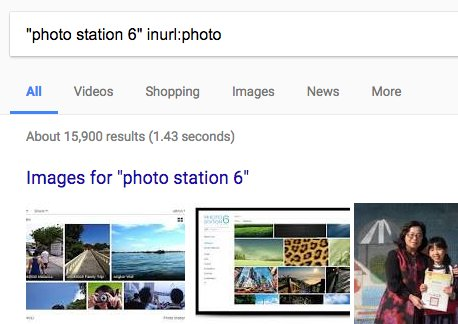
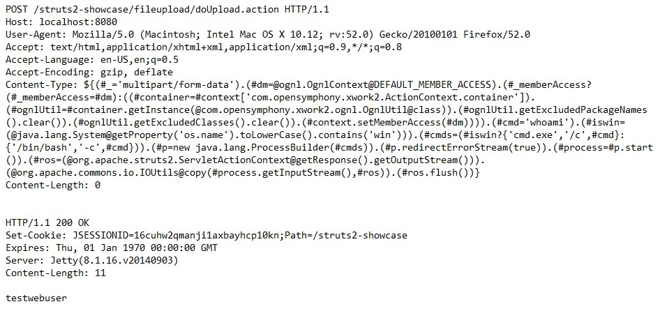
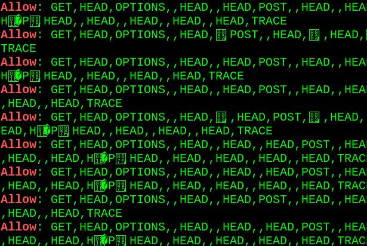
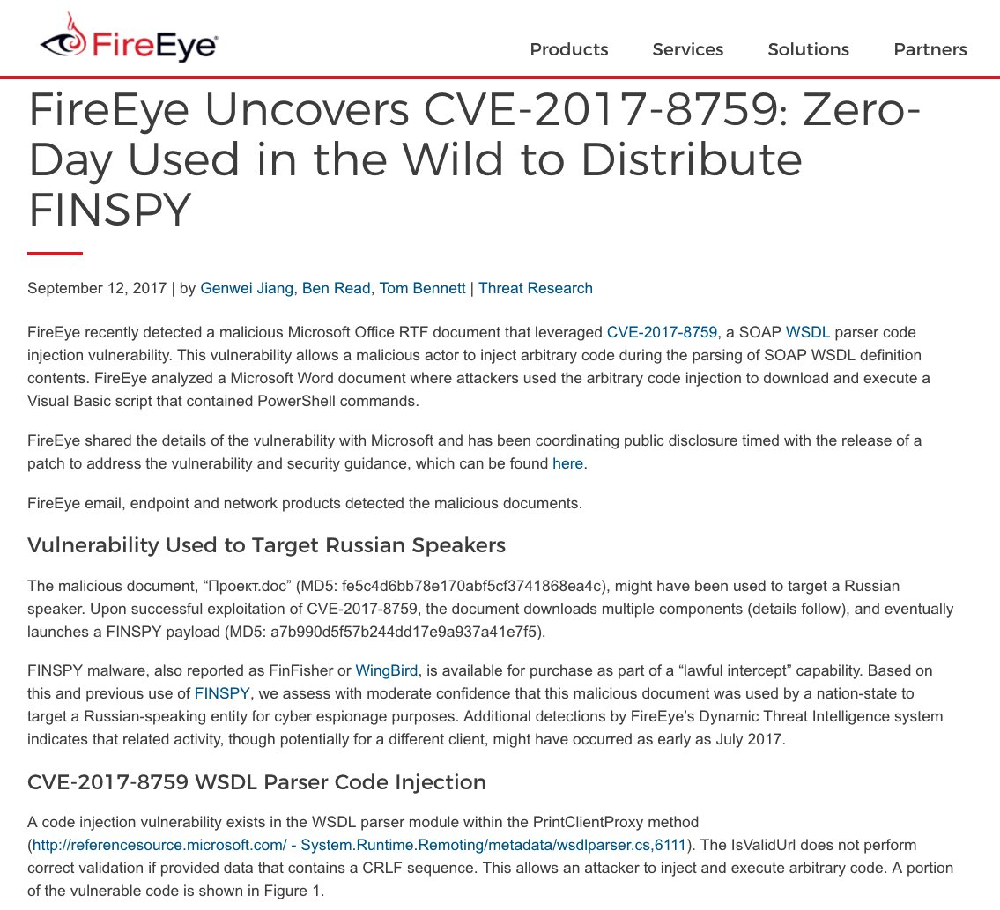
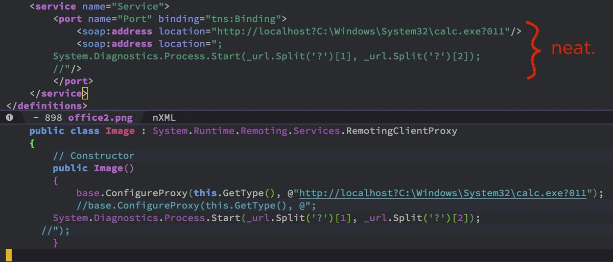

# KacperSzurek
**https://twitter.com/KacperSzurek/status/909629760388714496 _at 2017-09-18, 04:06:49_**
<blockquote>
#Synology Photo Station 6.7.3 unauthenticated #RCE Chain of 4 bugs #CVE-2017-11151-11155 https://t.co/2GNABXfwyf https://t.co/AhOkxUsg2A
</blockquote>

* https://security.szurek.pl/synology-photo-station-673-3432-remote-code-execution.html

<table><tr>
<td></td>
</table></tr>
<table><tr>
<td>Quotes: <code>1</code></td>
<td>Replies: <code>1</code></td>
<td>Retweets: <code>36</code></td>
<td>Favorites: <code>50</code></td>
</tr></table>

---

# x0rz
**https://twitter.com/x0rz/status/909355342542327809 _at 2017-09-17, 09:56:23_**
<blockquote>
Analysis of CVE-2017-5638 (Apache Struts 2 RCE) https://t.co/un4wVq9B1B #equihax #equifax #vulnerability https://t.co/fHTTuGrdRA
</blockquote>

* https://blog.gdssecurity.com/labs/2017/3/27/an-analysis-of-cve-2017-5638.html

<table><tr>
<td></td>
</table></tr>
<table><tr>
<td>Quotes: <code>3</code></td>
<td>Replies: <code>0</code></td>
<td>Retweets: <code>114</code></td>
<td>Favorites: <code>156</code></td>
</tr></table>

---

# Dinosn
**https://twitter.com/Dinosn/status/908767937074515973 _at 2017-09-15, 19:02:14_**
<blockquote>
Exploit toolkit for CVE-2017-8759 - Microsoft .NET Framework RCE (Builder + listener + video tutorial) https://t.co/uz05I6NUzv
</blockquote>

* http://seclists.org/fulldisclosure/2017/Sep/33

<table><tr>
<td>Quotes: <code>0</code></td>
<td>Replies: <code>0</code></td>
<td>Retweets: <code>31</code></td>
<td>Favorites: <code>47</code></td>
</tr></table>

---

# buffaloverflow
**https://twitter.com/buffaloverflow/status/908454635144404995 _at 2017-09-14, 22:17:17_**
<blockquote>
Thanks to @_jsoo_ for his idea, here is a fun way to exploit CVE-2017-8759 via CSV in Excel. One line exploits ftw 😂 https://t.co/HQfeYZ1Ayw
</blockquote>

* https://vimeo.com/233908751

<table><tr>
<td>Quotes: <code>1</code></td>
<td>Replies: <code>3</code></td>
<td>Retweets: <code>82</code></td>
<td>Favorites: <code>150</code></td>
</tr></table>

---

# nickstadb
**https://twitter.com/nickstadb/status/907673124686229505 _at 2017-09-12, 18:31:51_**
<blockquote>
Running ColdFusion? Update now. Critical unauthenticated RCE (as SYSTEM by default) https://t.co/gYkePFxXyl CVE-2017-11283 &amp; CVE-2017-11284
</blockquote>

* https://helpx.adobe.com/security/products/coldfusion/apsb17-30.html

<table><tr>
<td>Quotes: <code>2</code></td>
<td>Replies: <code>5</code></td>
<td>Retweets: <code>64</code></td>
<td>Favorites: <code>84</code></td>
</tr></table>

---

# Dinosn
**https://twitter.com/Dinosn/status/906205737893945348 _at 2017-09-08, 17:20:59_**
<blockquote>
CVE-2017-9805: Analysis of Apache Struts RCE Vulnerability in REST Plugin https://t.co/B7cGt2NQU0
</blockquote>

* https://www.imperva.com/blog/2017/09/cve-2017-9805-analysis-of-apache-struts-rce-vulnerability-in-rest-plugin/

<table><tr>
<td>Quotes: <code>0</code></td>
<td>Replies: <code>0</code></td>
<td>Retweets: <code>30</code></td>
<td>Favorites: <code>54</code></td>
</tr></table>

---

# l4wio
**https://twitter.com/l4wio/status/905279567060926464 _at 2017-09-06, 04:00:42_**
<blockquote>
Achievement unlocked!
My first UAF on Chrome
CVE-2017-5111
https://t.co/dFWRURLjdv
</blockquote>

* https://chromereleases.googleblog.com/2017/09/stable-channel-update-for-desktop.html?m=1

<table><tr>
<td>Quotes: <code>1</code></td>
<td>Replies: <code>4</code></td>
<td>Retweets: <code>40</code></td>
<td>Favorites: <code>139</code></td>
</tr></table>

---

# x0rz
**https://twitter.com/x0rz/status/909792844969398273 _at 2017-09-18, 14:54:52_**
<blockquote>
Optionsbleed (CVE-2017-9798): HTTP OPTIONS method can leak Apache's server memory https://t.co/ON4y4r8QN1 #optionsbleed #vulnerability https://t.co/ba15MzLXcK
</blockquote>

* https://blog.fuzzing-project.org/60-Optionsbleed-HTTP-OPTIONS-method-can-leak-Apaches-server-memory.html

<table><tr>
<td></td>
</table></tr>
<table><tr>
<td>Quotes: <code>2</code></td>
<td>Replies: <code>4</code></td>
<td>Retweets: <code>191</code></td>
<td>Favorites: <code>213</code></td>
</tr></table>

---

# KacperSzurek
**https://twitter.com/KacperSzurek/status/909629760388714496 _at 2017-09-18, 04:06:49_**
<blockquote>
#Synology Photo Station 6.7.3 unauthenticated #RCE Chain of 4 bugs #CVE-2017-11151-11155 https://t.co/2GNABXfwyf https://t.co/AhOkxUsg2A
</blockquote>

* https://security.szurek.pl/synology-photo-station-673-3432-remote-code-execution.html

<table><tr>
<td></td>
</table></tr>
<table><tr>
<td>Quotes: <code>1</code></td>
<td>Replies: <code>1</code></td>
<td>Retweets: <code>36</code></td>
<td>Favorites: <code>50</code></td>
</tr></table>

---

# x0rz
**https://twitter.com/x0rz/status/909355342542327809 _at 2017-09-17, 09:56:23_**
<blockquote>
Analysis of CVE-2017-5638 (Apache Struts 2 RCE) https://t.co/un4wVq9B1B #equihax #equifax #vulnerability https://t.co/fHTTuGrdRA
</blockquote>

* https://blog.gdssecurity.com/labs/2017/3/27/an-analysis-of-cve-2017-5638.html

<table><tr>
<td></td>
</table></tr>
<table><tr>
<td>Quotes: <code>3</code></td>
<td>Replies: <code>0</code></td>
<td>Retweets: <code>114</code></td>
<td>Favorites: <code>156</code></td>
</tr></table>

---

# Dinosn
**https://twitter.com/Dinosn/status/908767937074515973 _at 2017-09-15, 19:02:14_**
<blockquote>
Exploit toolkit for CVE-2017-8759 - Microsoft .NET Framework RCE (Builder + listener + video tutorial) https://t.co/uz05I6NUzv
</blockquote>

* http://seclists.org/fulldisclosure/2017/Sep/33

<table><tr>
<td>Quotes: <code>0</code></td>
<td>Replies: <code>0</code></td>
<td>Retweets: <code>31</code></td>
<td>Favorites: <code>47</code></td>
</tr></table>

---

# buffaloverflow
**https://twitter.com/buffaloverflow/status/908454635144404995 _at 2017-09-14, 22:17:17_**
<blockquote>
Thanks to @_jsoo_ for his idea, here is a fun way to exploit CVE-2017-8759 via CSV in Excel. One line exploits ftw 😂 https://t.co/HQfeYZ1Ayw
</blockquote>

* https://vimeo.com/233908751

<table><tr>
<td>Quotes: <code>1</code></td>
<td>Replies: <code>3</code></td>
<td>Retweets: <code>82</code></td>
<td>Favorites: <code>150</code></td>
</tr></table>

---

# nickstadb
**https://twitter.com/nickstadb/status/907673124686229505 _at 2017-09-12, 18:31:51_**
<blockquote>
Running ColdFusion? Update now. Critical unauthenticated RCE (as SYSTEM by default) https://t.co/gYkePFxXyl CVE-2017-11283 &amp; CVE-2017-11284
</blockquote>

* https://helpx.adobe.com/security/products/coldfusion/apsb17-30.html

<table><tr>
<td>Quotes: <code>2</code></td>
<td>Replies: <code>5</code></td>
<td>Retweets: <code>64</code></td>
<td>Favorites: <code>84</code></td>
</tr></table>

---

# ItsReallyNick
**https://twitter.com/ItsReallyNick/status/907659570323054592 _at 2017-09-12, 17:37:59_**
<blockquote>
NEW: @FireEye discloses #0day used to distribute "lawful intercept" software in-the-wild. #DFIR
CVE-2017-8759: https://t.co/CjQAtqmKHk https://t.co/jdneCHQy7b
</blockquote>

* https://www.fireeye.com/blog/threat-research/2017/09/zero-day-used-to-distribute-finspy.html

<table><tr>
<td></td>
<td></td>
</table></tr>
<table><tr>
<td>Quotes: <code>8</code></td>
<td>Replies: <code>4</code></td>
<td>Retweets: <code>268</code></td>
<td>Favorites: <code>277</code></td>
</tr></table>

---

# Dinosn
**https://twitter.com/Dinosn/status/906205737893945348 _at 2017-09-08, 17:20:59_**
<blockquote>
CVE-2017-9805: Analysis of Apache Struts RCE Vulnerability in REST Plugin https://t.co/B7cGt2NQU0
</blockquote>

* https://www.imperva.com/blog/2017/09/cve-2017-9805-analysis-of-apache-struts-rce-vulnerability-in-rest-plugin/

<table><tr>
<td>Quotes: <code>0</code></td>
<td>Replies: <code>0</code></td>
<td>Retweets: <code>30</code></td>
<td>Favorites: <code>54</code></td>
</tr></table>

---

# l4wio
**https://twitter.com/l4wio/status/905279567060926464 _at 2017-09-06, 04:00:42_**
<blockquote>
Achievement unlocked!
My first UAF on Chrome
CVE-2017-5111
https://t.co/dFWRURLjdv
</blockquote>

* https://chromereleases.googleblog.com/2017/09/stable-channel-update-for-desktop.html?m=1

<table><tr>
<td>Quotes: <code>1</code></td>
<td>Replies: <code>4</code></td>
<td>Retweets: <code>40</code></td>
<td>Favorites: <code>139</code></td>
</tr></table>

---

# x0rz
**https://twitter.com/x0rz/status/909792844969398273 _at 2017-09-18, 14:54:52_**
<blockquote>
Optionsbleed (CVE-2017-9798): HTTP OPTIONS method can leak Apache's server memory https://t.co/ON4y4r8QN1 #optionsbleed #vulnerability https://t.co/ba15MzLXcK
</blockquote>

* https://blog.fuzzing-project.org/60-Optionsbleed-HTTP-OPTIONS-method-can-leak-Apaches-server-memory.html

<table><tr>
<td></td>
</table></tr>
<table><tr>
<td>Quotes: <code>2</code></td>
<td>Replies: <code>4</code></td>
<td>Retweets: <code>191</code></td>
<td>Favorites: <code>213</code></td>
</tr></table>

---

# KacperSzurek
**https://twitter.com/KacperSzurek/status/909629760388714496 _at 2017-09-18, 04:06:49_**
<blockquote>
#Synology Photo Station 6.7.3 unauthenticated #RCE Chain of 4 bugs #CVE-2017-11151-11155 https://t.co/2GNABXfwyf https://t.co/AhOkxUsg2A
</blockquote>

* https://security.szurek.pl/synology-photo-station-673-3432-remote-code-execution.html

<table><tr>
<td></td>
</table></tr>
<table><tr>
<td>Quotes: <code>1</code></td>
<td>Replies: <code>1</code></td>
<td>Retweets: <code>36</code></td>
<td>Favorites: <code>50</code></td>
</tr></table>

---

# x0rz
**https://twitter.com/x0rz/status/909355342542327809 _at 2017-09-17, 09:56:23_**
<blockquote>
Analysis of CVE-2017-5638 (Apache Struts 2 RCE) https://t.co/un4wVq9B1B #equihax #equifax #vulnerability https://t.co/fHTTuGrdRA
</blockquote>

* https://blog.gdssecurity.com/labs/2017/3/27/an-analysis-of-cve-2017-5638.html

<table><tr>
<td></td>
</table></tr>
<table><tr>
<td>Quotes: <code>3</code></td>
<td>Replies: <code>0</code></td>
<td>Retweets: <code>114</code></td>
<td>Favorites: <code>156</code></td>
</tr></table>

---

# Dinosn
**https://twitter.com/Dinosn/status/908767937074515973 _at 2017-09-15, 19:02:14_**
<blockquote>
Exploit toolkit for CVE-2017-8759 - Microsoft .NET Framework RCE (Builder + listener + video tutorial) https://t.co/uz05I6NUzv
</blockquote>

* http://seclists.org/fulldisclosure/2017/Sep/33

<table><tr>
<td>Quotes: <code>0</code></td>
<td>Replies: <code>0</code></td>
<td>Retweets: <code>31</code></td>
<td>Favorites: <code>47</code></td>
</tr></table>

---

# buffaloverflow
**https://twitter.com/buffaloverflow/status/908454635144404995 _at 2017-09-14, 22:17:17_**
<blockquote>
Thanks to @_jsoo_ for his idea, here is a fun way to exploit CVE-2017-8759 via CSV in Excel. One line exploits ftw 😂 https://t.co/HQfeYZ1Ayw
</blockquote>

* https://vimeo.com/233908751

<table><tr>
<td>Quotes: <code>1</code></td>
<td>Replies: <code>3</code></td>
<td>Retweets: <code>82</code></td>
<td>Favorites: <code>150</code></td>
</tr></table>

---

# nickstadb
**https://twitter.com/nickstadb/status/907673124686229505 _at 2017-09-12, 18:31:51_**
<blockquote>
Running ColdFusion? Update now. Critical unauthenticated RCE (as SYSTEM by default) https://t.co/gYkePFxXyl CVE-2017-11283 &amp; CVE-2017-11284
</blockquote>

* https://helpx.adobe.com/security/products/coldfusion/apsb17-30.html

<table><tr>
<td>Quotes: <code>2</code></td>
<td>Replies: <code>5</code></td>
<td>Retweets: <code>64</code></td>
<td>Favorites: <code>84</code></td>
</tr></table>

---

# ItsReallyNick
**https://twitter.com/ItsReallyNick/status/907659570323054592 _at 2017-09-12, 17:37:59_**
<blockquote>
NEW: @FireEye discloses #0day used to distribute "lawful intercept" software in-the-wild. #DFIR
CVE-2017-8759: https://t.co/CjQAtqmKHk https://t.co/jdneCHQy7b
</blockquote>

* https://www.fireeye.com/blog/threat-research/2017/09/zero-day-used-to-distribute-finspy.html

<table><tr>
<td></td>
<td></td>
</table></tr>
<table><tr>
<td>Quotes: <code>8</code></td>
<td>Replies: <code>4</code></td>
<td>Retweets: <code>268</code></td>
<td>Favorites: <code>277</code></td>
</tr></table>

---

# Dinosn
**https://twitter.com/Dinosn/status/906205737893945348 _at 2017-09-08, 17:20:59_**
<blockquote>
CVE-2017-9805: Analysis of Apache Struts RCE Vulnerability in REST Plugin https://t.co/B7cGt2NQU0
</blockquote>

* https://www.imperva.com/blog/2017/09/cve-2017-9805-analysis-of-apache-struts-rce-vulnerability-in-rest-plugin/

<table><tr>
<td>Quotes: <code>0</code></td>
<td>Replies: <code>0</code></td>
<td>Retweets: <code>30</code></td>
<td>Favorites: <code>54</code></td>
</tr></table>

---

# l4wio
**https://twitter.com/l4wio/status/905279567060926464 _at 2017-09-06, 04:00:42_**
<blockquote>
Achievement unlocked!
My first UAF on Chrome
CVE-2017-5111
https://t.co/dFWRURLjdv
</blockquote>

* https://chromereleases.googleblog.com/2017/09/stable-channel-update-for-desktop.html?m=1

<table><tr>
<td>Quotes: <code>1</code></td>
<td>Replies: <code>4</code></td>
<td>Retweets: <code>40</code></td>
<td>Favorites: <code>139</code></td>
</tr></table>

---

# hosselot
**https://twitter.com/hosselot/status/904646691894198272 _at 2017-09-04, 10:05:53_**
<blockquote>
Google Chrome 58 V8 Crankshaft Type Confusion Vulnerability (CVE-2017-5070) Patch and PoC:
https://t.co/IhLPvryDtq
</blockquote>

* https://chromium.googlesource.com/v8/v8.git/+/e33fd30777f99a0d6e16b16d096a2663b1031457%5E%21/#F0

<table><tr>
<td>Quotes: <code>3</code></td>
<td>Replies: <code>0</code></td>
<td>Retweets: <code>66</code></td>
<td>Favorites: <code>82</code></td>
</tr></table>

---

