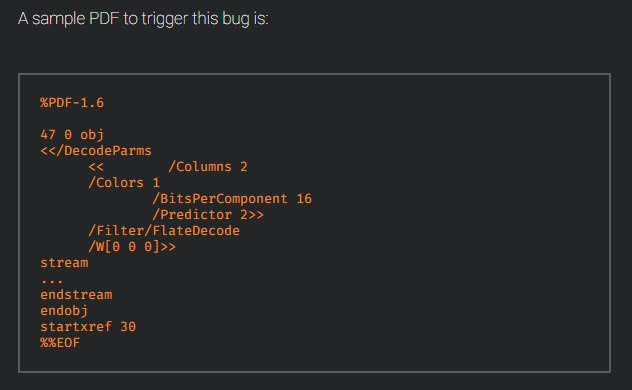

# hosselot
**https://twitter.com/hosselot/status/923800095795089408 _at 2017-10-27, 06:34:40_**
<blockquote>
Google Chrome GPU Memory Corruption Vulnerability Details and PoC (CVE-2017-5112):
https://t.co/Ky7VUr9cb7
</blockquote>

* https://bugs.chromium.org/p/chromium/issues/detail?id=740603

<table><tr>
<td>Quotes: <code>0</code></td>
<td>Replies: <code>0</code></td>
<td>Retweets: <code>80</code></td>
<td>Favorites: <code>91</code></td>
</tr></table>

---

# HaifeiLi
**https://twitter.com/HaifeiLi/status/923607702588100608 _at 2017-10-26, 17:50:10_**
<blockquote>
It's finally out.. Quick analysis on the latest Office #0day CVE-2017-11826. https://t.co/OqtuEbYxQx.
</blockquote>

* https://securingtomorrow.mcafee.com/mcafee-labs/analyzing-microsoft-office-zero-day-exploit-cve-2017-11826-memory-corruption-vulnerability

<table><tr>
<td>Quotes: <code>0</code></td>
<td>Replies: <code>1</code></td>
<td>Retweets: <code>23</code></td>
<td>Favorites: <code>36</code></td>
</tr></table>

---

# PhysicalDrive0
**https://twitter.com/PhysicalDrive0/status/923568124213022721 _at 2017-10-26, 15:12:54_**
<blockquote>
Analyzing Microsoft Office Zero-Day Exploit CVE-2017-11826: Memory Corruption Vulnerability https://t.co/f5N4W7NvJy
</blockquote>

* https://securingtomorrow.mcafee.com/mcafee-labs/analyzing-microsoft-office-zero-day-exploit-cve-2017-11826-memory-corruption-vulnerability/

<table><tr>
<td>Quotes: <code>1</code></td>
<td>Replies: <code>0</code></td>
<td>Retweets: <code>49</code></td>
<td>Favorites: <code>45</code></td>
</tr></table>

---

# nickstadb
**https://twitter.com/nickstadb/status/922118171573800960 _at 2017-10-22, 15:11:18_**
<blockquote>
Analysis of CVE-2017-12628 - Apache James Deserialization LPE/potential RCE https://t.co/Sfv2U25UBm
</blockquote>

* https://nickbloor.co.uk/2017/10/22/analysis-of-cve-2017-12628/

<table><tr>
<td>Quotes: <code>3</code></td>
<td>Replies: <code>2</code></td>
<td>Retweets: <code>66</code></td>
<td>Favorites: <code>93</code></td>
</tr></table>

---

# x0rz
**https://twitter.com/x0rz/status/921673163997700096 _at 2017-10-21, 09:43:00_**
<blockquote>
CVE-2017-5133: Google Chrome PDFium TIFF off-by-one read/write #vulnerability (could lead to code exec) https://t.co/A6eKIpkiQw #chrome https://t.co/HMKwEOckma
</blockquote>

* https://www.talosintelligence.com/reports/TALOS-2017-0432

<table><tr>
<td></td>
</table></tr>
<table><tr>
<td>Quotes: <code>3</code></td>
<td>Replies: <code>3</code></td>
<td>Retweets: <code>117</code></td>
<td>Favorites: <code>153</code></td>
</tr></table>

---

# hosselot
**https://twitter.com/hosselot/status/917281700874539009 _at 2017-10-09, 06:52:54_**
<blockquote>
Google Chrome pdfium stack-based buffer overflow vulnerability with PoC (CVE-2017-5095):
https://t.co/e2otseDBxP
</blockquote>

* https://bugs.chromium.org/p/chromium/issues/detail?id=732661

<table><tr>
<td>Quotes: <code>1</code></td>
<td>Replies: <code>1</code></td>
<td>Retweets: <code>73</code></td>
<td>Favorites: <code>98</code></td>
</tr></table>

---

# mazen160
**https://twitter.com/mazen160/status/917149821483540481 _at 2017-10-08, 22:08:51_**
<blockquote>
A PoC exploit was published for the CVE-2017-12617
https://t.co/cyaI9mPurv

Credits: @intx0x80
</blockquote>

* https://github.com/cyberheartmi9/CVE-2017-12617

<table><tr>
<td>Quotes: <code>5</code></td>
<td>Replies: <code>0</code></td>
<td>Retweets: <code>81</code></td>
<td>Favorites: <code>140</code></td>
</tr></table>

---

# TheHackersNews
**https://twitter.com/TheHackersNews/status/915898980583780352 _at 2017-10-05, 11:18:28_**
<blockquote>
Immediately Patch New Discovered Apache Tomcat RCE Flaw (CVE-2017-12617) that Allows Attackers to Hack Your Servers https://t.co/jUlsDee7VR https://t.co/IkYRH7GUUc
</blockquote>

* https://thehackernews.com/2017/10/apache-tomcat-rce.html

<table><tr>
<td></td>
</table></tr>
<table><tr>
<td>Quotes: <code>9</code></td>
<td>Replies: <code>2</code></td>
<td>Retweets: <code>293</code></td>
<td>Favorites: <code>169</code></td>
</tr></table>

---

# i_bo0om
**https://twitter.com/i_bo0om/status/915218465526620160 _at 2017-10-03, 14:14:20_**
<blockquote>
WebKit UXSS (CVE-2017-7089).
Safari 10 exploit:
https://t.co/UEePjkqHfW
</blockquote>

* https://github.com/Bo0oM/CVE-2017-7089

<table><tr>
<td>Quotes: <code>2</code></td>
<td>Replies: <code>2</code></td>
<td>Retweets: <code>120</code></td>
<td>Favorites: <code>196</code></td>
</tr></table>

---

# hosselot
**https://twitter.com/hosselot/status/914754961170460672 _at 2017-10-02, 07:32:32_**
<blockquote>
Google Chrome sandbox escape due to use of invalid PP_Instance (CVE-2017-5092) by Yuan Deng:
https://t.co/4dGrjktiEL
</blockquote>

* https://bugs.chromium.org/p/chromium/issues/detail?id=733549

<table><tr>
<td>Quotes: <code>0</code></td>
<td>Replies: <code>0</code></td>
<td>Retweets: <code>49</code></td>
<td>Favorites: <code>66</code></td>
</tr></table>

---

