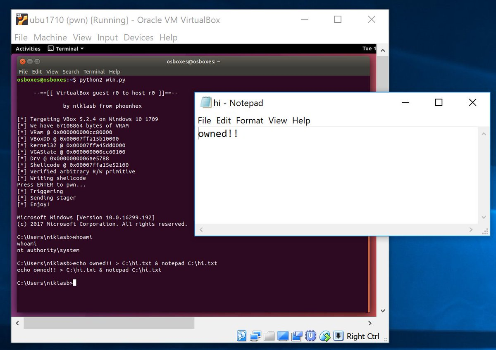
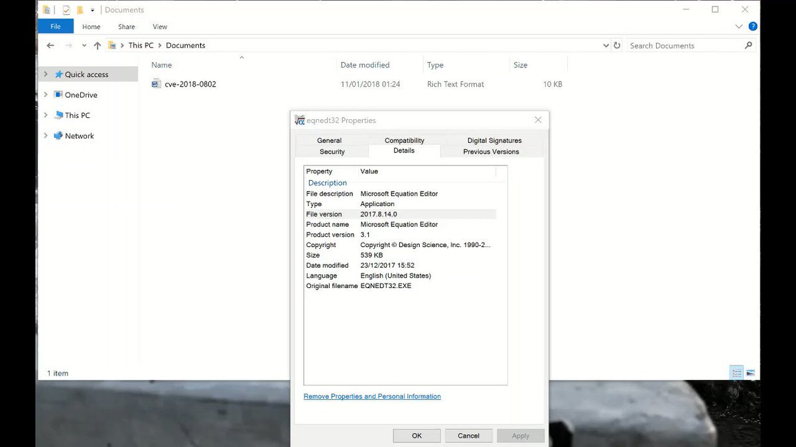
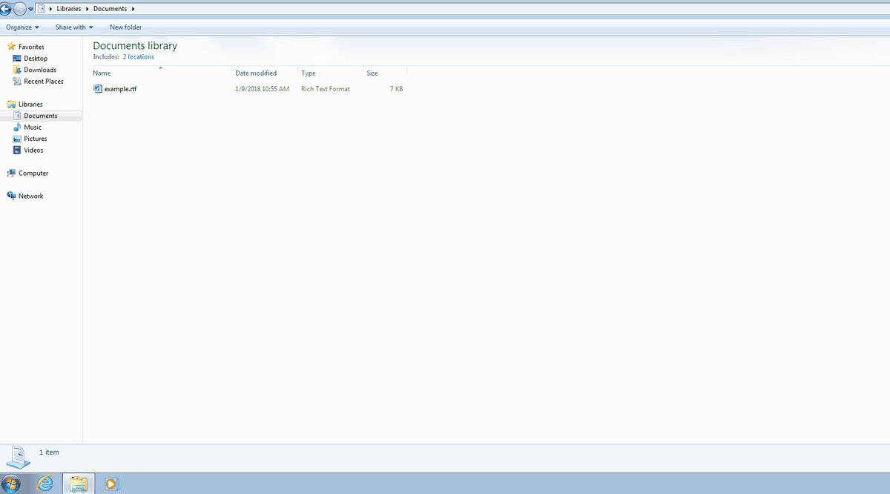
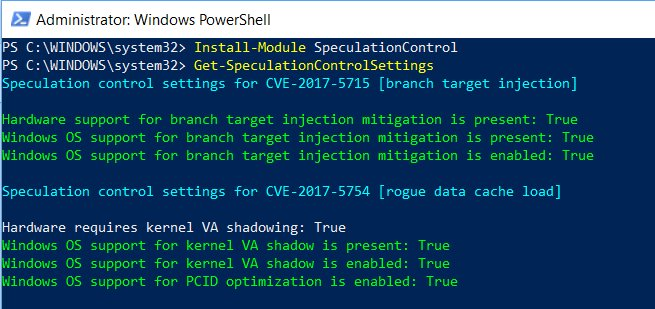

# TheHackersNews
**https://twitter.com/TheHackersNews/status/958065422942724096 _at 2018-01-29, 19:52:51_**
<blockquote>
Remote code execution (RCE) and Denial of service (DoS) vulnerability (CVE-2018-0101) discovered in the SSL VPN functionality of Cisco Adaptive Security Appliance. 

https://t.co/ZFTV93cLqM https://t.co/fo7kdGmZNb
</blockquote>

* https://tools.cisco.com/security/center/content/CiscoSecurityAdvisory/cisco-sa-20180129-asa1

<table><tr>
<td></td>
</table></tr>
<table><tr>
<td>Quotes: <code>7</code></td>
<td>Replies: <code>4</code></td>
<td>Retweets: <code>169</code></td>
<td>Favorites: <code>130</code></td>
</tr></table>

---

# hosselot
**https://twitter.com/hosselot/status/957868744994443264 _at 2018-01-29, 06:51:19_**
<blockquote>
Google Chrome V8 Use-After-Free Vulnerability + Exploit by Zhao Qixun (CVE-2017-15399):
https://t.co/gynSV1v7D0
</blockquote>

* https://bugs.chromium.org/p/chromium/issues/detail?id=776677

<table><tr>
<td>Quotes: <code>1</code></td>
<td>Replies: <code>0</code></td>
<td>Retweets: <code>97</code></td>
<td>Favorites: <code>116</code></td>
</tr></table>

---

# TheHackersNews
**https://twitter.com/TheHackersNews/status/953974245792477186 _at 2018-01-18, 12:55:58_**
<blockquote>
Hackers found exploiting following Microsoft Office flaws to install Zyklon botnet malware on targeted computers:

→ MS Office RCE Vulnerability (CVE-2017-11882)
→ .NET Framework RCE Vulnerability (CVE-2017-8759)
→ Dynamic Data Exchange (DDE Exploit)

https://t.co/XGEsOT7zjg
</blockquote>

* https://thehackernews.com/2018/01/microsoft-office-malware.html

<table><tr>
<td>Quotes: <code>2</code></td>
<td>Replies: <code>1</code></td>
<td>Retweets: <code>58</code></td>
<td>Favorites: <code>51</code></td>
</tr></table>

---

# _niklasb
**https://twitter.com/_niklasb/status/953604276726718465 _at 2018-01-17, 12:25:51_**
<blockquote>
CVE-2018-2698 is a powerful OOB read/write primitive in the (always-on) VBVA graphics component. It can be used to escape a VBox VM and escalate privs to SYSTEM on Windows 10 hosts. Since the patch is public now, definitely upgrade if you are running malicious code inside a VM. https://t.co/2s4IWuNq3e
</blockquote>

<table><tr>
<td></td>
</table></tr>
<table><tr>
<td>Quotes: <code>64</code></td>
<td>Replies: <code>26</code></td>
<td>Retweets: <code>1261</code></td>
<td>Favorites: <code>1600</code></td>
</tr></table>

---

# buffaloverflow
**https://twitter.com/buffaloverflow/status/953022469258055682 _at 2018-01-15, 21:53:57_**
<blockquote>
Turns out it was an 0day at the time! Sample is CVE-2018-0802 😵

"Fw_ Invitation letter of FW review meeting.rtf"
sha256    81c733c0bae854e280d0d3c2e7ff1fdcd0f1eef2a653286a641437dcea21f409 https://t.co/rHxZreBdW6
</blockquote>

* https://twitter.com/blu3_team/status/949702961080471552

<table><tr>
<td>Quotes: <code>1</code></td>
<td>Replies: <code>1</code></td>
<td>Retweets: <code>72</code></td>
<td>Favorites: <code>156</code></td>
</tr></table>

---

# buffaloverflow
**https://twitter.com/buffaloverflow/status/951279039251189760 _at 2018-01-11, 02:26:11_**
<blockquote>
CVE-2018-0802 exploit is working nicely 👍 https://t.co/Y6VfWMpOFv
</blockquote>

<table><tr>
<td></td>
</table></tr>
<table><tr>
<td>Quotes: <code>1</code></td>
<td>Replies: <code>7</code></td>
<td>Retweets: <code>57</code></td>
<td>Favorites: <code>150</code></td>
</tr></table>

---

# nuria_imeq
**https://twitter.com/nuria_imeq/status/950860665719312384 _at 2018-01-09, 22:43:43_**
<blockquote>
CVE-2017-0243 PoC #exploit
Description:
Microsoft Office allows a remote code execution vulnerability due to the way that it handles objects in memory, aka "Microsoft Office Remote Code Execution Vulnerability".
https://t.co/D87FLMNZRW
</blockquote>

* https://github.com/rxwx/CVE-2017-8570

<table><tr>
<td>Quotes: <code>0</code></td>
<td>Replies: <code>1</code></td>
<td>Retweets: <code>34</code></td>
<td>Favorites: <code>42</code></td>
</tr></table>

---

# buffaloverflow
**https://twitter.com/buffaloverflow/status/950813552742367236 _at 2018-01-09, 19:36:30_**
<blockquote>
I was curious if it was possible to exploit CVE-2017-8570 (aka composite moniker) using Packager. Looks like it works nicely :D

https://t.co/O6SC7UYq0O https://t.co/KIwARCVYqX
</blockquote>

* https://github.com/rxwx/CVE-2017-8570

<table><tr>
<td></td>
</table></tr>
<table><tr>
<td>Quotes: <code>3</code></td>
<td>Replies: <code>4</code></td>
<td>Retweets: <code>124</code></td>
<td>Favorites: <code>209</code></td>
</tr></table>

---

# epakskape
**https://twitter.com/epakskape/status/948781605790695424 _at 2018-01-04, 05:02:16_**
<blockquote>
You can use this powershell tool to query the status of Windows mitigations for CVE-2017-5715 (branch target injection) and CVE-2017-5754 (rogue data cache load), more information here (Server: https://t.co/9MaLQqVq61, Client: https://t.co/P6vmSamsOn) https://t.co/K0LmM3PYFP
</blockquote>

* https://support.microsoft.com/help/4072698
* https://support.microsoft.com/help/4073119

<table><tr>
<td></td>
</table></tr>
<table><tr>
<td>Quotes: <code>22</code></td>
<td>Replies: <code>10</code></td>
<td>Retweets: <code>628</code></td>
<td>Favorites: <code>771</code></td>
</tr></table>

---

