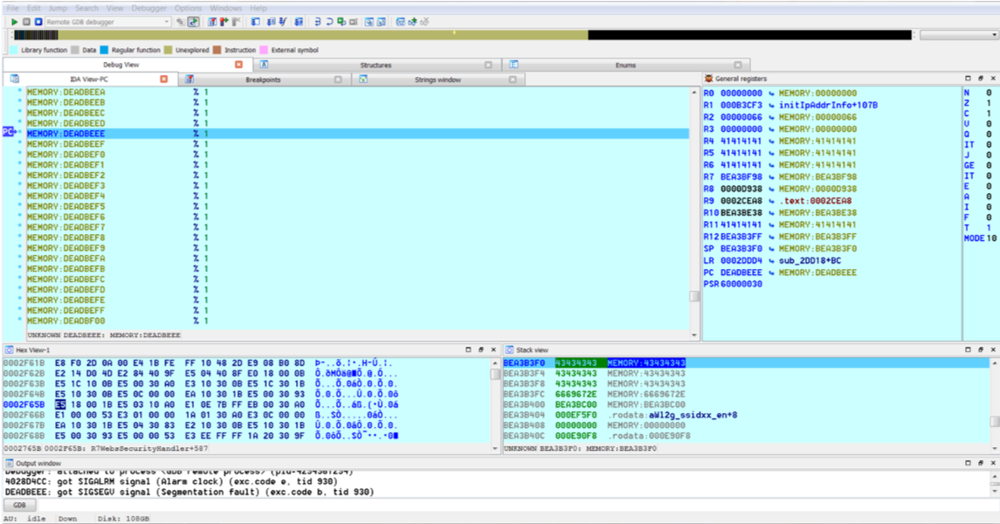

# Yalujb
**https://twitter.com/Yalujb/status/968568426833723392 _at 2018-02-27, 19:28:02_**
<blockquote>
Zimperium exploit (CVE-2018-4087 PoC) released for iOS 11.2-11.2.2. It can be used to escape Sandbox via bluetoothd daemon. #RETWEET
</blockquote>

<table><tr>
<td>Quotes: <code>4</code></td>
<td>Replies: <code>13</code></td>
<td>Retweets: <code>32</code></td>
<td>Favorites: <code>105</code></td>
</tr></table>

---

# buffaloverflow
**https://twitter.com/buffaloverflow/status/966801530803380225 _at 2018-02-22, 22:27:01_**
<blockquote>
Wow, interesting sample.. I think I count 3 exploits (CVE-2017-11882, CVE-2018-0802, CVE-2017-8570). Wins 🏅4 noisiest sample 4sure! 😂 Looks like its dropping #remcos 12/57 on VT. @anyrun_app working nice 👍

https://t.co/B9zvMr8mFA
https://t.co/JfrO8hFi6R
</blockquote>

* https://app.any.run/tasks/ed208ecc-54e3-4613-a7a6-453647381a80
* https://www.virustotal.com/#/file/52be37fca69737ea52edcc4dbb7549fc63bfd017f36a308d08514534b522e4bc/detection

<table><tr>
<td>Quotes: <code>0</code></td>
<td>Replies: <code>5</code></td>
<td>Retweets: <code>36</code></td>
<td>Favorites: <code>84</code></td>
</tr></table>

---

# enigma0x3
**https://twitter.com/enigma0x3/status/964516203753598977 _at 2018-02-16, 15:05:57_**
<blockquote>
While CVE-2018-0827 fixed the injection bug in pubprn.vbs, it only fixed it in the System32/SysWOW64 paths and the corresponding hardlink. The vulnerable (signed) version still exists in other Windows Side-by-Side paths (these vary between Windows builds). Blue: Watch for these! https://t.co/Lp20TFoC5i
</blockquote>

<table><tr>
<td></td>
</table></tr>
<table><tr>
<td>Quotes: <code>0</code></td>
<td>Replies: <code>0</code></td>
<td>Retweets: <code>139</code></td>
<td>Favorites: <code>241</code></td>
</tr></table>

---

# binitamshah
**https://twitter.com/binitamshah/status/964074512584122368 _at 2018-02-15, 09:50:50_**
<blockquote>
Remote Code Execution walk-through (CVE-2018-5767) on Tenda AC15 Router : https://t.co/EidAPXiBRh cc @FidusInfoSec https://t.co/n21foJQsj5
</blockquote>

* https://www.fidusinfosec.com/remote-code-execution-cve-2018-5767/

<table><tr>
<td></td>
<td></td>
</table></tr>
<table><tr>
<td>Quotes: <code>0</code></td>
<td>Replies: <code>0</code></td>
<td>Retweets: <code>35</code></td>
<td>Favorites: <code>61</code></td>
</tr></table>

---

# _odisseus
**https://twitter.com/_odisseus/status/964033536440270848 _at 2018-02-15, 07:08:00_**
<blockquote>
Public disclosure – 14/2/2018: Remote Code Execution (RCE) CVE-2018-5767 on #Tenda Router AC15. Credits: @__invictus_  cc: @MalwareMustDie 
#MalwareMustDie 
https://t.co/PCbRUHVkXI https://t.co/uG3o0Qo5Xb
</blockquote>

* https://www.fidusinfosec.com/remote-code-execution-cve-2018-5767/

<table><tr>
<td></td>
</table></tr>
<table><tr>
<td>Quotes: <code>0</code></td>
<td>Replies: <code>1</code></td>
<td>Retweets: <code>24</code></td>
<td>Favorites: <code>37</code></td>
</tr></table>

---

