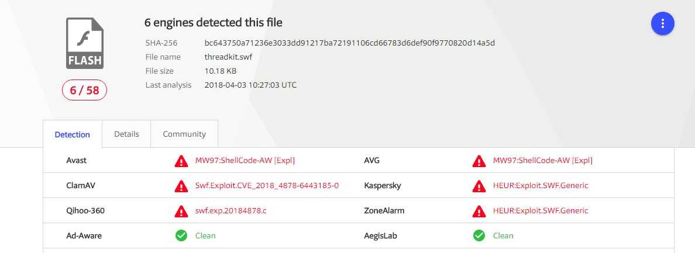

# TheHackersNews
**https://twitter.com/TheHackersNews/status/990950271323901952 _at 2018-04-30, 13:45:30_**
<blockquote>
Incomplete Security Patch for a Critical RCE Flaw (CVE-2018-2628) in #Oracle WebLogic Software Once Again Opens Updated Servers to Remote Hackers

https://t.co/FjE6Q1qfnd

A New Patch is Not Yet Available. https://t.co/I0IdukgHQg
</blockquote>

* https://thehackernews.com/2018/04/oracle-weblogic-rce-exploit.html

<table><tr>
<td></td>
</table></tr>
<table><tr>
<td>Quotes: <code>10</code></td>
<td>Replies: <code>5</code></td>
<td>Retweets: <code>214</code></td>
<td>Favorites: <code>208</code></td>
</tr></table>

---

# TheHackersNews
**https://twitter.com/TheHackersNews/status/989923796252585984 _at 2018-04-27, 17:46:39_**
<blockquote>
DoS to DeAnonymization —  @PaulosYibelo find a flaw (CVE-2018-10308) in SaferVPN's chrome extension that leaks users' real IP address.

If a site tries to resolve non-existent domains continually, SaferVPN extension kills itself, leaving user uncovered.

https://t.co/SUhQ2LKkip
</blockquote>

* http://www.paulosyibelo.com/2018/04/safervpn-cve-2018-10308-from-dos-to-ip.html

<table><tr>
<td>Quotes: <code>1</code></td>
<td>Replies: <code>0</code></td>
<td>Retweets: <code>37</code></td>
<td>Favorites: <code>43</code></td>
</tr></table>

---

# Dinosn
**https://twitter.com/Dinosn/status/988044456690675712 _at 2018-04-22, 13:18:50_**
<blockquote>
Cve-2015-2546 Uaf Analysis And Exploitation https://t.co/1JVkWqlRuE
</blockquote>

* https://xiaodaozhi.com/exploit/132.html

<table><tr>
<td>Quotes: <code>0</code></td>
<td>Replies: <code>0</code></td>
<td>Retweets: <code>30</code></td>
<td>Favorites: <code>60</code></td>
</tr></table>

---

# Leeqwind
**https://twitter.com/Leeqwind/status/988011700812107776 _at 2018-04-22, 11:08:40_**
<blockquote>
CVE-2015-2546 use-after-free analysis and exploitation: [zh]https://t.co/hAbgxzxlc5 [en]https://t.co/6CLw4r08RP - similar to and different from CVE-2017-0263 https://t.co/mXI1965rGR
</blockquote>

* https://xiaodaozhi.com/exploit/122.html
* https://xiaodaozhi.com/exploit/132.html

<table><tr>
<td></td>
<td></td>
</table></tr>
<table><tr>
<td>Quotes: <code>0</code></td>
<td>Replies: <code>0</code></td>
<td>Retweets: <code>29</code></td>
<td>Favorites: <code>46</code></td>
</tr></table>

---

# TheHackersNews
**https://twitter.com/TheHackersNews/status/985952133206900736 _at 2018-04-16, 18:44:41_**
<blockquote>
Proof-of-Concept (PoC) exploit for Windows CredSSP remote code execution vulnerability (CVE-2018-0886) is now available

Exploit Code — https://t.co/OC2wQlqA1T

Details — https://t.co/5fxl1C1v50

CredSSP RDP flaw affects all versions of Windows. https://t.co/EXPAvQw4Kl
</blockquote>

* https://github.com/preempt/credssp
* https://thehackernews.com/2018/03/credssp-rdp-exploit.html

<table><tr>
<td></td>
</table></tr>
<table><tr>
<td>Quotes: <code>10</code></td>
<td>Replies: <code>4</code></td>
<td>Retweets: <code>357</code></td>
<td>Favorites: <code>379</code></td>
</tr></table>

---

# j00ru
**https://twitter.com/j00ru/status/985894472478265344 _at 2018-04-16, 14:55:33_**
<blockquote>
As promised last week, the details of the .PDB heap memory disclosure in Visual Studio (CVE-2018-1037) are now available at https://t.co/vgryBrNBc0. Infoleaks are a really special breed of bugs, be it in kernel or user-mode 🐛 https://t.co/diwbO7I5S7
</blockquote>

* https://bugs.chromium.org/p/project-zero/issues/detail?id=1500

<table><tr>
<td></td>
</table></tr>
<table><tr>
<td>Quotes: <code>8</code></td>
<td>Replies: <code>2</code></td>
<td>Retweets: <code>85</code></td>
<td>Favorites: <code>133</code></td>
</tr></table>

---

# GreyNoiseIO
**https://twitter.com/GreyNoiseIO/status/985222340576468992 _at 2018-04-14, 18:24:45_**
<blockquote>
GreyNoise has CONFIRMED widespread opportunistic exploitation of the #Drupal CVE-2018-7600 vulnerability. Patient zero spotted at 2:00PM EST yesterday, 4/13/2018. 720 IPs confirmed spreading the worm so far and increasing quickly. Network owners of compromised hosts attached. https://t.co/BRGH8iaRLH
</blockquote>

<table><tr>
<td></td>
</table></tr>
<table><tr>
<td>Quotes: <code>5</code></td>
<td>Replies: <code>2</code></td>
<td>Retweets: <code>93</code></td>
<td>Favorites: <code>97</code></td>
</tr></table>

---

# BrandonPrry
**https://twitter.com/BrandonPrry/status/984606339233210368 _at 2018-04-13, 01:36:59_**
<blockquote>
Uploaded a Metasploit module to the VolatileMinds store exploiting the recent unauthenticated Drupal RCE (SA-CORE-2018-002 / CVE-2018-7600). 

https://t.co/QhnysXERlp
</blockquote>

* https://store.volatileminds.net/Home/ViewProduct?id=589c39be-a5e0-4acf-aeb7-a8c10019d88d&name=Drupal%20Core%20Unauthenticated%20Remote%20Code%20Execution

<table><tr>
<td>Quotes: <code>2</code></td>
<td>Replies: <code>2</code></td>
<td>Retweets: <code>18</code></td>
<td>Favorites: <code>32</code></td>
</tr></table>

---

# TheHackersNews
**https://twitter.com/TheHackersNews/status/984335136044011520 _at 2018-04-12, 07:39:19_**
<blockquote>
Warning—Just opening an email in Microsoft Outlook can give away your Windows password to hackers, without requiring additional interaction

https://t.co/eekEUujcdv

This week, MS issued an incomplete fix for #Outlook flaw (CVE-2018-0950)—almost 18 months after the initial report https://t.co/i4qJUdHIxm
</blockquote>

* https://thehackernews.com/2018/04/outlook-smb-vulnerability.html

<table><tr>
<td></td>
</table></tr>
<table><tr>
<td>Quotes: <code>41</code></td>
<td>Replies: <code>16</code></td>
<td>Retweets: <code>650</code></td>
<td>Favorites: <code>503</code></td>
</tr></table>

---

# TheHackersNews
**https://twitter.com/TheHackersNews/status/983826111078559744 _at 2018-04-10, 21:56:38_**
<blockquote>
Microsoft also released a patch for another critical RCE flaw (CVE-2018-1004), which exists in Windows VBScript Engine &amp; affects all versions of Windows.

"An attacker could host a specially crafted website that is designed to exploit the vulnerability through IE," MS explains
</blockquote>

<table><tr>
<td>Quotes: <code>3</code></td>
<td>Replies: <code>5</code></td>
<td>Retweets: <code>48</code></td>
<td>Favorites: <code>69</code></td>
</tr></table>

---

# TheHackersNews
**https://twitter.com/TheHackersNews/status/983357479437422595 _at 2018-04-09, 14:54:27_**
<blockquote>
Critical Remote Code Execution (CVE-2018-9843) Vulnerability Discovered in #CyberArk Password Vault Web Access

PoC Exploit Released — https://t.co/wWgZj8GjYy

Enterprises Using CyberArk's Privileged Account Security Solution are Highly Recommended to Upgrade Software Immediately https://t.co/0suv76LHb2
</blockquote>

* https://thehackernews.com/2018/04/enterprise-password-vault.html

<table><tr>
<td></td>
</table></tr>
<table><tr>
<td>Quotes: <code>8</code></td>
<td>Replies: <code>1</code></td>
<td>Retweets: <code>153</code></td>
<td>Favorites: <code>120</code></td>
</tr></table>

---

# pyn3rd
**https://twitter.com/pyn3rd/status/982987640931737600 _at 2018-04-08, 14:24:51_**
<blockquote>
CVE-2018-1270 Remote Code Execution with spring-messaging https://t.co/rHG3p3p0rP
</blockquote>

<table><tr>
<td></td>
</table></tr>
<table><tr>
<td>Quotes: <code>2</code></td>
<td>Replies: <code>2</code></td>
<td>Retweets: <code>86</code></td>
<td>Favorites: <code>202</code></td>
</tr></table>

---

# CyberWarship
**https://twitter.com/CyberWarship/status/982890682904989696 _at 2018-04-08, 07:59:34_**
<blockquote>
CVE-2018-0752 - Exploit

Microsoft Windows - NtImpersonateAnonymousToken LPAC to Non-LPAC Privilege Escalation

#infosec #pentest #exploit 
https://t.co/yGn0mCRtLq https://t.co/W5w7KRAZtL
</blockquote>

* https://www.exploit-db.com/exploits/43516/

<table><tr>
<td></td>
</table></tr>
<table><tr>
<td>Quotes: <code>3</code></td>
<td>Replies: <code>0</code></td>
<td>Retweets: <code>57</code></td>
<td>Favorites: <code>122</code></td>
</tr></table>

---

# Yalujb
**https://twitter.com/Yalujb/status/982881935683829762 _at 2018-04-08, 07:24:49_**
<blockquote>
Google Project Zero publishes WebKit bug (CVE-2018-4121) along with write-up and PoC. It achieves sandbox escape in iOS 11.2.6. #security #update
</blockquote>

<table><tr>
<td>Quotes: <code>2</code></td>
<td>Replies: <code>6</code></td>
<td>Retweets: <code>18</code></td>
<td>Favorites: <code>79</code></td>
</tr></table>

---

# TheHackersNews
**https://twitter.com/TheHackersNews/status/982167289398099968 _at 2018-04-06, 08:05:04_**
<blockquote>
Three Vulnerabilities Discovered in Spring Development Framework — Upgrade Immediately to Protect Your Applications

https://t.co/ytHgTw59LU

Critical — RCE Attack (CVE-2018-1270)
High — Directory Traversal Attack (CVE-2018-1271)
Low — Multipart Content Pollution (CVE-2018-1272) https://t.co/3UQj3iD3qO
</blockquote>

* https://thehackernews.com/2018/04/spring-framework-hacking.html

<table><tr>
<td></td>
</table></tr>
<table><tr>
<td>Quotes: <code>7</code></td>
<td>Replies: <code>1</code></td>
<td>Retweets: <code>138</code></td>
<td>Favorites: <code>115</code></td>
</tr></table>

---

# TheHackersNews
**https://twitter.com/TheHackersNews/status/981548143182565376 _at 2018-04-04, 15:04:48_**
<blockquote>
Security researchers have disclosed details &amp; PoC for a critical remote code execution vulnerability (CVE-2018-0171) in the "Cisco Smart Install" feature of Cisco IOS &amp; Cisco IOS XE Software

https://t.co/F1QRbMrTWf

Flaw leaves thousands of network devices vulnerable to hacking https://t.co/rtKZSbtnW8
</blockquote>

* https://thehackernews.com/2018/04/cisco-switches-hacking.html

<table><tr>
<td></td>
</table></tr>
<table><tr>
<td>Quotes: <code>3</code></td>
<td>Replies: <code>3</code></td>
<td>Retweets: <code>131</code></td>
<td>Favorites: <code>97</code></td>
</tr></table>

---

# buffaloverflow
**https://twitter.com/buffaloverflow/status/981118047846006784 _at 2018-04-03, 10:35:45_**
<blockquote>
Threadkit seems to have a new CVE-2018-4878 exploit, or at least I've not seen it before. Is this new? https://t.co/t5iYV2cB0a
</blockquote>

<table><tr>
<td></td>
<td></td>
</table></tr>
<table><tr>
<td>Quotes: <code>2</code></td>
<td>Replies: <code>4</code></td>
<td>Retweets: <code>41</code></td>
<td>Favorites: <code>69</code></td>
</tr></table>

---

# x9090
**https://twitter.com/x9090/status/980944786696822784 _at 2018-04-02, 23:07:16_**
<blockquote>
My differential analysis to find out the root cause of Word UAF vulnerability CVE-2018-0797. #AlleyCat and #Lighthouse plugins users might want to check this out as there are some improvements for these tools https://t.co/tYqvsLzJeD
</blockquote>

* https://www.fortinet.com/blog/threat-research/a-root-cause-analysis-of-cve-2018-0797---rich-text-format-styles.html

<table><tr>
<td>Quotes: <code>0</code></td>
<td>Replies: <code>0</code></td>
<td>Retweets: <code>62</code></td>
<td>Favorites: <code>90</code></td>
</tr></table>

---

