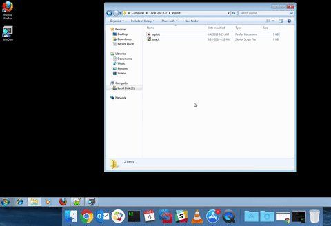
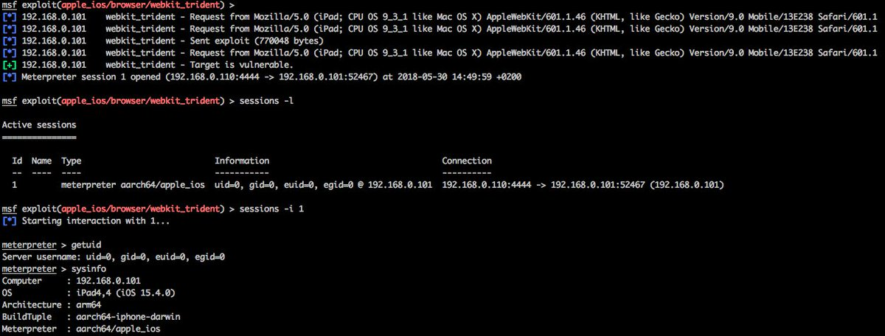

# hosselot
**https://twitter.com/hosselot/status/1012638938014605312 _at 2018-06-29, 10:08:31_**
<blockquote>
Poc/Details of Microsoft Edge Chakra Engine JIT Use-after-free Vulnerability by fortinet (CVE-2018-0946):
https://t.co/orvqaCjk0l
</blockquote>

* https://www.fortinet.com/blog/threat-research/an-analysis-of-the-use-after-free-bug-in-microsoft-edge-chakra-engine.html

<table><tr>
<td>Quotes: <code>0</code></td>
<td>Replies: <code>0</code></td>
<td>Retweets: <code>15</code></td>
<td>Favorites: <code>42</code></td>
</tr></table>

---

# schneems
**https://twitter.com/schneems/status/1009108784952770560 _at 2018-06-19, 16:20:57_**
<blockquote>
Good news everyone! There's a Rails Asset Pipeline Directory Traversal Vulnerability (CVE-2018-3760) that has just been released.
 https://t.co/gaveZoTjEb
</blockquote>

* https://blog.heroku.com/rails-asset-pipeline-vulnerability

<table><tr>
<td>Quotes: <code>1</code></td>
<td>Replies: <code>3</code></td>
<td>Retweets: <code>19</code></td>
<td>Favorites: <code>33</code></td>
</tr></table>

---

# Dinosn
**https://twitter.com/Dinosn/status/1007865584875397120 _at 2018-06-16, 06:00:55_**
<blockquote>
Microsoft COM for Windows Remote Code Execution Vulnerability (CVE-2018-0824) Analysis and PoC
https://t.co/ndbJ5pIalp
</blockquote>

* https://codewhitesec.blogspot.com/2018/06/cve-2018-0624.html

<table><tr>
<td>Quotes: <code>0</code></td>
<td>Replies: <code>0</code></td>
<td>Retweets: <code>53</code></td>
<td>Favorites: <code>62</code></td>
</tr></table>

---

# matthias_kaiser
**https://twitter.com/matthias_kaiser/status/1007614242231586816 _at 2018-06-15, 13:22:10_**
<blockquote>
For the COM lovers -  My analysis of CVE-2018-0624 with POC :-) https://t.co/kfPqpm9T6O
</blockquote>

* https://twitter.com/codewhitesec/status/1007614010504765440

<table><tr>
<td>Quotes: <code>4</code></td>
<td>Replies: <code>4</code></td>
<td>Retweets: <code>84</code></td>
<td>Favorites: <code>145</code></td>
</tr></table>

---

# codewhitesec
**https://twitter.com/codewhitesec/status/1007614010504765440 _at 2018-06-15, 13:21:15_**
<blockquote>
No public details for CVE-2018-0624? Not our style ;) Check out our new blog https://t.co/CQJDDCXtuq
</blockquote>

* https://codewhitesec.blogspot.com/2018/06/cve-2018-0624.html

<table><tr>
<td>Quotes: <code>12</code></td>
<td>Replies: <code>4</code></td>
<td>Retweets: <code>164</code></td>
<td>Favorites: <code>236</code></td>
</tr></table>

---

# 360CoreSec
**https://twitter.com/360CoreSec/status/1004703755806257152 _at 2018-06-07, 12:36:56_**
<blockquote>
CVE-2018-5002 – Analysis of the Second Wave of Flash Zero-day Exploit in 2018... https://t.co/gwuLu68o68
</blockquote>

* http://blogs.360.cn/blog/cve-2018-5002-en/

<table><tr>
<td>Quotes: <code>7</code></td>
<td>Replies: <code>2</code></td>
<td>Retweets: <code>101</code></td>
<td>Favorites: <code>125</code></td>
</tr></table>

---

# dhaval_kapil
**https://twitter.com/dhaval_kapil/status/1003546718346960897 _at 2018-06-04, 07:59:17_**
<blockquote>
My first browser exploit :) Integer overflow in JS Array's reduceRight() leading to RCE! (CVE-2011-2371) Windows 7 (ASLR + DEP enabled). https://t.co/yFg0WWIzGt
</blockquote>

<table><tr>
<td></td>
</table></tr>
<table><tr>
<td>Quotes: <code>0</code></td>
<td>Replies: <code>0</code></td>
<td>Retweets: <code>11</code></td>
<td>Favorites: <code>58</code></td>
</tr></table>

---

# ddouhine
**https://twitter.com/ddouhine/status/1003211078623551488 _at 2018-06-03, 09:45:34_**
<blockquote>
UAF exploit in WebKit's JavaScriptCore library (CVE-2016-4657) landed in @metasploit !! First #iOS exploit in #metasploit since 2012 and one of the vuln used by the #Pegasus spyware. Awesome project by @timwr backed up by @qwertyoruiopz @s1guza @thimstar works #PhoenixNonce https://t.co/0d63HeXVex
</blockquote>

<table><tr>
<td></td>
</table></tr>
<table><tr>
<td>Quotes: <code>6</code></td>
<td>Replies: <code>5</code></td>
<td>Retweets: <code>157</code></td>
<td>Favorites: <code>289</code></td>
</tr></table>

---

