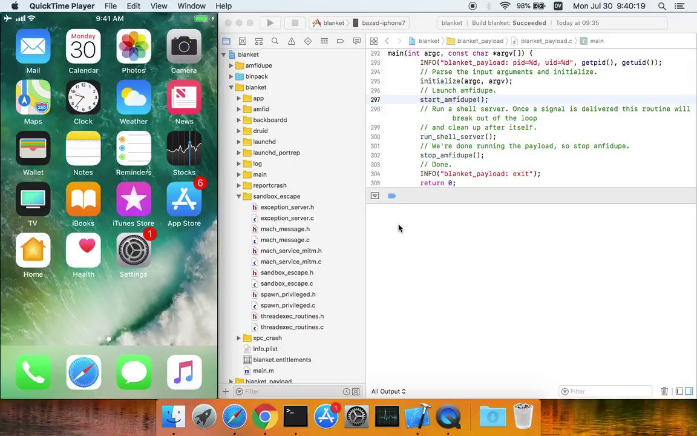
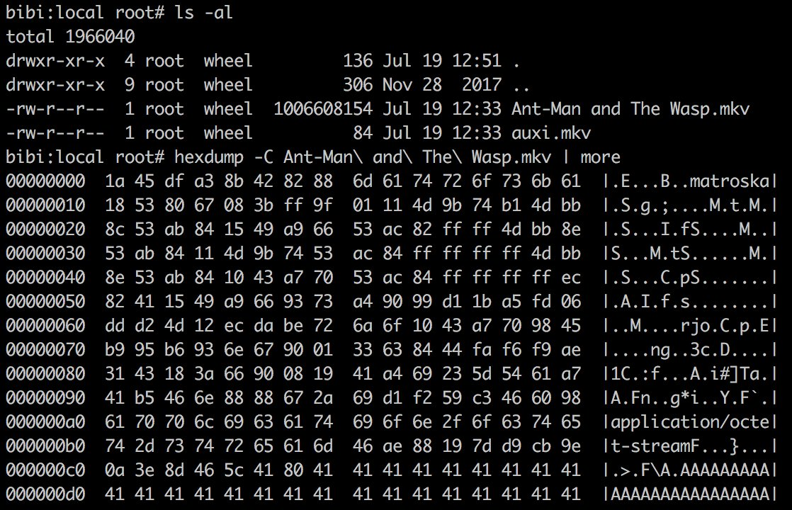

# _bazad
**https://twitter.com/_bazad/status/1023981959519694848 _at 2018-07-30, 17:21:38_**
<blockquote>
I'll be presenting "Crashing to root: How to escape the iOS sandbox using abort()" at @bevxcon this September. I'll show how to exploit CVE-2018-4280, fixed in iOS 11.4.1, by crashing maliciously in order to elevate privileges, defeat codesigning, and spawn a shell on iOS 11.2.6. https://t.co/tRxLqD55fY
</blockquote>

<table><tr>
<td></td>
</table></tr>
<table><tr>
<td>Quotes: <code>7</code></td>
<td>Replies: <code>24</code></td>
<td>Retweets: <code>282</code></td>
<td>Favorites: <code>893</code></td>
</tr></table>

---

# _sudhackar
**https://twitter.com/_sudhackar/status/1022444442173624320 _at 2018-07-26, 11:32:05_**
<blockquote>
Yay! My twitter cover is no longer a 0day. Foxit patched it in 9.2 with CVE-2018-14442. PoC/video coming soon.

CC @HackSysTeam
</blockquote>

<table><tr>
<td>Quotes: <code>1</code></td>
<td>Replies: <code>0</code></td>
<td>Retweets: <code>10</code></td>
<td>Favorites: <code>44</code></td>
</tr></table>

---

# ddouhine
**https://twitter.com/ddouhine/status/1019898366996680705 _at 2018-07-19, 10:54:54_**
<blockquote>
Update VLC ! Incoming #metasploit exploit targeting a UAF in VideoLAN VLC media player &lt;= 2.2.8 ! CVE-2018-11529 discovered and exploited by Eugene Ng and module coded by Winston Ho. I guess sharing this on Torrent will pop a few shells ;) https://t.co/CiKuiAtK0q https://t.co/p61iqjFdJF
</blockquote>

* https://github.com/rapid7/metasploit-framework/pull/10335

<table><tr>
<td></td>
</table></tr>
<table><tr>
<td>Quotes: <code>16</code></td>
<td>Replies: <code>8</code></td>
<td>Retweets: <code>457</code></td>
<td>Favorites: <code>537</code></td>
</tr></table>

---

# hosselot
**https://twitter.com/hosselot/status/1017327633351282688 _at 2018-07-12, 08:39:43_**
<blockquote>
Details/PoC for Linux Kernel eBPF Privilege Escalation Vulnerability (CVE-2017-16995):
https://t.co/eFOSBTQ6Q9
</blockquote>

* https://ricklarabee.blogspot.com/2018/07/ebpf-and-analysis-of-get-rekt-linux.html

<table><tr>
<td>Quotes: <code>0</code></td>
<td>Replies: <code>1</code></td>
<td>Retweets: <code>47</code></td>
<td>Favorites: <code>65</code></td>
</tr></table>

---

# Alra3ees
**https://twitter.com/Alra3ees/status/1015773545450917888 _at 2018-07-08, 01:44:20_**
<blockquote>
Tool for exploiting unauthenticated RCE Oracle's Weblogic WAS
for:- 
- Exploiting CVE-2017-3248 (Oracle WebLogic RMI Registry UnicastRef Object Java Deserialization Remote Code Execution)
- Checking if a weblogic server is vulnerable
https://t.co/IAF49Y1WeI
</blockquote>

* https://github.com/quentinhardy/scriptsAndExploits

<table><tr>
<td>Quotes: <code>0</code></td>
<td>Replies: <code>0</code></td>
<td>Retweets: <code>44</code></td>
<td>Favorites: <code>80</code></td>
</tr></table>

---

# bobsecq
**https://twitter.com/bobsecq/status/1015584328514973697 _at 2018-07-07, 13:12:27_**
<blockquote>
First script for exploiting unauthenticated RCE over T3 protocol (CVE-2017-3248) on Weblogic servers (i.e. version 12.2.1.1, 12.1.3.0) #PenTest #deserialize #Exploit #POC https://t.co/9yfyWkfV1n
</blockquote>

* https://github.com/quentinhardy/scriptsAndExploits

<table><tr>
<td>Quotes: <code>2</code></td>
<td>Replies: <code>1</code></td>
<td>Retweets: <code>73</code></td>
<td>Favorites: <code>110</code></td>
</tr></table>

---

# _odisseus
**https://twitter.com/_odisseus/status/1014750957459165189 _at 2018-07-05, 06:00:56_**
<blockquote>
The CVE-2018-8174 is new 0-day vulnerability for Internet Explorer which uses a well-known technique from the exploit CVE-2014-6332.
Check the code and disassembled p-code used to exploit use-after-free (UAF) vulnerability. By @oct0xor. cc: @binitamshah 
https://t.co/BVgjvhXOgz https://t.co/aHx5eg2eXZ
</blockquote>

* https://securelist.com/delving-deep-into-vbscript-analysis-of-cve-2018-8174-exploitation/86333/

<table><tr>
<td></td>
</table></tr>
<table><tr>
<td>Quotes: <code>2</code></td>
<td>Replies: <code>2</code></td>
<td>Retweets: <code>69</code></td>
<td>Favorites: <code>106</code></td>
</tr></table>

---

# InQuest
**https://twitter.com/InQuest/status/1014149070355648513 _at 2018-07-03, 14:09:15_**
<blockquote>
Solid work from @kaspersky researcher @oct0xor on the p-code level dissection of the CVE-2018-8174 IE/VBScript UAF vulnerability. Includes write-up (https://t.co/3ySnbD6JcL) and IDA / WinDbg runtime instrumentation scripts (https://t.co/VFPkZDzhho). https://t.co/A0xp8brE0K
</blockquote>

* https://securelist.com/delving-deep-into-vbscript-analysis-of-cve-2018-8174-exploitation/86333/
* https://github.com/KasperskyLab/VBscriptInternals

<table><tr>
<td></td>
</table></tr>
<table><tr>
<td>Quotes: <code>3</code></td>
<td>Replies: <code>2</code></td>
<td>Retweets: <code>66</code></td>
<td>Favorites: <code>124</code></td>
</tr></table>

---

