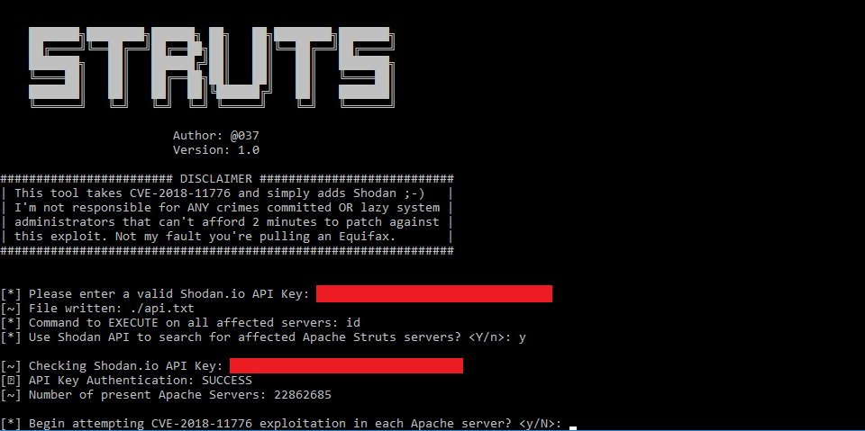
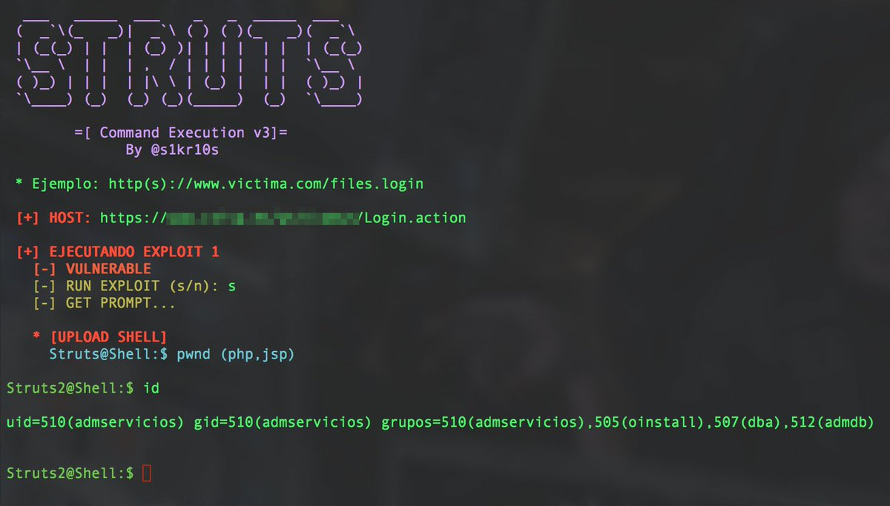

# TheHackersNews
**https://twitter.com/TheHackersNews/status/1035056193989947392 _at 2018-08-30, 06:46:41_**
<blockquote>
Hacker releases a simple tool that automatically finds vulnerable Apache Struts servers using Shodan API and performs mass exploitation via recently disclosed RCE (CVE-2018-11776) exploit

https://t.co/0Bd3aGLuZe via @037 https://t.co/SadelFQ1Zh
</blockquote>

* https://github.com/649/Apache-Struts-Shodan-Exploit

<table><tr>
<td></td>
</table></tr>
<table><tr>
<td>Quotes: <code>14</code></td>
<td>Replies: <code>3</code></td>
<td>Retweets: <code>389</code></td>
<td>Favorites: <code>504</code></td>
</tr></table>

---

# TheHackersNews
**https://twitter.com/TheHackersNews/status/1034121687288164352 _at 2018-08-27, 16:53:17_**
<blockquote>
A hacker has released an automated exploitation tool for 3 #ApacheStruts vulnerabilities, including the latest RCE flaw

https://t.co/WK1U78N9Hz

✔ CVE-2013-2251
✔ CVE-2017-5638
✔ CVE-2018-11776 https://t.co/fkc4aFMhOs
</blockquote>

* https://github.com/s1kr10s/Apache-Struts-v3

<table><tr>
<td></td>
</table></tr>
<table><tr>
<td>Quotes: <code>7</code></td>
<td>Replies: <code>7</code></td>
<td>Retweets: <code>351</code></td>
<td>Favorites: <code>493</code></td>
</tr></table>

---

# hosselot
**https://twitter.com/hosselot/status/1033953024664920065 _at 2018-08-27, 05:43:05_**
<blockquote>
[Sandbox Escape] Google Chrome IndexedDBConnection Use-after-free Vulnerability (CVE-2018-6127):
https://t.co/ktHXyilwlN
</blockquote>

* https://bugs.chromium.org/p/chromium/issues/detail?id=842990

<table><tr>
<td>Quotes: <code>0</code></td>
<td>Replies: <code>0</code></td>
<td>Retweets: <code>19</code></td>
<td>Favorites: <code>38</code></td>
</tr></table>

---

# Dinosn
**https://twitter.com/Dinosn/status/1033222999179186176 _at 2018-08-25, 05:22:14_**
<blockquote>
Learn about the Struts2 Remote Code Execution vulnerability CVE-2018-11776, how to exploit and how to create a Proof of Concept (POC) with docker. https://t.co/f9Z1k4ZUrH
</blockquote>

* https://www.secjuice.com/apache-struts2-cve-2018-11776/

<table><tr>
<td>Quotes: <code>0</code></td>
<td>Replies: <code>0</code></td>
<td>Retweets: <code>27</code></td>
<td>Favorites: <code>50</code></td>
</tr></table>

---

# HackSysTeam
**https://twitter.com/HackSysTeam/status/1029753346813509632 _at 2018-08-15, 15:35:04_**
<blockquote>
Microsoft patched one of our JScript bug which could lead to RCE and LPE on Windows as CVE-2018-8389
https://t.co/00wmlxmZsy
</blockquote>

* https://portal.msrc.microsoft.com/en-US/security-guidance/advisory/CVE-2018-8389

<table><tr>
<td>Quotes: <code>1</code></td>
<td>Replies: <code>4</code></td>
<td>Retweets: <code>26</code></td>
<td>Favorites: <code>53</code></td>
</tr></table>

---

# TheHackersNews
**https://twitter.com/TheHackersNews/status/1035056193989947392 _at 2018-08-30, 06:46:41_**
<blockquote>
Hacker releases a simple tool that automatically finds vulnerable Apache Struts servers using Shodan API and performs mass exploitation via recently disclosed RCE (CVE-2018-11776) exploit

https://t.co/0Bd3aGLuZe via @037 https://t.co/SadelFQ1Zh
</blockquote>

* https://github.com/649/Apache-Struts-Shodan-Exploit

<table><tr>
<td></td>
</table></tr>
<table><tr>
<td>Quotes: <code>14</code></td>
<td>Replies: <code>3</code></td>
<td>Retweets: <code>389</code></td>
<td>Favorites: <code>504</code></td>
</tr></table>

---

# TheHackersNews
**https://twitter.com/TheHackersNews/status/1034121687288164352 _at 2018-08-27, 16:53:17_**
<blockquote>
A hacker has released an automated exploitation tool for 3 #ApacheStruts vulnerabilities, including the latest RCE flaw

https://t.co/WK1U78N9Hz

✔ CVE-2013-2251
✔ CVE-2017-5638
✔ CVE-2018-11776 https://t.co/fkc4aFMhOs
</blockquote>

* https://github.com/s1kr10s/Apache-Struts-v3

<table><tr>
<td></td>
</table></tr>
<table><tr>
<td>Quotes: <code>7</code></td>
<td>Replies: <code>7</code></td>
<td>Retweets: <code>351</code></td>
<td>Favorites: <code>493</code></td>
</tr></table>

---

# hosselot
**https://twitter.com/hosselot/status/1033953024664920065 _at 2018-08-27, 05:43:05_**
<blockquote>
[Sandbox Escape] Google Chrome IndexedDBConnection Use-after-free Vulnerability (CVE-2018-6127):
https://t.co/ktHXyilwlN
</blockquote>

* https://bugs.chromium.org/p/chromium/issues/detail?id=842990

<table><tr>
<td>Quotes: <code>0</code></td>
<td>Replies: <code>0</code></td>
<td>Retweets: <code>19</code></td>
<td>Favorites: <code>38</code></td>
</tr></table>

---

# Dinosn
**https://twitter.com/Dinosn/status/1033222999179186176 _at 2018-08-25, 05:22:14_**
<blockquote>
Learn about the Struts2 Remote Code Execution vulnerability CVE-2018-11776, how to exploit and how to create a Proof of Concept (POC) with docker. https://t.co/f9Z1k4ZUrH
</blockquote>

* https://www.secjuice.com/apache-struts2-cve-2018-11776/

<table><tr>
<td>Quotes: <code>0</code></td>
<td>Replies: <code>0</code></td>
<td>Retweets: <code>27</code></td>
<td>Favorites: <code>50</code></td>
</tr></table>

---

# HackSysTeam
**https://twitter.com/HackSysTeam/status/1029753346813509632 _at 2018-08-15, 15:35:04_**
<blockquote>
Microsoft patched one of our JScript bug which could lead to RCE and LPE on Windows as CVE-2018-8389
https://t.co/00wmlxmZsy
</blockquote>

* https://portal.msrc.microsoft.com/en-US/security-guidance/advisory/CVE-2018-8389

<table><tr>
<td>Quotes: <code>1</code></td>
<td>Replies: <code>4</code></td>
<td>Retweets: <code>26</code></td>
<td>Favorites: <code>53</code></td>
</tr></table>

---

