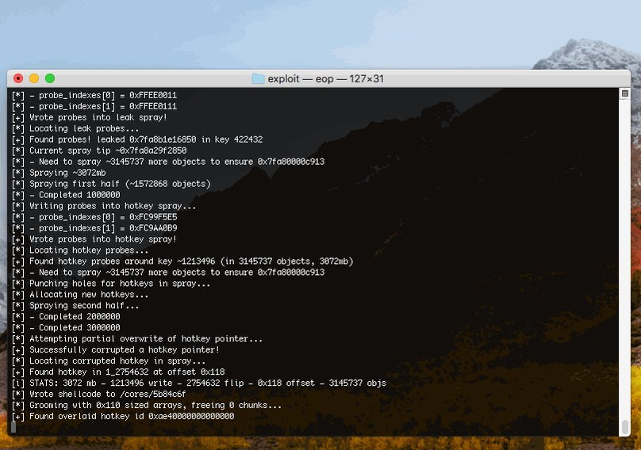
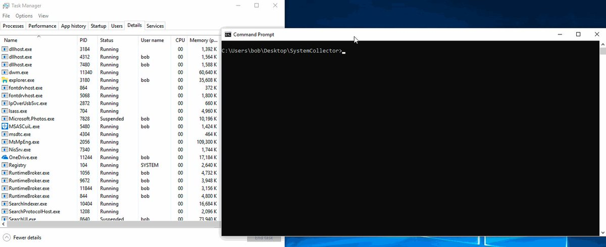
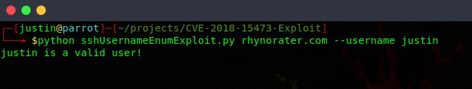

# TheHackersNews
**https://twitter.com/TheHackersNews/status/1035056193989947392 _at 2018-08-30, 06:46:41_**
<blockquote>
Hacker releases a simple tool that automatically finds vulnerable Apache Struts servers using Shodan API and performs mass exploitation via recently disclosed RCE (CVE-2018-11776) exploit

https://t.co/0Bd3aGLuZe via @037 https://t.co/SadelFQ1Zh
</blockquote>

* https://github.com/649/Apache-Struts-Shodan-Exploit

<table><tr>
<td></td>
</table></tr>
<table><tr>
<td>Quotes: <code>14</code></td>
<td>Replies: <code>3</code></td>
<td>Retweets: <code>389</code></td>
<td>Favorites: <code>504</code></td>
</tr></table>

---

# TheHackersNews
**https://twitter.com/TheHackersNews/status/1034121687288164352 _at 2018-08-27, 16:53:17_**
<blockquote>
A hacker has released an automated exploitation tool for 3 #ApacheStruts vulnerabilities, including the latest RCE flaw

https://t.co/WK1U78N9Hz

✔ CVE-2013-2251
✔ CVE-2017-5638
✔ CVE-2018-11776 https://t.co/fkc4aFMhOs
</blockquote>

* https://github.com/s1kr10s/Apache-Struts-v3

<table><tr>
<td></td>
</table></tr>
<table><tr>
<td>Quotes: <code>7</code></td>
<td>Replies: <code>7</code></td>
<td>Retweets: <code>351</code></td>
<td>Favorites: <code>493</code></td>
</tr></table>

---

# hosselot
**https://twitter.com/hosselot/status/1033953024664920065 _at 2018-08-27, 05:43:05_**
<blockquote>
[Sandbox Escape] Google Chrome IndexedDBConnection Use-after-free Vulnerability (CVE-2018-6127):
https://t.co/ktHXyilwlN
</blockquote>

* https://bugs.chromium.org/p/chromium/issues/detail?id=842990

<table><tr>
<td>Quotes: <code>0</code></td>
<td>Replies: <code>0</code></td>
<td>Retweets: <code>19</code></td>
<td>Favorites: <code>38</code></td>
</tr></table>

---

# Dinosn
**https://twitter.com/Dinosn/status/1033222999179186176 _at 2018-08-25, 05:22:14_**
<blockquote>
Learn about the Struts2 Remote Code Execution vulnerability CVE-2018-11776, how to exploit and how to create a Proof of Concept (POC) with docker. https://t.co/f9Z1k4ZUrH
</blockquote>

* https://www.secjuice.com/apache-struts2-cve-2018-11776/

<table><tr>
<td>Quotes: <code>0</code></td>
<td>Replies: <code>0</code></td>
<td>Retweets: <code>27</code></td>
<td>Favorites: <code>50</code></td>
</tr></table>

---

# GreyNoiseIO
**https://twitter.com/GreyNoiseIO/status/1033076483080835073 _at 2018-08-24, 19:40:01_**
<blockquote>
GreyNoise has observed one (1) host (192.173.146.40) opportunistically testing  sections of the Internet for the recent Apache Struts vuln (CVE-2018-11776), but no weaponized exploits have been observed yet. We will report when wide scale opportunistic exploitation is observed.
</blockquote>

<table><tr>
<td>Quotes: <code>6</code></td>
<td>Replies: <code>7</code></td>
<td>Retweets: <code>112</code></td>
<td>Favorites: <code>184</code></td>
</tr></table>

---

# HackSysTeam
**https://twitter.com/HackSysTeam/status/1029753346813509632 _at 2018-08-15, 15:35:04_**
<blockquote>
Microsoft patched one of our JScript bug which could lead to RCE and LPE on Windows as CVE-2018-8389
https://t.co/00wmlxmZsy
</blockquote>

* https://portal.msrc.microsoft.com/en-US/security-guidance/advisory/CVE-2018-8389

<table><tr>
<td>Quotes: <code>1</code></td>
<td>Replies: <code>4</code></td>
<td>Retweets: <code>26</code></td>
<td>Favorites: <code>53</code></td>
</tr></table>

---

# thezdi
**https://twitter.com/thezdi/status/1029431405288275971 _at 2018-08-14, 18:15:47_**
<blockquote>
A full analysis of the #Microsoft #Exchange code execution bug released today (CVE-2018-8302) is now available. Includes a video demo of the exploit in action. Read the details at https://t.co/evpdEBMP8G.
</blockquote>

* http://bit.ly/2w8DH19

<table><tr>
<td>Quotes: <code>8</code></td>
<td>Replies: <code>2</code></td>
<td>Retweets: <code>162</code></td>
<td>Favorites: <code>201</code></td>
</tr></table>

---

# TheHackersNews
**https://twitter.com/TheHackersNews/status/1035056193989947392 _at 2018-08-30, 06:46:41_**
<blockquote>
Hacker releases a simple tool that automatically finds vulnerable Apache Struts servers using Shodan API and performs mass exploitation via recently disclosed RCE (CVE-2018-11776) exploit

https://t.co/0Bd3aGLuZe via @037 https://t.co/SadelFQ1Zh
</blockquote>

* https://github.com/649/Apache-Struts-Shodan-Exploit

<table><tr>
<td></td>
</table></tr>
<table><tr>
<td>Quotes: <code>14</code></td>
<td>Replies: <code>3</code></td>
<td>Retweets: <code>389</code></td>
<td>Favorites: <code>504</code></td>
</tr></table>

---

# ret2systems
**https://twitter.com/ret2systems/status/1034469866626064384 _at 2018-08-28, 15:56:50_**
<blockquote>
Closing out the #Pwn2Own 2018 blog series with with the details behind our sandbox-to-root privilege escalation (CVE-2018-4193). Write a less-shady exploit, and we'll give you a free #BinaryNinja Commercial License! https://t.co/ZwnVlobPUN https://t.co/Dm2zEqCa8A
</blockquote>

* https://blog.ret2.io/2018/08/28/pwn2own-2018-sandbox-escape/

<table><tr>
<td></td>
</table></tr>
<table><tr>
<td>Quotes: <code>6</code></td>
<td>Replies: <code>8</code></td>
<td>Retweets: <code>285</code></td>
<td>Favorites: <code>478</code></td>
</tr></table>

---

# TheHackersNews
**https://twitter.com/TheHackersNews/status/1034121687288164352 _at 2018-08-27, 16:53:17_**
<blockquote>
A hacker has released an automated exploitation tool for 3 #ApacheStruts vulnerabilities, including the latest RCE flaw

https://t.co/WK1U78N9Hz

✔ CVE-2013-2251
✔ CVE-2017-5638
✔ CVE-2018-11776 https://t.co/fkc4aFMhOs
</blockquote>

* https://github.com/s1kr10s/Apache-Struts-v3

<table><tr>
<td></td>
</table></tr>
<table><tr>
<td>Quotes: <code>7</code></td>
<td>Replies: <code>7</code></td>
<td>Retweets: <code>351</code></td>
<td>Favorites: <code>493</code></td>
</tr></table>

---

# hosselot
**https://twitter.com/hosselot/status/1033953024664920065 _at 2018-08-27, 05:43:05_**
<blockquote>
[Sandbox Escape] Google Chrome IndexedDBConnection Use-after-free Vulnerability (CVE-2018-6127):
https://t.co/ktHXyilwlN
</blockquote>

* https://bugs.chromium.org/p/chromium/issues/detail?id=842990

<table><tr>
<td>Quotes: <code>0</code></td>
<td>Replies: <code>0</code></td>
<td>Retweets: <code>19</code></td>
<td>Favorites: <code>38</code></td>
</tr></table>

---

# Dinosn
**https://twitter.com/Dinosn/status/1033222999179186176 _at 2018-08-25, 05:22:14_**
<blockquote>
Learn about the Struts2 Remote Code Execution vulnerability CVE-2018-11776, how to exploit and how to create a Proof of Concept (POC) with docker. https://t.co/f9Z1k4ZUrH
</blockquote>

* https://www.secjuice.com/apache-struts2-cve-2018-11776/

<table><tr>
<td>Quotes: <code>0</code></td>
<td>Replies: <code>0</code></td>
<td>Retweets: <code>27</code></td>
<td>Favorites: <code>50</code></td>
</tr></table>

---

# GreyNoiseIO
**https://twitter.com/GreyNoiseIO/status/1033076483080835073 _at 2018-08-24, 19:40:01_**
<blockquote>
GreyNoise has observed one (1) host (192.173.146.40) opportunistically testing  sections of the Internet for the recent Apache Struts vuln (CVE-2018-11776), but no weaponized exploits have been observed yet. We will report when wide scale opportunistic exploitation is observed.
</blockquote>

<table><tr>
<td>Quotes: <code>6</code></td>
<td>Replies: <code>7</code></td>
<td>Retweets: <code>112</code></td>
<td>Favorites: <code>184</code></td>
</tr></table>

---

# mattaustin
**https://twitter.com/mattaustin/status/1033035507616251909 _at 2018-08-24, 16:57:12_**
<blockquote>
Full writeup and POC for the RCE #vulnerability I found in Electron (CVE-2018-15685). 
https://t.co/zRMkFYgmJI
</blockquote>

* https://www.contrastsecurity.com/security-influencers/cve-2018-15685

<table><tr>
<td>Quotes: <code>6</code></td>
<td>Replies: <code>0</code></td>
<td>Retweets: <code>113</code></td>
<td>Favorites: <code>182</code></td>
</tr></table>

---

# ryHanson
**https://twitter.com/ryHanson/status/1032012102473404421 _at 2018-08-21, 21:10:33_**
<blockquote>
Here is my write up on how I discovered and exploited a privilege escalation bug affecting Windows 10, Server 2016, and Visual Studio (CVE-2018-0952): https://t.co/z4eVe7TFRC https://t.co/oR3rvDYqTj
</blockquote>

* https://www.atredis.com/blog/cve-2018-0952-privilege-escalation-vulnerability-in-windows-standard-collector-service

<table><tr>
<td></td>
</table></tr>
<table><tr>
<td>Quotes: <code>8</code></td>
<td>Replies: <code>6</code></td>
<td>Retweets: <code>476</code></td>
<td>Favorites: <code>854</code></td>
</tr></table>

---

# HackSysTeam
**https://twitter.com/HackSysTeam/status/1029753346813509632 _at 2018-08-15, 15:35:04_**
<blockquote>
Microsoft patched one of our JScript bug which could lead to RCE and LPE on Windows as CVE-2018-8389
https://t.co/00wmlxmZsy
</blockquote>

* https://portal.msrc.microsoft.com/en-US/security-guidance/advisory/CVE-2018-8389

<table><tr>
<td>Quotes: <code>1</code></td>
<td>Replies: <code>4</code></td>
<td>Retweets: <code>26</code></td>
<td>Favorites: <code>53</code></td>
</tr></table>

---

# thezdi
**https://twitter.com/thezdi/status/1029431405288275971 _at 2018-08-14, 18:15:47_**
<blockquote>
A full analysis of the #Microsoft #Exchange code execution bug released today (CVE-2018-8302) is now available. Includes a video demo of the exploit in action. Read the details at https://t.co/evpdEBMP8G.
</blockquote>

* http://bit.ly/2w8DH19

<table><tr>
<td>Quotes: <code>8</code></td>
<td>Replies: <code>2</code></td>
<td>Retweets: <code>162</code></td>
<td>Favorites: <code>201</code></td>
</tr></table>

---

# TheHackersNews
**https://twitter.com/TheHackersNews/status/1035056193989947392 _at 2018-08-30, 06:46:41_**
<blockquote>
Hacker releases a simple tool that automatically finds vulnerable Apache Struts servers using Shodan API and performs mass exploitation via recently disclosed RCE (CVE-2018-11776) exploit

https://t.co/0Bd3aGLuZe via @037 https://t.co/SadelFQ1Zh
</blockquote>

* https://github.com/649/Apache-Struts-Shodan-Exploit

<table><tr>
<td></td>
</table></tr>
<table><tr>
<td>Quotes: <code>14</code></td>
<td>Replies: <code>3</code></td>
<td>Retweets: <code>389</code></td>
<td>Favorites: <code>504</code></td>
</tr></table>

---

# ret2systems
**https://twitter.com/ret2systems/status/1034469866626064384 _at 2018-08-28, 15:56:50_**
<blockquote>
Closing out the #Pwn2Own 2018 blog series with with the details behind our sandbox-to-root privilege escalation (CVE-2018-4193). Write a less-shady exploit, and we'll give you a free #BinaryNinja Commercial License! https://t.co/ZwnVlobPUN https://t.co/Dm2zEqCa8A
</blockquote>

* https://blog.ret2.io/2018/08/28/pwn2own-2018-sandbox-escape/

<table><tr>
<td></td>
</table></tr>
<table><tr>
<td>Quotes: <code>6</code></td>
<td>Replies: <code>8</code></td>
<td>Retweets: <code>285</code></td>
<td>Favorites: <code>478</code></td>
</tr></table>

---

# TheHackersNews
**https://twitter.com/TheHackersNews/status/1034121687288164352 _at 2018-08-27, 16:53:17_**
<blockquote>
A hacker has released an automated exploitation tool for 3 #ApacheStruts vulnerabilities, including the latest RCE flaw

https://t.co/WK1U78N9Hz

✔ CVE-2013-2251
✔ CVE-2017-5638
✔ CVE-2018-11776 https://t.co/fkc4aFMhOs
</blockquote>

* https://github.com/s1kr10s/Apache-Struts-v3

<table><tr>
<td></td>
</table></tr>
<table><tr>
<td>Quotes: <code>7</code></td>
<td>Replies: <code>7</code></td>
<td>Retweets: <code>351</code></td>
<td>Favorites: <code>493</code></td>
</tr></table>

---

# hosselot
**https://twitter.com/hosselot/status/1033953024664920065 _at 2018-08-27, 05:43:05_**
<blockquote>
[Sandbox Escape] Google Chrome IndexedDBConnection Use-after-free Vulnerability (CVE-2018-6127):
https://t.co/ktHXyilwlN
</blockquote>

* https://bugs.chromium.org/p/chromium/issues/detail?id=842990

<table><tr>
<td>Quotes: <code>0</code></td>
<td>Replies: <code>0</code></td>
<td>Retweets: <code>19</code></td>
<td>Favorites: <code>38</code></td>
</tr></table>

---

# Dinosn
**https://twitter.com/Dinosn/status/1033222999179186176 _at 2018-08-25, 05:22:14_**
<blockquote>
Learn about the Struts2 Remote Code Execution vulnerability CVE-2018-11776, how to exploit and how to create a Proof of Concept (POC) with docker. https://t.co/f9Z1k4ZUrH
</blockquote>

* https://www.secjuice.com/apache-struts2-cve-2018-11776/

<table><tr>
<td>Quotes: <code>0</code></td>
<td>Replies: <code>0</code></td>
<td>Retweets: <code>27</code></td>
<td>Favorites: <code>50</code></td>
</tr></table>

---

# GreyNoiseIO
**https://twitter.com/GreyNoiseIO/status/1033076483080835073 _at 2018-08-24, 19:40:01_**
<blockquote>
GreyNoise has observed one (1) host (192.173.146.40) opportunistically testing  sections of the Internet for the recent Apache Struts vuln (CVE-2018-11776), but no weaponized exploits have been observed yet. We will report when wide scale opportunistic exploitation is observed.
</blockquote>

<table><tr>
<td>Quotes: <code>6</code></td>
<td>Replies: <code>7</code></td>
<td>Retweets: <code>112</code></td>
<td>Favorites: <code>184</code></td>
</tr></table>

---

# mattaustin
**https://twitter.com/mattaustin/status/1033035507616251909 _at 2018-08-24, 16:57:12_**
<blockquote>
Full writeup and POC for the RCE #vulnerability I found in Electron (CVE-2018-15685). 
https://t.co/zRMkFYgmJI
</blockquote>

* https://www.contrastsecurity.com/security-influencers/cve-2018-15685

<table><tr>
<td>Quotes: <code>6</code></td>
<td>Replies: <code>0</code></td>
<td>Retweets: <code>113</code></td>
<td>Favorites: <code>182</code></td>
</tr></table>

---

# ryHanson
**https://twitter.com/ryHanson/status/1032012102473404421 _at 2018-08-21, 21:10:33_**
<blockquote>
Here is my write up on how I discovered and exploited a privilege escalation bug affecting Windows 10, Server 2016, and Visual Studio (CVE-2018-0952): https://t.co/z4eVe7TFRC https://t.co/oR3rvDYqTj
</blockquote>

* https://www.atredis.com/blog/cve-2018-0952-privilege-escalation-vulnerability-in-windows-standard-collector-service

<table><tr>
<td></td>
</table></tr>
<table><tr>
<td>Quotes: <code>8</code></td>
<td>Replies: <code>6</code></td>
<td>Retweets: <code>476</code></td>
<td>Favorites: <code>854</code></td>
</tr></table>

---

# Rhynorater
**https://twitter.com/Rhynorater/status/1031715914197225475 _at 2018-08-21, 01:33:36_**
<blockquote>
Just released a new exploit for CVE-2018-15473 OpenSSH Username Enumeration! You can find it here: https://t.co/EWn4PSyo4F https://t.co/xs7S6eQkG6
</blockquote>

* https://github.com/Rhynorater/CVE-2018-15473-Exploit

<table><tr>
<td></td>
</table></tr>
<table><tr>
<td>Quotes: <code>14</code></td>
<td>Replies: <code>16</code></td>
<td>Retweets: <code>417</code></td>
<td>Favorites: <code>782</code></td>
</tr></table>

---

# HackSysTeam
**https://twitter.com/HackSysTeam/status/1029753346813509632 _at 2018-08-15, 15:35:04_**
<blockquote>
Microsoft patched one of our JScript bug which could lead to RCE and LPE on Windows as CVE-2018-8389
https://t.co/00wmlxmZsy
</blockquote>

* https://portal.msrc.microsoft.com/en-US/security-guidance/advisory/CVE-2018-8389

<table><tr>
<td>Quotes: <code>1</code></td>
<td>Replies: <code>4</code></td>
<td>Retweets: <code>26</code></td>
<td>Favorites: <code>53</code></td>
</tr></table>

---

# thezdi
**https://twitter.com/thezdi/status/1029431405288275971 _at 2018-08-14, 18:15:47_**
<blockquote>
A full analysis of the #Microsoft #Exchange code execution bug released today (CVE-2018-8302) is now available. Includes a video demo of the exploit in action. Read the details at https://t.co/evpdEBMP8G.
</blockquote>

* http://bit.ly/2w8DH19

<table><tr>
<td>Quotes: <code>8</code></td>
<td>Replies: <code>2</code></td>
<td>Retweets: <code>162</code></td>
<td>Favorites: <code>201</code></td>
</tr></table>

---

# TheHackersNews
**https://twitter.com/TheHackersNews/status/1035056193989947392 _at 2018-08-30, 06:46:41_**
<blockquote>
Hacker releases a simple tool that automatically finds vulnerable Apache Struts servers using Shodan API and performs mass exploitation via recently disclosed RCE (CVE-2018-11776) exploit

https://t.co/0Bd3aGLuZe via @037 https://t.co/SadelFQ1Zh
</blockquote>

* https://github.com/649/Apache-Struts-Shodan-Exploit

<table><tr>
<td></td>
</table></tr>
<table><tr>
<td>Quotes: <code>14</code></td>
<td>Replies: <code>3</code></td>
<td>Retweets: <code>389</code></td>
<td>Favorites: <code>504</code></td>
</tr></table>

---

# ret2systems
**https://twitter.com/ret2systems/status/1034469866626064384 _at 2018-08-28, 15:56:50_**
<blockquote>
Closing out the #Pwn2Own 2018 blog series with with the details behind our sandbox-to-root privilege escalation (CVE-2018-4193). Write a less-shady exploit, and we'll give you a free #BinaryNinja Commercial License! https://t.co/ZwnVlobPUN https://t.co/Dm2zEqCa8A
</blockquote>

* https://blog.ret2.io/2018/08/28/pwn2own-2018-sandbox-escape/

<table><tr>
<td></td>
</table></tr>
<table><tr>
<td>Quotes: <code>6</code></td>
<td>Replies: <code>8</code></td>
<td>Retweets: <code>285</code></td>
<td>Favorites: <code>478</code></td>
</tr></table>

---

# TheHackersNews
**https://twitter.com/TheHackersNews/status/1034121687288164352 _at 2018-08-27, 16:53:17_**
<blockquote>
A hacker has released an automated exploitation tool for 3 #ApacheStruts vulnerabilities, including the latest RCE flaw

https://t.co/WK1U78N9Hz

✔ CVE-2013-2251
✔ CVE-2017-5638
✔ CVE-2018-11776 https://t.co/fkc4aFMhOs
</blockquote>

* https://github.com/s1kr10s/Apache-Struts-v3

<table><tr>
<td></td>
</table></tr>
<table><tr>
<td>Quotes: <code>7</code></td>
<td>Replies: <code>7</code></td>
<td>Retweets: <code>351</code></td>
<td>Favorites: <code>493</code></td>
</tr></table>

---

# hosselot
**https://twitter.com/hosselot/status/1033953024664920065 _at 2018-08-27, 05:43:05_**
<blockquote>
[Sandbox Escape] Google Chrome IndexedDBConnection Use-after-free Vulnerability (CVE-2018-6127):
https://t.co/ktHXyilwlN
</blockquote>

* https://bugs.chromium.org/p/chromium/issues/detail?id=842990

<table><tr>
<td>Quotes: <code>0</code></td>
<td>Replies: <code>0</code></td>
<td>Retweets: <code>19</code></td>
<td>Favorites: <code>38</code></td>
</tr></table>

---

# Dinosn
**https://twitter.com/Dinosn/status/1033222999179186176 _at 2018-08-25, 05:22:14_**
<blockquote>
Learn about the Struts2 Remote Code Execution vulnerability CVE-2018-11776, how to exploit and how to create a Proof of Concept (POC) with docker. https://t.co/f9Z1k4ZUrH
</blockquote>

* https://www.secjuice.com/apache-struts2-cve-2018-11776/

<table><tr>
<td>Quotes: <code>0</code></td>
<td>Replies: <code>0</code></td>
<td>Retweets: <code>27</code></td>
<td>Favorites: <code>50</code></td>
</tr></table>

---

# GreyNoiseIO
**https://twitter.com/GreyNoiseIO/status/1033076483080835073 _at 2018-08-24, 19:40:01_**
<blockquote>
GreyNoise has observed one (1) host (192.173.146.40) opportunistically testing  sections of the Internet for the recent Apache Struts vuln (CVE-2018-11776), but no weaponized exploits have been observed yet. We will report when wide scale opportunistic exploitation is observed.
</blockquote>

<table><tr>
<td>Quotes: <code>6</code></td>
<td>Replies: <code>7</code></td>
<td>Retweets: <code>112</code></td>
<td>Favorites: <code>184</code></td>
</tr></table>

---

# mattaustin
**https://twitter.com/mattaustin/status/1033035507616251909 _at 2018-08-24, 16:57:12_**
<blockquote>
Full writeup and POC for the RCE #vulnerability I found in Electron (CVE-2018-15685). 
https://t.co/zRMkFYgmJI
</blockquote>

* https://www.contrastsecurity.com/security-influencers/cve-2018-15685

<table><tr>
<td>Quotes: <code>6</code></td>
<td>Replies: <code>0</code></td>
<td>Retweets: <code>113</code></td>
<td>Favorites: <code>182</code></td>
</tr></table>

---

# ryHanson
**https://twitter.com/ryHanson/status/1032012102473404421 _at 2018-08-21, 21:10:33_**
<blockquote>
Here is my write up on how I discovered and exploited a privilege escalation bug affecting Windows 10, Server 2016, and Visual Studio (CVE-2018-0952): https://t.co/z4eVe7TFRC https://t.co/oR3rvDYqTj
</blockquote>

* https://www.atredis.com/blog/cve-2018-0952-privilege-escalation-vulnerability-in-windows-standard-collector-service

<table><tr>
<td></td>
</table></tr>
<table><tr>
<td>Quotes: <code>8</code></td>
<td>Replies: <code>6</code></td>
<td>Retweets: <code>476</code></td>
<td>Favorites: <code>854</code></td>
</tr></table>

---

# Rhynorater
**https://twitter.com/Rhynorater/status/1031715914197225475 _at 2018-08-21, 01:33:36_**
<blockquote>
Just released a new exploit for CVE-2018-15473 OpenSSH Username Enumeration! You can find it here: https://t.co/EWn4PSyo4F https://t.co/xs7S6eQkG6
</blockquote>

* https://github.com/Rhynorater/CVE-2018-15473-Exploit

<table><tr>
<td></td>
</table></tr>
<table><tr>
<td>Quotes: <code>14</code></td>
<td>Replies: <code>16</code></td>
<td>Retweets: <code>417</code></td>
<td>Favorites: <code>782</code></td>
</tr></table>

---

# HackSysTeam
**https://twitter.com/HackSysTeam/status/1029753346813509632 _at 2018-08-15, 15:35:04_**
<blockquote>
Microsoft patched one of our JScript bug which could lead to RCE and LPE on Windows as CVE-2018-8389
https://t.co/00wmlxmZsy
</blockquote>

* https://portal.msrc.microsoft.com/en-US/security-guidance/advisory/CVE-2018-8389

<table><tr>
<td>Quotes: <code>1</code></td>
<td>Replies: <code>4</code></td>
<td>Retweets: <code>26</code></td>
<td>Favorites: <code>53</code></td>
</tr></table>

---

# thezdi
**https://twitter.com/thezdi/status/1029431405288275971 _at 2018-08-14, 18:15:47_**
<blockquote>
A full analysis of the #Microsoft #Exchange code execution bug released today (CVE-2018-8302) is now available. Includes a video demo of the exploit in action. Read the details at https://t.co/evpdEBMP8G.
</blockquote>

* http://bit.ly/2w8DH19

<table><tr>
<td>Quotes: <code>8</code></td>
<td>Replies: <code>2</code></td>
<td>Retweets: <code>162</code></td>
<td>Favorites: <code>201</code></td>
</tr></table>

---

