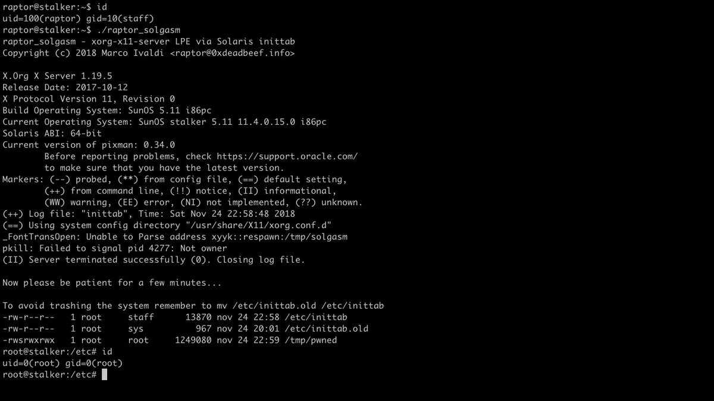
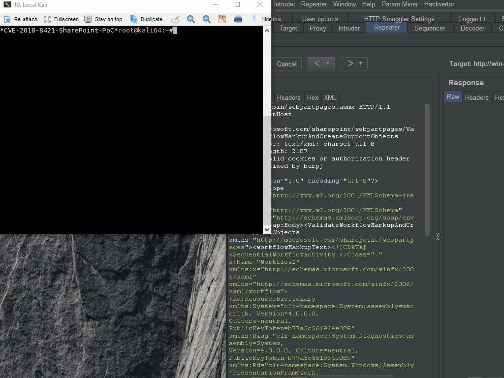
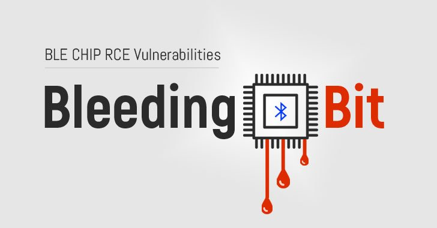

# GreyNoiseIO
**https://twitter.com/GreyNoiseIO/status/1068544966392258562 _at 2018-11-30, 16:39:07_**
<blockquote>
GreyNoise has observed a sustained 300% increase in devices scanning the Internet for 8291/TCP (Mikrotik mgmt port). Related, GreyNoise has also observed weaponization and opportunistic exploitation of CVE-2018-14847. Tags are available now. 

PoC: https://t.co/sJ7UYw4s79
</blockquote>

* https://www.exploit-db.com/exploits/45578

<table><tr>
<td>Quotes: <code>1</code></td>
<td>Replies: <code>1</code></td>
<td>Retweets: <code>56</code></td>
<td>Favorites: <code>84</code></td>
</tr></table>

---

# realBrightiup
**https://twitter.com/realBrightiup/status/1067635421683675136 _at 2018-11-28, 04:24:54_**
<blockquote>
Just release the PoC of CVE-2018-4415 and will talk more about CoreAnimation. 
https://t.co/i0uBHCM2wW
</blockquote>

* https://brightiup.me/QuartzCore/FunctionIntOverFlow.c

<table><tr>
<td>Quotes: <code>7</code></td>
<td>Replies: <code>7</code></td>
<td>Retweets: <code>60</code></td>
<td>Favorites: <code>145</code></td>
</tr></table>

---

# 0xdea
**https://twitter.com/0xdea/status/1066639453375119360 _at 2018-11-25, 10:27:17_**
<blockquote>
I was investigating another 0day, when I noticed that Solaris 11 is also affected by the recent Xorg local privilege escalation vulnerability (CVE-2018-14665).

Here’s my fresh exploit:
https://t.co/k8yCF1jr3e

Please read comments carefully before running it. https://t.co/qakLdhls3c
</blockquote>

* https://github.com/0xdea/exploits/blob/master/solaris/raptor_solgasm

<table><tr>
<td></td>
</table></tr>
<table><tr>
<td>Quotes: <code>2</code></td>
<td>Replies: <code>4</code></td>
<td>Retweets: <code>130</code></td>
<td>Favorites: <code>216</code></td>
</tr></table>

---

# irsdl
**https://twitter.com/irsdl/status/1061988090124926977 _at 2018-11-12, 14:24:26_**
<blockquote>
Blog post on XOML deserialization has been updated with a working SharePoint RCE  (using CVE-2018-8421): https://t.co/8YlDorMvnR @NCCGroupInfosec @pwntester https://t.co/eUPTiyl0Ul
</blockquote>

* https://www.nccgroup.trust/uk/our-research/technical-advisory-bypassing-microsoft-xoml-workflows-protection-mechanisms-using-deserialisation-of-untrusted-data/

<table><tr>
<td></td>
</table></tr>
<table><tr>
<td>Quotes: <code>2</code></td>
<td>Replies: <code>3</code></td>
<td>Retweets: <code>179</code></td>
<td>Favorites: <code>254</code></td>
</tr></table>

---

# hosselot
**https://twitter.com/hosselot/status/1060419986202746880 _at 2018-11-08, 06:33:21_**
<blockquote>
Google Chrome on iOS Iframe Sandbox Escape Vulnerability (CVE-2018-17472):
https://t.co/93o1jPPS9m
</blockquote>

* https://bugs.chromium.org/p/chromium/issues/detail?id=822518

<table><tr>
<td>Quotes: <code>0</code></td>
<td>Replies: <code>1</code></td>
<td>Retweets: <code>27</code></td>
<td>Favorites: <code>52</code></td>
</tr></table>

---

# matteyeux
**https://twitter.com/matteyeux/status/1059173399468105729 _at 2018-11-04, 19:59:51_**
<blockquote>
CVE-2018-4280: Mach port replacement vulnerability in launchd on macOS 10.13.5 leading to local privilege escalation and SIP bypass.
https://t.co/m4ifrnAlHe
</blockquote>

* https://github.com/bazad/launchd-portrep

<table><tr>
<td>Quotes: <code>3</code></td>
<td>Replies: <code>5</code></td>
<td>Retweets: <code>56</code></td>
<td>Favorites: <code>109</code></td>
</tr></table>

---

# TheHackersNews
**https://twitter.com/TheHackersNews/status/1058064753787068421 _at 2018-11-01, 18:34:29_**
<blockquote>
BleedingBit — Two New Critical #Bluetooth Chip RCE Vulnerabilities (CVE-2018-16986 and CVE-2018-7080) Expose Millions of BLE-Enabled Enterprise Networking Devices to Remote Attacks

https://t.co/RRxJ6uNMK9

Cisco, Meraki and Aruba Release Patches for Their Vulnerable Products https://t.co/cd3VudX9xN
</blockquote>

* https://thehackernews.com/2018/11/bluetooth-chip-hacking.html

<table><tr>
<td></td>
</table></tr>
<table><tr>
<td>Quotes: <code>11</code></td>
<td>Replies: <code>3</code></td>
<td>Retweets: <code>282</code></td>
<td>Favorites: <code>269</code></td>
</tr></table>

---

# _Icewall
**https://twitter.com/_Icewall/status/1058019779209056262 _at 2018-11-01, 15:35:47_**
<blockquote>
Promised, full exploitation  process of : TALOS-2018-0636 (CVE-2018-3971) -HitmanPro.Alert hmpalert Privilege Escalation Vulnerability https://t.co/sAlTcjUM7s . A.k.a how to use 0day in anti-0day product bypassing its LPE protection to gain SYSTEM.
</blockquote>

* https://blog.talosintelligence.com/2018/11/TALOS-2018-0636.html

<table><tr>
<td>Quotes: <code>4</code></td>
<td>Replies: <code>2</code></td>
<td>Retweets: <code>158</code></td>
<td>Favorites: <code>198</code></td>
</tr></table>

---

