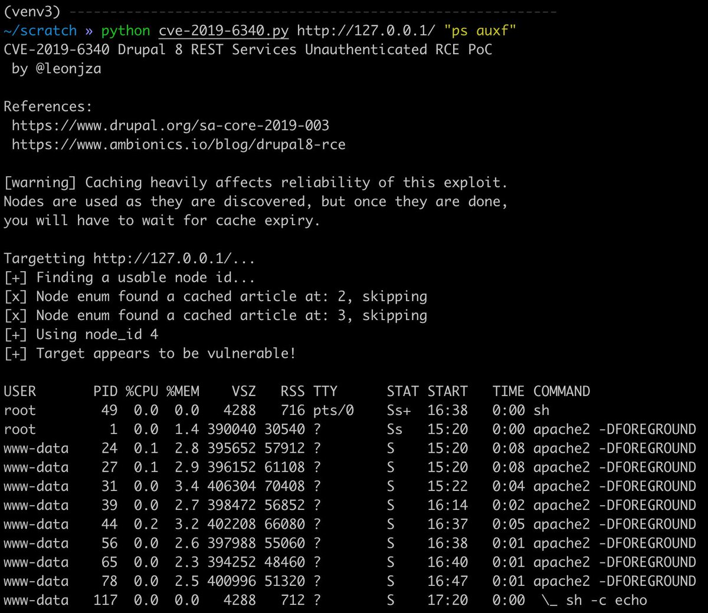
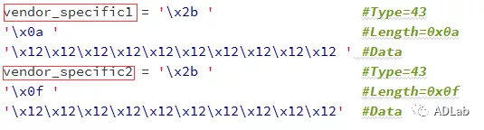
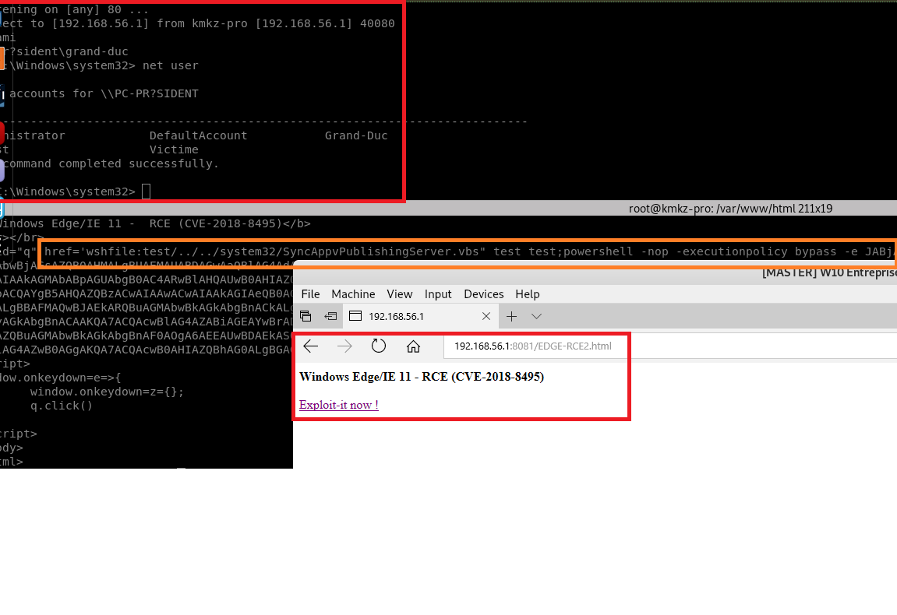
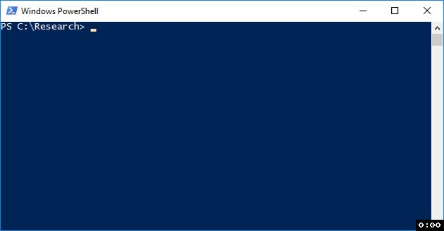

# thezdi
**https://twitter.com/thezdi/status/1101159618825408512 _at 2019-02-28, 16:38:06_**
<blockquote>
Details on CVE-2019-0546 from @HexKitchen: Visual C++ compiler bug affecting Visual Studio 2015 &amp; '17. https://t.co/V1MUBDhuFM
Quick PoC:
void f1()
{
 int y=1;
 [&amp;](){
  __asm
  {
   mov y,0xdeadbef3
  }
 }();
}
int main()
{
 volatile int r=1;
 void(*f)()=f1;
 f();
 return r;
}
</blockquote>

* http://bit.ly/2XuSz75

<table><tr>
<td>Quotes: <code>8</code></td>
<td>Replies: <code>0</code></td>
<td>Retweets: <code>173</code></td>
<td>Favorites: <code>300</code></td>
</tr></table>

---

# leonjza
**https://twitter.com/leonjza/status/1099723330746232832 _at 2019-02-24, 17:30:48_**
<blockquote>
PoC for CVE-2019-6340, the #drupal 8 REST unauthenticated RCE based on https://t.co/5loZJxaiKs. Caching heavily messes with this one it seems, so the PoC tries to find usable nodes that are not cached. Tested with the drupal:8.6.9 docker container.

https://t.co/8eNJ2hYjfu https://t.co/WFJJO6kTLm
</blockquote>

* https://www.ambionics.io/blog/drupal8-rce
* https://gist.github.com/leonjza/d0ab053be9b06fa020b66f00358e3d88

<table><tr>
<td></td>
</table></tr>
<table><tr>
<td>Quotes: <code>0</code></td>
<td>Replies: <code>1</code></td>
<td>Retweets: <code>51</code></td>
<td>Favorites: <code>104</code></td>
</tr></table>

---

# buffaloverflow
**https://twitter.com/buffaloverflow/status/1099628244406550529 _at 2019-02-24, 11:12:58_**
<blockquote>
Starting to see itw exploits for CVE-2018-20250 (WinRAR) now.

https://t.co/Gev1rHhrqg
https://t.co/uxNwZTiLF9
https://t.co/gaE2uoYz92
</blockquote>

* https://app.any.run/tasks/e8803da2-cfef-4d9d-967b-10a890953ed5
* https://app.any.run/tasks/def162f1-0038-42a1-963f-fc0acaab764d
* https://www.virustotal.com/en/file/8b1ec801a22884efde29c9d596d42bccbe9e6a981f65aecc69819bf427387d3f/analysis/

<table><tr>
<td>Quotes: <code>2</code></td>
<td>Replies: <code>2</code></td>
<td>Retweets: <code>55</code></td>
<td>Favorites: <code>107</code></td>
</tr></table>

---

# hackplayers
**https://twitter.com/hackplayers/status/1099398574125797377 _at 2019-02-23, 20:00:20_**
<blockquote>
Remote Code Execution WinRAR (CVE-2018-20250) POC https://t.co/ZTjMWT8m4h
</blockquote>

* https://ironhackers.es/tutoriales/remote-code-execution-winrar-cve-2018-20250-poc/

<table><tr>
<td>Quotes: <code>0</code></td>
<td>Replies: <code>0</code></td>
<td>Retweets: <code>31</code></td>
<td>Favorites: <code>31</code></td>
</tr></table>

---

# wugeej
**https://twitter.com/wugeej/status/1098358704536150016 _at 2019-02-20, 23:08:16_**
<blockquote>
[PoC] Windows DHCP Server Remote Code Execution Vulnerability Analysis (CVE-2019-0626)

https://t.co/qc1ZClWiTd https://t.co/cPdN0RIgFO
</blockquote>

* https://mp.weixin.qq.com/s/OissE9gAVkKmAXuiIUeOLA

<table><tr>
<td></td>
</table></tr>
<table><tr>
<td>Quotes: <code>3</code></td>
<td>Replies: <code>2</code></td>
<td>Retweets: <code>160</code></td>
<td>Favorites: <code>229</code></td>
</tr></table>

---

# XssPayloads
**https://twitter.com/XssPayloads/status/1098135934665719808 _at 2019-02-20, 08:23:03_**
<blockquote>
Microsoft Edge RCE PoC (CVE-2018-8495). Nice payload by @kmkz_security 
https://t.co/JBz1wmms6W

Initial  writeup: https://t.co/Jd5BrMN2zv
</blockquote>

* http://bit.ly/2XdzMNm
* http://bit.ly/2EkFPIs

<table><tr>
<td>Quotes: <code>2</code></td>
<td>Replies: <code>2</code></td>
<td>Retweets: <code>128</code></td>
<td>Favorites: <code>238</code></td>
</tr></table>

---

# kmkz_security
**https://twitter.com/kmkz_security/status/1097855656487456768 _at 2019-02-19, 13:49:20_**
<blockquote>
A bit old but could be useful for ur next #pentest : full #RCE for stored #XSS and more through (not up-to-date) Edge/I.E browsers. #CVE-2018-8495 payload: https://t.co/woqrI7Cv23  - Initial paper https://t.co/lpszF8cBuz  #Pentesting #pentest https://t.co/dh1RoAZ0W1
</blockquote>

* https://github.com/kmkz/exploit/blob/master/CVE-2018-8495.html
* https://leucosite.com/Microsoft-Edge-RCE/

<table><tr>
<td></td>
</table></tr>
<table><tr>
<td>Quotes: <code>0</code></td>
<td>Replies: <code>2</code></td>
<td>Retweets: <code>97</code></td>
<td>Favorites: <code>220</code></td>
</tr></table>

---

# Synacktiv
**https://twitter.com/Synacktiv/status/1097852470645145600 _at 2019-02-19, 13:36:40_**
<blockquote>
Slides for @elvanderb presentation "macOS: how to gain root with CVE-2018-4193 in &lt; 10s" @offensive_con are available! https://t.co/WGCDGBKJ1T
</blockquote>

* https://www.synacktiv.com/en/resources.html#publications

<table><tr>
<td>Quotes: <code>0</code></td>
<td>Replies: <code>2</code></td>
<td>Retweets: <code>116</code></td>
<td>Favorites: <code>147</code></td>
</tr></table>

---

# Jackson_T
**https://twitter.com/Jackson_T/status/1097353402034475009 _at 2019-02-18, 04:33:33_**
<blockquote>
CVE-2019-8372: Local Privilege Elevation in LG Device Manager. This post details a driver-based LPE with an in-depth tutorial on discovery to root and details on two new tools. https://t.co/9jO6FDbeIH https://t.co/HXl3t2srvp
</blockquote>

* http://www.jackson-t.com/lg-driver-lpe.html

<table><tr>
<td></td>
</table></tr>
<table><tr>
<td>Quotes: <code>3</code></td>
<td>Replies: <code>7</code></td>
<td>Retweets: <code>133</code></td>
<td>Favorites: <code>250</code></td>
</tr></table>

---

# _fel1x
**https://twitter.com/_fel1x/status/1096460676678201344 _at 2019-02-15, 17:26:11_**
<blockquote>
CVE-2019-7221 is a pretty nice guest-triggerable use-after-free in KVM (https://t.co/NhHXDsbWVV) and CVE-2019-7222 is an info leak to help with exploitation (https://t.co/tLV45JUKSv).
</blockquote>

* https://bugs.chromium.org/p/project-zero/issues/detail?id=1760
* https://bugs.chromium.org/p/project-zero/issues/detail?id=1759

<table><tr>
<td>Quotes: <code>3</code></td>
<td>Replies: <code>2</code></td>
<td>Retweets: <code>150</code></td>
<td>Favorites: <code>252</code></td>
</tr></table>

---

# campuscodi
**https://twitter.com/campuscodi/status/1094212733871030272 _at 2019-02-09, 12:33:39_**
<blockquote>
Google reveals details about CVE-2018-18354, a remote code execution in Chrome, patched in December (Chrome 71)

https://t.co/4pLAMCuZDs https://t.co/GINXF8wInO
</blockquote>

* https://bugs.chromium.org/p/chromium/issues/detail?id=889459

<table><tr>
<td></td>
</table></tr>
<table><tr>
<td>Quotes: <code>0</code></td>
<td>Replies: <code>0</code></td>
<td>Retweets: <code>21</code></td>
<td>Favorites: <code>39</code></td>
</tr></table>

---

# benhawkes
**https://twitter.com/benhawkes/status/1093581737924259840 _at 2019-02-07, 18:46:18_**
<blockquote>
CVE-2019-7286 and CVE-2019-7287 in the iOS advisory today (https://t.co/ZsIy8nxLvU) were exploited in the wild as 0day.
</blockquote>

* https://support.apple.com/en-us/HT209520

<table><tr>
<td>Quotes: <code>24</code></td>
<td>Replies: <code>14</code></td>
<td>Retweets: <code>249</code></td>
<td>Favorites: <code>446</code></td>
</tr></table>

---

# steventseeley
**https://twitter.com/steventseeley/status/1091329594026852352 _at 2019-02-01, 13:37:05_**
<blockquote>
Heres my writeup for the discovery and exploitation of CVE-2018-19418 with the CVE-2018-19447 analysis thrown in!

ActiveX Exploitation in 2019 :: Instantiation is not Scripting https://t.co/NQBRdKKaSS
</blockquote>

* https://srcincite.io/blog/2019/02/01/activex-exploitation-in-2018-instantiation-is-not-scripting.html

<table><tr>
<td>Quotes: <code>4</code></td>
<td>Replies: <code>6</code></td>
<td>Retweets: <code>209</code></td>
<td>Favorites: <code>383</code></td>
</tr></table>

---

