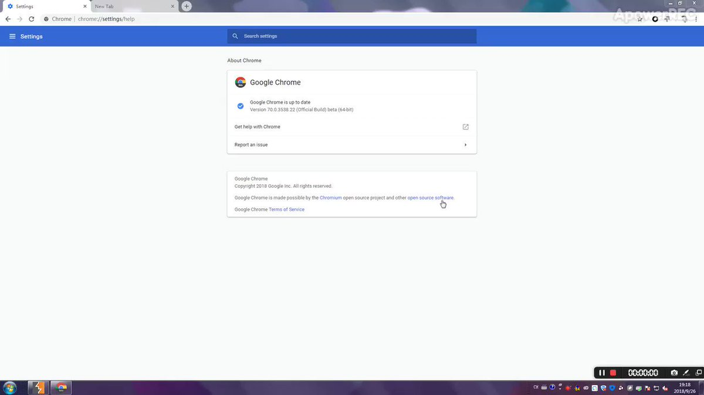

# leonjza
**https://twitter.com/leonjza/status/1099723330746232832 _at 2019-02-24, 17:30:48_**
<blockquote>
PoC for CVE-2019-6340, the #drupal 8 REST unauthenticated RCE based on https://t.co/5loZJxaiKs. Caching heavily messes with this one it seems, so the PoC tries to find usable nodes that are not cached. Tested with the drupal:8.6.9 docker container.

https://t.co/8eNJ2hYjfu https://t.co/WFJJO6kTLm
</blockquote>

* https://www.ambionics.io/blog/drupal8-rce
* https://gist.github.com/leonjza/d0ab053be9b06fa020b66f00358e3d88

<table><tr>
<td></td>
</table></tr>
<table><tr>
<td>Quotes: <code>0</code></td>
<td>Replies: <code>1</code></td>
<td>Retweets: <code>51</code></td>
<td>Favorites: <code>104</code></td>
</tr></table>

---

# XssPayloads
**https://twitter.com/XssPayloads/status/1098135934665719808 _at 2019-02-20, 08:23:03_**
<blockquote>
Microsoft Edge RCE PoC (CVE-2018-8495). Nice payload by @kmkz_security 
https://t.co/JBz1wmms6W

Initial  writeup: https://t.co/Jd5BrMN2zv
</blockquote>

* http://bit.ly/2XdzMNm
* http://bit.ly/2EkFPIs

<table><tr>
<td>Quotes: <code>2</code></td>
<td>Replies: <code>2</code></td>
<td>Retweets: <code>132</code></td>
<td>Favorites: <code>248</code></td>
</tr></table>

---

# _fel1x
**https://twitter.com/_fel1x/status/1096460676678201344 _at 2019-02-15, 17:26:11_**
<blockquote>
CVE-2019-7221 is a pretty nice guest-triggerable use-after-free in KVM (https://t.co/NhHXDsbWVV) and CVE-2019-7222 is an info leak to help with exploitation (https://t.co/tLV45JUKSv).
</blockquote>

* https://bugs.chromium.org/p/project-zero/issues/detail?id=1760
* https://bugs.chromium.org/p/project-zero/issues/detail?id=1759

<table><tr>
<td>Quotes: <code>3</code></td>
<td>Replies: <code>3</code></td>
<td>Retweets: <code>160</code></td>
<td>Favorites: <code>277</code></td>
</tr></table>

---

# campuscodi
**https://twitter.com/campuscodi/status/1094212733871030272 _at 2019-02-09, 12:33:39_**
<blockquote>
Google reveals details about CVE-2018-18354, a remote code execution in Chrome, patched in December (Chrome 71)

https://t.co/4pLAMCuZDs https://t.co/GINXF8wInO
</blockquote>

* https://bugs.chromium.org/p/chromium/issues/detail?id=889459

<table><tr>
<td></td>
</table></tr>
<table><tr>
<td>Quotes: <code>0</code></td>
<td>Replies: <code>0</code></td>
<td>Retweets: <code>21</code></td>
<td>Favorites: <code>39</code></td>
</tr></table>

---

# steventseeley
**https://twitter.com/steventseeley/status/1091329594026852352 _at 2019-02-01, 13:37:05_**
<blockquote>
Heres my writeup for the discovery and exploitation of CVE-2018-19418 with the CVE-2018-19447 analysis thrown in!

ActiveX Exploitation in 2019 :: Instantiation is not Scripting https://t.co/NQBRdKKaSS
</blockquote>

* https://srcincite.io/blog/2019/02/01/activex-exploitation-in-2018-instantiation-is-not-scripting.html

<table><tr>
<td>Quotes: <code>4</code></td>
<td>Replies: <code>6</code></td>
<td>Retweets: <code>209</code></td>
<td>Favorites: <code>383</code></td>
</tr></table>

---

