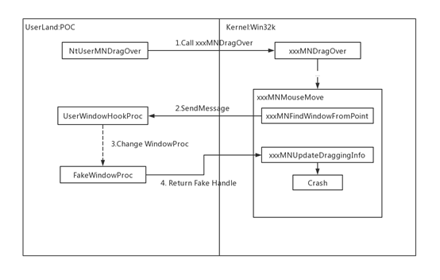
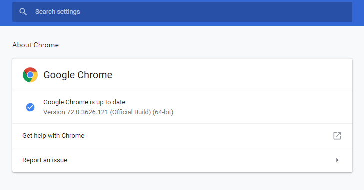

# _r_netsec
**https://twitter.com/_r_netsec/status/1112271431163731968 _at 2019-03-31, 08:32:28_**
<blockquote>
Kubernetes (kubectl) directory traversal vulnerability due to insufficient fix - CVE-2019-1002101 https://t.co/4AyerI779V
</blockquote>

* https://www.twistlock.com/labs-blog/disclosing-directory-traversal-vulnerability-kubernetes-copy-cve-2019-1002101/

<table><tr>
<td>Quotes: <code>0</code></td>
<td>Replies: <code>0</code></td>
<td>Retweets: <code>35</code></td>
<td>Favorites: <code>40</code></td>
</tr></table>

---

# _CPResearch_
**https://twitter.com/_CPResearch_/status/1110554991876554752 _at 2019-03-26, 14:51:57_**
<blockquote>
CVE-2019-5764: Use-After-Free in libvpx, as used in Chrome's WebRTC
https://t.co/iU6BIog5Rl
</blockquote>

* https://bugs.chromium.org/p/chromium/issues/detail?id=913246

<table><tr>
<td>Quotes: <code>2</code></td>
<td>Replies: <code>0</code></td>
<td>Retweets: <code>22</code></td>
<td>Favorites: <code>69</code></td>
</tr></table>

---

# realAmitRap
**https://twitter.com/realAmitRap/status/1110201329237004288 _at 2019-03-25, 15:26:38_**
<blockquote>
Check out my new blog "From alert to driver vulnerability: Microsoft Defender ATP investigation unearths privilege escalation flaw" telling the story behind the discovery of CVE-2019-5241 &amp; CVE-2019-5242 vulnerabilities in Huawei PC Manager driver. Enjoy!
https://t.co/8JCvOvsGq5
</blockquote>

* https://www.microsoft.com/security/blog/2019/03/25/from-alert-to-driver-vulnerability-microsoft-defender-atp-investigation-unearths-privilege-escalation-flaw/

<table><tr>
<td>Quotes: <code>2</code></td>
<td>Replies: <code>3</code></td>
<td>Retweets: <code>77</code></td>
<td>Favorites: <code>139</code></td>
</tr></table>

---

# kunalp94
**https://twitter.com/kunalp94/status/1110187870185127937 _at 2019-03-25, 14:33:09_**
<blockquote>
Really enjoyed this video about "CVE-2018-10994, Steal messages from Signal using RCE". From explanation to exploitation.
Check out his channel  :)

https://t.co/Z74TN9Tw3L
</blockquote>

* https://www.youtube.com/watch?v=mGe95jhQONc

<table><tr>
<td>Quotes: <code>0</code></td>
<td>Replies: <code>0</code></td>
<td>Retweets: <code>13</code></td>
<td>Favorites: <code>39</code></td>
</tr></table>

---

# wugeej
**https://twitter.com/wugeej/status/1109979902046945280 _at 2019-03-25, 00:46:45_**
<blockquote>
[PoC] CVE-2019-0604: Microsoft SharePoint RCE 

https://t.co/vcGwXD2exx
</blockquote>

* https://github.com/k1n9/CVE-2019-0604/?fbclid=IwAR295OULlw76Qkw2Qc1BgT4eAbV7fB3C0fmK2EhuZ4_iqh7yHMKzZ1lfr4s

<table><tr>
<td>Quotes: <code>0</code></td>
<td>Replies: <code>6</code></td>
<td>Retweets: <code>85</code></td>
<td>Favorites: <code>182</code></td>
</tr></table>

---

# _sinn3r
**https://twitter.com/_sinn3r/status/1109141908729880577 _at 2019-03-22, 17:16:52_**
<blockquote>
CVE-2019-5786 Google Chrome FileReader use-after-free exploit: https://t.co/Lmt21ZMyzz
</blockquote>

* https://github.com/exodusintel/CVE-2019-5786

<table><tr>
<td>Quotes: <code>2</code></td>
<td>Replies: <code>1</code></td>
<td>Retweets: <code>43</code></td>
<td>Favorites: <code>72</code></td>
</tr></table>

---

# _r_netsec
**https://twitter.com/_r_netsec/status/1109078380232597504 _at 2019-03-22, 13:04:26_**
<blockquote>
CVE-2019-0604: Details of a Microsoft SharePoint RCE Vulnerability https://t.co/LVNDwmuMSr
</blockquote>

* https://www.thezdi.com/blog/2019/3/13/cve-2019-0604-details-of-a-microsoft-sharepoint-rce-vulnerability

<table><tr>
<td>Quotes: <code>0</code></td>
<td>Replies: <code>0</code></td>
<td>Retweets: <code>40</code></td>
<td>Favorites: <code>87</code></td>
</tr></table>

---

# scriptjunkie1
**https://twitter.com/scriptjunkie1/status/1108553355541049345 _at 2019-03-21, 02:18:10_**
<blockquote>
Exodus Intel CVE-2019-5786 Chrome 72.0.3626.119 stable FileReader UaF exploit for Windows 7 x86.
https://t.co/oQTuky95zx
</blockquote>

* https://github.com/exodusintel/CVE-2019-5786

<table><tr>
<td>Quotes: <code>0</code></td>
<td>Replies: <code>0</code></td>
<td>Retweets: <code>29</code></td>
<td>Favorites: <code>66</code></td>
</tr></table>

---

# RanchoIce
**https://twitter.com/RanchoIce/status/1107925785866723328 _at 2019-03-19, 08:44:26_**
<blockquote>
Analysis of CVE-2019-5786 Chrome FileReader Use-After-Free
https://t.co/gfc27CTMpB
</blockquote>

* https://weibo.com/ttarticle/p/show?id=2309404351596157885398

<table><tr>
<td>Quotes: <code>0</code></td>
<td>Replies: <code>0</code></td>
<td>Retweets: <code>18</code></td>
<td>Favorites: <code>39</code></td>
</tr></table>

---

# x0rz
**https://twitter.com/x0rz/status/1107627861408649219 _at 2019-03-18, 13:00:35_**
<blockquote>
Windows Kernel Privilege Escalation Vulnerability (CVE-2019-0808) root cause analysis https://t.co/tz8WuCNl1D #vulnerability #windows https://t.co/dEAEtdN5a0
</blockquote>

* http://blogs.360.cn/post/RootCause_CVE-2019-0808_EN.html

<table><tr>
<td></td>
</table></tr>
<table><tr>
<td>Quotes: <code>0</code></td>
<td>Replies: <code>0</code></td>
<td>Retweets: <code>47</code></td>
<td>Favorites: <code>103</code></td>
</tr></table>

---

# 360CoreSec
**https://twitter.com/360CoreSec/status/1106115047787393025 _at 2019-03-14, 08:49:12_**
<blockquote>
Microsoft fixed a Windows 0day (CVE-2019-0808) in Patch Tuesday. Our team constructed the POC and reproduced the vulnerability triggering process. Click here to read more: https://t.co/aE6l1nPwnw
</blockquote>

* http://blogs.360.cn/post/RootCause_CVE-2019-0808_EN.html

<table><tr>
<td>Quotes: <code>0</code></td>
<td>Replies: <code>0</code></td>
<td>Retweets: <code>185</code></td>
<td>Favorites: <code>300</code></td>
</tr></table>

---

# Edu_Braun_0day
**https://twitter.com/Edu_Braun_0day/status/1106048620678311942 _at 2019-03-14, 04:25:15_**
<blockquote>
MSHTML Engine RCE - CVE-2019-0541: Running arbitrary code on any Windows version since at least XP up to latest 10 and Server 2019 made SURPRISINGLY easy. Video: https://t.co/V1jQ0TJ7C7  and PoC: https://t.co/KRLmCHXYpN
</blockquote>

* https://youtu.be/OdEwBY7rXMw
* https://www.exploit-db.com/exploits/46536

<table><tr>
<td>Quotes: <code>6</code></td>
<td>Replies: <code>3</code></td>
<td>Retweets: <code>177</code></td>
<td>Favorites: <code>300</code></td>
</tr></table>

---

# piedpiper1616
**https://twitter.com/piedpiper1616/status/1104831560744751104 _at 2019-03-10, 19:49:05_**
<blockquote>
GitHub - mpgn/CVE-2019-0192: RCE on Apache Solr using deserialization of untrusted data via jmx.serviceUrl https://t.co/y0wUfQknsU
</blockquote>

* https://github.com/mpgn/CVE-2019-0192/

<table><tr>
<td>Quotes: <code>2</code></td>
<td>Replies: <code>0</code></td>
<td>Retweets: <code>111</code></td>
<td>Favorites: <code>212</code></td>
</tr></table>

---

# TheHackersNews
**https://twitter.com/TheHackersNews/status/1103233119434489857 _at 2019-03-06, 09:57:27_**
<blockquote>
⚠️ Important — Update your #Google Chrome immediately to patch a new high-severity 0-day RCE #vulnerability (CVE-2019-5786) that hackers are actively exploiting in the wild

https://t.co/vrorvFYuU8

Patched Chrome version 72.0.3626.121 has been released for Windows, macOS, Linux https://t.co/IoW8ZjQgZZ
</blockquote>

* https://thehackernews.com/2019/03/update-google-chrome-hack.html

<table><tr>
<td></td>
</table></tr>
<table><tr>
<td>Quotes: <code>65</code></td>
<td>Replies: <code>12</code></td>
<td>Retweets: <code>580</code></td>
<td>Favorites: <code>464</code></td>
</tr></table>

---

# cBekrar
**https://twitter.com/cBekrar/status/1103138159133569024 _at 2019-03-06, 03:40:07_**
<blockquote>
Google discovered a Chrome RCE #0day in the wild (CVE-2019-5786). Reportedly, a full chain with a sandbox escape: https://t.co/Nxfrvr5wIh 

In 2019, I expect epic 0days to be found in the wild: Android, iOS, Windows, Office, virtualization, and more. Stay safe and enjoy the show.
</blockquote>

* https://chromereleases.googleblog.com/2019/03/stable-channel-update-for-desktop.html

<table><tr>
<td>Quotes: <code>7</code></td>
<td>Replies: <code>7</code></td>
<td>Retweets: <code>149</code></td>
<td>Favorites: <code>222</code></td>
</tr></table>

---

