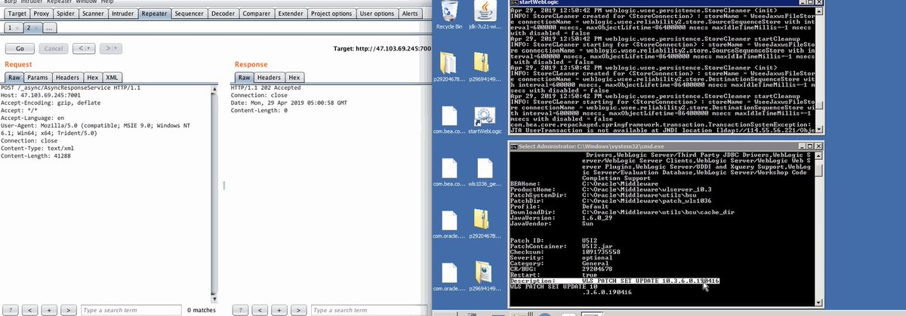
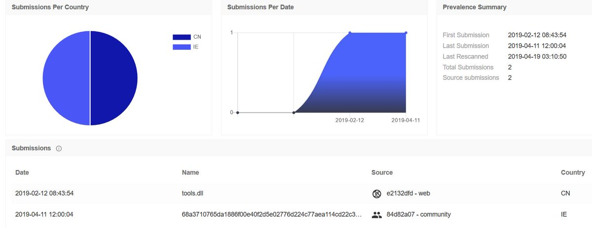
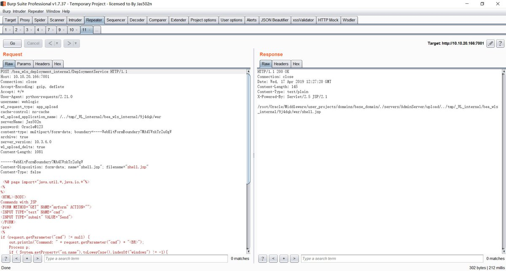
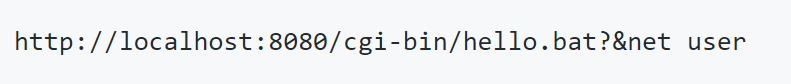
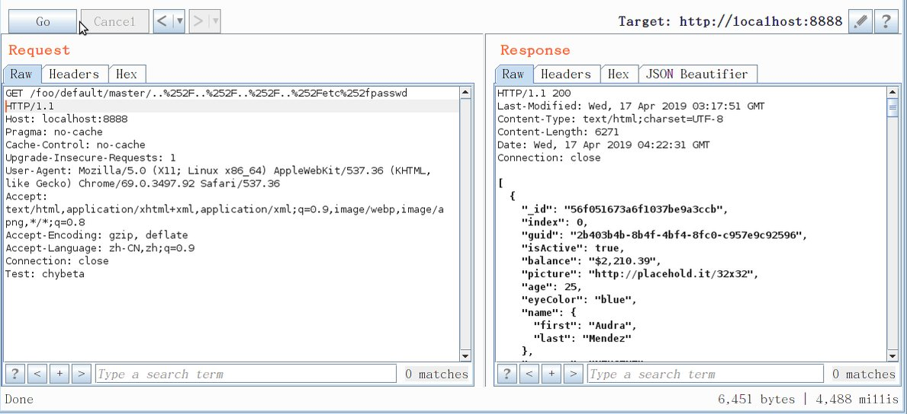
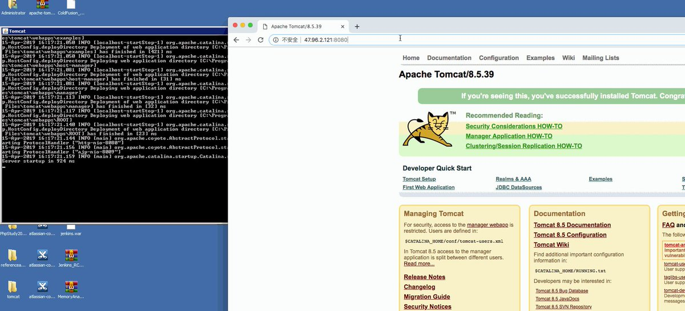
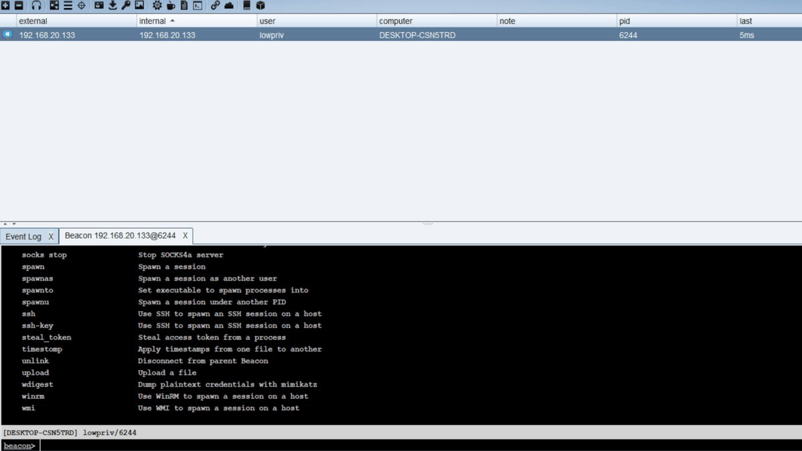
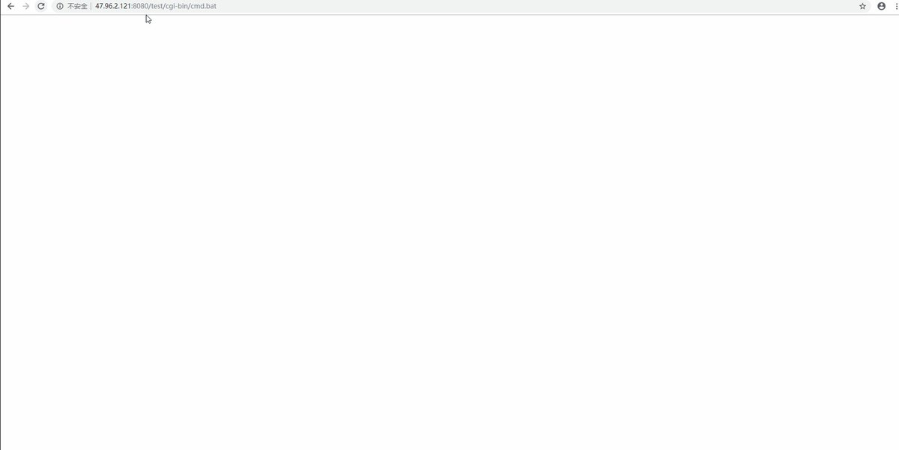
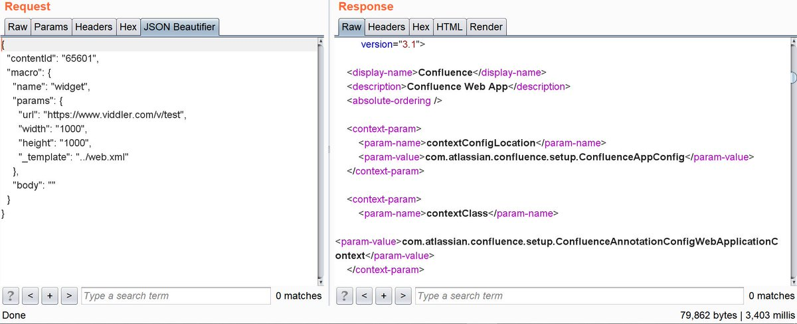

# pyn3rd
**https://twitter.com/pyn3rd/status/1122730137047293954 _at 2019-04-29, 05:11:38_**
<blockquote>
#CVE-2019-2725 Weblogic 10.3.6  Remote Code Execution, here I utilize JRMP(LDAP/JNDI) to exploit it. https://t.co/NBktegBZBJ
</blockquote>

<table><tr>
<td></td>
</table></tr>
<table><tr>
<td>Quotes: <code>3</code></td>
<td>Replies: <code>3</code></td>
<td>Retweets: <code>102</code></td>
<td>Favorites: <code>228</code></td>
</tr></table>

---

# thezdi
**https://twitter.com/thezdi/status/1121431383870771200 _at 2019-04-25, 15:10:51_**
<blockquote>
CVE-2019-0726/ZDI-19-272: @HexKitchen details a vuln in the #Windows DHCP Client reported by Trend's own Saran Neti. Bug could lead to RCE. Blog provides root cause analysis &amp; steps to reproduce. https://t.co/NlFISGNqZt
</blockquote>

* http://bit.ly/2UTCs56

<table><tr>
<td>Quotes: <code>1</code></td>
<td>Replies: <code>0</code></td>
<td>Retweets: <code>80</code></td>
<td>Favorites: <code>132</code></td>
</tr></table>

---

# r3c0nst
**https://twitter.com/r3c0nst/status/1120471066911084546 _at 2019-04-22, 23:34:54_**
<blockquote>
Hash for Win32k privilege escalation exploit CVE-2019-0803
d059710c9b4da72daf0fb47ec6bbb1802f37584d
First uploaded to VT on 2019-02-12 from China
PDB-String --&gt; C:\Users\sms2056\Desktop\Add（未修改dll‘）\x64\Release\Add.pdb
Exports --&gt; AddByGod
Relations to: sms2056@sohu.com ??? https://t.co/5ARXIQAY1Q
</blockquote>

<table><tr>
<td></td>
</table></tr>
<table><tr>
<td>Quotes: <code>0</code></td>
<td>Replies: <code>2</code></td>
<td>Retweets: <code>32</code></td>
<td>Favorites: <code>62</code></td>
</tr></table>

---

# cyber_advising
**https://twitter.com/cyber_advising/status/1119389357197148161 _at 2019-04-19, 23:56:34_**
<blockquote>
WebLogic Arbitrary File Read(CVE-2019-2615) &amp; WebLogic File Upload(CVE-2019-2618) 
https://t.co/eGxxWPEPZS https://t.co/PV28Fbv8Tn
</blockquote>

* https://github.com/jas502n/cve-2019-2618

<table><tr>
<td></td>
</table></tr>
<table><tr>
<td>Quotes: <code>1</code></td>
<td>Replies: <code>0</code></td>
<td>Retweets: <code>59</code></td>
<td>Favorites: <code>86</code></td>
</tr></table>

---

# craiu
**https://twitter.com/craiu/status/1118756989503406082 _at 2019-04-18, 06:03:46_**
<blockquote>
We found another 0day used in the wild, CVE-2019-0859. This one seems to have been developed by the prolific 0day maker and seller known as “Volodya”. Volodya sells 0days to both criminals and APTs https://t.co/1WBvETJTF2
</blockquote>

* https://securelist.com/new-win32k-zero-day-cve-2019-0859/90435/

<table><tr>
<td>Quotes: <code>7</code></td>
<td>Replies: <code>5</code></td>
<td>Retweets: <code>317</code></td>
<td>Favorites: <code>512</code></td>
</tr></table>

---

# piedpiper1616
**https://twitter.com/piedpiper1616/status/1118717805539446785 _at 2019-04-18, 03:28:04_**
<blockquote>
GitHub - sophoslabs/CVE-2018-18500: PoC for CVE-2018-18500 - Firefox Use-After-Free https://t.co/axrBiCueO8
</blockquote>

* https://github.com/sophoslabs/CVE-2018-18500/

<table><tr>
<td>Quotes: <code>0</code></td>
<td>Replies: <code>0</code></td>
<td>Retweets: <code>40</code></td>
<td>Favorites: <code>83</code></td>
</tr></table>

---

# ptracesecurity
**https://twitter.com/ptracesecurity/status/1118375367281205253 _at 2019-04-17, 04:47:20_**
<blockquote>
CVE-2019-0232: Apache Tomcat Remote Code Execution on Windows https://t.co/auveCG8m3D #Windows #ApacheTomcat #Vulnerability #Exploit #Pentesting #Infosec https://t.co/EqFdhBAKga
</blockquote>

* https://github.com/pyn3rd/CVE-2019-0232/

<table><tr>
<td></td>
</table></tr>
<table><tr>
<td>Quotes: <code>1</code></td>
<td>Replies: <code>0</code></td>
<td>Retweets: <code>22</code></td>
<td>Favorites: <code>46</code></td>
</tr></table>

---

# chybeta
**https://twitter.com/chybeta/status/1118370858974760963 _at 2019-04-17, 04:29:25_**
<blockquote>
CVE-2019-3799: Directory Traversal with spring-cloud-config-server 

https://t.co/58FoB4VIx5 https://t.co/wN2VHkazlY
</blockquote>

* https://pivotal.io/security/cve-2019-3799

<table><tr>
<td></td>
</table></tr>
<table><tr>
<td>Quotes: <code>5</code></td>
<td>Replies: <code>1</code></td>
<td>Retweets: <code>93</code></td>
<td>Favorites: <code>248</code></td>
</tr></table>

---

# Jackson_T
**https://twitter.com/Jackson_T/status/1117767541999357952 _at 2019-04-15, 12:32:03_**
<blockquote>
CVE-2019-9730: Local privilege elevation in Synaptics Sound Device Driver package. Multiple OEMs affected. Exploit and write-up here: https://t.co/swozSC1Ka7. https://t.co/R6NmPG370G
</blockquote>

* http://jackson-t.ca/synaptics-cxutilsvc-lpe.html

<table><tr>
<td></td>
</table></tr>
<table><tr>
<td>Quotes: <code>7</code></td>
<td>Replies: <code>9</code></td>
<td>Retweets: <code>351</code></td>
<td>Favorites: <code>678</code></td>
</tr></table>

---

# CyberWarship
**https://twitter.com/CyberWarship/status/1117727023424782338 _at 2019-04-15, 09:51:03_**
<blockquote>
CVE-2019-0541 - Exploit  

MSHTML Engine RCE on any Windows version since at least XP up to 10 &amp;&amp; Server 2019 

#infosec #pentest #exploit 
https://t.co/B7gGcGl1y7
</blockquote>

* https://www.exploit-db.com/exploits/46536

<table><tr>
<td>Quotes: <code>2</code></td>
<td>Replies: <code>1</code></td>
<td>Retweets: <code>162</code></td>
<td>Favorites: <code>306</code></td>
</tr></table>

---

# pyn3rd
**https://twitter.com/pyn3rd/status/1117705259059515393 _at 2019-04-15, 08:24:34_**
<blockquote>
#CVE-2019-0232 Apache Tomcat Remote Code Execution on Windows(Tomcat 8.5.39/JDK 1.8)
reproduce:
https://t.co/1dJigpyjp4 https://t.co/vtlULBBq3v
</blockquote>

* https://github.com/pyn3rd/CVE-2019-0232

<table><tr>
<td></td>
</table></tr>
<table><tr>
<td>Quotes: <code>7</code></td>
<td>Replies: <code>4</code></td>
<td>Retweets: <code>301</code></td>
<td>Favorites: <code>579</code></td>
</tr></table>

---

# ustayready
**https://twitter.com/ustayready/status/1117607795489218560 _at 2019-04-15, 01:57:17_**
<blockquote>
CVE-2019-8513: Command injection in macOS TimeMachine allows reliable local root privilege escalation exploit... Great write-up from ⁦@CodeColorist⁩! https://t.co/8Z93ztSzMr
</blockquote>

* https://medium.com/0xcc/rootpipe-reborn-part-i-cve-2019-8513-timemachine-root-command-injection-47e056b3cb43

<table><tr>
<td>Quotes: <code>1</code></td>
<td>Replies: <code>0</code></td>
<td>Retweets: <code>31</code></td>
<td>Favorites: <code>56</code></td>
</tr></table>

---

# buffaloverflow
**https://twitter.com/buffaloverflow/status/1117507864824881153 _at 2019-04-14, 19:20:11_**
<blockquote>
Wrote a .NET exploit for CVE-2019-0841. h/t @rogue_kdc for vuln &amp; @ryHanson for exploitation vector 🙏 https://t.co/Ur0pcOZX7r
</blockquote>

<table><tr>
<td></td>
</table></tr>
<table><tr>
<td>Quotes: <code>1</code></td>
<td>Replies: <code>4</code></td>
<td>Retweets: <code>98</code></td>
<td>Favorites: <code>202</code></td>
</tr></table>

---

# Dinosn
**https://twitter.com/Dinosn/status/1117254715820081152 _at 2019-04-14, 02:34:16_**
<blockquote>
CVE-2019-8513: Command injection in macOS TimeMachine allows reliable local root privilege escalation exploit
https://t.co/riVPQHoeSq
</blockquote>

* https://medium.com/@CodeColorist/rootpipe-reborn-part-i-cve-2019-8513-timemachine-root-command-injection-47e056b3cb43

<table><tr>
<td>Quotes: <code>0</code></td>
<td>Replies: <code>0</code></td>
<td>Retweets: <code>25</code></td>
<td>Favorites: <code>31</code></td>
</tr></table>

---

# CodeColorist
**https://twitter.com/CodeColorist/status/1116933653903237123 _at 2019-04-13, 05:18:29_**
<blockquote>
Got someone asking for the PoC of CVE-2018-8142, the LPE for Microsoft Autoupdate Helper 3.18(180410) (affects MS Office 2016 and SkypeForBusiness for macOS, writeup: https://t.co/wnCtrURWmd), and here you are: https://t.co/Xo7HKq2WW4
</blockquote>

* https://medium.com/0xcc/cve-2018-8412-ms-office-2016-for-mac-privilege-escalation-via-a-legacy-package-7fccdbf71d9b
* https://github.com/ChiChou/CVE-2018-8142-poc

<table><tr>
<td>Quotes: <code>0</code></td>
<td>Replies: <code>0</code></td>
<td>Retweets: <code>45</code></td>
<td>Favorites: <code>87</code></td>
</tr></table>

---

# pyn3rd
**https://twitter.com/pyn3rd/status/1116373602813784069 _at 2019-04-11, 16:13:02_**
<blockquote>
#CVE-2019-0232 Apache Tomcat Remote Code Execution on Windows https://t.co/E00qp4Dhai
</blockquote>

<table><tr>
<td></td>
</table></tr>
<table><tr>
<td>Quotes: <code>2</code></td>
<td>Replies: <code>4</code></td>
<td>Retweets: <code>132</code></td>
<td>Favorites: <code>291</code></td>
</tr></table>

---

# bad_packets
**https://twitter.com/bad_packets/status/1116054197789544448 _at 2019-04-10, 19:03:50_**
<blockquote>
We've detected opportunistic exploitation from 89.35.39.78 (🇷🇴) targeting a critical Atlassian Confluence Server vulnerability (CVE-2019-3396) that allows remote code execution. The attacker drops Dofloo #malware, which is used for DDoS attacks.
</blockquote>

<table><tr>
<td>Quotes: <code>2</code></td>
<td>Replies: <code>4</code></td>
<td>Retweets: <code>28</code></td>
<td>Favorites: <code>46</code></td>
</tr></table>

---

# HaifeiLi
**https://twitter.com/HaifeiLi/status/1115674789513846784 _at 2019-04-09, 17:56:12_**
<blockquote>
Computers are weird.. sometimes you just need some "clicking" skills to find a bug.

There's no specific PoC for Flash UAF CVE-2019-7096, only a gif. https://t.co/TkIuNMgzhU
</blockquote>

<table><tr>
<td></td>
</table></tr>
<table><tr>
<td>Quotes: <code>0</code></td>
<td>Replies: <code>2</code></td>
<td>Retweets: <code>7</code></td>
<td>Favorites: <code>40</code></td>
</tr></table>

---

# 80vul
**https://twitter.com/80vul/status/1115520324588658688 _at 2019-04-09, 07:42:25_**
<blockquote>
&lt;Confluence Unauthorized RCE (CVE-2019-3396) Vulnerability Analysis&gt; by Badcode of KnownSec 404 Team https://t.co/uKC9uv6tLq (Chinese) and demo https://t.co/81p1nFeq8B  On April 4th, we released a vulnerability warning and related detection POC.  https://t.co/rLx2A0JFDL
</blockquote>

* https://paper.seebug.org/884/
* https://www.youtube.com/watch?v=orT8o_g2a6c
* https://twitter.com/80vul/status/1113738265599696897

<table><tr>
<td>Quotes: <code>3</code></td>
<td>Replies: <code>3</code></td>
<td>Retweets: <code>65</code></td>
<td>Favorites: <code>123</code></td>
</tr></table>

---

# _hg8_
**https://twitter.com/_hg8_/status/1115216402443452416 _at 2019-04-08, 11:34:44_**
<blockquote>
CVE-2019-0211 Apache Root Privilege Escalation #PoC is now available!

USAGE
1. Upload exploit to Apache HTTP server
2. Send request to page
3. Await 6:25AM for logrotate to restart Apache
4. python3.5 is now suid 0

https://t.co/zKdtmKLb57 #cve #exploit

https://t.co/c07m4CmBKj
</blockquote>

* https://github.com/cfreal/exploits/blob/master/CVE-2019-0211-apache/cfreal-carpediem.php
* https://twitter.com/shishi0_/status/1114875017211170816

<table><tr>
<td>Quotes: <code>0</code></td>
<td>Replies: <code>0</code></td>
<td>Retweets: <code>20</code></td>
<td>Favorites: <code>35</code></td>
</tr></table>

---

# cyber_advising
**https://twitter.com/cyber_advising/status/1114827747048685569 _at 2019-04-07, 09:50:22_**
<blockquote>
CVE-2019-3396 : SSTI(Sever Side Template Injection) and RCE in Atlassian Confluence Server via Widget Connector 
#SSTI, #RCE
https://t.co/ebBg9Si89n https://t.co/N89XGB5hfb
</blockquote>

* https://chybeta.github.io/2019/04/06/Analysis-for-%E3%80%90CVE-2019-3396%E3%80%91-SSTI-and-RCE-in-Confluence-Server-via-Widget-Connector/

<table><tr>
<td></td>
</table></tr>
<table><tr>
<td>Quotes: <code>0</code></td>
<td>Replies: <code>2</code></td>
<td>Retweets: <code>42</code></td>
<td>Favorites: <code>89</code></td>
</tr></table>

---

