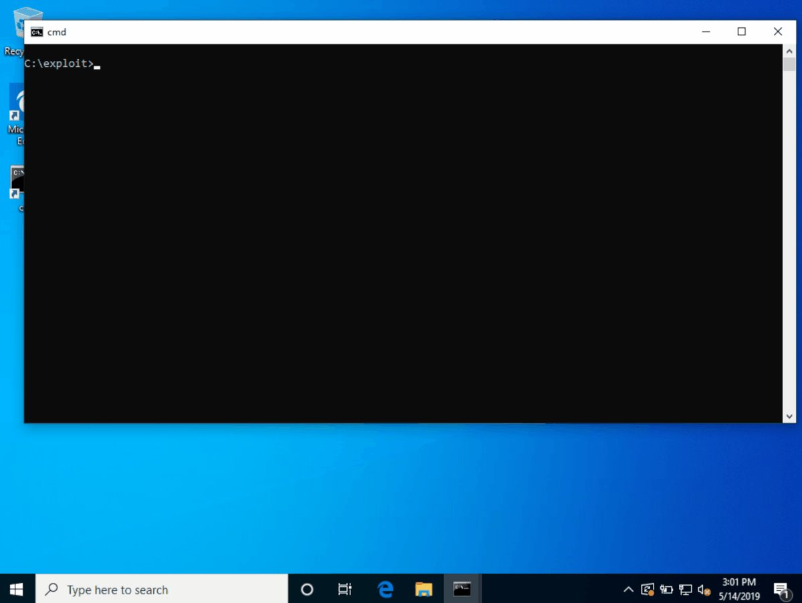

# MalwareTechBlog
**https://twitter.com/MalwareTechBlog/status/1134581128231133185 _at 2019-05-31, 22:03:15_**
<blockquote>
Analysis of CVE-2019-0708 (BlueKeep)
https://t.co/Y7WlqNqFTb
</blockquote>

* https://www.malwaretech.com/2019/05/analysis-of-cve-2019-0708-bluekeep.html

<table><tr>
<td>Quotes: <code>16</code></td>
<td>Replies: <code>30</code></td>
<td>Retweets: <code>670</code></td>
<td>Favorites: <code>1615</code></td>
</tr></table>

---

# CharlesDardaman
**https://twitter.com/CharlesDardaman/status/1134273345384587264 _at 2019-05-31, 01:40:13_**
<blockquote>
There is now a public DOS POC for CVE-2019-0708 (BlueKeep) I just tested it myself here: https://t.co/M5724z5sno
</blockquote>

<table><tr>
<td></td>
</table></tr>
<table><tr>
<td>Quotes: <code>9</code></td>
<td>Replies: <code>5</code></td>
<td>Retweets: <code>113</code></td>
<td>Favorites: <code>283</code></td>
</tr></table>

---

# MalwareTechBlog
**https://twitter.com/MalwareTechBlog/status/1134242750059098112 _at 2019-05-30, 23:38:39_**
<blockquote>
How to turn CVE-2019-0708 DoS into RCE according to Twitter.
1) Trigger vulnerability with DoS PoC
2) Send payload over TLS
3) System magically runs payload https://t.co/23wGHmjrFW
</blockquote>

<table><tr>
<td></td>
</table></tr>
<table><tr>
<td>Quotes: <code>3</code></td>
<td>Replies: <code>8</code></td>
<td>Retweets: <code>29</code></td>
<td>Favorites: <code>162</code></td>
</tr></table>

---

# steventseeley
**https://twitter.com/steventseeley/status/1133839667735007232 _at 2019-05-29, 20:56:57_**
<blockquote>
Heres my version of CVE-2018-4416, a WebKit JSC JIT type confusion. Similar to @Auxy233's exploit but I prefer to use Float64Array's for faking objects. Thanks to @LiveOverflow and @Auxy233 for the inspiration :-&gt; https://t.co/beTuQqWzOS
</blockquote>

* https://srcincite.io/pocs/cve-2018-4416.js.txt

<table><tr>
<td>Quotes: <code>1</code></td>
<td>Replies: <code>0</code></td>
<td>Retweets: <code>36</code></td>
<td>Favorites: <code>108</code></td>
</tr></table>

---

# alisaesage
**https://twitter.com/alisaesage/status/1133706179274690567 _at 2019-05-29, 12:06:31_**
<blockquote>
I am following the RDP 0day saga. I saw lots of PR, teasing pics and videos that imply nothing with respect to knowledge, and a few low quality publications

Thus far this is the only analysis of CVE-2019-0708 that I can recommed to my followers: https://t.co/d54Doln9Mz #BlueKeep
</blockquote>

* https://www.zerodayinitiative.com/blog/2019/5/27/cve-2019-0708-a-comprehensive-analysis-of-a-remote-desktop-services-vulnerability

<table><tr>
<td>Quotes: <code>1</code></td>
<td>Replies: <code>3</code></td>
<td>Retweets: <code>70</code></td>
<td>Favorites: <code>184</code></td>
</tr></table>

---

# Dinosn
**https://twitter.com/Dinosn/status/1133431713969909762 _at 2019-05-28, 17:55:53_**
<blockquote>
Pwn2Own 2019: Microsoft Edge Sandbox Escape (CVE-2019-0938). Part 2 https://t.co/qgzg6YdB51
</blockquote>

* https://blog.exodusintel.com/2019/05/27/pwn2own-2019-microsoft-edge-sandbox-escape-cve-2019-0938-part-2/

<table><tr>
<td>Quotes: <code>1</code></td>
<td>Replies: <code>0</code></td>
<td>Retweets: <code>21</code></td>
<td>Favorites: <code>48</code></td>
</tr></table>

---

# thezdi
**https://twitter.com/thezdi/status/1133373429208502277 _at 2019-05-28, 14:04:17_**
<blockquote>
In a new guest blog, the folks from Trend Micro Research provide an in-depth analysis of CVE-2019-0708, the recent Remote Desktop Services bug. https://t.co/OaJK6O21cE
</blockquote>

* http://bit.ly/2KeGYF3

<table><tr>
<td>Quotes: <code>13</code></td>
<td>Replies: <code>0</code></td>
<td>Retweets: <code>222</code></td>
<td>Favorites: <code>340</code></td>
</tr></table>

---

# bad_packets
**https://twitter.com/bad_packets/status/1132970504023764992 _at 2019-05-27, 11:23:12_**
<blockquote>
BlueKeep (CVE-2019-0708) #RDP scans detected per country:
🇳🇱  Netherlands  3,652
🇷🇺  Russia  2,376
🇨🇳  China  2,209
🇺🇸  United States  537
🇰🇷  South Korea  293
🇩🇪  Germany  179
🇻🇳  Vietnam  168
🇨🇦  Canada  63
🇬🇷  Greece  54
🇱🇻  Latvia  19
All Other Countries  36 https://t.co/eBQ1OC1U93
</blockquote>

<table><tr>
<td></td>
</table></tr>
<table><tr>
<td>Quotes: <code>3</code></td>
<td>Replies: <code>5</code></td>
<td>Retweets: <code>46</code></td>
<td>Favorites: <code>78</code></td>
</tr></table>

---

# GreyNoiseIO
**https://twitter.com/GreyNoiseIO/status/1132101252006010880 _at 2019-05-25, 01:49:06_**
<blockquote>
GreyNoise is observing sweeping tests for systems vulnerable to the RDP "BlueKeep" (CVE-2019-0708) vulnerability from several dozen hosts around the Internet. This activity has been observed from exclusively Tor exit nodes and is likely being executed by a single actor. https://t.co/iGwuGuD4Rq
</blockquote>

<table><tr>
<td></td>
</table></tr>
<table><tr>
<td>Quotes: <code>20</code></td>
<td>Replies: <code>9</code></td>
<td>Retweets: <code>147</code></td>
<td>Favorites: <code>283</code></td>
</tr></table>

---

# buffaloverflow
**https://twitter.com/buffaloverflow/status/1131608851369926658 _at 2019-05-23, 17:12:29_**
<blockquote>
Confirming SandboxEscaper's latest AppXSvc LPE (aka CVE-2019-0841-BYPASS) is indeed a 0day and works up to the latest 1903 build (but no collector abuse anymore 😢) . Weaponised demo on 1809.. https://t.co/ygLFJJJD2K
</blockquote>

<table><tr>
<td></td>
</table></tr>
<table><tr>
<td>Quotes: <code>1</code></td>
<td>Replies: <code>4</code></td>
<td>Retweets: <code>109</code></td>
<td>Favorites: <code>227</code></td>
</tr></table>

---

# CyberWarship
**https://twitter.com/CyberWarship/status/1131556774681677824 _at 2019-05-23, 13:45:33_**
<blockquote>
The 3560 Day Exploit 🤪

CVE-2009-1437: RCE in CoolPlayer+ &lt;= 2.19.6 (Windows 10 Pro)

#infosec #pentest #exploitDev 
https://t.co/2kUXIVeUIJ https://t.co/rXkBu4PFv8
</blockquote>

* https://hansesecure.de/2018/02/vulnerability-in-coolplayer/

<table><tr>
<td></td>
</table></tr>
<table><tr>
<td>Quotes: <code>0</code></td>
<td>Replies: <code>1</code></td>
<td>Retweets: <code>23</code></td>
<td>Favorites: <code>87</code></td>
</tr></table>

---

# RedDrip7
**https://twitter.com/RedDrip7/status/1131357390333390848 _at 2019-05-23, 00:33:16_**
<blockquote>
Do patch the critical ‘#wormable‘ RCE vulnerability #CVE-2019-0708 ASAP. We are able to trigger #BSoD stably on all affected 32-bit and 64-bit systems, including Windows Server 2008, etc. We notice lots of #RDP services are unpatched. At least, it could cause massive #DoS by now. https://t.co/JjAThuV2em
</blockquote>

<table><tr>
<td></td>
</table></tr>
<table><tr>
<td>Quotes: <code>3</code></td>
<td>Replies: <code>2</code></td>
<td>Retweets: <code>21</code></td>
<td>Favorites: <code>31</code></td>
</tr></table>

---

# cnotin
**https://twitter.com/cnotin/status/1131236056836317184 _at 2019-05-22, 16:31:07_**
<blockquote>
Finally something serious for CVE-2019-0708 (RDP RCE): a scanner (not an exploit) PoC which is legit!
Test it in non-production first ("shouldn't cause denial-of-service, but there is never a 100% guarantee").
Metasploit scanner in progress too...

Thanks to @zerosum0x0 &amp; @JaGoTu
</blockquote>

<table><tr>
<td>Quotes: <code>0</code></td>
<td>Replies: <code>1</code></td>
<td>Retweets: <code>14</code></td>
<td>Favorites: <code>52</code></td>
</tr></table>

---

# zerosum0x0
**https://twitter.com/zerosum0x0/status/1130998809201299456 _at 2019-05-22, 00:48:23_**
<blockquote>
Unauthenticated CVE-2019-0708 (RDP RCE) scanner PoC from @JaGoTu and I. Can be automated to check your systems or pad your pentest report this week. @Metasploit port in progress. Submit fixes not tixes.

https://t.co/hjsPQdmI2w https://t.co/eOrNm3TRHe
</blockquote>

* https://github.com/zerosum0x0/CVE-2019-0708

<table><tr>
<td></td>
</table></tr>
<table><tr>
<td>Quotes: <code>29</code></td>
<td>Replies: <code>15</code></td>
<td>Retweets: <code>609</code></td>
<td>Favorites: <code>1010</code></td>
</tr></table>

---

# oct0xor
**https://twitter.com/oct0xor/status/1130534732863803400 _at 2019-05-20, 18:04:19_**
<blockquote>
We analyzed the vulnerability CVE-2019-0708 and can confirm that it is exploitable. 
We have therefore developed detection strategies for attempts to exploit it and would now like to share those with trusted industry parties. 
Please contact: nomoreworm@kaspersky.com https://t.co/pEzuEzok0d
</blockquote>

<table><tr>
<td></td>
</table></tr>
<table><tr>
<td>Quotes: <code>13</code></td>
<td>Replies: <code>3</code></td>
<td>Retweets: <code>155</code></td>
<td>Favorites: <code>306</code></td>
</tr></table>

---

# KoAkinci
**https://twitter.com/KoAkinci/status/1130516048971747328 _at 2019-05-20, 16:50:04_**
<blockquote>
CVE-2019-3568: WhatsApp 0 day vulnerability analysis
Link : https://t.co/jPfe4tJJ9j
#WhatsApp #0day #Vulnerabilty https://t.co/j3BdaO1FhA
</blockquote>

* https://translate.google.com/translate?hl=&sl=zh-CN&tl=tr&u=https%3A%2F%2Fpaper.tuisec.win%2Fdetail%2F758132befa191f8&sandbox=1

<table><tr>
<td></td>
</table></tr>
<table><tr>
<td>Quotes: <code>0</code></td>
<td>Replies: <code>0</code></td>
<td>Retweets: <code>9</code></td>
<td>Favorites: <code>33</code></td>
</tr></table>

---

# wugeej
**https://twitter.com/wugeej/status/1130268214913462272 _at 2019-05-20, 00:25:16_**
<blockquote>
[PoC] Horde Webmail - XSS + CSRF to SQLi, RCE, Stealing Emails &lt;= v5.2.22

CVE-2019-12094
CVE-2019-12095

https://t.co/Gp4FgGvJKa https://t.co/bTNPZL21xs
</blockquote>

* https://cxsecurity.com/issue/WLB-2019050199

<table><tr>
<td></td>
</table></tr>
<table><tr>
<td>Quotes: <code>1</code></td>
<td>Replies: <code>1</code></td>
<td>Retweets: <code>25</code></td>
<td>Favorites: <code>36</code></td>
</tr></table>

---

# XI_Research
**https://twitter.com/XI_Research/status/1129436429648629761 _at 2019-05-17, 17:20:03_**
<blockquote>
.@tekwizz123 of our Nday team exploits the recently patched CVE-2019-0808 win32k bug to escape the chrome sandbox
https://t.co/lB1uaGkAIL
</blockquote>

* https://blog.exodusintel.com/2019/05/17/windows-within-windows/

<table><tr>
<td>Quotes: <code>3</code></td>
<td>Replies: <code>2</code></td>
<td>Retweets: <code>107</code></td>
<td>Favorites: <code>172</code></td>
</tr></table>

---

# seebug_team
**https://twitter.com/seebug_team/status/1129397470843113472 _at 2019-05-17, 14:45:14_**
<blockquote>
The detailed analysis of WordPress 5.0 RCE(CVE-2019-6977) which is formed by means of Post Meta Variable Overwriting, Path Traversal, and Local File Inclusion. Learn more on Seebug Paper: https://t.co/PwxiERObGD https://t.co/CVyfIZkpCr
</blockquote>

* https://paper.seebug.org/926/
* https://medium.com/@knownsec404team/the-detailed-analysis-of-wordpress-5-0-rce-a171ed719681

<table><tr>
<td>Quotes: <code>1</code></td>
<td>Replies: <code>1</code></td>
<td>Retweets: <code>44</code></td>
<td>Favorites: <code>64</code></td>
</tr></table>

---

# su13ym4n
**https://twitter.com/su13ym4n/status/1128730466536828928 _at 2019-05-15, 18:34:48_**
<blockquote>
Vulnerabilities are raining cats and dogs: 
• WhatsApp 0-day (CVE-2019-3568)
• Windows Pre-Auth RDP (CVE-2019-0708)
• Intel DSA Local Privilege Escalation (CVE-2019-11114)
• Thrangrycat Secure Boot Bypass affecting multiple Cisco products (CVE-2019-1649). https://t.co/Ps1J2UWojf
</blockquote>

<table><tr>
<td></td>
</table></tr>
<table><tr>
<td>Quotes: <code>1</code></td>
<td>Replies: <code>0</code></td>
<td>Retweets: <code>3</code></td>
<td>Favorites: <code>32</code></td>
</tr></table>

---

# buffaloverflow
**https://twitter.com/buffaloverflow/status/1128662377111617538 _at 2019-05-15, 14:04:14_**
<blockquote>
Here is the advisory for CVE-2019-11114, a Local Privilege Escalation vulnerability I found in Intel DSA. If you have an Intel based machine, double check if it's installed and update if required 👍

https://t.co/Hgrci4roDC https://t.co/Xi5vmS0UP3
</blockquote>

* https://www.nccgroup.trust/uk/our-research/technical-advisory-intel-driver-support-and-assistance-local-privilege-escalation/

<table><tr>
<td></td>
</table></tr>
<table><tr>
<td>Quotes: <code>4</code></td>
<td>Replies: <code>1</code></td>
<td>Retweets: <code>113</code></td>
<td>Favorites: <code>202</code></td>
</tr></table>

---

# chybeta
**https://twitter.com/chybeta/status/1128599219973967873 _at 2019-05-15, 09:53:17_**
<blockquote>
How to hack windows? Just upload a fake CVE-2019-0708 POC and wait script kids run it ...😎
</blockquote>

<table><tr>
<td>Quotes: <code>4</code></td>
<td>Replies: <code>7</code></td>
<td>Retweets: <code>20</code></td>
<td>Favorites: <code>92</code></td>
</tr></table>

---

# buffaloverflow
**https://twitter.com/buffaloverflow/status/1128431375680454657 _at 2019-05-14, 22:46:19_**
<blockquote>
Today Intel released a fix for a bug I found in DSA (CVE-2019-11114). Tomorrow we will release an advisory demonstrating the LPE exploit 👍

https://t.co/LBGwV55Mme
</blockquote>

* https://www.intel.com/content/www/us/en/security-center/advisory/intel-sa-00252.html

<table><tr>
<td>Quotes: <code>1</code></td>
<td>Replies: <code>1</code></td>
<td>Retweets: <code>21</code></td>
<td>Favorites: <code>43</code></td>
</tr></table>

---

# dangoodin001
**https://twitter.com/dangoodin001/status/1128406264956932096 _at 2019-05-14, 21:06:32_**
<blockquote>
Hoping to head off another catastrophic worm, Microsoft took the unusual step of patching Win 2003 and XP against CVE-2019-0708. The RCE bug is easy to exploit and requires no user interaction. 3 million endpoints are directly exposed. Also affects Win 7, Server 2008 and 2008.
</blockquote>

<table><tr>
<td>Quotes: <code>2</code></td>
<td>Replies: <code>3</code></td>
<td>Retweets: <code>63</code></td>
<td>Favorites: <code>77</code></td>
</tr></table>

---

# Dark_Puzzle
**https://twitter.com/Dark_Puzzle/status/1128396134509105152 _at 2019-05-14, 20:26:17_**
<blockquote>
Panda Antivirus - Local Privilege Escalation (CVE-2019-12042)
 https://t.co/QgsiufyWtJ https://t.co/t3he7xkNI4
</blockquote>

* https://rce4fun.blogspot.com/2019/05/panda-antivirus-local-privilege.html

<table><tr>
<td></td>
</table></tr>
<table><tr>
<td>Quotes: <code>3</code></td>
<td>Replies: <code>6</code></td>
<td>Retweets: <code>111</code></td>
<td>Favorites: <code>260</code></td>
</tr></table>

---

# kmkz_security
**https://twitter.com/kmkz_security/status/1127312140673658881 _at 2019-05-11, 20:38:53_**
<blockquote>
CyberArk Enterprise Password Vault – XML External Entity (XXE) Injection #cve-2019-7442
Original advisory:
https://t.co/yz3XQGU0US
Cve details:
https://t.co/IxmjVcmLaT
</blockquote>

* https://www.octority.com/2019/05/07/cyberark-enterprise-password-vault-xml-external-entity-xxe-injection/
* http://cve.mitre.org/cgi-bin/cvename.cgi?name=CVE-2019-7442

<table><tr>
<td>Quotes: <code>2</code></td>
<td>Replies: <code>0</code></td>
<td>Retweets: <code>72</code></td>
<td>Favorites: <code>97</code></td>
</tr></table>

---

# GossiTheDog
**https://twitter.com/GossiTheDog/status/1126833629236215808 _at 2019-05-10, 12:57:27_**
<blockquote>
📢 CVE-2019-0604 is being exploited in the wild 📢 It's a web based remote code execution vuln without need for authentication, plus Microsoft had to reissue the patch later as the first one didn't fix the vulnerability - so lots of places are exposed.
</blockquote>

<table><tr>
<td>Quotes: <code>15</code></td>
<td>Replies: <code>4</code></td>
<td>Retweets: <code>259</code></td>
<td>Favorites: <code>422</code></td>
</tr></table>

---

# hosselot
**https://twitter.com/hosselot/status/1125280426162053121 _at 2019-05-06, 06:05:34_**
<blockquote>
Nice writeup+(0x41414141) PoC for Mozilla Firefox HTML5 Stream Parsing Use-after-free Vulnerability (CVE-2018-18500) by Yaniv Frank from @SophosLabs:
https://t.co/NgPzvUBWA7
</blockquote>

* https://news.sophos.com/en-us/2019/04/18/protected-cve-2018-18500-heap-write-after-free-in-firefox-analysis-and-exploitation/

<table><tr>
<td>Quotes: <code>1</code></td>
<td>Replies: <code>0</code></td>
<td>Retweets: <code>39</code></td>
<td>Favorites: <code>102</code></td>
</tr></table>

---

# OPOSEC
**https://twitter.com/OPOSEC/status/1124992139354615808 _at 2019-05-05, 11:00:02_**
<blockquote>
Google Chrome pdfium shading drawing integer overflow to RCE (CVE-2018-6120). https://t.co/xcdsVZlLOc (+) #Security #231 (2018)
</blockquote>

* http://bit.ly/2O5x7k2

<table><tr>
<td>Quotes: <code>0</code></td>
<td>Replies: <code>0</code></td>
<td>Retweets: <code>34</code></td>
<td>Favorites: <code>77</code></td>
</tr></table>

---

# piedpiper1616
**https://twitter.com/piedpiper1616/status/1124408537642180608 _at 2019-05-03, 20:21:00_**
<blockquote>
GitHub - gscamelo/CVE-2018-20580: A proof of concept for ReadyAPI 2.5.0/2.6.0 Remote Code Execution Vulnerability. https://t.co/2BAkN7aRWu
</blockquote>

* https://github.com/gscamelo/CVE-2018-20580/

<table><tr>
<td>Quotes: <code>0</code></td>
<td>Replies: <code>0</code></td>
<td>Retweets: <code>17</code></td>
<td>Favorites: <code>35</code></td>
</tr></table>

---

