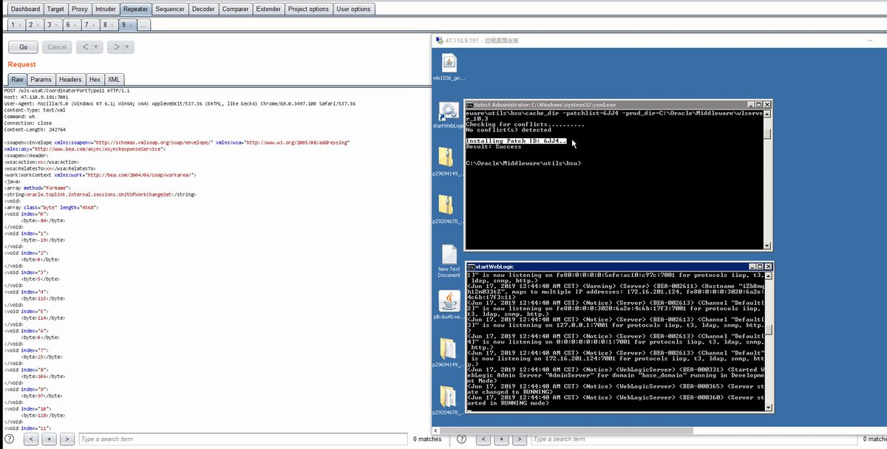
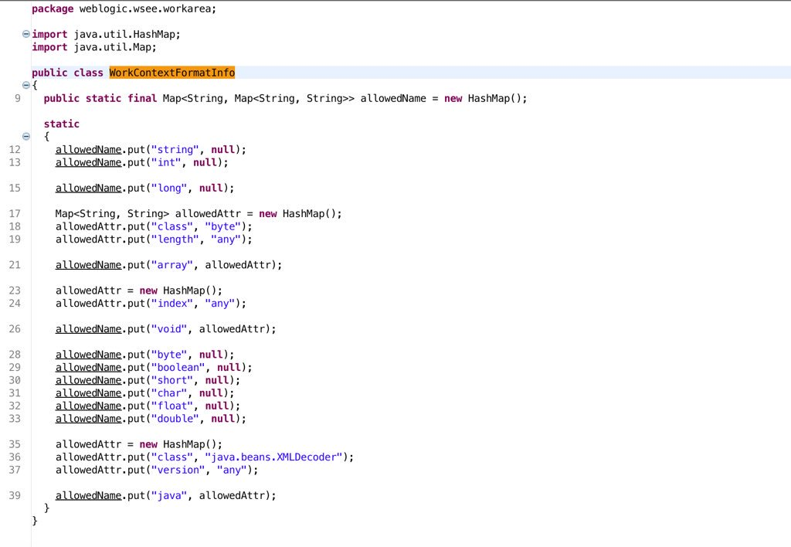
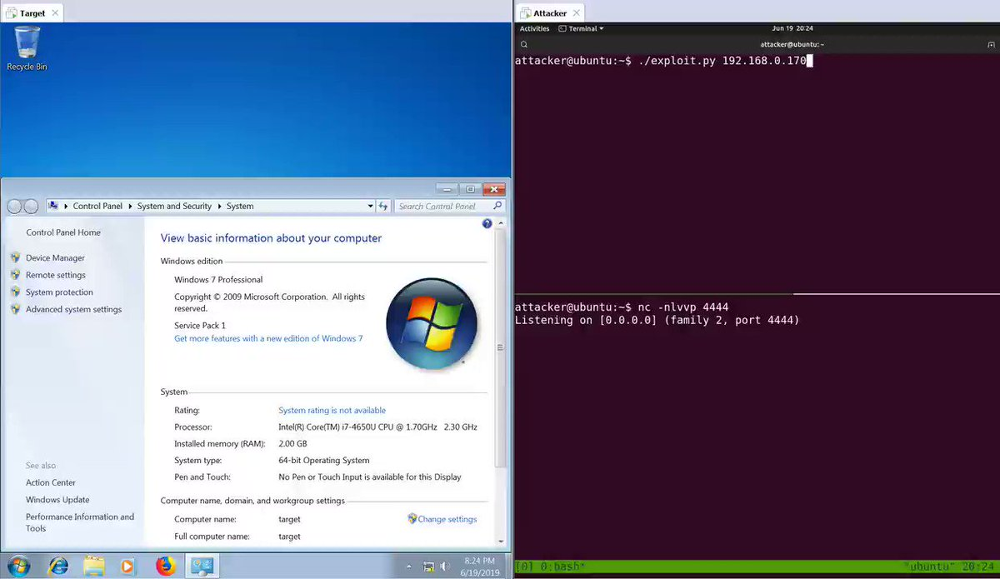
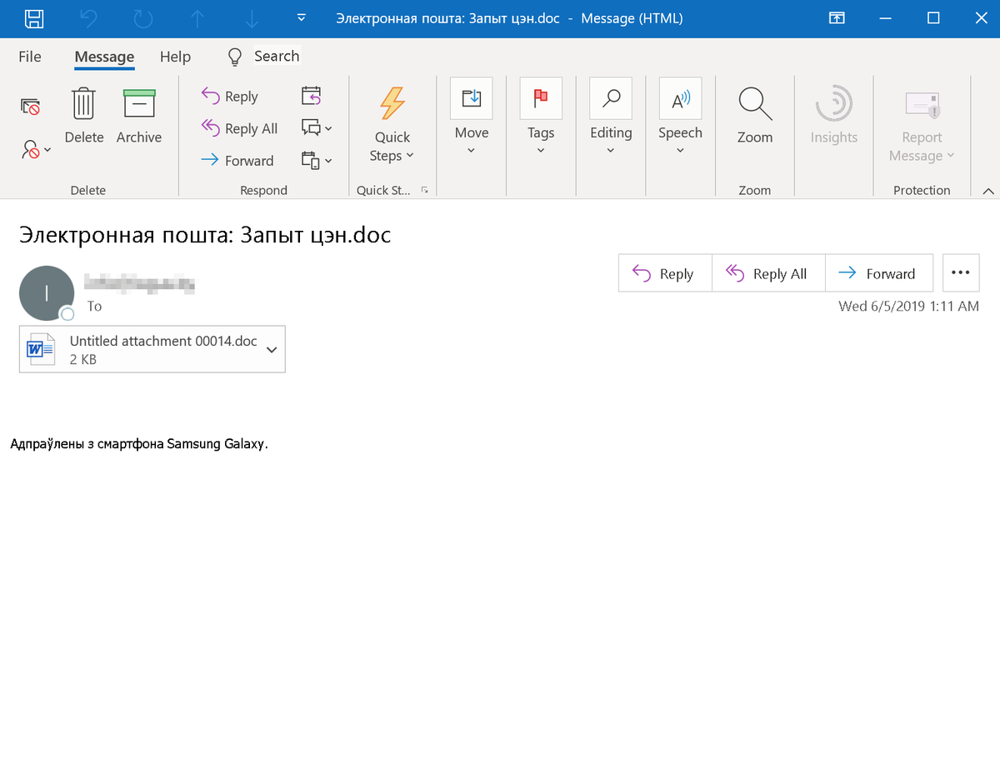
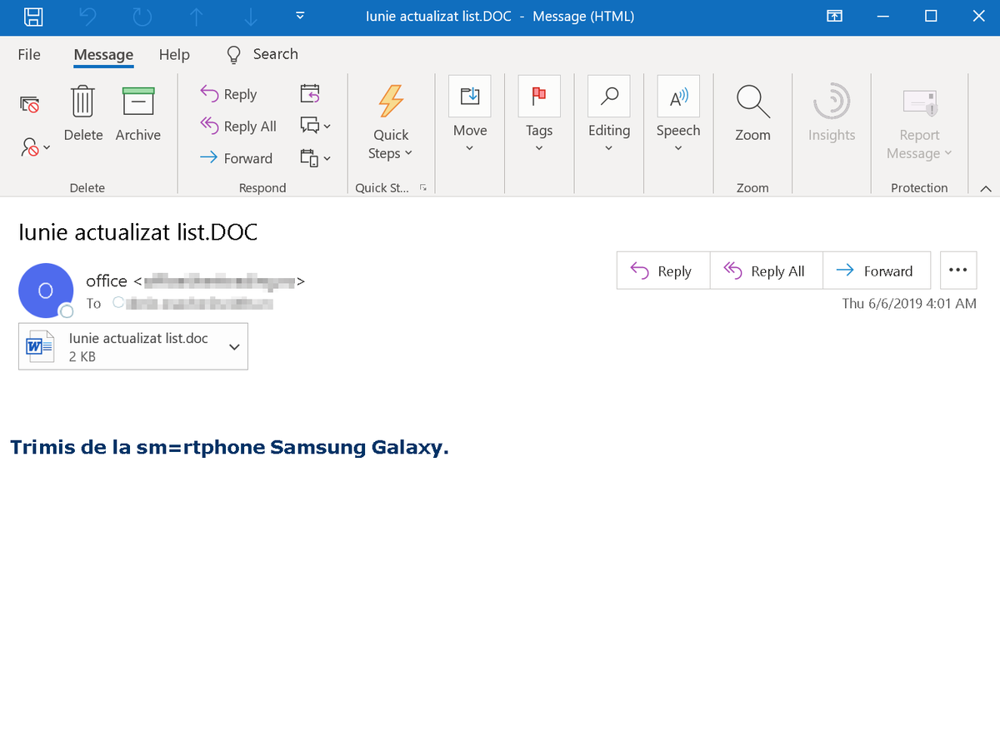
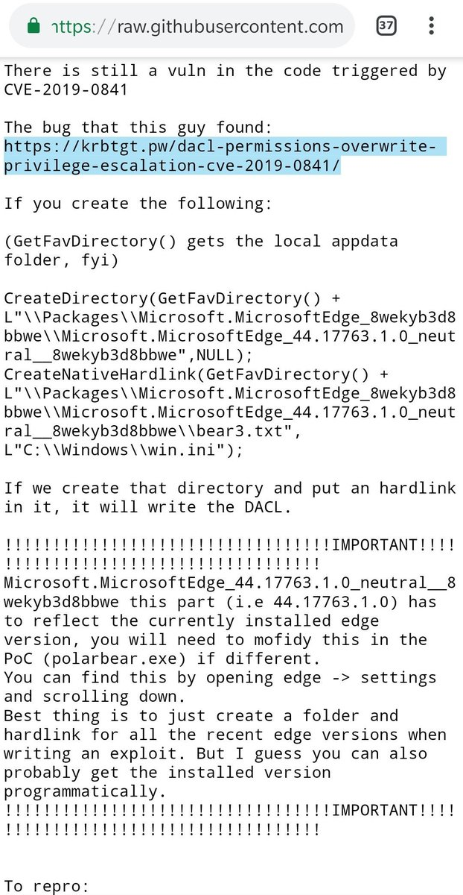
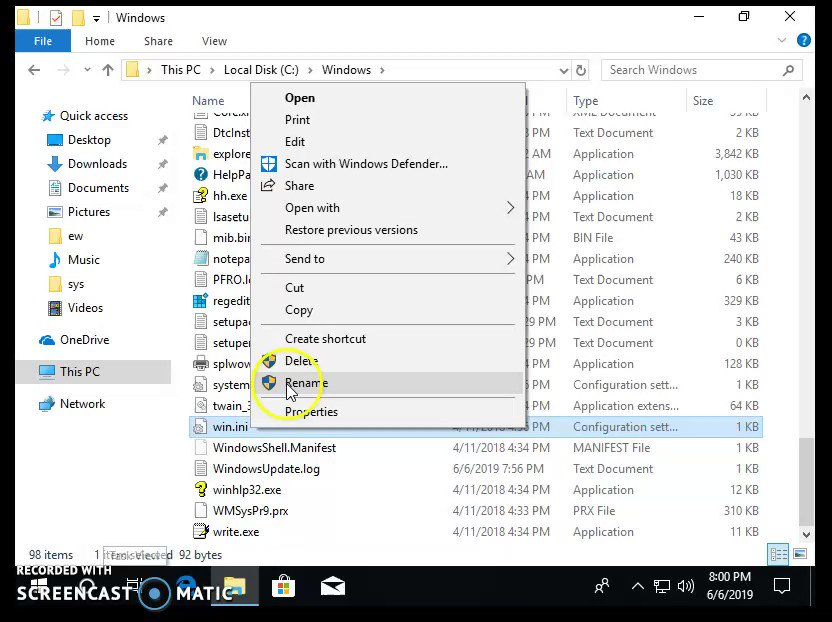

# mohammadaskar2
**https://twitter.com/mohammadaskar2/status/1145356517232795649 _at 2019-06-30, 15:40:48_**
<blockquote>
Just wrote an article about how I found another Remote Command Execution 0day (CVE-2019-13024), this time in Centreon Infrastructure monitoring software.

I performed a static code analysis in order to find the bug and then wrote the exploit using python.

https://t.co/ElYKvEZ43I
</blockquote>

* https://shells.systems/centreon-v19-04-remote-code-execution-cve-2019-13024/

<table><tr>
<td>Quotes: <code>2</code></td>
<td>Replies: <code>8</code></td>
<td>Retweets: <code>110</code></td>
<td>Favorites: <code>292</code></td>
</tr></table>

---

# _dirkjan
**https://twitter.com/_dirkjan/status/1143193274561310720 _at 2019-06-24, 16:24:50_**
<blockquote>
I wrote a small scanner utility to check if systems are vulnerable to CVE-2019-1040, the NTLM Mic vulnerability that allows for Active Directory takeover. Published here: https://t.co/4nbk3h6OCw https://t.co/nsW1QQGZYH
</blockquote>

* https://github.com/fox-it/cve-2019-1040-scanner

<table><tr>
<td></td>
</table></tr>
<table><tr>
<td>Quotes: <code>9</code></td>
<td>Replies: <code>7</code></td>
<td>Retweets: <code>399</code></td>
<td>Favorites: <code>753</code></td>
</tr></table>

---

# wugeej
**https://twitter.com/wugeej/status/1142604873562611718 _at 2019-06-23, 01:26:45_**
<blockquote>
GitHub - sophoslabs/CVE-2019-0888: PoC for CVE-2019-0888 - Use-After-Free in Windows ActiveX Data Objects (ADO) https://t.co/o22CcRKQ11
</blockquote>

* https://github.com/sophoslabs/CVE-2019-0888/

<table><tr>
<td>Quotes: <code>1</code></td>
<td>Replies: <code>0</code></td>
<td>Retweets: <code>41</code></td>
<td>Favorites: <code>86</code></td>
</tr></table>

---

# TheHackersNews
**https://twitter.com/TheHackersNews/status/1142479720505679872 _at 2019-06-22, 17:09:26_**
<blockquote>
Here's a PoC video for RCE vulnerability (CVE-2019-1105) in the "Outlook for Android," shared with THN by @Kumargaurav776, who also reported this flaw responsibly to the Microsoft. https://t.co/6ioKw3D4E2
</blockquote>

<table><tr>
<td></td>
</table></tr>
<table><tr>
<td>Quotes: <code>10</code></td>
<td>Replies: <code>5</code></td>
<td>Retweets: <code>67</code></td>
<td>Favorites: <code>113</code></td>
</tr></table>

---

# pyn3rd
**https://twitter.com/pyn3rd/status/1142436602989297664 _at 2019-06-22, 14:18:06_**
<blockquote>
#CVE-2019-2729 Weblogic RCE, it’s the bypass of CVE-2019-2725.But the PoC only works in JDK1.6. BTW maybe it’s the last time to disclose PoC, because it’s illegal in my country from now on. https://t.co/462V5wUxj8
</blockquote>

<table><tr>
<td></td>
</table></tr>
<table><tr>
<td>Quotes: <code>4</code></td>
<td>Replies: <code>14</code></td>
<td>Retweets: <code>112</code></td>
<td>Favorites: <code>274</code></td>
</tr></table>

---

# piedpiper1616
**https://twitter.com/piedpiper1616/status/1142289831499710464 _at 2019-06-22, 04:34:53_**
<blockquote>
GitHub - sophoslabs/CVE-2019-0888: PoC for CVE-2019-0888 - Use-After-Free in Windows ActiveX Data Objects (ADO) https://t.co/3y7NKGms60
</blockquote>

* https://github.com/sophoslabs/CVE-2019-0888/

<table><tr>
<td>Quotes: <code>1</code></td>
<td>Replies: <code>0</code></td>
<td>Retweets: <code>50</code></td>
<td>Favorites: <code>103</code></td>
</tr></table>

---

# bordplate
**https://twitter.com/bordplate/status/1142033076572315651 _at 2019-06-21, 11:34:38_**
<blockquote>
Just posted a blog post about how I was able to exploit CrashPlan for privilege escalation on Windows (and macOS/Linux).
This is CVE-2019-11552.

https://t.co/jB00XwicYV
</blockquote>

* https://bordplate.no/blog/en/post/crashplan-privilege-escalation/

<table><tr>
<td>Quotes: <code>0</code></td>
<td>Replies: <code>3</code></td>
<td>Retweets: <code>33</code></td>
<td>Favorites: <code>79</code></td>
</tr></table>

---

# thezdi
**https://twitter.com/thezdi/status/1141727783166648321 _at 2019-06-20, 15:21:30_**
<blockquote>
CVE-2019-5420, an RCE bug in Ruby on Rails - originally discovered by @ooooooo_q - receives the full write-up and PoC treatment from the Trend Micro Research team. Details and PoC at https://t.co/e8PceggAKF.
</blockquote>

* http://bit.ly/2ZyL139

<table><tr>
<td>Quotes: <code>2</code></td>
<td>Replies: <code>0</code></td>
<td>Retweets: <code>108</code></td>
<td>Favorites: <code>200</code></td>
</tr></table>

---

# pyn3rd
**https://twitter.com/pyn3rd/status/1141567246864539654 _at 2019-06-20, 04:43:35_**
<blockquote>
Weblogic XMLDecoder RCE
start from CVE-2017-3506, end at CVE-2019-2729. We drive Oracle crazy ,finally they utilize WHITELIST to fix. https://t.co/CWXN6zVAsQ
</blockquote>

<table><tr>
<td></td>
</table></tr>
<table><tr>
<td>Quotes: <code>3</code></td>
<td>Replies: <code>4</code></td>
<td>Retweets: <code>64</code></td>
<td>Favorites: <code>182</code></td>
</tr></table>

---

# straight_blast
**https://twitter.com/straight_blast/status/1141550634920890369 _at 2019-06-20, 03:37:35_**
<blockquote>
Finally I've got RCE with CVE-2019-0708 on Win7 x64 (#BlueKeep). Thanks @ryHanson for the help. https://t.co/6gLkisHOAR
</blockquote>

<table><tr>
<td></td>
</table></tr>
<table><tr>
<td>Quotes: <code>13</code></td>
<td>Replies: <code>12</code></td>
<td>Retweets: <code>239</code></td>
<td>Favorites: <code>711</code></td>
</tr></table>

---

# wugeej
**https://twitter.com/wugeej/status/1141525561954562048 _at 2019-06-20, 01:57:57_**
<blockquote>
[PoC] CVE-2019-8603 (macOS vulnerability): Safari sandbox escape using an out-of-bounds read vulnerability

https://t.co/bqD4GosiBt
</blockquote>

* https://mp.weixin.qq.com/s/fC18oinvoOv-H989pw06tw

<table><tr>
<td>Quotes: <code>1</code></td>
<td>Replies: <code>0</code></td>
<td>Retweets: <code>23</code></td>
<td>Favorites: <code>71</code></td>
</tr></table>

---

# zer0pwn
**https://twitter.com/zer0pwn/status/1141488997182709760 _at 2019-06-19, 23:32:39_**
<blockquote>
CVE-2019-12828 Origin RCE analysis and proof of concept. https://t.co/O96NK8BmOZ #security #bounty #bugbounty #redteam #rce #qt  #bugbountytips
</blockquote>

* https://zeropwn.github.io/2019-05-22-fun-with-uri-handlers/

<table><tr>
<td>Quotes: <code>1</code></td>
<td>Replies: <code>5</code></td>
<td>Retweets: <code>75</code></td>
<td>Favorites: <code>209</code></td>
</tr></table>

---

# wugeej
**https://twitter.com/wugeej/status/1139338670379397120 _at 2019-06-14, 01:08:01_**
<blockquote>
[PoC] 2010~2018 MS Office 0-day/1-day exploit-case-study
#OpenXMLTag
#RTF
#ActiveX
#UAF
#TIFF
#EPS
#Moniker

CVE-2010-3333
CVE-2014-1761
CVE-2016-7193
CVE-2015-1641
CVE-2017-11826
CVE-2012-0158
CVE-2012-1856
CVE-2015-1642
CVE-2014-6352
CVE-2015-0097

https://t.co/MHJ5xtGSKZ
</blockquote>

* https://www.anquanke.com/post/id/180067#h3-11

<table><tr>
<td>Quotes: <code>2</code></td>
<td>Replies: <code>3</code></td>
<td>Retweets: <code>69</code></td>
<td>Favorites: <code>173</code></td>
</tr></table>

---

# GreyNoiseIO
**https://twitter.com/GreyNoiseIO/status/1138905809608482817 _at 2019-06-12, 20:27:59_**
<blockquote>
GreyNoise has identified a sustained 6,700% increase in scan and attack traffic for the Mikrotik management port (8291/TCP). Malicious/compromised devices are being observed slinging CVE-2018-14847. Tags available to all users now.
</blockquote>

<table><tr>
<td>Quotes: <code>5</code></td>
<td>Replies: <code>2</code></td>
<td>Retweets: <code>35</code></td>
<td>Favorites: <code>71</code></td>
</tr></table>

---

# _zc00l
**https://twitter.com/_zc00l/status/1138562430626385921 _at 2019-06-11, 21:43:31_**
<blockquote>
Now that it's no longer a 0day, check my post about "Coding a reliable CVE-2019-0841 bypass" to craft a LPE exploit that works for all versions of Microsoft Edge in Windows 10.
https://t.co/1VeFQ7W9Vm
</blockquote>

* https://0x00-0x00.github.io/research/2019/05/30/Coding-a-reliable-CVE-2019-0841-Bypass.html

<table><tr>
<td>Quotes: <code>1</code></td>
<td>Replies: <code>2</code></td>
<td>Retweets: <code>98</code></td>
<td>Favorites: <code>194</code></td>
</tr></table>

---

# thezdi
**https://twitter.com/thezdi/status/1138505269737115654 _at 2019-06-11, 17:56:23_**
<blockquote>
ZDI researcher @HexKitchen takes a detailed look at CVE-2019-1069 - an LPE via the Windows task scheduler. His analysis shows an attacker can escalate even without knowing a password. https://t.co/zMILRrxYzZ
</blockquote>

* http://bit.ly/2KdcXWT

<table><tr>
<td>Quotes: <code>4</code></td>
<td>Replies: <code>1</code></td>
<td>Retweets: <code>86</code></td>
<td>Favorites: <code>134</code></td>
</tr></table>

---

# CyberWarship
**https://twitter.com/CyberWarship/status/1137975287419940864 _at 2019-06-10, 06:50:25_**
<blockquote>
CVE-2019-3719 - WriteUp &amp; Poc 

- Dell SupportAssist RCE ! (from 05/2019, but i think it's still hot ;-)

WriteUp
https://t.co/v3w6HE01V6

PoC
https://t.co/tjqZEELDsI

#infosec #pentest #exploit https://t.co/2laptTCDtF
</blockquote>

* https://d4stiny.github.io/Remote-Code-Execution-on-most-Dell-computers/
* https://github.com/D4stiny/Dell-Support-Assist-RCE-PoC

<table><tr>
<td></td>
</table></tr>
<table><tr>
<td>Quotes: <code>1</code></td>
<td>Replies: <code>2</code></td>
<td>Retweets: <code>80</code></td>
<td>Favorites: <code>175</code></td>
</tr></table>

---

# MsftSecIntel
**https://twitter.com/MsftSecIntel/status/1137118977983897600 _at 2019-06-07, 22:07:45_**
<blockquote>
An active malware campaign using emails in European languages distributes RTF files that carry the CVE-2017-11882 exploit, which allows attackers to automatically run malicious code without requiring user interaction. https://t.co/Ac6dYG9vvw
</blockquote>

<table><tr>
<td></td>
<td></td>
</table></tr>
<table><tr>
<td>Quotes: <code>25</code></td>
<td>Replies: <code>6</code></td>
<td>Retweets: <code>162</code></td>
<td>Favorites: <code>328</code></td>
</tr></table>

---

# rogue_kdc
**https://twitter.com/rogue_kdc/status/1137007917125853184 _at 2019-06-07, 14:46:26_**
<blockquote>
Now that SandboxEscaper found 2 bypasses for CVE-2019-0841 and released them as 0days both based on my public PoC. I wonder if these 0days wouldn't be public if I never disclosed the details. 🤔 https://t.co/szdrY73T1L
</blockquote>

<table><tr>
<td></td>
</table></tr>
<table><tr>
<td>Quotes: <code>4</code></td>
<td>Replies: <code>3</code></td>
<td>Retweets: <code>97</code></td>
<td>Favorites: <code>289</code></td>
</tr></table>

---

# TheHackersNews
**https://twitter.com/TheHackersNews/status/1136949163587821568 _at 2019-06-07, 10:52:58_**
<blockquote>
Hacker going by the name of #SandboxEscaper today discloses a second zero-day exploit that apparently bypasses #Microsoft's patch for a Windows EoP vulnerability (CVE-2019-0841)

https://t.co/DdO0bztrO5

—by @security_wang https://t.co/LNDzqajDOc
</blockquote>

* https://thehackernews.com/2019/06/windows-eop-exploit.html

<table><tr>
<td></td>
</table></tr>
<table><tr>
<td>Quotes: <code>20</code></td>
<td>Replies: <code>6</code></td>
<td>Retweets: <code>332</code></td>
<td>Favorites: <code>435</code></td>
</tr></table>

---

# pozdnychev
**https://twitter.com/pozdnychev/status/1136329928922804225 _at 2019-06-05, 17:52:21_**
<blockquote>
Qualys Security Advisory Team: "The return of the WIZard" (CVE-2019-10149). Instant LPE in Exim (4.87 to 4.91). Seven days to trigger a RCE. No memory corruption or ROP involved. Bypass NX/ASLR/SSP/PIE/full RELRO/etc. Architecture independent. More at https://t.co/xKwwe1ehKN
</blockquote>

* https://www.openwall.com/lists/oss-security/2019/06/05/4

<table><tr>
<td>Quotes: <code>3</code></td>
<td>Replies: <code>2</code></td>
<td>Retweets: <code>36</code></td>
<td>Favorites: <code>53</code></td>
</tr></table>

---

# ryHanson
**https://twitter.com/ryHanson/status/1135685906965262336 _at 2019-06-03, 23:13:14_**
<blockquote>
I've got reliable RCE on Windows 7 / Server 2008 and I have very little experience with kernel exploitation... Now I understand why MSRC considers CVE-2019-0708 so dangerous. https://t.co/ChGYTgyetV
</blockquote>

<table><tr>
<td></td>
</table></tr>
<table><tr>
<td>Quotes: <code>16</code></td>
<td>Replies: <code>15</code></td>
<td>Retweets: <code>341</code></td>
<td>Favorites: <code>989</code></td>
</tr></table>

---

