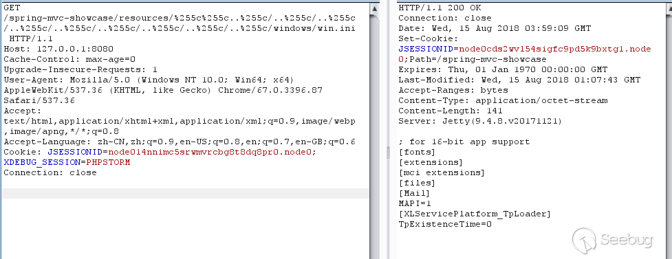
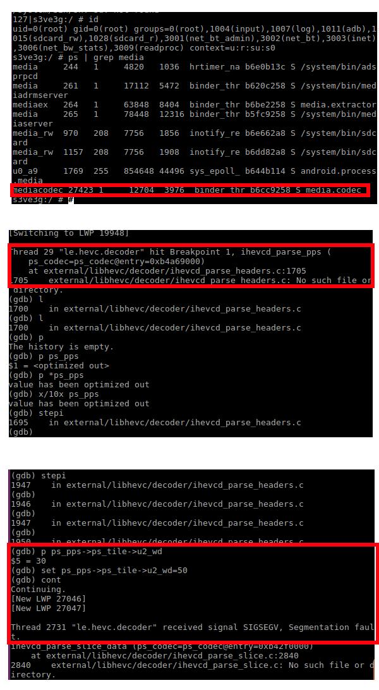
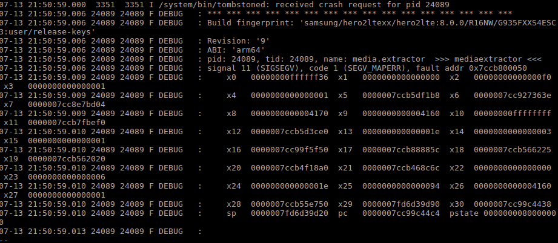
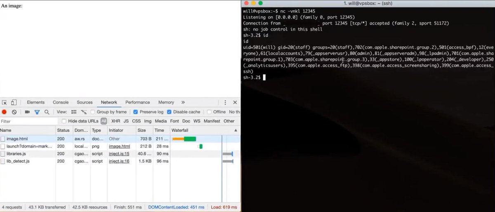
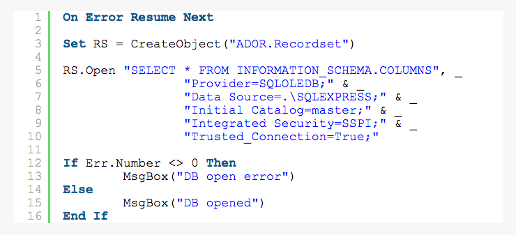

# wugeej
**https://twitter.com/wugeej/status/1156348318819090433 _at 2019-07-30, 23:38:17_**
<blockquote>
[PoC Library] Windows RCE Exploits

(1) Web VBScript
- CVE-2018-8174 (tested on non updated Internet Explorer 11 Windows 7 64/32)
- CVE-2019-0752 (tested on non updated Internet Explorer 11 Windows 7-10 (a bit slow on win10))

https://t.co/iJOOCpNIOF
</blockquote>

* https://github.com/smgorelik/Windows-RCE-exploits

<table><tr>
<td>Quotes: <code>2</code></td>
<td>Replies: <code>2</code></td>
<td>Retweets: <code>77</code></td>
<td>Favorites: <code>137</code></td>
</tr></table>

---

# wugeej
**https://twitter.com/wugeej/status/1154543251686170624 _at 2019-07-26, 00:05:36_**
<blockquote>
[PoC] Analysis of Spring MVC Directory Traversal Vulnerability (CVE-2018-1271)

http://localhost:8080/spring-mvc-showcase/resources/%255c%255c..%255c/..%255c/..%255c/..%255c/..%255c/..%255c/..%255c/..%255c/..%255c/windows/win.ini

https://t.co/uVhR571FCz https://t.co/crbODMyJi3
</blockquote>

* https://paper.seebug.org/991/

<table><tr>
<td></td>
</table></tr>
<table><tr>
<td>Quotes: <code>1</code></td>
<td>Replies: <code>0</code></td>
<td>Retweets: <code>80</code></td>
<td>Favorites: <code>178</code></td>
</tr></table>

---

# cyber_advising
**https://twitter.com/cyber_advising/status/1154471328742813701 _at 2019-07-25, 19:19:48_**
<blockquote>
Android Phone Can Get Hacked Just By Playing A Video

POC CVE-2019-2107

https://t.co/htkkLrzNGz https://t.co/SEphuSaAY5
</blockquote>

* https://github.com/marcinguy/CVE-2019-2107

<table><tr>
<td></td>
</table></tr>
<table><tr>
<td>Quotes: <code>2</code></td>
<td>Replies: <code>1</code></td>
<td>Retweets: <code>43</code></td>
<td>Favorites: <code>81</code></td>
</tr></table>

---

# seebug_team
**https://twitter.com/seebug_team/status/1154232127417982976 _at 2019-07-25, 03:29:18_**
<blockquote>
This paper analyzes the Spring MVC Directory Traversal Vulnerability (CVE-2018-1271). Learn more on Seebug Paper: https://t.co/x43TS3LIsY and Medium: https://t.co/3ZW7WAay8h
</blockquote>

* https://paper.seebug.org/991/
* https://medium.com/@knownsec404team/analysis-of-spring-mvc-directory-traversal-vulnerability-cve-2018-1271-b291bdb6be0d

<table><tr>
<td>Quotes: <code>1</code></td>
<td>Replies: <code>1</code></td>
<td>Retweets: <code>60</code></td>
<td>Favorites: <code>139</code></td>
</tr></table>

---

# _CPResearch_
**https://twitter.com/_CPResearch_/status/1154007312916451328 _at 2019-07-24, 12:35:58_**
<blockquote>
[CPR-Zero] CVE-2019-1096 (Windows 10 Kernel): Out-Of-Bounds Read in NtGdiPlgBlt syscall in win32kfull.sys
https://t.co/lEeFc1li6c
</blockquote>

* https://cpr-zero.checkpoint.com/vulns/cprid-2131/

<table><tr>
<td>Quotes: <code>3</code></td>
<td>Replies: <code>0</code></td>
<td>Retweets: <code>46</code></td>
<td>Favorites: <code>84</code></td>
</tr></table>

---

# seebug_team
**https://twitter.com/seebug_team/status/1153864873769668608 _at 2019-07-24, 03:09:58_**
<blockquote>
The Analysis of CVE-2019-11229 -- From Git Config to RCE is out now. Read more on Seebug Paper: https://t.co/2fWuk3c27R or https://t.co/n393uQAtV0.
</blockquote>

* https://paper.seebug.org/990/
* https://medium.com/@knownsec404team/analysis-of-cve-2019-11229-from-git-config-to-rce-32c217727baa

<table><tr>
<td>Quotes: <code>1</code></td>
<td>Replies: <code>0</code></td>
<td>Retweets: <code>67</code></td>
<td>Favorites: <code>134</code></td>
</tr></table>

---

# LukasStefanko
**https://twitter.com/LukasStefanko/status/1153662482256486405 _at 2019-07-23, 13:45:44_**
<blockquote>
Looks like someone successfully created PoC for Android CVE-2019-2107 RCE

PoC: You can own the mobile by watching a video with payload. Should works on Android 7.0, 7.1.1, 7.1.2, 8.0, 8.1, 9.
https://t.co/efc1ZCy6fZ https://t.co/UNvUTGEIHe
</blockquote>

* https://github.com/marcinguy/CVE-2019-2107

<table><tr>
<td></td>
</table></tr>
<table><tr>
<td>Quotes: <code>16</code></td>
<td>Replies: <code>9</code></td>
<td>Retweets: <code>466</code></td>
<td>Favorites: <code>812</code></td>
</tr></table>

---

# _CPResearch_
**https://twitter.com/_CPResearch_/status/1151821544404000768 _at 2019-07-18, 11:50:30_**
<blockquote>
[CPR-Zero] CVE-2019-1014 (Windows 10 Kernel): Race condition leading to Use-After-Free in the OpenClipboard function in win32kfull.sys
https://t.co/InGSkqNgus
</blockquote>

* https://cpr-zero.checkpoint.com/vulns/cprid-2129/

<table><tr>
<td>Quotes: <code>2</code></td>
<td>Replies: <code>0</code></td>
<td>Retweets: <code>60</code></td>
<td>Favorites: <code>105</code></td>
</tr></table>

---

# hacker_
**https://twitter.com/hacker_/status/1150516924490637314 _at 2019-07-14, 21:26:25_**
<blockquote>
New blog post: Analysis of an Atlassian Crowd RCE - CVE-2019-11580 

https://t.co/v7yXkhFtOQ
</blockquote>

* https://www.corben.io/atlassian-crowd-rce/

<table><tr>
<td>Quotes: <code>5</code></td>
<td>Replies: <code>9</code></td>
<td>Retweets: <code>207</code></td>
<td>Favorites: <code>447</code></td>
</tr></table>

---

# TheHackersNews
**https://twitter.com/TheHackersNews/status/1150000014854217728 _at 2019-07-13, 11:12:24_**
<blockquote>
📢 PoC Confirmed : CVE-2019-13567

Besides the video privacy bug disclosed earlier this week, insecure local web-server installed by #Zoom software also left Mac computers vulnerable to a critical Remote Code Execution (RCE) flaw

Read ➤ https://t.co/G3Hh5jzI9a

—by @unix_root https://t.co/QRhMh3tCyz
</blockquote>

* https://thehackernews.com/2019/07/zoom-video-conferencing-hacking.html

<table><tr>
<td></td>
</table></tr>
<table><tr>
<td>Quotes: <code>8</code></td>
<td>Replies: <code>3</code></td>
<td>Retweets: <code>140</code></td>
<td>Favorites: <code>171</code></td>
</tr></table>

---

# AmarSaar
**https://twitter.com/AmarSaar/status/1148709616869621760 _at 2019-07-09, 21:44:49_**
<blockquote>
Shoutout to the awesome Cfir Cohen for CVE-2019-0966! Thanks for letting us know about this Hyper-V DoS vulnerability (memory leak) in vpcivsp, accessible from non-root partition. It was a pleasure working with you, thanks for reaching out buddy! https://t.co/mXZ27a7Cxk
</blockquote>

* https://portal.msrc.microsoft.com/en-us/security-guidance/advisory/CVE-2019-0966

<table><tr>
<td>Quotes: <code>0</code></td>
<td>Replies: <code>1</code></td>
<td>Retweets: <code>3</code></td>
<td>Favorites: <code>42</code></td>
</tr></table>

---

# SophosLabs
**https://twitter.com/SophosLabs/status/1148609081965514752 _at 2019-07-09, 15:05:19_**
<blockquote>
CVE-2019-0888: Use-After-Free in Windows ActiveX Data Objects (ADO) 

It's been over a month since the patch was released, so we've published the following explanation of the bug, and how to exploit it to achieve an ASLR bypass and Read/Write primitive: https://t.co/LHeKeXR0fl https://t.co/fanX9ClNR7
</blockquote>

* https://news.sophos.com/en-us/2019/07/09/cve-2019-0888-use-after-free-in-windows-activex-data-objects-ado/?cmp=30727

<table><tr>
<td></td>
</table></tr>
<table><tr>
<td>Quotes: <code>3</code></td>
<td>Replies: <code>0</code></td>
<td>Retweets: <code>34</code></td>
<td>Favorites: <code>37</code></td>
</tr></table>

---

# ksecurity45
**https://twitter.com/ksecurity45/status/1147220737327058946 _at 2019-07-05, 19:08:32_**
<blockquote>
Finally I've got RCE with CVE-2019-0708 (#BlueKeep) on Win7 x64. 

A short video demonstrating Proof of concept 
https://t.co/F2wW90D3Rk

Thanks to @straight_blast , @schniggie  , Lucas , Dennis :)
</blockquote>

* https://youtu.be/05kwmHQKsEs

<table><tr>
<td>Quotes: <code>4</code></td>
<td>Replies: <code>4</code></td>
<td>Retweets: <code>19</code></td>
<td>Favorites: <code>33</code></td>
</tr></table>

---

# galdeleon
**https://twitter.com/galdeleon/status/1146031192195686400 _at 2019-07-02, 12:21:43_**
<blockquote>
Just released my post about CVE-2019-0863 Win LPE which I discovered and was also spotted ITW https://t.co/HPt65Uxn9a #sandboxescaper #vulnerability #exploitation
</blockquote>

* https://unit42.paloaltonetworks.com/tale-of-a-windows-error-reporting-zero-day-cve-2019-0863/

<table><tr>
<td>Quotes: <code>3</code></td>
<td>Replies: <code>1</code></td>
<td>Retweets: <code>37</code></td>
<td>Favorites: <code>55</code></td>
</tr></table>

---

