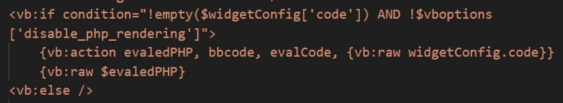
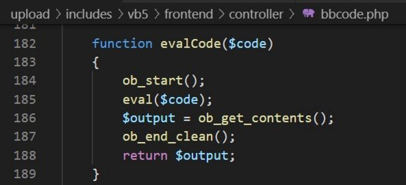
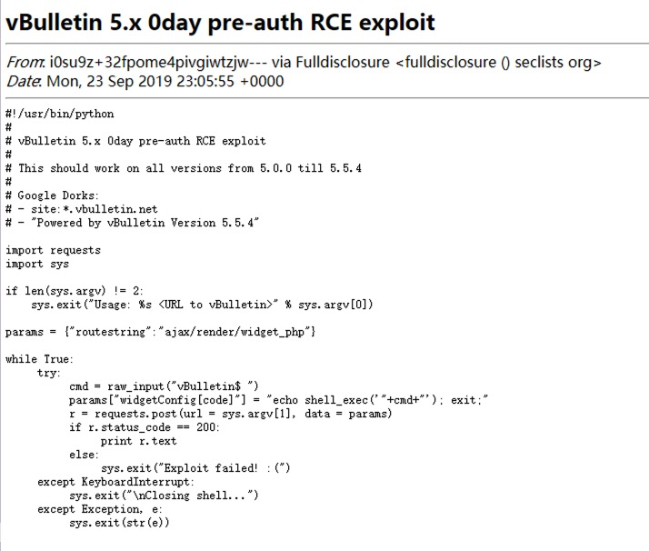
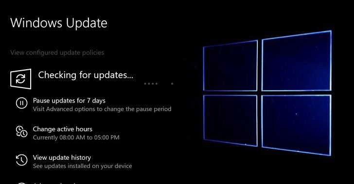
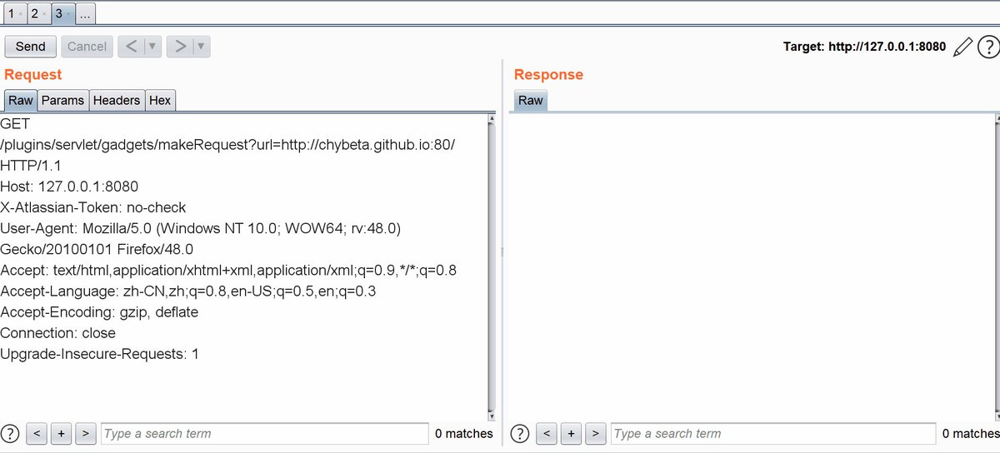
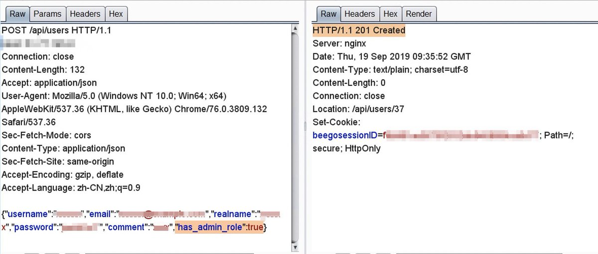
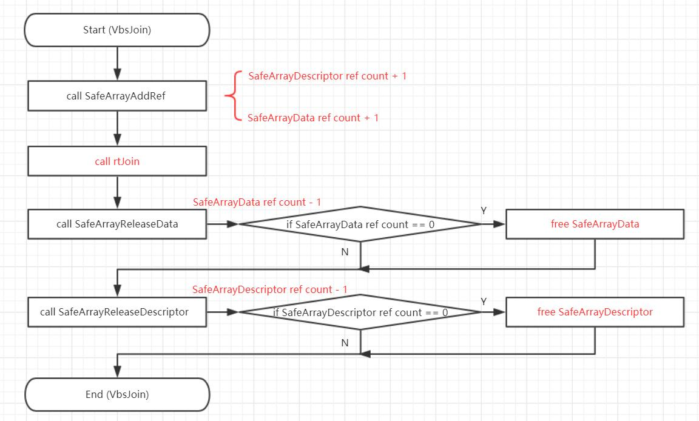
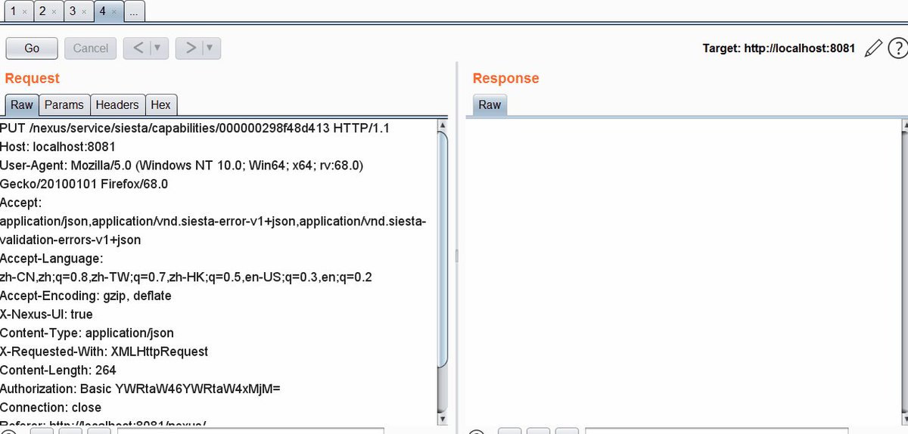

# GreyNoiseIO
**https://twitter.com/GreyNoiseIO/status/1176898873622781954 _at 2019-09-25, 16:38:51_**
<blockquote>
GreyNoise is observing opportunistic exploitation of the recent vBulletin 5.x remote code execution vulnerability (CVE-2019-16759), starting three hours ago from several hundred devices around the Internet. Tags available now. 

tags:"vBulletin 5.x RCE"

https://t.co/tBMaCdimRI https://t.co/3JLNNxA0qG
</blockquote>

* https://viz.greynoise.io/query/?gnql=tags%3A%22vBulletin%205.x%20RCE%22

<table><tr>
<td></td>
</table></tr>
<table><tr>
<td>Quotes: <code>1</code></td>
<td>Replies: <code>2</code></td>
<td>Retweets: <code>46</code></td>
<td>Favorites: <code>87</code></td>
</tr></table>

---

# chybeta
**https://twitter.com/chybeta/status/1176702424045772800 _at 2019-09-25, 03:38:14_**
<blockquote>
CVE-2019-16759   vBulletin 5.x 0day pre-auth RCE 

PHP template injection

https://t.co/I0o0rZidVq https://t.co/k39gOAeBaG
</blockquote>

* https://seclists.org/fulldisclosure/2019/Sep/31

<table><tr>
<td></td>
<td></td>
<td></td>
</table></tr>
<table><tr>
<td>Quotes: <code>3</code></td>
<td>Replies: <code>4</code></td>
<td>Retweets: <code>64</code></td>
<td>Favorites: <code>177</code></td>
</tr></table>

---

# MAlajab
**https://twitter.com/MAlajab/status/1176527593304182784 _at 2019-09-24, 16:03:31_**
<blockquote>
مايكرسوفت  تصدر ترقيع لثغرتين حرجة إحداهم في المتصفح والأخرى في برنامج الحماية من مايكرسوفت CVE-2019-1367 — a critical IE zero-day under active attack.
CVE-2019-1255 — DoS flaw in Microsoft Defender.
الحل قم بتحديث الأمني في اسرع وقت https://t.co/TYUCBvRsq2
</blockquote>

<table><tr>
<td></td>
</table></tr>
<table><tr>
<td>Quotes: <code>2</code></td>
<td>Replies: <code>2</code></td>
<td>Retweets: <code>29</code></td>
<td>Favorites: <code>49</code></td>
</tr></table>

---

# TheHackersNews
**https://twitter.com/TheHackersNews/status/1176403685879902210 _at 2019-09-24, 07:51:09_**
<blockquote>
It's not a Patch Tuesday, but #Microsoft is rolling out emergency out-of-band security patches for two new vulnerabilities:

➡️ CVE-2019-1367 — a critical IE zero-day under active attack.
➡️ CVE-2019-1255 — DoS flaw in Microsoft Defender.

Read details: https://t.co/oLonGzrR1O https://t.co/uxthA4IOaM
</blockquote>

* https://thehackernews.com/2019/09/windows-update-zero-day.html

<table><tr>
<td></td>
</table></tr>
<table><tr>
<td>Quotes: <code>9</code></td>
<td>Replies: <code>2</code></td>
<td>Retweets: <code>203</code></td>
<td>Favorites: <code>196</code></td>
</tr></table>

---

# msftsecresponse
**https://twitter.com/msftsecresponse/status/1176181336131784705 _at 2019-09-23, 17:07:37_**
<blockquote>
Out of band security vulnerability fixes CVE-2019-1367 and CVE-2019-1255 have been released today. For more information please see https://t.co/QMUM53m8so and https://t.co/vy3d0wXWng .
</blockquote>

* https://portal.msrc.microsoft.com/en-US/security-guidance/advisory/CVE-2019-1367
* https://portal.msrc.microsoft.com/en-US/security-guidance/advisory/CVE-2019-1255

<table><tr>
<td>Quotes: <code>24</code></td>
<td>Replies: <code>12</code></td>
<td>Retweets: <code>126</code></td>
<td>Favorites: <code>128</code></td>
</tr></table>

---

# chybeta
**https://twitter.com/chybeta/status/1176165964196376576 _at 2019-09-23, 16:06:32_**
<blockquote>
CVE-2019-8451 Unauthorized SSRF via REST API /plugins/servlet/gadgets/makeRequest 

use @ to bypass the whitelisting !

https://t.co/aEJ2v7MACf

👇 reading resources @orange_8361 
https://t.co/9DBKCpRcQl https://t.co/QbKmyKYAMR
</blockquote>

* https://jira.atlassian.com/issues/?filter=13085
* https://www.blackhat.com/docs/us-17/thursday/us-17-Tsai-A-New-Era-Of-SSRF-Exploiting-URL-Parser-In-Trending-Programming-Languages.pdf

<table><tr>
<td></td>
</table></tr>
<table><tr>
<td>Quotes: <code>6</code></td>
<td>Replies: <code>1</code></td>
<td>Retweets: <code>342</code></td>
<td>Favorites: <code>654</code></td>
</tr></table>

---

# _CPResearch_
**https://twitter.com/_CPResearch_/status/1176096638055661568 _at 2019-09-23, 11:31:03_**
<blockquote>
[CPR-Zero] CVE-2019-1164 (Windows 10 Kernel): Out-Of-Bounds Read\Write in the StrechBlt function in win32kfull.sys
https://t.co/BnUuYd9RWK
</blockquote>

* https://cpr-zero.checkpoint.com/vulns/cprid-2133/

<table><tr>
<td>Quotes: <code>1</code></td>
<td>Replies: <code>0</code></td>
<td>Retweets: <code>60</code></td>
<td>Favorites: <code>122</code></td>
</tr></table>

---

# Dinosn
**https://twitter.com/Dinosn/status/1176013649774874624 _at 2019-09-23, 06:01:18_**
<blockquote>
CVE-2019-1082 Windows Local Privileges Escalation. Little Writeup How i found lpe vulnerability. https://t.co/Gtd82bRqKR
</blockquote>

* https://www.reddit.com/r/netsec/comments/d80o63/cve20191082_windows_local_privileges_escalation/

<table><tr>
<td>Quotes: <code>2</code></td>
<td>Replies: <code>1</code></td>
<td>Retweets: <code>122</code></td>
<td>Favorites: <code>260</code></td>
</tr></table>

---

# _r_netsec
**https://twitter.com/_r_netsec/status/1175967546912075776 _at 2019-09-23, 02:58:06_**
<blockquote>
CVE-2019-1082 Windows Local Privileges Escalation. Little Writeup How i found lpe vulnerability. https://t.co/sNJ5bNezCC
</blockquote>

* https://link.medium.com/37fKrP5Pc0

<table><tr>
<td>Quotes: <code>1</code></td>
<td>Replies: <code>0</code></td>
<td>Retweets: <code>8</code></td>
<td>Favorites: <code>39</code></td>
</tr></table>

---

# chybeta
**https://twitter.com/chybeta/status/1174628111607926784 _at 2019-09-19, 10:15:39_**
<blockquote>
CVE-2019-16097 harbor privilege escalation:  create an administrator account  via providing  a hidden parameter `has_admin_role` 

well, hidden....
https://t.co/LE9B5Lb1iL https://t.co/aB7cSuzGx2
</blockquote>

* https://unit42.paloaltonetworks.com/critical-vulnerability-in-harbor-enables-privilege-escalation-from-zero-to-admin-cve-2019-16097/

<table><tr>
<td></td>
</table></tr>
<table><tr>
<td>Quotes: <code>6</code></td>
<td>Replies: <code>1</code></td>
<td>Retweets: <code>26</code></td>
<td>Favorites: <code>75</code></td>
</tr></table>

---

# TheHackersNews
**https://twitter.com/TheHackersNews/status/1174252554651426823 _at 2019-09-18, 09:23:20_**
<blockquote>
Warning — Researcher drops PoC for a new #phpMyAdmin zero-day flaw (CVE-2019-12922) publicly that affects all versions of the popular, widely-used database management #software.

Details: https://t.co/XGJpDCbuW0

#infosec #webdev

—via @security_wang https://t.co/GWmQceJUrI
</blockquote>

* https://thehackernews.com/2019/09/phpmyadmin-csrf-exploit.html

<table><tr>
<td></td>
</table></tr>
<table><tr>
<td>Quotes: <code>19</code></td>
<td>Replies: <code>2</code></td>
<td>Retweets: <code>214</code></td>
<td>Favorites: <code>212</code></td>
</tr></table>

---

# ptracesecurity
**https://twitter.com/ptracesecurity/status/1173499997708574722 _at 2019-09-16, 07:32:56_**
<blockquote>
From BinDiff to Zero-Day: A Proof of Concept Exploiting CVE-2019-1208 in Internet Explorer https://t.co/nc3XaeKeu9 #CyberSecurity #CyberCrime #Vulnerability #Exploit #Infosec https://t.co/Cp2rp8togz
</blockquote>

* https://blog.trendmicro.com/trendlabs-security-intelligence/from-bindiff-to-zero-day-a-proof-of-concept-exploiting-cve-2019-1208-in-internet-explorer/

<table><tr>
<td></td>
<td></td>
<td></td>
</table></tr>
<table><tr>
<td>Quotes: <code>1</code></td>
<td>Replies: <code>0</code></td>
<td>Retweets: <code>28</code></td>
<td>Favorites: <code>31</code></td>
</tr></table>

---

# xxByte
**https://twitter.com/xxByte/status/1172418715717009409 _at 2019-09-13, 07:56:18_**
<blockquote>
phpMyAdmin 4.9.0.1 CSRF vuln to delete any server(s) - CVE-2019-12922

Poc:
&lt;p&gt;Deleting Server 1&lt;/p&gt;
&lt;img src=“
http://server/phpmyadmin/setup/index.php?page=servers&amp;mode=remove&amp;id=1″
style=“display:none;” /&gt;

Happy hacking 
#0day
</blockquote>

<table><tr>
<td>Quotes: <code>17</code></td>
<td>Replies: <code>15</code></td>
<td>Retweets: <code>309</code></td>
<td>Favorites: <code>680</code></td>
</tr></table>

---

# piedpiper1616
**https://twitter.com/piedpiper1616/status/1172327741741387776 _at 2019-09-13, 01:54:49_**
<blockquote>
GitHub - GeneralEG/CVE-2019-15858: Unauthenticated RCE at Woody Ad Snippets / CVE-2019-15858 (PoC) https://t.co/v1rKtaG7B5
</blockquote>

* https://github.com/GeneralEG/CVE-2019-15858/

<table><tr>
<td>Quotes: <code>1</code></td>
<td>Replies: <code>0</code></td>
<td>Retweets: <code>9</code></td>
<td>Favorites: <code>35</code></td>
</tr></table>

---

# GeneralEG64
**https://twitter.com/GeneralEG64/status/1172278229333413888 _at 2019-09-12, 22:38:04_**
<blockquote>
I just released an Exploit for CVE-2019-15858!

Unauthenticated RCE at Woody Ad Snippets
"WordPress Plugin with 90k Active Installation"

You can find the usage and the demonstration here:
https://t.co/SOGgS6cXsB

#BugBounty
#GeneralEG https://t.co/OrFy4P2qhl
</blockquote>

* https://github.com/GeneralEG/CVE-2019-15858

<table><tr>
<td></td>
</table></tr>
<table><tr>
<td>Quotes: <code>1</code></td>
<td>Replies: <code>2</code></td>
<td>Retweets: <code>80</code></td>
<td>Favorites: <code>170</code></td>
</tr></table>

---

# Dinosn
**https://twitter.com/Dinosn/status/1172224144068546560 _at 2019-09-12, 19:03:09_**
<blockquote>
From BinDiff to Zero-Day: A Proof of Concept Exploiting CVE-2019-1208 in Internet Explorer https://t.co/45VjymtB0H
</blockquote>

* https://blog.trendmicro.com/trendlabs-security-intelligence/from-bindiff-to-zero-day-a-proof-of-concept-exploiting-cve-2019-1208-in-internet-explorer/

<table><tr>
<td>Quotes: <code>1</code></td>
<td>Replies: <code>0</code></td>
<td>Retweets: <code>56</code></td>
<td>Favorites: <code>145</code></td>
</tr></table>

---

# axcheron
**https://twitter.com/axcheron/status/1172221599866589185 _at 2019-09-12, 18:53:02_**
<blockquote>
From BinDiff to Zero-Day: A Proof of Concept Exploiting CVE-2019-1208 in Internet Explorer https://t.co/nOBAOE7mrx #UAF #IE #exploit
</blockquote>

* https://blog.trendmicro.com/trendlabs-security-intelligence/from-bindiff-to-zero-day-a-proof-of-concept-exploiting-cve-2019-1208-in-internet-explorer/

<table><tr>
<td>Quotes: <code>1</code></td>
<td>Replies: <code>0</code></td>
<td>Retweets: <code>24</code></td>
<td>Favorites: <code>56</code></td>
</tr></table>

---

# TrendMicroRSRCH
**https://twitter.com/TrendMicroRSRCH/status/1172119736110522369 _at 2019-09-12, 12:08:16_**
<blockquote>
New post: From BinDiff to Zero-Day: A Proof of Concept Exploiting CVE-2019-1208 in Internet Explorer https://t.co/xuWAl3pwwE @TrendMicroRSRCH
</blockquote>

* http://bit.ly/34CA7ge

<table><tr>
<td>Quotes: <code>1</code></td>
<td>Replies: <code>1</code></td>
<td>Retweets: <code>10</code></td>
<td>Favorites: <code>35</code></td>
</tr></table>

---

# rogue_kdc
**https://twitter.com/rogue_kdc/status/1171706305368723457 _at 2019-09-11, 08:45:27_**
<blockquote>
@_RastaMouse and I found a privilege escalation/DoS bug in Windows AppX Deployment Server (CVE-2019-1253)
Both of us found it independently while researching CVE-2019-0841
Use it responsibly!
https://t.co/Ts899ikpDi
</blockquote>

* https://github.com/rogue-kdc/CVE-2019-1253

<table><tr>
<td>Quotes: <code>2</code></td>
<td>Replies: <code>3</code></td>
<td>Retweets: <code>56</code></td>
<td>Favorites: <code>84</code></td>
</tr></table>

---

# chybeta
**https://twitter.com/chybeta/status/1169893924359426050 _at 2019-09-06, 08:43:41_**
<blockquote>
CVE-2019-5475 Nexus Repository Manager 2 - OS Command Injection  (authenticated)  

Security Advisories https://t.co/dXY6xBRMWj

Fix: https://t.co/wyfPryHf4g https://t.co/TjKffYWfiw
</blockquote>

* https://support.sonatype.com/hc/en-us/articles/360033490774-CVE-2019-5475-Nexus-Repository-Manager-2-Remote-Code-Execution-2019-08-09
* https://github.com/sonatype/nexus-public/commit/e8769e53f6bb601126ef5d21f9ea009873b65e25#diff-4ab0523de106ac7a38808f0231fc8a23

<table><tr>
<td></td>
</table></tr>
<table><tr>
<td>Quotes: <code>1</code></td>
<td>Replies: <code>1</code></td>
<td>Retweets: <code>52</code></td>
<td>Favorites: <code>119</code></td>
</tr></table>

---

# kmkz_security
**https://twitter.com/kmkz_security/status/1169547426249826305 _at 2019-09-05, 09:46:50_**
<blockquote>
3 vulns #exploit chain used in #PenTest 45 days ago -&gt; #ACL bypass+SQLi+RCE via file upload :S CVE-2019-14252/14253/14254 - No magic 0days here: https://t.co/NajroEqOSU #Pentesting #CVE #disclosure cc @Publisure @jeefers
</blockquote>

* https://github.com/kmkz/exploit/blob/master/PUBLISURE-EXPLOIT-CHAIN-ADVISORY.txt

<table><tr>
<td>Quotes: <code>2</code></td>
<td>Replies: <code>3</code></td>
<td>Retweets: <code>48</code></td>
<td>Favorites: <code>117</code></td>
</tr></table>

---

