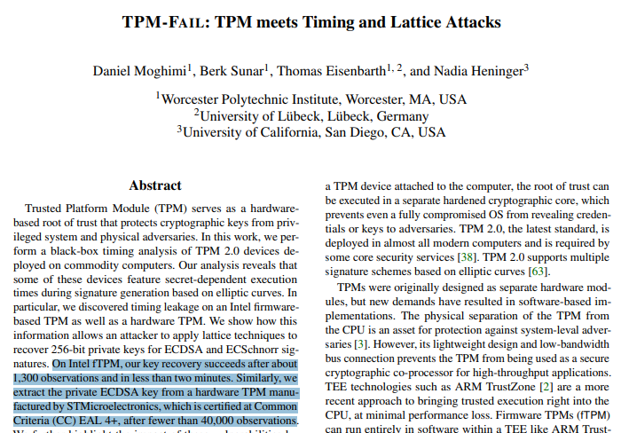

# chybeta
**https://twitter.com/chybeta/status/1199150892290732033 _at 2019-11-26, 02:20:26_**
<blockquote>
CVE-2019-19268 rConfig 3.9.2 Local Privilege Escalation:  https://t.co/tkoWcHxsju 

CVE-2019-19268  + CVE-2019-16663 / CVE-2019-16662 = Full ROOT ACCESS

about CVE-2019-16663 / CVE-2019-16662  https://t.co/PA47wNC5HR https://t.co/3OQy1PRzk2
</blockquote>

* https://github.com/TheCyberGeek/CVE-2019-19268
* https://shells.systems/rconfig-v3-9-2-authenticated-and-unauthenticated-rce-cve-2019-16663-and-cve-2019-16662/

<table><tr>
<td></td>
</table></tr>
<table><tr>
<td>Quotes: <code>1</code></td>
<td>Replies: <code>1</code></td>
<td>Retweets: <code>44</code></td>
<td>Favorites: <code>100</code></td>
</tr></table>

---

# Dinosn
**https://twitter.com/Dinosn/status/1199007917804052480 _at 2019-11-25, 16:52:18_**
<blockquote>
Anti-virus Exploitation: Local Privilege Escalation in K7 Security (CVE-2019-16897) - Exploit Development - 0x00sec
https://t.co/puhdpwsE1X
</blockquote>

* https://0x00sec.org/t/anti-virus-exploitation-local-privilege-escalation-in-k7-security-cve-2019-16897/17655

<table><tr>
<td>Quotes: <code>1</code></td>
<td>Replies: <code>0</code></td>
<td>Retweets: <code>39</code></td>
<td>Favorites: <code>72</code></td>
</tr></table>

---

# chybeta
**https://twitter.com/chybeta/status/1198515278746800128 _at 2019-11-24, 08:14:44_**
<blockquote>
CVE-2019-18622  SQLI in phpMyAdmin:  A vulnerability was reported where a specially crafted database name can be used to trigger an SQL injection attack through the designer feature.
https://t.co/CDON9zOuY8
</blockquote>

* https://www.phpmyadmin.net/security/PMASA-2019-5/

<table><tr>
<td>Quotes: <code>2</code></td>
<td>Replies: <code>3</code></td>
<td>Retweets: <code>72</code></td>
<td>Favorites: <code>148</code></td>
</tr></table>

---

# chybeta
**https://twitter.com/chybeta/status/1196638224422014976 _at 2019-11-19, 03:55:59_**
<blockquote>
CVE-2019-12409: Apache Solr RCE vulnerability due to bad config default (JMX )  https://t.co/xQCOw10eD0

jython https://t.co/vkuiUeaCT2 xxx 18983 command super_secret "ls -la"

https://t.co/WkAdM31DMz https://t.co/3uYrsOanEQ
</blockquote>

* https://lucene.apache.org/solr/news.html
* http://mjet.py
* https://mogwailabs.de/blog/2019/04/attacking-rmi-based-jmx-services/

<table><tr>
<td></td>
<td></td>
</table></tr>
<table><tr>
<td>Quotes: <code>1</code></td>
<td>Replies: <code>0</code></td>
<td>Retweets: <code>58</code></td>
<td>Favorites: <code>122</code></td>
</tr></table>

---

# mobilesecurity_
**https://twitter.com/mobilesecurity_/status/1195688967913562112 _at 2019-11-16, 13:03:59_**
<blockquote>
New critical security issue for WhatsApp ⚠️🚨 - a maliciously crafted MP4 file could lead to DoS or RCE. Both Android and iOS versions are affected
#MobileSecurity  (CVE-2019-11931)
https://t.co/OrEcZYguQW
</blockquote>

* https://m.facebook.com/security/advisories/cve-2019-11931

<table><tr>
<td>Quotes: <code>0</code></td>
<td>Replies: <code>0</code></td>
<td>Retweets: <code>62</code></td>
<td>Favorites: <code>93</code></td>
</tr></table>

---

# andersonc0d3
**https://twitter.com/andersonc0d3/status/1195153699070451712 _at 2019-11-15, 01:37:01_**
<blockquote>
CVE-2019-11931

A stack-based buffer overflow could be triggered in WhatsApp by sending a specially crafted MP4 file to a WhatsApp user. The issue was present in parsing the elementary stream metadata of an MP4 file and could result in a DoS or RCE. https://t.co/c6XscizBPH
</blockquote>

* https://m.facebook.com/security/advisories/cve-2019-11931

<table><tr>
<td>Quotes: <code>8</code></td>
<td>Replies: <code>1</code></td>
<td>Retweets: <code>81</code></td>
<td>Favorites: <code>155</code></td>
</tr></table>

---

# ember_sec
**https://twitter.com/ember_sec/status/1195103549484494848 _at 2019-11-14, 22:17:44_**
<blockquote>
More from the @ember_sec blog... #CVE-2019-1378: Exploiting an Access Control Privilege Escalation #Vulnerability in #Windows10 Update Assistant (WUA).
^^ discovered by @ember_sec's own @bohops.

Link- https://t.co/2sw0M6lgap https://t.co/oSfbGnYWHf
</blockquote>

* https://www.embercybersecurity.com/blog/cve-2019-1378-exploiting-an-access-control-privilege-escalation-vulnerability-in-windows-10-update-assistant-wua

<table><tr>
<td></td>
</table></tr>
<table><tr>
<td>Quotes: <code>3</code></td>
<td>Replies: <code>0</code></td>
<td>Retweets: <code>55</code></td>
<td>Favorites: <code>71</code></td>
</tr></table>

---

# r3c0nst
**https://twitter.com/r3c0nst/status/1195010476486381569 _at 2019-11-14, 16:07:54_**
<blockquote>
Windows privilege escalation exploit for CVE-2019-1322 + CVE-2019-1405 With Sourcecode, binary and howto Video. Tested and works! Expect this to be used in future malware. #Hacking #DFIR
</blockquote>

<table><tr>
<td>Quotes: <code>1</code></td>
<td>Replies: <code>0</code></td>
<td>Retweets: <code>68</code></td>
<td>Favorites: <code>129</code></td>
</tr></table>

---

# SpecialHoang
**https://twitter.com/SpecialHoang/status/1194958728065376258 _at 2019-11-14, 12:42:16_**
<blockquote>
Thanks to @NCCGroupInfosec  for releasing their write up on CVE-2019-1405 and CVE-2019-1322. I  figured it is time for me to learn some COM stuff so I whip up a PoC.
Source: https://t.co/Ucpa7SykiS . 
Video: https://t.co/h45WJKhMMO 
Thanks to @leoloobeek and @TomahawkApt69
</blockquote>

* https://github.com/apt69/COMahawk
* https://vimeo.com/373051209

<table><tr>
<td>Quotes: <code>4</code></td>
<td>Replies: <code>6</code></td>
<td>Retweets: <code>147</code></td>
<td>Favorites: <code>265</code></td>
</tr></table>

---

# hosselot
**https://twitter.com/hosselot/status/1194363315344084992 _at 2019-11-12, 21:16:19_**
<blockquote>
So tonight Microsoft fixed 3 vulnerabilities I reported in Windows Font processing affecting Kernel in Windows before 10:
CVE-2019-1419: RCE in Windows 10 and below.
CVE-2019-1456: RCE in Windows 10 and below.
CVE-2019-1412: Windows Kernel information disclosure.
</blockquote>

<table><tr>
<td>Quotes: <code>1</code></td>
<td>Replies: <code>2</code></td>
<td>Retweets: <code>11</code></td>
<td>Favorites: <code>72</code></td>
</tr></table>

---

# _markel___
**https://twitter.com/_markel___/status/1194351078202101761 _at 2019-11-12, 20:27:41_**
<blockquote>
Intel discloses remote 'privileges escalation' vulnerability in CSME for non-vPro systems (not having AMT module). That's a precedent breaking well recognized assumptions about remote attacks on CSME (CVE-2019-0169): https://t.co/ADPHCzUpcZ
</blockquote>

* https://www.intel.com/content/www/us/en/security-center/advisory/intel-sa-00241.html

<table><tr>
<td>Quotes: <code>6</code></td>
<td>Replies: <code>0</code></td>
<td>Retweets: <code>69</code></td>
<td>Favorites: <code>110</code></td>
</tr></table>

---

# mjos_crypto
**https://twitter.com/mjos_crypto/status/1194347394646851585 _at 2019-11-12, 20:13:03_**
<blockquote>
This is pretty cool and important stuff on full working timing attacks on real-life TPMs; paper https://t.co/2eAzLRTtoU  Intel TPM chips: CVE-2019-11090, ST's TPM chips: CVE-2019-16863. In this case a vulnerability website is entirely appropriate: https://t.co/Y1AxxhsFaL https://t.co/851Bt3A6JA
</blockquote>

* http://tpm.fail/tpmfail.pdf
* http://tpm.fail/

<table><tr>
<td></td>
</table></tr>
<table><tr>
<td>Quotes: <code>11</code></td>
<td>Replies: <code>4</code></td>
<td>Retweets: <code>125</code></td>
<td>Favorites: <code>181</code></td>
</tr></table>

---

# Unknownuser1806
**https://twitter.com/Unknownuser1806/status/1194069332851953664 _at 2019-11-12, 01:48:08_**
<blockquote>
CORS To CSRF Attack
https://t.co/bPmNibNnDG

How I Hacked the Microsoft Outlook Android App and Found CVE-2019-1105
https://t.co/VbEeFibAlV

CSV injection at Comment Section.
https://t.co/gDEA5u84hd

#bugbounty,#bugbountytips,#cybersecurity,#hacking,#infosec
</blockquote>

* https://blog.usejournal.com/cors-to-csrf-attack-c33a595d441
* https://www.f5.com/labs/articles/threat-intelligence/how-i-hacked-the-microsoft-outlook-android-app-and-found-cve-2019-1105
* https://medium.com/@navne3t/csv-injection-at-comment-section-d5009ddd176

<table><tr>
<td>Quotes: <code>1</code></td>
<td>Replies: <code>0</code></td>
<td>Retweets: <code>27</code></td>
<td>Favorites: <code>58</code></td>
</tr></table>

---

# MsftSecIntel
**https://twitter.com/MsftSecIntel/status/1192549278507388929 _at 2019-11-07, 21:07:59_**
<blockquote>
While we currently see only coin miners being dropped, we agree w/ the research community that CVE-2019-0708 (BlueKeep) exploitation can be big. Locate and patch exposed RDP services now. Read our latest blog w/ assist from @GossiTheDog &amp; @MalwareTechBlog https://t.co/y1NgN5WVu8
</blockquote>

* https://www.microsoft.com/security/blog/2019/11/07/the-new-cve-2019-0708-rdp-exploit-attacks-explained/

<table><tr>
<td>Quotes: <code>36</code></td>
<td>Replies: <code>2</code></td>
<td>Retweets: <code>445</code></td>
<td>Favorites: <code>719</code></td>
</tr></table>

---

# _r_netsec
**https://twitter.com/_r_netsec/status/1190919820662861824 _at 2019-11-03, 09:13:06_**
<blockquote>
CVE-2019-16662 &amp; CVE-2019-16663 - Unauthenticated remote code execution vulnerabilities in rConfig (All versions) https://t.co/Pb9GNjsd7j
</blockquote>

* https://www.sudokaikan.com/2019/11/cve-2019-16662-cve-2019-16663.html

<table><tr>
<td>Quotes: <code>1</code></td>
<td>Replies: <code>0</code></td>
<td>Retweets: <code>23</code></td>
<td>Favorites: <code>52</code></td>
</tr></table>

---

# k_sec
**https://twitter.com/k_sec/status/1190306767588036608 _at 2019-11-01, 16:37:02_**
<blockquote>
cve-2019-13720 chrome 0day exploit and payload details https://t.co/EMhym0Qf09
</blockquote>

* https://securelist.com/chrome-0-day-exploit-cve-2019-13720-used-in-operation-wizardopium/94866/

<table><tr>
<td>Quotes: <code>2</code></td>
<td>Replies: <code>0</code></td>
<td>Retweets: <code>60</code></td>
<td>Favorites: <code>77</code></td>
</tr></table>

---

# TheHackersNews
**https://twitter.com/TheHackersNews/status/1190202094084489217 _at 2019-11-01, 09:41:06_**
<blockquote>
With the release of Chrome 78.0.3904.87 yesterday, Google has patched 2 high severity use-after-free vulnerabilities in Chrome web browser:

➤ CVE-2019-13720
➤ CVE-2019-13721
</blockquote>

<table><tr>
<td>Quotes: <code>5</code></td>
<td>Replies: <code>1</code></td>
<td>Retweets: <code>28</code></td>
<td>Favorites: <code>47</code></td>
</tr></table>

---

# TheHackersNews
**https://twitter.com/TheHackersNews/status/1190201400279453697 _at 2019-11-01, 09:38:21_**
<blockquote>
🎃 0-Day Alert!

#Google is warning Windows, Mac, #Linux users to update their #Chrome browser (to 78.0.3904.87) immediately due to a security vulnerability (CVE-2019-13720) that attackers are actively exploiting in the wild to hijack computers.

https://t.co/tw7Msba4kb

#infosec https://t.co/QJj7ojqEDU
</blockquote>

* https://thehackernews.com/2019/11/chrome-zero-day-update.html

<table><tr>
<td></td>
</table></tr>
<table><tr>
<td>Quotes: <code>93</code></td>
<td>Replies: <code>21</code></td>
<td>Retweets: <code>1022</code></td>
<td>Favorites: <code>735</code></td>
</tr></table>

---

# campuscodi
**https://twitter.com/campuscodi/status/1190183847859834881 _at 2019-11-01, 08:28:36_**
<blockquote>
On late Halloween evening, Google discloses Chrome zero-day exploited in the wild

&gt; CVE-2019-13720
&gt; Use-after-free in Chrome's audio component
&gt; Update to Chrome 78.0.3904.87
&gt; No details about attacks (cybercrime/APT-related)
&gt; Discovered by Kaspersky

https://t.co/6imlN8TA17 https://t.co/MhKSrs77m4
</blockquote>

* https://www.zdnet.com/article/halloween-scare-google-discloses-chrome-zero-day-exploited-in-the-wild/

<table><tr>
<td></td>
</table></tr>
<table><tr>
<td>Quotes: <code>2</code></td>
<td>Replies: <code>2</code></td>
<td>Retweets: <code>46</code></td>
<td>Favorites: <code>76</code></td>
</tr></table>

---

# scarybeasts
**https://twitter.com/scarybeasts/status/1190158374987427840 _at 2019-11-01, 06:47:23_**
<blockquote>
Your other Halloween scare, looks like a Chrome 0-day: "CVE-2019-13720: Use-after-free in audio. Reported by Anton Ivanov and Alexey Kulaev at Kaspersky Labs on 2019-10-29

Google is aware of reports that an exploit for CVE-2019-13720 exists in the wild."
</blockquote>

<table><tr>
<td>Quotes: <code>5</code></td>
<td>Replies: <code>4</code></td>
<td>Retweets: <code>81</code></td>
<td>Favorites: <code>241</code></td>
</tr></table>

---

