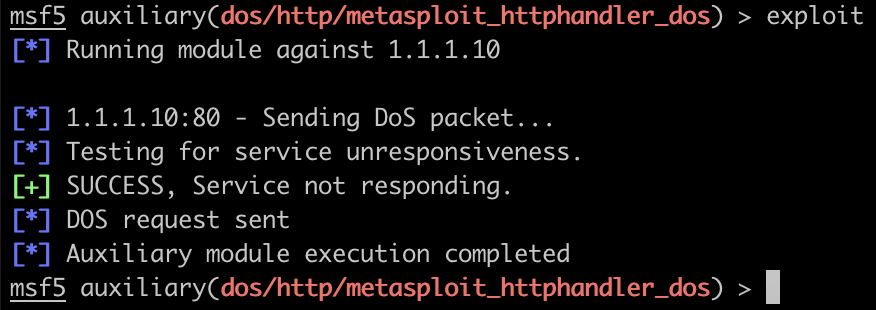
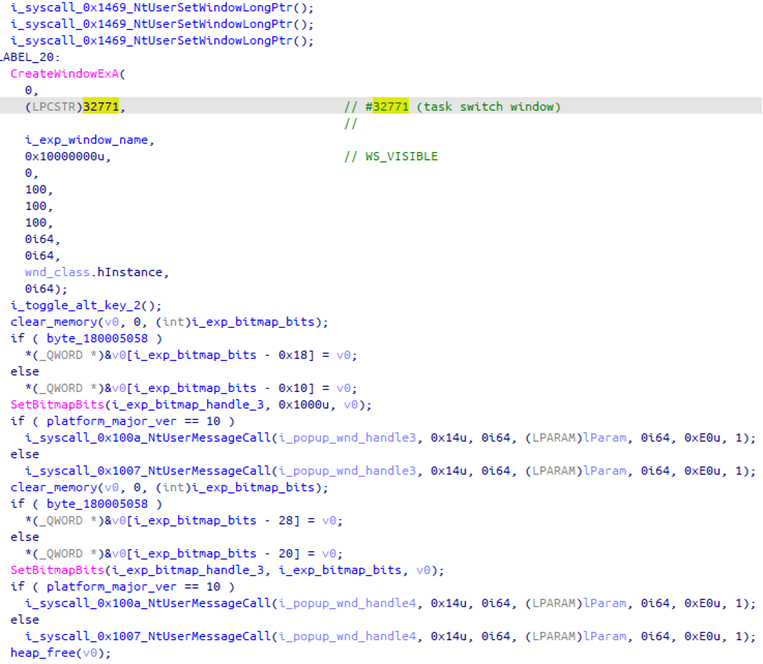
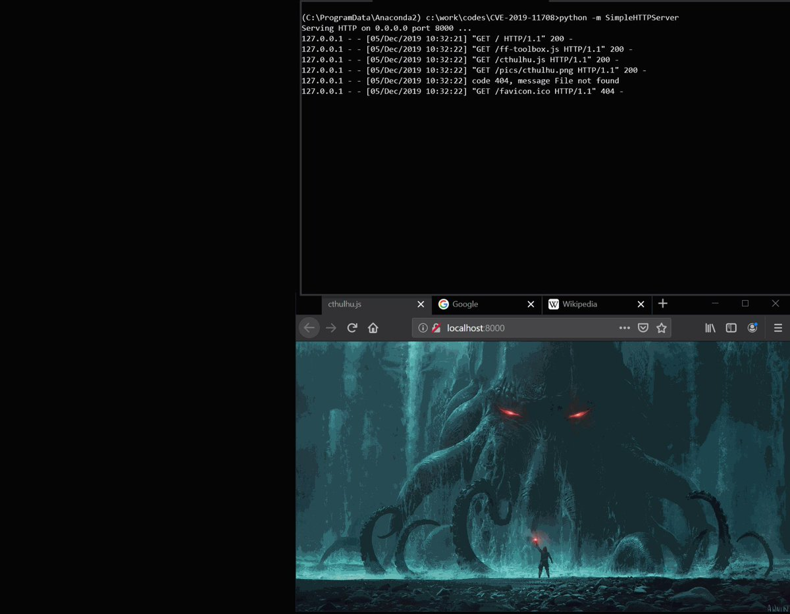

# ddouhine
**https://twitter.com/ddouhine/status/1210588750008463360 _at 2019-12-27, 15:50:24_**
<blockquote>
Blue teamers you can target #metasploit with this exploit... #metasploit dropped yesterday ;)
No RCE but a DoS: red teamers will lost their sessions, don't get new ones and will have to restart MSF.
CVE-2019-5645
https://t.co/zH8D4GCTYU https://t.co/zmG1jmYsaF
</blockquote>

* https://github.com/rapid7/metasploit-framework/pull/12433

<table><tr>
<td></td>
<td></td>
</table></tr>
<table><tr>
<td>Quotes: <code>30</code></td>
<td>Replies: <code>11</code></td>
<td>Retweets: <code>261</code></td>
<td>Favorites: <code>634</code></td>
</tr></table>

---

# _CPResearch_
**https://twitter.com/_CPResearch_/status/1209763502761664512 _at 2019-12-25, 09:11:10_**
<blockquote>
[CPR-Zero] CVE-2019-1286 (Windows Kernel): Null Pointer Dereference in the AlphaBlend function in win32kfull.sys
https://t.co/zPybFXupaT
</blockquote>

* https://cpr-zero.checkpoint.com/vulns/cprid-2138/

<table><tr>
<td>Quotes: <code>1</code></td>
<td>Replies: <code>0</code></td>
<td>Retweets: <code>50</code></td>
<td>Favorites: <code>91</code></td>
</tr></table>

---

# cyber_advising
**https://twitter.com/cyber_advising/status/1209475014430482432 _at 2019-12-24, 14:04:49_**
<blockquote>
django PoC for CVE-2019-19844

Affected supported versions
Django master branch
Django 3.0
Django 2.2
Django 1.11
https://t.co/SfvOh6xnFd https://t.co/Ny9EPoqZA5
</blockquote>

* https://github.com/ryu22e/django_cve_2019_19844_poc/

<table><tr>
<td></td>
</table></tr>
<table><tr>
<td>Quotes: <code>1</code></td>
<td>Replies: <code>0</code></td>
<td>Retweets: <code>96</code></td>
<td>Favorites: <code>193</code></td>
</tr></table>

---

# Synacktiv
**https://twitter.com/Synacktiv/status/1208025909212667904 _at 2019-12-20, 14:06:35_**
<blockquote>
"Hey la Kibana, Inspection des gadgets !" 😋 Pwning Kibana 6.2 using prototype pollution and CVE-2018-17246 by @_mabote_ 

https://t.co/oHFPSKzcB7
</blockquote>

* https://www.synacktiv.com/posts/pentest/pwning-an-outdated-kibana-with-not-so-sad-vulnerabilities.html

<table><tr>
<td>Quotes: <code>2</code></td>
<td>Replies: <code>3</code></td>
<td>Retweets: <code>65</code></td>
<td>Favorites: <code>119</code></td>
</tr></table>

---

# noperator
**https://twitter.com/noperator/status/1205534110212673548 _at 2019-12-13, 17:05:04_**
<blockquote>
Just published a PoC exploit for CVE-2019-18935 (https://t.co/TtW4GKVm0n), RCE via insecure deserialization affecting Telerik UI. See full write-up below. Thanks to @mwulftange for discovering this issue, and @bao7uo for collaborating on exploit dev.
</blockquote>

* https://github.com/noperator/CVE-2019-18935

<table><tr>
<td>Quotes: <code>5</code></td>
<td>Replies: <code>0</code></td>
<td>Retweets: <code>103</code></td>
<td>Favorites: <code>222</code></td>
</tr></table>

---

# bishopfox
**https://twitter.com/bishopfox/status/1205516977793589250 _at 2019-12-13, 15:56:59_**
<blockquote>
The CVE-2019-18935 is a severe insecure deserialization vulnerability affecting #Telerik UI. Understand its impact + learn to safely patch your software in this post from @noperator: https://t.co/x6nstX1Ieg (With thanks to @mwulftange + @bao7uo) https://t.co/qHc5XoKywA
</blockquote>

* https://hubs.ly/H0mf7L-0

<table><tr>
<td></td>
</table></tr>
<table><tr>
<td>Quotes: <code>6</code></td>
<td>Replies: <code>1</code></td>
<td>Retweets: <code>68</code></td>
<td>Favorites: <code>147</code></td>
</tr></table>

---

# IanColdwater
**https://twitter.com/IanColdwater/status/1205167269124423681 _at 2019-12-12, 16:47:22_**
<blockquote>
2 new CVEs for Istio with 9.0 CVSS scores:

CVE-2019-18801
CVE-2019-18802

Heap overflow and improper input validation in Envoy

https://t.co/tGv4fXXW2j
</blockquote>

* https://istio.io/news/security/istio-security-2019-007/

<table><tr>
<td>Quotes: <code>1</code></td>
<td>Replies: <code>1</code></td>
<td>Retweets: <code>15</code></td>
<td>Favorites: <code>43</code></td>
</tr></table>

---

# Nettitude_Labs
**https://twitter.com/Nettitude_Labs/status/1205155380751486976 _at 2019-12-12, 16:00:08_**
<blockquote>
Learn how to exploit Symantec Endpoint Protection on all versions of Windows (CVE-2019-12750). Part 2 of this series by @kyREcon delves into a more advanced method of exploitation! https://t.co/1LBcHOkQT7
</blockquote>

* https://labs.nettitude.com/blog/cve-2019-12750-symantec-endpoint-protection-local-privilege-escalation-part-2/

<table><tr>
<td>Quotes: <code>5</code></td>
<td>Replies: <code>1</code></td>
<td>Retweets: <code>137</code></td>
<td>Favorites: <code>256</code></td>
</tr></table>

---

# TheHackersNews
**https://twitter.com/TheHackersNews/status/1205021980241453056 _at 2019-12-12, 07:10:02_**
<blockquote>
👏 Patched in less than 3 hours...
 
A new local privilege escalation vulnerability (CVE-2019-19726) discovered in #OpenBSD 6.5/6.6 that could allow local users or malicious software to gain full root privileges on targeted systems.

Details and PoC: https://t.co/Lc1NTtTG3G
</blockquote>

* https://www.qualys.com/2019/12/11/cve-2019-19726/local-privilege-escalation-openbsd-dynamic-loader.txt

<table><tr>
<td>Quotes: <code>3</code></td>
<td>Replies: <code>1</code></td>
<td>Retweets: <code>65</code></td>
<td>Favorites: <code>102</code></td>
</tr></table>

---

# OPOSEC
**https://twitter.com/OPOSEC/status/1204672174830825473 _at 2019-12-11, 08:00:02_**
<blockquote>
PreAuth RCE on Palo Alto GlobalProtect Part II (CVE-2019-1579). https://t.co/W2ILBPYz5Y (+) PoC: https://t.co/c7NoOYuCYi #Security #293 (2019)
</blockquote>

* http://bit.ly/2lXfyJy
* https://github.com/securifera/CVE-2019-1579

<table><tr>
<td>Quotes: <code>1</code></td>
<td>Replies: <code>0</code></td>
<td>Retweets: <code>26</code></td>
<td>Favorites: <code>32</code></td>
</tr></table>

---

# TheHackersNews
**https://twitter.com/TheHackersNews/status/1204649907388203008 _at 2019-12-11, 06:31:33_**
<blockquote>
Used in #OperationWizardOpium cyberattack, the newly patched Windows 0-day privilege escalation vulnerability (CVE-2019-1458) was exploited in combination with a Chrome browser flaw to take remote control over vulnerable computers, as spotted by Kaspersky researchers. https://t.co/PzJHLIpwUB
</blockquote>

<table><tr>
<td></td>
</table></tr>
<table><tr>
<td>Quotes: <code>2</code></td>
<td>Replies: <code>2</code></td>
<td>Retweets: <code>81</code></td>
<td>Favorites: <code>102</code></td>
</tr></table>

---

# blackorbird
**https://twitter.com/blackorbird/status/1204585220529258496 _at 2019-12-11, 02:14:31_**
<blockquote>
#APT #Darkhotel #0day #WizardOpium
Chrome RCE to windows Privilege Escalation

First
Chrome 0-day exploit CVE-2019-13720 used in Operation WizardOpium
https://t.co/WmUj2BkieG
Then
Windows 0-day exploit CVE-2019-1458 used in Operation WizardOpium(Windows 7)
https://t.co/Gqkmmn9Ujc https://t.co/VUwL14hPNf
</blockquote>

* https://securelist.com/chrome-0-day-exploit-cve-2019-13720-used-in-operation-wizardopium/94866/
* https://securelist.com/windows-0-day-exploit-cve-2019-1458-used-in-operation-wizardopium/95432/

<table><tr>
<td></td>
</table></tr>
<table><tr>
<td>Quotes: <code>3</code></td>
<td>Replies: <code>1</code></td>
<td>Retweets: <code>103</code></td>
<td>Favorites: <code>160</code></td>
</tr></table>

---

# 0vercl0k
**https://twitter.com/0vercl0k/status/1202955509738934272 _at 2019-12-06, 14:18:38_**
<blockquote>
Here is an exploit chain I wrote for Firefox that gets RCE via CVE-2019-9810 and escape the sandbox with CVE-2019-11708/CVE-2019-9810. Once compromised, it drops a payload and injects privileged JS code in already/newly created tabs. https://t.co/ZmUxjBBhpC https://t.co/LeAOCgqpMG
</blockquote>

* https://github.com/0vercl0k/CVE-2019-11708

<table><tr>
<td></td>
</table></tr>
<table><tr>
<td>Quotes: <code>7</code></td>
<td>Replies: <code>7</code></td>
<td>Retweets: <code>450</code></td>
<td>Favorites: <code>959</code></td>
</tr></table>

---

# chybeta
**https://twitter.com/chybeta/status/1202765434199531520 _at 2019-12-06, 01:43:20_**
<blockquote>
CVE-2019-19609 Strapi Framework Post-Auth RCE

curl -H $'Authorization: Bearer [jwt]' ... --data {"plugin": "documentation &amp;&amp; $(whoami &gt; /tmp/whoami)","port":"1337"}

https://t.co/EHl0j8DKGS https://t.co/Xy0RL8l3kS
</blockquote>

* https://bittherapy.net/post/strapi-framework-remote-code-execution/

<table><tr>
<td></td>
<td></td>
</table></tr>
<table><tr>
<td>Quotes: <code>2</code></td>
<td>Replies: <code>2</code></td>
<td>Retweets: <code>42</code></td>
<td>Favorites: <code>96</code></td>
</tr></table>

---

# TheHackersNews
**https://twitter.com/TheHackersNews/status/1202553842870571008 _at 2019-12-05, 11:42:33_**
<blockquote>
New 👇

A critical remote Authentication Bypass (smtpd, ldapd, and radiusd) and 3 other Local Privilege Escalation flaws disclosed in #OpenBSD operating system.

Details and PoC — https://t.co/ZowHZY6O1e
 
➡️ CVE-2019-19521
➡️ CVE-2019-19520
➡️ CVE-2019-19522
➡️ CVE-2019-19519 https://t.co/S2y3fvRqbP
</blockquote>

* https://thehackernews.com/2019/12/openbsd-authentication-vulnerability.html

<table><tr>
<td></td>
</table></tr>
<table><tr>
<td>Quotes: <code>3</code></td>
<td>Replies: <code>2</code></td>
<td>Retweets: <code>174</code></td>
<td>Favorites: <code>179</code></td>
</tr></table>

---

# _CPResearch_
**https://twitter.com/_CPResearch_/status/1202248759217938432 _at 2019-12-04, 15:30:15_**
<blockquote>
[CPR-Zero] CVE-2019-1256 (Windows Kernel): Null Pointer Deref in the GradientFill function in win32kfull.sys
https://t.co/OiNUdD1eAh
</blockquote>

* https://cpr-zero.checkpoint.com/vulns/cprid-2137/

<table><tr>
<td>Quotes: <code>2</code></td>
<td>Replies: <code>0</code></td>
<td>Retweets: <code>37</code></td>
<td>Favorites: <code>90</code></td>
</tr></table>

---

# chybeta
**https://twitter.com/chybeta/status/1201449525367336960 _at 2019-12-02, 10:34:23_**
<blockquote>
CVE-2019-19118: Privilege escalation in the Django admin.
 
https://t.co/Qnpl3lq5hl https://t.co/wcqweZHCoW
</blockquote>

* https://www.djangoproject.com/weblog/2019/dec/02/security-releases/

<table><tr>
<td></td>
</table></tr>
<table><tr>
<td>Quotes: <code>2</code></td>
<td>Replies: <code>0</code></td>
<td>Retweets: <code>38</code></td>
<td>Favorites: <code>97</code></td>
</tr></table>

---

# wugeej
**https://twitter.com/wugeej/status/1201329902764511232 _at 2019-12-02, 02:39:03_**
<blockquote>
[PoC List] Zero-Day Usage By Country

#Fireeye

1. CVE-2012-4681
https://t.co/q8RzawOJXg

2. CVE-2012-4792
https://t.co/IdAkgMf45l

3. CVE-2013-0422
https://t.co/Nbn034eY0K
https://t.co/0F4LnSBCO5

4. CVE-2013-3893
https://t.co/DTp47A5O59

5. CVE-2013-3918
https://t.co/F9nketGNVJ https://t.co/Ijk48e7vzT
</blockquote>

* https://www.exploit-db.com/exploits/20865
* https://github.com/rapid7/metasploit-framework/blob/master/modules/exploits/windows/browser/ie_cbutton_uaf.rb
* https://github.com/rapid7/metasploit-framework/tree/master/external/source/exploits/cve-2013-0422
* https://www.exploit-db.com/exploits/24045
* https://msrc-blog.microsoft.com/2013/09/17/cve-2013-3893-fix-it-workaround-available/
* https://www.exploit-db.com/exploits/29857

<table><tr>
<td></td>
</table></tr>
<table><tr>
<td>Quotes: <code>3</code></td>
<td>Replies: <code>5</code></td>
<td>Retweets: <code>172</code></td>
<td>Favorites: <code>299</code></td>
</tr></table>

---

