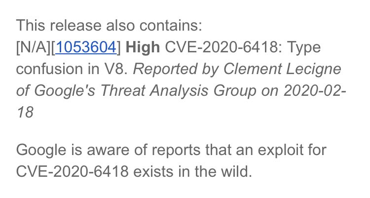

# cyber_advising
**https://twitter.com/cyber_advising/status/1233820146441052160 _at 2020-02-29, 18:23:40_**
<blockquote>
RCE CVE-2020-2551: Weblogic IIOP deserialization 

https://t.co/OHycda1cF8

POC
https://t.co/Sj3h2dEeKS https://t.co/7SpNCS4ksp
</blockquote>

* https://y4er.com/post/weblogic-cve-2020-2551/
* https://github.com/Y4er/CVE-2020-2551/

<table><tr>
<td></td>
</table></tr>
<table><tr>
<td>Quotes: <code>2</code></td>
<td>Replies: <code>1</code></td>
<td>Retweets: <code>107</code></td>
<td>Favorites: <code>202</code></td>
</tr></table>

---

# cyb3rops
**https://twitter.com/cyb3rops/status/1233773409114435584 _at 2020-02-29, 15:17:57_**
<blockquote>
Sigma rules to detect the exploitation of MS Exchange server vulnerability as described in blog post on CVE-2020-0688 by @TrustedSec 

Blog
https://t.co/eU6tzQXyjk

Sigma rules
https://t.co/RoXGG6pCfn

Note: we already have a rule that detects shells spawned by web server procs https://t.co/RkWk3Z1mvT
</blockquote>

* https://www.trustedsec.com/blog/detecting-cve-20200688-remote-code-execution-vulnerability-on-microsoft-exchange-server/
* https://github.com/Neo23x0/sigma/pull/644/files

<table><tr>
<td></td>
<td></td>
<td></td>
</table></tr>
<table><tr>
<td>Quotes: <code>2</code></td>
<td>Replies: <code>3</code></td>
<td>Retweets: <code>109</code></td>
<td>Favorites: <code>226</code></td>
</tr></table>

---

# NVISO_Labs
**https://twitter.com/NVISO_Labs/status/1232997983655993346 _at 2020-02-27, 11:56:41_**
<blockquote>
This morning, PoC code to abuse CVE-2020-0688 (Microsoft Exchange Validation Key Remote Code Execution Vulnerability) was released. In case you haven't done so, it's time to patch, patch, patch! https://t.co/DvqHexydpq

Our sigma rule to detect this: https://t.co/fXalEL0F6Z
</blockquote>

* https://portal.msrc.microsoft.com/en-US/security-guidance/advisory/CVE-2020-0688
* https://github.com/NVISO-BE/sigma-public/blob/web_exchange_cve_2020_0688_exploit/rules/web/web_exchange_cve_2020_0688_exploit.yml

<table><tr>
<td>Quotes: <code>6</code></td>
<td>Replies: <code>2</code></td>
<td>Retweets: <code>132</code></td>
<td>Favorites: <code>212</code></td>
</tr></table>

---

# cyb3rops
**https://twitter.com/cyb3rops/status/1232565995409113088 _at 2020-02-26, 07:20:07_**
<blockquote>
YARA rule to detect Exchange servers vulnerable to CVE-2020-0688

Rule
https://t.co/gxS68ba6qm

Blog post by @thezdi
https://t.co/XoOCm5sAPB https://t.co/wJ78ImUHAR
</blockquote>

* https://github.com/Neo23x0/signature-base/blob/master/yara/vul_cve_2020_0688.yar
* https://www.thezdi.com/blog/2020/2/24/cve-2020-0688-remote-code-execution-on-microsoft-exchange-server-through-fixed-cryptographic-keys

<table><tr>
<td></td>
<td></td>
</table></tr>
<table><tr>
<td>Quotes: <code>3</code></td>
<td>Replies: <code>1</code></td>
<td>Retweets: <code>112</code></td>
<td>Favorites: <code>232</code></td>
</tr></table>

---

# CyberWarship
**https://twitter.com/CyberWarship/status/1232558547344510978 _at 2020-02-26, 06:50:32_**
<blockquote>
CVE-2020-0688: REMOTE CODE EXECUTION ON MICROSOFT EXCHANGE SERVER THROUGH FIXED CRYPTOGRAPHIC KEYS

- RCE with system privileges on all exchange server 😱

#infosec #pentest #redteam  https://t.co/jGdfSOEgcl https://t.co/M3nRxGBfrE
</blockquote>

* https://www.thezdi.com/blog/2020/2/24/cve-2020-0688-remote-code-execution-on-microsoft-exchange-server-through-fixed-cryptographic-keys

<table><tr>
<td></td>
</table></tr>
<table><tr>
<td>Quotes: <code>11</code></td>
<td>Replies: <code>2</code></td>
<td>Retweets: <code>179</code></td>
<td>Favorites: <code>345</code></td>
</tr></table>

---

# GossiTheDog
**https://twitter.com/GossiTheDog/status/1232430811439403014 _at 2020-02-25, 22:22:57_**
<blockquote>
That was quick, since 2 hours ago seeing likely mass scanning for CVE-2020-0688 (Microsoft Exchange 2007+ RCE vulnerability). https://t.co/Kp3zOi5AOA
</blockquote>

<table><tr>
<td></td>
</table></tr>
<table><tr>
<td>Quotes: <code>2</code></td>
<td>Replies: <code>2</code></td>
<td>Retweets: <code>17</code></td>
<td>Favorites: <code>45</code></td>
</tr></table>

---

# thezdi
**https://twitter.com/thezdi/status/1232339144732487680 _at 2020-02-25, 16:18:42_**
<blockquote>
Want to know how to exploit the recently patched #Microsoft #Exchange CVE-2020-0688? @hexkitchen provides the details on how to take advantage of the fixed cryptographic keys used during installation. https://t.co/N7fds4do5s
</blockquote>

* http://bit.ly/2TefZfv

<table><tr>
<td>Quotes: <code>6</code></td>
<td>Replies: <code>6</code></td>
<td>Retweets: <code>145</code></td>
<td>Favorites: <code>220</code></td>
</tr></table>

---

# TheHackersNews
**https://twitter.com/TheHackersNews/status/1232259096780271616 _at 2020-02-25, 11:00:37_**
<blockquote>
🔥 CVE-2020-8794

Yet another critical RCE #vulnerability disclosed in #OpenSMTPD email servers running on #OpenBSD or #Linux systems.

Read: https://t.co/jLAKzj5nj3

The 5-year-old bug could let attackers takeover vulnerable remote servers by sending specially crafted emails. https://t.co/tIiXNOxj0u
</blockquote>

* https://thehackernews.com/2020/02/opensmtpd-email-vulnerability.html

<table><tr>
<td></td>
</table></tr>
<table><tr>
<td>Quotes: <code>9</code></td>
<td>Replies: <code>1</code></td>
<td>Retweets: <code>142</code></td>
<td>Favorites: <code>162</code></td>
</tr></table>

---

# anttitikkanen
**https://twitter.com/anttitikkanen/status/1232070933063577600 _at 2020-02-24, 22:32:55_**
<blockquote>
Latest Chrome update patches CVE-2020-6418, 0day found in the wild by @_clem1 : https://t.co/H2j5PXO8gV https://t.co/K2GoOJCPgf
</blockquote>

* https://chromereleases.googleblog.com/2020/02/stable-channel-update-for-desktop_24.html?m=1

<table><tr>
<td></td>
</table></tr>
<table><tr>
<td>Quotes: <code>5</code></td>
<td>Replies: <code>5</code></td>
<td>Retweets: <code>63</code></td>
<td>Favorites: <code>140</code></td>
</tr></table>

---

# chybeta
**https://twitter.com/chybeta/status/1231558796096372736 _at 2020-02-23, 12:37:52_**
<blockquote>
CVE-2020-1937 Apache Kylin SQL injection vulnerability

https://t.co/ADzyXYjOdo https://t.co/wRQGD5XQvQ
</blockquote>

* https://github.com/apache/kylin/commit/e373c64c96a54a7abfe4bccb82e8feb60db04749?diff=split

<table><tr>
<td></td>
<td></td>
<td></td>
</table></tr>
<table><tr>
<td>Quotes: <code>2</code></td>
<td>Replies: <code>0</code></td>
<td>Retweets: <code>58</code></td>
<td>Favorites: <code>113</code></td>
</tr></table>

---

# mohammadaskar2
**https://twitter.com/mohammadaskar2/status/1230948494912958467 _at 2020-02-21, 20:12:45_**
<blockquote>
Just wrote a new article about how I found a Remote Command Execution 0-day (CVE-2020-8813) via static analysis in Cacti v1.2.8 the popular infrastructure graphing solution.

I also explained how to exploit it without authentication in some cases.

https://t.co/9wO627v3jX
</blockquote>

* https://shells.systems/cacti-v1-2-8-authenticated-remote-code-execution-cve-2020-8813/

<table><tr>
<td>Quotes: <code>4</code></td>
<td>Replies: <code>12</code></td>
<td>Retweets: <code>216</code></td>
<td>Favorites: <code>559</code></td>
</tr></table>

---

# chybeta
**https://twitter.com/chybeta/status/1230489154468732928 _at 2020-02-20, 13:47:30_**
<blockquote>
Apache Tomcat AJP Vulnerability (CNVD-2020-10487/CVE-2020-1938 )  .This vulnerability was discovered by a security researcher of Chaitin Tech . 

You can read any webapps files or include a file to RCE .JUST A POC-GIF with no DETAILS

Tomcat has fix this vulnerability ,UPDATE! https://t.co/Jauc5zPF3a
</blockquote>

<table><tr>
<td></td>
</table></tr>
<table><tr>
<td>Quotes: <code>9</code></td>
<td>Replies: <code>19</code></td>
<td>Retweets: <code>277</code></td>
<td>Favorites: <code>543</code></td>
</tr></table>

---

# _argp
**https://twitter.com/_argp/status/1230018688725716993 _at 2020-02-19, 06:38:02_**
<blockquote>
'The bug was "fixed" by Apple in 2012 as CVE-2012-3727 but fixed the bug in the wrong function (dns4 one) so this is still an 0day at the moment.'

;)

https://t.co/f0eHDQDoDr
</blockquote>

* https://github.com/JakeBlair420/Spice

<table><tr>
<td>Quotes: <code>3</code></td>
<td>Replies: <code>2</code></td>
<td>Retweets: <code>81</code></td>
<td>Favorites: <code>259</code></td>
</tr></table>

---

# campuscodi
**https://twitter.com/campuscodi/status/1229818692789309442 _at 2020-02-18, 17:23:19_**
<blockquote>
PoC published for CVE-2020-0618, which is an RCE in Microsoft's SQL Server Reporting Services (SSRS)

https://t.co/t6bmycdUjX https://t.co/n16cHivDMe
</blockquote>

* https://www.mdsec.co.uk/2020/02/cve-2020-0618-rce-in-sql-server-reporting-services-ssrs/

<table><tr>
<td></td>
</table></tr>
<table><tr>
<td>Quotes: <code>7</code></td>
<td>Replies: <code>4</code></td>
<td>Retweets: <code>141</code></td>
<td>Favorites: <code>292</code></td>
</tr></table>

---

# wugeej
**https://twitter.com/wugeej/status/1229671907219296256 _at 2020-02-18, 07:40:03_**
<blockquote>
[PoC] CVE-2020-0618 Microsoft SQL Server Reporting Services RCE Vulnerability

POST /ReportServer/pages/ReportViewer.aspx HTTP/1.1
Host: target
...
...
NavigationCorrector$PageState=NeedsCorrection&amp;NavigationCorrector$ViewState=[PayloadHere]&amp;__VIEWSTATE=

https://t.co/zDu2m9gJnh https://t.co/FeCBMcnaPv
</blockquote>

* https://github.com/euphrat1ca/CVE-2020-0618

<table><tr>
<td></td>
</table></tr>
<table><tr>
<td>Quotes: <code>7</code></td>
<td>Replies: <code>3</code></td>
<td>Retweets: <code>162</code></td>
<td>Favorites: <code>321</code></td>
</tr></table>

---

# campuscodi
**https://twitter.com/campuscodi/status/1229039979608674304 _at 2020-02-16, 13:49:00_**
<blockquote>
PoC + write-up on CVE-2020-0668, a privilege escalation vulnerability in Windows Service Tracing

Bug was patched this week

https://t.co/nJRsNUBwmP https://t.co/z6y6f3P5PI
</blockquote>

* https://itm4n.github.io/cve-2020-0668-windows-service-tracing-eop/

<table><tr>
<td></td>
</table></tr>
<table><tr>
<td>Quotes: <code>2</code></td>
<td>Replies: <code>0</code></td>
<td>Retweets: <code>66</code></td>
<td>Favorites: <code>150</code></td>
</tr></table>

---

# a13xp0p0v
**https://twitter.com/a13xp0p0v/status/1228684638123626498 _at 2020-02-15, 14:17:00_**
<blockquote>
My write-up covering @offensive_con talk!

CVE-2019-18683: Exploiting a Linux kernel vulnerability in the V4L2 subsystem
https://t.co/rXTaqzoAAZ

@offensive_con slides: https://t.co/oKyNC3dTER

PoC exploit demo video: https://t.co/tIaurXLAOF

Enjoy! https://t.co/W1ZkceXOr4
</blockquote>

* https://a13xp0p0v.github.io/2020/02/15/CVE-2019-18683.html
* https://a13xp0p0v.github.io/img/CVE-2019-18683.pdf
* https://www.youtube.com/watch?v=mb4YHyLy0Zc

<table><tr>
<td></td>
<td></td>
</table></tr>
<table><tr>
<td>Quotes: <code>4</code></td>
<td>Replies: <code>2</code></td>
<td>Retweets: <code>214</code></td>
<td>Favorites: <code>469</code></td>
</tr></table>

---

# itm4n
**https://twitter.com/itm4n/status/1228292422221824003 _at 2020-02-14, 12:18:28_**
<blockquote>
Yet another symlink-based Windows EoP... 🥱

CVE-2020-0668 - A Trivial Privilege Escalation Bug in Windows Service Tracing

This bug probably existed since Windows XP! 🤯

👉 https://t.co/pGzKmx9NHI

More coming soon.🤫 https://t.co/k53AppC1th
</blockquote>

* https://itm4n.github.io/cve-2020-0668-windows-service-tracing-eop/

<table><tr>
<td></td>
</table></tr>
<table><tr>
<td>Quotes: <code>9</code></td>
<td>Replies: <code>10</code></td>
<td>Retweets: <code>335</code></td>
<td>Favorites: <code>654</code></td>
</tr></table>

---

# padovah4ck
**https://twitter.com/padovah4ck/status/1227353369272082434 _at 2020-02-11, 22:07:01_**
<blockquote>
Just published a (really) quick post about CVE-2020-0683
(Windows Installer Elevation of Privilege) #PatchTuesday 

https://t.co/tRC6DnWvxG

PoC -&gt; https://t.co/G0Lyb7OHRw
</blockquote>

* https://padovah4ck.github.io/CVE-2020-0683/
* https://github.com/padovah4ck/CVE-2020-0683

<table><tr>
<td>Quotes: <code>3</code></td>
<td>Replies: <code>10</code></td>
<td>Retweets: <code>206</code></td>
<td>Favorites: <code>374</code></td>
</tr></table>

---

# irsdl
**https://twitter.com/irsdl/status/1227320193745068032 _at 2020-02-11, 19:55:11_**
<blockquote>
CVE-2020-0618: Microsoft SQL Server Reporting Services Remote Code Execution Vulnerability - if you use SSRS patch now not even tomorrow! It is a simple unauth rce!
</blockquote>

<table><tr>
<td>Quotes: <code>3</code></td>
<td>Replies: <code>8</code></td>
<td>Retweets: <code>63</code></td>
<td>Favorites: <code>187</code></td>
</tr></table>

---

# _Icewall
**https://twitter.com/_Icewall/status/1227307797798432775 _at 2020-02-11, 19:05:55_**
<blockquote>
My two freshly patched MS vulns : 
CVE-2020-0759 - Microsoft Office Excel Ordinal43 code execution vulnerability

https://t.co/0XH6Ec5Mlw

CVE-2020-0738 - Microsoft Media Foundation IMFASFSplitter::Initialize Code Execution Vuln.

https://t.co/Vr78b7OyAX
</blockquote>

* https://talosintelligence.com/vulnerability_reports/TALOS-2019-0968
* https://talosintelligence.com/vulnerability_reports/TALOS-2019-0946

<table><tr>
<td>Quotes: <code>0</code></td>
<td>Replies: <code>4</code></td>
<td>Retweets: <code>77</code></td>
<td>Favorites: <code>168</code></td>
</tr></table>

---

# RealTryHackMe
**https://twitter.com/RealTryHackMe/status/1226821142385741829 _at 2020-02-10, 10:52:08_**
<blockquote>
Understand a recent Linux local privilege escalation vulnerability (CVE-2019-14287) and exploit it yourself with your own FREE deployable vulnerable machine!

https://t.co/jacpdF2hyf

#linux #infosecurity #hacking #learn #handson https://t.co/mHct6sSNqX
</blockquote>

* https://tryhackme.com/room/sudovulnsbypass

<table><tr>
<td></td>
</table></tr>
<table><tr>
<td>Quotes: <code>1</code></td>
<td>Replies: <code>0</code></td>
<td>Retweets: <code>19</code></td>
<td>Favorites: <code>44</code></td>
</tr></table>

---

# AEMSecurity
**https://twitter.com/AEMSecurity/status/1226588566844776449 _at 2020-02-09, 19:27:57_**
<blockquote>
[+] #BugbountyTip:  

CVE-2016-0956 - Apache Sling Core Framework Information Disclosure Vulnerability &lt;-- You can still find many vulnerable AEM Instances (free to contact me if you need help understanding this one) 

#Bugbounty #TogetherWeHitHarder #BugBountyTip https://t.co/xmM8vLXCDT
</blockquote>

<table><tr>
<td></td>
</table></tr>
<table><tr>
<td>Quotes: <code>2</code></td>
<td>Replies: <code>9</code></td>
<td>Retweets: <code>62</code></td>
<td>Favorites: <code>218</code></td>
</tr></table>

---

# _odisseus
**https://twitter.com/_odisseus/status/1225322575561216000 _at 2020-02-06, 07:37:22_**
<blockquote>
Cisco Discovery Protocol (CDP) enabled devices are vulnerable to Denial-of-Service (DoS) and Remote Code Execution (RCE) 👏👏👏

CVE-2020-3110
CVE-2020-3111
CVE-2020-3118
CVE-2020-3119
CVE-2020-3120

Note: https://t.co/1PUb2gT1KE

Hacking Video: https://t.co/NMqbjoWU2y https://t.co/vxHxa6jlMH
</blockquote>

* https://kb.cert.org/vuls/id/261385/
* https://www.youtube.com/watch?v=nYtDJlzU-ao&feature=youtu.be

<table><tr>
<td></td>
</table></tr>
<table><tr>
<td>Quotes: <code>2</code></td>
<td>Replies: <code>1</code></td>
<td>Retweets: <code>28</code></td>
<td>Favorites: <code>33</code></td>
</tr></table>

---

# wugeej
**https://twitter.com/wugeej/status/1225293346093977600 _at 2020-02-06, 05:41:13_**
<blockquote>
CVE-2019-1388 Microsoft Windows UAC Privilege Escalation

Exploit Tool : HHUPD.exe (https://t.co/24FhvqEmux)

Ref : https://t.co/p5Aa7vFvn8 https://t.co/cYAyqxSj9k
</blockquote>

* https://github.com/sv3nbeast/CVE-2019-1388
* https://github.com/Lz1y/imggo

<table><tr>
<td></td>
</table></tr>
<table><tr>
<td>Quotes: <code>1</code></td>
<td>Replies: <code>3</code></td>
<td>Retweets: <code>60</code></td>
<td>Favorites: <code>176</code></td>
</tr></table>

---

# _CPResearch_
**https://twitter.com/_CPResearch_/status/1224707178453438466 _at 2020-02-04, 14:51:59_**
<blockquote>
[CPR-Zero] CVE-2019-1234 (Azure Stack): Azure Stack Spoofing Vulnerability
https://t.co/qn5WO4avhG
</blockquote>

* https://cpr-zero.checkpoint.com/vulns/cprid-2140/

<table><tr>
<td>Quotes: <code>3</code></td>
<td>Replies: <code>0</code></td>
<td>Retweets: <code>16</code></td>
<td>Favorites: <code>37</code></td>
</tr></table>

---

# _ringzer0
**https://twitter.com/_ringzer0/status/1224325925606699010 _at 2020-02-03, 13:37:02_**
<blockquote>
Full writeup and exploit of Windows kernel ws2ifsl use-after-free (CVE-2019-1215) via @bluefrostsec and @flxflndy

https://t.co/bC2O3rmNaV https://t.co/XvilzbqrOp
</blockquote>

* https://labs.bluefrostsecurity.de/blog/2020/01/07/cve-2019-1215-analysis-of-a-use-after-free-in-ws2ifsl/

<table><tr>
<td></td>
</table></tr>
<table><tr>
<td>Quotes: <code>1</code></td>
<td>Replies: <code>1</code></td>
<td>Retweets: <code>59</code></td>
<td>Favorites: <code>114</code></td>
</tr></table>

---

# chybeta
**https://twitter.com/chybeta/status/1224313657632292866 _at 2020-02-03, 12:48:17_**
<blockquote>
CVE-2020-7471: SQLI in Django: 
django.contrib.postgres.aggregates.StringAgg aggregation function was subject to SQL injection, using a suitably crafted delimiter.
https://t.co/Uj7mrGQcIJ
FIX: https://t.co/Tla6lZQmgg https://t.co/NljqLmin93
</blockquote>

* https://djangoproject.com/weblog/2020/feb/03/security-releases/
* https://github.com/django/django/commit/eb31d845323618d688ad429479c6dda973056136

<table><tr>
<td></td>
</table></tr>
<table><tr>
<td>Quotes: <code>3</code></td>
<td>Replies: <code>0</code></td>
<td>Retweets: <code>56</code></td>
<td>Favorites: <code>122</code></td>
</tr></table>

---

