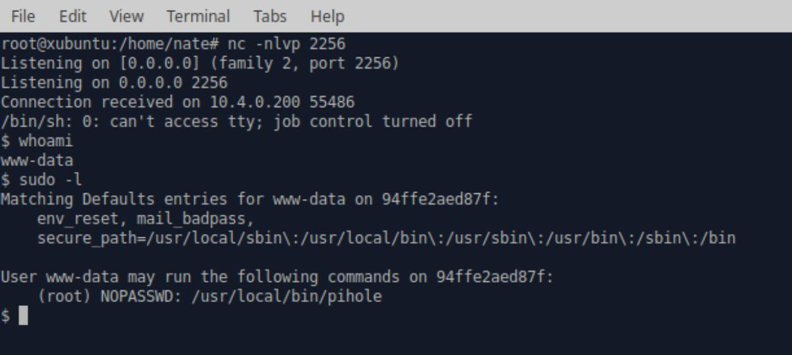

# _r_netsec
**https://twitter.com/_r_netsec/status/1245130787134947328 _at 2020-03-31, 23:28:07_**
<blockquote>
Exploiting SMBGhost (CVE-2020-0796) for a Local Privilege Escalation: Writeup + POC https://t.co/KZ5GGdSP0s
</blockquote>

* https://blog.zecops.com/vulnerabilities/exploiting-smbghost-cve-2020-0796-for-a-local-privilege-escalation-writeup-and-poc/

<table><tr>
<td>Quotes: <code>2</code></td>
<td>Replies: <code>0</code></td>
<td>Retweets: <code>37</code></td>
<td>Favorites: <code>67</code></td>
</tr></table>

---

# ZecOps
**https://twitter.com/ZecOps/status/1245113954906468352 _at 2020-03-31, 22:21:14_**
<blockquote>
Exploiting #SMBGhost (CVE-2020-0796) for a Local Privilege Escalation: Writeup + POC via @ZecOps Research Blog https://t.co/49fTuHwqPC
</blockquote>

* https://blog.zecops.com/vulnerabilities/exploiting-smbghost-cve-2020-0796-for-a-local-privilege-escalation-writeup-and-poc/

<table><tr>
<td>Quotes: <code>4</code></td>
<td>Replies: <code>2</code></td>
<td>Retweets: <code>94</code></td>
<td>Favorites: <code>166</code></td>
</tr></table>

---

# bluefrostsec
**https://twitter.com/bluefrostsec/status/1245050305038954498 _at 2020-03-31, 18:08:19_**
<blockquote>
Want to know how to escape the Chrome sandbox exploiting Android's Binder with CVE-2020-0041? Check out our latest post by @esanfelix and @jgrusko 
https://t.co/RRf0cbyruk
</blockquote>

* https://labs.bluefrostsecurity.de/blog/2020/03/31/cve-2020-0041-part-1-sandbox-escape/

<table><tr>
<td>Quotes: <code>1</code></td>
<td>Replies: <code>0</code></td>
<td>Retweets: <code>108</code></td>
<td>Favorites: <code>176</code></td>
</tr></table>

---

# hjy79425575
**https://twitter.com/hjy79425575/status/1244934280674865152 _at 2020-03-31, 10:27:16_**
<blockquote>
I just read CVE-2020-0796 SMB vulnerability LPE exploit and here is my quick analysis.
https://t.co/xvEip0RYD6 https://t.co/9F3NQNRVXU
</blockquote>

* https://github.com/danigargu/CVE-2020-0796

<table><tr>
<td></td>
<td></td>
</table></tr>
<table><tr>
<td>Quotes: <code>1</code></td>
<td>Replies: <code>1</code></td>
<td>Retweets: <code>84</code></td>
<td>Favorites: <code>206</code></td>
</tr></table>

---

# TheHackersNews
**https://twitter.com/TheHackersNews/status/1244633317304971266 _at 2020-03-30, 14:31:21_**
<blockquote>
PoC exploits have been released for achieving local privilege escalation on #Windows10 leveraging recently discovered wormable SMBv3 RCE flaw.

CVE-2020-0796
#SMBGhost

PoCs:
https://t.co/6UcXlUGZ40
https://t.co/7VjHnuST2S

Patch / News:
https://t.co/LNwM4dSZ0G https://t.co/hz4V8ESPMv
</blockquote>

* https://github.com/danigargu/CVE-2020-0796
* https://github.com/ZecOps/CVE-2020-0796-POC
* https://thehackernews.com/2020/03/patch-wormable-smb-vulnerability.html

<table><tr>
<td></td>
</table></tr>
<table><tr>
<td>Quotes: <code>7</code></td>
<td>Replies: <code>2</code></td>
<td>Retweets: <code>189</code></td>
<td>Favorites: <code>300</code></td>
</tr></table>

---

# _r_netsec
**https://twitter.com/_r_netsec/status/1244617401519329281 _at 2020-03-30, 13:28:07_**
<blockquote>
Released a public exploit (Local Privilege Escalation) for SMBv3 bug (CVE-2020-0796) https://t.co/EiAUS3cqGl
</blockquote>

* https://github.com/danigargu/CVE-2020-0796

<table><tr>
<td>Quotes: <code>2</code></td>
<td>Replies: <code>0</code></td>
<td>Retweets: <code>70</code></td>
<td>Favorites: <code>145</code></td>
</tr></table>

---

# danigargu
**https://twitter.com/danigargu/status/1244608389289848832 _at 2020-03-30, 12:52:18_**
<blockquote>
During this quarantine I've been researching with my colleague Manu (@dialluvioso_) the latest SMBv3 bug (CVE-2020-0796), we've achieved a local privilege escalation.
We're releasing the exploit code at https://t.co/lKsy4dBkpp https://t.co/YJuQk7YiUU
</blockquote>

* https://github.com/danigargu/CVE-2020-0796

<table><tr>
<td></td>
</table></tr>
<table><tr>
<td>Quotes: <code>13</code></td>
<td>Replies: <code>23</code></td>
<td>Retweets: <code>571</code></td>
<td>Favorites: <code>1038</code></td>
</tr></table>

---

# binitamshah
**https://twitter.com/binitamshah/status/1244555520993705985 _at 2020-03-30, 09:22:13_**
<blockquote>
Pi-hole Remote Code Execution – Detailed write-up about the vulnerability and exploitation proof of concept (CVE-2020-8816) : https://t.co/9U4re27S46  cc @Nate_Kappa https://t.co/Xsi6NSIdk8
</blockquote>

* https://natedotred.wordpress.com/2020/03/28/cve-2020-8816-pi-hole-remote-code-execution/

<table><tr>
<td></td>
</table></tr>
<table><tr>
<td>Quotes: <code>3</code></td>
<td>Replies: <code>4</code></td>
<td>Retweets: <code>104</code></td>
<td>Favorites: <code>144</code></td>
</tr></table>

---

# ZecOps
**https://twitter.com/ZecOps/status/1244336079022374912 _at 2020-03-29, 18:50:14_**
<blockquote>
Did you know that #SMBGhost / CVE-2020-0796 can be used for a Local Privilege Escalation?
We'll post the details + POC in the next few days #PatchNow #ComingSoon
and in the meantime: https://t.co/78gmQU78Ae https://t.co/WHDmaXo1Ar
</blockquote>

* https://blog.zecops.com/vulnerabilities/vulnerability-reproduction-cve-2020-0796-poc/

<table><tr>
<td></td>
</table></tr>
<table><tr>
<td>Quotes: <code>7</code></td>
<td>Replies: <code>5</code></td>
<td>Retweets: <code>330</code></td>
<td>Favorites: <code>682</code></td>
</tr></table>

---

# _r_netsec
**https://twitter.com/_r_netsec/status/1243911501955530753 _at 2020-03-28, 14:43:07_**
<blockquote>
CVE-2020-8816 – Pi-hole Remote Code Execution – Detailed write-up about the vulnerability and exploitation proof of concept https://t.co/lk502TmAad
</blockquote>

* https://natedotred.wordpress.com/2020/03/28/cve-2020-8816-pi-hole-remote-code-execution/

<table><tr>
<td>Quotes: <code>7</code></td>
<td>Replies: <code>5</code></td>
<td>Retweets: <code>118</code></td>
<td>Favorites: <code>210</code></td>
</tr></table>

---

# 80vul
**https://twitter.com/80vul/status/1243819653471715330 _at 2020-03-28, 08:38:09_**
<blockquote>
Unauthenticated RCE in Draytek Vigor 2960, 3900 and 300B VigorSwitch (CVE-2020-8515) https://t.co/ewyFai0phZ or https://t.co/dnMwRnh6xi and  attack in the wild report
https://t.co/H408Fku8t0  https://t.co/MbND7hqt6k #ZoomEye Dork https://t.co/a96W50LHPC
</blockquote>

* https://seebug.org/vuldb/ssvid-98146
* https://sku11army.blogspot.com/2020/01/draytek-unauthenticated-rce-in-draytek.html
* https://blog.netlab.360.com/two-zero-days-are-targeting-draytek-broadband-cpe-devices-en/
* https://zoomeye.org/searchResult?q=%22vigor%202960%22%20%20%22vigor%203900%22%20%22vigor%20300B%22%20%22VigorSwitch%22

<table><tr>
<td></td>
<td></td>
</table></tr>
<table><tr>
<td>Quotes: <code>7</code></td>
<td>Replies: <code>2</code></td>
<td>Retweets: <code>49</code></td>
<td>Favorites: <code>89</code></td>
</tr></table>

---

# thezdi
**https://twitter.com/thezdi/status/1243194544017072128 _at 2020-03-26, 15:14:11_**
<blockquote>
The Trend Micro Research Team takes a detailed look at CVE-2020-0729 - an RCE bug in #Windows through LNK files. Read the thorough analysis at https://t.co/y7SPhoPQvM
</blockquote>

* https://bit.ly/3bsf4PZ

<table><tr>
<td>Quotes: <code>5</code></td>
<td>Replies: <code>1</code></td>
<td>Retweets: <code>136</code></td>
<td>Favorites: <code>236</code></td>
</tr></table>

---

# ihack4falafel
**https://twitter.com/ihack4falafel/status/1242835791287590913 _at 2020-03-25, 15:28:38_**
<blockquote>
[Blog] Docker Desktop Local Privilege Escalation (CVE-2020-10665) https://t.co/rJqn6f0b6E cc @decoder_it @FuzzySec @tiraniddo
</blockquote>

* https://tinyurl.com/vdzyr7t

<table><tr>
<td>Quotes: <code>3</code></td>
<td>Replies: <code>3</code></td>
<td>Retweets: <code>94</code></td>
<td>Favorites: <code>147</code></td>
</tr></table>

---

# chybeta
**https://twitter.com/chybeta/status/1242133506974560256 _at 2020-03-23, 16:58:00_**
<blockquote>
CVE-2020-7961 liferay-portal RCE: Unauthenticated Remote code execution via JSONWS (LPS-97029)

https://t.co/IRbIUL52kh https://t.co/Huw3yss38t
</blockquote>

* https://codewhitesec.blogspot.com/2020/03/liferay-portal-json-vulns.html

<table><tr>
<td></td>
</table></tr>
<table><tr>
<td>Quotes: <code>2</code></td>
<td>Replies: <code>3</code></td>
<td>Retweets: <code>89</code></td>
<td>Favorites: <code>184</code></td>
</tr></table>

---

# Securelist
**https://twitter.com/Securelist/status/1241348929150730240 _at 2020-03-21, 13:00:22_**
<blockquote>
The #Windows #0day exploit, CVE-2019-1458 was used in Operation #WizardOpium attack.

Learn more here ⇒ https://t.co/9WwUOSnp1F https://t.co/veveecXPUB
</blockquote>

* http://kas.pr/hs4a

<table><tr>
<td></td>
</table></tr>
<table><tr>
<td>Quotes: <code>1</code></td>
<td>Replies: <code>0</code></td>
<td>Retweets: <code>25</code></td>
<td>Favorites: <code>56</code></td>
</tr></table>

---

# buffaloverflow
**https://twitter.com/buffaloverflow/status/1241072602946383873 _at 2020-03-20, 18:42:21_**
<blockquote>
Had fun today writing a .NET exploit for @itm4n 's CVE-2020-0787 BITS LPE and UsoLoader technique.

Check out his blog posts and research if you haven't already. They are all brilliant 👏🙏

https://t.co/Of7DLLWZMl
https://t.co/PRJOpXMNWV https://t.co/J2GhIT8xy3
</blockquote>

* https://itm4n.github.io/cve-2020-0787-windows-bits-eop/
* https://itm4n.github.io/usodllloader-part2/

<table><tr>
<td></td>
</table></tr>
<table><tr>
<td>Quotes: <code>3</code></td>
<td>Replies: <code>3</code></td>
<td>Retweets: <code>84</code></td>
<td>Favorites: <code>191</code></td>
</tr></table>

---

# TheHackersNews
**https://twitter.com/TheHackersNews/status/1240335971230420992 _at 2020-03-18, 17:55:14_**
<blockquote>
Tor 0.4.3.3-alpha released with security fixes!

CVE-2020-10593
high-severity denial-of-service issue

This flaw could let attackers cause Tor instances to consume a huge amount of CPU, disrupting operations for several minutes.

CVE-2020-10592
remotely triggered memory leak bug https://t.co/4tAA9WD6zL
</blockquote>

<table><tr>
<td></td>
</table></tr>
<table><tr>
<td>Quotes: <code>2</code></td>
<td>Replies: <code>1</code></td>
<td>Retweets: <code>86</code></td>
<td>Favorites: <code>129</code></td>
</tr></table>

---

# blackorbird
**https://twitter.com/blackorbird/status/1238282567675043841 _at 2020-03-13, 01:55:44_**
<blockquote>
#SMBGhost Technical analysis of Microsoft SMBv3 client / server remote code execution vulnerability (CVE-2020-0796)
report:
https://t.co/TQi9siQGhH
translate:
https://t.co/g2eRVSuV74
ref:
https://t.co/hD93owRitk
</blockquote>

* http://blogs.360.cn/post/CVE-2020-0796.html
* https://translate.google.com/translate?hl=&sl=zh-CN&tl=en&u=http%3A%2F%2Fblogs.360.cn%2Fpost%2FCVE-2020-0796.html
* https://docs.microsoft.com/en-us/openspecs/windows_protocols/ms-smb2/1d435f21-9a21-4f4c-828e-624a176cf2a0

<table><tr>
<td>Quotes: <code>2</code></td>
<td>Replies: <code>1</code></td>
<td>Retweets: <code>22</code></td>
<td>Favorites: <code>33</code></td>
</tr></table>

---

# USCERT_gov
**https://twitter.com/USCERT_gov/status/1238165538226012161 _at 2020-03-12, 18:10:42_**
<blockquote>
Microsoft has released patches to address CVE-2020-0796, a RCE vulnerability in SMBv3. Patch ASAP! Read more at https://t.co/QWZlvwvIFf. #Cyber #Cybersecurity #InfoSec
</blockquote>

* https://go.usa.gov/xdF83

<table><tr>
<td>Quotes: <code>9</code></td>
<td>Replies: <code>2</code></td>
<td>Retweets: <code>132</code></td>
<td>Favorites: <code>129</code></td>
</tr></table>

---

# UK_Daniel_Card
**https://twitter.com/UK_Daniel_Card/status/1238152468414029825 _at 2020-03-12, 17:18:46_**
<blockquote>
Microsoft has released an out of band security update for the SMB v3 RCE Vulenrability (CVE-2020-0796): KB4551762 

This vulnerability can be used in a simmilar way to MSBLASTER/WANNACRY so it's really important you update your sys…https://t.co/Y9wlR8PtYm https://t.co/EajF3TeIw9
</blockquote>

* https://lnkd.in/d3s-CEH
* https://lnkd.in/dKKJWWU

<table><tr>
<td>Quotes: <code>3</code></td>
<td>Replies: <code>1</code></td>
<td>Retweets: <code>19</code></td>
<td>Favorites: <code>33</code></td>
</tr></table>

---

# BleepinComputer
**https://twitter.com/BleepinComputer/status/1238128405910097921 _at 2020-03-12, 15:43:09_**
<blockquote>
BREAKING: Microsoft releases the out-of-band KB4551762 Windows 10 security update to patch the CVE-2020-0796 SMBv3 RCE vulnerability
https://t.co/M1A1RKezX4
</blockquote>

* https://www.bleepingcomputer.com/news/security/microsoft-releases-kb4551762-security-update-for-smbv3-vulnerability/

<table><tr>
<td>Quotes: <code>11</code></td>
<td>Replies: <code>3</code></td>
<td>Retweets: <code>127</code></td>
<td>Favorites: <code>163</code></td>
</tr></table>

---

# Synacktiv
**https://twitter.com/Synacktiv/status/1238126780734754816 _at 2020-03-12, 15:36:42_**
<blockquote>
Since MSRC just published a fix for CVE-2020-0796, here's @_lucas_georges_ quick and dirty root cause analysis on it: https://t.co/V2RQReCkrS #sambadijaneiro
</blockquote>

* https://www.synacktiv.com/posts/exploit/im-smbghost-daba-dee-daba-da.html

<table><tr>
<td>Quotes: <code>17</code></td>
<td>Replies: <code>7</code></td>
<td>Retweets: <code>262</code></td>
<td>Favorites: <code>409</code></td>
</tr></table>

---

# UID_
**https://twitter.com/UID_/status/1237459414317137920 _at 2020-03-10, 19:24:49_**
<blockquote>
Seems like Cisco's Talos accidentily published details about CVE-2020-0796. A RCE exploit in SMBv3. This type of exploit is comparable to EternalBlue. The impact of such an exploit is what we experienced during WannaCry and NotPetya. https://t.co/jh7HKRDWDr
</blockquote>

<table><tr>
<td></td>
</table></tr>
<table><tr>
<td>Quotes: <code>4</code></td>
<td>Replies: <code>2</code></td>
<td>Retweets: <code>45</code></td>
<td>Favorites: <code>52</code></td>
</tr></table>

---

# USCERT_gov
**https://twitter.com/USCERT_gov/status/1237441415174553600 _at 2020-03-10, 18:13:18_**
<blockquote>
Unpatched Microsoft Exchange Servers continue to be vulnerable to an #RCE vulnerability (CVE-2020-0688). Don’t let an attacker take control of your server. Patch now! https://t.co/CzH1GKxpRy #Cyber #Cybersecurity #InfoSec @NSAGov
</blockquote>

* https://go.usa.gov/xdHRC

<table><tr>
<td>Quotes: <code>4</code></td>
<td>Replies: <code>1</code></td>
<td>Retweets: <code>108</code></td>
<td>Favorites: <code>94</code></td>
</tr></table>

---

# Easi123
**https://twitter.com/Easi123/status/1237435605975543808 _at 2020-03-10, 17:50:13_**
<blockquote>
CVE-2020-0796 is a remote code execution vulnerability in Microsoft Server Message Block 3.0 (SMBv3).  Users are encouraged to disable SMBv3 compression and block TCP port 445 on firewalls and client computers.
</blockquote>

<table><tr>
<td>Quotes: <code>15</code></td>
<td>Replies: <code>10</code></td>
<td>Retweets: <code>158</code></td>
<td>Favorites: <code>281</code></td>
</tr></table>

---

# dnlongen
**https://twitter.com/dnlongen/status/1237433447309852674 _at 2020-03-10, 17:41:38_**
<blockquote>
Give your Windows sysadmins a virtual hug. Looks like they may be busy for a while... Potentially wormable RCE in SMBv3 CVE-2020-0796 (which incidentally, I cannot find any MSFT disclosure for yet). Let's see what WannaCry and NotPetya taught us... https://t.co/gqhJx5h2zV https://t.co/cGlCH6QVN7
</blockquote>

* https://blog.talosintelligence.com/2020/03/microsoft-patch-tuesday-march-2020.html

<table><tr>
<td></td>
</table></tr>
<table><tr>
<td>Quotes: <code>12</code></td>
<td>Replies: <code>7</code></td>
<td>Retweets: <code>129</code></td>
<td>Favorites: <code>170</code></td>
</tr></table>

---

# sysgoblin
**https://twitter.com/sysgoblin/status/1237054973579583489 _at 2020-03-09, 16:37:43_**
<blockquote>
⚠ Active exploitation of CVE-2020-10189 being seen from  66.42.98.220:12345

RCE drops .bat and .dll to spin up malicious service. DLL to watch out for: storesyncsvc.dll

If anyone obtains a copy of the .dll please hit me up.

cc @malwrhunterteam
</blockquote>

<table><tr>
<td>Quotes: <code>9</code></td>
<td>Replies: <code>9</code></td>
<td>Retweets: <code>123</code></td>
<td>Favorites: <code>233</code></td>
</tr></table>

---

# wugeej
**https://twitter.com/wugeej/status/1236908027053137920 _at 2020-03-09, 06:53:48_**
<blockquote>
CVE-2020-2555: Weblogic com.tangosol.util.extractor.ReflectionExtractor RCE

[PoC] https://t.co/7eGOXsXyYY

[Demo Video] Demonstrating CVE-2020-2555: Remote Code Execution in Oracle's WebLogic Server https://t.co/uJ6gQuHpUX
</blockquote>

* https://github.com/wsfengfan/CVE-2020-2555

<table><tr>
<td></td>
</table></tr>
<table><tr>
<td>Quotes: <code>1</code></td>
<td>Replies: <code>0</code></td>
<td>Retweets: <code>17</code></td>
<td>Favorites: <code>36</code></td>
</tr></table>

---

# NSAGov
**https://twitter.com/NSAGov/status/1236099750610563074 _at 2020-03-07, 01:22:00_**
<blockquote>
A remote code execution #vulnerability (CVE-2020-0688) exists in Microsoft Exchange Server. If unpatched, an attacker with email credentials can execute commands on your server. 

Mitigation Guidance available at: https://t.co/MMlBo8BsB0
</blockquote>

* https://portal.msrc.microsoft.com/en-US/security-guidance/advisory/CVE-2020-0688

<table><tr>
<td>Quotes: <code>43</code></td>
<td>Replies: <code>37</code></td>
<td>Retweets: <code>357</code></td>
<td>Favorites: <code>511</code></td>
</tr></table>

---

# chybeta
**https://twitter.com/chybeta/status/1235926542397521927 _at 2020-03-06, 13:53:44_**
<blockquote>
CVE-2020-5405: Directory Traversal with spring-cloud-config-server.  A malicious user, or attacker, can send a request using a specially crafted URL that can lead a directory traversal attack.

Advisory: https://t.co/kmDGjaDkD9 https://t.co/gVauD9p6em
</blockquote>

* https://pivotal.io/security/cve-2020-5405

<table><tr>
<td></td>
</table></tr>
<table><tr>
<td>Quotes: <code>2</code></td>
<td>Replies: <code>0</code></td>
<td>Retweets: <code>37</code></td>
<td>Favorites: <code>120</code></td>
</tr></table>

---

# james0x40
**https://twitter.com/james0x40/status/1234478389651759104 _at 2020-03-02, 13:59:18_**
<blockquote>
My cve-2020-6418 #Chrome remote code execution #exploit demo video. #0day #development https://t.co/OhSVfXkVXo
</blockquote>

<table><tr>
<td></td>
</table></tr>
<table><tr>
<td>Quotes: <code>6</code></td>
<td>Replies: <code>15</code></td>
<td>Retweets: <code>242</code></td>
<td>Favorites: <code>694</code></td>
</tr></table>

---

