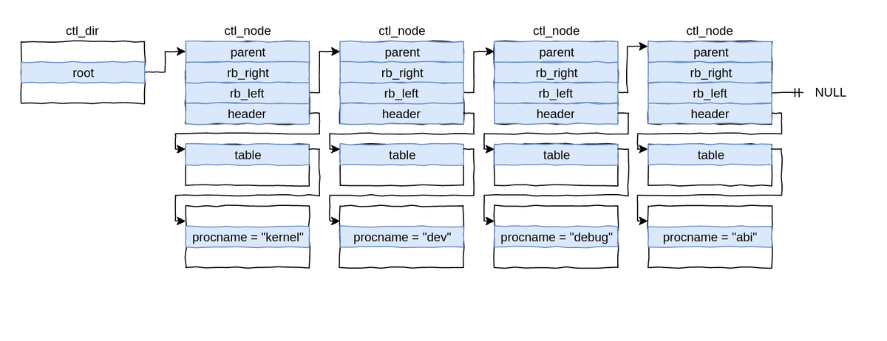
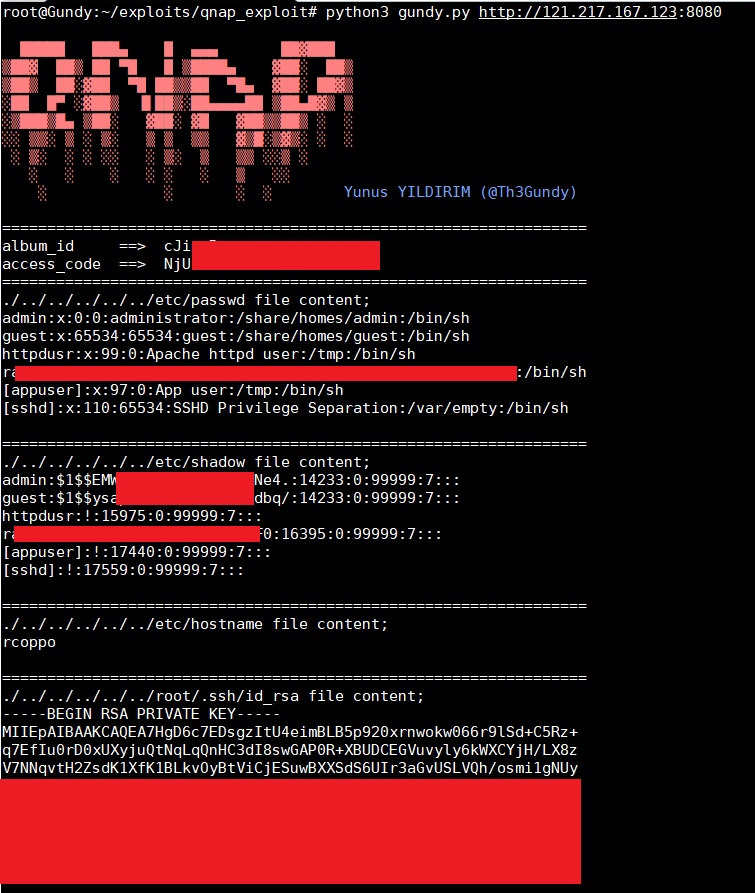
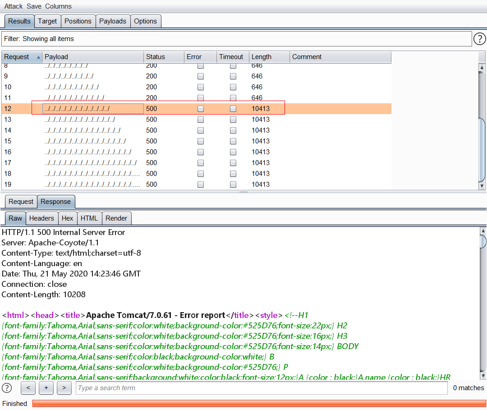
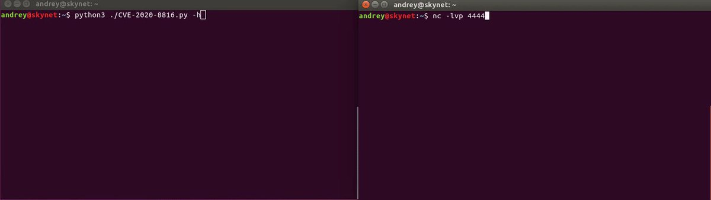
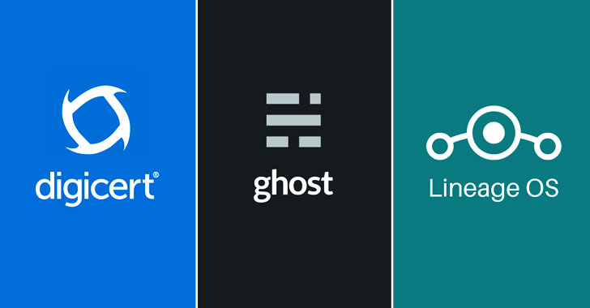

# _ringzer0
**https://twitter.com/_ringzer0/status/1266347819482390530 _at 2020-05-29, 12:37:02_**
<blockquote>
Discover how @bluefrostsec exploits #Android Binder to escape the Google #Chrome sandbox, attack the kernel, and obtain root privileges on a Pixel 3 device using CVE-2020-0041. https://t.co/9xtJJFBC3d

Detailed writeup by @esanfelix and @jgrusko with video demo and POC on Github! https://t.co/KwUnhUmy9k
</blockquote>

* https://bit.ly/CVE-2020-0041

<table><tr>
<td></td>
</table></tr>
<table><tr>
<td>Quotes: <code>0</code></td>
<td>Replies: <code>0</code></td>
<td>Retweets: <code>20</code></td>
<td>Favorites: <code>56</code></td>
</tr></table>

---

# theevilbit
**https://twitter.com/theevilbit/status/1266246713150328832 _at 2020-05-29, 05:55:16_**
<blockquote>
The 3rd part of my XPC series is up. This time I cover the Microsoft Auto Update LPE vulnerability (CVE-2020-0984) I found last year and was fixed recently. Great example for why proper client verification is extremely important.
https://t.co/6HZKbarrra
</blockquote>

* https://theevilbit.github.io/posts/secure_coding_privilegedhelpertools_part3/

<table><tr>
<td>Quotes: <code>1</code></td>
<td>Replies: <code>0</code></td>
<td>Retweets: <code>41</code></td>
<td>Favorites: <code>82</code></td>
</tr></table>

---

# USCERT_gov
**https://twitter.com/USCERT_gov/status/1266101773435129856 _at 2020-05-28, 20:19:20_**
<blockquote>
.@NSAGov has released a cybersecurity advisory on Russian Sandworm APT actors exploiting CVE-2019-10149, a remote code execution vulnerability in Exim. Read more at https://t.co/d77VHReUx7. #Cyber #Cybersecurity #InfoSec
</blockquote>

* https://go.usa.gov/xwgXH

<table><tr>
<td>Quotes: <code>4</code></td>
<td>Replies: <code>3</code></td>
<td>Retweets: <code>119</code></td>
<td>Favorites: <code>161</code></td>
</tr></table>

---

# campuscodi
**https://twitter.com/campuscodi/status/1265991271182741505 _at 2020-05-28, 13:00:14_**
<blockquote>
Kaspersky publishes a report on CVE-2019-13720, the Chrome zero-day that was unearthed/patched in October 2019.

Per Kaspersky, the zero-day was used by Operation WizardOpium APT in a classic watering-hole attack on a North Korea-related news site

https://t.co/pItDW2Fh0j
</blockquote>

* https://securelist.com/the-zero-day-exploits-of-operation-wizardopium/97086/

<table><tr>
<td>Quotes: <code>1</code></td>
<td>Replies: <code>1</code></td>
<td>Retweets: <code>23</code></td>
<td>Favorites: <code>45</code></td>
</tr></table>

---

# _CPResearch_
**https://twitter.com/_CPResearch_/status/1265244274322558976 _at 2020-05-26, 11:31:56_**
<blockquote>
[CPR-Zero] CVE-2020-0655 (Windows): Improper fix for CVE-2019-0887 uncovers Path Traversal issues in all versions of Windows
https://t.co/ioJrKiY8Q1
</blockquote>

* https://cpr-zero.checkpoint.com/vulns/cprid-2136/

<table><tr>
<td>Quotes: <code>1</code></td>
<td>Replies: <code>1</code></td>
<td>Retweets: <code>49</code></td>
<td>Favorites: <code>86</code></td>
</tr></table>

---

# piedpiper1616
**https://twitter.com/piedpiper1616/status/1265082511245230080 _at 2020-05-26, 00:49:09_**
<blockquote>
GitHub - amartinsec/CVE-2020-12800: POC Script for CVE-2020-12800: RCE through Unrestricted File Type Upload - https://t.co/6RIG8P48i3
</blockquote>

* https://github.com/amartinsec/CVE-2020-12800/

<table><tr>
<td>Quotes: <code>1</code></td>
<td>Replies: <code>0</code></td>
<td>Retweets: <code>13</code></td>
<td>Favorites: <code>43</code></td>
</tr></table>

---

# Th3Gundy
**https://twitter.com/Th3Gundy/status/1264596414002270208 _at 2020-05-24, 16:37:34_**
<blockquote>
QNAP pre-auth root RCE Exploit (CVE-2019-7192 - CVE-2019-7195)  
https://t.co/lhmRDoa5M4

#QNAP #vulnerability #Exploit #BugBounty https://t.co/YtC1RL1W2x
</blockquote>

* https://github.com/th3gundy/CVE-2019-7192_QNAP_Exploit

<table><tr>
<td></td>
</table></tr>
<table><tr>
<td>Quotes: <code>4</code></td>
<td>Replies: <code>2</code></td>
<td>Retweets: <code>100</code></td>
<td>Favorites: <code>203</code></td>
</tr></table>

---

# cyber_advising
**https://twitter.com/cyber_advising/status/1263747598550212613 _at 2020-05-22, 08:24:41_**
<blockquote>
CVE-2020-9484: Apache Tomcat versions 10.0.0-M1 to 10.0.0-M4, 9.0.0.M1 to 9.0.34, 8.5.0 to 8.5.54 and 7.0.0 to 7.0.103 if a) an attacker is able to control the contents and name of a file on the server;

POC
https://t.co/mdVDnRcLTu https://t.co/hWefWUYbrL
</blockquote>

* https://github.com/IdealDreamLast/CVE-2020-9484/

<table><tr>
<td></td>
</table></tr>
<table><tr>
<td>Quotes: <code>2</code></td>
<td>Replies: <code>0</code></td>
<td>Retweets: <code>73</code></td>
<td>Favorites: <code>148</code></td>
</tr></table>

---

# wugeej
**https://twitter.com/wugeej/status/1263731877606682624 _at 2020-05-22, 07:22:13_**
<blockquote>
CVE-2020-9484: Apache Tomcat Remote Code Execution Vulnerability

[Exploit Condition]

1. Server is configured to use the PersistenceManager with a FileStore
2. The PersistenceManager is configured with sessionAttributeValueClassNameFilter="null"

https://t.co/UbHWoqN2s4
</blockquote>

* https://meterpreter.org/cve-2020-9484-apache-tomcat-remote-code-execution-vulnerability-alert/

<table><tr>
<td>Quotes: <code>1</code></td>
<td>Replies: <code>1</code></td>
<td>Retweets: <code>43</code></td>
<td>Favorites: <code>95</code></td>
</tr></table>

---

# thezdi
**https://twitter.com/thezdi/status/1263515835144048640 _at 2020-05-21, 17:03:44_**
<blockquote>
In his first blog for us, @_wmliang_ covers CVE-2020-8871 - a privilege escalation bug in #Parallels Desktop originally submitted by @renorobertr. Read the bug details and patch analysis at https://t.co/oNkaYN1ELI
</blockquote>

* https://bit.ly/2yjHQEy

<table><tr>
<td>Quotes: <code>2</code></td>
<td>Replies: <code>1</code></td>
<td>Retweets: <code>40</code></td>
<td>Favorites: <code>93</code></td>
</tr></table>

---

# AntoineGoichot
**https://twitter.com/AntoineGoichot/status/1262829570836836354 _at 2020-05-19, 19:36:46_**
<blockquote>
I have released my exploit for CVE-2020-3153 - Cisco AnyConnect privilege escalation through path traversal https://t.co/1xSxJUjhuJ

My notes on this vuln: https://t.co/reO88J9Bny

Kudos to @yorickkoster for the advisory &amp; for the -ipc help!
Thank you @maxime_tz for the diagrams!
</blockquote>

* https://github.com/goichot/CVE-2020-3153
* https://github.com/goichot/CVE-2020-3153/blob/master/details.md

<table><tr>
<td>Quotes: <code>7</code></td>
<td>Replies: <code>2</code></td>
<td>Retweets: <code>117</code></td>
<td>Favorites: <code>225</code></td>
</tr></table>

---

# netbiosX
**https://twitter.com/netbiosX/status/1261310127090675713 _at 2020-05-15, 14:59:02_**
<blockquote>
PrintDemon - A PowerShell Empire launcher PoC using PrintDemon and Faxhell. The module has the Faxhell dll already embedded which leverages CVE-2020-1048 for privilege escalation. https://t.co/Bt695rvJA3
</blockquote>

* https://github.com/BC-SECURITY/Invoke-PrintDemon

<table><tr>
<td>Quotes: <code>2</code></td>
<td>Replies: <code>1</code></td>
<td>Retweets: <code>46</code></td>
<td>Favorites: <code>110</code></td>
</tr></table>

---

# EyalItkin
**https://twitter.com/EyalItkin/status/1260875003177861120 _at 2020-05-14, 10:10:01_**
<blockquote>
CVE-2019-0887: Path-Traversal -&gt; RCE in mstsc.exe. Patched with PathCchCanonicalize.

CVE-2020-0655: We replaced '\' with '/', that's it. Patched with a workaround.

As Microsoft didn't patch PathCanonicalize, you need to manually fix your own programs!
https://t.co/kmpK9Ihi3Z
</blockquote>

* https://research.checkpoint.com/2020/reverse-rdp-the-path-not-taken/

<table><tr>
<td>Quotes: <code>5</code></td>
<td>Replies: <code>1</code></td>
<td>Retweets: <code>77</code></td>
<td>Favorites: <code>167</code></td>
</tr></table>

---

# _CPResearch_
**https://twitter.com/_CPResearch_/status/1260861318082564099 _at 2020-05-14, 09:15:38_**
<blockquote>
[CPR-Zero] CVE-2020-1143 (Windows 10 Kernel): Use-After-Free in the NtUserGetDCEx function in win32kfull.sys
https://t.co/GkRF3Nk3wN
</blockquote>

* https://cpr-zero.checkpoint.com/vulns/cprid-2152/

<table><tr>
<td>Quotes: <code>1</code></td>
<td>Replies: <code>0</code></td>
<td>Retweets: <code>22</code></td>
<td>Favorites: <code>55</code></td>
</tr></table>

---

# gweeperx
**https://twitter.com/gweeperx/status/1260511047808671745 _at 2020-05-13, 10:03:47_**
<blockquote>
Exploit code and Write-up for Symantec Endpoint Protection (SEP) 14.2 RU2 Elevation of Privileges (CVE-2020-5837) 

https://t.co/Y3AFuqXl1E

#Symantec #0day #exploit #vulnerability #EoP #RedyOpsLabs #cybersecurity #infosec #bugbounty #redteam #SEP #SEPM
</blockquote>

* https://labs.redyops.com/index.php/2020/04/27/symantec-endpoint-protection-sep-14-2-eop-via-arbitrary-write/

<table><tr>
<td>Quotes: <code>6</code></td>
<td>Replies: <code>3</code></td>
<td>Retweets: <code>192</code></td>
<td>Favorites: <code>387</code></td>
</tr></table>

---

# aionescu
**https://twitter.com/aionescu/status/1260466215299973121 _at 2020-05-13, 07:05:38_**
<blockquote>
Attackers can exploit CVE-2020-1048 with a single PowerShell command:

Add-PrinterPort -Name c:\windows\system32\ualapi.dll

On an unpatched system, this will install a persistent backdoor, that won't go away *even after you patch*.

See https://t.co/9yMSWNM8VG for more details.
</blockquote>

* https://windows-internals.com/printdemon-cve-2020-1048/

<table><tr>
<td>Quotes: <code>55</code></td>
<td>Replies: <code>32</code></td>
<td>Retweets: <code>1235</code></td>
<td>Favorites: <code>2273</code></td>
</tr></table>

---

# wugeej
**https://twitter.com/wugeej/status/1259674133249458176 _at 2020-05-11, 02:38:11_**
<blockquote>
[PoC] A Python script to exploit CVE-2020-8816, a remote code execution vulnerability on the Pi-hole

The exploit requires the path for the www-data user to be /opt/pihole:/usr/local/sbin:/usr/local/bin:/usr/sbin:/usr/bin:/sbin:/bin.

https://t.co/tBbL7yFbmb https://t.co/vk5vCBgBZS
</blockquote>

* https://github.com/AndreyRainchik/CVE-2020-8816

<table><tr>
<td></td>
</table></tr>
<table><tr>
<td>Quotes: <code>1</code></td>
<td>Replies: <code>0</code></td>
<td>Retweets: <code>19</code></td>
<td>Favorites: <code>34</code></td>
</tr></table>

---

# maxpl0it
**https://twitter.com/maxpl0it/status/1258517934718062594 _at 2020-05-07, 22:03:52_**
<blockquote>
Here's my exploit for CVE-2020-0674 (Internet Explorer UAF)

Bonus: EMET 5.52 (the final EMET version) doesn't appear to detect this (on Windows x64 it seems)

https://t.co/IxCfpjGBqv
</blockquote>

* https://github.com/maxpl0it/CVE-2020-0674-Exploit

<table><tr>
<td>Quotes: <code>9</code></td>
<td>Replies: <code>5</code></td>
<td>Retweets: <code>203</code></td>
<td>Favorites: <code>475</code></td>
</tr></table>

---

# TheHackersNews
**https://twitter.com/TheHackersNews/status/1257250156652584962 _at 2020-05-04, 10:06:10_**
<blockquote>
WARNING — Just within a day after public disclosure of SaltStack RCE #vulnerability (CVE-2020-11651), hackers have started exploiting unpatched servers.

✅ LineageOS [hacked]
✅ Ghost CMS [hacked]
✅ DigiCert [hacked]

Read more: https://t.co/SY54kVTMsK

#infosec
#cybersecurity https://t.co/x9238WFWvS
</blockquote>

* https://thehackernews.com/2020/05/saltstack-rce-exploit.html

<table><tr>
<td></td>
</table></tr>
<table><tr>
<td>Quotes: <code>25</code></td>
<td>Replies: <code>3</code></td>
<td>Retweets: <code>230</code></td>
<td>Favorites: <code>296</code></td>
</tr></table>

---

# 44CON
**https://twitter.com/44CON/status/1257198909127942149 _at 2020-05-04, 06:42:32_**
<blockquote>
(From https://t.co/OT552U6KvT): Released a public exploit (Local Privilege Escalation) for SMBv3 bug (CVE-2020-0796) https://t.co/r84NvKVrdc
</blockquote>

* http://github.com
* http://dlvr.it/RVyNv2

<table><tr>
<td>Quotes: <code>1</code></td>
<td>Replies: <code>0</code></td>
<td>Retweets: <code>47</code></td>
<td>Favorites: <code>103</code></td>
</tr></table>

---

# campuscodi
**https://twitter.com/campuscodi/status/1256190520696725507 _at 2020-05-01, 11:55:33_**
<blockquote>
Oracle has published a security alert last night warning of attacks against a recently patched WebLogic security bug

- The bug is CVE-2020-2883, a no-auth RCE in WebLogic
- CVSSv3 of 9.8/10
- Bug is patched, but PoC code has been published online

https://t.co/AdyCFcstDx https://t.co/OsOmTh3RoK
</blockquote>

* https://www.zdnet.com/article/oracle-warns-of-attacks-against-recently-patched-weblogic-security-bug/

<table><tr>
<td></td>
</table></tr>
<table><tr>
<td>Quotes: <code>4</code></td>
<td>Replies: <code>2</code></td>
<td>Retweets: <code>56</code></td>
<td>Favorites: <code>57</code></td>
</tr></table>

---

