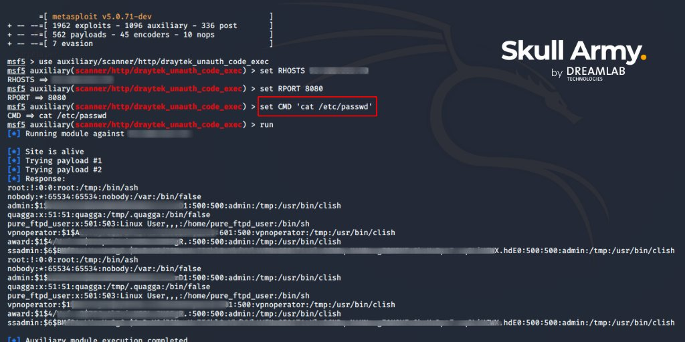
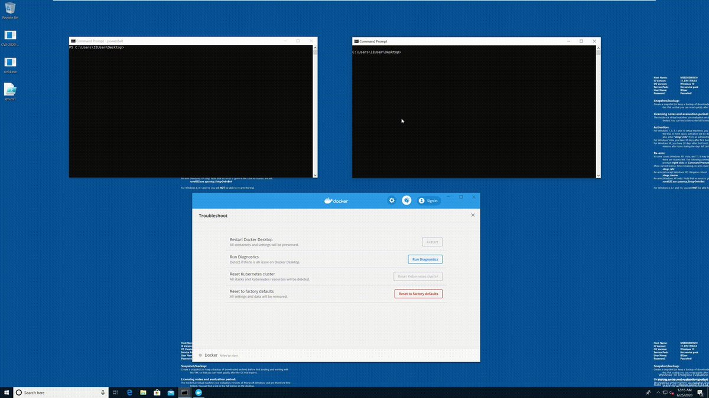
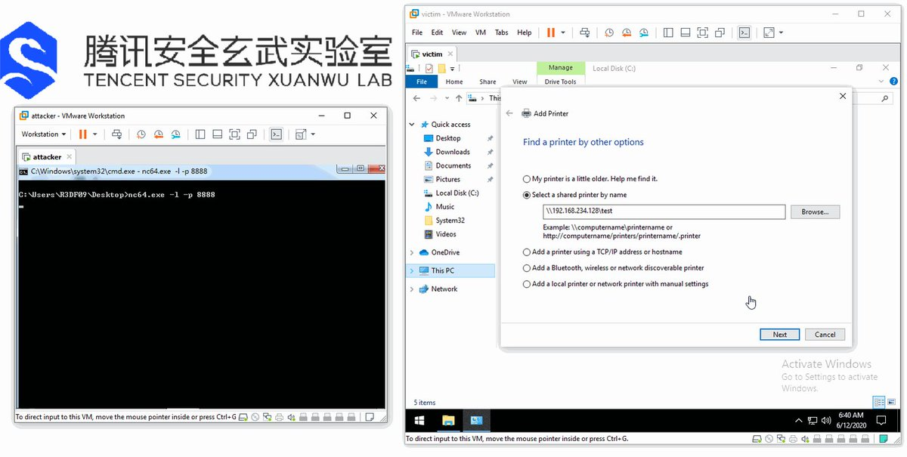
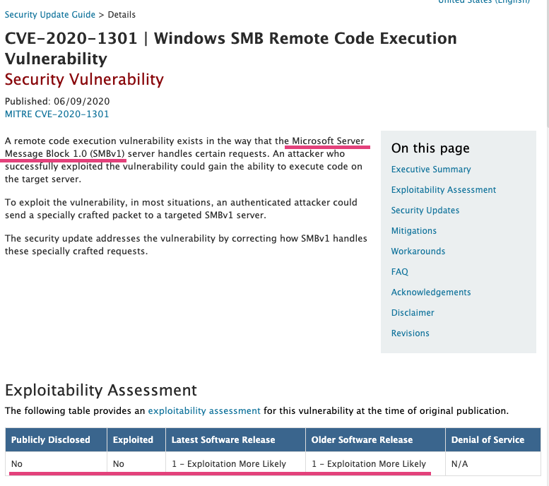
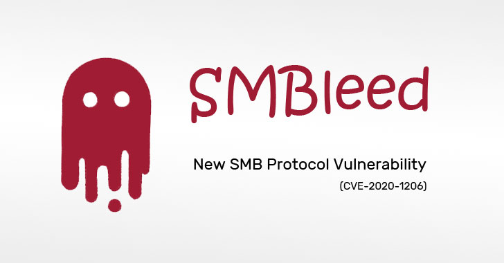
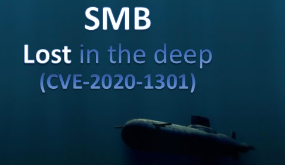
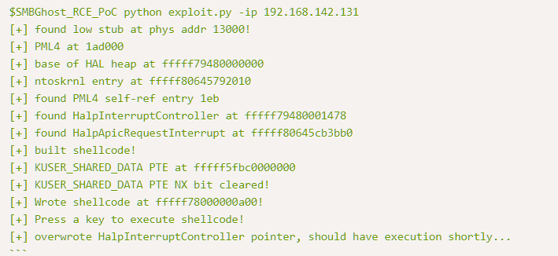

# pwn_expoit
**https://twitter.com/pwn_expoit/status/1277861624963952641 _at 2020-06-30, 07:08:47_**
<blockquote>
i forgot about my bug :D i reported android sbx in April. i will soon post writeup about Exploitation using it. https://t.co/YH4STKbHQw
[$20000][1073015] High CVE-2020-6465: Use after free in reader mode. Reported by Woojin Oh(@pwn_expoit) of STEALIEN on 2020-04-21
</blockquote>

* https://chromereleases.googleblog.com/2020/05/stable-channel-update-for-desktop_19.html

<table><tr>
<td>Quotes: <code>0</code></td>
<td>Replies: <code>3</code></td>
<td>Retweets: <code>16</code></td>
<td>Favorites: <code>124</code></td>
</tr></table>

---

# DreamlabGlobal
**https://twitter.com/DreamlabGlobal/status/1277593377962446850 _at 2020-06-29, 13:22:52_**
<blockquote>
#Metasploit module for CVE-2020-8515 (UNAUTHENTICATED RCE IN #DRAYTEK VIGOR 2960, 3900 &amp; 300) developed by our @skull_army 👉 https://t.co/4EWbHKxNSF https://t.co/ixbGj66Mo0
</blockquote>

* http://ow.ly/7HJl50AkykS

<table><tr>
<td></td>
</table></tr>
<table><tr>
<td>Quotes: <code>1</code></td>
<td>Replies: <code>0</code></td>
<td>Retweets: <code>17</code></td>
<td>Favorites: <code>37</code></td>
</tr></table>

---

# ptracesecurity
**https://twitter.com/ptracesecurity/status/1276927201645125639 _at 2020-06-27, 17:15:43_**
<blockquote>
CVE-2020-10665 Docker Desktop Local Privilege Escalation  https://t.co/x2tFjum5dB  #Pentesting #Windows #ReverseShell #CyberSecurity #Infosec https://t.co/xRGneYxkC2
</blockquote>

* https://github.com/spaceraccoon/CVE-2020-10665

<table><tr>
<td></td>
</table></tr>
<table><tr>
<td>Quotes: <code>1</code></td>
<td>Replies: <code>0</code></td>
<td>Retweets: <code>25</code></td>
<td>Favorites: <code>33</code></td>
</tr></table>

---

# i_bo0om
**https://twitter.com/i_bo0om/status/1276503780687777792 _at 2020-06-26, 13:13:12_**
<blockquote>
Apache Tomcat RCE by deserialization (CVE-2020-9484) 

https://t.co/jvURLAvdVQ
</blockquote>

* https://www.redtimmy.com/java-hacking/apache-tomcat-rce-by-deserialization-cve-2020-9484-write-up-and-exploit/

<table><tr>
<td>Quotes: <code>1</code></td>
<td>Replies: <code>1</code></td>
<td>Retweets: <code>43</code></td>
<td>Favorites: <code>100</code></td>
</tr></table>

---

# movaxbx2
**https://twitter.com/movaxbx2/status/1276461577395335170 _at 2020-06-26, 10:25:30_**
<blockquote>
Microsoft Windows LNK Remote Code Execution Vulnerability – CVE-2020-1299 https://t.co/QQ6OtWE04U
</blockquote>

* https://movaxbx.ru/2020/06/26/microsoft-windows-lnk-remote-code-execution-vulnerability-cve-2020-1299/

<table><tr>
<td>Quotes: <code>7</code></td>
<td>Replies: <code>8</code></td>
<td>Retweets: <code>237</code></td>
<td>Favorites: <code>413</code></td>
</tr></table>

---

# spaceraccoonsec
**https://twitter.com/spaceraccoonsec/status/1276123691156254720 _at 2020-06-25, 12:02:51_**
<blockquote>
Wrote the first public exploit of CVE-2020-10665 Docker Desktop Local Privilege Escalation! It was challenging picking up C++ as well as multiple exploit stages (hard link spraying, DLL overwrite, printer API call) but learned a lot :) https://t.co/zMcO3keyfc https://t.co/nqSUTbQT5k
</blockquote>

* https://github.com/spaceraccoon/CVE-2020-10665

<table><tr>
<td></td>
</table></tr>
<table><tr>
<td>Quotes: <code>1</code></td>
<td>Replies: <code>7</code></td>
<td>Retweets: <code>167</code></td>
<td>Favorites: <code>560</code></td>
</tr></table>

---

# EyalItkin
**https://twitter.com/EyalItkin/status/1275835583198347265 _at 2020-06-24, 16:58:01_**
<blockquote>
In his latest blog, @oct0xor confirms our attribution of Magniber's LPE exploit (probably CVE-2018-8641) to Volodya.

This is just 1 of 11(!) LPE exploits by this actor that we've analyzed. More details in the upcoming VB2020 talk by @megabeets_ and I.

https://t.co/Cs8o0WDn9J
</blockquote>

* https://securelist.com/magnitude-exploit-kit-evolution/97436/

<table><tr>
<td>Quotes: <code>0</code></td>
<td>Replies: <code>0</code></td>
<td>Retweets: <code>6</code></td>
<td>Favorites: <code>31</code></td>
</tr></table>

---

# CyberWarship
**https://twitter.com/CyberWarship/status/1274235147861331968 _at 2020-06-20, 06:58:28_**
<blockquote>
A Click from the Backyard | Analysis of CVE-2020-9332, a Vulnerable USB Redirection Software -&gt; UAC Bypass 😎

- great research by @SentinelOne thanks for sharing 

Post &amp; PoC
https://t.co/9YURglq5ae

#infosec #pentest #exploitDev
</blockquote>

* https://labs.sentinelone.com/click-from-the-backyard-cve-2020-9332/

<table><tr>
<td>Quotes: <code>1</code></td>
<td>Replies: <code>0</code></td>
<td>Retweets: <code>28</code></td>
<td>Favorites: <code>38</code></td>
</tr></table>

---

# Dinosn
**https://twitter.com/Dinosn/status/1273541000120631297 _at 2020-06-18, 09:00:10_**
<blockquote>
CVE-2020-1181: SharePoint Remote Code Execution Through Web Parts - includes step-by-step Proof of Concept
https://t.co/1ydBxQN93W
</blockquote>

* https://www.zerodayinitiative.com/blog/2020/6/16/cve-2020-1181-sharepoint-remote-code-execution-through-web-parts

<table><tr>
<td>Quotes: <code>1</code></td>
<td>Replies: <code>0</code></td>
<td>Retweets: <code>27</code></td>
<td>Favorites: <code>57</code></td>
</tr></table>

---

# K3vinLuSec
**https://twitter.com/K3vinLuSec/status/1273413397371969536 _at 2020-06-18, 00:33:07_**
<blockquote>
Pwn BlueFrag: CVE-2020-0022 RCE Exploit For Android 8.0-9.0, many thanks to https://t.co/oqKLq9X265. Debugging all details step by step with GDB is so much fun.
</blockquote>

* https://insinuator.net/2020/04/cve-2020-0022-an-android-8-0-9-0-bluetooth-zero-click-rce-bluefrag/

<table><tr>
<td>Quotes: <code>3</code></td>
<td>Replies: <code>1</code></td>
<td>Retweets: <code>122</code></td>
<td>Favorites: <code>268</code></td>
</tr></table>

---

# thezdi
**https://twitter.com/thezdi/status/1273275586216157185 _at 2020-06-17, 15:25:30_**
<blockquote>
A deep look at CVE-2020-1181: RCE in #SharePoint through Web Parts. An anonymous researcher sent this to us and #Microsoft patched it last week. Includes step-by-step PoC. https://t.co/YmVUFmMG1y
</blockquote>

* https://bit.ly/37CAHwp

<table><tr>
<td>Quotes: <code>6</code></td>
<td>Replies: <code>4</code></td>
<td>Retweets: <code>105</code></td>
<td>Favorites: <code>227</code></td>
</tr></table>

---

# gweeperx
**https://twitter.com/gweeperx/status/1273187803707432961 _at 2020-06-17, 09:36:41_**
<blockquote>
Exploit code and write-up for Windows Denial of Service Vulnerability (CVE-2020-1283)

Don't ask me about MS' description :-)

https://t.co/yw7ctlAGVy
-------
#bug #Microsoft #Windows #0day #exploit #vulnerability #DOS #BSoD #RedyOpsLabs #redteam #pentest #infosec #CVE #bugbounty
</blockquote>

* https://labs.redyops.com/index.php/2020/04/27/dos-via-arbitrary-folder-creation/

<table><tr>
<td>Quotes: <code>2</code></td>
<td>Replies: <code>1</code></td>
<td>Retweets: <code>24</code></td>
<td>Favorites: <code>37</code></td>
</tr></table>

---

# pozdnychev
**https://twitter.com/pozdnychev/status/1272980153518432259 _at 2020-06-16, 19:51:34_**
<blockquote>
Qualys Security Advisory: Release of the exploit for CVE-2005-1513 (qmail LPE and RCE).  https://t.co/ABUa9t2AJ9
</blockquote>

* https://www.qualys.com/2020/05/19/cve-2005-1513/remote-code-execution-qmail.tar.gz

<table><tr>
<td>Quotes: <code>1</code></td>
<td>Replies: <code>0</code></td>
<td>Retweets: <code>26</code></td>
<td>Favorites: <code>35</code></td>
</tr></table>

---

# TheHackersNews
**https://twitter.com/TheHackersNews/status/1272955972651114497 _at 2020-06-16, 18:15:28_**
<blockquote>
Researchers release details for a new TOCTOU Privilege Escalation (CVE-2020-13162) vulnerability affecting Pulse Secure Client for Windows (versions &lt;9.1.6)

Details: https://t.co/voRLZbj2bw

#infosec #cybersecurity https://t.co/hCvMIUPJFl
</blockquote>

* https://www.redtimmy.com/privilege-escalation/pulse-secure-client-for-windows-9-1-6-toctou-privilege-escalation-cve-2020-13162/

<table><tr>
<td></td>
</table></tr>
<table><tr>
<td>Quotes: <code>5</code></td>
<td>Replies: <code>2</code></td>
<td>Retweets: <code>44</code></td>
<td>Favorites: <code>90</code></td>
</tr></table>

---

# _Icewall
**https://twitter.com/_Icewall/status/1272464789311311872 _at 2020-06-15, 09:43:41_**
<blockquote>
Two of my MS Office reported vulns patched in June:

CVE-2020-1225 - Microsoft Office Excel HTML and XML Table UAF
https://t.co/pb9k89p3Q3

CVE-2020-1226 Microsoft Office Excel PivotField UAF 
https://t.co/4zRFDstNHM
</blockquote>

* https://talosintelligence.com/vulnerability_reports/TALOS-2020-1045
* https://talosintelligence.com/vulnerability_reports/TALOS-2020-1027

<table><tr>
<td>Quotes: <code>2</code></td>
<td>Replies: <code>1</code></td>
<td>Retweets: <code>31</code></td>
<td>Favorites: <code>80</code></td>
</tr></table>

---

# R3dF09
**https://twitter.com/R3dF09/status/1271485928989528064 _at 2020-06-12, 16:54:03_**
<blockquote>
Demo of #EvilPrinter (CVE-2020-1300). Remote SYSTEM shell with just one connection attempt.
Also LPE and Sandbox Escape from Edge renderer on all modern Windows versions. https://t.co/VToEqCAAtb
</blockquote>

<table><tr>
<td></td>
</table></tr>
<table><tr>
<td>Quotes: <code>6</code></td>
<td>Replies: <code>7</code></td>
<td>Retweets: <code>276</code></td>
<td>Favorites: <code>648</code></td>
</tr></table>

---

# _r_netsec
**https://twitter.com/_r_netsec/status/1271460525738622978 _at 2020-06-12, 15:13:06_**
<blockquote>
OOB to RCE: Exploitation of the Hobbes Functional Interpreter (CVE-2020-13656) https://t.co/lsJiTZeQi5
</blockquote>

* https://know.bishopfox.com/advisories/oob-to-rce-exploitation-of-the-hobbes-functional-interpreter

<table><tr>
<td>Quotes: <code>2</code></td>
<td>Replies: <code>0</code></td>
<td>Retweets: <code>13</code></td>
<td>Favorites: <code>44</code></td>
</tr></table>

---

# gweeperx
**https://twitter.com/gweeperx/status/1271146453881274368 _at 2020-06-11, 18:25:06_**
<blockquote>
In case you missed it, the exploit code and Write-up for Symantec Endpoint Protection (SEP) 14.2 RU2 EoP (CVE-2020-5837) is here:

https://t.co/Y3AFuqXl1E

#Symantec #0day #exploit #vulnerability #EoP #RedyOpsLabs #cybersecurity #infosec #bugbounty #redteam #SEP #SEPM
</blockquote>

* https://labs.redyops.com/index.php/2020/04/27/symantec-endpoint-protection-sep-14-2-eop-via-arbitrary-write/

<table><tr>
<td>Quotes: <code>1</code></td>
<td>Replies: <code>0</code></td>
<td>Retweets: <code>44</code></td>
<td>Favorites: <code>71</code></td>
</tr></table>

---

# VDIHacker
**https://twitter.com/VDIHacker/status/1271044690264145920 _at 2020-06-11, 11:40:43_**
<blockquote>
Citrix vulnerability for Workspace App for Windows Only with bad file permissions that can allow malicious DLLs or EXEs to be executed. No RCE but definitely something you want to patch. https://t.co/6m9flhe4da
CVE-2020-13884
CVE-2020-13885
</blockquote>

* https://support.citrix.com/article/CTX275460

<table><tr>
<td>Quotes: <code>0</code></td>
<td>Replies: <code>3</code></td>
<td>Retweets: <code>18</code></td>
<td>Favorites: <code>31</code></td>
</tr></table>

---

# campuscodi
**https://twitter.com/campuscodi/status/1270483058496585728 _at 2020-06-09, 22:29:00_**
<blockquote>
Technical write-up for SMBleedingGhost (CVE-2020-1206), a pre-auth info disclosure in SMBv3: https://t.co/3gwcYOFGmw

Technical write-up for SMBLost (CVE-2020-1206), a post-auth RCE in SMBv1: https://t.co/ftKjcGFyX9 https://t.co/FqYZYp23yQ
</blockquote>

* https://blog.zecops.com/vulnerabilities/smbleedingghost-writeup-chaining-smbleed-cve-2020-1206-with-smbghost/
* https://airbus-cyber-security.com/diving-into-the-smblost-vulnerability-cve-2020-1301/

<table><tr>
<td></td>
</table></tr>
<table><tr>
<td>Quotes: <code>1</code></td>
<td>Replies: <code>0</code></td>
<td>Retweets: <code>32</code></td>
<td>Favorites: <code>45</code></td>
</tr></table>

---

# piedpiper1616
**https://twitter.com/piedpiper1616/status/1270477054954188802 _at 2020-06-09, 22:05:08_**
<blockquote>
GitHub - ZecOps/CVE-2020-0796-RCE-POC: CVE-2020-0796 Remote Code Execution POC - https://t.co/5Gmtv1Zpv0
</blockquote>

* https://github.com/ZecOps/CVE-2020-0796-RCE-POC/

<table><tr>
<td>Quotes: <code>2</code></td>
<td>Replies: <code>0</code></td>
<td>Retweets: <code>49</code></td>
<td>Favorites: <code>125</code></td>
</tr></table>

---

# cyb3rops
**https://twitter.com/cyb3rops/status/1270461568900358144 _at 2020-06-09, 21:03:36_**
<blockquote>
CVE-2020-1301 | Windows SMB Remote Code Execution Vulnerability

- all Windows versions affected

https://t.co/dNZfQrSgPv https://t.co/0hWG6m8EqU
</blockquote>

* https://portal.msrc.microsoft.com/en-US/security-guidance/advisory/CVE-2020-1301

<table><tr>
<td></td>
</table></tr>
<table><tr>
<td>Quotes: <code>23</code></td>
<td>Replies: <code>11</code></td>
<td>Retweets: <code>372</code></td>
<td>Favorites: <code>678</code></td>
</tr></table>

---

# TheHackersNews
**https://twitter.com/TheHackersNews/status/1270454668095782919 _at 2020-06-09, 20:36:11_**
<blockquote>
SMBleed — A new security vulnerability (CVE-2020-1206) affects Windows SMBv3 protocol.

Details + PoC: https://t.co/DcF5pumvvM

An unauthenticated attacker (client/server) can also combine it with the "wormable" SMBGhost flaw to achieve RCE attacks.

#infosec #cybersecurity https://t.co/lTOx5uP7l6
</blockquote>

* https://thehackernews.com/2020/06/SMBleed-smb-vulnerability.html

<table><tr>
<td></td>
</table></tr>
<table><tr>
<td>Quotes: <code>32</code></td>
<td>Replies: <code>7</code></td>
<td>Retweets: <code>371</code></td>
<td>Favorites: <code>567</code></td>
</tr></table>

---

# _Homeostasie_
**https://twitter.com/_Homeostasie_/status/1270434679980777478 _at 2020-06-09, 19:16:45_**
<blockquote>
[New Post] Here is my detailed write-up on a new #SMBv1 vulnerability named #SMBLost (CVE-2020-1301). 
#RCE conceivable. Find out why #SMBLost is less harmful than #SMBGhost or #EternalBlue.
#PoC causing a remote #DoS available. Stay secure! 🙂

➡️https://t.co/Hlk9ngsNcf https://t.co/VN28aqTrhM
</blockquote>

* https://airbus-cyber-security.com/diving-into-the-smblost-vulnerability-cve-2020-1301/

<table><tr>
<td></td>
</table></tr>
<table><tr>
<td>Quotes: <code>10</code></td>
<td>Replies: <code>2</code></td>
<td>Retweets: <code>249</code></td>
<td>Favorites: <code>432</code></td>
</tr></table>

---

# USCERT_gov
**https://twitter.com/USCERT_gov/status/1268997885225578496 _at 2020-06-05, 20:07:27_**
<blockquote>
Protect your networks from malicious cyber actors. Update Microsoft SMB ASAP to patch RCE vulnerability, CVE-2020-0796, being exploited in the wild. [https://t.co/N89NWqFgIH] #Cyber #Cybersecurity #InfoSec #RCE
</blockquote>

* https://go.usa.gov/xwBec

<table><tr>
<td>Quotes: <code>13</code></td>
<td>Replies: <code>5</code></td>
<td>Retweets: <code>179</code></td>
<td>Favorites: <code>211</code></td>
</tr></table>

---

# FlatL1ne
**https://twitter.com/FlatL1ne/status/1268286621377576960 _at 2020-06-03, 21:01:08_**
<blockquote>
Apache Tomcat RCE by deserialization (CVE-2020-9484) – write-up and exploit

https://t.co/lmFgh6v6Gu
</blockquote>

* https://www.redtimmy.com/java-hacking/apache-tomcat-rce-by-deserialization-cve-2020-9484-write-up-and-exploit/

<table><tr>
<td>Quotes: <code>5</code></td>
<td>Replies: <code>3</code></td>
<td>Retweets: <code>340</code></td>
<td>Favorites: <code>668</code></td>
</tr></table>

---

# netbiosX
**https://twitter.com/netbiosX/status/1267780444084469760 _at 2020-06-02, 11:29:46_**
<blockquote>
SMBGhost - RCE PoC for CVE-2020-0796 "SMBGhost" https://t.co/LlLmOrwA6r
</blockquote>

* https://github.com/chompie1337/SMBGhost_RCE_PoC

<table><tr>
<td>Quotes: <code>2</code></td>
<td>Replies: <code>2</code></td>
<td>Retweets: <code>120</code></td>
<td>Favorites: <code>251</code></td>
</tr></table>

---

# cyber_advising
**https://twitter.com/cyber_advising/status/1267767083888259072 _at 2020-06-02, 10:36:41_**
<blockquote>
CVE-2020-0796 | Windows SMBv3 Client/Server Remote Code Execution Vulnerability

POC
https://t.co/A1KkMmCzf0 https://t.co/al3Ar5J20x
</blockquote>

* https://github.com/offensive-security/exploitdb-bin-sploits/raw/master/bin-sploits/48537.zip

<table><tr>
<td></td>
</table></tr>
<table><tr>
<td>Quotes: <code>1</code></td>
<td>Replies: <code>2</code></td>
<td>Retweets: <code>16</code></td>
<td>Favorites: <code>37</code></td>
</tr></table>

---

# chompie1337
**https://twitter.com/chompie1337/status/1267650767286153221 _at 2020-06-02, 02:54:29_**
<blockquote>
It seems that ALOT of people are interested in the #SMBGhost CVE-2020-0796 RCE PoC source. Since 
@ZecOps will be releasing theirs in the coming days, and the bug has been patched for months, I think its OK to release for educational purposes. Find it here:https://t.co/6rA7yPCkeA
</blockquote>

* https://github.com/chompie1337/SMBGhost_RCE_PoC

<table><tr>
<td>Quotes: <code>5</code></td>
<td>Replies: <code>11</code></td>
<td>Retweets: <code>142</code></td>
<td>Favorites: <code>318</code></td>
</tr></table>

---

# TheHackersNews
**https://twitter.com/TheHackersNews/status/1267409820694597634 _at 2020-06-01, 10:57:03_**
<blockquote>
Analysis of CVE-2020-13693, an unauthenticated privilege-escalation flaw in the BBPress forum plugin for #WordPress that has over 1.5 million downloads.

https://t.co/JUZGkNSHtX https://t.co/Np56UCzUna
</blockquote>

* https://b.ou.is/articles/2020-05/CVE-2020-13693

<table><tr>
<td></td>
</table></tr>
<table><tr>
<td>Quotes: <code>8</code></td>
<td>Replies: <code>1</code></td>
<td>Retweets: <code>95</code></td>
<td>Favorites: <code>159</code></td>
</tr></table>

---

