# wugeej
**https://twitter.com/wugeej/status/1343828443272597508 _at 2020-12-29, 07:57:22_**
<blockquote>
Joomla ACL Privilege Escalation CVE-2020-35616

[PoC]
POST administrator/index.php?option={Target Category}
...
...
...
&amp;jform[rules][core.{create|delete|edit}][AttackerID]=1

https://t.co/wBvfnw8i20

[DEMO]
https://t.co/7suAvebAb8
</blockquote>

* https://blog.securelayer7.net/latest-joomla-exploit-cve-2020-35616-acl-security-vulnerabilities/?fbclid=IwAR1kGETSGP8wxU47p6-41RXu3MonOArPx2_2yN9XFJCbHXdzGeCeY2z_wOI
* https://youtu.be/AZr6WydbUA0

<table><tr>
<td>Quotes: <code>1</code></td>
<td>Replies: <code>0</code></td>
<td>Retweets: <code>44</code></td>
<td>Favorites: <code>94</code></td>
</tr></table>

---

# binitamshah
**https://twitter.com/binitamshah/status/1343574186678108161 _at 2020-12-28, 15:07:03_**
<blockquote>
RT @KLINIX5: I disclosed about 8 zero-day vulnerability, with a novel way to bypass common antiviruses self-protection and CVE-2020-16902 p…
</blockquote>

<table><tr>
<td>Quotes: <code>0</code></td>
<td>Replies: <code>0</code></td>
<td>Retweets: <code>309</code></td>
<td>Favorites: <code>0</code></td>
</tr></table>

---

# KLINIX5
**https://twitter.com/KLINIX5/status/1342870273838739456 _at 2020-12-26, 16:29:57_**
<blockquote>
I disclosed about 8 zero-day vulnerability, with a novel way to bypass common antiviruses self-protection and CVE-2020-16902 patch bypass.
https://t.co/j8JqgsAxbh
</blockquote>

* https://halove23.blogspot.com/2020/12/oh-so-you-have-antivirus-nameevery-bug.html

<table><tr>
<td>Quotes: <code>11</code></td>
<td>Replies: <code>7</code></td>
<td>Retweets: <code>335</code></td>
<td>Favorites: <code>856</code></td>
</tr></table>

---

# hackerfantastic
**https://twitter.com/hackerfantastic/status/1342218312340676609 _at 2020-12-24, 21:19:17_**
<blockquote>
Looked into CVE-2020-0986 as unpatched privilege escalations in Windows are hot right now. Articles are a bit misleading, this only allows privilege escalation from low-integrity to medium integrity - useful for exploit chains but it's not SYSTEM privileges. Interesting bug tho. https://t.co/QIFN8bj5Aa
</blockquote>

<table><tr>
<td>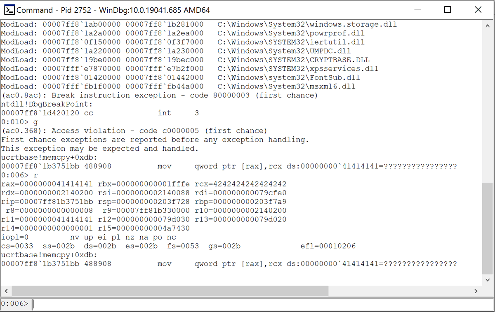</td>
</table></tr>
<table><tr>
<td>Quotes: <code>0</code></td>
<td>Replies: <code>1</code></td>
<td>Retweets: <code>5</code></td>
<td>Favorites: <code>38</code></td>
</tr></table>

---

# maddiestone
**https://twitter.com/maddiestone/status/1341781305126612995 _at 2020-12-23, 16:22:46_**
<blockquote>
In May, Kaspersky (@oct0xor) discovered CVE-2020-0986 in Windows splwow64 was exploited itw as a 0day. Microsoft released a patch in June, but that patch didnt fix the vuln. After reporting that bad fix in Sept under a 90day deadline, it's still not fixed. https://t.co/WDGNs3JGka
</blockquote>

* https://bugs.chromium.org/p/project-zero/issues/detail?id=2096

<table><tr>
<td>Quotes: <code>15</code></td>
<td>Replies: <code>4</code></td>
<td>Retweets: <code>152</code></td>
<td>Favorites: <code>390</code></td>
</tr></table>

---

# cyber_advising
**https://twitter.com/cyber_advising/status/1341541767318024192 _at 2020-12-23, 00:30:56_**
<blockquote>
CVE-2020-35489: Unrestricted File Upload Vulnerability found in Contact Form 7 plugin affects 5M+ websites
https://t.co/VBNwfVJO60 https://t.co/aBlWEgoH5q
</blockquote>

* https://blog.wpsec.com/contact-form-7-vulnerability/

<table><tr>
<td></td>
</table></tr>
<table><tr>
<td>Quotes: <code>2</code></td>
<td>Replies: <code>2</code></td>
<td>Retweets: <code>32</code></td>
<td>Favorites: <code>93</code></td>
</tr></table>

---

# ehakkus
**https://twitter.com/ehakkus/status/1341334351154458625 _at 2020-12-22, 10:46:44_**
<blockquote>
(CVE-2020-35606)#Webmin 1.962-PU Escape Bypass RCE.I've stated that Im gonna continue to analyze Webmin. By keeping my word,I shared one of the vuln that I kept in my hand.Detailed analysis can be found on my pblog.I'll have another surprise for webmin in the future😉Best regards https://t.co/wOvFyDeNet
</blockquote>

<table><tr>
<td>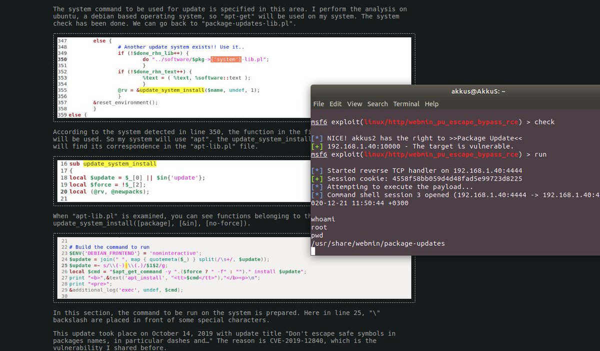</td>
</table></tr>
<table><tr>
<td>Quotes: <code>1</code></td>
<td>Replies: <code>1</code></td>
<td>Retweets: <code>16</code></td>
<td>Favorites: <code>72</code></td>
</tr></table>

---

# testanull
**https://twitter.com/testanull/status/1341279708491599872 _at 2020-12-22, 07:09:36_**
<blockquote>
I just published an analysis of CVE-2020-7200, HPE SIM AMF Deserialization lead to RCE 
PoC: https://t.co/rjF7LSlWxG
Post: https://t.co/rCbrkHxBhn
</blockquote>

* https://github.com/testanull/ProjectSIM/
* https://link.medium.com/uK3qeyfYpcb

<table><tr>
<td>Quotes: <code>2</code></td>
<td>Replies: <code>1</code></td>
<td>Retweets: <code>63</code></td>
<td>Favorites: <code>145</code></td>
</tr></table>

---

# cyber_advising
**https://twitter.com/cyber_advising/status/1341118637038575616 _at 2020-12-21, 20:29:34_**
<blockquote>
[ CVE-2020-16875 Protection/Filter Bypass ] MICROSOFT EXCHANGE REMOTE CODE EXECUTION
https://t.co/y8bo9w9BUA https://t.co/yDDbZgmu4T
</blockquote>

* https://x41-dsec.de/security/advisory/exploit/research/2020/12/21/x41-microsoft-exchange-rce-dlp-bypass/

<table><tr>
<td>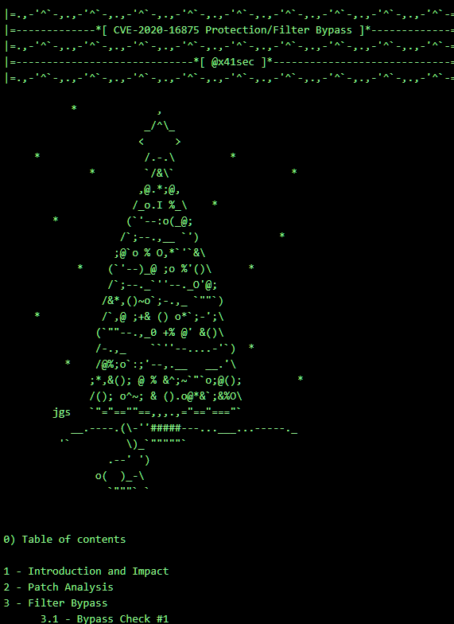</td>
</table></tr>
<table><tr>
<td>Quotes: <code>8</code></td>
<td>Replies: <code>3</code></td>
<td>Retweets: <code>167</code></td>
<td>Favorites: <code>378</code></td>
</tr></table>

---

# thezdi
**https://twitter.com/thezdi/status/1341082714733236226 _at 2020-12-21, 18:06:49_**
<blockquote>
CVE-2020-7468: Turning Imprisonment to Advantage in the FreeBSD ftpd chroot Jail - a new blog from @_wmliang_  covering a now patched local privilege escalation in #FreeBSD. https://t.co/AlrO2d3Bfl
</blockquote>

* http://bit.ly/2WwSNLE

<table><tr>
<td>Quotes: <code>3</code></td>
<td>Replies: <code>1</code></td>
<td>Retweets: <code>38</code></td>
<td>Favorites: <code>87</code></td>
</tr></table>

---

# TheHackersNews
**https://twitter.com/TheHackersNews/status/1341032399786807297 _at 2020-12-21, 14:46:53_**
<blockquote>
A detailed explanation of CVE-2020-0423, yet another privilege escalation vulnerability in #Android.

https://t.co/zeqrX07s5B https://t.co/RL7JcEj1JO
</blockquote>

* https://blog.longterm.io/cve-2020-0423.html

<table><tr>
<td>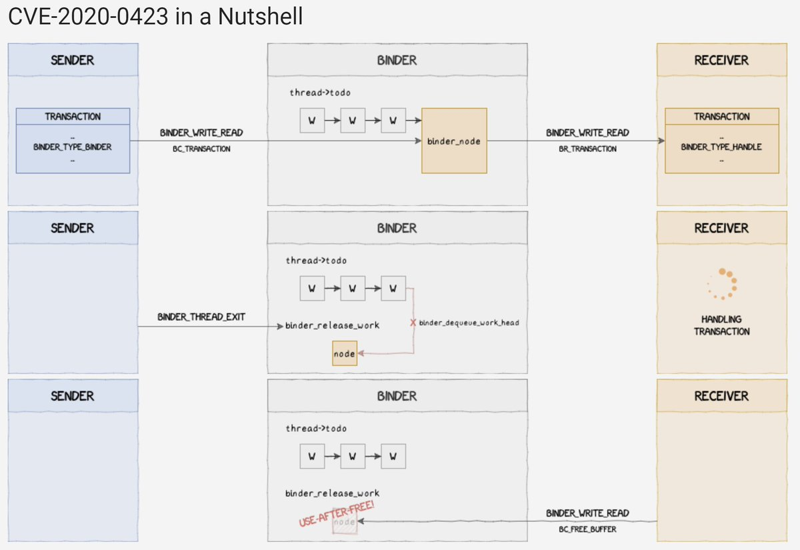</td>
</table></tr>
<table><tr>
<td>Quotes: <code>2</code></td>
<td>Replies: <code>1</code></td>
<td>Retweets: <code>52</code></td>
<td>Favorites: <code>103</code></td>
</tr></table>

---

# aulliakenz
**https://twitter.com/aulliakenz/status/1340308506973331457 _at 2020-12-19, 14:50:24_**
<blockquote>
Sorry for the delay.

1. Using shodan search query : org:"https://t.co/jZRuDREwjR"
2. Found a Nexus dashboard
3. exploit code injection using a (CVE-2019-7238) ExDB
4. Run this code and boom.

You get a happy nice days. https://t.co/72jqKwlH17
</blockquote>

* http://mail.ru

<table><tr>
<td></td>
</table></tr>
<table><tr>
<td>Quotes: <code>0</code></td>
<td>Replies: <code>1</code></td>
<td>Retweets: <code>8</code></td>
<td>Favorites: <code>34</code></td>
</tr></table>

---

# loopspell
**https://twitter.com/loopspell/status/1339814413415550976 _at 2020-12-18, 06:07:03_**
<blockquote>
I just published CVE-2020-29227: Unauthenticated Local File Inclusion In Car Rental Management System 1.0 https://t.co/8HcbK7wdXm
</blockquote>

* https://link.medium.com/c2NVlbUfjcb

<table><tr>
<td>Quotes: <code>2</code></td>
<td>Replies: <code>0</code></td>
<td>Retweets: <code>10</code></td>
<td>Favorites: <code>31</code></td>
</tr></table>

---

# jas502n
**https://twitter.com/jas502n/status/1338179859265146881 _at 2020-12-13, 17:51:55_**
<blockquote>
#CVE-2020-26259 
XStream is vulnerable to an Arbitrary File Deletion on the local host when unmarshalling as long as the executing process has sufficient rights.

1.4.14

#CVE-2020-26258 XStream SSRF

Poc:
https://t.co/6GHbng49Dy
https://t.co/I5KB42tyz5 https://t.co/X5iGnoYHqd
</blockquote>

* https://x-stream.github.io/CVE-2020-26259.html
* https://x-stream.github.io/CVE-2020-26258.html

<table><tr>
<td>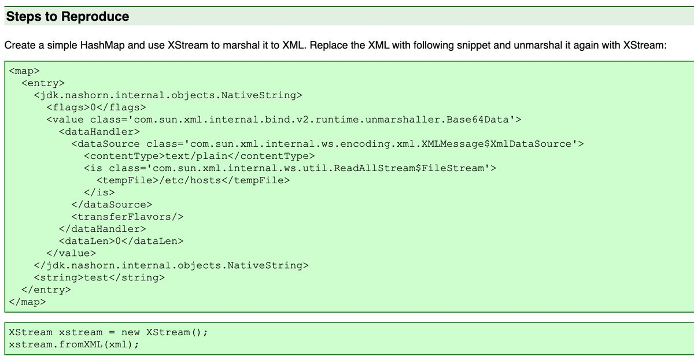</td>
<td>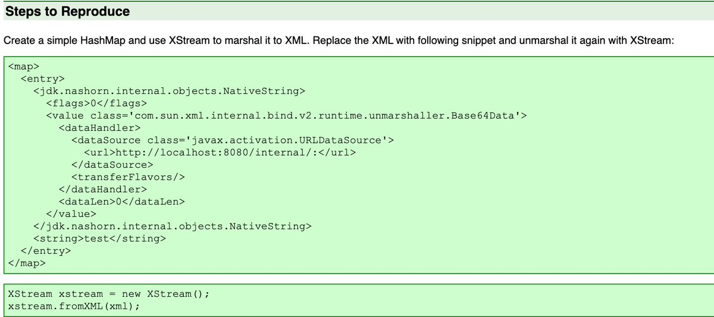</td>
</table></tr>
<table><tr>
<td>Quotes: <code>2</code></td>
<td>Replies: <code>2</code></td>
<td>Retweets: <code>24</code></td>
<td>Favorites: <code>61</code></td>
</tr></table>

---

# bad_packets
**https://twitter.com/bad_packets/status/1337842704722481152 _at 2020-12-12, 19:32:11_**
<blockquote>
Mass scanning activity detected from 158.58.185.55 (🇮🇷) targeting Fortinet VPN servers vulnerable to unauthenticated arbitrary file read (CVE-2018-13379) leading to disclosure of usernames and passwords in plaintext. #threatintel https://t.co/8K061aCXxQ
</blockquote>

<table><tr>
<td></td>
</table></tr>
<table><tr>
<td>Quotes: <code>2</code></td>
<td>Replies: <code>0</code></td>
<td>Retweets: <code>30</code></td>
<td>Favorites: <code>57</code></td>
</tr></table>

---

# steventseeley
**https://twitter.com/steventseeley/status/1337415647593107457 _at 2020-12-11, 15:15:13_**
<blockquote>
I provided PoC exploits for CVE-2020-17143 and CVE-2020-17141 which demonstrate the XXE bugs against Exchange Server.

- Low privileged authentication only
- CVE-2020-17141 is interesting because its in the EWS API

https://t.co/yYB8Frzwsl
https://t.co/wmtGRPMpVB
</blockquote>

* https://srcincite.io/pocs/cve-2020-17143.py.txt
* https://srcincite.io/pocs/cve-2020-17141.py.txt

<table><tr>
<td>Quotes: <code>5</code></td>
<td>Replies: <code>2</code></td>
<td>Retweets: <code>153</code></td>
<td>Favorites: <code>371</code></td>
</tr></table>

---

# sourceincite
**https://twitter.com/sourceincite/status/1337414336030121984 _at 2020-12-11, 15:10:00_**
<blockquote>
Microsoft Exchange Server EWS RouteComplaint ParseComplaintData XML External Entity Processing Information Disclosure Vulnerability

CVE: CVE-2020-17141
Advisory: https://t.co/9LGEheqija
Technical Analysis &amp; PoC: https://t.co/M8gHmTsJUd
</blockquote>

* https://srcincite.io/advisories/src-2020-0031/
* https://srcincite.io/pocs/cve-2020-17141.py.txt

<table><tr>
<td>Quotes: <code>3</code></td>
<td>Replies: <code>3</code></td>
<td>Retweets: <code>28</code></td>
<td>Favorites: <code>76</code></td>
</tr></table>

---

# pyn3rd
**https://twitter.com/pyn3rd/status/1336979742814134272 _at 2020-12-10, 10:23:05_**
<blockquote>
#CVE-2020-17530 (S2-061) Struts2 OGNL Expression Remote Code Execution @pwntester nice find!👍 https://t.co/bbaO4FeItl
</blockquote>

<table><tr>
<td>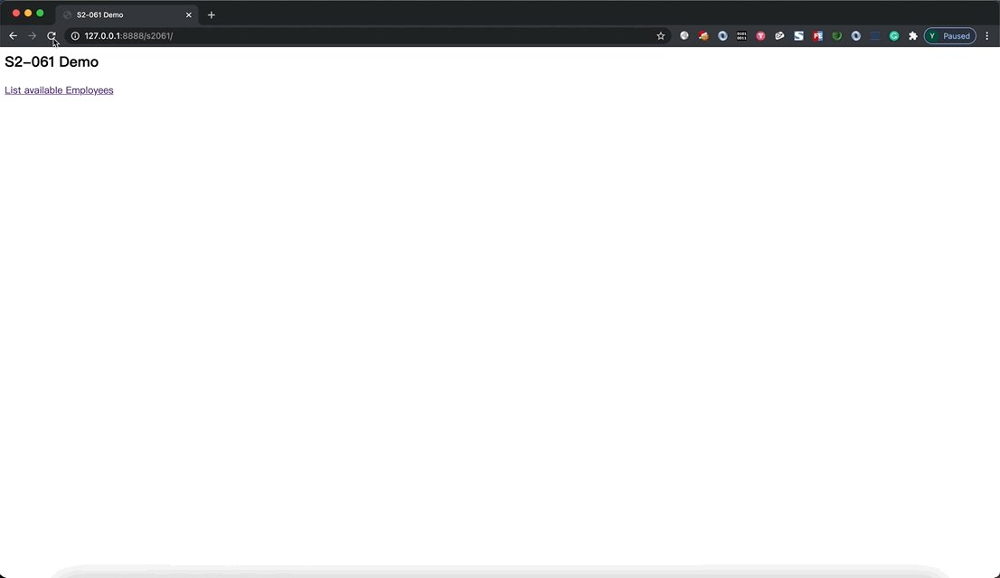</td>
</table></tr>
<table><tr>
<td>Quotes: <code>7</code></td>
<td>Replies: <code>3</code></td>
<td>Retweets: <code>89</code></td>
<td>Favorites: <code>302</code></td>
</tr></table>

---

# peleghd
**https://twitter.com/peleghd/status/1336953893918568448 _at 2020-12-10, 08:40:22_**
<blockquote>
1/n @OphirHarpaz and I patch-diffed the latest vmusrv.dll (Hyper-V vSMB) trying to figure out the root cause of CVE-2020-17095. We figured out that it was probably UAF - the Refcount of SRV_WORK_ITEM was miscomputed, leading to freeing objects from mem that are still reachable. https://t.co/WZ2K4cJNLk
</blockquote>

<table><tr>
<td>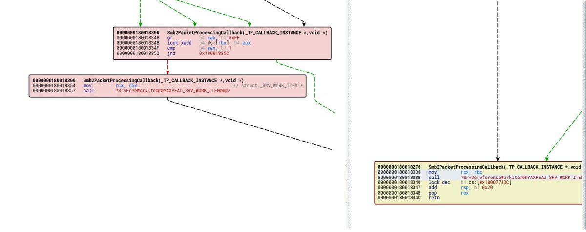</td>
</table></tr>
<table><tr>
<td>Quotes: <code>2</code></td>
<td>Replies: <code>1</code></td>
<td>Retweets: <code>16</code></td>
<td>Favorites: <code>67</code></td>
</tr></table>

---

# TheHackersNews
**https://twitter.com/TheHackersNews/status/1336694698279194626 _at 2020-12-09, 15:30:25_**
<blockquote>
Apache releases an update to patch a potential remote code execution #vulnerability (CVE-2020-17530) affecting Apache Struts 2.0.0 - 2.5.25.

Read more:  https://t.co/fQeH2h8ODX https://t.co/7q9U9DwrF8
</blockquote>

* http://mail-archives.us.apache.org/mod_mbox/www-announce/202012.mbox/%3CCAMopvkO3Bba_4GQ-%3D8jngryMSxDkzo2JbrCrCApEt1aQ4fRCQw%40mail.gmail.com%3E

<table><tr>
<td></td>
</table></tr>
<table><tr>
<td>Quotes: <code>0</code></td>
<td>Replies: <code>1</code></td>
<td>Retweets: <code>26</code></td>
<td>Favorites: <code>38</code></td>
</tr></table>

---

# cyber_advising
**https://twitter.com/cyber_advising/status/1336681491963781122 _at 2020-12-09, 14:37:56_**
<blockquote>
CVE-2020-17144: Microsoft Exchange Remote Code Execution Vulnerability

https://t.co/texmYGydMe https://t.co/W2QkEOblD2
</blockquote>

* https://github.com/Airboi/CVE-2020-17144-EXP

<table><tr>
<td>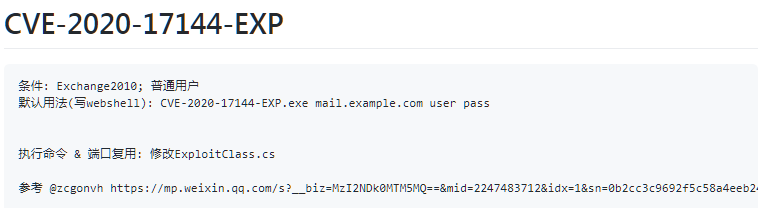</td>
</table></tr>
<table><tr>
<td>Quotes: <code>4</code></td>
<td>Replies: <code>2</code></td>
<td>Retweets: <code>75</code></td>
<td>Favorites: <code>199</code></td>
</tr></table>

---

# cyber_advising
**https://twitter.com/cyber_advising/status/1336680827237904384 _at 2020-12-09, 14:35:18_**
<blockquote>
CVE-2020-17530: Apache Struts2 Remote Code Execution Vulnerability Alert
https://t.co/3mqu9Fl0Zn https://t.co/obW1Fkmt6Z
</blockquote>

* https://github.com/ka1n4t/CVE-2020-17530

<table><tr>
<td>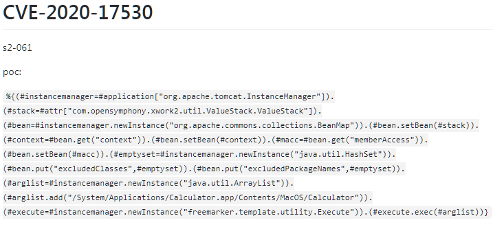</td>
</table></tr>
<table><tr>
<td>Quotes: <code>8</code></td>
<td>Replies: <code>4</code></td>
<td>Retweets: <code>121</code></td>
<td>Favorites: <code>269</code></td>
</tr></table>

---

# KeyZ3r0
**https://twitter.com/KeyZ3r0/status/1336504104001052674 _at 2020-12-09, 02:53:04_**
<blockquote>
Microsoft patched my first use after free vulnerability in SMBv3 this patch tuesday, assigned CVE-2020-17140(https://t.co/UVm0ChehTT), it may affect over Win7 to Win10, I take a video to show my PoC works on the Windows 10 20H2 before patch :P https://t.co/v9Lg2U5APA
</blockquote>

* https://msrc.microsoft.com/update-guide/vulnerability/CVE-2020-17140

<table><tr>
<td>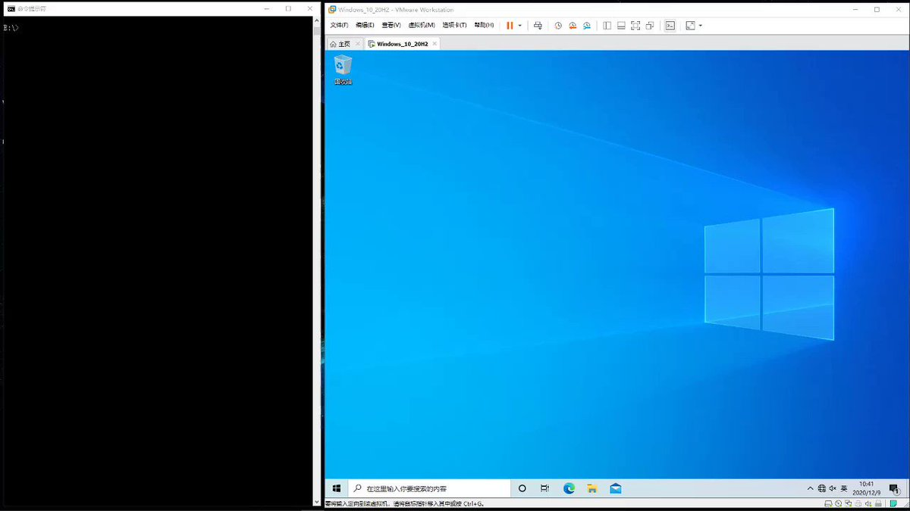</td>
</table></tr>
<table><tr>
<td>Quotes: <code>9</code></td>
<td>Replies: <code>18</code></td>
<td>Retweets: <code>124</code></td>
<td>Favorites: <code>454</code></td>
</tr></table>

---

# steventseeley
**https://twitter.com/steventseeley/status/1336387246795132931 _at 2020-12-08, 19:08:43_**
<blockquote>
Just a heads up, CVE-2020-17141 - Microsoft Exchange Server RCE is triggerable from a low privileged user and does *not* require user interaction. On the flip side, *I* couldn't get RCE from it, only disclose files as SYSTEM and in some cases relay the ntlm SYSTEM account.
</blockquote>

<table><tr>
<td>Quotes: <code>2</code></td>
<td>Replies: <code>2</code></td>
<td>Retweets: <code>31</code></td>
<td>Favorites: <code>107</code></td>
</tr></table>

---

# bad_packets
**https://twitter.com/bad_packets/status/1336020860709158912 _at 2020-12-07, 18:52:49_**
<blockquote>
Ongoing mass scanning activity detected from 156.96.117.185 (🇺🇸) targeting Fortinet VPN servers vulnerable to unauthenticated arbitrary file read (CVE-2018-13379) leading to disclosure of usernames and passwords in plaintext. 

Ports targeted:
443
7443
8443
9443
10443
50443
60443
</blockquote>

<table><tr>
<td>Quotes: <code>4</code></td>
<td>Replies: <code>3</code></td>
<td>Retweets: <code>26</code></td>
<td>Favorites: <code>45</code></td>
</tr></table>

---

# ptswarm
**https://twitter.com/ptswarm/status/1335945761574563841 _at 2020-12-07, 13:54:24_**
<blockquote>
✨New Article: Vulnerabilities in McAfee ePolicy Orchestrator

🐞Unauth RCE chain via CSRF + SSRF + MSSQL MiTM server
🐞Post-auth RCE via ZipSlip with Windows Defender bypass
🐞Reflected XSS

CVE-2020-7318 assigned, research by Mikhail Klyuchnikov

https://t.co/PSDun0mrIh https://t.co/958AWlwPrb
</blockquote>

* https://swarm.ptsecurity.com/vulnerabilities-in-mcafee-epolicy-orchestrator/

<table><tr>
<td></td>
</table></tr>
<table><tr>
<td>Quotes: <code>6</code></td>
<td>Replies: <code>2</code></td>
<td>Retweets: <code>94</code></td>
<td>Favorites: <code>232</code></td>
</tr></table>

---

# ptracesecurity
**https://twitter.com/ptracesecurity/status/1334377823755231232 _at 2020-12-03, 06:03:59_**
<blockquote>
IOS 1-DAY HUNTING: Uncovering and exploiting CVE-2020-27950 kernel memory leak.
https://t.co/vS4WJhznyd  #Pentesting #Kernel #Exploit #CyberSecurity #Infosec https://t.co/zy0WIolmkP
</blockquote>

* https://www.synacktiv.com/publications/ios-1-day-hunting-uncovering-and-exploiting-cve-2020-27950-kernel-memory-leak.html

<table><tr>
<td>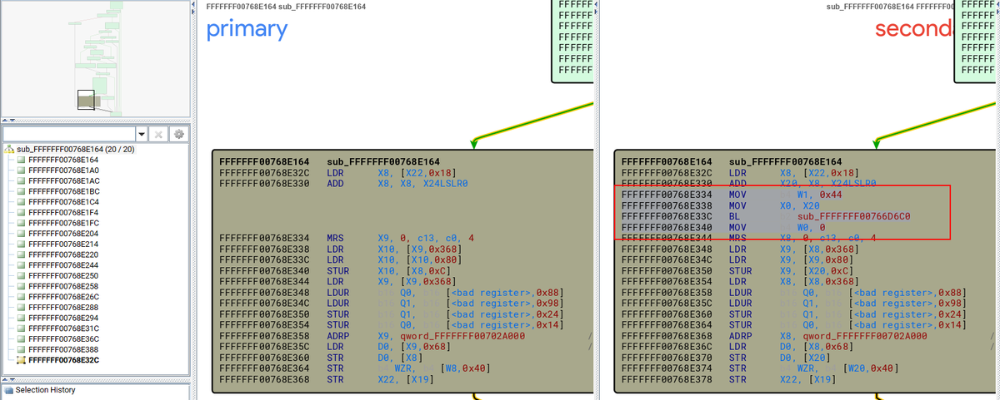</td>
<td>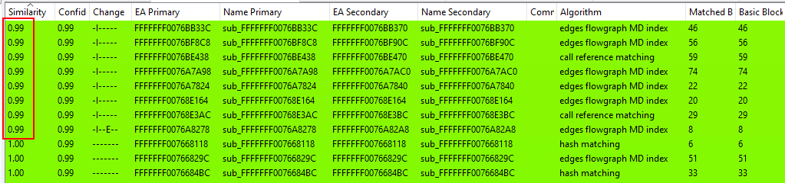</td>
</table></tr>
<table><tr>
<td>Quotes: <code>1</code></td>
<td>Replies: <code>0</code></td>
<td>Retweets: <code>9</code></td>
<td>Favorites: <code>39</code></td>
</tr></table>

---

# Nettitude_Labs
**https://twitter.com/Nettitude_Labs/status/1333787486502305793 _at 2020-12-01, 14:58:12_**
<blockquote>
CVE-2020-14418: A vulnerability in the madCodeHook library caused many security products (by e.g. Cisco, Morphisec, etc) to contain a local privilege escalation vulnerability. Discovery and analysis by @kyREcon. 

https://t.co/jhZLJ1JNvX
</blockquote>

* https://labs.nettitude.com/blog/cve-2020-14418-madcodehook-library-local-privilege-escalation/

<table><tr>
<td>Quotes: <code>4</code></td>
<td>Replies: <code>0</code></td>
<td>Retweets: <code>22</code></td>
<td>Favorites: <code>37</code></td>
</tr></table>

---

