# chybeta
**https://twitter.com/chybeta/status/1387333641638797316 _at 2021-04-28, 09:11:30_**
<blockquote>
CVE-2021-30128 Apache OFBiz RCE
https://t.co/NbF4vEFYNK

https://t.co/vkKqGSwgq2

https://t.co/6hs47T74g6 https://t.co/WLC8u3VCZW
</blockquote>

* https://www.mail-archive.com/announce@apache.org/msg06507.html
* https://mp.weixin.qq.com/s/Dr-jwiRr4NByjErjiX_e1w
* https://t.zsxq.com/zRja2v7

<table><tr>
<td>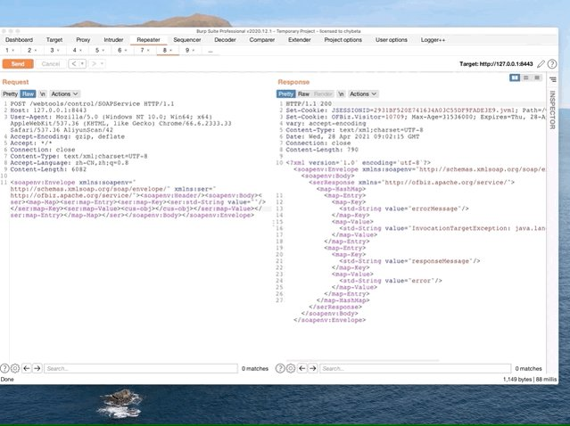</td>
</table></tr>
<table><tr>
<td>Quotes: <code>2</code></td>
<td>Replies: <code>0</code></td>
<td>Retweets: <code>70</code></td>
<td>Favorites: <code>170</code></td>
</tr></table>

---

# hackyzh
**https://twitter.com/hackyzh/status/1387266765030256645 _at 2021-04-28, 04:45:45_**
<blockquote>
Microsoft combined 6 RCE vulnerabilities into one CVE（CVE-2021-28466 ）, even though bounties for multiple vulnerabilities have been paid.😂 https://t.co/A1Woj1ndWI
</blockquote>

<table><tr>
<td>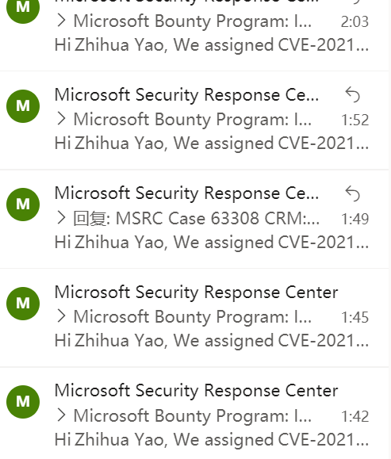</td>
</table></tr>
<table><tr>
<td>Quotes: <code>7</code></td>
<td>Replies: <code>18</code></td>
<td>Retweets: <code>26</code></td>
<td>Favorites: <code>238</code></td>
</tr></table>

---

# elhackernet
**https://twitter.com/elhackernet/status/1387134706005676034 _at 2021-04-27, 20:01:00_**
<blockquote>
Vulnerabilidad en #WordPress 5.7 XXE
- CVE-2021-29447 PHP8
- Authenticated XML External Entity (XXE) injection
- Arbitrary File Disclosure: por ejemplo wp-config.php 
- Server-Side Request Forgery (SSRF)
https://t.co/vtm5MfxDtT https://t.co/IosOTKYtYr
</blockquote>

* https://blog.sonarsource.com/wordpress-xxe-security-vulnerability

<table><tr>
<td>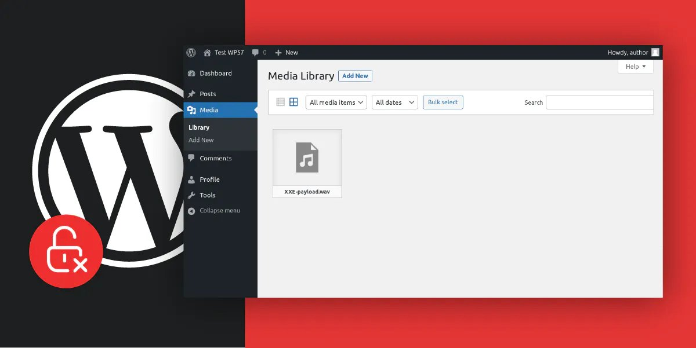</td>
</table></tr>
<table><tr>
<td>Quotes: <code>2</code></td>
<td>Replies: <code>2</code></td>
<td>Retweets: <code>43</code></td>
<td>Favorites: <code>67</code></td>
</tr></table>

---

# testanull
**https://twitter.com/testanull/status/1385481630228258820 _at 2021-04-23, 06:32:16_**
<blockquote>
Still don't know if this is CVE-2021-28482 or CVE-2021-28483
But it's posibble to take down Exchange with a low privilege user https://t.co/xXOT6pP08t
</blockquote>

<table><tr>
<td>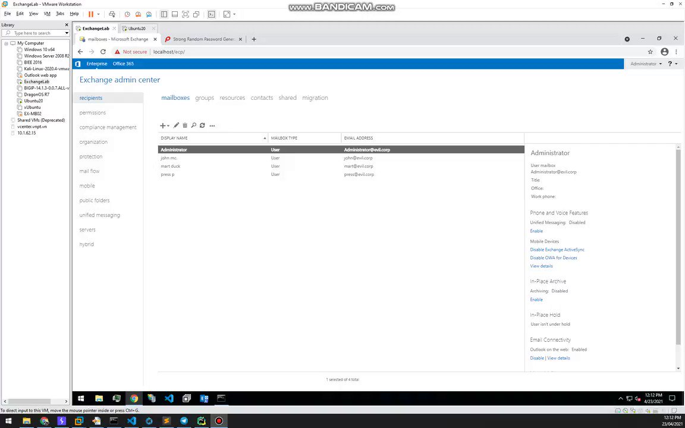</td>
</table></tr>
<table><tr>
<td>Quotes: <code>1</code></td>
<td>Replies: <code>5</code></td>
<td>Retweets: <code>55</code></td>
<td>Favorites: <code>207</code></td>
</tr></table>

---

# wdormann
**https://twitter.com/wdormann/status/1385341064513470466 _at 2021-04-22, 21:13:42_**
<blockquote>
I couldn't find many resources on ARM64 Windows shellcode.
So I decided to write my own small-batch, artisan, bespoke PoC for CVE-2021-21224.  It seemed like a good candidate because the shellcode section is both clear and also supports inline comments.
https://t.co/c6nGGiD1Cg https://t.co/IcdzoiHJqg
</blockquote>

* https://gist.github.com/wdormann/bbf95c5ccebb826a1e21124cfb320106

<table><tr>
<td>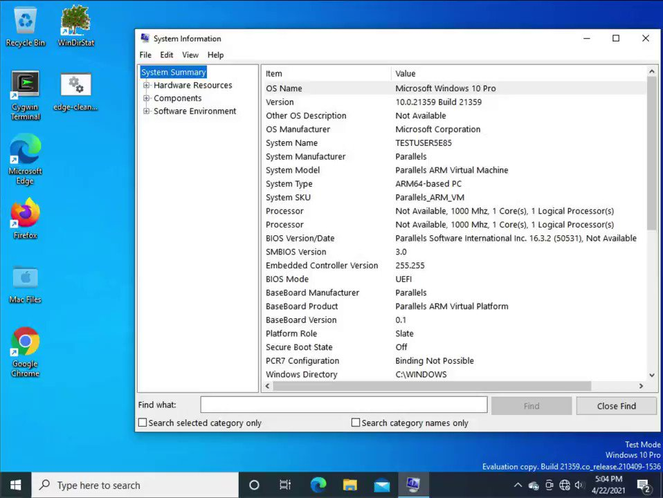</td>
</table></tr>
<table><tr>
<td>Quotes: <code>2</code></td>
<td>Replies: <code>4</code></td>
<td>Retweets: <code>59</code></td>
<td>Favorites: <code>193</code></td>
</tr></table>

---

# jedisct1
**https://twitter.com/jedisct1/status/1385310681067573253 _at 2021-04-22, 19:12:58_**
<blockquote>
OpenVPN CVE-2020-15078 https://t.co/UvRnlA7faP (but please, stop using OpenVPN. Use Wireguard, Glorytun or DSVPN).
</blockquote>

* https://community.openvpn.net/openvpn/changeset/f7b3bf067ffce72e7de49a4174fd17a3a83f0573/?__cf_chl_jschl_tk__=49fc8a303d49253be3b95811195fea4cf1e0a322-1619118638-0-AbanP_ZyaYcdRW49RI4_DIA4spBTfHfJNdPIQv43V_OTUcShKDq32WyIyB1pPtaOSPW3tmjNWzNH4SN0GsupSIeKsI48HEwjyuYHY6mCAGahcnRtMOaZ5Cou720H1ZhRlK6Zji2DiLG2KhSIVUUR-nRlt70Mw6J3tsXj9Y8Rfhqq8UkrOvdoe3zUlyK2_ovy-9XNsqKKLZ_5RtdSrBUwkDDh-PUTN03MPmhEFwSBdwarYWFwaxxtGOQznvkf0nzPx9StI9xrhGh18_VXeqHS7uV115D2f0wfmeAEoxeBHIQSc-uvhUabGoaUa_nUdDNL_22m5WMW3MXBHBJc2sBBtZRlK8R-WCscWC9Ck1qYe8KnpZCBkg-EoeEpEA90Dq3zD_QyzHh5UH-D-f_ASg_jRF1WPeZFxI2hb4uamAcEYKR9QObhpH33vUfW_70nE5VYMhUgOxi4yf6wnJdo4lzs62I

<table><tr>
<td>Quotes: <code>1</code></td>
<td>Replies: <code>4</code></td>
<td>Retweets: <code>21</code></td>
<td>Favorites: <code>47</code></td>
</tr></table>

---

# cyber_advising
**https://twitter.com/cyber_advising/status/1385140135843536899 _at 2021-04-22, 07:55:17_**
<blockquote>
CVE-2021-27905: Apache Solr SSRF
PoC
https://t.co/TE0cupHAmm https://t.co/Q8PKTYT8xU
</blockquote>

* https://github.com/Henry4E36/Solr-SSRF

<table><tr>
<td>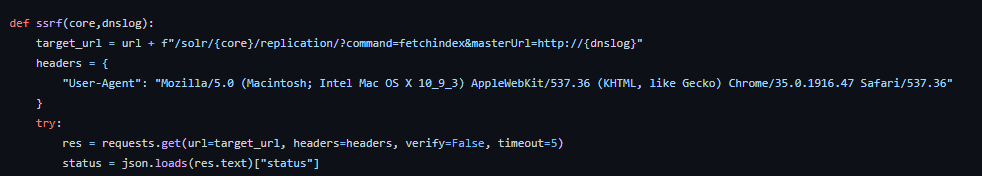</td>
</table></tr>
<table><tr>
<td>Quotes: <code>1</code></td>
<td>Replies: <code>1</code></td>
<td>Retweets: <code>67</code></td>
<td>Favorites: <code>171</code></td>
</tr></table>

---

# blackorbird
**https://twitter.com/blackorbird/status/1385062113085825027 _at 2021-04-22, 02:45:15_**
<blockquote>
Microsoft Office Remote Code Execution Vulnerability(CVE-2021-27059)
Internet Explorer Remote Code Execution Vulnerability(CVE-2021-27085)
0day(exploit) in the Wild But no one talk about it😅
https://t.co/AYawN0X30A
https://t.co/G2RYjq9dQ5 https://t.co/uUkGQJ147x
</blockquote>

* https://msrc.microsoft.com/update-guide/vulnerability/CVE-2021-27059
* https://msrc.microsoft.com/update-guide/en-US/vulnerability/CVE-2021-27085

<table><tr>
<td>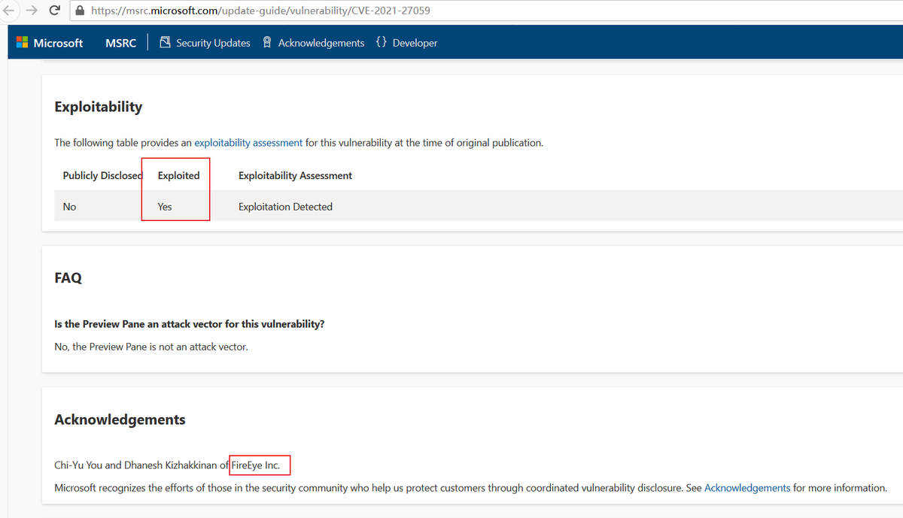</td>
<td>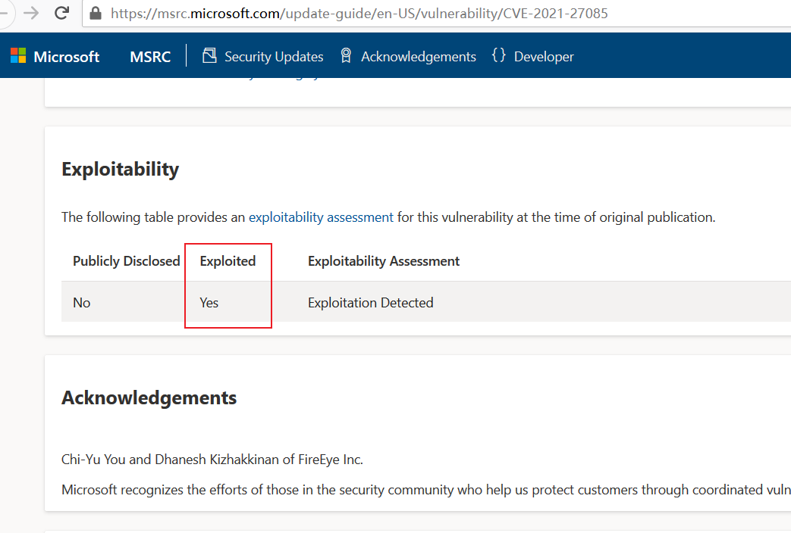</td>
</table></tr>
<table><tr>
<td>Quotes: <code>8</code></td>
<td>Replies: <code>3</code></td>
<td>Retweets: <code>199</code></td>
<td>Favorites: <code>400</code></td>
</tr></table>

---

# jedisct1
**https://twitter.com/jedisct1/status/1385016091945078787 _at 2021-04-21, 23:42:23_**
<blockquote>
RT @a_denkiewicz: Here's a promised write-up of Windows Privilege Elevation bug that I've discovered / CVE-2021-26415
https://t.co/1uQoF9wA…
</blockquote>

<table><tr>
<td>Quotes: <code>0</code></td>
<td>Replies: <code>0</code></td>
<td>Retweets: <code>216</code></td>
<td>Favorites: <code>0</code></td>
</tr></table>

---

# a_denkiewicz
**https://twitter.com/a_denkiewicz/status/1384956782200725504 _at 2021-04-21, 19:46:42_**
<blockquote>
Here's a promised write-up of Windows Privilege Elevation bug that I've discovered / CVE-2021-26415
https://t.co/1uQoF9wAip

#security #EOP #LPE #bugbounty https://t.co/VJzEcXw4tu
</blockquote>

* https://www.cloaked.pl/2021/04/cve-2021-26415/

<table><tr>
<td>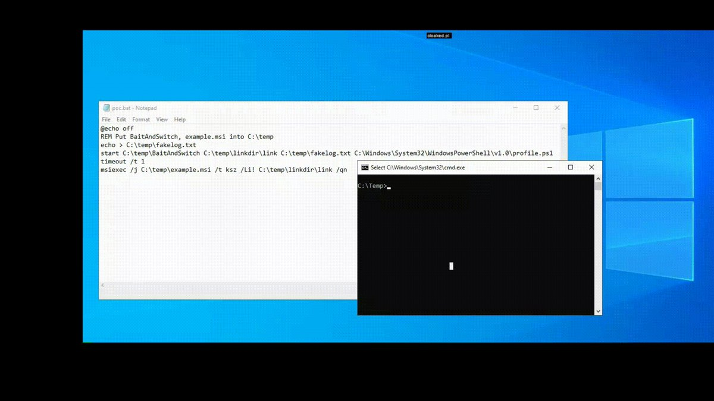</td>
</table></tr>
<table><tr>
<td>Quotes: <code>5</code></td>
<td>Replies: <code>7</code></td>
<td>Retweets: <code>221</code></td>
<td>Favorites: <code>453</code></td>
</tr></table>

---

# cherepanov74
**https://twitter.com/cherepanov74/status/1384514284059774976 _at 2021-04-20, 14:28:23_**
<blockquote>
RT @JohnHultquist: Chinese cyber espionage actors (possibly including APT5) have been using a zero-day vuln (CVE-2021-22893) as well as som…
</blockquote>

<table><tr>
<td>Quotes: <code>0</code></td>
<td>Replies: <code>0</code></td>
<td>Retweets: <code>267</code></td>
<td>Favorites: <code>0</code></td>
</tr></table>

---

# JohnHultquist
**https://twitter.com/JohnHultquist/status/1384510043878576128 _at 2021-04-20, 14:11:32_**
<blockquote>
Chinese cyber espionage actors (possibly including APT5) have been using a zero-day vuln (CVE-2021-22893) as well as some older, known vulns in Pulse Secure VPN to gain access to dozens of government, finance, and defense orgs in the US and Europe. https://t.co/E9gGizuDpK
</blockquote>

* https://www.fireeye.com/blog/threat-research/2021/04/suspected-apt-actors-leverage-bypass-techniques-pulse-secure-zero-day.html

<table><tr>
<td>Quotes: <code>25</code></td>
<td>Replies: <code>6</code></td>
<td>Retweets: <code>267</code></td>
<td>Favorites: <code>408</code></td>
</tr></table>

---

# SBousseaden
**https://twitter.com/SBousseaden/status/1383917216593170442 _at 2021-04-18, 22:55:51_**
<blockquote>
if you see an instance of dwDrvInst.exe (unsigned by Solarwinds) running with cmdline like "smartcard -install" that could be a sign of successful RCE exploitation of CVE-2019-3980

https://t.co/FyZvQ2IYVj https://t.co/8OIarbbqeQ
</blockquote>

* https://github.com/tenable/poc/blob/master/Solarwinds/Dameware/dwrcs_dwDrvInst_rce.py

<table><tr>
<td>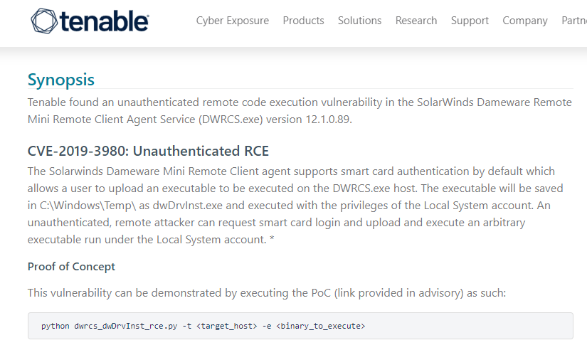</td>
<td></td>
</table></tr>
<table><tr>
<td>Quotes: <code>0</code></td>
<td>Replies: <code>0</code></td>
<td>Retweets: <code>38</code></td>
<td>Favorites: <code>77</code></td>
</tr></table>

---

# vxunderground
**https://twitter.com/vxunderground/status/1383184465199988739 _at 2021-04-16, 22:24:09_**
<blockquote>
January 12th, 2021 Google Project Zero released CVE-2021-1647: Windows Defender mpengine remote code execution.

We were able to get our hands on a sample. You can read about it here: https://t.co/boF2BZX7rZ

You can download it here: https://t.co/mR3lKuZziK
</blockquote>

* https://googleprojectzero.github.io/0days-in-the-wild//0day-RCAs/2021/CVE-2021-1647.html
* https://vx-underground.org/tmp/

<table><tr>
<td>Quotes: <code>3</code></td>
<td>Replies: <code>0</code></td>
<td>Retweets: <code>41</code></td>
<td>Favorites: <code>124</code></td>
</tr></table>

---

# TheHackersNews
**https://twitter.com/TheHackersNews/status/1383137068683972609 _at 2021-04-16, 19:15:49_**
<blockquote>
Airstrike Attack (CVE-2021-28316) — BitLocker full disk encryption bypass and Privilege Escalation on domain joined Windows workstations.

https://t.co/b80FsdYkzG https://t.co/KBes7HGZJK
</blockquote>

* https://shenaniganslabs.io/2021/04/13/Airstrike.html

<table><tr>
<td>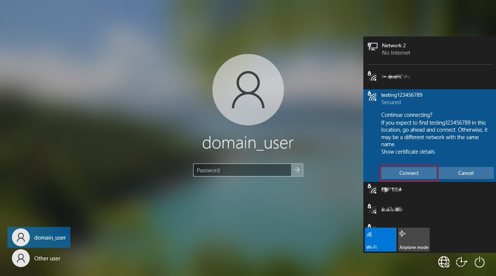</td>
</table></tr>
<table><tr>
<td>Quotes: <code>17</code></td>
<td>Replies: <code>11</code></td>
<td>Retweets: <code>318</code></td>
<td>Favorites: <code>601</code></td>
</tr></table>

---

# TheHackersNews
**https://twitter.com/TheHackersNews/status/1383136319044415488 _at 2021-04-16, 19:12:50_**
<blockquote>
A critical RCE #vulnerability (CVE-2021-0254) was recently discovered in the "Junos Network Operating System" by Juniper Networks residing in the overlayd service.

Patches and vulnerable versions can be found here: https://t.co/GidSzIPGMT https://t.co/aavrHVtVLh
</blockquote>

* https://kb.juniper.net/InfoCenter/index?page=content&id=JSA11147

<table><tr>
<td></td>
</table></tr>
<table><tr>
<td>Quotes: <code>5</code></td>
<td>Replies: <code>0</code></td>
<td>Retweets: <code>47</code></td>
<td>Favorites: <code>65</code></td>
</tr></table>

---

# bad_packets
**https://twitter.com/bad_packets/status/1383132627306127364 _at 2021-04-16, 18:58:10_**
<blockquote>
Mass scanning activity detected from 185.191.32.158 (🇷🇺) targeting Fortinet VPN servers vulnerable to unauthenticated arbitrary file read (CVE-2018-13379) leading to disclosure of usernames and passwords in plaintext. #threatintel https://t.co/Hrn5hr6V5H
</blockquote>

<table><tr>
<td></td>
</table></tr>
<table><tr>
<td>Quotes: <code>1</code></td>
<td>Replies: <code>0</code></td>
<td>Retweets: <code>17</code></td>
<td>Favorites: <code>33</code></td>
</tr></table>

---

# briankrebs
**https://twitter.com/briankrebs/status/1382767168421572620 _at 2021-04-15, 18:45:58_**
<blockquote>
A joint advisory from the FBI, CISA and NSA seems to confirm my reporting from December that a VMWare flaw (CVE-2020-4006) was used as an attack vector by the Russian SVU attackers involved in SolarWinds https://t.co/dw0fnHKY7a https://t.co/cLazD1CEch https://t.co/iMyrUddM9Q
</blockquote>

* https://krebsonsecurity.com/2020/12/vmware-flaw-a-vector-in-solarwinds-breach/
* https://www.fbi.gov/news/pressrel/press-releases/russian-foreign-intelligence-service-exploiting-five-publicly-known-vulnerabilities-to-compromise-us-and-allied-networks

<table><tr>
<td>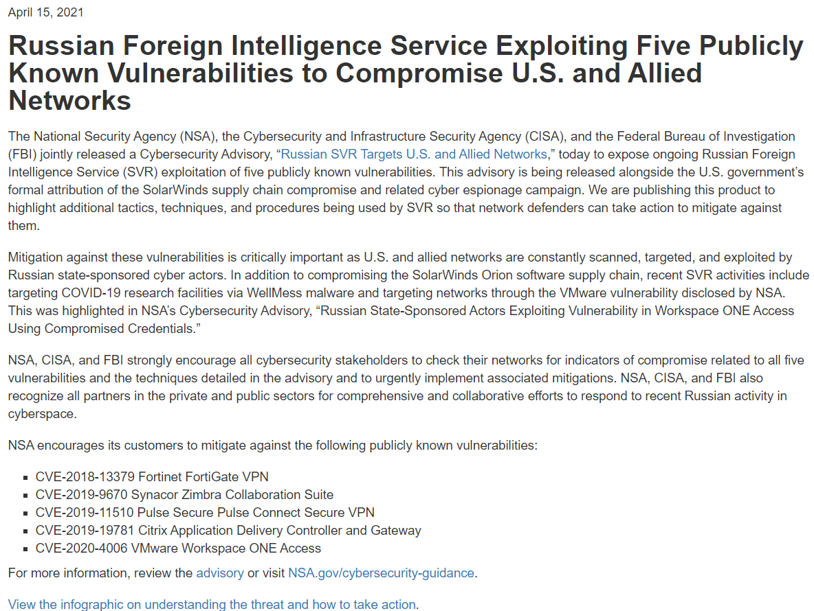</td>
</table></tr>
<table><tr>
<td>Quotes: <code>2</code></td>
<td>Replies: <code>7</code></td>
<td>Retweets: <code>103</code></td>
<td>Favorites: <code>221</code></td>
</tr></table>

---

# AdmVonSchneider
**https://twitter.com/AdmVonSchneider/status/1382390325373730822 _at 2021-04-14, 17:48:31_**
<blockquote>
RT @maddiestone: ✨Root Cause Analysis for in-the-wild 0day CVE-2021-1647✨

The Windows Defender RCE that was exploited in-the-wild and patc…
</blockquote>

<table><tr>
<td>Quotes: <code>0</code></td>
<td>Replies: <code>0</code></td>
<td>Retweets: <code>250</code></td>
<td>Favorites: <code>0</code></td>
</tr></table>

---

# maddiestone
**https://twitter.com/maddiestone/status/1382372859780079620 _at 2021-04-14, 16:39:07_**
<blockquote>
✨Root Cause Analysis for in-the-wild 0day CVE-2021-1647✨

The Windows Defender RCE that was exploited in-the-wild and patched in January. 

https://t.co/jZBO7NQgA2
</blockquote>

* https://googleprojectzero.github.io/0days-in-the-wild//0day-RCAs/2021/CVE-2021-1647.html

<table><tr>
<td>Quotes: <code>6</code></td>
<td>Replies: <code>5</code></td>
<td>Retweets: <code>229</code></td>
<td>Favorites: <code>546</code></td>
</tr></table>

---

# jedisct1
**https://twitter.com/jedisct1/status/1382365983264940036 _at 2021-04-14, 16:11:48_**
<blockquote>
RT @_argp: Remote exploitation of a man-in-the-disk vulnerability in WhatsApp (CVE-2021-24027); epic logical exploitation writeup by huku:…
</blockquote>

<table><tr>
<td>Quotes: <code>0</code></td>
<td>Replies: <code>0</code></td>
<td>Retweets: <code>301</code></td>
<td>Favorites: <code>0</code></td>
</tr></table>

---

# _argp
**https://twitter.com/_argp/status/1382250573668442112 _at 2021-04-14, 08:33:12_**
<blockquote>
Remote exploitation of a man-in-the-disk vulnerability in WhatsApp (CVE-2021-24027); epic logical exploitation writeup by huku: https://t.co/ZAc64X1SUj
</blockquote>

* https://census-labs.com/news/2021/04/14/whatsapp-mitd-remote-exploitation-CVE-2021-24027/

<table><tr>
<td>Quotes: <code>20</code></td>
<td>Replies: <code>6</code></td>
<td>Retweets: <code>301</code></td>
<td>Favorites: <code>669</code></td>
</tr></table>

---

# e_kaspersky
**https://twitter.com/e_kaspersky/status/1382070720671453186 _at 2021-04-13, 20:38:32_**
<blockquote>
Zero-day vulnerability in Desktop Window Manager (CVE-2021-28310) used in the wild 👉 https://t.co/58ZFF3hkSm https://t.co/Ay6MWO3gvk
</blockquote>

* https://kas.pr/g79y

<table><tr>
<td>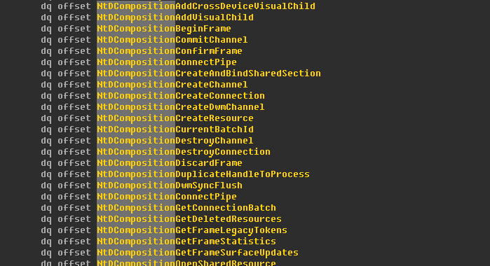</td>
</table></tr>
<table><tr>
<td>Quotes: <code>19</code></td>
<td>Replies: <code>3</code></td>
<td>Retweets: <code>246</code></td>
<td>Favorites: <code>569</code></td>
</tr></table>

---

# aaditya_purani
**https://twitter.com/aaditya_purani/status/1381649069957767168 _at 2021-04-12, 16:43:02_**
<blockquote>
Got assigned 4 CVE-IDs for my findings on ObserveIT. All findings are marked as "High" Severity. 

If you run ObserveIT, it is recommended to update.

CVE-2021-27900 (Authorization Bypass)
CVE-2021-22158 (XXE)
CVE-2021-27899 (Imp Cert validation)
CVE-2021-22157 (Multiple XSS)
</blockquote>

<table><tr>
<td>Quotes: <code>1</code></td>
<td>Replies: <code>3</code></td>
<td>Retweets: <code>13</code></td>
<td>Favorites: <code>98</code></td>
</tr></table>

---

# Dinosn
**https://twitter.com/Dinosn/status/1381286029341114371 _at 2021-04-11, 16:40:27_**
<blockquote>
Exploiting Windows RPC to bypass CFG mitigation: analysis of CVE-2021-26411 in-the-wild sample https://t.co/6PP56nhvgs
</blockquote>

* https://www.reddit.com/r/netsec/comments/mor7kd/exploiting_windows_rpc_to_bypass_cfg_mitigation/

<table><tr>
<td>Quotes: <code>2</code></td>
<td>Replies: <code>0</code></td>
<td>Retweets: <code>37</code></td>
<td>Favorites: <code>70</code></td>
</tr></table>

---

# iamelli0t
**https://twitter.com/iamelli0t/status/1380819370755072001 _at 2021-04-10, 09:46:07_**
<blockquote>
[New Blog] Exploiting Windows RPC to bypass CFG mitigation: analysis of CVE-2021-26411 in-the-wild sample
https://t.co/mmM0B9BzN3 https://t.co/kxR7HWkueb
</blockquote>

* https://iamelli0t.github.io/2021/04/10/RPC-Bypass-CFG.html

<table><tr>
<td></td>
</table></tr>
<table><tr>
<td>Quotes: <code>4</code></td>
<td>Replies: <code>1</code></td>
<td>Retweets: <code>211</code></td>
<td>Favorites: <code>499</code></td>
</tr></table>

---

# jedisct1
**https://twitter.com/jedisct1/status/1380580516722831360 _at 2021-04-09, 17:56:59_**
<blockquote>
[CVE-2021-29154] Linux kernel incorrect computation of branch displacements in BPF JIT compiler can be abused to execute arbitrary code in Kernel mode https://t.co/fFqxuRv7f6
</blockquote>

* https://www.openwall.com/lists/oss-security/2021/04/08/1

<table><tr>
<td>Quotes: <code>25</code></td>
<td>Replies: <code>1</code></td>
<td>Retweets: <code>66</code></td>
<td>Favorites: <code>192</code></td>
</tr></table>

---

# jedisct1
**https://twitter.com/jedisct1/status/1380107279773671431 _at 2021-04-08, 10:36:31_**
<blockquote>
RT @TheHackersNews: Technical details and a proof of concept have been released for denial of service #vulnerability (CVE-2021-24086) affec…
</blockquote>

<table><tr>
<td>Quotes: <code>0</code></td>
<td>Replies: <code>0</code></td>
<td>Retweets: <code>65</code></td>
<td>Favorites: <code>0</code></td>
</tr></table>

---

# mdisec
**https://twitter.com/mdisec/status/1380088335977353216 _at 2021-04-08, 09:21:14_**
<blockquote>
Hey folks ! Update your GravCMS asap. 

Unexpected Journey #7 – GravCMS Unauthenticated Arbitrary YAML Write/Update leads to Remote Code Execution (CVE-2021-21425)

https://t.co/C5w2dEGe5t
</blockquote>

* https://pentest.blog/unexpected-journey-7-gravcms-unauthenticated-arbitrary-yaml-write-update-leads-to-code-execution/

<table><tr>
<td>Quotes: <code>4</code></td>
<td>Replies: <code>2</code></td>
<td>Retweets: <code>25</code></td>
<td>Favorites: <code>84</code></td>
</tr></table>

---

# TheHackersNews
**https://twitter.com/TheHackersNews/status/1380080499209564160 _at 2021-04-08, 08:50:06_**
<blockquote>
Technical details and a proof of concept have been released for denial of service #vulnerability (CVE-2021-24086) affecting IPv6 stacks in all supported versions of the Windows operating system.

https://t.co/Y17nwlaYRg https://t.co/Nzhk8Uwe47
</blockquote>

* https://blog.quarkslab.com/analysis-of-a-windows-ipv6-fragmentation-vulnerability-cve-2021-24086.html

<table><tr>
<td>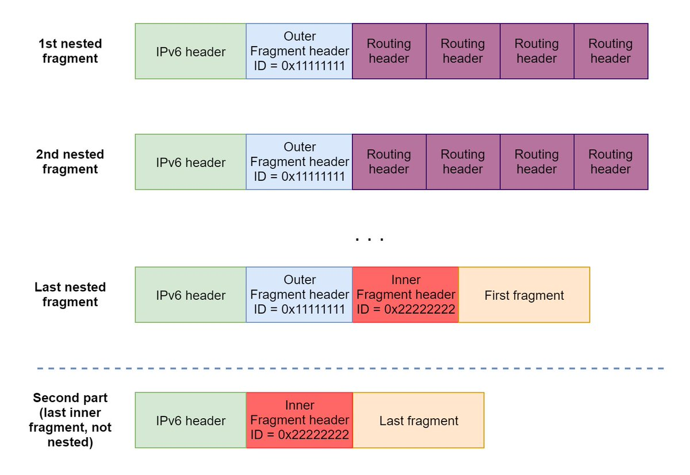</td>
</table></tr>
<table><tr>
<td>Quotes: <code>2</code></td>
<td>Replies: <code>1</code></td>
<td>Retweets: <code>65</code></td>
<td>Favorites: <code>112</code></td>
</tr></table>

---

# jedisct1
**https://twitter.com/jedisct1/status/1380054299380682755 _at 2021-04-08, 07:05:59_**
<blockquote>
RT @campuscodi: New Cring ransomware deployed via unpatched Fortinet VPNs

CVE-2018-13379 -- the gift that keeps on giving!

https://t.co/5…
</blockquote>

<table><tr>
<td>Quotes: <code>0</code></td>
<td>Replies: <code>0</code></td>
<td>Retweets: <code>174</code></td>
<td>Favorites: <code>0</code></td>
</tr></table>

---

# fdfalcon
**https://twitter.com/fdfalcon/status/1379827925965549570 _at 2021-04-07, 16:06:28_**
<blockquote>
Just published my analysis and PoC for CVE-2021-24086, an IPv6 fragmentation vulnerability on Windows: 

https://t.co/grUrwJgdZb https://t.co/97pbm2cpI9
</blockquote>

* https://blog.quarkslab.com/analysis-of-a-windows-ipv6-fragmentation-vulnerability-cve-2021-24086.html

<table><tr>
<td></td>
</table></tr>
<table><tr>
<td>Quotes: <code>12</code></td>
<td>Replies: <code>5</code></td>
<td>Retweets: <code>162</code></td>
<td>Favorites: <code>334</code></td>
</tr></table>

---

# campuscodi
**https://twitter.com/campuscodi/status/1379822702316388355 _at 2021-04-07, 15:45:42_**
<blockquote>
New Cring ransomware deployed via unpatched Fortinet VPNs

CVE-2018-13379 -- the gift that keeps on giving!

https://t.co/56ervYeOSk https://t.co/Gs3xopiGm9
</blockquote>

* https://therecord.media/new-cring-ransomware-deployed-via-unpatched-fortinet-vpns/

<table><tr>
<td></td>
</table></tr>
<table><tr>
<td>Quotes: <code>7</code></td>
<td>Replies: <code>3</code></td>
<td>Retweets: <code>174</code></td>
<td>Favorites: <code>295</code></td>
</tr></table>

---

# jedisct1
**https://twitter.com/jedisct1/status/1379783214877786118 _at 2021-04-07, 13:08:48_**
<blockquote>
RT @0vercl0k: I've built a PoC for CVE-2021-24086: https://t.co/YKRacxk73X 🔥

Will blog about the details later on https://t.co/5IU7XSFNIQ…
</blockquote>

* https://github.com/0vercl0k/CVE-2021-24086
* http://doar-e.github.io

<table><tr>
<td>Quotes: <code>0</code></td>
<td>Replies: <code>0</code></td>
<td>Retweets: <code>260</code></td>
<td>Favorites: <code>0</code></td>
</tr></table>

---

# 0vercl0k
**https://twitter.com/0vercl0k/status/1379779764605620225 _at 2021-04-07, 12:55:05_**
<blockquote>
I've built a PoC for CVE-2021-24086: https://t.co/YKRacxk73X 🔥

Will blog about the details later on https://t.co/5IU7XSFNIQ 🍻 https://t.co/sbR7rKIr62
</blockquote>

* https://github.com/0vercl0k/CVE-2021-24086
* http://doar-e.github.io

<table><tr>
<td></td>
</table></tr>
<table><tr>
<td>Quotes: <code>14</code></td>
<td>Replies: <code>3</code></td>
<td>Retweets: <code>260</code></td>
<td>Favorites: <code>607</code></td>
</tr></table>

---

# chybeta
**https://twitter.com/chybeta/status/1379343391423561729 _at 2021-04-06, 08:01:06_**
<blockquote>
CVE-2021-21402  Unauthenticated abritrary file read in Jellyfin

https://t.co/KT7uQTNXX4

https://t.co/d2KacgYMSD https://t.co/slNaQHwRlc
</blockquote>

* https://securitylab.github.com/advisories/GHSL-2021-050-jellyfin/
* https://t.zsxq.com/uB6qBAI

<table><tr>
<td>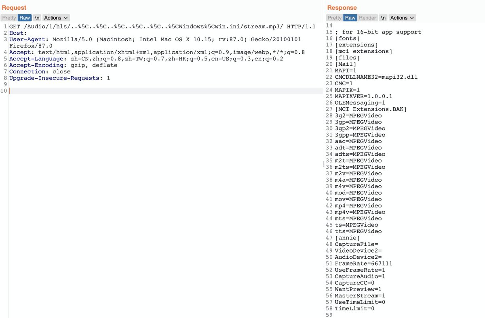</td>
</table></tr>
<table><tr>
<td>Quotes: <code>2</code></td>
<td>Replies: <code>2</code></td>
<td>Retweets: <code>63</code></td>
<td>Favorites: <code>190</code></td>
</tr></table>

---

# nao_sec
**https://twitter.com/nao_sec/status/1378546891349106692 _at 2021-04-04, 03:16:05_**
<blockquote>
#PurpleFox Exploit Kit has exploited CVE-2021-26411!?
(CC: @malware_traffic, @jeromesegura)
https://t.co/UpqQrPuR42 https://t.co/p4ej4O0O9w
</blockquote>

* https://app.any.run/tasks/0f8a285f-8ff1-47cd-9ccf-c9cb3397daf4

<table><tr>
<td>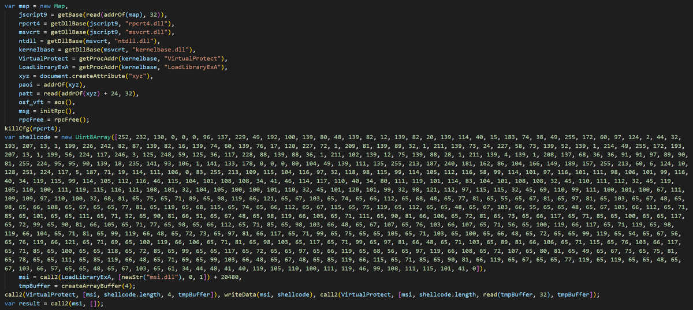</td>
<td>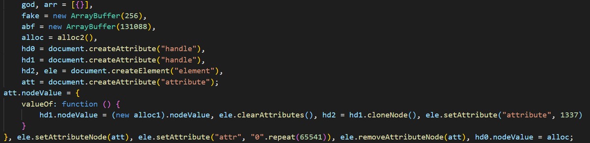</td>
</table></tr>
<table><tr>
<td>Quotes: <code>4</code></td>
<td>Replies: <code>2</code></td>
<td>Retweets: <code>52</code></td>
<td>Favorites: <code>146</code></td>
</tr></table>

---

# bad_packets
**https://twitter.com/bad_packets/status/1378414106777034753 _at 2021-04-03, 18:28:27_**
<blockquote>
Mass scanning activity detected from 45.155.205.165 (🇷🇺) targeting Fortinet VPN servers vulnerable to unauthenticated arbitrary file read (CVE-2018-13379) leading to disclosure of usernames and passwords in plaintext. #threatintel https://t.co/SIgxNEGd88
</blockquote>

<table><tr>
<td></td>
</table></tr>
<table><tr>
<td>Quotes: <code>3</code></td>
<td>Replies: <code>1</code></td>
<td>Retweets: <code>51</code></td>
<td>Favorites: <code>87</code></td>
</tr></table>

---

# jedisct1
**https://twitter.com/jedisct1/status/1378314414617677825 _at 2021-04-03, 11:52:18_**
<blockquote>
This man thought opening a TXT file is fine, he thought wrong. macOS CVE-2019-8761 https://t.co/2tOuCvLqUR
</blockquote>

* https://www.paulosyibelo.com/2021/04/this-man-thought-opening-txt-file-is.html

<table><tr>
<td>Quotes: <code>4</code></td>
<td>Replies: <code>1</code></td>
<td>Retweets: <code>26</code></td>
<td>Favorites: <code>65</code></td>
</tr></table>

---

# chybeta
**https://twitter.com/chybeta/status/1387333641638797316 _at 2021-04-28, 09:11:30_**
<blockquote>
CVE-2021-30128 Apache OFBiz RCE
https://t.co/NbF4vEFYNK

https://t.co/vkKqGSwgq2

https://t.co/6hs47T74g6 https://t.co/WLC8u3VCZW
</blockquote>

* https://www.mail-archive.com/announce@apache.org/msg06507.html
* https://mp.weixin.qq.com/s/Dr-jwiRr4NByjErjiX_e1w
* https://t.zsxq.com/zRja2v7

<table><tr>
<td></td>
</table></tr>
<table><tr>
<td>Quotes: <code>2</code></td>
<td>Replies: <code>0</code></td>
<td>Retweets: <code>70</code></td>
<td>Favorites: <code>170</code></td>
</tr></table>

---

# hackyzh
**https://twitter.com/hackyzh/status/1387266765030256645 _at 2021-04-28, 04:45:45_**
<blockquote>
Microsoft combined 6 RCE vulnerabilities into one CVE（CVE-2021-28466 ）, even though bounties for multiple vulnerabilities have been paid.😂 https://t.co/A1Woj1ndWI
</blockquote>

<table><tr>
<td></td>
</table></tr>
<table><tr>
<td>Quotes: <code>7</code></td>
<td>Replies: <code>18</code></td>
<td>Retweets: <code>26</code></td>
<td>Favorites: <code>238</code></td>
</tr></table>

---

# elhackernet
**https://twitter.com/elhackernet/status/1387134706005676034 _at 2021-04-27, 20:01:00_**
<blockquote>
Vulnerabilidad en #WordPress 5.7 XXE
- CVE-2021-29447 PHP8
- Authenticated XML External Entity (XXE) injection
- Arbitrary File Disclosure: por ejemplo wp-config.php 
- Server-Side Request Forgery (SSRF)
https://t.co/vtm5MfxDtT https://t.co/IosOTKYtYr
</blockquote>

* https://blog.sonarsource.com/wordpress-xxe-security-vulnerability

<table><tr>
<td></td>
</table></tr>
<table><tr>
<td>Quotes: <code>2</code></td>
<td>Replies: <code>2</code></td>
<td>Retweets: <code>43</code></td>
<td>Favorites: <code>67</code></td>
</tr></table>

---

# testanull
**https://twitter.com/testanull/status/1385481630228258820 _at 2021-04-23, 06:32:16_**
<blockquote>
Still don't know if this is CVE-2021-28482 or CVE-2021-28483
But it's posibble to take down Exchange with a low privilege user https://t.co/xXOT6pP08t
</blockquote>

<table><tr>
<td></td>
</table></tr>
<table><tr>
<td>Quotes: <code>1</code></td>
<td>Replies: <code>5</code></td>
<td>Retweets: <code>55</code></td>
<td>Favorites: <code>207</code></td>
</tr></table>

---

# wdormann
**https://twitter.com/wdormann/status/1385341064513470466 _at 2021-04-22, 21:13:42_**
<blockquote>
I couldn't find many resources on ARM64 Windows shellcode.
So I decided to write my own small-batch, artisan, bespoke PoC for CVE-2021-21224.  It seemed like a good candidate because the shellcode section is both clear and also supports inline comments.
https://t.co/c6nGGiD1Cg https://t.co/IcdzoiHJqg
</blockquote>

* https://gist.github.com/wdormann/bbf95c5ccebb826a1e21124cfb320106

<table><tr>
<td></td>
</table></tr>
<table><tr>
<td>Quotes: <code>2</code></td>
<td>Replies: <code>4</code></td>
<td>Retweets: <code>59</code></td>
<td>Favorites: <code>193</code></td>
</tr></table>

---

# jedisct1
**https://twitter.com/jedisct1/status/1385310681067573253 _at 2021-04-22, 19:12:58_**
<blockquote>
OpenVPN CVE-2020-15078 https://t.co/UvRnlA7faP (but please, stop using OpenVPN. Use Wireguard, Glorytun or DSVPN).
</blockquote>

* https://community.openvpn.net/openvpn/changeset/f7b3bf067ffce72e7de49a4174fd17a3a83f0573/?__cf_chl_jschl_tk__=49fc8a303d49253be3b95811195fea4cf1e0a322-1619118638-0-AbanP_ZyaYcdRW49RI4_DIA4spBTfHfJNdPIQv43V_OTUcShKDq32WyIyB1pPtaOSPW3tmjNWzNH4SN0GsupSIeKsI48HEwjyuYHY6mCAGahcnRtMOaZ5Cou720H1ZhRlK6Zji2DiLG2KhSIVUUR-nRlt70Mw6J3tsXj9Y8Rfhqq8UkrOvdoe3zUlyK2_ovy-9XNsqKKLZ_5RtdSrBUwkDDh-PUTN03MPmhEFwSBdwarYWFwaxxtGOQznvkf0nzPx9StI9xrhGh18_VXeqHS7uV115D2f0wfmeAEoxeBHIQSc-uvhUabGoaUa_nUdDNL_22m5WMW3MXBHBJc2sBBtZRlK8R-WCscWC9Ck1qYe8KnpZCBkg-EoeEpEA90Dq3zD_QyzHh5UH-D-f_ASg_jRF1WPeZFxI2hb4uamAcEYKR9QObhpH33vUfW_70nE5VYMhUgOxi4yf6wnJdo4lzs62I

<table><tr>
<td>Quotes: <code>1</code></td>
<td>Replies: <code>4</code></td>
<td>Retweets: <code>21</code></td>
<td>Favorites: <code>47</code></td>
</tr></table>

---

# cyber_advising
**https://twitter.com/cyber_advising/status/1385140135843536899 _at 2021-04-22, 07:55:17_**
<blockquote>
CVE-2021-27905: Apache Solr SSRF
PoC
https://t.co/TE0cupHAmm https://t.co/Q8PKTYT8xU
</blockquote>

* https://github.com/Henry4E36/Solr-SSRF

<table><tr>
<td></td>
</table></tr>
<table><tr>
<td>Quotes: <code>1</code></td>
<td>Replies: <code>1</code></td>
<td>Retweets: <code>67</code></td>
<td>Favorites: <code>171</code></td>
</tr></table>

---

# blackorbird
**https://twitter.com/blackorbird/status/1385062113085825027 _at 2021-04-22, 02:45:15_**
<blockquote>
Microsoft Office Remote Code Execution Vulnerability(CVE-2021-27059)
Internet Explorer Remote Code Execution Vulnerability(CVE-2021-27085)
0day(exploit) in the Wild But no one talk about it😅
https://t.co/AYawN0X30A
https://t.co/G2RYjq9dQ5 https://t.co/uUkGQJ147x
</blockquote>

* https://msrc.microsoft.com/update-guide/vulnerability/CVE-2021-27059
* https://msrc.microsoft.com/update-guide/en-US/vulnerability/CVE-2021-27085

<table><tr>
<td></td>
<td></td>
</table></tr>
<table><tr>
<td>Quotes: <code>8</code></td>
<td>Replies: <code>3</code></td>
<td>Retweets: <code>199</code></td>
<td>Favorites: <code>400</code></td>
</tr></table>

---

# jedisct1
**https://twitter.com/jedisct1/status/1385016091945078787 _at 2021-04-21, 23:42:23_**
<blockquote>
RT @a_denkiewicz: Here's a promised write-up of Windows Privilege Elevation bug that I've discovered / CVE-2021-26415
https://t.co/1uQoF9wA…
</blockquote>

<table><tr>
<td>Quotes: <code>0</code></td>
<td>Replies: <code>0</code></td>
<td>Retweets: <code>216</code></td>
<td>Favorites: <code>0</code></td>
</tr></table>

---

# a_denkiewicz
**https://twitter.com/a_denkiewicz/status/1384956782200725504 _at 2021-04-21, 19:46:42_**
<blockquote>
Here's a promised write-up of Windows Privilege Elevation bug that I've discovered / CVE-2021-26415
https://t.co/1uQoF9wAip

#security #EOP #LPE #bugbounty https://t.co/VJzEcXw4tu
</blockquote>

* https://www.cloaked.pl/2021/04/cve-2021-26415/

<table><tr>
<td></td>
</table></tr>
<table><tr>
<td>Quotes: <code>5</code></td>
<td>Replies: <code>7</code></td>
<td>Retweets: <code>221</code></td>
<td>Favorites: <code>453</code></td>
</tr></table>

---

# cherepanov74
**https://twitter.com/cherepanov74/status/1384514284059774976 _at 2021-04-20, 14:28:23_**
<blockquote>
RT @JohnHultquist: Chinese cyber espionage actors (possibly including APT5) have been using a zero-day vuln (CVE-2021-22893) as well as som…
</blockquote>

<table><tr>
<td>Quotes: <code>0</code></td>
<td>Replies: <code>0</code></td>
<td>Retweets: <code>267</code></td>
<td>Favorites: <code>0</code></td>
</tr></table>

---

# JohnHultquist
**https://twitter.com/JohnHultquist/status/1384510043878576128 _at 2021-04-20, 14:11:32_**
<blockquote>
Chinese cyber espionage actors (possibly including APT5) have been using a zero-day vuln (CVE-2021-22893) as well as some older, known vulns in Pulse Secure VPN to gain access to dozens of government, finance, and defense orgs in the US and Europe. https://t.co/E9gGizuDpK
</blockquote>

* https://www.fireeye.com/blog/threat-research/2021/04/suspected-apt-actors-leverage-bypass-techniques-pulse-secure-zero-day.html

<table><tr>
<td>Quotes: <code>25</code></td>
<td>Replies: <code>6</code></td>
<td>Retweets: <code>267</code></td>
<td>Favorites: <code>408</code></td>
</tr></table>

---

# SBousseaden
**https://twitter.com/SBousseaden/status/1383917216593170442 _at 2021-04-18, 22:55:51_**
<blockquote>
if you see an instance of dwDrvInst.exe (unsigned by Solarwinds) running with cmdline like "smartcard -install" that could be a sign of successful RCE exploitation of CVE-2019-3980

https://t.co/FyZvQ2IYVj https://t.co/8OIarbbqeQ
</blockquote>

* https://github.com/tenable/poc/blob/master/Solarwinds/Dameware/dwrcs_dwDrvInst_rce.py

<table><tr>
<td></td>
<td></td>
</table></tr>
<table><tr>
<td>Quotes: <code>0</code></td>
<td>Replies: <code>0</code></td>
<td>Retweets: <code>38</code></td>
<td>Favorites: <code>77</code></td>
</tr></table>

---

# vxunderground
**https://twitter.com/vxunderground/status/1383184465199988739 _at 2021-04-16, 22:24:09_**
<blockquote>
January 12th, 2021 Google Project Zero released CVE-2021-1647: Windows Defender mpengine remote code execution.

We were able to get our hands on a sample. You can read about it here: https://t.co/boF2BZX7rZ

You can download it here: https://t.co/mR3lKuZziK
</blockquote>

* https://googleprojectzero.github.io/0days-in-the-wild//0day-RCAs/2021/CVE-2021-1647.html
* https://vx-underground.org/tmp/

<table><tr>
<td>Quotes: <code>3</code></td>
<td>Replies: <code>0</code></td>
<td>Retweets: <code>41</code></td>
<td>Favorites: <code>124</code></td>
</tr></table>

---

# TheHackersNews
**https://twitter.com/TheHackersNews/status/1383137068683972609 _at 2021-04-16, 19:15:49_**
<blockquote>
Airstrike Attack (CVE-2021-28316) — BitLocker full disk encryption bypass and Privilege Escalation on domain joined Windows workstations.

https://t.co/b80FsdYkzG https://t.co/KBes7HGZJK
</blockquote>

* https://shenaniganslabs.io/2021/04/13/Airstrike.html

<table><tr>
<td></td>
</table></tr>
<table><tr>
<td>Quotes: <code>17</code></td>
<td>Replies: <code>11</code></td>
<td>Retweets: <code>318</code></td>
<td>Favorites: <code>601</code></td>
</tr></table>

---

# TheHackersNews
**https://twitter.com/TheHackersNews/status/1383136319044415488 _at 2021-04-16, 19:12:50_**
<blockquote>
A critical RCE #vulnerability (CVE-2021-0254) was recently discovered in the "Junos Network Operating System" by Juniper Networks residing in the overlayd service.

Patches and vulnerable versions can be found here: https://t.co/GidSzIPGMT https://t.co/aavrHVtVLh
</blockquote>

* https://kb.juniper.net/InfoCenter/index?page=content&id=JSA11147

<table><tr>
<td></td>
</table></tr>
<table><tr>
<td>Quotes: <code>5</code></td>
<td>Replies: <code>0</code></td>
<td>Retweets: <code>47</code></td>
<td>Favorites: <code>65</code></td>
</tr></table>

---

# bad_packets
**https://twitter.com/bad_packets/status/1383132627306127364 _at 2021-04-16, 18:58:10_**
<blockquote>
Mass scanning activity detected from 185.191.32.158 (🇷🇺) targeting Fortinet VPN servers vulnerable to unauthenticated arbitrary file read (CVE-2018-13379) leading to disclosure of usernames and passwords in plaintext. #threatintel https://t.co/Hrn5hr6V5H
</blockquote>

<table><tr>
<td></td>
</table></tr>
<table><tr>
<td>Quotes: <code>1</code></td>
<td>Replies: <code>0</code></td>
<td>Retweets: <code>17</code></td>
<td>Favorites: <code>33</code></td>
</tr></table>

---

# briankrebs
**https://twitter.com/briankrebs/status/1382767168421572620 _at 2021-04-15, 18:45:58_**
<blockquote>
A joint advisory from the FBI, CISA and NSA seems to confirm my reporting from December that a VMWare flaw (CVE-2020-4006) was used as an attack vector by the Russian SVU attackers involved in SolarWinds https://t.co/dw0fnHKY7a https://t.co/cLazD1CEch https://t.co/iMyrUddM9Q
</blockquote>

* https://krebsonsecurity.com/2020/12/vmware-flaw-a-vector-in-solarwinds-breach/
* https://www.fbi.gov/news/pressrel/press-releases/russian-foreign-intelligence-service-exploiting-five-publicly-known-vulnerabilities-to-compromise-us-and-allied-networks

<table><tr>
<td></td>
</table></tr>
<table><tr>
<td>Quotes: <code>2</code></td>
<td>Replies: <code>7</code></td>
<td>Retweets: <code>103</code></td>
<td>Favorites: <code>221</code></td>
</tr></table>

---

# AdmVonSchneider
**https://twitter.com/AdmVonSchneider/status/1382390325373730822 _at 2021-04-14, 17:48:31_**
<blockquote>
RT @maddiestone: ✨Root Cause Analysis for in-the-wild 0day CVE-2021-1647✨

The Windows Defender RCE that was exploited in-the-wild and patc…
</blockquote>

<table><tr>
<td>Quotes: <code>0</code></td>
<td>Replies: <code>0</code></td>
<td>Retweets: <code>250</code></td>
<td>Favorites: <code>0</code></td>
</tr></table>

---

# maddiestone
**https://twitter.com/maddiestone/status/1382372859780079620 _at 2021-04-14, 16:39:07_**
<blockquote>
✨Root Cause Analysis for in-the-wild 0day CVE-2021-1647✨

The Windows Defender RCE that was exploited in-the-wild and patched in January. 

https://t.co/jZBO7NQgA2
</blockquote>

* https://googleprojectzero.github.io/0days-in-the-wild//0day-RCAs/2021/CVE-2021-1647.html

<table><tr>
<td>Quotes: <code>6</code></td>
<td>Replies: <code>5</code></td>
<td>Retweets: <code>229</code></td>
<td>Favorites: <code>546</code></td>
</tr></table>

---

# jedisct1
**https://twitter.com/jedisct1/status/1382365983264940036 _at 2021-04-14, 16:11:48_**
<blockquote>
RT @_argp: Remote exploitation of a man-in-the-disk vulnerability in WhatsApp (CVE-2021-24027); epic logical exploitation writeup by huku:…
</blockquote>

<table><tr>
<td>Quotes: <code>0</code></td>
<td>Replies: <code>0</code></td>
<td>Retweets: <code>301</code></td>
<td>Favorites: <code>0</code></td>
</tr></table>

---

# _argp
**https://twitter.com/_argp/status/1382250573668442112 _at 2021-04-14, 08:33:12_**
<blockquote>
Remote exploitation of a man-in-the-disk vulnerability in WhatsApp (CVE-2021-24027); epic logical exploitation writeup by huku: https://t.co/ZAc64X1SUj
</blockquote>

* https://census-labs.com/news/2021/04/14/whatsapp-mitd-remote-exploitation-CVE-2021-24027/

<table><tr>
<td>Quotes: <code>20</code></td>
<td>Replies: <code>6</code></td>
<td>Retweets: <code>301</code></td>
<td>Favorites: <code>669</code></td>
</tr></table>

---

# e_kaspersky
**https://twitter.com/e_kaspersky/status/1382070720671453186 _at 2021-04-13, 20:38:32_**
<blockquote>
Zero-day vulnerability in Desktop Window Manager (CVE-2021-28310) used in the wild 👉 https://t.co/58ZFF3hkSm https://t.co/Ay6MWO3gvk
</blockquote>

* https://kas.pr/g79y

<table><tr>
<td></td>
</table></tr>
<table><tr>
<td>Quotes: <code>19</code></td>
<td>Replies: <code>3</code></td>
<td>Retweets: <code>246</code></td>
<td>Favorites: <code>569</code></td>
</tr></table>

---

# aaditya_purani
**https://twitter.com/aaditya_purani/status/1381649069957767168 _at 2021-04-12, 16:43:02_**
<blockquote>
Got assigned 4 CVE-IDs for my findings on ObserveIT. All findings are marked as "High" Severity. 

If you run ObserveIT, it is recommended to update.

CVE-2021-27900 (Authorization Bypass)
CVE-2021-22158 (XXE)
CVE-2021-27899 (Imp Cert validation)
CVE-2021-22157 (Multiple XSS)
</blockquote>

<table><tr>
<td>Quotes: <code>1</code></td>
<td>Replies: <code>3</code></td>
<td>Retweets: <code>13</code></td>
<td>Favorites: <code>98</code></td>
</tr></table>

---

# Dinosn
**https://twitter.com/Dinosn/status/1381286029341114371 _at 2021-04-11, 16:40:27_**
<blockquote>
Exploiting Windows RPC to bypass CFG mitigation: analysis of CVE-2021-26411 in-the-wild sample https://t.co/6PP56nhvgs
</blockquote>

* https://www.reddit.com/r/netsec/comments/mor7kd/exploiting_windows_rpc_to_bypass_cfg_mitigation/

<table><tr>
<td>Quotes: <code>2</code></td>
<td>Replies: <code>0</code></td>
<td>Retweets: <code>37</code></td>
<td>Favorites: <code>70</code></td>
</tr></table>

---

# iamelli0t
**https://twitter.com/iamelli0t/status/1380819370755072001 _at 2021-04-10, 09:46:07_**
<blockquote>
[New Blog] Exploiting Windows RPC to bypass CFG mitigation: analysis of CVE-2021-26411 in-the-wild sample
https://t.co/mmM0B9BzN3 https://t.co/kxR7HWkueb
</blockquote>

* https://iamelli0t.github.io/2021/04/10/RPC-Bypass-CFG.html

<table><tr>
<td></td>
</table></tr>
<table><tr>
<td>Quotes: <code>4</code></td>
<td>Replies: <code>1</code></td>
<td>Retweets: <code>211</code></td>
<td>Favorites: <code>499</code></td>
</tr></table>

---

# jedisct1
**https://twitter.com/jedisct1/status/1380580516722831360 _at 2021-04-09, 17:56:59_**
<blockquote>
[CVE-2021-29154] Linux kernel incorrect computation of branch displacements in BPF JIT compiler can be abused to execute arbitrary code in Kernel mode https://t.co/fFqxuRv7f6
</blockquote>

* https://www.openwall.com/lists/oss-security/2021/04/08/1

<table><tr>
<td>Quotes: <code>25</code></td>
<td>Replies: <code>1</code></td>
<td>Retweets: <code>66</code></td>
<td>Favorites: <code>192</code></td>
</tr></table>

---

# jedisct1
**https://twitter.com/jedisct1/status/1380107279773671431 _at 2021-04-08, 10:36:31_**
<blockquote>
RT @TheHackersNews: Technical details and a proof of concept have been released for denial of service #vulnerability (CVE-2021-24086) affec…
</blockquote>

<table><tr>
<td>Quotes: <code>0</code></td>
<td>Replies: <code>0</code></td>
<td>Retweets: <code>65</code></td>
<td>Favorites: <code>0</code></td>
</tr></table>

---

# mdisec
**https://twitter.com/mdisec/status/1380088335977353216 _at 2021-04-08, 09:21:14_**
<blockquote>
Hey folks ! Update your GravCMS asap. 

Unexpected Journey #7 – GravCMS Unauthenticated Arbitrary YAML Write/Update leads to Remote Code Execution (CVE-2021-21425)

https://t.co/C5w2dEGe5t
</blockquote>

* https://pentest.blog/unexpected-journey-7-gravcms-unauthenticated-arbitrary-yaml-write-update-leads-to-code-execution/

<table><tr>
<td>Quotes: <code>4</code></td>
<td>Replies: <code>2</code></td>
<td>Retweets: <code>25</code></td>
<td>Favorites: <code>84</code></td>
</tr></table>

---

# TheHackersNews
**https://twitter.com/TheHackersNews/status/1380080499209564160 _at 2021-04-08, 08:50:06_**
<blockquote>
Technical details and a proof of concept have been released for denial of service #vulnerability (CVE-2021-24086) affecting IPv6 stacks in all supported versions of the Windows operating system.

https://t.co/Y17nwlaYRg https://t.co/Nzhk8Uwe47
</blockquote>

* https://blog.quarkslab.com/analysis-of-a-windows-ipv6-fragmentation-vulnerability-cve-2021-24086.html

<table><tr>
<td></td>
</table></tr>
<table><tr>
<td>Quotes: <code>2</code></td>
<td>Replies: <code>1</code></td>
<td>Retweets: <code>65</code></td>
<td>Favorites: <code>112</code></td>
</tr></table>

---

# jedisct1
**https://twitter.com/jedisct1/status/1380054299380682755 _at 2021-04-08, 07:05:59_**
<blockquote>
RT @campuscodi: New Cring ransomware deployed via unpatched Fortinet VPNs

CVE-2018-13379 -- the gift that keeps on giving!

https://t.co/5…
</blockquote>

<table><tr>
<td>Quotes: <code>0</code></td>
<td>Replies: <code>0</code></td>
<td>Retweets: <code>174</code></td>
<td>Favorites: <code>0</code></td>
</tr></table>

---

# fdfalcon
**https://twitter.com/fdfalcon/status/1379827925965549570 _at 2021-04-07, 16:06:28_**
<blockquote>
Just published my analysis and PoC for CVE-2021-24086, an IPv6 fragmentation vulnerability on Windows: 

https://t.co/grUrwJgdZb https://t.co/97pbm2cpI9
</blockquote>

* https://blog.quarkslab.com/analysis-of-a-windows-ipv6-fragmentation-vulnerability-cve-2021-24086.html

<table><tr>
<td></td>
</table></tr>
<table><tr>
<td>Quotes: <code>12</code></td>
<td>Replies: <code>5</code></td>
<td>Retweets: <code>162</code></td>
<td>Favorites: <code>334</code></td>
</tr></table>

---

# campuscodi
**https://twitter.com/campuscodi/status/1379822702316388355 _at 2021-04-07, 15:45:42_**
<blockquote>
New Cring ransomware deployed via unpatched Fortinet VPNs

CVE-2018-13379 -- the gift that keeps on giving!

https://t.co/56ervYeOSk https://t.co/Gs3xopiGm9
</blockquote>

* https://therecord.media/new-cring-ransomware-deployed-via-unpatched-fortinet-vpns/

<table><tr>
<td></td>
</table></tr>
<table><tr>
<td>Quotes: <code>7</code></td>
<td>Replies: <code>3</code></td>
<td>Retweets: <code>174</code></td>
<td>Favorites: <code>295</code></td>
</tr></table>

---

# jedisct1
**https://twitter.com/jedisct1/status/1379783214877786118 _at 2021-04-07, 13:08:48_**
<blockquote>
RT @0vercl0k: I've built a PoC for CVE-2021-24086: https://t.co/YKRacxk73X 🔥

Will blog about the details later on https://t.co/5IU7XSFNIQ…
</blockquote>

* https://github.com/0vercl0k/CVE-2021-24086
* http://doar-e.github.io

<table><tr>
<td>Quotes: <code>0</code></td>
<td>Replies: <code>0</code></td>
<td>Retweets: <code>260</code></td>
<td>Favorites: <code>0</code></td>
</tr></table>

---

# 0vercl0k
**https://twitter.com/0vercl0k/status/1379779764605620225 _at 2021-04-07, 12:55:05_**
<blockquote>
I've built a PoC for CVE-2021-24086: https://t.co/YKRacxk73X 🔥

Will blog about the details later on https://t.co/5IU7XSFNIQ 🍻 https://t.co/sbR7rKIr62
</blockquote>

* https://github.com/0vercl0k/CVE-2021-24086
* http://doar-e.github.io

<table><tr>
<td></td>
</table></tr>
<table><tr>
<td>Quotes: <code>14</code></td>
<td>Replies: <code>3</code></td>
<td>Retweets: <code>260</code></td>
<td>Favorites: <code>607</code></td>
</tr></table>

---

# chybeta
**https://twitter.com/chybeta/status/1379343391423561729 _at 2021-04-06, 08:01:06_**
<blockquote>
CVE-2021-21402  Unauthenticated abritrary file read in Jellyfin

https://t.co/KT7uQTNXX4

https://t.co/d2KacgYMSD https://t.co/slNaQHwRlc
</blockquote>

* https://securitylab.github.com/advisories/GHSL-2021-050-jellyfin/
* https://t.zsxq.com/uB6qBAI

<table><tr>
<td></td>
</table></tr>
<table><tr>
<td>Quotes: <code>2</code></td>
<td>Replies: <code>2</code></td>
<td>Retweets: <code>63</code></td>
<td>Favorites: <code>190</code></td>
</tr></table>

---

# nao_sec
**https://twitter.com/nao_sec/status/1378546891349106692 _at 2021-04-04, 03:16:05_**
<blockquote>
#PurpleFox Exploit Kit has exploited CVE-2021-26411!?
(CC: @malware_traffic, @jeromesegura)
https://t.co/UpqQrPuR42 https://t.co/p4ej4O0O9w
</blockquote>

* https://app.any.run/tasks/0f8a285f-8ff1-47cd-9ccf-c9cb3397daf4

<table><tr>
<td></td>
<td></td>
</table></tr>
<table><tr>
<td>Quotes: <code>4</code></td>
<td>Replies: <code>2</code></td>
<td>Retweets: <code>52</code></td>
<td>Favorites: <code>146</code></td>
</tr></table>

---

# bad_packets
**https://twitter.com/bad_packets/status/1378414106777034753 _at 2021-04-03, 18:28:27_**
<blockquote>
Mass scanning activity detected from 45.155.205.165 (🇷🇺) targeting Fortinet VPN servers vulnerable to unauthenticated arbitrary file read (CVE-2018-13379) leading to disclosure of usernames and passwords in plaintext. #threatintel https://t.co/SIgxNEGd88
</blockquote>

<table><tr>
<td></td>
</table></tr>
<table><tr>
<td>Quotes: <code>3</code></td>
<td>Replies: <code>1</code></td>
<td>Retweets: <code>51</code></td>
<td>Favorites: <code>87</code></td>
</tr></table>

---

# jedisct1
**https://twitter.com/jedisct1/status/1378314414617677825 _at 2021-04-03, 11:52:18_**
<blockquote>
This man thought opening a TXT file is fine, he thought wrong. macOS CVE-2019-8761 https://t.co/2tOuCvLqUR
</blockquote>

* https://www.paulosyibelo.com/2021/04/this-man-thought-opening-txt-file-is.html

<table><tr>
<td>Quotes: <code>4</code></td>
<td>Replies: <code>1</code></td>
<td>Retweets: <code>26</code></td>
<td>Favorites: <code>65</code></td>
</tr></table>

---

