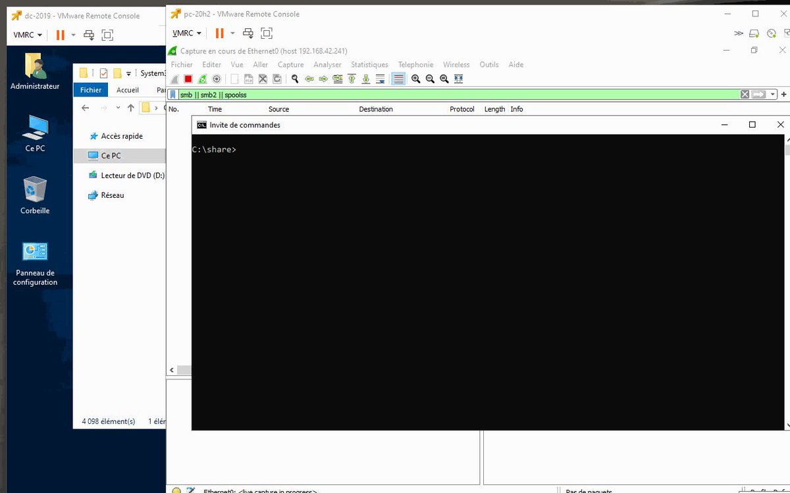

# securestep9
**https://twitter.com/securestep9/status/1410344604944191496 _at 2021-06-30, 21:08:51_**
<blockquote>
What an awesome find and a great write-up by @artsploit on Pre-auth #RCE in ForgeRock OpenAM (CVE-2021-35464). A must-read for any #AppSec professional, #BugBounty hunter or someone trying to learn how #deserialisation attacks work:
 https://t.co/3F6D9zvBtt https://t.co/hTLF6HwuHQ
</blockquote>

* https://portswigger.net/research/pre-auth-rce-in-forgerock-openam-cve-2021-35464

<table><tr>
<td></td>
</table></tr>
<table><tr>
<td>Quotes: <code>1</code></td>
<td>Replies: <code>3</code></td>
<td>Retweets: <code>108</code></td>
<td>Favorites: <code>276</code></td>
</tr></table>

---

# HuntressLabs
**https://twitter.com/HuntressLabs/status/1410293681941356553 _at 2021-06-30, 17:46:30_**
<blockquote>
Update: We’ve posted a blog with more details about CVE-2021-1675, a critical vulnerability that exposes Windows Servers to remote code execution. We’ll continue to post updates to this blog as we learn more. https://t.co/1mHb73pVvI https://t.co/andwkVE1Kv
</blockquote>

* https://hubs.ly/H0Rlf8H0

<table><tr>
<td></td>
</table></tr>
<table><tr>
<td>Quotes: <code>7</code></td>
<td>Replies: <code>1</code></td>
<td>Retweets: <code>21</code></td>
<td>Favorites: <code>49</code></td>
</tr></table>

---

# HuntressLabs
**https://twitter.com/HuntressLabs/status/1410265926528909313 _at 2021-06-30, 15:56:13_**
<blockquote>
Breaking: Huntress is aware of CVE-2021-1675, a critical remote code execution and local privilege escalation vulnerability dubbed as PrintNightmare. The only known mitigation right now is to disable the Print Spooler service. We’re working on a blog post with more details.
</blockquote>

<table><tr>
<td>Quotes: <code>1</code></td>
<td>Replies: <code>0</code></td>
<td>Retweets: <code>24</code></td>
<td>Favorites: <code>82</code></td>
</tr></table>

---

# Truesec
**https://twitter.com/Truesec/status/1410238757136224257 _at 2021-06-30, 14:08:15_**
<blockquote>
Exploitable critical vulnerability allows for full Active Directory compromise. Fully patched systems are vulnerable. Immediate action is strongly recommended! 

Check details here: 

https://t.co/sLpa5DpYUy

#PrintNightmare #CVE-2021-1675
</blockquote>

* https://blog.truesec.com/2021/06/30/exploitable-critical-rce-vulnerability-allows-regular-users-to-fully-compromise-active-directory-printnightmare-cve-2021-1675/

<table><tr>
<td>Quotes: <code>3</code></td>
<td>Replies: <code>1</code></td>
<td>Retweets: <code>22</code></td>
<td>Favorites: <code>34</code></td>
</tr></table>

---

# cyb3rops
**https://twitter.com/cyb3rops/status/1410232292308664323 _at 2021-06-30, 13:42:33_**
<blockquote>
#PrinterNightmare CVE-2021-1675 in a nutshell
- affects print spooler service
- June patch day didn’t resolve the issue
- Local &amp; remote privilege escalation via SMB
- Quick workaround is to disable the service (can have implications &gt; PDF printing etc.)
- 2+ PoCs are public https://t.co/JgO72reeHz
</blockquote>

<table><tr>
<td></td>
</table></tr>
<table><tr>
<td>Quotes: <code>20</code></td>
<td>Replies: <code>11</code></td>
<td>Retweets: <code>231</code></td>
<td>Favorites: <code>460</code></td>
</tr></table>

---

# TheHackersNews
**https://twitter.com/TheHackersNews/status/1410200039675236354 _at 2021-06-30, 11:34:24_**
<blockquote>
🔥 Researchers publish a proof-of-concept exploit for a critical #vulnerability (CVE-2021-1675) affecting #Microsoft Windows operating systems.

Details — https://t.co/e9megsOj6v

#infosec #hacking #cybersecurity
</blockquote>

* https://thehackernews.com/2021/06/researchers-leak-poc-exploit-for.html

<table><tr>
<td>Quotes: <code>15</code></td>
<td>Replies: <code>4</code></td>
<td>Retweets: <code>187</code></td>
<td>Favorites: <code>272</code></td>
</tr></table>

---

# hackerfantastic
**https://twitter.com/hackerfantastic/status/1410100394492112898 _at 2021-06-30, 04:58:27_**
<blockquote>
Fully patched Windows 2019 domain controller, popped with 0day exploit (CVE-2021-1675) from a regular Domain User's account giving full SYSTEM privileges. Disable "Print Spooler" service on servers that do not require it. https://t.co/6SUVQYy5Tl
</blockquote>

<table><tr>
<td></td>
<td></td>
</table></tr>
<table><tr>
<td>Quotes: <code>37</code></td>
<td>Replies: <code>23</code></td>
<td>Retweets: <code>404</code></td>
<td>Favorites: <code>885</code></td>
</tr></table>

---

# hackerfantastic
**https://twitter.com/hackerfantastic/status/1410093171955150851 _at 2021-06-30, 04:29:45_**
<blockquote>
The CVE-2021-1675 PoC works on a fully patched Windows 2019 domain controller. It is in fact effectively a 0day and the patch does not resolve the issue. 

'net stop "Print Spooler"'
</blockquote>

<table><tr>
<td>Quotes: <code>2</code></td>
<td>Replies: <code>2</code></td>
<td>Retweets: <code>16</code></td>
<td>Favorites: <code>35</code></td>
</tr></table>

---

# gentilkiwi
**https://twitter.com/gentilkiwi/status/1410066827590447108 _at 2021-06-30, 02:45:04_**
<blockquote>
This #printnightmare / CVE-2021-1675 is really serious 🤪

Just adapted/simplified original POC then:
*From Remote standard user to SYSTEM*

Here on a domain controller, but valid on all systems with RPC to spooler available, remote or local

➡️ disable service now (no patch yet) https://t.co/qpUFgPUZyh
</blockquote>

<table><tr>
<td></td>
</table></tr>
<table><tr>
<td>Quotes: <code>49</code></td>
<td>Replies: <code>14</code></td>
<td>Retweets: <code>515</code></td>
<td>Favorites: <code>1055</code></td>
</tr></table>

---

# hackerfantastic
**https://twitter.com/hackerfantastic/status/1410046975941263363 _at 2021-06-30, 01:26:11_**
<blockquote>
CVE-2021-1675 PoC can be used to load DLL's into a remote Windows host and a regular domain user can execute code as SYSTEM on a Domain Controller. This issue is trivially exploitable to obtain SYSTEM on a Domain Controller and systems with Print Spooler service enabled.
</blockquote>

<table><tr>
<td>Quotes: <code>10</code></td>
<td>Replies: <code>7</code></td>
<td>Retweets: <code>99</code></td>
<td>Favorites: <code>263</code></td>
</tr></table>

---

# maddiestone
**https://twitter.com/maddiestone/status/1409936902631825408 _at 2021-06-29, 18:08:47_**
<blockquote>
🌟 New 0-day Root Cause Analysis! 🌟

CVE-2021-1905: 0-day in Qualcomm Adreno GPU for Android by Ben Hawkes

https://t.co/abDHuWGFZU
</blockquote>

* https://googleprojectzero.github.io/0days-in-the-wild/0day-RCAs/2021/CVE-2021-1905.html

<table><tr>
<td>Quotes: <code>5</code></td>
<td>Replies: <code>1</code></td>
<td>Retweets: <code>108</code></td>
<td>Favorites: <code>247</code></td>
</tr></table>

---

# TheHackersNews
**https://twitter.com/TheHackersNews/status/1409898390737985545 _at 2021-06-29, 15:35:45_**
<blockquote>
A PoC exploit has been released for a critical unauthenticated RCE vulnerability (CVE-2021-27850) discovered in all recent versions of Apache Tapestry.

https://t.co/w0uucSJU38
</blockquote>

* https://github.com/kahla-sec/CVE-2021-27850_POC

<table><tr>
<td>Quotes: <code>3</code></td>
<td>Replies: <code>1</code></td>
<td>Retweets: <code>64</code></td>
<td>Favorites: <code>108</code></td>
</tr></table>

---

# ShitSecure
**https://twitter.com/ShitSecure/status/1409815256021536769 _at 2021-06-29, 10:05:24_**
<blockquote>
I did not test it but this looks bad for missing June patches:

https://t.co/wBfHy0tzsB

CVE-2021-1675 - Exploit released. https://t.co/pXSnqomZmd
</blockquote>

* https://github.com/afwu/PrintNightmare

<table><tr>
<td></td>
</table></tr>
<table><tr>
<td>Quotes: <code>6</code></td>
<td>Replies: <code>4</code></td>
<td>Retweets: <code>85</code></td>
<td>Favorites: <code>207</code></td>
</tr></table>

---

# blackorbird
**https://twitter.com/blackorbird/status/1409794227731460100 _at 2021-06-29, 08:41:51_**
<blockquote>
#POC 
PrintNightmare (CVE-2021-1675): Remote code execution in Windows Spooler Service 
https://t.co/R3ldQKrXOX https://t.co/B9N2guWdTy
</blockquote>

* https://github.com/hhlxf/PrintNightmare

<table><tr>
<td></td>
<td></td>
</table></tr>
<table><tr>
<td>Quotes: <code>4</code></td>
<td>Replies: <code>2</code></td>
<td>Retweets: <code>101</code></td>
<td>Favorites: <code>235</code></td>
</tr></table>

---

# Raj_Samani
**https://twitter.com/Raj_Samani/status/1409750870900740098 _at 2021-06-29, 05:49:34_**
<blockquote>
Our latest @McAfee_Labs post details our root cause analysis of CVE-2021-1665 – GDI+ Remote Code Execution Vulnerability using WinAFL: https://t.co/amzOzrDedT #cybersecurity #infosec https://t.co/8pr747Zk1F
</blockquote>

* https://www.mcafee.com/blogs/other-blogs/mcafee-labs/analyzing-cve-2021-1665-remote-code-execution-vulnerability-in-windows-gdi/

<table><tr>
<td></td>
</table></tr>
<table><tr>
<td>Quotes: <code>2</code></td>
<td>Replies: <code>0</code></td>
<td>Retweets: <code>23</code></td>
<td>Favorites: <code>36</code></td>
</tr></table>

---

# hardik05
**https://twitter.com/hardik05/status/1409670194042073103 _at 2021-06-29, 00:28:59_**
<blockquote>
My blog from McAfee on CVE-2021-1665. this is something I reported last year and it was fixed in Jan21 patch Tuesday..
 #cybersecurity #infosec #cve-2021-1665 #vulnerability 

enjoy reading!

https://t.co/zY0HMhw10i
</blockquote>

* https://www.mcafee.com/blogs/other-blogs/mcafee-labs/analyzing-cve-2021-1665-remote-code-execution-vulnerability-in-windows-gdi/

<table><tr>
<td>Quotes: <code>5</code></td>
<td>Replies: <code>1</code></td>
<td>Retweets: <code>42</code></td>
<td>Favorites: <code>94</code></td>
</tr></table>

---

# Dinosn
**https://twitter.com/Dinosn/status/1409448513444925444 _at 2021-06-28, 09:48:06_**
<blockquote>
Using CVE-2020-9971 to escape Microsoft Office’s app sandbox https://t.co/jWKQPWhui6
</blockquote>

* https://perception-point.io/using-cve-2020-9971-to-escape-microsoft-offices-app-sandbox/

<table><tr>
<td>Quotes: <code>1</code></td>
<td>Replies: <code>0</code></td>
<td>Retweets: <code>31</code></td>
<td>Favorites: <code>114</code></td>
</tr></table>

---

# RedDrip7
**https://twitter.com/RedDrip7/status/1409353110187757575 _at 2021-06-28, 03:29:00_**
<blockquote>
Recently, we found right approaches to exploit #CVE-2021-1675 successfully, both #LPE and #RCE. It is interesting that the vulnerability was classified into #LPE only by Microsoft, however, it was changed into Remote Code Execution recently.

https://t.co/PQO3B12hoE https://t.co/kbYknK9fBw
</blockquote>

* https://msrc.microsoft.com/update-guide/en-US/vulnerability/CVE-2021-1675

<table><tr>
<td></td>
</table></tr>
<table><tr>
<td>Quotes: <code>11</code></td>
<td>Replies: <code>1</code></td>
<td>Retweets: <code>121</code></td>
<td>Favorites: <code>302</code></td>
</tr></table>

---

# cyber_advising
**https://twitter.com/cyber_advising/status/1408871138898419714 _at 2021-06-26, 19:33:49_**
<blockquote>
CVE-2021-27850: unauthenticated remote code execution vulnerability that was found in all recent versions of Apache Tapestry.

PoC
https://t.co/g9Gj2OHnIZ https://t.co/2AHHLIFVWZ
</blockquote>

* https://github.com/kahla-sec/CVE-2021-27850_POC

<table><tr>
<td></td>
</table></tr>
<table><tr>
<td>Quotes: <code>3</code></td>
<td>Replies: <code>1</code></td>
<td>Retweets: <code>128</code></td>
<td>Favorites: <code>314</code></td>
</tr></table>

---

# chybeta
**https://twitter.com/chybeta/status/1408349352435666951 _at 2021-06-25, 09:00:26_**
<blockquote>
CVE-2021-30179 Apache Dubbo RCE via Java deserialization in the Generic filter 

details
1. https://t.co/fP4YQc88ig
2. https://t.co/mONv0eSvCU https://t.co/h6ZwDgkq2x
</blockquote>

* https://securitylab.github.com/advisories/GHSL-2021-034_043-apache-dubbo/
* https://t.zsxq.com/jEaUB6Q

<table><tr>
<td></td>
</table></tr>
<table><tr>
<td>Quotes: <code>3</code></td>
<td>Replies: <code>1</code></td>
<td>Retweets: <code>95</code></td>
<td>Favorites: <code>217</code></td>
</tr></table>

---

# sec715
**https://twitter.com/sec715/status/1408218852245135362 _at 2021-06-25, 00:21:52_**
<blockquote>
BOOM🔥🔥 Gitlab SSRF (CVE-2021-22214).

POC:
curl -s --show-error -H 'Content-Type: application/json' --data '{ "include_merged_yaml": true, "content": "include:\n  remote: http://x.x.x.x/api/v1/targets?test.yml"}' https://REDACTED/api/v4/ci/lint -k

#SSRF #Gitlab #bugbountytips https://t.co/07NnNq6in0
</blockquote>

<table><tr>
<td></td>
<td></td>
</table></tr>
<table><tr>
<td>Quotes: <code>4</code></td>
<td>Replies: <code>6</code></td>
<td>Retweets: <code>197</code></td>
<td>Favorites: <code>490</code></td>
</tr></table>

---

# CyberWarship
**https://twitter.com/CyberWarship/status/1408115718810447878 _at 2021-06-24, 17:32:03_**
<blockquote>
SMBGhost_RCE_PoC 

RCE PoC for CVE-2020-0796  SMBGhost

#redteam #pentest #infosec
https://t.co/lxZaFahG4c https://t.co/euQgudEHtg
</blockquote>

* https://github.com/chompie1337/SMBGhost_RCE_PoC

<table><tr>
<td></td>
</table></tr>
<table><tr>
<td>Quotes: <code>1</code></td>
<td>Replies: <code>0</code></td>
<td>Retweets: <code>45</code></td>
<td>Favorites: <code>114</code></td>
</tr></table>

---

# ptswarm
**https://twitter.com/ptswarm/status/1408050644460650502 _at 2021-06-24, 13:13:28_**
<blockquote>
🎁PoC for XSS in Cisco ASA (CVE-2020-3580)

POST /+CSCOE+/saml/sp/acs?tgname=a HTTP/1.1
Host: ciscoASA.local
Content-Type: application/x-www-form-urlencoded
Content-Length: 44

SAMLResponse="&gt;&lt;svg/onload=alert('PTSwarm')&gt; https://t.co/c53MKSK9bg
</blockquote>

<table><tr>
<td></td>
</table></tr>
<table><tr>
<td>Quotes: <code>20</code></td>
<td>Replies: <code>16</code></td>
<td>Retweets: <code>283</code></td>
<td>Favorites: <code>666</code></td>
</tr></table>

---

# TheHackersNews
**https://twitter.com/TheHackersNews/status/1407905106910007303 _at 2021-06-24, 03:35:09_**
<blockquote>
Experts share details for a vulnerability (CVE-2021-31958) affecting the MSRPC service, enabling attackers to relay NTLM authentication and open a privileged session with the Event Viewer service, remotely.

https://t.co/twFncdghlU https://t.co/Ux8nrBTDBh
</blockquote>

* https://www.armis.com/blog/security-advisory-windows-event-viewer-service-vulnerable-to-ntlm-relay-attacks/

<table><tr>
<td></td>
</table></tr>
<table><tr>
<td>Quotes: <code>4</code></td>
<td>Replies: <code>0</code></td>
<td>Retweets: <code>79</code></td>
<td>Favorites: <code>126</code></td>
</tr></table>

---

# GHSecurityLab
**https://twitter.com/GHSecurityLab/status/1407740236776542209 _at 2021-06-23, 16:40:01_**
<blockquote>
GHSL-2021-034_043: Multiple pre-auth RCEs in Apache Dubbo - CVE-2021-25641, CVE-2021-30179, CVE-2021-30180, CVE-2021-30181, CVE-2021-32824 https://t.co/6QkyduFmx3
</blockquote>

* https://github.co/3xKShKm

<table><tr>
<td>Quotes: <code>4</code></td>
<td>Replies: <code>0</code></td>
<td>Retweets: <code>45</code></td>
<td>Favorites: <code>105</code></td>
</tr></table>

---

# TheHackersNews
**https://twitter.com/TheHackersNews/status/1407570705500176385 _at 2021-06-23, 05:26:22_**
<blockquote>
A memory leak #vulnerability [CVE-2021-20019] affecting SonicWall #VPN appliances was left unpatched amidst 0-day attacks that could allow remote attackers access to sensitive data.

Read: https://t.co/q1vTXNYcE9

Security patches have now been released.

#infosec #cybersecurity
</blockquote>

* https://thehackernews.com/2021/06/sonicwall-left-vpn-flaw-partially.html

<table><tr>
<td>Quotes: <code>3</code></td>
<td>Replies: <code>1</code></td>
<td>Retweets: <code>70</code></td>
<td>Favorites: <code>100</code></td>
</tr></table>

---

# bad_packets
**https://twitter.com/bad_packets/status/1407487734642470915 _at 2021-06-22, 23:56:40_**
<blockquote>
Ongoing mass scanning activity detected from 91.241.19.51 (🇷🇺) targeting Fortinet VPN servers vulnerable to unauthenticated arbitrary file read (CVE-2018-13379) leading to disclosure of usernames and passwords in plaintext. #threatintel https://t.co/1EeRpuCZrh
</blockquote>

<table><tr>
<td></td>
</table></tr>
<table><tr>
<td>Quotes: <code>2</code></td>
<td>Replies: <code>3</code></td>
<td>Retweets: <code>54</code></td>
<td>Favorites: <code>91</code></td>
</tr></table>

---

# _CPResearch_
**https://twitter.com/_CPResearch_/status/1407359543340941317 _at 2021-06-22, 15:27:17_**
<blockquote>
[CPR-Zero] CVE-2021-31939 (Outlook, Office): Use-After-Free in graph data parsing code in graph.exe https://t.co/AzlW9uAxXo
</blockquote>

* https://cpr-zero.checkpoint.com/vulns/cprid-2164

<table><tr>
<td>Quotes: <code>3</code></td>
<td>Replies: <code>0</code></td>
<td>Retweets: <code>30</code></td>
<td>Favorites: <code>88</code></td>
</tr></table>

---

# Alra3ees
**https://twitter.com/Alra3ees/status/1406624769353601025 _at 2021-06-20, 14:47:33_**
<blockquote>
My second @pdnuclei template is out CVE-2020-11110 - Grafana Unauthenticated Stored XSS.

Discovered by: Ahmed A. Sherif
https://t.co/X9mslmAfXd

The writeup by @serWazito0 

https://t.co/HXoqLVinjI

https://t.co/ivUjglj1Fn
</blockquote>

* https://www.linkedin.com/in/ahmeds93/
* https://ctf-writeup.revers3c.com/challenges/web/CVE-2020-11110/index.html
* https://github.com/projectdiscovery/nuclei-templates/commit/c7a11cd1b1b29a563dbdb9a3032582fda32305d7

<table><tr>
<td>Quotes: <code>2</code></td>
<td>Replies: <code>1</code></td>
<td>Retweets: <code>56</code></td>
<td>Favorites: <code>154</code></td>
</tr></table>

---

# azz_maher
**https://twitter.com/azz_maher/status/1406389083912482816 _at 2021-06-19, 23:11:01_**
<blockquote>
I wrote an LPE for CVE-2014-3153 AKA Towelroot, a bug in the Linux Kernel that was used to root Android devices earlier. The original exploit is closed source and protected against reverse engineering.
PoC + mini write-up here:
https://t.co/uETe1eBnZo https://t.co/8Zm5mgPS4S
</blockquote>

* https://git.io/Jnazk

<table><tr>
<td></td>
</table></tr>
<table><tr>
<td>Quotes: <code>1</code></td>
<td>Replies: <code>1</code></td>
<td>Retweets: <code>77</code></td>
<td>Favorites: <code>258</code></td>
</tr></table>

---

# _darrenmartyn
**https://twitter.com/_darrenmartyn/status/1406346145367007235 _at 2021-06-19, 20:20:24_**
<blockquote>
Submitted a PR containing a @pdnuclei template for CVE-2019-4781, a SonicWall VPN SQL injection bug being exploited in the wild. 
https://t.co/4eBeArEZYP
</blockquote>

* https://github.com/projectdiscovery/nuclei-templates/pull/1734

<table><tr>
<td>Quotes: <code>1</code></td>
<td>Replies: <code>1</code></td>
<td>Retweets: <code>12</code></td>
<td>Favorites: <code>34</code></td>
</tr></table>

---

# almorabea
**https://twitter.com/almorabea/status/1406291853054558213 _at 2021-06-19, 16:44:40_**
<blockquote>
tried to write the exploit code for Polkit privilege escalation CVE-2021-3560, a bug for authentication bypass on polkit. 
The bug allows unprivileged user to call privileged methods using DBus
https://t.co/e7cPjtpTNB #cybersecurity #exploit https://t.co/gIYNLzfE0s
</blockquote>

* https://github.com/Almorabea/Polkit-exploit

<table><tr>
<td></td>
</table></tr>
<table><tr>
<td>Quotes: <code>1</code></td>
<td>Replies: <code>0</code></td>
<td>Retweets: <code>22</code></td>
<td>Favorites: <code>49</code></td>
</tr></table>

---

# mavillon1
**https://twitter.com/mavillon1/status/1405764731932012549 _at 2021-06-18, 05:50:04_**
<blockquote>
Google Chrome 0day WebGL RCE, CVE-2021-30554 #0day #RCE
https://t.co/XS98CnGHYn
</blockquote>

* https://chromium.googlesource.com/chromium/src/+/b77b38a3380c7a5aa2a898cbf4b714e34d9baf70%5E%21/#F0

<table><tr>
<td>Quotes: <code>1</code></td>
<td>Replies: <code>1</code></td>
<td>Retweets: <code>46</code></td>
<td>Favorites: <code>139</code></td>
</tr></table>

---

# blueteamsec1
**https://twitter.com/blueteamsec1/status/1405203910185259009 _at 2021-06-16, 16:41:34_**
<blockquote>
VMware vCenter Server CVE-2021-21985 Remote Code Execution Vulnerability nmap checker script https://t.co/n2ZdEeGsJs #security #threathunting #infosec https://t.co/FlmG2QQF47
</blockquote>

* http://dlvr.it/S1rx2M

<table><tr>
<td></td>
</table></tr>
<table><tr>
<td>Quotes: <code>1</code></td>
<td>Replies: <code>0</code></td>
<td>Retweets: <code>42</code></td>
<td>Favorites: <code>103</code></td>
</tr></table>

---

# ptswarm
**https://twitter.com/ptswarm/status/1405165793982169100 _at 2021-06-16, 14:10:06_**
<blockquote>
SonicWall fixed a Post-Auth RCE (CVE-2021-20026) in Network Security Manager and an Unauth Buffer Overflow (CVE-2021-20027) in SonicOS found by our researcher Nikita Abramov.

Advisory: https://t.co/KwRB308mYc https://t.co/Dy6hRzXQk5
</blockquote>

* https://psirt.global.sonicwall.com/vuln-detail/SNWLID-2021-0014

<table><tr>
<td></td>
</table></tr>
<table><tr>
<td>Quotes: <code>3</code></td>
<td>Replies: <code>0</code></td>
<td>Retweets: <code>66</code></td>
<td>Favorites: <code>140</code></td>
</tr></table>

---

# _dirkjan
**https://twitter.com/_dirkjan/status/1403108449060282368 _at 2021-06-10, 21:54:57_**
<blockquote>
It's been long overdue, but my part 2 blog on Active Directory forest trusts is finally here! This blog is about trust transitivity and on the finding on CVE-2020-0665 which was a trust bypass by faking a domain. Enjoy the (long) read: https://t.co/4CACl2pbpY https://t.co/ZkG9Kbbv6c
</blockquote>

* https://dirkjanm.io/active-directory-forest-trusts-part-two-trust-transitivity/

<table><tr>
<td></td>
</table></tr>
<table><tr>
<td>Quotes: <code>7</code></td>
<td>Replies: <code>10</code></td>
<td>Retweets: <code>299</code></td>
<td>Favorites: <code>702</code></td>
</tr></table>

---

# GHSecurityLab
**https://twitter.com/GHSecurityLab/status/1403031420470190083 _at 2021-06-10, 16:48:52_**
<blockquote>
CVE-2021-3560 exploitation demo: https://t.co/be3uMBlUfg
</blockquote>

* https://www.youtube.com/watch?v=QZhz64yEd0g

<table><tr>
<td>Quotes: <code>12</code></td>
<td>Replies: <code>1</code></td>
<td>Retweets: <code>60</code></td>
<td>Favorites: <code>187</code></td>
</tr></table>

---

# GHSecurityLab
**https://twitter.com/GHSecurityLab/status/1403022518529761285 _at 2021-06-10, 16:13:29_**
<blockquote>
Kill -9 your way to root on most modern Linux using @kevin_backhouse's latest polkit finding (CVE-2021-3560) https://t.co/sW6YS9CCPr
</blockquote>

* https://github.blog/2021-06-10-privilege-escalation-polkit-root-on-linux-with-bug/

<table><tr>
<td>Quotes: <code>57</code></td>
<td>Replies: <code>11</code></td>
<td>Retweets: <code>624</code></td>
<td>Favorites: <code>1401</code></td>
</tr></table>

---

# uuallan
**https://twitter.com/uuallan/status/1402706709198561284 _at 2021-06-09, 19:18:35_**
<blockquote>
This write-up about the ransomware challenges by @GossiTheDog is worth the 21 minute read. This passage struck me as especially relevant given the release of CVE-2021-31963, an RCE against SharePoint, yesterday. 
1/2
https://t.co/PSlP5fCnUO https://t.co/NH1qWhY0KV
</blockquote>

* https://doublepulsar.com/the-hard-truth-about-ransomware-we-arent-prepared-it-s-a-battle-with-new-rules-and-it-hasn-t-a93ad3030a54

<table><tr>
<td></td>
</table></tr>
<table><tr>
<td>Quotes: <code>8</code></td>
<td>Replies: <code>3</code></td>
<td>Retweets: <code>37</code></td>
<td>Favorites: <code>143</code></td>
</tr></table>

---

# ptswarm
**https://twitter.com/ptswarm/status/1402644004781633540 _at 2021-06-09, 15:09:25_**
<blockquote>
Atlassian Jira Unauth User Enumeration (CVE-2020-36289) discovered by our researcher Mikhail Klyuchnikov.

 Jira &lt; 8.5.13
 8.6.0 ≤ Jira &lt; 8.13.5
 8.14.0 ≤ Jira &lt; 8.15.1

PoC: /secure/QueryComponentRendererValue!Default.jspa?assignee=user:admin

Advisory: https://t.co/Odybr3uSkD https://t.co/iAsgUgsgHA
</blockquote>

* https://jira.atlassian.com/browse/JRASERVER-71559

<table><tr>
<td></td>
</table></tr>
<table><tr>
<td>Quotes: <code>2</code></td>
<td>Replies: <code>5</code></td>
<td>Retweets: <code>128</code></td>
<td>Favorites: <code>355</code></td>
</tr></table>

---

# mavillon1
**https://twitter.com/mavillon1/status/1402521099125014528 _at 2021-06-09, 07:01:02_**
<blockquote>
I republished my exploit POC and full code. 
CVE-2021-26868 LPE, CVE-2021-33739 #0day #lpe #exploit
https://t.co/dMXSoQZYju
</blockquote>

* https://github.com/mavillon1/CVE-2021-33739-POC

<table><tr>
<td>Quotes: <code>2</code></td>
<td>Replies: <code>2</code></td>
<td>Retweets: <code>54</code></td>
<td>Favorites: <code>92</code></td>
</tr></table>

---

# cyber_advising
**https://twitter.com/cyber_advising/status/1402038550066089990 _at 2021-06-07, 23:03:33_**
<blockquote>
CVE-2021-22911: Pre-Auth Blind NoSQL Injection leading to Remote Code Execution in Rocket Chat 3.12.1

PoC
https://t.co/TzccUkebdQ https://t.co/kgt1nuV2g7
</blockquote>

* https://github.com/CsEnox/CVE-2021-22911

<table><tr>
<td></td>
</table></tr>
<table><tr>
<td>Quotes: <code>1</code></td>
<td>Replies: <code>1</code></td>
<td>Retweets: <code>30</code></td>
<td>Favorites: <code>72</code></td>
</tr></table>

---

# csenox1
**https://twitter.com/csenox1/status/1401235661319901184 _at 2021-06-05, 17:53:10_**
<blockquote>
Wrote an exploit for CVE-2021-22911, which is a NoSQL injection leading to RCE in Rocket Chat 3.12.1.
https://t.co/FWl3WWOdsW
</blockquote>

* https://github.com/CsEnox/CVE-2021-22911

<table><tr>
<td>Quotes: <code>2</code></td>
<td>Replies: <code>3</code></td>
<td>Retweets: <code>7</code></td>
<td>Favorites: <code>35</code></td>
</tr></table>

---

# ptracesecurity
**https://twitter.com/ptracesecurity/status/1401200396450869251 _at 2021-06-05, 15:33:02_**
<blockquote>
PoC for CVE-2021-28476 a guest-to-host "Hyper-V Remote Code Execution Vulnerability" in vmswitch.sys.  https://t.co/VRt3RCHWJl  #Pentesting #RCE #CVE #Vulnerability #CyberSecurity #Infosec https://t.co/7hJcm0tkVr
</blockquote>

* https://github.com/0vercl0k/CVE-2021-28476

<table><tr>
<td></td>
<td></td>
</table></tr>
<table><tr>
<td>Quotes: <code>4</code></td>
<td>Replies: <code>0</code></td>
<td>Retweets: <code>62</code></td>
<td>Favorites: <code>91</code></td>
</tr></table>

---

# TheHackersNews
**https://twitter.com/TheHackersNews/status/1401132711654289409 _at 2021-06-05, 11:04:04_**
<blockquote>
ALERT — Cybercriminals are actively scanning the Internet for #VMware vCenter servers that have not yet been patched against a recently disclosed critical RCE #vulnerability.

(CVE-2021-21985 / CVSS score 9.8)
https://t.co/NZeg25yUo2

#infosec #malware #cybersecurity #cyberattack
</blockquote>

* https://thehackernews.com/2021/06/alert-critical-rce-bug-in-vmware.html

<table><tr>
<td>Quotes: <code>9</code></td>
<td>Replies: <code>9</code></td>
<td>Retweets: <code>175</code></td>
<td>Favorites: <code>210</code></td>
</tr></table>

---

# USCERT_gov
**https://twitter.com/USCERT_gov/status/1400952001530417153 _at 2021-06-04, 23:06:00_**
<blockquote>
.@CISAgov is aware of the likelihood that cyber threat actors are attempting to exploit CVE-2021-21985, a remote code execution vulnerability in VMware vCenter Server and VMware Cloud Foundation. Learn more at https://t.co/kr3plGmCmz.
</blockquote>

* https://go.usa.gov/x6bA5

<table><tr>
<td>Quotes: <code>21</code></td>
<td>Replies: <code>3</code></td>
<td>Retweets: <code>182</code></td>
<td>Favorites: <code>276</code></td>
</tr></table>

---

# testanull
**https://twitter.com/testanull/status/1400789548284596229 _at 2021-06-04, 12:20:28_**
<blockquote>
Finally got direct shell of CVE-2021-21985 without RMI https://t.co/dorOlUywHu
</blockquote>

<table><tr>
<td></td>
</table></tr>
<table><tr>
<td>Quotes: <code>9</code></td>
<td>Replies: <code>8</code></td>
<td>Retweets: <code>79</code></td>
<td>Favorites: <code>357</code></td>
</tr></table>

---

# binitamshah
**https://twitter.com/binitamshah/status/1400755341021773826 _at 2021-06-04, 10:04:32_**
<blockquote>
How we used 32gb of RAM to exploit a zero-day WebAssembly Vulnerability (CVE-2021-30734) in Apple Safari (Exploitation of a JavaScriptCore WebAssembly Vulnerability) : https://t.co/vVAnHAanQ4 credits @ret2systems https://t.co/9RxMaa2l8c
</blockquote>

* https://blog.ret2.io/2021/06/02/pwn2own-2021-jsc-exploit/

<table><tr>
<td></td>
</table></tr>
<table><tr>
<td>Quotes: <code>2</code></td>
<td>Replies: <code>1</code></td>
<td>Retweets: <code>22</code></td>
<td>Favorites: <code>75</code></td>
</tr></table>

---

# 0x_Akoko
**https://twitter.com/0x_Akoko/status/1400745860422537217 _at 2021-06-04, 09:26:52_**
<blockquote>
I have pushed a nuclei template for Mediumish WordPress Theme &lt;= 1.0.47 - Unauthenticated Reflected XSS &amp; XFS (CVE-2021-24316)

enjoy :-) https://t.co/ZRV8KxKwlg
</blockquote>

<table><tr>
<td></td>
</table></tr>
<table><tr>
<td>Quotes: <code>0</code></td>
<td>Replies: <code>2</code></td>
<td>Retweets: <code>16</code></td>
<td>Favorites: <code>91</code></td>
</tr></table>

---

# wugeej
**https://twitter.com/wugeej/status/1400336603604668418 _at 2021-06-03, 06:20:37_**
<blockquote>
#Apache Airflow 1.10.10 RCE
(CVE-2020-11978 CVE-2020-13927)

The CVE-2020-13927 vulnerability to Apache Airflow Authentication Bypass.

The CVE-2020-11978 vulnerability is exploited to insert remote execution code into Apache Airflow worker/scheduler.

https://t.co/zxUkhxG3xw https://t.co/4ewEDfDPqi
</blockquote>

* https://xz.aliyun.com/t/8037#toc-4

<table><tr>
<td></td>
</table></tr>
<table><tr>
<td>Quotes: <code>1</code></td>
<td>Replies: <code>1</code></td>
<td>Retweets: <code>20</code></td>
<td>Favorites: <code>56</code></td>
</tr></table>

---

# testanull
**https://twitter.com/testanull/status/1400335066350292992 _at 2021-06-03, 06:14:31_**
<blockquote>
Quick confirm that this is the real PoC of CVE-2021-21985 👍 https://t.co/jsXKFf1lZZ
</blockquote>

<table><tr>
<td></td>
</table></tr>
<table><tr>
<td>Quotes: <code>3</code></td>
<td>Replies: <code>2</code></td>
<td>Retweets: <code>31</code></td>
<td>Favorites: <code>104</code></td>
</tr></table>

---

# ptracesecurity
**https://twitter.com/ptracesecurity/status/1400314975151874049 _at 2021-06-03, 04:54:41_**
<blockquote>
Exploiting Windows RPC to bypass CFG mitigation: analysis of CVE-2021-26411 in-the-wild sample  https://t.co/3MXtAo0Gxn  #Pentesting #CVE #Windows #Exploit #Infosec https://t.co/ZuqlYDwca6
</blockquote>

* https://iamelli0t.github.io/2021/04/10/RPC-Bypass-CFG.html

<table><tr>
<td></td>
<td></td>
<td></td>
<td></td>
</table></tr>
<table><tr>
<td>Quotes: <code>2</code></td>
<td>Replies: <code>0</code></td>
<td>Retweets: <code>42</code></td>
<td>Favorites: <code>83</code></td>
</tr></table>

---

# ptracesecurity
**https://twitter.com/ptracesecurity/status/1399970062304378884 _at 2021-06-02, 06:04:07_**
<blockquote>
PoC for CVE-2021-28476 a guest-to-host "Hyper-V Remote Code Execution Vulnerability" in vmswitch.sys.  https://t.co/VRt3RCqlkL  #Pentesting #RCE #Vulnerability #Infosec https://t.co/hhgScuOvqh
</blockquote>

* https://github.com/0vercl0k/CVE-2021-28476

<table><tr>
<td></td>
<td></td>
</table></tr>
<table><tr>
<td>Quotes: <code>1</code></td>
<td>Replies: <code>0</code></td>
<td>Retweets: <code>12</code></td>
<td>Favorites: <code>37</code></td>
</tr></table>

---

# ptswarm
**https://twitter.com/ptswarm/status/1399759160967938054 _at 2021-06-01, 16:06:04_**
<blockquote>
💥Fortinet fixed a Post-Auth RCE in FortiWeb (CVE-2021-22123) found by our researcher Andrey Medov.

This vulnerability was part of an Unauth RCE chain submitted together with CVE-2020-29015 (Unauth SQL Injection), fixed by Fortinet earlier.

Advisory: https://t.co/Xk0zQQpx7y https://t.co/HSh7LZMXRf
</blockquote>

* https://www.fortiguard.com/psirt/FG-IR-20-120

<table><tr>
<td></td>
</table></tr>
<table><tr>
<td>Quotes: <code>4</code></td>
<td>Replies: <code>1</code></td>
<td>Retweets: <code>90</code></td>
<td>Favorites: <code>231</code></td>
</tr></table>

---

