# cyber_advising
**https://twitter.com/cyber_advising/status/1421077794990301186 _at 2021-07-30, 11:58:43_**
<blockquote>
Linux LPE exploit for CVE-2021-3490: Tested on Ubuntu 20.10 (Groovy Gorilla) kernels 5.8.0-25.26 through 5.8.0-52.58. and Ubuntu 21.04 (Hirsute Hippo) 5.11.0-16.17.
https://t.co/odX9GHapF7 https://t.co/njjkdGvRxm
</blockquote>

* https://github.com/chompie1337/Linux_LPE_eBPF_CVE-2021-3490

<table><tr>
<td>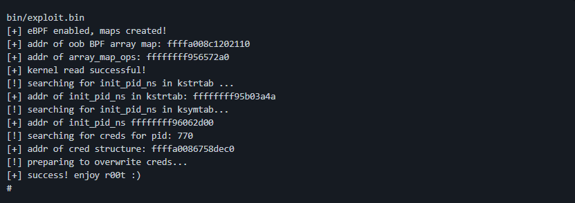</td>
</table></tr>
<table><tr>
<td>Quotes: <code>2</code></td>
<td>Replies: <code>1</code></td>
<td>Retweets: <code>38</code></td>
<td>Favorites: <code>71</code></td>
</tr></table>

---

# dozernz
**https://twitter.com/dozernz/status/1420943732170379271 _at 2021-07-30, 03:06:00_**
<blockquote>
Added a new blog post on how I developed a proof of concept exploit for the Jira DC RCE (CVE-2020-36239), including what I did wrong along the way :)

https://t.co/9zyHFhkVMf
</blockquote>

* https://dozer.nz/posts/CVE-2020-36239-POC-dev

<table><tr>
<td>Quotes: <code>1</code></td>
<td>Replies: <code>4</code></td>
<td>Retweets: <code>65</code></td>
<td>Favorites: <code>143</code></td>
</tr></table>

---

# bad_packets
**https://twitter.com/bad_packets/status/1420829619473715203 _at 2021-07-29, 19:32:33_**
<blockquote>
Ongoing mass scanning activity detected from 31.44.185.6 (🇷🇺) targeting Fortinet VPN servers vulnerable to unauthenticated arbitrary file read (CVE-2018-13379) leading to disclosure of usernames and passwords in plaintext. #threatintel https://t.co/V7fHqPz6Ae
</blockquote>

<table><tr>
<td>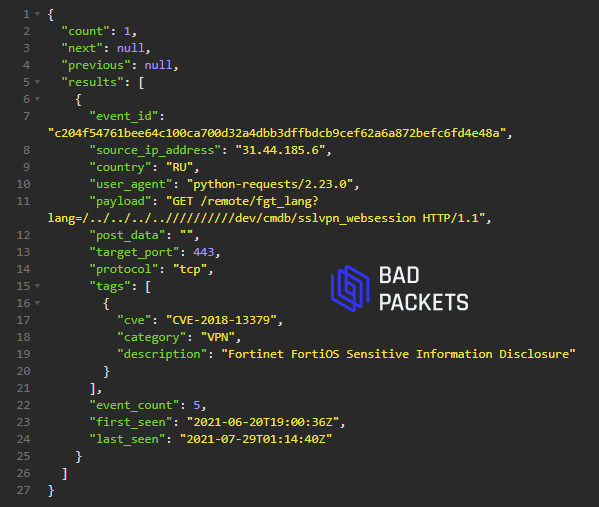</td>
</table></tr>
<table><tr>
<td>Quotes: <code>0</code></td>
<td>Replies: <code>1</code></td>
<td>Retweets: <code>20</code></td>
<td>Favorites: <code>31</code></td>
</tr></table>

---

# chompie1337
**https://twitter.com/chompie1337/status/1420801410917089281 _at 2021-07-29, 17:40:28_**
<blockquote>
Here's the LPE PoC exploit for CVE-2021-3490. It works on fresh installs of both Ubuntu 20.10 and 21.04
https://t.co/uTVx6TLF7e
</blockquote>

* https://github.com/chompie1337/Linux_LPE_eBPF_CVE-2021-3490

<table><tr>
<td>Quotes: <code>5</code></td>
<td>Replies: <code>9</code></td>
<td>Retweets: <code>97</code></td>
<td>Favorites: <code>277</code></td>
</tr></table>

---

# chompie1337
**https://twitter.com/chompie1337/status/1420800888273244162 _at 2021-07-29, 17:38:23_**
<blockquote>
So excited to finally release my blog post- Kernel Pwning with eBPF: a Love Story. I cover eBPF, the verifier, debugging, exploitation, mitigations and other cool findings! I do root cause analysis and exploit CVE-2021-3490 for LPE with PoC included. https://t.co/pWt1psHEFa
</blockquote>

* https://www.graplsecurity.com/post/kernel-pwning-with-ebpf-a-love-story

<table><tr>
<td>Quotes: <code>40</code></td>
<td>Replies: <code>40</code></td>
<td>Retweets: <code>624</code></td>
<td>Favorites: <code>1946</code></td>
</tr></table>

---

# thezdi
**https://twitter.com/thezdi/status/1420407578551595009 _at 2021-07-28, 15:35:31_**
<blockquote>
In a guest blog, security researcher Marcin Wiązowski details CVE-2021-27077 - getting privilege escalation on #Windows by selecting bitmaps into mismatched devices. He provides detailed root cause analysis &amp; looks at the patch from #Microsoft.
https://t.co/lwkjZfhTSS
</blockquote>

* https://www.zerodayinitiative.com/blog/2021/7/26/cve-2021-27077-selecting-bitmaps-into-mismatched-device-contexts

<table><tr>
<td>Quotes: <code>3</code></td>
<td>Replies: <code>0</code></td>
<td>Retweets: <code>66</code></td>
<td>Favorites: <code>111</code></td>
</tr></table>

---

# mobilesecurity_
**https://twitter.com/mobilesecurity_/status/1420156018093330436 _at 2021-07-27, 22:55:54_**
<blockquote>
IOMobileFrameBuffer_LPE_POC - writeup of the recent LPE fixed in iOS 14.7.1 (CVE-2021-30807) 🔥
#MobileSecurity #iOSsecurity by @AmarSaar 
https://t.co/ildryG5c6i
</blockquote>

* https://saaramar.github.io/IOMobileFrameBuffer_LPE_POC/

<table><tr>
<td>Quotes: <code>1</code></td>
<td>Replies: <code>0</code></td>
<td>Retweets: <code>11</code></td>
<td>Favorites: <code>32</code></td>
</tr></table>

---

# hasherezade
**https://twitter.com/hasherezade/status/1419883049769111552 _at 2021-07-27, 04:51:13_**
<blockquote>
It seems #PurpleFoxEK added a new exploit to its dropper: https://t.co/5cDNdc52QS :  CVE-2021-1675-LPE
</blockquote>

* https://www.virustotal.com/gui/file/2788d54386bc5fc9a021b71dc179b175fde30d35bd94c3b3756dfc437f3722f6/community

<table><tr>
<td>Quotes: <code>1</code></td>
<td>Replies: <code>0</code></td>
<td>Retweets: <code>26</code></td>
<td>Favorites: <code>67</code></td>
</tr></table>

---

# peterjson
**https://twitter.com/peterjson/status/1418839879383805953 _at 2021-07-24, 07:46:02_**
<blockquote>
1day analysis always fun, sometimes you can find 0day after that process. And CVE-2021-2456 is an achievement for myself while doing 1day analysis. The gadget chain I bypass the blacklist can trigger from AMF to Java Deserialization also, fruitful RCE 😋
https://t.co/Bk6gHjBJOc
</blockquote>

* https://www.zerodayinitiative.com/advisories/ZDI-21-885/

<table><tr>
<td>Quotes: <code>1</code></td>
<td>Replies: <code>4</code></td>
<td>Retweets: <code>14</code></td>
<td>Favorites: <code>77</code></td>
</tr></table>

---

# peterjson
**https://twitter.com/peterjson/status/1418578782491795457 _at 2021-07-23, 14:28:32_**
<blockquote>
Analysis about CVE-2020-36239
1) Jira must be configed as cluster to enable Ehcache RMI
2) Env: test on Jira 8.5.10 + JDK 8u202
3) RMI Deserialization with UnicastRemoteObject chain bypass JEP290 (require OOB req to JRMP Server with BeanShell1 for RCE) https://t.co/Y6cnouCyvz
</blockquote>

<table><tr>
<td>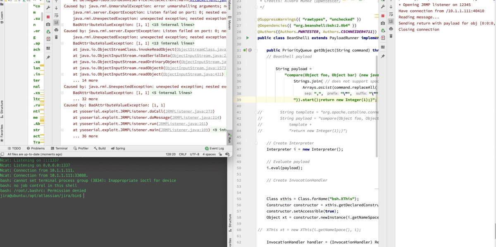</td>
</table></tr>
<table><tr>
<td>Quotes: <code>2</code></td>
<td>Replies: <code>4</code></td>
<td>Retweets: <code>23</code></td>
<td>Favorites: <code>108</code></td>
</tr></table>

---

# thezdi
**https://twitter.com/thezdi/status/1417866121261338627 _at 2021-07-21, 15:16:40_**
<blockquote>
Underflowing in the clouds. @hosselot details CVE-2021-31969 - an integer underflow bug in the #Windows Cloud Filter API that could allow a local privilege escalation. Read the details at https://t.co/oUI2dEILET
</blockquote>

* https://www.zerodayinitiative.com/blog/2021/7/19/cve-2021-31969-underflowing-in-the-clouds

<table><tr>
<td>Quotes: <code>1</code></td>
<td>Replies: <code>0</code></td>
<td>Retweets: <code>32</code></td>
<td>Favorites: <code>71</code></td>
</tr></table>

---

# CyberWarship
**https://twitter.com/CyberWarship/status/1417809846733320194 _at 2021-07-21, 11:33:03_**
<blockquote>
WSUS Attacks Part 1: Introducing PyWSUS

#infosec #pentest #redteam
https://t.co/3LjBNCiBkN

WSUS Attacks Part 2: CVE-2020-1013 a Windows 10 Local Privilege Escalation 1-Day

#infosec #pentest #redteam
https://t.co/U0TRNRinh1 https://t.co/5Pzyhi3vHk
</blockquote>

* https://www.gosecure.net/blog/2020/09/03/wsus-attacks-part-1-introducing-pywsus/
* https://www.gosecure.net/blog/2020/09/08/wsus-attacks-part-2-cve-2020-1013-a-windows-10-local-privilege-escalation-1-day/

<table><tr>
<td>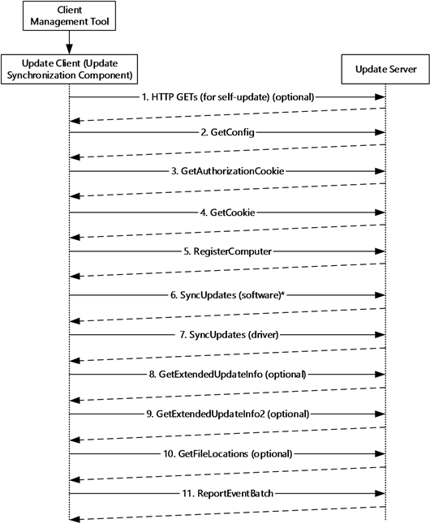</td>
<td>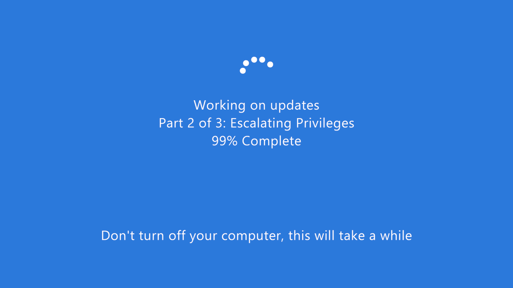</td>
</table></tr>
<table><tr>
<td>Quotes: <code>0</code></td>
<td>Replies: <code>0</code></td>
<td>Retweets: <code>77</code></td>
<td>Favorites: <code>150</code></td>
</tr></table>

---

# Alshakarti
**https://twitter.com/Alshakarti/status/1417774462456549378 _at 2021-07-21, 09:12:27_**
<blockquote>
Updated with official recommended workarounds from Microsoft - HiveNightmare a.k.a. SeriousSam Local Privilege Escalation in Windows – CVE-2021-36934

#Truesec #Windows #Security
 https://t.co/nXW6D4BkK4
</blockquote>

* https://blog.truesec.com/2021/07/20/hivenightmare-a-k-a-serioussam-local-privilege-escalation-in-windows/

<table><tr>
<td>Quotes: <code>1</code></td>
<td>Replies: <code>0</code></td>
<td>Retweets: <code>26</code></td>
<td>Favorites: <code>46</code></td>
</tr></table>

---

# BleepinComputer
**https://twitter.com/BleepinComputer/status/1417526507241627650 _at 2021-07-20, 16:47:10_**
<blockquote>
@serghei The local privilege escalation bug (dubbed Sequoia) found in the Linux Kernel's filesystem layer is being tracked as CVE-2021-33909 and it impacts all Linux kernel versions released since 2014.

https://t.co/rAme1sGDIG
</blockquote>

* https://www.bleepingcomputer.com/news/security/new-linux-kernel-bug-lets-you-get-root-on-most-modern-distros/

<table><tr>
<td>Quotes: <code>4</code></td>
<td>Replies: <code>3</code></td>
<td>Retweets: <code>46</code></td>
<td>Favorites: <code>60</code></td>
</tr></table>

---

# qualys
**https://twitter.com/qualys/status/1417502431496134657 _at 2021-07-20, 15:11:30_**
<blockquote>
Sequoia: A Local Privilege Escalation Vulnerability in Linux’s Filesystem Layer (CVE-2021-33909): Any unprivileged user can gain root privileges on a vulnerable host by exploiting this vulnerability in a default configuration. https://t.co/1j9E2opCu5
</blockquote>

* https://blog.qualys.com/vulnerabilities-threat-research/2021/07/20/sequoia-a-local-privilege-escalation-vulnerability-in-linuxs-filesystem-layer-cve-2021-33909

<table><tr>
<td>Quotes: <code>10</code></td>
<td>Replies: <code>3</code></td>
<td>Retweets: <code>177</code></td>
<td>Favorites: <code>306</code></td>
</tr></table>

---

# TheHackersNews
**https://twitter.com/TheHackersNews/status/1417451577162428426 _at 2021-07-20, 11:49:25_**
<blockquote>
A new use-after-free vulnerability has been discovered in FortiManager and FortiAnalyzer that could allow a remote, unauthenticated attacker to execute arbitrary code as root.

https://t.co/eZ5aimE0cn

Patches are now available for CVE-2021-32589. https://t.co/3KtptQpstc
</blockquote>

* https://www.fortiguard.com/psirt/FG-IR-21-067

<table><tr>
<td>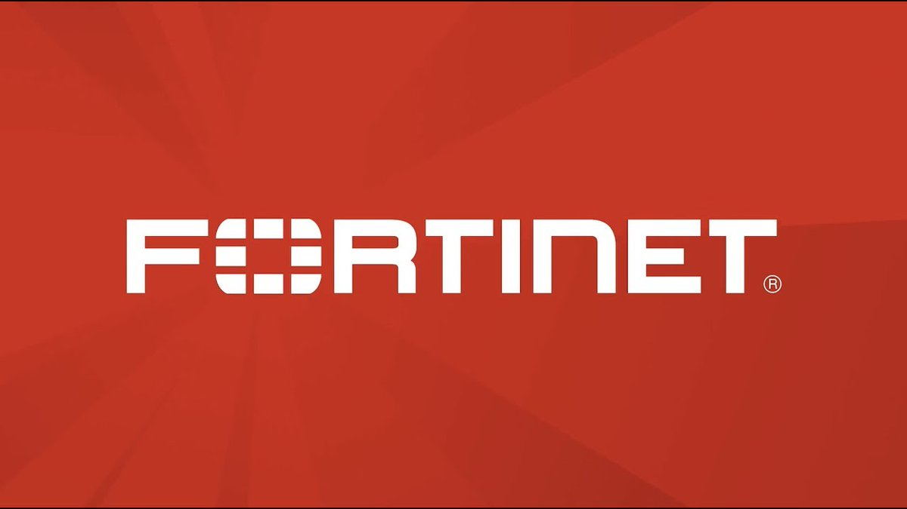</td>
</table></tr>
<table><tr>
<td>Quotes: <code>3</code></td>
<td>Replies: <code>2</code></td>
<td>Retweets: <code>49</code></td>
<td>Favorites: <code>88</code></td>
</tr></table>

---

# blackorbird
**https://twitter.com/blackorbird/status/1415916903449518080 _at 2021-07-16, 06:11:10_**
<blockquote>
#APT Candiru(SOURGUM) target 100 victims in Palestine, Israel, Iran, Lebanon, Yemen, Spain, United Kingdom, Turkey, Armenia, and Singapore. 
ref
CHAINSHOTStealth Falcon&amp;SandCat
1.https://t.co/H1ZzA6h7NO
Windows 0day exploits CVE-2021-31979&amp;CVE-2021-33771
2.https://t.co/FSUqntYonn https://t.co/9CD86reYti
</blockquote>

* https://citizenlab.ca/2021/07/hooking-candiru-another-mercenary-spyware-vendor-comes-into-focus/
* https://www.microsoft.com/security/blog/2021/07/15/protecting-customers-from-a-private-sector-offensive-actor-using-0-day-exploits-and-devilstongue-malware/

<table><tr>
<td>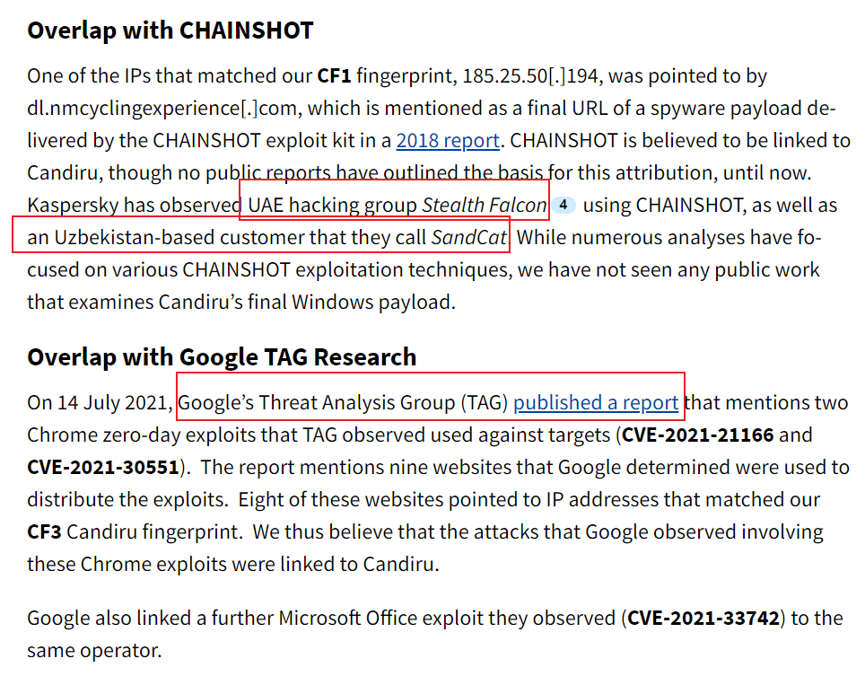</td>
<td>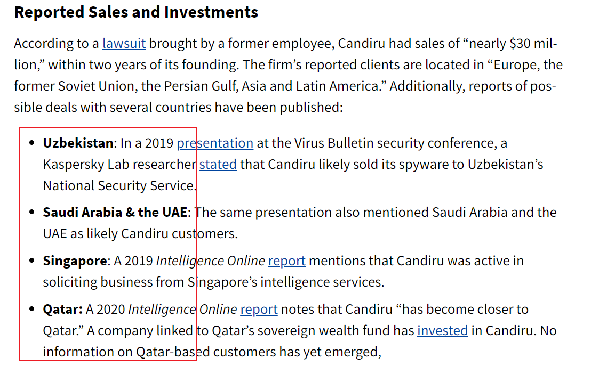</td>
</table></tr>
<table><tr>
<td>Quotes: <code>0</code></td>
<td>Replies: <code>0</code></td>
<td>Retweets: <code>19</code></td>
<td>Favorites: <code>34</code></td>
</tr></table>

---

# TheHackersNews
**https://twitter.com/TheHackersNews/status/1415901769511538691 _at 2021-07-16, 05:11:02_**
<blockquote>
Google has pushed out a new security update for the #Chrome browser for Windows, Mac and #Linux that fixes several vulnerabilities, including a zero-day #vulnerability (CVE-2021-30563) that #Google says is being exploited in the wild.

Read: https://t.co/4CMJnGagxd

#infosec
</blockquote>

* https://thehackernews.com/2021/07/update-your-chrome-browser-to-patch-new.html

<table><tr>
<td>Quotes: <code>10</code></td>
<td>Replies: <code>3</code></td>
<td>Retweets: <code>157</code></td>
<td>Favorites: <code>177</code></td>
</tr></table>

---

# mavillon1
**https://twitter.com/mavillon1/status/1415863048154255363 _at 2021-07-16, 02:37:10_**
<blockquote>
Chrome RCE 0day CVE-2021-30563: CodeGenerator::AddTranslationForOperand bug #chrome #rce #0day 
https://t.co/pz7yI61SCm
</blockquote>

* https://chromium-review.googlesource.com/c/v8/v8/+/3027260

<table><tr>
<td>Quotes: <code>1</code></td>
<td>Replies: <code>0</code></td>
<td>Retweets: <code>35</code></td>
<td>Favorites: <code>97</code></td>
</tr></table>

---

# campuscodi
**https://twitter.com/campuscodi/status/1415857065361383428 _at 2021-07-16, 02:13:24_**
<blockquote>
NEW: Google patches Chrome zero-day, eighth one in 2021

➡️Zero-day is CVE-2021-30563
➡️Update to Chrome 91.0.4472.164

https://t.co/8mEwF1AKtA https://t.co/uKocwk9KNu
</blockquote>

* https://therecord.media/google-patches-chrome-zero-day-eighth-one-in-2021/

<table><tr>
<td></td>
</table></tr>
<table><tr>
<td>Quotes: <code>3</code></td>
<td>Replies: <code>1</code></td>
<td>Retweets: <code>26</code></td>
<td>Favorites: <code>51</code></td>
</tr></table>

---

# campuscodi
**https://twitter.com/campuscodi/status/1415824891547459590 _at 2021-07-16, 00:05:33_**
<blockquote>
Microsoft has assigned a third CVE for the PrintNightmare series.

This one is for the EoP bug that was discovered after the RCE patches (CVE-2021-34527) at the start of July.

The advisory includes just workarounds for now. No actual patches out.
</blockquote>

<table><tr>
<td>Quotes: <code>5</code></td>
<td>Replies: <code>6</code></td>
<td>Retweets: <code>94</code></td>
<td>Favorites: <code>144</code></td>
</tr></table>

---

# msftsecresponse
**https://twitter.com/msftsecresponse/status/1415820752343891968 _at 2021-07-15, 23:49:06_**
<blockquote>
MSRC has release CVE-2021-34481 today.
https://t.co/WAmhJutmuN
</blockquote>

* https://msrc.microsoft.com/update-guide/vulnerability/CVE-2021-34481

<table><tr>
<td>Quotes: <code>56</code></td>
<td>Replies: <code>15</code></td>
<td>Retweets: <code>189</code></td>
<td>Favorites: <code>320</code></td>
</tr></table>

---

# nixcraft
**https://twitter.com/nixcraft/status/1415585415608819715 _at 2021-07-15, 08:13:58_**
<blockquote>
CVE-2021-22555 is a 15 years old heap out-of-bounds write vulnerability in Linux Netfilter that is powerful enough to bypass all modern security mitigations and achieve kernel code execution. https://t.co/T4Q83KRKwt Patch your Linux kernel ASAP. Stay safe.#infosec #security #0day
</blockquote>

* https://google.github.io/security-research/pocs/linux/cve-2021-22555/writeup.html

<table><tr>
<td>Quotes: <code>0</code></td>
<td>Replies: <code>4</code></td>
<td>Retweets: <code>69</code></td>
<td>Favorites: <code>104</code></td>
</tr></table>

---

# BobMahar
**https://twitter.com/BobMahar/status/1415505844918263812 _at 2021-07-15, 02:57:46_**
<blockquote>
@Microsoft 2 days later:

CVE-2021-7960 - Clippy Emoji Remote Code Execution Vulnerability.  A remote code execution vulnerability exists whenever the Clippy Emoji is displayed.  An attacker who successfully exploited this vulnerability could run arbitrary code with SYSTEM privileges. https://t.co/5PPv4oNURr
</blockquote>

<table><tr>
<td></td>
</table></tr>
<table><tr>
<td>Quotes: <code>7</code></td>
<td>Replies: <code>5</code></td>
<td>Retweets: <code>19</code></td>
<td>Favorites: <code>238</code></td>
</tr></table>

---

# blackorbird
**https://twitter.com/blackorbird/status/1415500445351432192 _at 2021-07-15, 02:36:19_**
<blockquote>
APT Campaign targeting Armenian users:
Chrome:CVE-2021-21166&amp;CVE-2021-30551
Internet Explorer:CVE-2021-33742'
APT29:
WebKit (Safari):CVE-2021-1879
collect authentication cookies
IOC:
https://t.co/03UuSYzgZe https://t.co/nSrVMr0m7N
</blockquote>

* https://blog.google/threat-analysis-group/how-we-protect-users-0-day-attacks/

<table><tr>
<td>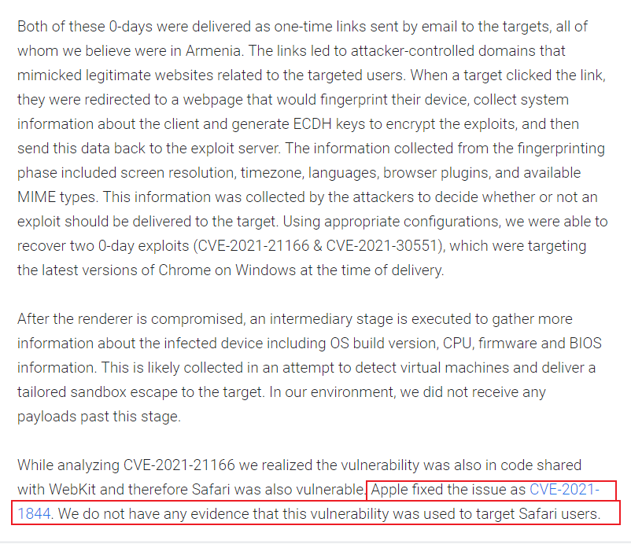</td>
</table></tr>
<table><tr>
<td>Quotes: <code>3</code></td>
<td>Replies: <code>0</code></td>
<td>Retweets: <code>10</code></td>
<td>Favorites: <code>36</code></td>
</tr></table>

---

# mavillon1
**https://twitter.com/mavillon1/status/1415460530370879488 _at 2021-07-14, 23:57:43_**
<blockquote>
Google Project Zero pubished four Browser RCE 0day POC #rce #0day 
Chrome CVE-2021-21166: https://t.co/ejbhvKB5Kt
Chrome CVE-2021-30551: https://t.co/3r50bIGmUp
Internet Explorer CVE-2021-33742: https://t.co/yFWN7b18fi
Safari CVE-2021-1879:
https://t.co/DnKKctA33u
</blockquote>

* https://googleprojectzero.github.io/0days-in-the-wild/0day-RCAs/2021/CVE-2021-21166.html
* https://googleprojectzero.github.io/0days-in-the-wild/0day-RCAs/2021/CVE-2021-30551.html
* https://googleprojectzero.github.io/0days-in-the-wild/0day-RCAs/2021/CVE-2021-33742.html
* https://googleprojectzero.github.io/0days-in-the-wild/0day-RCAs/2021/CVE-2021-1879.html

<table><tr>
<td>Quotes: <code>2</code></td>
<td>Replies: <code>0</code></td>
<td>Retweets: <code>81</code></td>
<td>Favorites: <code>141</code></td>
</tr></table>

---

# GraplSec
**https://twitter.com/GraplSec/status/1415371026318385153 _at 2021-07-14, 18:02:03_**
<blockquote>
One year ago #SigRed (CVE-2020-1350) was patched. The RCE vulnerability allows an attacker to gain access as Domain Admin and own the entire network. Read our writeup on the the first public exploit from our very own @chompie1337! https://t.co/GRabLNOqe1
</blockquote>

* https://www.graplsecurity.com/post/anatomy-of-an-exploit-rce-with-cve-2020-1350-sigred

<table><tr>
<td>Quotes: <code>8</code></td>
<td>Replies: <code>0</code></td>
<td>Retweets: <code>65</code></td>
<td>Favorites: <code>157</code></td>
</tr></table>

---

# maddiestone
**https://twitter.com/maddiestone/status/1415340721947566081 _at 2021-07-14, 16:01:38_**
<blockquote>
We're also publishing root cause analyses for the four 0-days:
Chrome CVE-2021-21166: https://t.co/Vd8rhn7KI4
Chrome CVE-2021-30551: https://t.co/pXh6OevyhM
Internet Explorer CVE-2021-33742: https://t.co/gL9ImaNdFJ
Safari CVE-2021-1879: https://t.co/LGdhTi2ElK
</blockquote>

* https://googleprojectzero.github.io/0days-in-the-wild/0day-RCAs/2021/CVE-2021-21166.html
* https://googleprojectzero.github.io/0days-in-the-wild/0day-RCAs/2021/CVE-2021-30551.html
* https://googleprojectzero.github.io/0days-in-the-wild/0day-RCAs/2021/CVE-2021-33742.html
* https://googleprojectzero.github.io/0days-in-the-wild/0day-RCAs/2021/CVE-2021-1879.html

<table><tr>
<td>Quotes: <code>4</code></td>
<td>Replies: <code>1</code></td>
<td>Retweets: <code>142</code></td>
<td>Favorites: <code>273</code></td>
</tr></table>

---

# theflow0
**https://twitter.com/theflow0/status/1415327862912135171 _at 2021-07-14, 15:10:32_**
<blockquote>
Yet another Linux kernel exploitation write-up!

CVE-2021-22555: Turning \x00\x00 into 10000$

https://t.co/Rwb26sGljK
</blockquote>

* https://google.github.io/security-research/pocs/linux/cve-2021-22555/writeup.html

<table><tr>
<td>Quotes: <code>20</code></td>
<td>Replies: <code>15</code></td>
<td>Retweets: <code>435</code></td>
<td>Favorites: <code>1281</code></td>
</tr></table>

---

# CyberWarship
**https://twitter.com/CyberWarship/status/1415273132873719810 _at 2021-07-14, 11:33:04_**
<blockquote>
CVE-2020-1181: SharePoint Remote Code Execution Through Web Parts 

Microsoft released a patch to correct CVE-2020-1181 – a remote code execution bug in the supported versions of Microsoft SharePoint Server.

#pentest #infosec #redteam
https://t.co/nT8AwmsHx9 https://t.co/7hfN5IBfBS
</blockquote>

* https://www.zerodayinitiative.com/blog/2020/6/16/cve-2020-1181-sharepoint-remote-code-execution-through-web-parts

<table><tr>
<td>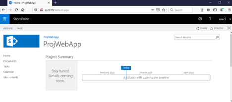</td>
<td>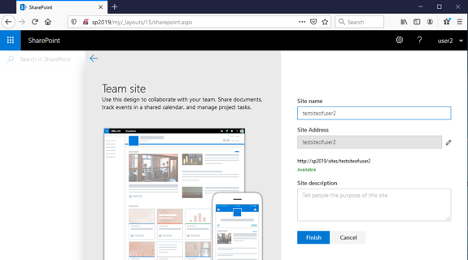</td>
</table></tr>
<table><tr>
<td>Quotes: <code>0</code></td>
<td>Replies: <code>0</code></td>
<td>Retweets: <code>19</code></td>
<td>Favorites: <code>43</code></td>
</tr></table>

---

# testanull
**https://twitter.com/testanull/status/1415240856978661377 _at 2021-07-14, 09:24:48_**
<blockquote>
Beside the active exploitation of CVE-2021-35464, Here is another view of the Pre-Auth RCE in ForgeRock AM =&gt; https://t.co/VQbHRIeALD
</blockquote>

* https://link.medium.com/iuhew6zIShb

<table><tr>
<td>Quotes: <code>2</code></td>
<td>Replies: <code>1</code></td>
<td>Retweets: <code>31</code></td>
<td>Favorites: <code>94</code></td>
</tr></table>

---

# MsftSecIntel
**https://twitter.com/MsftSecIntel/status/1415079092974673920 _at 2021-07-13, 22:42:01_**
<blockquote>
Microsoft has detected a 0-day remote code execution exploit being used to attack SolarWinds Serv-U FTP software in limited and targeted attacks. The vulnerability being exploited is CVE-2021-35211, reported by Microsoft and recently patched by SolarWinds. https://t.co/8Z1zAjfr8f
</blockquote>

* https://msft.it/6019nwox3

<table><tr>
<td>Quotes: <code>33</code></td>
<td>Replies: <code>3</code></td>
<td>Retweets: <code>257</code></td>
<td>Favorites: <code>427</code></td>
</tr></table>

---

# CyberWarship
**https://twitter.com/CyberWarship/status/1414847575727947777 _at 2021-07-13, 07:22:03_**
<blockquote>
CVE-2020-0668 - A Trivial Privilege Escalation Bug in Windows Service Tracing

...discuss an arbitrary file move vulnerability I found in Windows Service Tracing...

#infosec #pentest #redteam
https://t.co/5LiZjCQqSf https://t.co/i4tEFZSkRs
</blockquote>

* https://itm4n.github.io/cve-2020-0668-windows-service-tracing-eop/

<table><tr>
<td>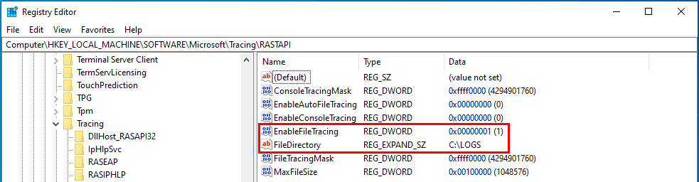</td>
<td>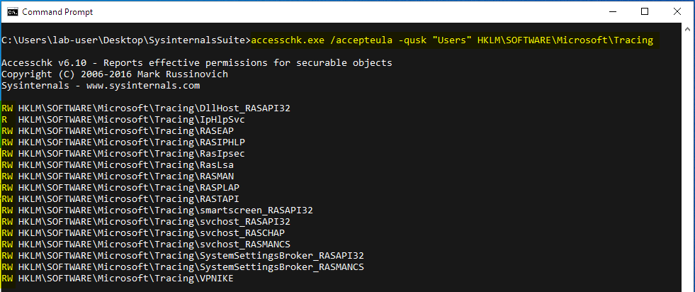</td>
<td>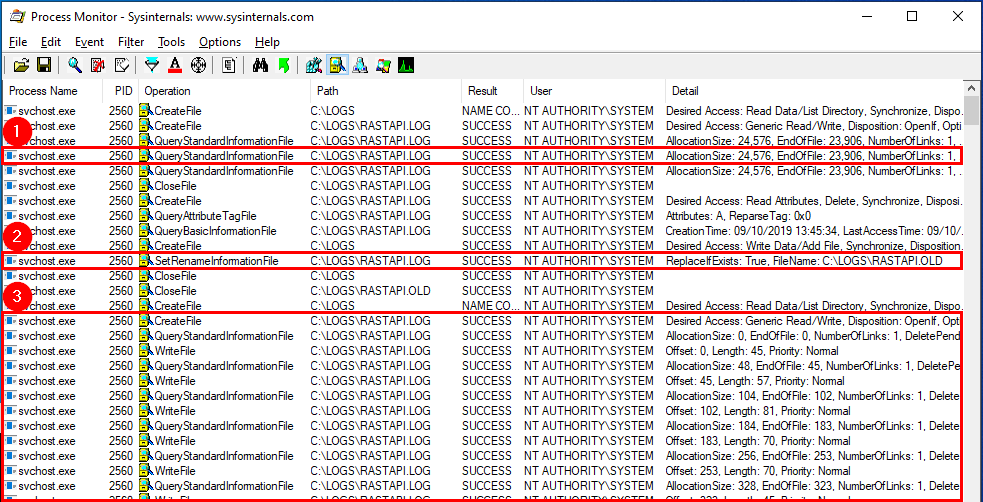</td>
</table></tr>
<table><tr>
<td>Quotes: <code>0</code></td>
<td>Replies: <code>1</code></td>
<td>Retweets: <code>59</code></td>
<td>Favorites: <code>127</code></td>
</tr></table>

---

# resenhacyber
**https://twitter.com/resenhacyber/status/1414829730918912002 _at 2021-07-13, 06:11:08_**
<blockquote>
CVE-2020-17453

WSO2 Management Console through 5.10 allows XSS via the carbon/admin/login.jsp msgId parameter.

Poc: https://&lt;company&gt;.com/carbon/admin/login.jsp?msgId=%27;alert(1)//

🥷🤖💉🐺

#bug #infosec #cybersecurity #bugbountylife #bugbounty #bugbountytip #securitybreach https://t.co/FO44dqYmb3
</blockquote>

<table><tr>
<td>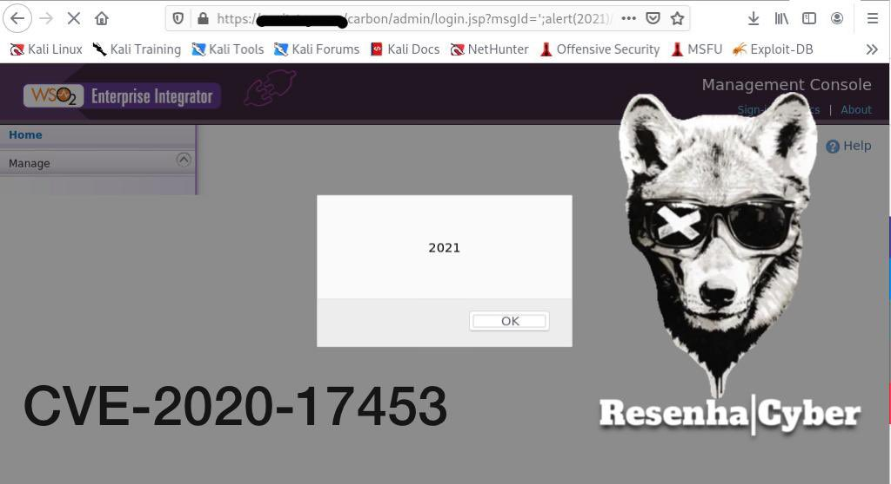</td>
</table></tr>
<table><tr>
<td>Quotes: <code>1</code></td>
<td>Replies: <code>4</code></td>
<td>Retweets: <code>30</code></td>
<td>Favorites: <code>82</code></td>
</tr></table>

---

# TheHackersNews
**https://twitter.com/TheHackersNews/status/1414809667717324807 _at 2021-07-13, 04:51:25_**
<blockquote>
US and Australian #cybersecurity agencies are warning of an actively exploited RCE #vulnerability (CVE-2021-35464) in ForgeRock's OpenAM access management solution that could be used to remotely execute code on an affected system.

Read: https://t.co/ejHVZnleQu

#infosec #hacking
</blockquote>

* https://thehackernews.com/2021/07/critical-rce-flaw-in-forgerock-access.html

<table><tr>
<td>Quotes: <code>5</code></td>
<td>Replies: <code>0</code></td>
<td>Retweets: <code>81</code></td>
<td>Favorites: <code>85</code></td>
</tr></table>

---

# TheHackersNews
**https://twitter.com/TheHackersNews/status/1414796985681383426 _at 2021-07-13, 04:01:01_**
<blockquote>
🔥 #Microsoft has found a new critical zero-day RCE #vulnerability (CVE-2021-35211) affecting #SolarWinds Serv-U that is being actively exploited by hackers.

Details — https://t.co/sImkO0cDQq

#infosec #hacking #cyberattack #cybersecurity
</blockquote>

* https://thehackernews.com/2021/07/a-new-critical-solarwinds-zero-day.html

<table><tr>
<td>Quotes: <code>19</code></td>
<td>Replies: <code>3</code></td>
<td>Retweets: <code>176</code></td>
<td>Favorites: <code>208</code></td>
</tr></table>

---

# campuscodi
**https://twitter.com/campuscodi/status/1414660767882878984 _at 2021-07-12, 18:59:44_**
<blockquote>
ACSC: Australian organizations compromised through ForgeRock vulnerability

Vulnerability is CVE-2021-35464, a pre-auth RCE in ForgeRock OpenAM, an identity management solution used across enterprises.

https://t.co/zUgX8X6XLw https://t.co/q18pKuYx9Y
</blockquote>

* https://therecord.media/acsc-australian-organizations-compromised-through-forgerock-zero-day/

<table><tr>
<td></td>
</table></tr>
<table><tr>
<td>Quotes: <code>4</code></td>
<td>Replies: <code>1</code></td>
<td>Retweets: <code>34</code></td>
<td>Favorites: <code>40</code></td>
</tr></table>

---

# wvuuuuuuuuuuuuu
**https://twitter.com/wvuuuuuuuuuuuuu/status/1414658957021433859 _at 2021-07-12, 18:52:33_**
<blockquote>
Metasploit module for VMware vCenter Server CVE-2021-21985, leveraging Ricter Z's SSRF-based RCE chain. https://t.co/Q0nWaMYomd
</blockquote>

* https://github.com/rapid7/metasploit-framework/blob/master/modules/exploits/linux/http/vmware_vcenter_vsan_health_rce.rb

<table><tr>
<td>Quotes: <code>1</code></td>
<td>Replies: <code>1</code></td>
<td>Retweets: <code>65</code></td>
<td>Favorites: <code>148</code></td>
</tr></table>

---

# campuscodi
**https://twitter.com/campuscodi/status/1414617089105612802 _at 2021-07-12, 16:06:11_**
<blockquote>
Microsoft discovers SolarWinds zero-day exploited in the wild

-CVE-2021-35211: RCE in Serv-U file transfer technology
-disabling SSH on affected products prevents exploitation
-affected products include: Serv-U Managed File Transfer and Serv-U Secure FTP

https://t.co/xj0psuKtgW https://t.co/O1PL84eTNl
</blockquote>

* https://therecord.media/microsoft-discovers-a-solarwinds-zero-day-exploited-in-the-wild/

<table><tr>
<td></td>
</table></tr>
<table><tr>
<td>Quotes: <code>22</code></td>
<td>Replies: <code>9</code></td>
<td>Retweets: <code>195</code></td>
<td>Favorites: <code>364</code></td>
</tr></table>

---

# USCERT_gov
**https://twitter.com/USCERT_gov/status/1414616391219433475 _at 2021-07-12, 16:03:24_**
<blockquote>
Forge ahead with applying a critical ForgeRock Access Management patch to protect against a pre-auth #RCE vulnerability (CVE-2021-35464) being exploited in the wild. https://t.co/REBRnSx4TC. #Cybersecurity #InfoSec
</blockquote>

* https://go.usa.gov/x6SXP

<table><tr>
<td>Quotes: <code>5</code></td>
<td>Replies: <code>0</code></td>
<td>Retweets: <code>36</code></td>
<td>Favorites: <code>36</code></td>
</tr></table>

---

# CyberWarship
**https://twitter.com/CyberWarship/status/1414321611310776321 _at 2021-07-11, 20:32:03_**
<blockquote>
Apache Tomcat RCE by deserialization (CVE-2020-9484) - write-up and exploit

...tomcat 7, 8, 9 and 10 released before April 2020. This most certainly means you have to update your instance of tomcat in order not to be vulnerable

#infosec #redteam #pentest
https://t.co/wfjfaJvpVZ https://t.co/iwUe7iYtFf
</blockquote>

* https://www.redtimmy.com/apache-tomcat-rce-by-deserialization-cve-2020-9484-write-up-and-exploit/

<table><tr>
<td>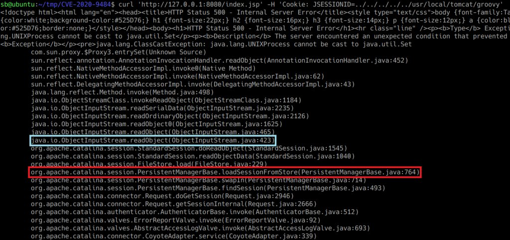</td>
<td></td>
</table></tr>
<table><tr>
<td>Quotes: <code>2</code></td>
<td>Replies: <code>0</code></td>
<td>Retweets: <code>123</code></td>
<td>Favorites: <code>274</code></td>
</tr></table>

---

# gentilkiwi
**https://twitter.com/gentilkiwi/status/1413420341658066944 _at 2021-07-09, 08:50:44_**
<blockquote>
Clarified Guidance for CVE-2021-34527 #printnightmare

So I presume all is OK, and:
- you will not change UNC path detection
- RestrictDriverInstallationToAdministrators &amp; driver no explaination?

➡️It's not, and you know it

&gt; https://t.co/ONmlFjuhn0 https://t.co/aqMDS8gdJa
</blockquote>

* https://msrc-blog.microsoft.com/2021/07/08/clarified-guidance-for-cve-2021-34527-windows-print-spooler-vulnerability/

<table><tr>
<td>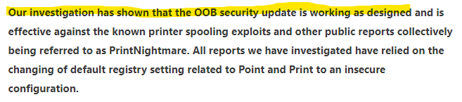</td>
</table></tr>
<table><tr>
<td>Quotes: <code>3</code></td>
<td>Replies: <code>9</code></td>
<td>Retweets: <code>48</code></td>
<td>Favorites: <code>125</code></td>
</tr></table>

---

# msftsecresponse
**https://twitter.com/msftsecresponse/status/1413302865569845250 _at 2021-07-09, 01:03:55_**
<blockquote>
MSRC just released a new blog post regarding CVE-2021-34527: https://t.co/i9g9fVQzTF
</blockquote>

* https://msrc-blog.microsoft.com/2021/07/08/clarified-guidance-for-cve-2021-34527-windows-print-spooler-vulnerability/

<table><tr>
<td>Quotes: <code>20</code></td>
<td>Replies: <code>8</code></td>
<td>Retweets: <code>175</code></td>
<td>Favorites: <code>241</code></td>
</tr></table>

---

# thezdi
**https://twitter.com/thezdi/status/1413190321878470665 _at 2021-07-08, 17:36:43_**
<blockquote>
Looking into CVE-2021-28474: a recently patched  #Microsoft #SharePoint remote code execution bug via a server-side control interpretation conflict. Read all of the details at https://t.co/9Wji4rYKoD
</blockquote>

* https://www.zerodayinitiative.com/blog/2021/7/7/cve-2021-28474-sharepoint-remote-code-execution-via-server-side-control-interpretation-conflict

<table><tr>
<td>Quotes: <code>4</code></td>
<td>Replies: <code>0</code></td>
<td>Retweets: <code>41</code></td>
<td>Favorites: <code>94</code></td>
</tr></table>

---

# wvuuuuuuuuuuuuu
**https://twitter.com/wvuuuuuuuuuuuuu/status/1412850102499217417 _at 2021-07-07, 19:04:48_**
<blockquote>
Sage X3 ERP unauthenticated RCE (CVE-2020-7388). Patch available. https://t.co/0sAsJdEMt7
</blockquote>

* https://www.rapid7.com/blog/post/2021/07/07/cve-2020-7387-7390-multiple-sage-x3-vulnerabilities/

<table><tr>
<td>Quotes: <code>1</code></td>
<td>Replies: <code>1</code></td>
<td>Retweets: <code>19</code></td>
<td>Favorites: <code>37</code></td>
</tr></table>

---

# wdormann
**https://twitter.com/wdormann/status/1412813044279910416 _at 2021-07-07, 16:37:33_**
<blockquote>
Confirmed.
If you have a system where PointAndPrint NoWarningNoElevationOnInstall = 1, then Microsoft's patch for #PrintNightmare CVE-2021-34527 does nothing to prevent either LPE or RCE. https://t.co/Ntxe9wpuke
</blockquote>

<table><tr>
<td>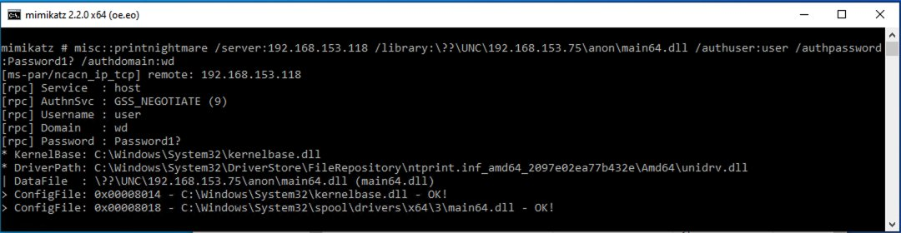</td>
<td>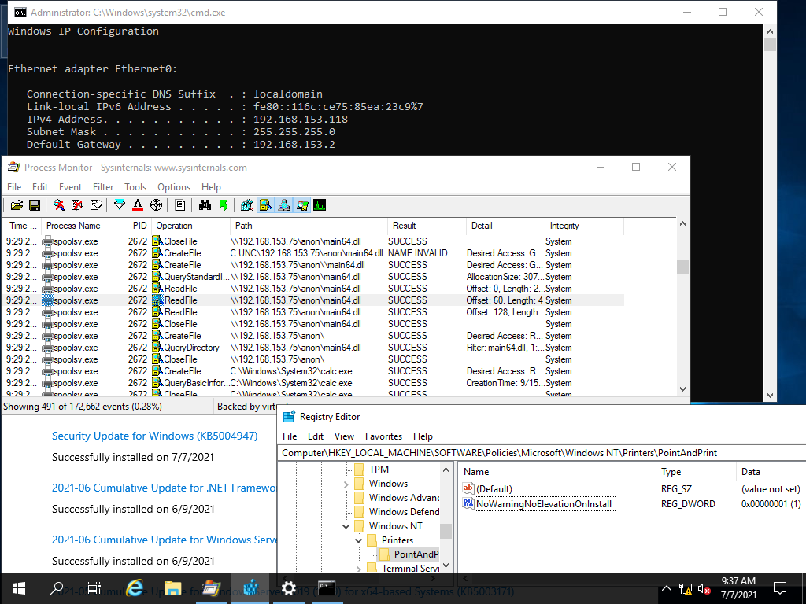</td>
</table></tr>
<table><tr>
<td>Quotes: <code>8</code></td>
<td>Replies: <code>7</code></td>
<td>Retweets: <code>107</code></td>
<td>Favorites: <code>207</code></td>
</tr></table>

---

# byteben
**https://twitter.com/byteben/status/1412678928620216321 _at 2021-07-07, 07:44:37_**
<blockquote>
Windows Defender Hunting queries for the Windows Print Spooler Remote Code Execution Vulnerability CVE-2021-34527 https://t.co/63oKIpamL9 #PrintNightmare
</blockquote>

* https://github.com/microsoft/Microsoft-365-Defender-Hunting-Queries/tree/master/Exploits/Print%20Spooler%20RCE

<table><tr>
<td>Quotes: <code>2</code></td>
<td>Replies: <code>0</code></td>
<td>Retweets: <code>29</code></td>
<td>Favorites: <code>35</code></td>
</tr></table>

---

# ptracesecurity
**https://twitter.com/ptracesecurity/status/1412653520508051457 _at 2021-07-07, 06:03:39_**
<blockquote>
Analyzing CVE-2021-1665 – Remote Code Execution Vulnerability in Windows GDI+  https://t.co/h9VLraIIrU  #Pentesting #Windows #Vulnerability #RCE #CVE #Infosec https://t.co/dU2fQmWa51
</blockquote>

* https://www.mcafee.com/blogs/other-blogs/mcafee-labs/analyzing-cve-2021-1665-remote-code-execution-vulnerability-in-windows-gdi/

<table><tr>
<td>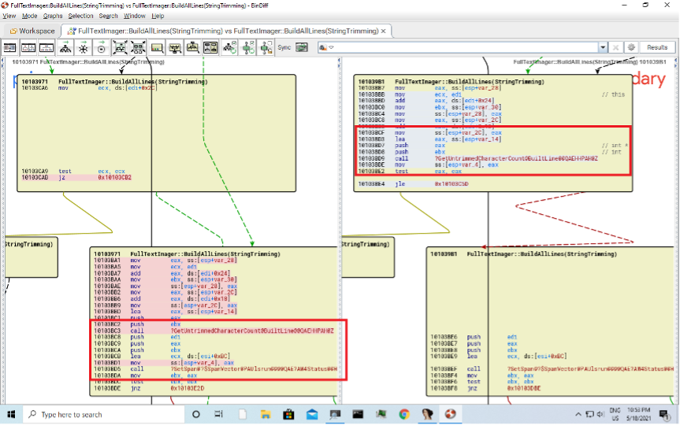</td>
<td>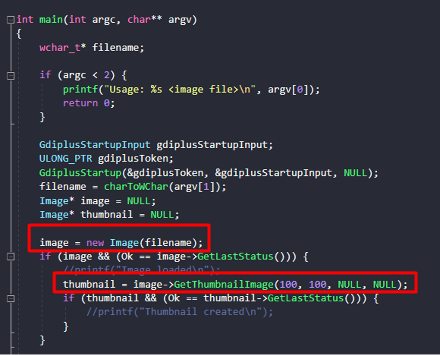</td>
<td></td>
<td>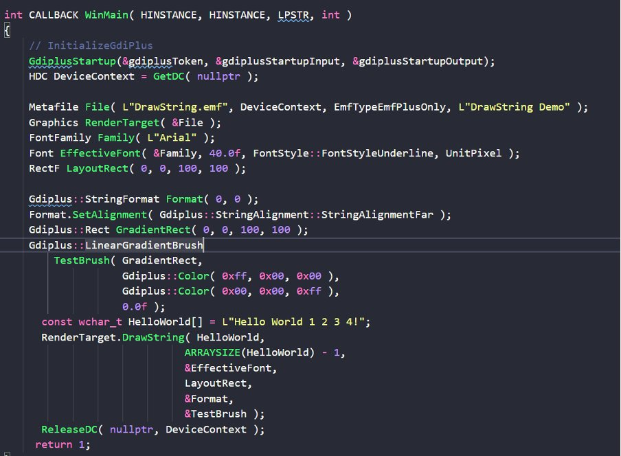</td>
</table></tr>
<table><tr>
<td>Quotes: <code>2</code></td>
<td>Replies: <code>0</code></td>
<td>Retweets: <code>16</code></td>
<td>Favorites: <code>31</code></td>
</tr></table>

---

# MsftSecIntel
**https://twitter.com/MsftSecIntel/status/1412524469755674626 _at 2021-07-06, 21:30:51_**
<blockquote>
Microsoft has released security updates to address CVE-2021-34527 (Windows Print Spooler Remote Code Execution Vulnerability)
</blockquote>

<table><tr>
<td>Quotes: <code>26</code></td>
<td>Replies: <code>15</code></td>
<td>Retweets: <code>311</code></td>
<td>Favorites: <code>535</code></td>
</tr></table>

---

# msftsecresponse
**https://twitter.com/msftsecresponse/status/1412520378644135937 _at 2021-07-06, 21:14:36_**
<blockquote>
Microsoft has released updates to protect against CVE-2021-34527.  Please see: https://t.co/QZATXCPXnx
</blockquote>

* https://msrc.microsoft.com/update-guide/vulnerability/CVE-2021-34527

<table><tr>
<td>Quotes: <code>63</code></td>
<td>Replies: <code>23</code></td>
<td>Retweets: <code>424</code></td>
<td>Favorites: <code>705</code></td>
</tr></table>

---

# hackerfantastic
**https://twitter.com/hackerfantastic/status/1412070601687277571 _at 2021-07-05, 15:27:21_**
<blockquote>
CVE-2021-34527 from a LPE perspective works on all non-domain joined workstations I have tested out of the box (including Windows 11). The domain-joined systems return a permission denied error indicating that once joined to a domain, the ACL check might not be bypassable. https://t.co/993ZrYtnsI
</blockquote>

<table><tr>
<td>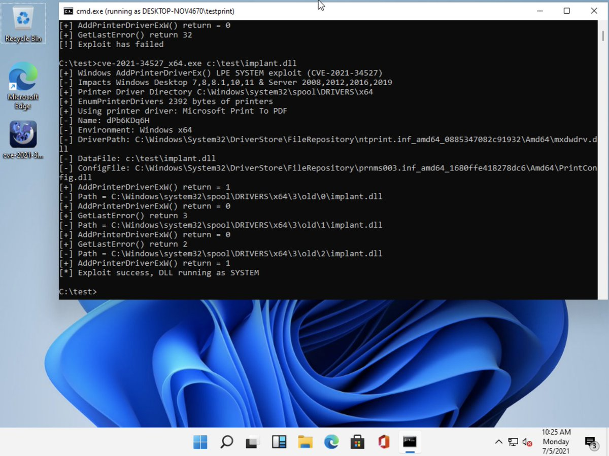</td>
</table></tr>
<table><tr>
<td>Quotes: <code>3</code></td>
<td>Replies: <code>4</code></td>
<td>Retweets: <code>32</code></td>
<td>Favorites: <code>93</code></td>
</tr></table>

---

# hackerfantastic
**https://twitter.com/hackerfantastic/status/1412059675789598721 _at 2021-07-05, 14:43:56_**
<blockquote>
Folks, CVE-2021-34527 is not just remote code execution - you can leverage the same ACL bypass check from local user perspective without any RPC involvement. I wrote a weaponized version of it and reliably gives me SYSTEM on Windows 8.1 out of the box,  10 has permission issues. https://t.co/7nRGNKr6gv
</blockquote>

<table><tr>
<td>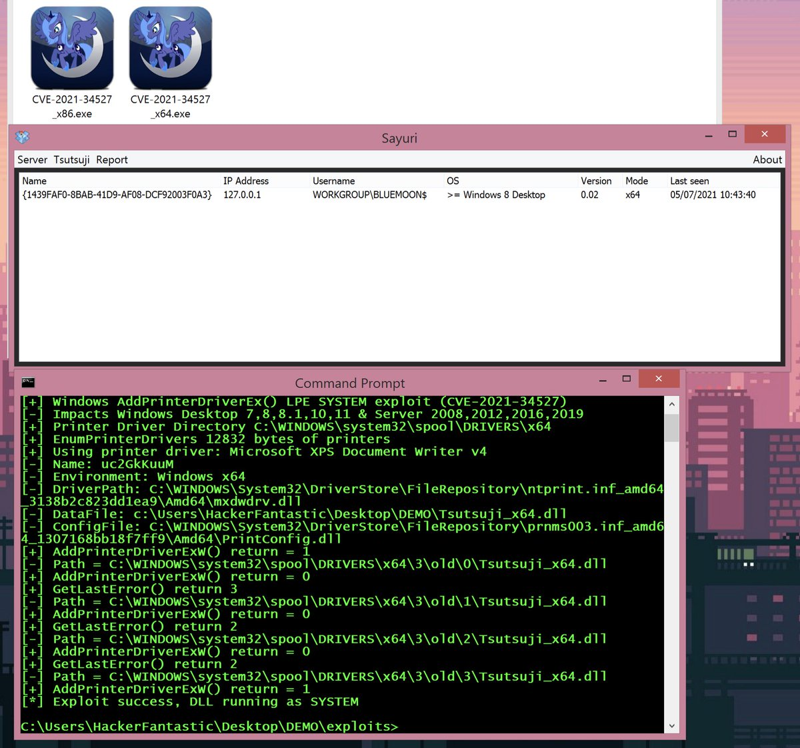</td>
</table></tr>
<table><tr>
<td>Quotes: <code>5</code></td>
<td>Replies: <code>5</code></td>
<td>Retweets: <code>65</code></td>
<td>Favorites: <code>187</code></td>
</tr></table>

---

# 404death
**https://twitter.com/404death/status/1412058823104208898 _at 2021-07-05, 14:40:32_**
<blockquote>
created poc for NT SYSTEM 

Local Privilege Escalation of PrintNightmare

https://t.co/YBTZjo0UNz

#PrintNightmare #cve-2021-1675 #lpe https://t.co/7cmrn9SJGs
</blockquote>

* https://github.com/sailay1996/PrintNightmare-LPE

<table><tr>
<td>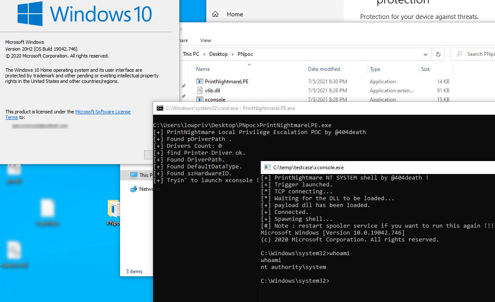</td>
<td>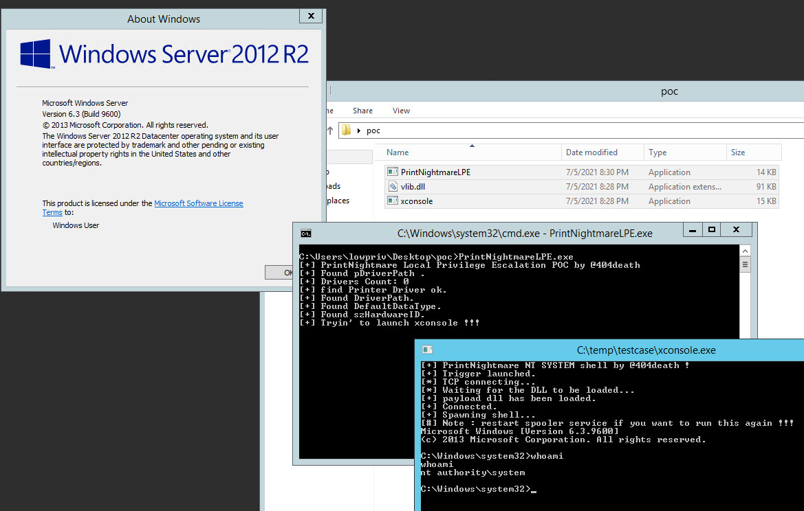</td>
</table></tr>
<table><tr>
<td>Quotes: <code>1</code></td>
<td>Replies: <code>1</code></td>
<td>Retweets: <code>24</code></td>
<td>Favorites: <code>78</code></td>
</tr></table>

---

# TheHackersNews
**https://twitter.com/TheHackersNews/status/1411941671596527625 _at 2021-07-05, 06:55:01_**
<blockquote>
#Microsoft is urging #Azure users to update the #PowerShell command line tool as soon as possible to protect against a critical RCE #vulnerability (CVE-2021-26701) that impacts . NET Core.

Read: https://t.co/RGJnDzys84

#infosec #cybersecurity
</blockquote>

* https://thehackernews.com/2021/07/microsoft-urges-azure-users-to-update.html

<table><tr>
<td>Quotes: <code>6</code></td>
<td>Replies: <code>1</code></td>
<td>Retweets: <code>156</code></td>
<td>Favorites: <code>182</code></td>
</tr></table>

---

# CyberWarship
**https://twitter.com/CyberWarship/status/1411422504602775553 _at 2021-07-03, 20:32:02_**
<blockquote>
Microsoft Windows LNK Remote Code Execution Vulnerability - CVE-2020-1299 

#infosec #pentest #redteam
https://t.co/H8JimuuOyJ https://t.co/FDzGWxLtQn
</blockquote>

* https://blog.vincss.net/2020/06/cve49-microsoft-windows-lnk-remote-code-execution-vuln-cve-2020-1299-eng.html?m=1

<table><tr>
<td>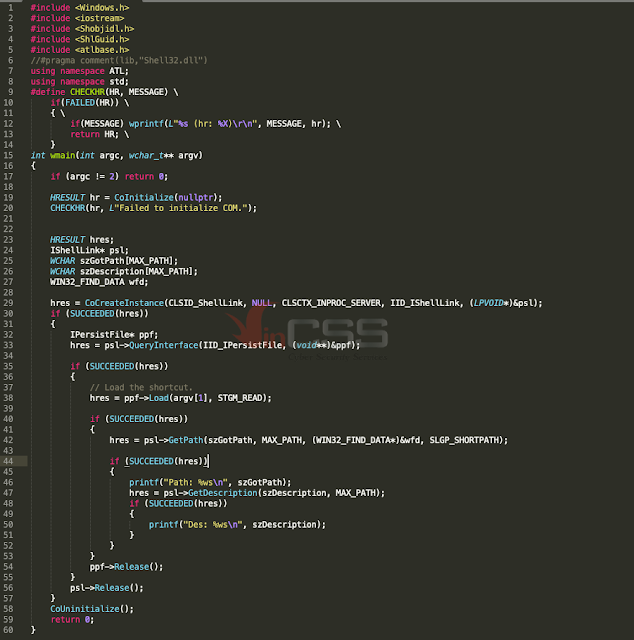</td>
<td>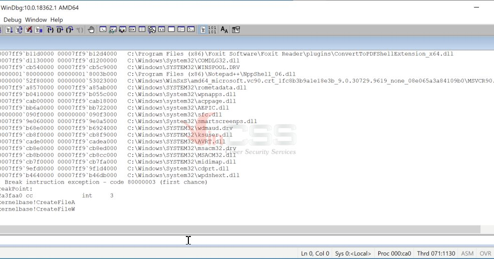</td>
</table></tr>
<table><tr>
<td>Quotes: <code>1</code></td>
<td>Replies: <code>0</code></td>
<td>Retweets: <code>69</code></td>
<td>Favorites: <code>129</code></td>
</tr></table>

---

# SecGuru_OTX
**https://twitter.com/SecGuru_OTX/status/1410941602114252801 _at 2021-07-02, 12:41:06_**
<blockquote>
Hunting Query:

"Windows Print Spooler Remote Code Execution Vulnerability" - CVE-2021-34527

#PrinterNightmare 

(Source: Microsoft Threat Analytics) https://t.co/9wPjENGISW
</blockquote>

<table><tr>
<td>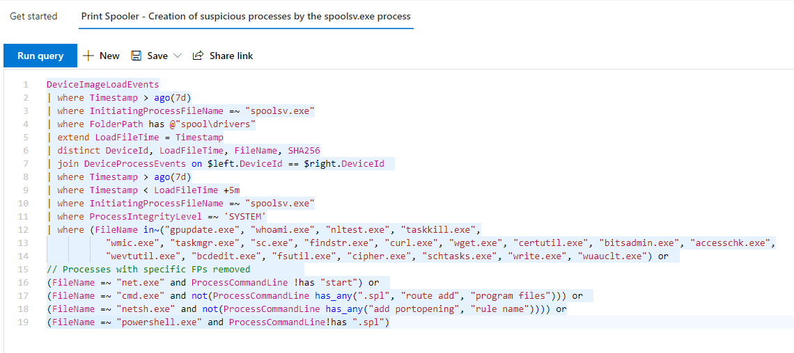</td>
</table></tr>
<table><tr>
<td>Quotes: <code>2</code></td>
<td>Replies: <code>1</code></td>
<td>Retweets: <code>29</code></td>
<td>Favorites: <code>104</code></td>
</tr></table>

---

# anyrun_app
**https://twitter.com/anyrun_app/status/1410940562191101955 _at 2021-07-02, 12:36:58_**
<blockquote>
Testing #PrintNightmare vulnerability on a live system is easy! Try ANYRUN to see how it works. You can take a look at the implementation of CVE-2021-1675 local privilege escalation written in PowerShell, made by @_johnhammond and @calebjstewart
https://t.co/uIqDo7QFdb
</blockquote>

* https://app.any.run/tasks/83734a89-3f3e-4ab1-9d6b-d43230d2a900

<table><tr>
<td>Quotes: <code>6</code></td>
<td>Replies: <code>1</code></td>
<td>Retweets: <code>83</code></td>
<td>Favorites: <code>186</code></td>
</tr></table>

---

# cyb3rops
**https://twitter.com/cyb3rops/status/1410849858882347009 _at 2021-07-02, 06:36:33_**
<blockquote>
CVE-2021-34527 - Security Update Guide - Microsoft - Windows Print Spooler Remote Code Execution Vulnerability https://t.co/Puv4Dqrb1l
</blockquote>

* https://msrc.microsoft.com/update-guide/vulnerability/CVE-2021-34527

<table><tr>
<td>Quotes: <code>0</code></td>
<td>Replies: <code>2</code></td>
<td>Retweets: <code>56</code></td>
<td>Favorites: <code>133</code></td>
</tr></table>

---

# TheHackersNews
**https://twitter.com/TheHackersNews/status/1410836661206884352 _at 2021-07-02, 05:44:06_**
<blockquote>
🔥 WATCH OUT! Microsoft warns of a critical #PrintNightmare RCE vulnerability (CVE-2021-34527) being exploited in the wild.

Details: https://t.co/E42gdYBGYU

It is separate from the Windows Print Spooler issue (CVE-2021-1675) Microsoft patched recently.

#infosec #cybersecurity
</blockquote>

* https://thehackernews.com/2021/07/microsoft-warns-of-critical.html

<table><tr>
<td>Quotes: <code>12</code></td>
<td>Replies: <code>7</code></td>
<td>Retweets: <code>166</code></td>
<td>Favorites: <code>192</code></td>
</tr></table>

---

# MsftSecIntel
**https://twitter.com/MsftSecIntel/status/1410829638943662080 _at 2021-07-02, 05:16:12_**
<blockquote>
Microsoft has assigned CVE-2021-34527 to the remote code execution vulnerability that affects Windows Print Spooler. Get more info here:
</blockquote>

<table><tr>
<td>Quotes: <code>20</code></td>
<td>Replies: <code>6</code></td>
<td>Retweets: <code>157</code></td>
<td>Favorites: <code>292</code></td>
</tr></table>

---

# campuscodi
**https://twitter.com/campuscodi/status/1410770644317446149 _at 2021-07-02, 01:21:47_**
<blockquote>
The PrintNightmare RCE gets its own CVE (as CVE-2021-34527) but there's no other new information in the Microsoft advisory
</blockquote>

<table><tr>
<td>Quotes: <code>1</code></td>
<td>Replies: <code>2</code></td>
<td>Retweets: <code>29</code></td>
<td>Favorites: <code>57</code></td>
</tr></table>

---

# calebjstewart
**https://twitter.com/calebjstewart/status/1410765738588131328 _at 2021-07-02, 01:02:17_**
<blockquote>
I've been working on a pure PowerShell PoC for CVE-2021-1675 (#PrintNightmare) Local Privilege Escalation tonight with @_johnhammond and I think it's come out pretty good! Includes bundled DLL to add a local admin user plus the option of using your own DLL https://t.co/hwb1R1BmAI
</blockquote>

* https://github.com/calebstewart/CVE-2021-1675

<table><tr>
<td>Quotes: <code>0</code></td>
<td>Replies: <code>2</code></td>
<td>Retweets: <code>9</code></td>
<td>Favorites: <code>38</code></td>
</tr></table>

---

# hlldz
**https://twitter.com/hlldz/status/1410541768412647427 _at 2021-07-01, 10:12:18_**
<blockquote>
I just released Local Privilege Escalation Edition of CVE-2021-1675 #PrintNightmare 

This edition of exploit automatically finds UNIDRV.DLL, no changes are required in the code.

https://t.co/kl7LAh7tdo
</blockquote>

* https://github.com/hlldz/CVE-2021-1675-LPE

<table><tr>
<td>Quotes: <code>5</code></td>
<td>Replies: <code>2</code></td>
<td>Retweets: <code>135</code></td>
<td>Favorites: <code>298</code></td>
</tr></table>

---

